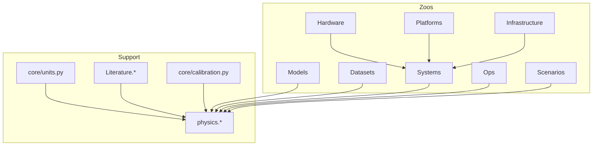

# MLSysSim Data Model

Six **zoos** (typed registries) plus support layers. Book LEGO cells and
tutorials should prefer zoos + `mlsysim.physics.*` + explicit operands.
`core/constants.py` is a retired compatibility re-export for units; physics
constants live in `physics/constants.py`, and domain values live in registries.

## Zoos

| Zoo | Registry | Role |
|-----|----------|------|
| Hardware | `Hardware.Cloud.*`, `Hardware.Edge.*`, … | Chip/board/appliance specs (datasheet truth). **Canonical paths only** — no bare `Hardware.H100`. |
| Models | `Models.*` | Workloads and architectures (parameters, layers, FLOPs). |
| Datasets | `Datasets.*` | Data zoo — ImageNet, MNIST, CIFAR, etc. |
| Platforms | `Platforms.*` | Abstract deployment envelopes (RAM, storage, latency ranges). Replaces `Systems.Tiers`. |
| Infrastructure | `Infrastructure.Grids.*`, `Infrastructure.Datacenters.*`, `Infrastructure.Pricing.*`, `Infrastructure.Capacity.*` | Site/energy/economics layer — utility grid, facility PUE, pricing, and capacity facts. **Not** GPU fleets or network fabrics. |
| Systems | `Systems.Nodes.*`, `Systems.Racks.*`, `Systems.Fabrics.*`, `Systems.Clusters.*`, `Systems.Pods.*`, `Systems.Storage.*` | Composed physical systems and topology. Fleets live in `Systems.Clusters` (type `Fleet`); rack-level aggregates live in `Systems.Racks`. |
| Ops | `Ops.Monitoring.*`, `Ops.TrainingRunOverheads.*` | Operational policies, thresholds, and goodput-loss profiles. |
| Scenarios | `Scenarios.*` | Workload statistics, comparison anchors, and reusable scenario profiles. |

## Support (not zoos)

- **`mlsysim.core.units`** — pint units, byte/bit widths, precision map.
- **`mlsysim.physics.*`** — physical constants and formulas.
- **`Literature.*`** — cited appendix scalars (MFU bands, Chinchilla, communication, batch-size anchors).
- **`Systems.Reliability` / `Orchestration`** — MTTF, recovery, scheduling assumptions.
- **`Ops.Monitoring` / `TrainingRunOverheads`** — PSI, KS, drift thresholds, training goodput-loss profiles.
- **`mlsysim.engine.calibration`** — solver/engine default kwargs (not appendix tables).
- **`Infrastructure.Pricing`** — cloud, storage, labeling, fleet economics (`PricePoint.rate`).
- **Regional carbon / PUE / fleet / fabrics** — `Infrastructure.Grids`, `FacilityCooling`, `Systems.Clusters`, `Systems.Fabrics`.

## Relationships

- **Fleet ≠ datacenter:** `Systems.Clusters.*` (Fleet) references optional `Infrastructure.Datacenters.*` / grid for carbon and PUE.
- **NVL72** is `Hardware.Cloud.GB200_NVL72`, not an Infrastructure rack entry.
- **Networks/fabrics:** interconnect specs on Hardware; topology instances under `Systems.Fabrics`.

## Ownership Rule

When adding a number, classify the semantic object before choosing a namespace:

| Question | Home |
|----------|------|
| Is this a datasheet fact about a chip, board, appliance, NIC, or storage device? | `Hardware.*` |
| Is this a composed physical setup such as a node, rack, cluster, fabric, or storage path? | `Systems.*` |
| Is this a grid, datacenter, price, capacity, or facility-envelope fact? | `Infrastructure.*` |
| Is this an operational threshold, run-overhead profile, or monitoring policy? | `Ops.*` |
| Is this a cited scalar from a paper/table used as a literature anchor? | `Literature.*` |
| Is this a reusable teaching/problem setting that combines assumptions but is not itself a physical system? | `Scenarios.*` |
| Is this a one-off knob that defines a local exercise? | Keep it local in the LEGO cell and label it as a scenario assumption. |

`Provenance` is metadata attached to entries in any of these homes. It does not
decide the namespace; the type of thing being modeled does.

## Book LEGO conventions

1. One class per `{python}` cell (already enforced).
2. Import `from mlsysim import *` or explicit zoo paths — not `from mlsysim.core.constants import *`.
3. Use `mlsysim.physics.*` for derived quantities; registries for operands.
4. `Scenario.evaluate()` reserved for labs; capstone book cells only (≤5–10 total).

## Migration tiers (QMD)

| Tier | Source | Target |
|------|--------|--------|
| A | GPU/chip constants (`H100_*`, `NVLINK_*`, …) | `Hardware.*` |
| B | Network/fabric (`INFINIBAND_*`, `ETHERNET_*`, …) | `Hardware.Networks.*` / `Systems.Fabrics.*` |
| C | Model/dataset constants | `Models.*` / `Datasets.*` |
| D | Economics/reliability/ops/literature | `Infrastructure.Pricing.*`, `Systems.Reliability.*`, `Ops.*`, `Literature.*`, `Scenarios.*` |
| Platforms | `Systems.Tiers`, tier latency/RAM strings | `Platforms.*` |

## No aliases

Hard-delete migrated symbols from `constants.py` after parity tests pass.
Do not keep `Hardware.H100`, `Infrastructure.Quebec`, or `Systems.Cloud = …` shims.

## Verification gates (every commit)

- L1: pytest, exec affected QMD cells, `lego_focal_verify.py`
- L2: `test_registry_parity.py` for deleted symbols
- L3–L5: fmt, HTML build, `audit_lego_html.py` when QMD touched
- L6: chapter sign-off before QMD commits

See `book/docs/LEGO_CELLS.md` and `book/tools/audit/artifacts/registry_migration_manifest.json`.
