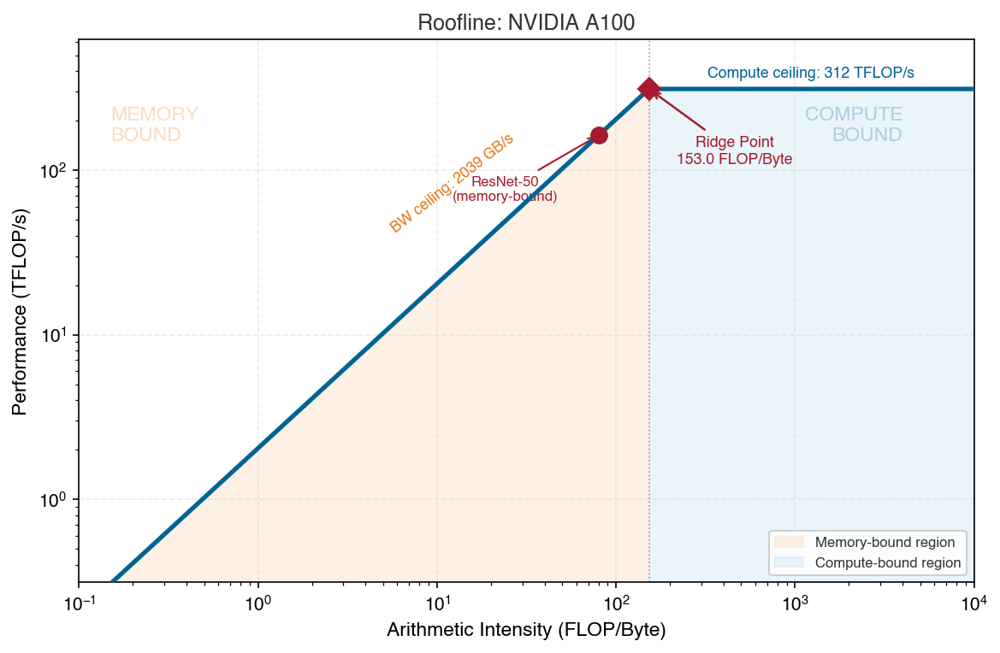

::: {.callout-note}
## Prerequisites
Complete the [Getting Started](../getting-started.qmd) guide before this tutorial. It introduces the `Engine.solve` API and the MLSys Zoo.
:::

In this tutorial, you will model the performance of **ResNet-50** on an **NVIDIA A100** GPU
using the analytical roofline model. By the end, you will understand:

- What it means for a model to be **memory-bound** vs. **compute-bound**
- How changing **batch size** shifts the bottleneck
- Why the A100's memory bandwidth matters as much as its peak TFLOP/s

::: {.callout-note}
## Background: ResNet-50 and the A100

**ResNet-50** is a 50-layer convolutional neural network (CNN) commonly used for image classification. It has roughly 25 million parameters and requires about 8 billion floating-point operations (8 GFLOP) per inference. It is a standard benchmark workload because its size is well-characterized and widely published.

The **NVIDIA A100** is a datacenter GPU designed for ML training and inference. Its key specifications: 312 TFLOP/s peak compute (FP16 Tensor Core), 2.0 TB/s HBM2e (High Bandwidth Memory) bandwidth, and 80 GB of memory. These two numbers (compute speed and memory speed) are what the roofline model uses to predict performance.

See the [Glossary](../glossary.qmd) for definitions of terms like FLOP/s, HBM, and Tensor Core.
:::

::: {.callout-tip}
## What is the roofline model?
Every GPU has two speed limits: how fast it can compute (FLOP/s) and how fast it can load
data from memory (bytes/s). Your model's actual throughput is determined by whichever limit
you hit first. The roofline model tells you exactly which one, and by how much.
:::

---

## 1. Setup

```{python}
#| echo: false
#| output: false
# Build-system path setup — hidden from students
import sys, os, importlib.util
current_dir = os.getcwd()
root_path = os.path.abspath(os.path.join(current_dir, "../../../"))
if not os.path.exists(os.path.join(root_path, "mlsysim")):
    root_path = os.path.abspath("../../")
package_path = os.path.join(root_path, "mlsysim")
init_file = os.path.join(package_path, "__init__.py")
spec = importlib.util.spec_from_file_location("mlsysim", init_file)
mlsysim = importlib.util.module_from_spec(spec)
sys.modules["mlsysim"] = mlsysim
spec.loader.exec_module(mlsysim)
Engine = mlsysim.Engine
```

After `pip install mlsysim`, the import is simple:

```python
import mlsysim
from mlsysim import Engine
```

---

## 2. Select Workload and Hardware

Pull vetted specifications directly from the **MLSys Zoo**—no need to look up datasheets.

```{python}
# Load ResNet-50 from the Model Zoo
model = mlsysim.Models.ResNet50

# Load NVIDIA A100 from the Silicon Zoo
hardware = mlsysim.Hardware.Cloud.A100

print(f"Model:    {model.name} ({model.architecture})")
print(f"Hardware: {hardware.name} ({hardware.release_year})")
print(f"")
print(f"Model FLOPs (inference): {model.inference_flops}")
print(f"Hardware Peak TFLOP/s:   {hardware.compute.peak_flops.to('TFLOPs/s'):.0f}")
print(f"Hardware Memory BW:       {hardware.memory.bandwidth.to('TB/s'):.1f}")
```

---

## 3. Solve the Performance Profile

The `Engine.solve` method applies the **Iron Law of ML Systems**—it calculates which of the
two hardware speed limits (compute or memory) you hit first, and returns your latency from there.

```{python}
profile = Engine.solve(
    model=model,
    hardware=hardware,
    batch_size=1,
    precision="fp16"
)

print(f"Bottleneck: {profile.bottleneck}")
print(f"Latency:    {profile.latency.to('ms'):~.3f} per inference")
print(f"Throughput: {profile.throughput:.0f} images/sec")
```

::: {.callout-note}
## Why "Memory Bound"?
At batch size 1, ResNet-50 performs ~8 GFLOPs of computation but loads ~50 MB of weights (25.6M parameters at fp16).
Its **arithmetic intensity** (FLOPs/Byte) is far below the A100's roofline ridge point.
The A100's memory bandwidth (2 TB/s) becomes the bottleneck, not its 312 TFLOP/s compute.
:::

---

## 4. Sweep Batch Sizes

The bottleneck changes as batch size grows. Run the sweep and see when compute takes over:

```{python}
print(f"{'Batch':>6}  {'Bottleneck':<16}  {'Throughput':>12}  {'Latency':>10}")
print("-" * 52)

for batch in [1, 4, 16, 32, 64, 128, 256]:
    p = Engine.solve(
        model=model,
        hardware=hardware,
        batch_size=batch,
        precision="fp16"
    )
    print(
        f"{batch:>6}  {p.bottleneck:<16}  "
        f"{p.throughput:>10.0f}/s  "
        f"{p.latency.to('ms').magnitude:>8.2f} ms"
    )
```

::: {.callout-tip}
## The crossover point
Watch where the output switches from `Memory Bound` to `Compute Bound`. That is the **ridge
point** of the roofline—the batch size at which you've saturated both resources equally.
Beyond that point, adding more compute (or a bigger GPU) pays off. Below it, more memory
bandwidth is what matters.
:::

---

## 5. Visualizing the Roofline

MLSYSIM includes built-in visualization tools. The roofline chart plots the hardware's two
ceilings and shows where your workloads sit relative to them:

```python
import matplotlib.pyplot as plt

fig, ax = mlsysim.plot_roofline(hardware, workloads=[model])
ax.set_title(f"Roofline: {model.name} on {hardware.name}")
plt.show()
```

{#fig-roofline-hello}

---

## Your Turn

::: {.callout-caution}
## Exercises

**Exercise 1: Predict before you compute.**
Before running the code, predict: Will ResNet-50 at batch_size=64 be memory-bound or compute-bound on the A100? Write down your prediction, then verify with `Engine.solve(...)`. Were you right? Why or why not?

**Exercise 2: Hardware comparison.**
Before running: which GPU do you predict will have the highest ridge point -- the V100, A100, or H100? (Hint: compare their compute-to-bandwidth ratios.) Then run the same ResNet-50 analysis on `mlsysim.Hardware.Cloud.H100` and `mlsysim.Hardware.Cloud.V100`. Which gives the lowest latency at batch_size=1? At batch_size=256? What explains the difference?

**Exercise 3: Precision effect.**
Before running: will switching from `precision="fp16"` to `precision="int8"` change the bottleneck classification for ResNet-50 on the A100 at batch_size=1? Write your prediction and reasoning, then compare both. How does quantization change the arithmetic intensity?

**Self-check:** If a model's arithmetic intensity is 50 FLOP/byte and the hardware's ridge point is 156 FLOP/byte, is the model compute-bound or memory-bound?
:::

---

## What You Learned

- **Roofline model**: Performance is bounded by $\max\left(\frac{\text{FLOPs}}{\text{Peak}},\ \frac{\text{Bytes}}{\text{BW}}\right)$ (whichever takes longer, computing or loading data, determines your runtime)
- **Batch size matters**: Small batches are memory-bound; large batches become compute-bound
- **The ridge point**: The crossover batch size where memory and compute are equally saturated
- **Practical implication**: If you are memory-bound, reducing data movement (quantization, larger batches) helps more than a faster GPU

---

## Next Steps

- **[Sustainability Lab](sustainability.qmd)**: Calculate the carbon footprint of training across different grid regions
- **[LLM Serving Lab](llm_serving.qmd)**: Model the two phases of LLM inference and discover the KV-cache memory wall
- **[Math Foundations](../math.qmd)**: The complete set of equations used by all solvers
- **[Silicon Zoo](../zoo/hardware.qmd)**: Browse all vetted hardware specs and compare alternatives
