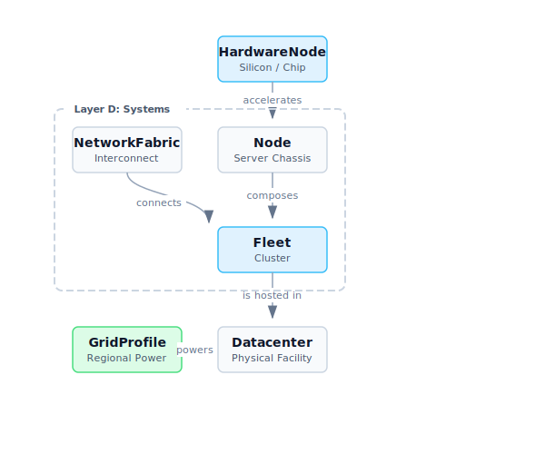

The MLSys Zoo is a centralized, vetted registry of specifications used throughout
the `mlsysim` platform. Every entry is strictly typed with `pint.Quantity` for
dimensional correctness, provenance-tracked, and validated against official sources.

::: {.callout-tip}
## Why a Zoo?
A persistent problem in ML systems literature is **spec staleness**—people cite
outdated or incorrect hardware numbers. The MLSys Zoo fixes this by being the
authoritative source for the `mlsysim` ecosystem. When a spec changes (e.g., NVIDIA
publishes an updated datasheet), it is updated once here and propagates automatically
to every solver and tutorial.
:::

---

## The Four Catalogs

| Zoo | Description | Key Data | Python Access |
|:----|:------------|:---------|:--------------|
| [⚡ Silicon Zoo](hardware.qmd) | AI accelerators from microcontrollers to datacenter GPUs | Peak FLOPs, Memory BW, Capacity, TDP | `mlsysim.Hardware.Cloud.A100` |
| [🧠 Model Zoo](models.qmd) | Reference ML workloads: transformers, CNNs, TinyML | Parameters, Inference FLOPs, Layers | `mlsysim.Models.ResNet50` |
| [🕸️ Fleet Zoo](fleets.qmd) | Multi-node cluster configurations and deployment tiers | Node type, Count, Network Fabric | `mlsysim.Systems.Clusters.Frontier_8K` |
| [🌍 Infrastructure Zoo](infra.qmd) | Regional electricity grids and datacenter profiles | Carbon Intensity, PUE | `mlsysim.Infra.Grids.Quebec` |

---

## System Composition Hierarchy

ML systems are structurally composed of smaller parts. The `mlsysim` registry reflects this physical reality. Before a workload can be evaluated, the structural components are combined into a coherent system.

Here is how the components in the Zoo relate to each other:

{fig-align="center" width="100%"}

1. **HardwareNode (Silicon):** The fundamental unit of compute (e.g., an H100 GPU or a DGX Spark GB10 superchip). It provides FLOPs and Memory Bandwidth.
2. **Node:** A single server chassis. It contains one or more `HardwareNode`s connected by a high-speed intra-node bus (like NVLink).
3. **NetworkFabric:** The inter-node networking (e.g., InfiniBand NDR or 100GbE) that allows servers to communicate.
4. **Fleet (Cluster):** A collection of `Node`s connected by a `NetworkFabric`. This is the top-level entity used for distributed training and cluster reliability models.
5. **Datacenter & GridProfile (Infra/Regions):** The physical facility and regional power grid that hosts the `Fleet`. It dictates the Power Usage Effectiveness (PUE) and the carbon intensity of the electricity consumed.

---

## Accessing Zoo Entries in Code

All Zoo entries follow the same registry pattern:

```python
import mlsysim

# Hardware
a100  = mlsysim.Hardware.Cloud.A100
jetson = mlsysim.Hardware.Edge.JetsonAGX

# Models
resnet = mlsysim.Models.ResNet50
llama  = mlsysim.Models.Language.Llama3_70B

# Infrastructure
quebec = mlsysim.Infra.Grids.Quebec
virginia = mlsysim.Infra.Grids.US_Average

# Systems (Fleets)
cluster = mlsysim.Systems.Clusters.Frontier_8K
```

::: {.callout-note}
## Type Safety
All quantities (FLOPs, bandwidth, capacity) are `pint.Quantity` objects. You can convert
between units and MLSYSIM will catch dimensional errors at runtime:
```python
hw.compute.peak_flops.to("TFLOPs/s")   # → 312.0 TFLOPs/s
hw.memory.bandwidth.to("TB/s")          # → 2.0 TB/s
hw.memory.bandwidth.to("FLOP/s")        # → pint.DimensionalityError ✓
```
:::
