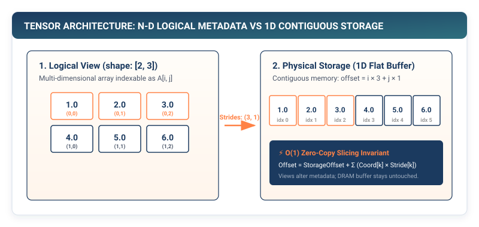

## Purpose {.unnumbered}

_Why does memory layout matter more than arithmetic throughput?_

Every neural network operation, from simple scalar addition to multi-head self-attention, is ultimately executed as sequential or strided memory accesses across a contiguous one-dimensional buffer. When deep learning frameworks execute matrix multiplications or layer transformations, the physical arrangement of numbers in memory dictates whether hardware caches are saturated with high-bandwidth throughput or stalled waiting on uncoalesced memory fetches. The tensor abstraction creates the illusion of multidimensional geometry over linear physical storage, mapping multi-axis coordinate indices to flat memory offsets through stride arithmetic. In modern machine learning systems, layout choices determine whether computation is memory-bandwidth bound or compute bound, making the tensor data structure the fundamental physical bridge between algorithm math and machine memory.

::: {.callout-learning-objectives}
## Learning Objectives

- **Construct** a foundational `Tensor` data structure from raw linear memory buffers with arbitrary dimensional shapes and data types.
- **Derive** stride equations and coordinate-to-offset mapping functions that govern multidimensional indexing without physical memory movement.
- **Implement** NumPy-based broadcasting semantics to execute element-wise arithmetic across mismatched tensor shapes without allocating duplicate storage.
- **Analyze** the memory-access patterns and cache implications of matrix multiplication ($O(n^3)$ operational complexity).
- **Differentiate** zero-cost memory views (`reshape`, `transpose`) from physical data copies (`contiguous`), diagnosing silent memory footprint expansion.
- **Evaluate** how production frameworks (PyTorch ATen) implement tensor storage sharing and reference counting in native C++.
:::

---

## The Illusion of Multidimensional Space

When we write $X \in \mathbb{R}^{B \times S \times D}$ to denote a batch of sequences in a language model, mathematics suggests a three-dimensional cubic lattice of numbers floating in space. Physical hardware, however, knows nothing of cubes, matrices, or high-dimensional hyperplanes. Dynamic Random-Access Memory (DRAM), CPU cache lines, and GPU High Bandwidth Memory (HBM) are strictly flat, one-dimensional arrays of byte addresses.[^dram-hierarchy]

[^dram-hierarchy]: Memory latency is governed by physical distance and silicon hierarchy: CPU registers take $<0.5\text{ ns}$ (<1 clock cycle), L1 data cache takes $\sim 0.5\text{--}1\text{ ns}$ (4--5 cycles), L2 cache takes $\sim 3\text{--}4\text{ ns}$ (12--14 cycles), L3 cache takes $\sim 10\text{--}20\text{ ns}$ (40--60 cycles), while main DRAM takes $\sim 50\text{--}100\text{ ns}$ (200--300 cycles). Uncoalesced or strided memory traversals stall execution pipelines waiting on DRAM roundtrips.

Every tensor library begins with a single design challenge: **how to project multidimensional mathematical operations onto flat physical memory without sacrificing computational efficiency.**

::: {#fig-tensor-memory-mapping}


Logical Multidimensional Tensor vs. Physical Linear Storage. A $2 \times 3$ matrix is represented as a contiguous six-element linear memory buffer. Stride tuples dictate how coordinate indices $(i, j)$ translate into memory offsets.
:::

Consider a matrix $A$ of shape $(2, 3)$ containing six 32-bit floating-point values:

$$A = \begin{bmatrix} 1.0 & 2.0 & 3.0 \\ 4.0 & 5.0 & 6.0 \end{bmatrix}$$

In physical storage, these six floats occupy 24 contiguous bytes of memory (assuming standard 4-byte IEEE 754 `float32`). In row-major format (the default in C, NumPy, and PyTorch), the values are placed sequentially:

$$\text{Memory: } [1.0,\ 2.0,\ 3.0,\ 4.0,\ 5.0,\ 6.0]$$

To locate element $A[i, j]$, the runtime does not search multidimensional pointer tables. Instead, it evaluates a closed-form linear mapping equation:

$$\text{Offset}(i, j) = i \times 3 + j \times 1$$

For an arbitrary $K$-dimensional tensor with shape $(D_0, D_1, \dots, D_{K-1})$ and coordinate indices $(i_0, i_1, \dots, i_{K-1})$, the flat memory offset is computed via generalized **stride arithmetic**:

$$\text{Offset}(i_0, i_1, \dots, i_{K-1}) = \text{StorageOffset} + \sum_{d=0}^{K-1} i_d \times S_d$$

where the row-major contiguous strides are recursively defined as:

$$S_d = \prod_{j=d+1}^{K-1} D_j \quad \text{for } d < K-1, \quad \text{and } S_{K-1} = 1$$

The multipliers $(S_0, S_1, \dots, S_{K-1})$ are the **strides** of the tensor. Stride arithmetic is the engine that powers every tensor library.

---

## Hardware Reality: Cache Lines and Spatial Locality

Why does row-major contiguous layout matter for systems throughput? Modern microprocessors and GPUs do not fetch individual 4-byte floats from DRAM in isolation. Instead, hardware memory controllers transfer memory in fixed units called **cache lines** (typically 64 bytes on modern x86-64 and ARM processors, and 128 bytes on NVIDIA GPUs).[^cache-line-details]

[^cache-line-details]: A 64-byte CPU cache line holds exactly sixteen 32-bit `float32` numbers ($64\text{ bytes} / 4\text{ bytes} = 16$). When traversing an array sequentially, the first memory access loads the cache line from DRAM into L1 cache (~50--100 ns latency), but the subsequent 15 memory accesses hit L1 cache immediately (~0.5--1 ns latency), achieving peak memory throughput.

::: {#fig-cache-locality}
```
Contiguous Row-Major Access (Sequential):
Memory: [ 1.0 | 2.0 | 3.0 | 4.0 | 5.0 | 6.0 | ... ]
         └───────────── 64-Byte Cache Line (16 Floats) ─────────────┘
         Hit!   Hit!  Hit!  Hit!  Hit!  Hit!  (100% Cache Utilization)

Strided Column-Major Access (Non-Contiguous):
Memory: [ 1.0 | ... | 4.0 | ... | 7.0 | ... ]
         └─ 64-B ─┘  └─ 64-B ─┘  └─ 64-B ─┘
         Miss!       Miss!       Miss!        (6.25% Cache Utilization)
```
:::

When code iterates sequentially through rows (incrementing the trailing dimension with unit stride $S_{K-1} = 1$), hardware prefetchers recognize the linear pattern and stream adjacent cache lines into L1 cache before the CPU execution pipeline even requests them.

Conversely, if code iterates down columns of a large row-major matrix (incrementing the leading dimension with large stride $S_0 = D_1$), each memory access jumps to a different cache line. The processor experiences a **cache miss** on every iteration, wasting 15 out of every 16 loaded floats (93.75% memory bus bandwidth waste) and stalling execution ALUs.

---

## The Core Tensor Architecture

A complete tensor implementation requires three distinct components:

1. **Storage Buffer (`data`)**: A contiguous block of linear memory storing the raw values.
2. **Shape Tuple (`shape`)**: The logical dimensions $(d_0, d_1, \dots, d_{k-1})$ exposed to mathematical operations.
3. **Stride Tuple (`strides`)**: The number of memory elements to skip when incrementing an index along dimension $k$.

In TinyTorch, we build the `Tensor` class on top of NumPy arrays as our raw memory storage engine, allowing us to inspect and manipulate internal properties directly.

```python
import numpy as np
from typing import Tuple, Union, List, Optional, Any

class Tensor:
    """Core multidimensional array container for TinyTorch."""

    def __init__(
        self,
        data: Union[int, float, list, np.ndarray, "Tensor"],
        requires_grad: bool = False,
        dtype: np.dtype = np.float32
    ) -> None:
        if isinstance(data, Tensor):
            self.data = np.array(data.data, dtype=dtype)
        elif isinstance(data, np.ndarray):
            self.data = np.array(data, dtype=dtype)
        else:
            self.data = np.array(data, dtype=dtype)

        self.requires_grad: bool = requires_grad
        self.grad: Optional["Tensor"] = None
        self._ctx: Optional[Any] = None

    @property
    def shape(self) -> Tuple[int, ...]:
        """Return the dimensions of the tensor."""
        return self.data.shape

    @property
    def strides(self) -> Tuple[int, ...]:
        """Return the element-wise strides of the tensor."""
        # NumPy returns byte strides; convert to element strides
        itemsize = self.data.itemsize
        return tuple(s // itemsize for s in self.data.strides)

    @property
    def ndim(self) -> int:
        """Return the number of dimensions."""
        return self.data.ndim

    @property
    def size(self) -> int:
        """Return the total number of elements in the tensor."""
        return self.data.size

    @property
    def dtype(self) -> np.dtype:
        """Return the data type of the underlying storage."""
        return self.data.dtype

    def __repr__(self) -> str:
        data_str = str(self.data).replace("\n", "\n" + " " * 7)
        if self.requires_grad:
            return f"Tensor({data_str}, requires_grad=True)"
        return f"Tensor({data_str})"
```

::: {.callout-principle}
## The Principle of Explicit Layout

A tensor is not a nested data structure. A tensor is a flat memory buffer coupled with a coordinate projection function. Any operation that changes the tensor shape without changing element ordering is a metadata modification, executing in $O(1)$ time with zero memory allocation.
:::

---

## Arithmetic and Broadcasting Semantics

In deep learning models, mathematical operations frequently occur between tensors of different dimensional shapes. A ubiquitous example is adding a 1D bias vector of shape $(D,)$ to a 2D activation batch of shape $(B, D)$:

$$\mathbf{Y}_{b, d} = \mathbf{X}_{b, d} + \mathbf{b}_d$$

Without broadcasting, an engine would need to physically replicate the bias vector $B$ times in memory, allocating $B \times D \times 4\text{ bytes}$ of DRAM and wasting memory bus bandwidth.

**Broadcasting** allows element-wise operations to occur across mismatched shapes by **virtually expanding dimensions of length 1** without allocating duplicate storage. In systems terms, broadcasting sets the stride of the singleton dimension to **zero** ($S_d = 0$):

$$\text{Offset}(b, d) = b \times S_0 + d \times S_1 = b \times 0 + d \times 1 = d$$

Because $b \times 0 = 0$, every batch row reads the exact same bias vector elements from fast L1 cache and registers with zero memory duplication.

::: {#fig-broadcasting-rules}


Broadcasting Mechanics. When adding a $(2, 3)$ tensor to a $(1, 3)$ tensor, the single row is virtually expanded along dimension 0 by setting its stride to 0, avoiding physical data copying.
:::

### The Two Rules of Broadcasting

Two shapes $(a_0, \dots, a_{n-1})$ and $(b_0, \dots, b_{m-1})$ are compatible for element-wise arithmetic if, when aligning shapes from right to left (trailing dimensions first):

1. The dimensions are equal ($a_i = b_i$), or
2. One of the dimensions is $1$.

If dimension lengths differ, the shorter shape is padded on the left with ones until both shapes have equal rank.

```python
def __add__(self, other: Union["Tensor", float, int]) -> "Tensor":
    """Element-wise addition with broadcasting support."""
    other_data = other.data if isinstance(other, Tensor) else other
    return Tensor(self.data + other_data)

def __radd__(self, other: Union[float, int]) -> "Tensor":
    return self.__add__(other)

def __sub__(self, other: Union["Tensor", float, int]) -> "Tensor":
    """Element-wise subtraction."""
    other_data = other.data if isinstance(other, Tensor) else other
    return Tensor(self.data - other_data)

def __rsub__(self, other: Union[float, int]) -> "Tensor":
    return Tensor(other - self.data)

def __mul__(self, other: Union["Tensor", float, int]) -> "Tensor":
    """Element-wise Hadamard product."""
    other_data = other.data if isinstance(other, Tensor) else other
    return Tensor(self.data * other_data)

def __rmul__(self, other: Union[float, int]) -> "Tensor":
    return self.__mul__(other)

def __truediv__(self, other: Union["Tensor", float, int]) -> "Tensor":
    """Element-wise division with floating-point safety."""
    other_data = other.data if isinstance(other, Tensor) else other
    return Tensor(self.data / other_data)
```

---

## Matrix Multiplication and the $O(n^3)$ Wall

Element-wise operations scale linearly with the number of elements ($O(N)$). Matrix multiplication, in contrast, is the computational heart of neural networks and exhibits cubic operational complexity ($O(N^3)$ for standard implementations).

For matrix $A \in \mathbb{R}^{M \times K}$ and matrix $B \in \mathbb{R}^{K \times N}$, the product $C = AB \in \mathbb{R}^{M \times N}$ is computed as:

$$C_{i, j} = \sum_{k=0}^{K-1} A_{i, k} B_{k, j}$$

Every single output element $C_{i, j}$ requires $K$ multiplications and $K-1$ additions (a dot product of length $K$). For square matrices of size $N \times N$, computing all $N^2$ output elements requires $2N^3$ floating-point operations.

```python
def matmul(self, other: "Tensor") -> "Tensor":
    """Matrix multiplication of 2D or batched multidimensional tensors."""
    if not isinstance(other, Tensor):
        raise TypeError(f"matmul argument must be a Tensor, got {type(other)}")

    if self.ndim < 2 or other.ndim < 2:
        raise ValueError(
            f"Both tensors must have at least 2 dimensions for matmul. "
            f"Got shapes {self.shape} and {other.shape}"
        )

    # Validate inner dimensions
    if self.shape[-1] != other.shape[-2]:
        raise ValueError(
            f"Matrix inner dimension mismatch: {self.shape} cannot multiply {other.shape}. "
            f"Inner dimensions {self.shape[-1]} != {other.shape[-2]}"
        )

    return Tensor(np.matmul(self.data, other.data))

def __matmul__(self, other: "Tensor") -> "Tensor":
    return self.matmul(other)
```

::: {.callout-checkpoint}
## Check Your Understanding: Arithmetic Intensity and Systolic Arrays

Suppose we multiply two square matrices of dimension $N = 4096$ using `float32` (4 bytes per element).

1. What is the total memory footprint of reading matrices $A$ and $B$ and writing matrix $C$?
2. What is the total number of floating-point operations (FLOPs) required?
3. Calculate the **arithmetic intensity** (FLOPs per byte transferred).

*Solution:*
- Memory: $3 \times (4096 \times 4096 \times 4\text{ bytes}) = 3 \times 67.1\text{ MB} = 201.3\text{ MB}$.
- Operations: $2 \times 4096^3 = 137.4\text{ billion FLOPs}$ (137.4 GFLOPs).
- Arithmetic Intensity: $\frac{137.4 \times 10^9\text{ FLOPs}}{201.3 \times 10^6\text{ bytes}} \approx 682.7\text{ FLOPs/byte}$.

Because matrix multiplication exhibits high arithmetic intensity ($O(N^3)$ compute vs $O(N^2)$ data transfer), it sits far to the right on the Roofline model, making it firmly **compute-bound**.[^simd-systolic] Hardware accelerators deploy specialized systolic arrays (such as NVIDIA Tensor Cores or Google TPUs) and wide SIMD vector registers to maximize FLOP throughput.

[^simd-systolic]: On CPUs, vector extensions like Intel AVX-512 (512-bit registers) process 16 single-precision floats per instruction cycle, while AVX2 (256-bit registers) processes 8 floats. On GPUs, systolic Tensor Cores perform fused multiply-accumulate operations directly on small matrix tiles (e.g., $16 \times 16 \times 16$) in a single clock cycle.
:::

---

## Memory Views vs. Physical Copies

One of the most frequent sources of latency and memory bloat in deep learning frameworks is confusing a **view** with a **copy**.

- **A View** shares the underlying memory buffer with the original tensor. Modifying a view modifies the source tensor. Views execute in $O(1)$ time regardless of tensor size because they only alter the `shape` and `strides` metadata.
- **A Copy** allocates a new physical memory buffer and duplicates every byte. Copies execute in $O(N)$ time and consume additional RAM.

::: {#fig-view-vs-copy}


Views vs. Copies. A `transpose` operation produces a view by swapping stride values $(3, 1) \to (1, 3)$ without moving a single byte in memory. Calling `contiguous()` creates a new buffer where elements are physically rearranged in linear order.
:::

```python
def reshape(self, *shape: Union[int, Tuple[int, ...]]) -> "Tensor":
    """Return a tensor with the specified shape, sharing memory when possible."""
    if len(shape) == 1 and isinstance(shape[0], (tuple, list)):
        target_shape = tuple(shape[0])
    else:
        target_shape = tuple(shape)

    return Tensor(self.data.reshape(target_shape))

def transpose(self, dim0: int = 0, dim1: int = 1) -> "Tensor":
    """Swap two dimensions of the tensor."""
    axes = list(range(self.ndim))
    axes[dim0], axes[dim1] = axes[dim1], axes[dim0]
    return Tensor(np.transpose(self.data, axes=axes))

@property
def T(self) -> "Tensor":
    """2D matrix transpose shortcut."""
    if self.ndim != 2:
        raise ValueError(f".T is only valid for 2D tensors, got {self.ndim}D tensor.")
    return self.transpose(0, 1)

def contiguous(self) -> "Tensor":
    """Return a contiguous in-memory copy of the tensor."""
    if self.data.flags['C_CONTIGUOUS']:
        return self
    return Tensor(np.ascontiguousarray(self.data))
```

::: {.callout-pitfall}
## Pitfall: Non-Contiguous Strides and Memory Stalls

When a tensor is transposed, its logical indexing changes instantly in $O(1)$ time by swapping strides, but its elements remain in their original physical order in memory. While element access works correctly, downstream operations (such as vector dot products or SIMD vectorization) can no longer read contiguous memory blocks. Non-unit inner strides ($S_{\text{inner}} \ne 1$) prevent AVX-512 / NEON 128-bit/512-bit vector loads and disable hardware cache line prefetchers.[^gpu-coalescing] Production frameworks provide `.contiguous()` to materialize a fresh, sequential buffer when stride discontinuity degrades kernel execution speed.
:::

[^gpu-coalescing]: On NVIDIA GPUs, when 32 threads in a warp access contiguous 4-byte words, the hardware memory controller coalesces the 32 requests into a single 128-byte memory transaction. If threads access non-contiguous strided locations, the memory controller must issue up to 32 separate transactions, cutting effective memory bandwidth to $1/32 \approx 3.125\%$.

---

## Reductions and Dimension Collapse

Reduction operations aggregate tensor values along specified axes, collapsing multidimensional volume into summary statistics. Common examples include computing the loss mean across a batch or calculating the maximum activation score in attention normalization.

```python
def sum(self, axis: Optional[Union[int, Tuple[int, ...]]] = None, keepdims: bool = False) -> "Tensor":
    """Sum tensor elements over specified axis or entire tensor."""
    return Tensor(np.sum(self.data, axis=axis, keepdims=keepdims))

def mean(self, axis: Optional[Union[int, Tuple[int, ...]]] = None, keepdims: bool = False) -> "Tensor":
    """Compute arithmetic mean over specified axis."""
    return Tensor(np.mean(self.data, axis=axis, keepdims=keepdims))

def max(self, axis: Optional[Union[int, Tuple[int, ...]]] = None, keepdims: bool = False) -> "Tensor":
    """Compute maximum value over specified axis."""
    return Tensor(np.max(self.data, axis=axis, keepdims=keepdims))
```

---

## Production Reality: How PyTorch Manages Tensors in C++

In production frameworks like PyTorch, the Python `torch.Tensor` is merely a thin CPython binding wrapper around native C++ objects defined in the **ATen** (A Tensors) library.[^pytorch-storage]

```
┌─────────────────────────────────────────────────────────────┐
│  Python API: torch.Tensor (User Interface)                  │
├─────────────────────────────────────────────────────────────┤
│  C++ Core: at::Tensor (Shallow Value-Type Smart Pointer)     │
│    ├── c10::intrusive_ptr<c10::TensorImpl>                  │
│          ├── IntArrayRef sizes_       -> e.g. [2, 3]        │
│          ├── IntArrayRef strides_     -> e.g. [3, 1]        │
│          ├── int64_t storage_offset_  -> e.g. 0             │
│          ├── caffe2::TypeMeta dtype_  -> e.g. float32       │
│          └── c10::Storage storage_                          │
│                └── c10::intrusive_ptr<c10::StorageImpl>     │
│                      ├── c10::DataPtr data_ptr_ (Raw Void*) │
│                      ├── size_t numel_                      │
│                      ├── c10::Allocator* allocator_         │
│                      └── c10::Device device_                │
└─────────────────────────────────────────────────────────────┘
```

1. **`c10::StorageImpl`**: Represents the physical byte buffer allocated on either the CPU (via `c10::GetDefaultCPUAllocator()`) or a CUDA device (via `c10::cuda::CUDACachingAllocator()`). It holds the raw memory pointer (`c10::DataPtr`) and maintains an intrusive reference count.
2. **`c10::TensorImpl`**: Represents the mathematical metadata layer. It contains the dimensional shape array (`sizes_`), the stride array (`strides_`), the `storage_offset_`, the element datatype (`ScalarType`), and the autograd history.
3. **`at::Tensor`**: A lightweight smart pointer passed by value across C++ functions.

When you invoke `tensor.view()` or `tensor.transpose()` in PyTorch, ATen calls `at::native::view()` or `at::native::transpose()`. These functions construct a brand new `c10::TensorImpl` with modified `sizes_` and `strides_` pointing to the **exact same `c10::StorageImpl`**, incrementing its reference counter. No memory allocator is invoked, and no bytes are copied.

Our TinyTorch `Tensor` class mirrors this exact systems architecture: the NumPy array acts as the `c10::StorageImpl` buffer, while the Python class manages shape, strides, and operator dispatch.

[^pytorch-storage]: In PyTorch's native C++ codebase (`c10/core/TensorImpl.h` and `c10/core/StorageImpl.h`), separation of `TensorImpl` from `StorageImpl` allows hundreds of distinct slicing and reshaping views to safely reference a single shared physical memory allocation without data duplication.

---

## Summary

In this chapter, we laid the foundational data structure of TinyTorch: the `Tensor`. We established that tensors are not multidimensional geometric matrices in hardware, but flat, contiguous one-dimensional memory buffers interpreted through coordinate-to-offset stride mapping functions.

We implemented core arithmetic operations with broadcasting, enabling operations between mismatched shapes through virtual dimension repetition ($S_d = 0$) without memory copying. We derived the cubic operational complexity and arithmetic intensity of matrix multiplication, analyzed the critical distinction between $O(1)$ zero-copy metadata views (`reshape`, `transpose`) and physical memory copies (`contiguous`), and demonstrated how TinyTorch's architecture directly mirrors PyTorch's native C++ `c10::StorageImpl` and `at::TensorImpl` design.

::: {.callout-takeaways}
## Chapter Takeaways

- **Physical Linear Storage**: Tensors are not multidimensional objects in hardware; they are contiguous linear memory buffers interpreted through coordinate-to-offset stride arithmetic.
- **Cache Line Utilization**: 64-byte hardware cache lines deliver 16 contiguous `float32` numbers in a single memory fetch; non-contiguous strides cause cache misses and waste memory bandwidth.
- **Zero-Copy Views**: Operations like `reshape` and `transpose` modify only shape and stride metadata in $O(1)$ time without copying underlying buffer memory.
- **Broadcasting Efficiency**: Arithmetic across mismatched shapes uses virtual stride repetition ($S_d = 0$) to read cached values without memory allocation overhead.
- **Computational Scaling**: Element-wise operations scale linearly with memory bandwidth ($O(N)$), while matrix multiplications scale with arithmetic compute ($O(N^3)$), requiring high arithmetic intensity for hardware saturation.
:::

::: {.callout-chapter-connection}
## Chapter Connection: Breaking the Linear Plane

Why does stacking linear tensor operations fail to represent complex functions? In **Non-Linearities and Forward Activations**, we introduce non-linear activation functions, prove the collapse theorem of linear layers, analyze numerical stability issues in floating-point exponentials, and construct the activation suite required for universal function approximation.
:::
