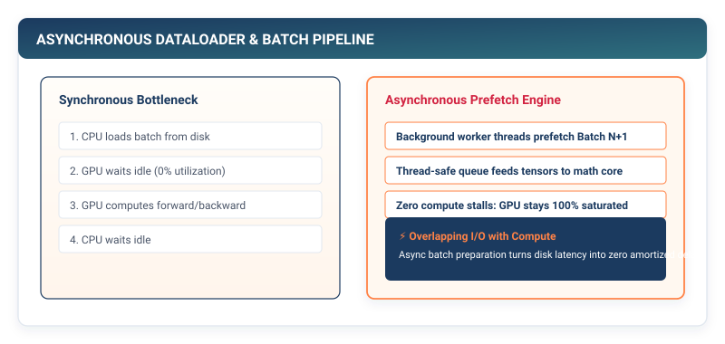

## Purpose {.unnumbered}

_Why is the data loading pipeline the primary determinant of whether hardware compute stays saturated?_

Deep learning accelerators and multi-core CPUs are designed to process dense matrix arithmetic at massive throughput. If training data is fed to the model as individual single samples, the runtime is trapped in low-intensity memory stalls, starving arithmetic registers while waiting for isolated memory fetches. To achieve high arithmetic throughput, frameworks must decouple physical storage from model execution through a two-tiered software pipeline: the **Dataset** abstraction (which defines sample-level retrieval) and the **DataLoader** engine (which orchestrates mini-batch collation, index shuffling without memory copying, and lazy batch generation). In a framework runtime, the data pipeline is the physical I/O valve that bridges uncompressed storage on disk with high-bandwidth memory in compute registers.

::: {.callout-learning-objectives}
## Learning Objectives

- **Construct** the `Dataset` abstract base class and `TensorDataset` container to decouple storage representation from downstream execution.
- **Implement** the `DataLoader` engine with index permutation shuffling, avoiding expensive physical memory movement and data duplication.
- **Analyze** the arithmetic intensity shift when moving from single-sample processing ($B = 1$) to mini-batch GEMM matrix operations ($B \ge 32$) using the Roofline model.
- **Build** a lazy Python generator pipeline yielding batched `Tensor` tuples on-demand to enforce strict working-memory bounds.
- **Execute** an end-to-end dataset evaluation pass, calculating running loss and multi-class classification accuracy across an entire dataset.
- **Examine** production systems mechanisms: multi-process worker pools, POSIX shared memory IPC, and page-locked (pinned) DMA host-to-device transfers.
:::

---

## The Systems Rationale for Mini-Batching

Consider evaluating a linear layer transformation $\mathbf{Y} = \mathbf{X} \mathbf{W}$ where weight matrix $\mathbf{W} \in \mathbb{R}^{D_{\text{in}} \times D_{\text{out}}}$ operates on $N$ input feature vectors of dimension $D_{\text{in}}$.

### Arithmetic Intensity and the Roofline Model

To understand why batch size determines hardware efficiency, we formalize the **Arithmetic Intensity** ($I$), defined as the ratio of floating-point operations performed to memory bytes transferred across the memory bus:

$$I = \frac{\text{Total Floating-Point Operations (FLOPs)}}{\text{Total Memory Traffic (Bytes Transferred)}}$$

Let floating-point values occupy $4\text{ bytes}$ (standard IEEE 754 `float32`). For a batch of size $B$:

1. **Floating-Point Operations**:
   Multiplying matrix $\mathbf{X} \in \mathbb{R}^{B \times D_{\text{in}}}$ by $\mathbf{W} \in \mathbb{R}^{D_{\text{in}} \times D_{\text{out}}}$ requires $B \times D_{\text{out}}$ dot products of length $D_{\text{in}}$. Each dot product executes $D_{\text{in}}$ multiplications and $D_{\text{in}}$ additions ($2 D_{\text{in}}$ FLOPs):

   $$\text{FLOPs} = 2 \times B \times D_{\text{in}} \times D_{\text{out}}$$

2. **Memory Traffic (DRAM Reads and Writes)**:
   Assuming cold caches, the hardware must read matrix $\mathbf{X}$, read weight matrix $\mathbf{W}$, and write result $\mathbf{Y} \in \mathbb{R}^{B \times D_{\text{out}}}$:

   $$\text{Bytes} = 4 \times \left( B \cdot D_{\text{in}} + D_{\text{in}} \cdot D_{\text{out}} + B \cdot D_{\text{out}} \right)$$

3. **Arithmetic Intensity Formulation**:

   $$I(B) = \frac{2 B D_{\text{in}} D_{\text{out}}}{4 \left( B D_{\text{in}} + D_{\text{in}} D_{\text{out}} + B D_{\text{out}} \right)} = \frac{B}{2 \left( \frac{B}{D_{\text{out}}} + 1 + \frac{B}{D_{\text{in}}} \right)}$$

```
┌─────────────────────────────────────────────────────────────┐
│  Single Sample (B = 1): Vector-Matrix (GEMV)                │
│  • Memory Traffic: Load W for EVERY sample                  │
│  • Arithmetic Intensity: ~0.5 FLOP / Byte (Memory-Bound)    │
├─────────────────────────────────────────────────────────────┤
│  Mini-Batch (B = 64): Matrix-Matrix (GEMM)                  │
│  • Memory Traffic: Load W ONCE for 64 samples               │
│  • Arithmetic Intensity: ~32 FLOPs / Byte (Compute-Bound)   │
└─────────────────────────────────────────────────────────────┘
```

When $B = 1$ and dimensions are large ($D_{\text{in}} = D_{\text{out}} = 4096$):

$$I(1) = \frac{1}{2 \left( \frac{1}{4096} + 1 + \frac{1}{4096} \right)} \approx 0.5\text{ FLOPs / Byte}$$

Modern GPUs (such as an NVIDIA H100 with $3.35\text{ TB/s}$ HBM3 bandwidth and $989\text{ TFLOPs}$ FP32 tensor throughput) have a hardware machine balance ridge point of $\frac{989 \times 10^{12}}{3.35 \times 10^{12}} \approx 295\text{ FLOPs/Byte}$. At $I = 0.5\text{ FLOPs/Byte}$, the accelerator achieves less than $0.2\%$ of its theoretical peak compute, stalled waiting on memory fetches from High Bandwidth Memory (HBM).

When batch size scales to $B = 64$:

$$I(64) = \frac{64}{2 \left( \frac{64}{4096} + 1 + \frac{64}{4096} \right)} \approx 31.0\text{ FLOPs / Byte}$$

Grouping samples into mini-batches amortizes the memory transfer cost of loading weight tensor $\mathbf{W}$ across all $B$ samples, boosting arithmetic intensity by $60\times$ and moving execution into the compute-bound plateau of the Roofline model.[^roofline-ref]

Furthermore, mini-batching enforces strict memory bounds: instead of loading an entire 1,000,000-sample dataset into RAM simultaneously, the runtime keeps only the active mini-batch ($B \times D$ elements) in working cache memory.

[^roofline-ref]: The Roofline Model (Williams et al., 2009) defines operational performance as $P = \min(\text{Peak Performance}, \text{Memory Bandwidth} \times I)$.

---

## Decoupling Storage: The Dataset Abstraction

In modern framework architecture, data management is partitioned into two distinct responsibilities:

1. **Access (Dataset)**: How do we fetch a single sample $(x_i, y_i)$ from storage?
2. **Organization (DataLoader)**: How do we group, shuffle, and collate samples into batches?

The `Dataset` abstraction defines a clean Python interface requiring two fundamental methods:

- `__len__()`: Returns the total number of samples in the dataset.
- `__getitem__(index)`: Returns the $i$-th sample tuple.

```python
# Listing 5.1: The Dataset Abstract Base Class
from abc import ABC, abstractmethod
from typing import Tuple, Any

class Dataset(ABC):
    """Abstract base class for all datasets in TinyTorch."""

    @abstractmethod
    def __len__(self) -> int:
        """Return the total number of samples in the dataset."""
        raise NotImplementedError

    @abstractmethod
    def __getitem__(self, index: int) -> Tuple[Any, ...]:
        """Fetch the sample at the specified integer index."""
        raise NotImplementedError
```

### Implementing TensorDataset

When dataset features and labels already reside in memory as `Tensor` objects, `TensorDataset` wraps them into a unified dataset:

```python
# Listing 5.2: TensorDataset Implementation
from tinytorch.core.tensor import Tensor
from typing import Tuple

class TensorDataset(Dataset):
    """Dataset wrapping multi-dimensional tensors."""

    def __init__(self, *tensors: Tensor) -> None:
        if not tensors:
            raise ValueError("TensorDataset requires at least one Tensor")

        # Verify all tensors have identical length along dimension 0
        first_len = tensors[0].shape[0]
        for t in tensors:
            if t.shape[0] != first_len:
                raise ValueError("All tensors must have the same size along dimension 0")

        self.tensors = tensors

    def __len__(self) -> int:
        return self.tensors[0].shape[0]

    def __getitem__(self, index: int) -> Tuple[Tensor, ...]:
        # Extract the index-th slice from each wrapped tensor
        return tuple(Tensor(t.data[index]) for t in self.tensors)
```

---

## The DataLoader Engine: Shuffling without Memory Movement

A naive data pipeline might attempt to shuffle a dataset by copying or rearranging the underlying data arrays in RAM. For high-dimensional tensors (such as thousands of images or token sequences), copying megabytes or gigabytes of memory at the start of every training epoch wastes memory bandwidth and CPU cycles.

::: {.callout-principle}
## The Index Permutation Invariant

Instead of physically rearranging multi-megabyte data buffers in memory, the framework generates a lightweight 1D array of integer indices:

$$\mathbf{p} = \text{Permutation}([0, 1, 2, \dots, N-1])$$

Shuffling an array of 50,000 integer pointers consumes less than $400\text{ KB}$ of memory and executes in sub-millisecond time. The DataLoader then retrieves mini-batch slices using these permuted indices without duplicating or moving the underlying storage buffers.
:::

::: {#fig-dataloader-pipeline}


**Figure 5.1: The DataLoader Shuffling and Batching Pipeline.** Shuffling generates a lightweight integer index permutation. The engine slices index chunks of size $B$, gathers sample tensors, and collates them into unified batch tensors.
:::

---

## Building the Iterable DataLoader

The `DataLoader` combines a `Dataset` with a batching engine, implementing the Python iterator protocol (`__iter__` and `__next__`):

```python
# Listing 5.3: The Complete DataLoader Implementation in TinyTorch
import numpy as np
from typing import Iterator, Tuple

class DataLoader:
    """
    Data loader providing mini-batching, shuffling, and lazy iteration.
    """

    def __init__(
        self,
        dataset: Dataset,
        batch_size: int = 1,
        shuffle: bool = False,
        drop_last: bool = False
    ) -> None:
        if batch_size < 1:
            raise ValueError("batch_size must be a positive integer")

        self.dataset = dataset
        self.batch_size = batch_size
        self.shuffle = shuffle
        self.drop_last = drop_last
        self.num_samples = len(dataset)

    def __len__(self) -> int:
        """Return the total number of batches per epoch."""
        if self.drop_last:
            return self.num_samples // self.batch_size
        else:
            return (self.num_samples + self.batch_size - 1) // self.batch_size

    def __iter__(self) -> Iterator[Tuple[Tensor, ...]]:
        """Yield mini-batches of collated tensors."""
        # 1. Generate index list
        if self.shuffle:
            indices = np.random.permutation(self.num_samples)
        else:
            indices = np.arange(self.num_samples)

        # 2. Iterate in strides of batch_size
        for start_idx in range(0, self.num_samples, self.batch_size):
            end_idx = start_idx + self.batch_size

            # Handle fractional trailing batch
            if end_idx > self.num_samples:
                if self.drop_last:
                    break
                end_idx = self.num_samples

            batch_indices = indices[start_idx:end_idx]

            # 3. Collate samples into unified batch tensors
            # Retrieve sample tuples from dataset
            samples = [self.dataset[i] for i in batch_indices]

            # Transpose list of tuples: [(x0, y0), (x1, y1)] -> ([x0, x1], [y0, y1])
            num_fields = len(samples[0])
            collated_batch = []
            for field_idx in range(num_fields):
                field_data = np.stack([s[field_idx].data for s in samples], axis=0)
                collated_batch.append(Tensor(field_data))

            yield tuple(collated_batch)
```

::: {.callout-pitfall}
## Pitfall: Memory Leaks from Non-Lazy Collation

Creating all batch tensors in memory before training begins duplicates dataset memory. The DataLoader must act as a **lazy generator**, constructing and yielding one batch tensor at a time so that memory from previous batches is freed as execution proceeds.
:::

---

## Forward Pipeline Integration: Full Dataset Evaluation

We can now assemble the complete forward pipeline constructed across Chapters 1 through 5:

1. Wrap synthetic dataset samples in `TensorDataset`.
2. Construct a `DataLoader` to iterate in batches of $B = 32$.
3. Pass each batch through our Chapter 3 `Sequential` MLP.
4. Measure batch prediction error with Chapter 4 `CrossEntropyLoss`.
5. Aggregate total epoch loss and compute classification accuracy.

```python
# Listing 5.4: Full Dataset Forward Evaluation Loop
from tinytorch.core.layers import Linear, Dropout, Sequential
from tinytorch.core.activations import ReLU
from tinytorch.core.losses import CrossEntropyLoss

# 1. Create a synthetic dataset: 1,000 samples, 784 features, 10 classes
num_samples = 1000
raw_features = Tensor(np.random.randn(num_samples, 784).astype(np.float32))
raw_labels = Tensor(np.random.randint(0, 10, size=(num_samples,)))

dataset = TensorDataset(raw_features, raw_labels)
dataloader = DataLoader(dataset, batch_size=32, shuffle=True)

# 2. Instantiate 3-layer MLP and loss function
model = Sequential(
    Linear(in_features=784, out_features=128),
    ReLU(),
    Dropout(p=0.1),
    Linear(in_features=128, out_features=64),
    ReLU(),
    Linear(in_features=64, out_features=10)
)
criterion = CrossEntropyLoss()

# 3. Evaluate model in eval mode across the entire dataset
model.eval()
total_loss = 0.0
correct_predictions = 0
total_samples = 0

for batch_x, batch_y in dataloader:
    # Forward pass through model
    logits = model(batch_x)
    # Compute batch loss
    loss = criterion(logits, batch_y)

    # Track metrics
    batch_size = batch_x.shape[0]
    total_loss += loss.data * batch_size

    # Calculate accuracy: argmax along class dimension
    predicted_classes = np.argmax(logits.data, axis=-1)
    correct_predictions += np.sum(predicted_classes == batch_y.data)
    total_samples += batch_size

average_loss = total_loss / total_samples
accuracy = (correct_predictions / total_samples) * 100.0

print(f"Dataset Evaluation Complete:")
print(f"  Total Batches: {len(dataloader)}")
print(f"  Average Loss:  {average_loss:.4f}")
print(f"  Accuracy:      {accuracy:.2f}%")
```

---

## Systems Reality: Multi-Process I/O and Prefetching

In production deep learning frameworks like PyTorch, reading gigabytes of training data from disk or network storage cannot occur synchronously on the main training thread. If the model must wait for disk reads and sample transformations between every batch, GPU utilization drops to near zero (an I/O bottleneck).

```
┌─────────────────────────────────────────────────────────────┐
│  Synchronous I/O (Main Thread Stalled):                     │
│  [ Load Batch 1 ] ──> [ GPU Compute ] ──> [ Load Batch 2 ]  │
│         ▲                                         ▲         │
│     GPU Idle                                  GPU Idle      │
├─────────────────────────────────────────────────────────────┤
│  Asynchronous Prefetching (num_workers > 0):                │
│  Worker 1: [ Load Batch 1 ] ──> [ Load Batch 3 ]            │
│  Worker 2: [ Load Batch 2 ] ──> [ Load Batch 4 ]            │
│  GPU:            [ Compute B1 ] ──> [ Compute B2 ]          │
│                  (Zero idle stall time!)                    │
└─────────────────────────────────────────────────────────────┘
```

Production data loaders solve this through three synergistic hardware mechanisms:

1. **Multi-Process Worker Pools (`num_workers > 0`)**: Workers run in isolated OS processes, bypassing Python's Global Interpreter Lock (GIL) to parse, decode, and augment samples in parallel.
2. **POSIX Shared Memory (`/dev/shm`)**: Tensors allocated by worker processes reside in shared memory segments, passing lightweight memory file descriptors to the main process without socket serialization overhead.[^shm-details]
3. **Page-Locked (Pinned) Memory and DMA**: Host DRAM allocated via `cudaHostAlloc` (or `pin_memory=True`) is locked against OS page swapping, enabling the GPU's Direct Memory Access (DMA) engine to transfer tensors across PCIe asynchronously while CUDA compute kernels execute in parallel.[^pinned-mem]

::: {.callout-note}
## PyTorch Systems Bridge: `torch.utils.data.DataLoader` and `torch::DataLoader`

In PyTorch, data loading is orchestrated via C++ backends (`torch/csrc/api/src/data/samplers/`):

```python
import torch
from torch.utils.data import TensorDataset, DataLoader

dataset = TensorDataset(torch.randn(1000, 784), torch.randint(0, 10, (1000,)))
# multi-process prefetching with page-locked DMA staging
dataloader = DataLoader(
    dataset,
    batch_size=32,
    shuffle=True,
    num_workers=4,
    pin_memory=True,      # Page-lock memory for async PCIe transfer
    persistent_workers=True
)

for x, y in dataloader:
    # non_blocking=True overlaps host-to-device DMA copy with preceding CUDA kernels
    x = x.cuda(non_blocking=True)
    y = y.cuda(non_blocking=True)
```
Under the hood, `torch.multiprocessing` uses shared memory handles (`torch_shm_manager`) to transfer `torch.UntypedStorage` pointers across UNIX domain sockets, achieving zero-copy IPC between worker processes and the main training runtime.[^pytorch-ipc]
:::

[^shm-details]: In Linux, `/dev/shm` is a virtual memory filesystem backed by RAM. Passing tensors through shared memory avoids the $10\times\text{--}100\times$ serialization penalty of Python `pickle` over inter-process pipes.
[^pinned-mem]: Standard CPU allocations are paged (pageable memory). The GPU cannot read pageable memory directly via DMA because the OS may relocate pages. `pin_memory=True` locks physical pages in host DRAM, allowing the PCIe DMA controller to transfer data directly to GPU VRAM at line-rate bandwidth ($32\text{ GB/s}$ on PCIe Gen4 x16).
[^pytorch-ipc]: In `torch/csrc/autograd/python_variable.cpp` and `torch/csrc/cuda/Module.cpp`, PyTorch hooks tensor serialization to write shared memory file descriptors (`shm_open`) rather than data payloads.

---

## Summary

In this chapter, we constructed the fifth foundational component of TinyTorch: data loading infrastructure. We examined the physical systems rationale for mini-batching, using the Roofline model to demonstrate how grouping samples into batches shifts computation from memory-bound vector operations ($I \approx 0.5\text{ FLOP/Byte}$) into high-intensity GEMM matrix operations ($I \ge 31\text{ FLOP/Byte}$) that saturate hardware ALUs.

We built the `Dataset` abstraction to decouple storage retrieval from downstream computation, implemented `TensorDataset` for in-memory arrays, and constructed the `DataLoader` engine. We proved why index permutation shuffling eliminates expensive memory copying in RAM, and verified the complete forward pipeline by streaming an entire dataset through our multi-layer network to calculate epoch-wide loss and accuracy.

::: {.callout-takeaways}
## Chapter Takeaways

- **Arithmetic Intensity Boost**: Mini-batching ($B \ge 32$) transforms memory-bandwidth-bound vector operations into compute-bound matrix multiplications (GEMM), reusing loaded weight parameters across all $B$ inputs.
- **Separation of Concerns**: The `Dataset` defines sample access (`__len__`, `__getitem__`), while the `DataLoader` orchestrates batching, shuffling, and memory collation.
- **Zero-Copy Shuffling**: Shuffling lightweight integer index arrays $[0\dots N-1]$ achieves stochastic randomization without copying or rearranging heavy data tensors in memory.
- **Lazy Iteration Protocol**: The DataLoader yields batches on-demand as a Python generator, keeping active memory footprint strictly bounded to the active batch size.
- **Asynchronous Prefetching**: Production runtimes deploy multi-process background workers and page-locked (pinned) memory DMA transfers to load upcoming batches in parallel, eliminating GPU idle stalls.
:::

::: {.callout-chapter-connection}
## Chapter Connection: Computing Gradients Automatically

We now have data flowing through multi-layer networks and measuring prediction error, but how does the framework know how to adjust weights to decrease loss? In **Chapter 6 (Automatic Differentiation and Graph Tracing)**, we build the crown jewel of TinyTorch: the dynamic reverse-mode autograd engine, computational DAG tracing, and Vector-Jacobian Products.
:::
