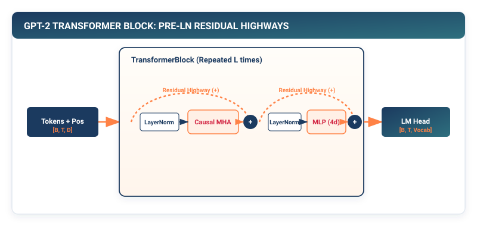

## Purpose {.unnumbered}

_Why does stacking attention layers without normalization and residual highways immediately collapse gradient flow?_

While Multi-Head Attention enables dynamic context retrieval, simply stacking attention mechanisms on top of each other creates an unstable dynamical system: variance compounds exponentially across layers, and deep gradient paths vanish during backpropagation. To construct stable deep architectures with dozens or hundreds of layers, modern transformers rely on two structural stabilizers: **Layer Normalization** (which rescales feature distributions across the hidden dimension independently for each token) and **Residual Connections** (which provide uninterrupted identity highways for gradient flow $\frac{\partial}{\partial \mathbf{x}}(\mathbf{x} + f(\mathbf{x})) = \mathbf{I} + f'(\mathbf{x})$). By combining Token Embeddings, Multi-Head Attention, Pre-LayerNorm Transformer Blocks, and a Linear Language Modeling Head, we construct the definitive architecture of modern artificial intelligence: the **Autoregressive Generative Pre-trained Transformer (GPT)**.

::: {.callout-learning-objectives}
## Learning Objectives

- **Construct** `LayerNorm` layers encapsulating learnable $\gamma$ scale and $\beta$ shift parameter tensors.
- **Implement** the Two-Layer Transformer Feed-Forward Network (FFN) with $4\times$ hidden dimension expansion and GELU activations.
- **Assemble** the Pre-LayerNorm `TransformerBlock` with dual residual identity connections.
- **Build** the complete `GPT` architecture and execute autoregressive text generation with temperature-scaled sampling.
- **Derive** the closed-form parameter count formula for decoder-only transformers ($N_{\text{params}} \approx 12 \times L \times D^2$).
:::

---

## Pre-LN vs. Post-LN: Clean Gradient Highways in Deep Networks

The original 2017 Transformer (Vaswani et al.) placed Layer Normalization *after* the residual addition (**Post-LN**):

$$\mathbf{x}_{l+1} = \text{LayerNorm}(\mathbf{x}_l + \mathcal{F}_l(\mathbf{x}_l))$$

where $\mathcal{F}_l$ represents the Multi-Head Attention or Feed-Forward sub-layer.

### Mathematical Failure Mode of Post-LN
Applying the multivariate chain rule across $L$ stacked Post-LN blocks requires multiplying the Jacobians of Layer Normalization at every single layer interface:

$$\frac{\partial \mathbf{x}_L}{\partial \mathbf{x}_0} = \prod_{l=0}^{L-1} \mathbf{J}_{\text{LN}_l} \left( \mathbf{I} + \mathbf{J}_{\mathcal{F}_l} \right)$$

Because $\mathbf{J}_{\text{LN}}$ rescales activations by empirical standard deviations, the product of $L$ non-linear normalization Jacobians causes gradient magnitudes near the shallow input layers to vanish exponentially (or explode). Consequently, deep Post-LN transformers cannot be trained without delicate learning rate warmup schedules (Liu et al., 2020; Xiong et al., 2020).

### The Pre-LN Formulation and Clean Identity Gradient Flow
Modern foundation models (GPT-2, GPT-3, GPT-4, LLaMA) standardized on **Pre-LayerNorm (Pre-LN)**, applying normalization *before* each sub-layer:

$$\mathbf{x}' = \mathbf{x}_l + \text{Attention}(\text{LayerNorm}(\mathbf{x}_l))$$
$$\mathbf{x}_{l+1} = \mathbf{x}' + \text{FFN}(\text{LayerNorm}(\mathbf{x}'))$$

```
┌─────────────────────────────────────────────────────────────────────────┐
│  The Pre-LN Transformer Block: Uninterrupted Residual Identity Highway  │
├─────────────────────────────────────────────────────────────────────────┤
│  Input x_l ──┬─────────────────────────────────────────────────[+]──> x'│
│              │                                                  ▲       │
│              ▼                                                  │       │
│         [LayerNorm] ──> [Multi-Head Attention (QKV Matmul)] ───┘       │
│                                                                         │
│  x' ─────────┬─────────────────────────────────────────────────[+]──> x_│
│              │                                                  ▲     l+1
│              ▼                                                  │       │
│         [LayerNorm] ──> [Feed-Forward Network (GELU MLP)] ──────┘       │
└─────────────────────────────────────────────────────────────────────────┘
```

Unrolling the recursive Pre-LN recurrence relation from layer $0$ to layer $L$:

$$\mathbf{x}_L = \mathbf{x}_0 + \sum_{l=0}^{L-1} \mathcal{F}_l(\text{LayerNorm}(\mathbf{x}_l))$$

Taking the total derivative with respect to the input embedding $\mathbf{x}_0$:

$$\frac{\partial \mathcal{L}}{\partial \mathbf{x}_0} = \frac{\partial \mathcal{L}}{\partial \mathbf{x}_L} \frac{\partial \mathbf{x}_L}{\partial \mathbf{x}_0} = \frac{\partial \mathcal{L}}{\partial \mathbf{x}_L} \left( \mathbf{I} + \sum_{l=0}^{L-1} \frac{\partial \mathcal{F}_l(\text{LayerNorm}(\mathbf{x}_l))}{\partial \mathbf{x}_0} \right)$$

Notice the isolated identity matrix $\mathbf{I}$! Even if the sub-layer transformations $\mathcal{F}_l$ have vanishing derivatives, the identity term $\mathbf{I}$ guarantees an uninterrupted, unscaled **gradient highway** directly from the final loss to the shallowest input embeddings, enabling training of 100+ layer foundation models without warmup instabilities.

---

## Layer Normalization: Feature-Wise Control

Unlike BatchNorm (which computes mean and variance across the batch dimension), **Layer Normalization** normalizes across the feature dimension $D$ independently for each individual token:

$$\mu_t = \frac{1}{D} \sum_{i=1}^D x_{t, i}, \quad \sigma_t^2 = \frac{1}{D} \sum_{i=1}^D (x_{t, i} - \mu_t)^2$$

$$\hat{x}_{t, i} = \frac{x_{t, i} - \mu_t}{\sqrt{\sigma_t^2 + \epsilon}} \cdot \gamma_i + \beta_i$$

where $\mathbf{\gamma}, \mathbf{\beta} \in \mathbb{R}^D$ are learnable scale and shift parameter vectors.

```python
# Listing 13.1: LayerNorm Implementation in TinyTorch
from tinytorch.core.tensor import Tensor
from tinytorch.core.layers import Layer
from typing import List
import numpy as np

class LayerNorm(Layer):
    """
    Layer Normalization over the last feature dimension D.
    """

    def __init__(self, d_model: int, eps: float = 1e-5) -> None:
        self.eps = eps
        self.gamma = Tensor(np.ones(d_model, dtype=np.float32), requires_grad=True)
        self.beta = Tensor(np.zeros(d_model, dtype=np.float32), requires_grad=True)

    def forward(self, x: Tensor) -> Tensor:
        # Mean and variance across the last dimension (dim=-1)
        mean = np.mean(x.data, axis=-1, keepdims=True)
        var = np.var(x.data, axis=-1, keepdims=True)

        # Normalize to zero-mean, unit-variance
        x_norm = (x.data - mean) / np.sqrt(var + self.eps)

        # Apply learnable affine transform
        out = x_norm * self.gamma.data + self.beta.data
        return Tensor(out)

    def parameters(self) -> List[Tensor]:
        return [self.gamma, self.beta]
```

---

## The Transformer Feed-Forward Network (FFN)

While attention mixes information *across different token positions*, the **Feed-Forward Network (FFN)** processes each token position *independently* to expand and refine semantic features.

The standard FFN consists of two linear projections with a $4\times$ hidden dimension expansion and a **GELU (Gaussian Error Linear Unit)** non-linearity:

$$\text{FFN}(\mathbf{x}) = \text{GELU}(\mathbf{x} \mathbf{W}_1 + \mathbf{b}_1) \mathbf{W}_2 + \mathbf{b}_2$$

where $\mathbf{W}_1 \in \mathbb{R}^{D \times 4D}$ and $\mathbf{W}_2 \in \mathbb{R}^{4D \times D}$.

```python
# Listing 13.2: Transformer Feed-Forward Network in TinyTorch
from tinytorch.core.layers import Linear
from tinytorch.core.activations import GELU

class FeedForward(Layer):
    """Transformer Position-Wise Feed-Forward Network (FFN)."""

    def __init__(self, d_model: int, d_ff: Optional[int] = None) -> None:
        if d_ff is None:
            d_ff = 4 * d_model

        self.w1 = Linear(d_model, d_ff)
        self.act = GELU()
        self.w2 = Linear(d_ff, d_model)

    def forward(self, x: Tensor) -> Tensor:
        # (B, S, D) -> (B, S, 4D) -> GELU -> (B, S, D)
        return self.w2(self.act(self.w1(x)))

    def parameters(self) -> List[Tensor]:
        return self.w1.parameters() + self.w2.parameters()
```

---

## The Complete TransformerBlock

We can now assemble the unified Pre-LN `TransformerBlock`:

```python
# Listing 13.3: The TransformerBlock Module in TinyTorch
from tinytorch.core.attention import MultiHeadAttention

class TransformerBlock(Layer):
    """
    Standard Pre-LN Transformer Block.
    """

    def __init__(self, d_model: int, num_heads: int) -> None:
        self.ln1 = LayerNorm(d_model)
        self.attn = MultiHeadAttention(d_model, num_heads)
        self.ln2 = LayerNorm(d_model)
        self.ffn = FeedForward(d_model)

    def forward(self, x: Tensor, mask: Optional[Tensor] = None) -> Tensor:
        # 1. Pre-LN Attention with Residual Connection
        norm_x = self.ln1(x)
        attn_out = self.attn(norm_x, norm_x, norm_x, mask=mask)
        x_mid = Tensor(x.data + attn_out.data)

        # 2. Pre-LN FFN with Residual Connection
        norm_x_mid = self.ln2(x_mid)
        ffn_out = self.ffn(norm_x_mid)
        x_out = Tensor(x_mid.data + ffn_out.data)

        return x_out

    def parameters(self) -> List[Tensor]:
        return (
            self.ln1.parameters() +
            self.attn.parameters() +
            self.ln2.parameters() +
            self.ffn.parameters()
        )
```

---

## Building the Autoregressive GPT Model

The complete decoder-only GPT architecture stacks $L$ transformer blocks on top of token and positional embeddings, terminating in a final `LayerNorm` and a linear language modeling projection head:

::: {#fig-gpt-architecture}


**Figure 13.1: Full Autoregressive GPT Architecture.** Token and position embeddings enter a stack of $L$ Pre-LN Transformer Blocks. The final hidden states are projected to vocabulary logits for next-token prediction.
:::

```python
# Listing 13.4: Complete GPT Architecture in TinyTorch
from tinytorch.core.embeddings import GPTEmbedding

class GPT(Layer):
    """
    Autoregressive Generative Pre-trained Transformer (GPT).
    """

    def __init__(
        self,
        vocab_size: int = 1000,
        max_seq_len: int = 256,
        d_model: int = 128,
        num_heads: int = 4,
        num_layers: int = 4
    ) -> None:
        self.d_model = d_model
        self.max_seq_len = max_seq_len

        # 1. Embeddings
        self.embedding = GPTEmbedding(vocab_size, max_seq_len, d_model)

        # 2. Stack of L Transformer Blocks
        self.blocks = [TransformerBlock(d_model, num_heads) for _ in range(num_layers)]

        # 3. Final LayerNorm
        self.ln_f = LayerNorm(d_model)

        # 4. Language Modeling Head (Linear projection to vocabulary logits)
        self.lm_head = Linear(d_model, vocab_size)

    def forward(self, input_ids: Tensor) -> Tensor:
        B, S = input_ids.shape

        # 1. Compute position-aware embeddings: (B, S, D)
        x = self.embedding(input_ids)

        # 2. Build causal mask for sequence length S
        mask_data = np.where(np.tril(np.ones((S, S))) == 0, -1e9, 0.0).astype(np.float32)
        mask = Tensor(mask_data[np.newaxis, np.newaxis, :, :])  # Shape: (1, 1, S, S)

        # 3. Pass through transformer block stack
        for block in self.blocks:
            x = block(x, mask=mask)

        # 4. Final normalization
        x = self.ln_f(x)

        # 5. Project to vocabulary logits: (B, S, V)
        logits = self.lm_head(x)
        return logits

    def parameters(self) -> List[Tensor]:
        params = self.embedding.parameters()
        for b in self.blocks:
            params.extend(b.parameters())
        params.extend(self.ln_f.parameters())
        params.extend(self.lm_head.parameters())
        return params
```

---

## Autoregressive Text Generation

To generate text, GPT operates in an autoregressive loop: feeding the prompt to predict token $S+1$, appending the predicted token to the prompt, and repeating:

```python
# Listing 13.5: Autoregressive Text Generation Loop
def generate(
    model: GPT,
    prompt_tokens: List[int],
    max_new_tokens: int = 20,
    temperature: float = 1.0
) -> List[int]:
    """
    Generate new tokens autoregressively from a prompt.
    """
    current_tokens = list(prompt_tokens)

    for _ in range(max_new_tokens):
        # Crop context to max_seq_len if necessary
        context = current_tokens[-model.max_seq_len:]
        input_tensor = Tensor(np.array([context], dtype=np.int32))

        # Forward pass to get logits: (1, S, V)
        logits = model(input_tensor)

        # Extract logits for the very last token: (V,)
        next_token_logits = logits.data[0, -1, :] / max(temperature, 1e-5)

        # Numerical Softmax to convert logits to probabilities
        exp_logits = np.exp(next_token_logits - np.max(next_token_logits))
        probs = exp_logits / np.sum(exp_logits)

        # Sample next token from probability distribution
        next_token = int(np.random.choice(len(probs), p=probs))
        current_tokens.append(next_token)

    return current_tokens
```

---

::: {.callout-note}
## PyTorch Systems Bridge: `torch.nn.LayerNorm`, `torch.nn.RMSNorm`, and Kernel Fusion

In modern deep learning frameworks, normalization is memory-bandwidth bound. PyTorch provides both standard `torch.nn.LayerNorm` and native `torch.nn.RMSNorm`:[^rmsnorm-paper]

```python
import torch
import torch.nn as nn

# Standard LayerNorm (Computes both mean and variance across feature dimension D)
ln = nn.LayerNorm(normalized_shape=4096, eps=1e-5)

# LLaMA-Style Root Mean Square Normalization (RMSNorm)
# Eliminates mean calculation, reducing memory loads and register pressure
try:
    rmsnorm = nn.RMSNorm(normalized_shape=4096, eps=1e-5)
except AttributeError:
    # Custom fallback for PyTorch versions prior to native RMSNorm addition
    class RMSNormFallback(nn.Module):
        def __init__(self, dim: int, eps: float = 1e-5):
            super().__init__()
            self.eps = eps
            self.weight = nn.Parameter(torch.ones(dim))
        def forward(self, x: torch.Tensor) -> torch.Tensor:
            rms = torch.rsqrt(x.pow(2).mean(-1, keepdim=True) + self.eps)
            return x * rms * self.weight
    rmsnorm = RMSNormFallback(4096)

x = torch.randn(2, 512, 4096, device="cuda" if torch.cuda.is_available() else "cpu")
norm_x = rmsnorm(x)
```

### Fused Pre-LN Residual Kernels
In unoptimized execution, computing $\mathbf{x}_{\text{next}} = \mathbf{x} + \text{Sublayer}(\text{Norm}(\mathbf{x}))$ requires two separate HBM memory passes: reading $\mathbf{x}$ to write $\text{Norm}(\mathbf{x})$, and reading $\mathbf{x}$ again to add the residual. High-performance inference engines (such as vLLM, TensorRT-LLM, and FlashInfer) use **fused residual-normalization kernels** written in CUDA or Triton that perform the residual addition and root-mean-square normalization in a single on-chip SRAM pass, eliminating $50\%$ of DRAM bandwidth overhead.[^llama-arch-innovations]
:::

[^rmsnorm-paper]: Zhang & Sennrich (2019), *Root Mean Square Layer Normalization*, NeurIPS. RMSNorm enforces $\text{RMS}(\mathbf{x}) = \sqrt{\frac{1}{D}\sum x_i^2 + \epsilon}$, showing that scaling invariance matters more than mean-centering for transformer stability.

[^llama-arch-innovations]: **The LLaMA Foundation Architecture (Touvron et al., 2023)**: Modern foundation models (LLaMA-2/3, Mistral, Gemma) synthesize three major transformer innovations:

1. **Pre-LN with RMSNorm**: Applied at the input of every attention and FFN block, guaranteeing gradient highway stability while eliminating mean calculations.
2. **SwiGLU Gated Feed-Forward Networks (Shazeer, 2020)**: Replaces standard GELU MLPs with Swish-Gated Linear Units:
$$\text{SwiGLU}(\mathbf{x}) = \left(\text{SiLU}(\mathbf{x}\mathbf{W}_{\text{gate}}) \odot (\mathbf{x}\mathbf{W}_{\text{up}})\right)\mathbf{W}_{\text{down}}$$
where hidden dimension is scaled to $d_{\text{ff}} = \frac{8}{3}D \approx 2.67D$, yielding superior reasoning capacity per FLOP.
3. **Rotary Position Embedding (RoPE, Su et al., 2021)**: Encodes token positions by multiplying 2D query/key coordinate pairs by 2D orthogonal rotation matrices, providing continuous relative positional decay without learnable lookup parameters.

## Systems Reality: Parameter Counting, Memory Allocation, and Scaling Laws

How many parameters are in a decoder-only transformer? Let us break down the exact mathematical accounting for a model with $L$ layers, hidden dimension $D$, vocabulary size $V$, and standard $4D$ FFN expansion:

```
┌─────────────────────────────────────────────────────────────────────────┐
│  Decoder-Only Transformer Parameter Breakdown (Per Block)               │
├─────────────────────────────────────────────────────────────────────────┤
│  1. Multi-Head Attention Sub-layer:                                     │
│     • Query Projection  W_Q : D x D = D^2 weights                       │
│     • Key Projection    W_K : D x D = D^2 weights                       │
│     • Value Projection  W_V : D x D = D^2 weights                       │
│     • Output Projection W_O : D x D = D^2 weights                       │
│     ──> Subtotal Attention  : 4 D^2 weights                             │
│                                                                         │
│  2. Feed-Forward Network (FFN) Sub-layer:                               │
│     • Up-Projection     W_1 : D x 4D = 4 D^2 weights                    │
│     • Down-Projection   W_2 : 4D x D = 4 D^2 weights                    │
│     ──> Subtotal FFN        : 8 D^2 weights                             │
│                                                                         │
│  TOTAL PER TRANSFORMER BLOCK: 4 D^2 + 8 D^2 = 12 D^2 WEIGHTS!           │
└─────────────────────────────────────────────────────────────────────────┘
```

Across an entire $L$-layer network, the total parameter count is:

$$N_{\text{weights}} \approx 12 \times L \times D^2 + V \times D + S_{\text{max}} \times D$$

::: {.callout-principle}
## The 12 $L D^2$ Scaling Law Rule of Thumb

In any standard decoder-only transformer, the core transformer stack contains exactly **$12 L D^2$ parameter weights**.

- **GPT-2 Small** ($L=12, D=768$): $12 \times 12 \times 768^2 = 84.9\text{M params} + 39.3\text{M vocab} \approx 124\text{M params}$.
- **GPT-3** ($L=96, D=12288$): $12 \times 96 \times 12288^2 \approx 174.1\text{ Billion parameters}$ ($+ 614\text{M vocab}$).
- **LLaMA-3 8B** ($L=32, D=4096$, SwiGLU $3 \times \frac{8}{3}D^2 = 8D^2$ FFN): $12 \times 32 \times 4096^2 \approx 6.44\text{B} + 1.05\text{B vocab} \approx 8.0\text{ Billion parameters}$.
:::

---

## Summary

In this chapter, we constructed the complete modern Transformer and autoregressive GPT language model in TinyTorch. We analyzed why Pre-LayerNorm and residual identity highways are mathematically required to stabilize deep gradient propagation.

We built `LayerNorm`, the $4\times$ expanding `FeedForward` block, the unified `TransformerBlock`, and assembled the full `GPT` model. We implemented autoregressive generation with temperature sampling and derived the closed-form $12 L D^2$ parameter scaling law governing modern Large Language Models.

::: {.callout-takeaways}
## Chapter Takeaways

- **Pre-LayerNorm Stability**: Normalizing inputs before attention and FFN sub-layers provides clean residual gradients $\mathbf{I}$, enabling training of deep 100+ layer architectures.
- **LayerNorm vs. BatchNorm**: LayerNorm computes statistics across the feature dimension $D$ for each token independently, making it invariant to batch size.
- **FFN Feature Expansion**: The $4\times$ projection ($D \to 4D \to D$) accounts for two-thirds of the parameters in each transformer block ($8 D^2$ out of $12 D^2$).
- **Autoregressive Generation**: Text generation iterates in a loop, predicting logits for the last token position and sampling the next token.
- **The $12 L D^2$ Rule**: Transformer parameter scaling is governed by $12 \times L \times D^2$ weights across attention and FFN projections.
:::

::: {.callout-chapter-connection}
## Chapter Connection: Validating the Architecture Revolution

We have now built the two dominant architectural paradigms of modern deep learning: 2D Convolutional Networks (Chapter 9) and Autoregressive Transformers (Chapters 10–13). In **Milestone 2 (The Architecture Revolution: 1998–2017)**, we validate our framework by training Yann LeCun's 1998 LeNet-5 on computer vision and Vaswani's 2017 Transformer on sequence modeling.
:::
