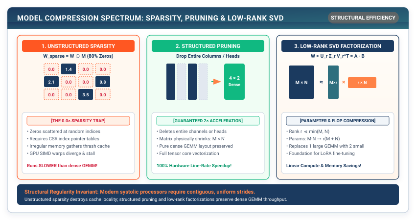

## Purpose {.unnumbered}

_Why does setting 90% of a weight matrix to zero fail to produce a 10x speedup on modern GPUs?_

Trained deep neural networks are drastically overparameterized: thousands of weight parameters can be zeroed out without degrading final model accuracy. However, in systems engineering, not all sparsity is created equal. Setting individual scalar weights to zero (**Unstructured Pruning**) creates irregular, scattered sparse matrices: while theoretical FLOP counts drop by 90%, modern GPU systolic arrays—which depend on dense, coalesced memory reads across 32-thread warps—experience branch divergence and memory bus stalls, often running *slower* than dense models. To achieve actual hardware speedups, frameworks use **Structured Pruning** (which removes entire rows, columns, or convolution channels, physically shrinking matrix dimensions) and **Knowledge Distillation** (which transfers dark knowledge from large teacher ensembles into compact student models).

::: {.callout-learning-objectives}
## Learning Objectives

- **Implement** unstructured magnitude pruning with binary sparsity masks ($\mathbf{W}_{\text{pruned}} = \mathbf{W} \odot \mathbf{M}$).
- **Construct** structured neuron and channel pruning that physically reshapes weight tensors, reducing GEMM dimensions.
- **Analyze** the hardware execution disparity between unstructured random sparsity and structured dense tensor execution.
- **Build** the Knowledge Distillation loss function, combining temperature-scaled soft targets ($D_{\text{KL}}$) with hard cross-entropy ground truth.
- **Decompose** dense weight matrices into Low-Rank factorized projections ($\mathbf{W} \approx \mathbf{A} \mathbf{B}^T$).
:::

---

## Overparameterization and the Lottery Ticket Hypothesis

Why can we remove 50% to 90% of parameters from a trained model?

In 2018, Frankle and Carbin proposed the **Lottery Ticket Hypothesis**: dense, randomly initialized feed-forward networks contain sparse sub-networks ("winning lottery tickets") that, when trained in isolation, match the test accuracy of the original dense network in comparable training iterations.

```
┌─────────────────────────────────────────────────────────────┐
│  The Model Compression Landscape                            │
├─────────────────────────────────────────────────────────────┤
│  1. Unstructured Pruning: Removes individual weights.       │
│     • Fine-grained, preserves high accuracy.                │
│     • Requires sparse matrix libraries (CSR/COO) for speed. │
├─────────────────────────────────────────────────────────────┤
│  2. Structured Pruning: Removes entire channels or neurons. │
│     • Coarse-grained, shrinks physical tensor dimensions.   │
│     • Runs at 100% efficiency on standard dense BLAS/GEMM.  │
├─────────────────────────────────────────────────────────────┤
│  3. Knowledge Distillation: Trains smaller student models.  │
│     • Learns from soft probability distributions.           │
│     • Unlocks architecture redesign (e.g., 12 layers -> 4). │
└─────────────────────────────────────────────────────────────┘
```

---

## Unstructured Magnitude Pruning

In magnitude pruning, we compute the absolute magnitude $|w_{ij}|$ of all weights and zero out the lowest $k$ percentile:

$$\text{Threshold } \tau = \text{Percentile}(|\mathbf{W}|, \text{sparsity}\times 100)$$

$$\mathbf{M}_{ij} = \begin{cases} 1 & \text{if } |w_{ij}| \ge \tau \\ 0 & \text{if } |w_{ij}| < \tau \end{cases}$$

$$\mathbf{W}_{\text{pruned}} = \mathbf{W} \odot \mathbf{M}$$

```python
# Listing 16.1: Magnitude Pruning in TinyTorch
import numpy as np
from tinytorch.core.tensor import Tensor
from tinytorch.core.layers import Linear
from typing import Any

def magnitude_prune_layer(layer: Linear, target_sparsity: float) -> np.ndarray:
    """
    Apply unstructured magnitude pruning to a Linear layer.
    Returns the binary sparsity mask.
    """
    assert 0.0 <= target_sparsity < 1.0, "Sparsity must be between 0 and 1"

    weights = layer.weight.data
    abs_weights = np.abs(weights)

    # Determine magnitude threshold
    threshold = np.percentile(abs_weights, target_sparsity * 100.0)

    # Generate binary mask
    mask = (abs_weights >= threshold).astype(np.float32)

    # Apply mask in-place
    layer.weight.data *= mask
    return mask

def measure_sparsity(model: Any) -> float:
    """Compute overall fraction of zero weights across all parameters."""
    total_zeros = 0
    total_elements = 0
    for p in model.parameters():
        total_zeros += np.sum(p.data == 0.0)
        total_elements += p.data.size
    return float(total_zeros / total_elements)
```

::: {#fig-pruning-types}


**Figure 16.1: Unstructured vs. Structured Pruning.** Unstructured pruning creates scattered zero elements in the matrix. Structured pruning removes complete rows and columns, physically shrinking matrix dimensions.
:::

---

## Structured Pruning: Physically Shrinking Layers

Structured pruning removes entire output neurons from a `Linear` layer or feature channels from a `Conv2d` layer.

For a weight matrix $\mathbf{W} \in \mathbb{R}^{D_{\text{in}} \times D_{\text{out}}}$, we rank each neuron $j \in [0, D_{\text{out}}-1]$ by its $L_2$ norm:

$$S_j = \|\mathbf{W}_{:, j}\|_2 = \sqrt{\sum_{i=1}^{D_{\text{in}}} W_{i, j}^2}$$

We retain only the top $(1 - \text{prune\_ratio}) \times D_{\text{out}}$ neurons and construct a new, physically smaller `Linear` layer:

```python
# Listing 16.2: Structured Neuron Pruning in TinyTorch
def structured_prune_linear(layer: Linear, prune_ratio: float) -> Linear:
    """
    Prune neurons with smallest L2 norm, physically reducing layer dimensions.
    """
    in_features, out_features = layer.weight.shape
    num_keep = int(out_features * (1.0 - prune_ratio))

    # Compute L2 norm for each output neuron column
    neuron_norms = np.linalg.norm(layer.weight.data, axis=0)

    # Find indices of top neurons
    keep_indices = np.argsort(neuron_norms)[-num_keep:]
    keep_indices = np.sort(keep_indices)

    # Create physically smaller Linear layer
    new_layer = Linear(in_features, num_keep)
    new_layer.weight.data = layer.weight.data[:, keep_indices].copy()
    if layer.bias is not None:
        new_layer.bias.data = layer.bias.data[keep_indices].copy()

    return new_layer
```

Because `new_layer` has shape $(D_{\text{in}}, D_{\text{out}}')$, downstream matrix multiplications execute with fewer floating-point instructions on standard dense GEMM hardware without requiring sparse libraries.

---

## Unstructured vs. Structured Hardware Realities

| Dimension                     |                         Unstructured Pruning                         |                  Structured Pruning                 |
|:------------------------------|:--------------------------------------------------------------------:|:---------------------------------------------------:|
| **Pruning Granularity**       |                      Individual scalar weights                       |           Entire rows / channels / layers           |
| **Accuracy Retention**        |           Exceptional ($>80\%$ sparsity with $<1\%$ drop)            |      Moderate ($30-50\%$ sparsity before drop)      |
| **Hardware Execution**        |                Requires sparse CSR/COO index pointers                |         **Native dense GEMM / Tensor Cores**        |
| **Memory Coalescing**         | **Broken** (scattered DRAM line requests)[^warp-coalescing-footnote] |           **100% Contiguous & Coalesced**           |
| **Actual Speedup on CPU/GPU** |        Often **$0\times$ (or slower!)** on standard hardware         | **Direct linear speedup ($1.5\times - 2.5\times$)** |
| **Hardware Exceptions**       |      NVIDIA Ampere 2:4 Sparse Tensor Cores[^sparse-tc-footnote]      |                  Universal support                  |

[^warp-coalescing-footnote]: On modern GPUs, memory controllers service DRAM requests in 32-byte, 64-byte, or 128-byte cache line segments. When 32 threads in a warp request contiguous 4-byte floats, a single 128-byte DRAM transaction satisfies all 32 threads (100% bus utilization). Unstructured random sparsity causes threads to request scattered addresses across different cache lines, triggering up to 32 separate 128-byte DRAM fetches (delivering only 4 bytes of useful payload each, or 3.1% bus efficiency).

[^sparse-tc-footnote]: NVIDIA 2:4 Structured Sparsity (introduced in Ampere GA100) compresses each 4-element FP16/INT8 vector into 2 nonzero elements plus a 2-bit index metadata per pair. Dedicated Sparse Tensor Core hardware decompresses these pairs on-the-fly inside register banks before feeding the systolic multiplier array, delivering an exact $2\times$ theoretical math speedup.

---

## Knowledge Distillation: Soft Targets

In *Distilling the Knowledge in a Neural Network* (2015), Geoffrey Hinton, Oriol Vinyals, and Jeff Dean proposed **Knowledge Distillation**.

Instead of training a compact student network on one-hot ground-truth labels ($y = [0, 1, 0]$), the student learns from the continuous probability distribution produced by a large teacher network.

### The Temperature Softmax

Dividing logits by temperature $T > 1$ softens the probability distribution, revealing rich relative affinities across incorrect classes ("dark knowledge"):

$$q_i = \frac{e^{z_i / T}}{\sum_j e^{z_j / T}}$$

```
┌─────────────────────────────────────────────────────────────┐
│  Dark Knowledge Extraction: Classifying a BMW               │
├─────────────────────────────────────────────────────────────┤
│  • Hard Label (One-Hot):  [ Car: 1.0,  Truck: 0.0,  Dog: 0.0 ]│
│  • Teacher (T = 1):       [ Car: 0.99, Truck: 0.01, Dog: 0.00]│
│  • Teacher Softened (T=5):[ Car: 0.65, Truck: 0.30, Dog: 0.05]│
│    -> Teaches the student that a BMW is much closer to a    │
│       truck than to a dog!                                  │
└─────────────────────────────────────────────────────────────┘
```

### The Distillation Loss Formula

$$\mathcal{L}_{\text{total}} = \alpha T^2 \cdot D_{\text{KL}}\left(\text{softmax}\left(\frac{\mathbf{z}_S}{T}\right) \parallel \text{softmax}\left(\frac{\mathbf{z}_T}{T}\right)\right) + (1 - \alpha) \mathcal{L}_{\text{CE}}(\mathbf{z}_S, y)$$

```python
# Listing 16.3: Knowledge Distillation Loss in TinyTorch
def distillation_loss(
    student_logits: Tensor,
    teacher_logits: Tensor,
    targets: Tensor,
    temperature: float = 4.0,
    alpha: float = 0.7
) -> Tensor:
    """
    Compute combined soft KL-divergence and hard cross-entropy distillation loss.
    """
    # 1. Soft predictions with temperature scaling
    p_s = np.exp(student_logits.data / temperature)
    p_s /= np.sum(p_s, axis=-1, keepdims=True)

    p_t = np.exp(teacher_logits.data / temperature)
    p_t /= np.sum(p_t, axis=-1, keepdims=True)

    # 2. KL Divergence: sum(p_t * log(p_t / p_s))
    kl_div = np.sum(p_t * (np.log(np.maximum(p_t, 1e-8)) - np.log(np.maximum(p_s, 1e-8))), axis=-1)
    soft_loss = np.mean(kl_div) * (temperature ** 2)

    # 3. Standard cross-entropy on hard targets
    b = targets.data.astype(int)
    log_probs = np.log(np.maximum(p_s, 1e-8))
    hard_loss = -np.mean(log_probs[np.arange(len(b)), b])

    total = alpha * soft_loss + (1.0 - alpha) * hard_loss
    return Tensor(np.array(total, dtype=np.float32))
```

---

## Low-Rank Matrix Factorization (SVD / LoRA)

A dense weight matrix $\mathbf{W} \in \mathbb{R}^{M \times N}$ can be approximated by the product of two low-rank matrices $\mathbf{A} \in \mathbb{R}^{M \times r}$ and $\mathbf{B} \in \mathbb{R}^{r \times N}$ where $r \ll \min(M, N)$:

$$\mathbf{W} \approx \mathbf{A} \mathbf{B}$$

```
┌─────────────────────────────────────────────────────────────┐
│  Low-Rank Factorization Memory Reduction                    │
├─────────────────────────────────────────────────────────────┤
│  Original Matrix: W (4,096 x 4,096) = 16,777,216 parameters │
│                                                             │
│  Factorized (Rank r = 64):                                  │
│  • Matrix A: (4,096 x 64) = 262,144 parameters              │
│  • Matrix B: (64 x 4,096) = 262,144 parameters              │
│  • Total Parameters: 524,288 parameters                     │
│  ────────────────────────────────────────────────────────── │
│  Parameter Reduction: 96.9% reduction (32x compression)!    │
└─────────────────────────────────────────────────────────────┘
```

This mathematical factorization forms the foundation of **LoRA (Low-Rank Adaptation)**, allowing billion-parameter foundational LLMs to be fine-tuned using tiny $r=16$ adapter matrices.

---

::: {.callout-note}
## PyTorch Systems Bridge: `torch.nn.utils.prune`, TensorRT, and PEFT LoRA

In PyTorch, pruning and low-rank adaptation are integrated across both training and deployment frameworks:

```python
import torch
import torch.nn.utils.prune as prune

# Apply structured L2-norm pruning across output channels
prune.ln_structured(
    module=model.conv1,
    name="weight",
    amount=0.3,
    n=2,
    dim=0
)
# Permanently remove pruned channels, physically reshaping the tensor
prune.remove(model.conv1, "weight")
```

For large generative models, **HuggingFace PEFT** implements Low-Rank Adaptation ($\mathbf{W} + \frac{\alpha}{r} \mathbf{A}\mathbf{B}$), keeping 70B parameter base weights frozen in 4-bit INT4 quantization while training low-rank adapter matrices. In serving engines like **vLLM**, dynamic multi-LoRA routing allows hundreds of custom adapters to be evaluated concurrently over a single shared base model in GPU HBM.
:::

---

## Summary

In this chapter, we explored algorithms for shrinking neural network architectures. We analyzed the fundamental distinction between unstructured magnitude pruning (which creates scattered zeros that stall standard GPUs) and structured pruning (which physically resizes weight matrices for guaranteed dense GEMM acceleration).

We implemented Knowledge Distillation to transfer dark knowledge from large teacher models to compact students via temperature-softened probability distributions, and formulated Low-Rank Matrix Factorization (the mathematical basis for LoRA).

::: {.callout-takeaways}
## Chapter Takeaways

- **The Sparsity Speed Paradox**: Unstructured pruning reduces theoretical FLOPs but often fails to accelerate GPU inference due to uncoalesced memory reads and branch divergence.
- **Structured Pruning Speedup**: Structured pruning physically reduces matrix dimensions, delivering immediate speedups on standard dense BLAS/Tensor Core hardware.
- **Knowledge Distillation**: Softening teacher probabilities with temperature $T > 1$ exposes rich inter-class affinities that guide small student networks toward higher accuracy.
- **Low-Rank Decomposition**: Factoring an $(M \times N)$ weight matrix into $(M \times r)$ and $(r \times N)$ compresses parameter storage by $(M \times N) / (r(M + N))$.
:::

::: {.callout-chapter-connection}
## Chapter Connection: Accelerating Execution Kernels

We have shrunk our models through quantization and pruning. How do we make the remaining operations execute at peak hardware speed on the processor? In **Chapter 17 (Kernel Acceleration: Vectorization, Tiling, and Fusion)**, we dive into the low-level systems mechanics of hardware caches, loop tiling, SIMD vectorization, and operator fusion.
:::
