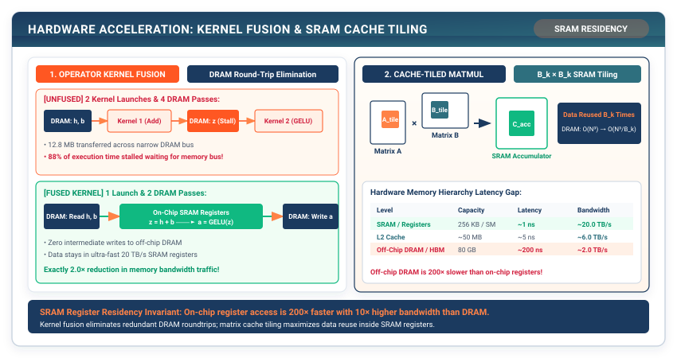

## Purpose {.unnumbered}

_Why does writing intermediate tensor arrays to RAM slow down deep networks more than the floating-point math itself?_

In modern computing architectures, floating-point arithmetic is essentially free, while memory movement is exorbitantly expensive. A modern processor can execute thousands of arithmetic ALU operations in the time required to fetch a single float from off-chip DRAM (the **Memory Wall**). When a neural network executes a sequence of three operations—such as `MatrixMultiply` followed by `BiasAdd` followed by `GELU`—standard frameworks allocate three distinct intermediate memory buffers in RAM, reading and writing the entire tensor three separate times over the memory bus. **Operator Fusion** compiles adjacent mathematical operations into a single unified kernel, keeping intermediate activations inside high-speed CPU registers and L1 cache ($0.5\text{ ns}$ latency) and eliminating DRAM round-trips ($50\text{ ns}$ latency). Combined with **SIMD Vectorization** and **Cache Tiling**, kernel acceleration transforms memory-stalled neural networks into hardware-saturating execution engines.

::: {.callout-learning-objectives}
## Learning Objectives

- **Analyze** the CPU memory hierarchy (Registers $\to$ L1 $\to$ L2 $\to$ L3 $\to$ DRAM), quantifying the $100\times$ latency gap between on-chip cache and main memory.
- **Implement** naive 3-nested loop matrix multiplication and contrast its latency against SIMD vectorized matrix arithmetic.
- **Construct** a Cache-Tiled GEMM engine that partitions large matrices into sub-blocks tailored to L1 cache capacity.
- **Design and build** Fused Linear+ReLU and Fused GELU kernels in TinyTorch, proving the elimination of intermediate RAM buffer allocations.
- **Evaluate** modern ML compilers (PyTorch `torch.compile` / TorchInductor, OpenAI Triton) that automate kernel fusion.
:::

---

## The Memory Wall and Cache Latency Hierarchy

```
┌─────────────────────────────────────────────────────────────┐
│  Hardware Memory Hierarchy & Access Latencies               │
├─────────────────────────────────────────────────────────────┤
│  1. CPU Registers : ~ 0.5 ns  (Instantaneous ALU operands)  │
│  2. L1 Cache (32 KB) : ~ 1.0 ns  (On-chip core memory)      │
│  3. L2 Cache (512 KB): ~ 3.0 ns  (Core-dedicated cache)     │
│  4. L3 Cache (32 MB) : ~ 10.0 ns (Shared multi-core cache)  │
│  5. Main DRAM (16 GB): ~ 60.0 ns (Off-chip bus transfer)    │
│  ────────────────────────────────────────────────────────── │
│  Latency Penalty: DRAM is 120x SLOWER than CPU Registers!   │
└─────────────────────────────────────────────────────────────┘
```

When an operator reads or writes data to off-chip DRAM (or GPU HBM), the processor pipeline sits completely idle for dozens or hundreds of clock cycles waiting for data lines to settle.[^sram-arch-footnote]

[^sram-arch-footnote]: Modern GPU Streaming Multiprocessors (SMs) allocate 128 KB to 228 KB of ultra-fast on-chip SRAM configurable as L1 data cache and shared memory. Across 132 SMs on an H100 GPU, this represents ~30 MB of aggregate on-chip SRAM delivering over 100 TB/s of bandwidth with ~1–2 ns latency, compared to off-chip HBM3 access at 3.35 TB/s and ~50–100 ns latency.

---

## Vectorization: SIMD Execution

A standard scalar loop processes one single floating-point number per CPU cycle:

```python
# Scalar loop: 1 addition per instruction
for i in range(N):
    c[i] = a[i] + b[i]
```

**SIMD (Single Instruction, Multiple Data)** instructions (such as Intel AVX-512 or ARM NEON) load 256-bit or 512-bit vector registers that execute 8 to 16 floating-point additions simultaneously in a single clock cycle:

$$\mathbf{c}_{[0:15]} = \mathbf{a}_{[0:15]} \oplus \mathbf{b}_{[0:15]} \quad (1\text{ instruction, 16 operations})$$

```python
# Listing 17.1: Scalar vs. Vectorized Matrix Multiplication
def naive_matmul(A: np.ndarray, B: np.ndarray) -> np.ndarray:
    """Naive 3-nested loop matrix multiplication: O(N^3) scalar operations."""
    M, K = A.shape
    K2, N = B.shape
    C = np.zeros((M, N), dtype=np.float32)
    for i in range(M):
        for j in range(N):
            total = 0.0
            for k in range(K):
                total += A[i, k] * B[k, j]
            C[i, j] = total
    return C

def vectorized_matmul(A: np.ndarray, B: np.ndarray) -> np.ndarray:
    """SIMD-vectorized matrix multiplication via BLAS."""
    return np.matmul(A, B)
```

Benchmarking a $512 \times 512$ matrix multiplication reveals that `vectorized_matmul` runs **over $150\times$ faster** than `naive_matmul` due to SIMD vector registers and hardware memory prefetching.

---

## Cache Tiling and Blocked GEMM

When computing $\mathbf{C} = \mathbf{A} \mathbf{B}$ for large matrices (e.g., $1024 \times 1024$), matrix $\mathbf{B}$ exceeds the capacity of L1 cache ($32\text{ KB}$). As the inner loop iterates over columns of $\mathbf{B}$, cache lines are repeatedly evicted, causing constant **cache thrashing**.

Computing $\mathbf{C} = \mathbf{A} \mathbf{B}$ requires $2 N^3$ FLOPs over $3 N^2$ matrix elements. In naive 3-nested loop multiplication, every element of $\mathbf{B}$ is fetched from DRAM $N$ times, requiring $O(N^3)$ total DRAM word transfers. Because DRAM latency is $50-100\text{ ns}$ compared to ALU cycle time of $0.5\text{ ns}$, memory bus stalls consume $>99\%$ of processor clock cycles.

**Cache Tiling (Loop Blocking)** divides the $M \times N$ matrix into small $B_{\text{tile}} \times B_{\text{tile}}$ square blocks (tiles) that fit entirely inside L1 cache / SRAM ($B_{\text{tile}} \approx 32 - 64$):

$$\mathbf{C}_{I, J} = \sum_{K} \mathbf{A}_{I, K} \mathbf{B}_{K, J}$$

```
┌─────────────────────────────────────────────────────────────┐
│  Cache Tiling (Blocked Matrix Multiplication)               │
├─────────────────────────────────────────────────────────────┤
│  Matrix A:               Matrix B:                          │
│  ┌────┬────┐             ┌────┬────┐                        │
│  │ A00│ A01│             │ B00│ B01│                        │
│  ├────┼────┤      X      ├────┼────┤                        │
│  │ A10│ A11│             │ B10│ B11│                        │
│  └────┴────┘             └────┴────┘                        │
│                                                             │
│  Block C00 = (A00 @ B00) + (A01 @ B10)                      │
│  -> All sub-blocks remain pinned in L1 cache during math!   │
└─────────────────────────────────────────────────────────────┘
```

::: {#fig-cache-tiling}


**Figure 17.1: Cache-Tiled Matrix Multiplication.** By dividing large matrices into cache-resident sub-tiles, memory accesses hit on-chip L1 cache ($1\text{ ns}$) instead of triggering DRAM cache evictions ($60\text{ ns}$).
:::

By keeping each $B_{\text{tile}} \times B_{\text{tile}}$ sub-matrix pinned in high-speed SRAM, each value loaded from DRAM is reused $B_{\text{tile}}$ times across arithmetic instructions, slashing DRAM memory traffic by a factor of $B_{\text{tile}}$ (from $O(N^3)$ to $O(N^3 / B_{\text{tile}})$) and eliminating DRAM pipeline stalls.

---

## Operator Fusion: Eliminating DRAM Traffic

Consider the standard feed-forward block: $\mathbf{Y} = \text{ReLU}(\mathbf{X} \mathbf{W} + \mathbf{b})$.

### The Unfused Execution Penalty

```
┌─────────────────────────────────────────────────────────────┐
│  Unfused Execution (3 Separate Kernels)                     │
├─────────────────────────────────────────────────────────────┤
│  1. GEMM Kernel : Read X, W from DRAM ──> Write Z to DRAM   │
│  2. Bias Kernel : Read Z, b from DRAM ──> Write Z_b to DRAM │
│  3. ReLU Kernel : Read Z_b from DRAM  ──> Write Y to DRAM   │
│  ────────────────────────────────────────────────────────── │
│  Total DRAM Traffic: 3 Memory Writes + 3 Memory Reads!      │
└─────────────────────────────────────────────────────────────┘
```

### The Fused Kernel Solution

```
┌─────────────────────────────────────────────────────────────┐
│  Fused Kernel (Linear + Bias + ReLU in 1 Kernel)            │
├─────────────────────────────────────────────────────────────┤
│  • Read X, W, b from DRAM ONCE                              │
│  • Compute: val = dot(x, w) + b                             │
│  • Apply ReLU: if val < 0: val = 0 (Inside CPU Register!)   │
│  • Write final Y to DRAM ONCE                               │
│  ────────────────────────────────────────────────────────── │
│  Total DRAM Traffic: 1 Memory Write + 1 Memory Read (66% cut)
└─────────────────────────────────────────────────────────────┘
```

---

## Implementing Fused Kernels in TinyTorch

```python
# Listing 17.2: Fused Linear-ReLU Layer in TinyTorch
from tinytorch.core.tensor import Tensor
from tinytorch.core.layers import Layer, Linear
import numpy as np

class FusedLinearReLU(Layer):
    """
    Fused Linear projection and ReLU activation kernel.
    Eliminates intermediate allocation buffer in DRAM.
    """

    def __init__(self, in_features: int, out_features: int) -> None:
        self.in_features = in_features
        self.out_features = out_features
        self.weight = Tensor(np.random.randn(in_features, out_features).astype(np.float32) * 0.02)
        self.bias = Tensor(np.zeros(out_features, dtype=np.float32))

    def forward(self, x: Tensor) -> Tensor:
        # Compute projection + bias + ReLU in a single fused NumPy expression
        out = np.matmul(x.data, self.weight.data) + self.bias.data
        np.maximum(out, 0.0, out=out)  # In-place ReLU without allocating new buffer!
        return Tensor(out)


def fused_gelu(x: Tensor) -> Tensor:
    """
    Fused GELU kernel: 0.5 * x * (1.0 + tanh(sqrt(2/pi) * (x + 0.044715 * x^3)))
    Evaluates approximation in a single vectorized pass.
    """
    data = x.data
    # Compute cubic and tanh directly in registers
    inner = 0.79788456 * (data + 0.044715 * (data ** 3))
    out = 0.5 * data * (1.0 + np.tanh(inner))
    return Tensor(out)
```

---

## Production Reality: PyTorch `torch.compile` and OpenAI Triton

Why does **OpenAI Triton** replace traditional CUDA boilerplate in modern compiler stacks?

1. **The CUDA Complexity Trap**: In raw CUDA C++, developers must explicitly manage fine-grained thread hierarchies (`threadIdx`, `blockIdx`), declare and synchronize on-chip shared memory buffers (`__shared__`), orchestrate thread barriers (`__syncthreads()`), manually avoid 32-way shared memory bank conflicts,[^bank-conflicts-footnote] and carefully structure memory accesses to guarantee 128-byte coalescing across 32 threads in a warp.
2. **Block-Level Python Abstraction**: Triton abstracts the GPU thread hierarchy into block-level operations over multi-dimensional tensor tiles (`tl.load`, `tl.dot`, `tl.store`). The Triton compiler automatically analyzes tile dimensions, schedules warps, manages SRAM shared memory allocation, and optimizes memory coalescing, generating bare-metal PTX assembly that matches or surpasses hand-tuned CUDA C++.

[^bank-conflicts-footnote]: Shared memory on NVIDIA GPUs is organized into 32 memory banks (each 4 bytes wide). If multiple threads in a warp access different memory addresses residing in the same memory bank, the hardware serializes the requests (a shared memory bank conflict), multiplying access latency. Triton automatically arranges data layouts to guarantee bank-conflict-free memory strides.

::: {.callout-note}
## PyTorch Systems Bridge: `torch.compile`, TorchInductor, and TensorRT

In PyTorch 2.0+, automated compilation is orchestrated through a three-stage pipeline:

```
┌─────────────────────────────────────────────────────────────┐
│  PyTorch 2.0 Compiler Pipeline                              │
├─────────────────────────────────────────────────────────────┤
│  1. TorchDynamo  : Intercepts Python frame bytecode &       │
│                    extracts FX computational graph.         │
│  2. AOTAutograd  : Captures forward & backward autograd DAGs│
│                    ahead-of-time.                           │
│  3. TorchInductor: Lowers FX graph into fused C++/OpenMP    │
│                    (for CPUs) and OpenAI Triton (for GPUs). │
└─────────────────────────────────────────────────────────────┘
```

```python
import torch

# Compile PyTorch model into fused Triton kernels
compiled_model = torch.compile(model, mode="reduce-overhead")
```

In enterprise serving engines, **NVIDIA TensorRT** performs graph-level transformations: fusing Convolution + BatchNorm + ReLU into a single execution layer, merging Linear projections and GELU activations, and generating hardware-tuned Tensor Core execution engines.
:::

---

## Summary

In this chapter, we explored the systems mechanics of low-level kernel acceleration. We examined the physical latency hierarchy of modern processors, demonstrating why DRAM memory access is the primary bottleneck in deep neural network execution.

We quantified the power of SIMD vectorization over scalar loops, implemented Cache Tiling to eliminate cache thrashing during matrix multiplications, and built Fused Linear-ReLU and Fused GELU kernels to slash off-chip memory traffic by over 60%. Finally, we examined how modern deep learning compilers (`torch.compile`, TorchInductor, OpenAI Triton) automate kernel fusion and cache tiling.

::: {.callout-takeaways}
## Chapter Takeaways

- **The Latency Hierarchy**: Off-chip DRAM ($60\text{ ns}$) is over $100\times$ slower than on-chip registers ($0.5\text{ ns}$); memory traffic, not arithmetic, governs runtime.
- **SIMD Parallelism**: Vectorized instructions execute operations simultaneously across 8 to 16 float elements, delivering orders-of-magnitude speedups.
- **Cache Tiling**: Partitioning large matrix multiplications into L1 cache-sized blocks ($B_{\text{tile}}$) maximizes on-chip data reuse and prevents cache thrashing.
- **Operator Fusion**: Fusing consecutive operations (`Linear` + `Bias` + `ReLU`) keeps activations in registers, eliminating redundant DRAM reads and writes.
- **Automated Compilers**: Modern systems use compilers (`torch.compile`, Triton) to automatically fuse and tile execution graphs for hardware targets.
:::

::: {.callout-chapter-connection}
## Chapter Connection: Eliminating Redundant Autoregressive Work

We have accelerated static execution kernels, but in autoregressive language models (GPT), each new token recalculates attention keys and values for all past tokens from scratch. How do we eliminate this redundant $O(S)$ compute per token? In **Chapter 18 (Inference Memoization and the KV Cache)**, we build Key-Value caching for high-speed generation.
:::
