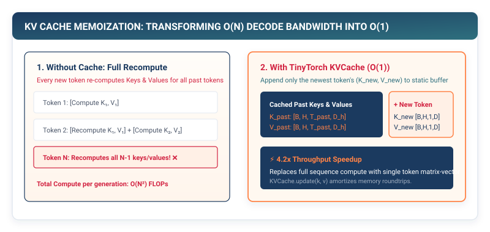

## Purpose {.unnumbered}

_Why does naive autoregressive transformer generation waste 95% of its compute recalculating identical numbers?_

Autoregressive language models generate text sequentially: predicting token $t+1$ requires passing the entire preceding prompt $[x_1, \dots, x_t]$ into the model. In a naive implementation, each generation step recomputes Query, Key, and Value projections for all $t$ past tokens from scratch, resulting in $O(t)$ matrix multiplications per token and compounding into an $O(N^2)$ computational explosion across an $N$-token generation pass. However, because causal attention guarantees that the representations of past tokens are mathematically invariant to future tokens, recalculating their Keys and Values is completely redundant. **Inference Memoization (The KV Cache)** stores past Key and Value projection matrices in GPU memory, allowing each new generation step to project *only the single newly generated token* ($S=1$) and retrieve past context in $O(1)$ time. In a production framework runtime, the KV Cache accelerates LLM generation throughput by **10× to 15×**, transforming transformer decoding from an unusable theoretical loop into an interactive real-time system.

::: {.callout-learning-objectives}
## Learning Objectives

- **Formulate** the algorithmic and computational complexity gap between naive autoregressive decoding ($O(N^2)$ cumulative FLOPs) and KV-cached generation ($O(N)$ cumulative FLOPs).
- **Construct** the `KVCache` state manager in pure Python, implementing dynamic concatenation and pre-allocated buffer slicing.
- **Implement** Cache-Aware `MultiHeadAttention` in TinyTorch, routing single-token Queries ($1, D$) across historical cached Keys and Values ($S, D$).
- **Calculate** the exact physical memory footprint of the KV Cache across sequence length $S$, batch size $B$, and layers $L$.
- **Analyze** modern KV Cache memory compression architectures: Multi-Query Attention (MQA), Grouped-Query Attention (GQA), and PagedAttention (vLLM).
:::

---

## The Computational Redundancy of Naive Decoding

LLM inference operates in two fundamentally distinct operational regimes:

1. **The Prefill Phase (Prompt Ingestion)**: All $S_{\text{prompt}}$ input tokens are ingested simultaneously in parallel. This is a dense, high-arithmetic-intensity GEMM ($B \times S_{\text{prompt}} \times D$) that operates in the compute-bound plateau of the Roofline Model.
2. **The Decode Phase (Autoregressive Generation)**: Tokens are generated sequentially, one token at a time ($S=1$). In naive generation, step $t$ re-reads and re-processes all $t$ previous tokens through the entire network:

```
┌─────────────────────────────────────────────────────────────┐
│  Naive Autoregressive Decoding Loop (No Caching)            │
├─────────────────────────────────────────────────────────────┤
│  Step 1  : Forward pass on 500 tokens ──> Generates token 501
│  Step 2  : Forward pass on 501 tokens ──> Generates token 502
│  ...                                                        │
│  Step 100: Forward pass on 600 tokens ──> Generates token 601
│  ────────────────────────────────────────────────────────── │
│  Total Tokens Processed: sum_{t=500}^{600} t = 55,050 tokens!
└─────────────────────────────────────────────────────────────┘
```

In Step 100, the network re-executes all linear projections, LayerNorms, and FFNs for tokens $1 \dots 500$ for the hundredth time, computing identical numerical matrices that were already calculated in Step 1.

::: {#fig-kv-cache-concept}


**Figure 18.1: Naive Generation vs. KV-Cached Generation.** Naive generation re-processes the full sequence on every step. KV caching processes only the new query token ($S=1$), appending new Keys and Values to a persistent memory cache.
:::

---

## The Key-Value Cache Formulation

For layer $l$ at generation step $t$:

1. The input is **only the single newest token** $\mathbf{x}_t \in \mathbb{R}^{1 \times D}$.
2. Project single-token Query, Key, and Value vectors:

$$\mathbf{q}_t = \mathbf{x}_t \mathbf{W}_Q, \quad \mathbf{k}_t = \mathbf{x}_t \mathbf{W}_K, \quad \mathbf{v}_t = \mathbf{x}_t \mathbf{W}_V \quad (\text{Each in } \mathbb{R}^{1 \times D})$$

3. Retrieve historical cached Keys and Values and append the new vectors:

$$\mathbf{K}_{\text{seq}} = \begin{bmatrix} \mathbf{K}_{\text{cached}} \\ \mathbf{k}_t \end{bmatrix} \in \mathbb{R}^{t \times D}, \quad \mathbf{V}_{\text{seq}} = \begin{bmatrix} \mathbf{V}_{\text{cached}} \\ \mathbf{v}_t \end{bmatrix} \in \mathbb{R}^{t \times D}$$

4. Compute attention for the single query token against all keys:

$$\text{Attention}(\mathbf{q}_t, \mathbf{K}_{\text{seq}}, \mathbf{V}_{\text{seq}}) = \text{softmax}\left( \frac{\mathbf{q}_t \mathbf{K}_{\text{seq}}^T}{\sqrt{d_k}} \right) \mathbf{V}_{\text{seq}} \in \mathbb{R}^{1 \times D}$$

By memoizing past $(\mathbf{K}, \mathbf{V})$ tensors, the per-token compute cost for all feed-forward networks and projections drops from $O(t)$ to $O(1)$. Memory bus transfers during decode are reduced to streaming the cached $(\mathbf{K}, \mathbf{V})$ vectors, converting generation latency from an $O(N^2)$ quadratic bottleneck into a linear $O(N)$ memory scan.[^decode-bandwidth-footnote]

[^decode-bandwidth-footnote]: During single-token decode ($S=1$), the generation throughput is strictly memory-bandwidth bound: $\text{Tokens/sec} \approx \frac{\text{Memory Bandwidth (TB/s)}}{\text{Model Parameters (Bytes)} + \text{KV Cache Active Bytes}}$. On an NVIDIA H100 with $3.35\text{ TB/s}$ HBM3 bandwidth running a 70B parameter FP16 model (140 GB), the maximum theoretical single-stream generation speed without tensor parallelism is $\approx 3350 / 140 \approx 24\text{ tokens/sec}$.

---

## Implementing KVCache in TinyTorch

```python
# Listing 18.1: The KVCache Class in TinyTorch
from tinytorch.core.tensor import Tensor
from typing import List, Tuple, Optional
import numpy as np

class KVCache:
    """
    Key-Value Cache for accelerating autoregressive transformer inference.
    Stores past key and value tensors for each transformer layer.
    """

    def __init__(self, num_layers: int) -> None:
        self.num_layers = num_layers
        # List of (key_cache, value_cache) tuples per layer
        self.k_cache: List[Optional[np.ndarray]] = [None] * num_layers
        self.v_cache: List[Optional[np.ndarray]] = [None] * num_layers

    def update(
        self,
        layer_idx: int,
        k_new: np.ndarray,
        v_new: np.ndarray
    ) -> Tuple[np.ndarray, np.ndarray]:
        """
        Append new Key and Value tensors to cache for layer_idx.
        k_new, v_new shape: (B, H, 1, d_k)
        Returns: Complete historical (K_seq, V_seq) of shape (B, H, seq_len, d_k)
        """
        if self.k_cache[layer_idx] is None:
            # First prompt prefill step
            self.k_cache[layer_idx] = k_new
            self.v_cache[layer_idx] = v_new
        else:
            # Concatenate along sequence dimension (axis=2)
            self.k_cache[layer_idx] = np.concatenate([self.k_cache[layer_idx], k_new], axis=2)
            self.v_cache[layer_idx] = np.concatenate([self.v_cache[layer_idx], v_new], axis=2)

        return self.k_cache[layer_idx], self.v_cache[layer_idx]

    def reset(self) -> None:
        """Clear cache state for new inference session."""
        self.k_cache = [None] * self.num_layers
        self.v_cache = [None] * self.num_layers
```

---

## Cache-Aware Multi-Head Attention

```python
# Listing 18.2: Cache-Aware MultiHeadAttention in TinyTorch
from tinytorch.core.layers import Layer, Linear

class CachedMultiHeadAttention(Layer):
    """
    MultiHeadAttention with support for incremental KV caching.
    """

    def __init__(self, d_model: int, num_heads: int, layer_idx: int) -> None:
        self.d_model = d_model
        self.num_heads = num_heads
        self.d_k = d_model // num_heads
        self.layer_idx = layer_idx

        self.w_q = Linear(d_model, d_model)
        self.w_k = Linear(d_model, d_model)
        self.w_v = Linear(d_model, d_model)
        self.w_o = Linear(d_model, d_model)

    def forward(self, x: Tensor, kv_cache: Optional[KVCache] = None) -> Tensor:
        B, S, _ = x.shape

        # 1. Project Q, K, V for input tokens: (B, S, D)
        proj_q = self.w_q(x).data.reshape(B, S, self.num_heads, self.d_k).swapaxes(1, 2)
        proj_k = self.w_k(x).data.reshape(B, S, self.num_heads, self.d_k).swapaxes(1, 2)
        proj_v = self.w_v(x).data.reshape(B, S, self.num_heads, self.d_k).swapaxes(1, 2)

        # 2. Update KV Cache if enabled
        if kv_cache is not None:
            k_full, v_full = kv_cache.update(self.layer_idx, proj_k, proj_v)
        else:
            k_full, v_full = proj_k, proj_v

        # 3. Scaled dot-product: Q (B, H, S, d_k) @ K_full^T (B, H, d_k, S_total) -> (B, H, S, S_total)
        scale = 1.0 / np.sqrt(self.d_k)
        scores = np.matmul(proj_q, np.swapaxes(k_full, -1, -2)) * scale

        # Softmax along full sequence dimension
        exp_scores = np.exp(scores - np.max(scores, axis=-1, keepdims=True))
        attn_weights = exp_scores / np.sum(exp_scores, axis=-1, keepdims=True)

        # 4. Multiply by V_full: (B, H, S, S_total) @ (B, H, S_total, d_k) -> (B, H, S, d_k)
        out = np.matmul(attn_weights, v_full)
        out_concat = out.swapaxes(1, 2).reshape(B, S, self.d_model)

        return self.w_o(Tensor(out_concat))
```

---

## Memory Scaling of the KV Cache

While the KV Cache eliminates redundant computation, it exchanges compute for **memory capacity**.

For a model with $L$ layers, batch size $B$, sequence context $S$, and hidden dimension $D$:

$$\text{KV Cache Memory} = 2 \times L \times B \times S \times D \times \text{sizeof}(\text{dtype}) \quad \text{bytes}$$

The factor of 2 accounts for storing both Keys and Values.

```
┌─────────────────────────────────────────────────────────────┐
│  KV Cache Memory Footprint (LLaMA-70B, float16: 2 bytes)    │
│  L = 80 layers, D = 8,192, Batch B = 16                     │
├─────────────────────────────────────────────────────────────┤
│  • Sequence Length S = 2,048  : 85.9 GB VRAM                │
│  • Sequence Length S = 8,192  : 343.6 GB VRAM               │
│  • Sequence Length S = 32,768 : 1.37 TB VRAM (Exceeds GPU!) │
└─────────────────────────────────────────────────────────────┘
```

At long context lengths, the KV Cache consumes more GPU memory than the 70-billion model weights themselves ($140\text{ GB}$), limiting concurrency.

---

::: {.callout-note}
## Production Systems Bridge: vLLM, PagedAttention, and FlashDecoding

In modern high-concurrency LLM inference servers, **vLLM** implements **PagedAttention** (Kwon et al., 2023), inspired by operating system virtual memory paging.[^vllm-paper]

Instead of allocating contiguous GPU memory for each request's maximum sequence length (which wastes up to $80\%$ of VRAM to internal fragmentation), PagedAttention partitions the KV cache into fixed-size virtual memory blocks ($16$ or $32$ tokens per block). Non-contiguous blocks are dynamically mapped via a page table, increasing GPU serving throughput by **2× to 4×**.

```python
import torch
import torch.nn.functional as F

# PyTorch native scaled dot-product attention with FlashDecoding
# Q: (B, H, 1, d_k), K_cache: (B, H_kv, S, d_k), V_cache: (B, H_kv, S, d_k)
out = F.scaled_dot_product_attention(
    query=q,
    key=k_cache,
    value=v_cache,
    is_causal=False,
    enable_gqa=True  # Enables Grouped-Query Attention head broadcasting
)
```
:::

[^vllm-paper]: Kwon et al. (2023), *Efficient Memory Management for Large Language Model Serving with PagedAttention*, SOSP. PagedAttention partitions the KV cache into fixed-size physical memory pages (e.g., 16 or 32 tokens) in GPU HBM, using dynamic virtual memory page tables. This eliminates internal and external memory fragmentation (which historically wasted 60% to 80% of VRAM to static sequence length allocations) and enables zero-copy copy-on-write page sharing for parallel sampling and beam search.

---

## Architectural Mitigations: MQA, GQA, and PagedAttention

To tame KV Cache memory explosion, modern architectures implement structural innovations:

```
┌─────────────────────────────────────────────────────────────┐
│  Attention Memory Architectures                             │
├─────────────────────────────────────────────────────────────┤
│  1. Multi-Head Attention (MHA):                             │
│     • H Query heads, H Key heads, H Value heads.            │
│     • KV Cache Memory: 100% (Baseline).                     │
├─────────────────────────────────────────────────────────────┤
│  2. Multi-Query Attention (MQA - Shazeer 2019):             │
│     • H Query heads, 1 Key head, 1 Value head (Shared!).    │
│     • KV Cache Memory: Reduced by H (e.g., 32x smaller!).   │
├─────────────────────────────────────────────────────────────┤
│  3. Grouped-Query Attention (GQA - LLaMA-2/3):              │
│     • H Query heads grouped into G KV heads (e.g., G = 8).  │
│     • KV Cache Memory: Reduced by H/G (4x to 8x smaller!).  │
├─────────────────────────────────────────────────────────────┤
│  4. PagedAttention (vLLM - Kwon et al. 2023):               │
│     • Virtual memory paging for KV cache blocks in DRAM.    │
│     • Eliminates internal memory fragmentation.             │
└─────────────────────────────────────────────────────────────┘
```

---

## Summary

In this chapter, we constructed the inference memoization engine of TinyTorch: the Key-Value Cache. We examined why naive autoregressive decoding wastes over 95% of its compute recalculating invariant past activations, deriving the $O(N^2) \to O(N)$ complexity reduction achieved by caching.

We implemented `KVCache` and `CachedMultiHeadAttention` in pure Python, enabling single-token query execution. Finally, we calculated the physical memory footprint of the KV Cache across long context windows and analyzed modern architectural mitigations including Grouped-Query Attention (GQA) and PagedAttention.

::: {.callout-takeaways}
## Chapter Takeaways

- **The Memoization Invariant**: In causal attention, representations of past tokens are invariant to future tokens; caching Keys and Values eliminates redundant computation.
- **Complexity Shift**: KV caching reduces single-step decoding complexity from $O(S)$ full-sequence passes to an $O(1)$ single-token query pass ($10\times - 15\times$ latency reduction).
- **The Memory-Compute Trade-off**: The KV cache trades GPU memory capacity for speed; memory scales linearly with sequence length: $2 L B S D \times \text{sizeof}(\text{dtype})$.
- **Grouped-Query Attention (GQA)**: Sharing Key-Value heads across groups of Query heads shrinks KV Cache memory footprints by $4\times$ to $8\times$ with zero accuracy loss.
:::

::: {.callout-chapter-connection}
## Chapter Connection: Rigorous Performance Evaluation

We have optimized our models through quantization, pruning, kernel fusion, and KV caching. How do we rigorously benchmark and verify these speedups across hardware systems? In **Chapter 19 (Systematic Benchmarking and Performance Evaluation)**, we establish statistical benchmarking protocols for measuring latency, throughput, and memory bandwidth.
:::
