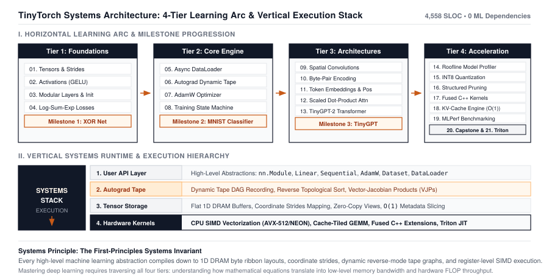

# Welcome: The Black Box Crisis {.unnumbered}

## Don't Just Import Torch. Build It.

Consider standard PyTorch training code:

```python
import torch
import torch.nn as nn

# Define a linear layer
layer = nn.Linear(512, 1024)

# Forward pass
x = torch.randn(32, 512)
y = layer(x)

# Loss and backward pass
loss = y.sum()
loss.backward()
```

In seven lines of Python, the framework has quietly performed a remarkable chain of systems engineering feats:

1. Allocated a contiguous block of $32 \times 512 \times 4 = 65,536$ bytes of IEEE 754 floating-point memory.
2. Initialized a weight matrix using uniform bounds derived from the reciprocal square root of input features ($\sqrt{1/512}$).
3. Dispatched a high-performance General Matrix Multiplication (GEMM) routine executing billions of floating-point operations per second.
4. Dynamically allocated an in-memory Directed Acyclic Graph (DAG) recording the mathematical operations executed during the forward pass.
5. Traversed the computational graph in reverse topological order, evaluating analytical vector-Jacobian products, accumulating gradient vectors in place, and preparing parameters for numerical optimization.

Yet to the developer, all of this happens behind an opaque curtain.

When your training job runs $10\times$ slower than expected, is it because your DataLoader is stalling on disk I/O? Is it because non-contiguous tensor strides are causing cache misses? Is it because your loss function is suffering from floating-point underflow? Or is it because your GPU is thrashing memory bandwidth by launching un-fused elementwise kernels?

You cannot debug what you do not understand.

{#fig-welcome-roadmap}

## The Architecture of This Journey

This book is organized as a single, continuous engineering build. Every chapter directly constructs the foundation for the next:

### Tier 1: The Foundations (Chapters 1–4)
We begin with the core data structure of all modern computing: the **Tensor**. We build contiguous 1D memory buffers with multidimensional stride arithmetic, non-linear activation functions (ReLU, Sigmoid, GELU), modular affine layers, and numerically stable loss functions stabilized via the Log-Sum-Exp trick.

### Tier 2: The Core Engine (Chapters 5–8)
We construct the runtime engine that powers neural learning: an asynchronous **DataLoader** pipeline that feeds batches without compute stalls, a dynamic **Autograd** tape recording reverse-mode topological graphs, adaptive optimizers (**SGD with Momentum** and **AdamW** with decoupled weight decay), and a deterministic **5-step training engine**.

### Tier 3: Deep Architectures (Chapters 9–13)
We scale beyond 1D vectors into multidimensional spatial vision and human language. We build 2D **Spatial Convolutions** with the `im2col` GEMM trick, train a **Byte-Pair Encoding (BPE)** subword tokenizer from raw bytes, construct continuous **Embeddings** and sinusoidal positional encodings, build **Multi-Head Attention**, and assemble a complete autoregressive **GPT-2 Transformer**.

### Tier 4: Systems Acceleration (Chapters 14–20)
We take our working framework and make it blazingly fast. We profile bottlenecks using the **Roofline Model**, compress weights by $4\times$ using **INT8 Quantization**, prune redundant parameters with **Structured Pruning**, eliminate memory roundtrips with **Kernel Fusion**, turn autoregressive token generation into an $O(1)$ operation with the **KV Cache**, and measure results via **MLPerf Benchmarking**.

---

::: {.callout-note appearance="simple"}
## The Builder's Rule
Throughout this book, every equation we encounter will be directly translated into a working Python implementation. If an equation does not serve a physical, memory, or computational purpose on hardware, it does not belong in this framework.
:::

Turn the page. We begin in Chapter 1 with the foundation of all machine learning systems: **The Tensor**.
