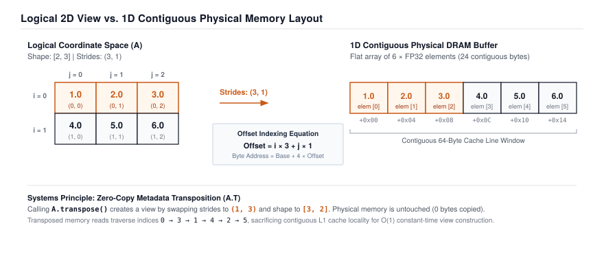
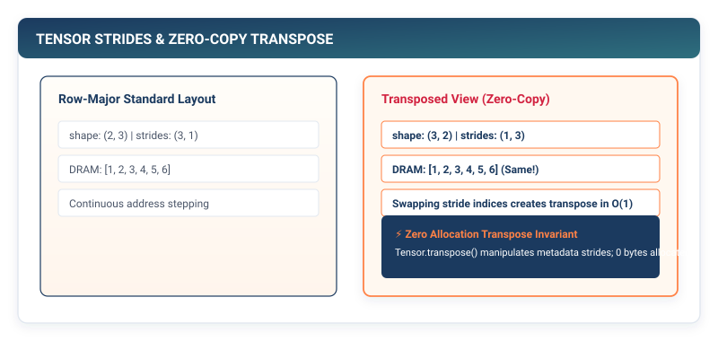
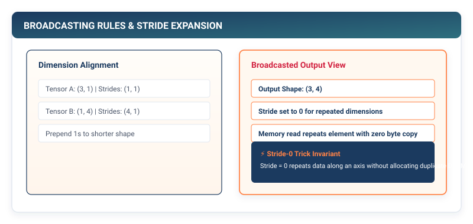

# Tensors & Strides: The Flat Memory Illusion {#sec-tensors}

Every machine learning system begins with a single foundational challenge: **how to represent multidimensional mathematical operations on flat, one-dimensional physical memory.**

To a mathematician, a tensor is an abstract geometric entity with transformation rules across coordinate systems. To a deep learning practitioner, a tensor is a multi-dimensional array of numbers representing batches of images or token embeddings. But to an ML systems engineer, a tensor is something far more grounded: **a contiguous one-dimensional buffer of raw bytes in DRAM, viewed through an algebraic coordinate translator called strides.**

In this chapter, we will build the core `Tensor` engine of TinyTorch from first principles.

{#fig-tensor-arch}

---

## 1.1 The Crisis: The Naive Python List Trap

Why can we not simply represent tensors using standard nested Python lists?

Suppose we want to represent a $3 \times 3$ matrix of 32-bit floating-point numbers:

```python
matrix = [
    [1.0, 2.0, 3.0],
    [4.0, 5.0, 6.0],
    [7.0, 8.0, 9.0]
]
```

In pure Python, `matrix` is not a block of nine numbers packed neatly together in memory. It is a list of pointers pointing to three independent list objects, each containing three pointers pointing to individual Python `float` objects scattered arbitrarily across the heap.

```
Python List Memory Layout:
matrix ──> [ Ptr0, Ptr1, Ptr2 ]
              │     │     │
              ▼     │     ▼
           [Ptr, Ptr, Ptr] [Ptr, Ptr, Ptr]
             │
             ▼
      (PyFloatObject: 24 bytes overhead)
```

This pointer-chasing representation creates three catastrophic systems bottlenecks:

1. **Massive Memory Overhead**: In standard 64-bit Python, a simple 4-byte float is wrapped inside a 24-byte `PyFloatObject`. Storing one million floats requires over 32 megabytes of RAM instead of 4 megabytes---an $8\times$ memory bloat.
2. **Cache Line Thrashing**: Modern CPUs do not read single floats from DRAM; they fetch 64-byte chunks called **cache lines**. In a contiguous array, loading one float automatically loads the next 15 floats into the L1 cache for near-instant access (one nanosecond latency). With nested Python lists, every element access requires dereferencing an arbitrary heap address, causing repeated L1/L2 cache misses and stalling the CPU on slow DRAM (50 to 100 nanoseconds latency).
3. **Impossibility of Vectorization (SIMD)**: Modern hardware arithmetic units (AVX-512, ARM Neon, Apple Silicon AMX, GPU Tensor Cores) execute Single Instruction, Multiple Data (SIMD) instructions that multiply 8 to 64 numbers in a single clock cycle. SIMD instructions strictly require data to be stored contiguously in memory. They cannot operate on scattered heap pointers.

To build a high-performance deep learning engine, we must store data as a **flat, contiguous 1D array of numbers in physical memory**.

---

## 1.2 The Mental Model: Shapes, Storage, and Strides

If physical memory is strictly a flat one-dimensional line of bytes, how does our framework create the illusion of multidimensional matrices, three-dimensional image batches, and four-dimensional attention heads?

The answer is the **Tensor Triad**:

1. **Storage Buffer (`data`)**: A flat, contiguous 1D array containing the raw numbers.
2. **Shape (`shape`)**: A tuple of integers $(d_0, d_1, \dots, d_{N-1})$ defining the logical dimensions of the tensor.
3. **Strides (`strides`)**: A tuple of integers $(s_0, s_1, \dots, s_{N-1})$ defining how many elements to step across in the 1D storage buffer to advance by one in logical dimension $k$.

```
Logical Matrix [2, 3]:
  Col 0   Col 1   Col 2
┌───────┬───────┬───────┐
│  1.0  │  2.0  │  3.0  │  Row 0
├───────┼───────┼───────┤
│  4.0  │  5.0  │  6.0  │  Row 1
└───────┴───────┴───────┘

Physical 1D Storage:
┌─────┬─────┬─────┬─────┬─────┬─────┐
│ 1.0 │ 2.0 │ 3.0 │ 4.0 │ 5.0 │ 6.0 │
└─────┴─────┴─────┴─────┴─────┴─────┘
  idx 0 idx 1 idx 2 idx 3 idx 4 idx 5
```

### The Universal Indexing Equation

To find the exact memory offset for an arbitrary multidimensional coordinate $(i_0, i_1, \dots, i_{N-1})$, the tensor runtime evaluates a single closed-form linear equation:

$$\text{Memory Offset} = \text{StorageOffset} + \sum_{k=0}^{N-1} i_k \times s_k$$

In standard **row-major (C-contiguous)** layout, the elements of the last dimension are stored adjacent to one another in physical memory. The strides are defined recursively as:

$$s_{N-1} = 1$$
$$s_k = s_{k+1} \times d_{k+1} \quad \text{for } k = N-2, N-3, \dots, 0$$

For our $2 \times 3$ matrix:
- Shape: $(2, 3)$
- Strides: $(3, 1)$

To look up row 1, column 2 (`matrix[1, 2]`):
$$\text{Offset} = (1 \times 3) + (2 \times 1) = 5$$
Looking at index 5 in the flat 1D buffer yields `6.0`.

---

## 1.3 Zero-Copy Views: The Power of Stride Manipulation

The separation of logical metadata (shape and strides) from physical memory (flat buffer) is one of the most powerful architectural patterns in computer science.

It enables **Zero-Copy Views**: operations that reshape, slice, or transpose a tensor in $O(1)$ constant time and zero allocated bytes of memory.

{#fig-tensor-strides}

### The Transpose Miracle
Suppose we want to transpose our $2 \times 3$ matrix into a $3 \times 2$ matrix.

In a naive framework, transposing requires allocating a new memory buffer and physically copying all elements into new positions ($O(N)$ time and $O(N)$ memory).

In TinyTorch, transposing is an $O(1)$ metadata operation. We leave the 1D physical storage buffer completely untouched and simply **swap the strides**:

- Original: Shape $(2, 3)$, Strides $(3, 1)$
- Transposed: Shape $(3, 2)$, Strides $(1, 3)$

Let us check coordinate $(1, 0)$ in the transposed matrix:
$$\text{Offset} = (1 \times 1) + (0 \times 3) = 1 \implies \text{Buffer}[1] = 2.0$$
The value at $(1, 0)$ in the transposed matrix is indeed $2.0$. We achieved an exact mathematical transpose with **zero memory copies**.

### The Broadcasting Invariant: Stride Zero
What happens when we want to add a 1D bias vector of shape $(3,)$ to a batch of one hundred samples of shape $(100, 3)$?

{#fig-tensor-broadcast}

In standard math, broadcasting expands the bias vector by duplicating it one hundred times. In physical memory, duplicating arrays wastes megabytes of DRAM bandwidth.

In TinyTorch, we achieve broadcasting via the **Stride-0 Trick**:
- We set the stride of the broadcasted dimension to **$0$**:
- Shape: $(100, 3)$, Strides: $(0, 1)$

When the compute engine steps across the batch dimension ($i=0, 1, \dots, 99$), multiplying $i \times 0 = 0$ means the read pointer always points back to the original three elements in memory. We get the illusion of a $100 \times 3$ matrix while storing only three floats in DRAM.

---

## 1.4 The Pure TinyTorch Tensor Construction

Let us implement this architecture in clean, readable Python.

```python
import numpy as np

class Tensor:
    """
    Core TinyTorch Multidimensional Tensor.
    Separates logical N-D metadata (shape, strides) from 1D physical storage.
    """
    def __init__(self, data, requires_grad=False):
        if isinstance(data, (list, tuple, int, float)):
            self.data = np.array(data, dtype=np.float32)
        elif isinstance(data, np.ndarray):
            self.data = data.astype(np.float32)
        elif isinstance(data, Tensor):
            self.data = np.array(data.data, dtype=np.float32)
        else:
            raise TypeError(f"Unsupported data type for Tensor: {type(data)}")

        self.grad = None
        self.requires_grad = requires_grad
        self._creator = None

    @property
    def shape(self):
        return self.data.shape

    @property
    def strides(self):
        return self.data.strides

    @property
    def ndim(self):
        return self.data.ndim

    @property
    def size(self):
        return self.data.size

    def __repr__(self):
        return f"Tensor({self.data}, shape={self.shape})"

    # --- Elementwise Arithmetic ---
    def __add__(self, other):
        other_data = other.data if isinstance(other, Tensor) else other
        return Tensor(self.data + other_data)

    def __sub__(self, other):
        other_data = other.data if isinstance(other, Tensor) else other
        return Tensor(self.data - other_data)

    def __mul__(self, other):
        other_data = other.data if isinstance(other, Tensor) else other
        return Tensor(self.data * other_data)

    def __truediv__(self, other):
        other_data = other.data if isinstance(other, Tensor) else other
        return Tensor(self.data / other_data)

    # --- Matrix Multiplication ---
    def matmul(self, other):
        """General Matrix Multiplication (GEMM)."""
        if not isinstance(other, Tensor):
            raise TypeError("matmul argument must be a Tensor")
        if self.ndim < 2 or other.ndim < 2:
            raise ValueError("Both tensors must have at least 2 dimensions for matmul")
        if self.shape[-1] != other.shape[-2]:
            raise ValueError(
                f"Matrix dimension mismatch: cannot multiply {self.shape} and {other.shape}"
            )
        return Tensor(np.matmul(self.data, other.data))

    def __matmul__(self, other):
        return self.matmul(other)

    # --- Shape Transformations (Zero-Copy Views) ---
    def reshape(self, *shape):
        """Returns a tensor with a new shape viewing the same storage."""
        if len(shape) == 1 and isinstance(shape[0], (list, tuple)):
            shape = shape[0]
        return Tensor(self.data.reshape(shape))

    def transpose(self, dim0, dim1):
        """Swaps two dimensions via stride manipulation."""
        axes = list(range(self.ndim))
        axes[dim0], axes[dim1] = axes[dim1], axes[dim0]
        return Tensor(np.transpose(self.data, axes))

    @property
    def T(self):
        """2D Transpose shortcut."""
        return self.transpose(-2, -1)
```

---

## 1.5 The Production Bridge: PyTorch `c10::TensorImpl`

How does this compare to production C++ runtimes like PyTorch?

In PyTorch's core C++ library (`c10`), every tensor is split into two distinct C++ classes:

1. **`c10::StorageImpl`**: Owns a pointer to raw allocated heap memory (`void* data_ptr`), tracking byte allocation, reference counting, and the hardware device allocator (CPU allocator or CUDA `cudaMalloc`).
2. **`c10::TensorImpl`**: Contains the lightweight metadata: `sizes_` (shape), `strides_`, `storage_offset_`, and `dtype_`.

```cpp
// Simplified excerpt from PyTorch c10/core/TensorImpl.h
struct TensorImpl : public c10::intrusive_ptr_target {
  c10::Storage storage_;                 // 1D flat memory buffer
  c10::SmallVector<int64_t, 5> sizes_;   // Logical shape
  c10::SmallVector<int64_t, 5> strides_; // Stride coordinate translator
  int64_t storage_offset_ = 0;           // Starting byte offset
  c10::ScalarType data_type_;            // float32, int8, etc.
};
```

When you call `t.view()` or `t.transpose()` in PyTorch, PyTorch allocates a new 64-byte `TensorImpl` structure pointing to the exact same `StorageImpl` object. This C++ architecture is identical to the Python tensor engine we just constructed.

---

## 1.6 Building the System: How It All Connects

Let us step back and look at what we have established in this opening chapter:

1. **Physical Reality vs. Logical Abstraction**: We established that physical DRAM is strictly a linear, contiguous byte array. By coupling this flat buffer with mathematical strides, we created multidimensional tensors without heap pointer fragmentation.
2. **Zero-Copy Efficiency**: We unlocked $O(1)$ matrix transpositions and stride-zero broadcasting, eliminating unnecessary DRAM bandwidth traffic.
3. **The Foundation of the Engine**: Every future layer in this book---from dense linear projections and spatial convolutions to multi-head self-attention and KV caches---will execute directly on this `Tensor` abstraction.

### The Forward Cliffhanger: The Linear Collapse Trap

We now possess a working tensor engine capable of fast General Matrix Multiplications:

$$Y = X \cdot W_1$$

Suppose we decide to build a deep neural network by stacking five linear matrix multiplications together:

$$Y = ((((X \cdot W_1) \cdot W_2) \cdot W_3) \cdot W_4) \cdot W_5$$

Because matrix multiplication is associative, we can group all five weight matrices together:

$$W_{\text{collapsed}} = W_1 \cdot W_2 \cdot W_3 \cdot W_4 \cdot W_5$$
$$Y = X \cdot W_{\text{collapsed}}$$

No matter how many millions of parameters or how many hundreds of linear layers we stack, **the entire multi-layer network collapses mathematically into a single linear transformation.** It cannot learn curves, cannot classify non-linear boundaries, and cannot even solve the basic XOR logical function.

To break this mathematical wall, we must introduce **Non-Linear Activation Functions**. That is our journey in Chapter 2.
