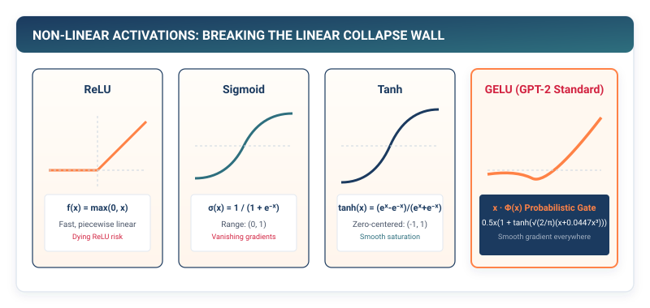

# Activations: Breaking the Linear Collapse Wall {#sec-activations}

In Chapter 1, we constructed the multi-dimensional tensor, conquering the memory allocation and strided layout of numerical data. With high-performance matrix multiplication ($Y = XW^T$) in hand, the intuitive next step in building a "deep" neural network is simply to chain multiple matrix multiplications together:

$$h_1 = X W_1, \qquad h_2 = h_1 W_2, \qquad \dots, \qquad y = h_{L-1} W_L$$

Yet if you construct this multi-layer network and train it for a thousand epochs, you will discover an astonishing mathematical failure: **a 100-layer linear network has no more expressive power than a single-layer linear regression**.

In this chapter, we engineer **Non-Linear Activation Functions (`ReLU`, `Sigmoid`, `Tanh`, `GELU`)**. We provide the mathematical proof of linear collapse, explore why historical sigmoid activations caused the vanishing gradient crisis, and implement the modern Gaussian Error Linear Unit (`GELU`) that powers the transformer architecture.

{#fig-activation-zoo}

---

## 2.1 The Crisis: The Mathematical Proof of Linear Collapse

Why can a network composed entirely of linear matrix multiplications never learn non-linear patterns (such as computer vision, speech recognition, or human language)?

Let us examine a deep network composed of $L$ consecutive linear layers:

$$y = \left( \dots \left( \left( X W_1 \right) W_2 \right) \dots \right) W_L$$

Because matrix multiplication is strictly **associative** ($A(BC) = (AB)C$), we can group all $L$ weight matrices together into a single combined matrix product:

$$W_{\text{combined}} = W_1 \cdot W_2 \cdot W_3 \dots W_L$$

If $W_1 \in \mathbb{R}^{D_{\text{in}} \times H_1}$ and $W_L \in \mathbb{R}^{H_{L-1} \times D_{\text{out}}}$, the composite product $W_{\text{combined}}$ is simply a single matrix of shape $\mathbb{R}^{D_{\text{in}} \times D_{\text{out}}}$.

```
The Associative Linear Collapse Proof:
Step 1: h_1 = X · W_1
Step 2: h_2 = h_1 · W_2 = (X · W_1) · W_2 = X · (W_1 · W_2)
Step 3: y   = h_2 · W_3 = (X · (W_1 · W_2)) · W_3 = X · (W_1 · W_2 · W_3)

Result: y = X · W_effective  where W_effective = W_1 · W_2 · W_3
```

No matter how many millions of parameters or how many layers you stack, the entire computational graph collapses into a single affine hyper-plane. A 100-layer deep linear network cannot even solve the basic logical XOR problem (which we will explore in Milestone I).

To build deep intelligence, we must break the associative chain. We must insert a **non-linear mathematical gate** $\sigma(\cdot)$ after every linear transformation:

$$h_1 = \sigma(X W_1), \qquad h_2 = \sigma(h_1 W_2), \qquad y = \sigma(h_{L-1} W_L)$$

Because $\sigma(A \cdot B) \ne \sigma(A) \cdot \sigma(B)$, the layers cannot be merged. The network can now warp, fold, and carve non-linear decision manifolds in high-dimensional space.

---

## 2.2 The Mental Model: From Biological Thresholds to Smooth Quantum Gating

Over the history of artificial intelligence, four major activation functions have defined the evolution of deep learning:

```
┌─────────────────────────────────────────────────────────────────────────────┐
│                       THE EVOLUTION OF ACTIVATION FUNCTIONS                 │
├─────────────┬───────────────────────────────┬───────────────────────────────┤
│ Activation  │ Mathematical Formulation      │ Systems / Mathematical Impact │
├─────────────┼───────────────────────────────┼───────────────────────────────┤
│ 1. Sigmoid  │ σ(x) = 1 / (1 + exp(-x))      │ Bounded (0, 1). Vanishing     │
│             │                               │ gradients for |x| > 4.        │
├─────────────┼───────────────────────────────┼───────────────────────────────┤
│ 2. Tanh     │ tanh(x) = (e^x - e^-x)/(e^x+e^-x) Zero-centered (-1, +1).     │
│             │                               │ Vanishing gradients for |x|>3.│
├─────────────┼───────────────────────────────┼───────────────────────────────┤
│ 3. ReLU     │ ReLU(x) = max(0, x)           │ Piecewise linear. Gradient=1  │
│             │                               │ for x>0 (Rescued deep nets!). │
├─────────────┼───────────────────────────────┼───────────────────────────────┤
│ 4. GELU     │ GELU(x) = x · Φ(x)            │ Smooth, probabilistic gating. │
│             │ ≈ 0.5x(1 + tanh(√(2/π)(x+...))) Modern transformer standard.  │
└─────────────┴───────────────────────────────┴───────────────────────────────┘
```

### The Vanishing Gradient Crisis of Sigmoid and Tanh

In the 1990s, networks relied primarily on the **Sigmoid** function $\sigma(x) = \frac{1}{1 + e^{-x}}$.

The derivative of the sigmoid function is:

$$\sigma'(x) = \sigma(x) (1 - \sigma(x))$$

The maximum possible value of $\sigma'(x)$ occurs at $x = 0$, where $\sigma'(0) = 0.5 \times 0.5 = \mathbf{0.25}$.

```
Vanishing Gradients in a 10-Layer Sigmoid Network:
During backpropagation, gradients multiply across layers by the chain rule:
dL/dh_1 = dL/dh_10 * (0.25) * (0.25) * ... * (0.25) = dL/dh_10 * (0.25)^10 ≈ dL/dh_10 * 9.5e-7

The loss error completely vanishes before reaching the first hidden layer! ❌
```

### The ReLU Revolution (Nair & Hinton, 2010)

The **Rectified Linear Unit (ReLU)** rescued deep learning by defining a simple piecewise linear function:

$$\text{ReLU}(x) = \max(0, x)$$

For all positive activations ($x > 0$), the local derivative is exactly $\mathbf{1.0}$. Gradients propagate through 100 layers with zero attenuation.

### The GELU Standard in Transformers (Hendrycks & Gimpel, 2016)

While ReLU makes a hard binary decision ($x > 0$), the **Gaussian Error Linear Unit (GELU)** weights inputs by their probability under a standard Gaussian cumulative distribution:

$$\text{GELU}(x) = x \cdot \Phi(x) = x \cdot P(X \le x) \quad \text{where } X \sim \mathcal{N}(0, 1)$$

GELU provides a smooth, non-monotonic curvature: for small negative values ($x \in [-2, 0]$), it allows a tiny negative gradient to pass through rather than hard-clamping to zero, preventing "dead neuron" syndrome.

---

## 2.3 The Pure TinyTorch Construction

We implement the complete suite of non-linear activations in TinyTorch:

```python
import numpy as np
from .tensor import Tensor

class Activation:
    """Base class for non-linear activation functions."""
    def forward(self, x: Tensor) -> Tensor:
        raise NotImplementedError

    def __call__(self, x: Tensor) -> Tensor:
        return self.forward(x)

class ReLU(Activation):
    """Rectified Linear Unit: max(0, x)."""
    def forward(self, x: Tensor) -> Tensor:
        out_data = np.maximum(0.0, x.data)
        out_tensor = Tensor(out_data)
        out_tensor._op = "ReLU"
        out_tensor._parents = [x]
        return out_tensor

class Sigmoid(Activation):
    """Sigmoid Activation: 1 / (1 + exp(-x))."""
    def forward(self, x: Tensor) -> Tensor:
        # Numerically stable clipping to prevent overflow
        clipped_x = np.clip(x.data, -88.0, 88.0)
        out_data = 1.0 / (1.0 + np.exp(-clipped_x))
        out_tensor = Tensor(out_data)
        out_tensor._op = "Sigmoid"
        out_tensor._parents = [x]
        return out_tensor

class Tanh(Activation):
    """Hyperbolic Tangent: (exp(x) - exp(-x)) / (exp(x) + exp(-x))."""
    def forward(self, x: Tensor) -> Tensor:
        out_data = np.tanh(x.data)
        out_tensor = Tensor(out_data)
        out_tensor._op = "Tanh"
        out_tensor._parents = [x]
        return out_tensor

class GELU(Activation):
    """Gaussian Error Linear Unit (GPT-2 standard approximation)."""
    def forward(self, x: Tensor) -> Tensor:
        # Fast Taylor approximation used in production transformers:
        # 0.5 * x * (1 + tanh(sqrt(2/pi) * (x + 0.044715 * x^3)))
        s = np.sqrt(2.0 / np.pi)
        x_cubed = x.data ** 3
        inner = s * (x.data + 0.044715 * x_cubed)
        out_data = 0.5 * x.data * (1.0 + np.tanh(inner))

        out_tensor = Tensor(out_data)
        out_tensor._op = "GELU"
        out_tensor._parents = [x]
        return out_tensor
```

---

## 2.4 The Production Bridge: Arithmetic Intensity of Elementwise Kernels

In systems performance engineering, non-linear activations are classified as **Elementwise Operators**.

Let us calculate the **Arithmetic Intensity** ($I = \text{FLOPs} / \text{Bytes Transferred}$) of a `ReLU` kernel on an NVIDIA H100 GPU:
- **Memory Read**: Load 32-bit float $x$ from DRAM ($4$ bytes).
- **Compute**: 1 comparison instruction (`max(0.0, x)` = 1 FLOP).
- **Memory Write**: Store 32-bit float $y$ back to DRAM ($4$ bytes).

$$I_{\text{ReLU}} = \frac{1 \text{ FLOP}}{8 \text{ Bytes}} = 0.125 \text{ FLOPs/Byte}$$

Because an H100 GPU has a ridge point of $\approx 298\text{ FLOPs/Byte}$, the arithmetic tensor cores are operating at **less than $0.05\%$ of their physical compute capability**. The processor is stalled $99.95\%$ of the time waiting on the off-chip DRAM bus!

In Chapter 17, we will solve this crisis using **Kernel Fusion**, combining the linear matrix multiplication and GELU activation inside fast on-chip SRAM registers to eliminate DRAM roundtrips entirely.

---

## 2.5 Building the System: How It All Connects

Let us examine what we have established in Chapter 2:

```
                  ┌───────────────────────────────┐
                  │   Chapter 1: Contiguous Tensor │
                  │   (Flat 1D Memory Buffers)    │
                  └───────────────┬───────────────┘
                                  │
                                  ▼
                  ┌───────────────────────────────┐
                  │   Chapter 2: Activations      │
                  │   (ReLU, Sigmoid, Tanh, GELU) │
                  └───────────────┬───────────────┘
                                  │
                                  ▼
┌─────────────────────────────────────────────────────────────────────────────┐
│ Non-Linear Forward Pass: h_1 = GELU(X · W_1),  h_2 = GELU(h_1 · W_2)        │
│ • Breaks associative linear collapse.                                       │
│ • Enables arbitrary multi-dimensional manifold carving.                     │
└─────────────────────────────────────────────────────────────────────────────┘
```

We have tensors and non-linearities. But how do we organize learnable weights, biases, and initialization variance into clean, modular containers?

In **Chapter 3**, we engineer **Layers & Parameters: Packaging the Affine Transform**.
