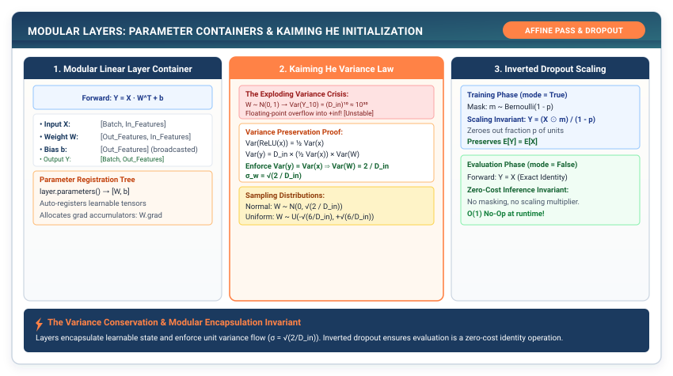

# Layers & Parameters: Packaging the Affine Transform {#sec-layers}

In Chapters 1 and 2, we created multi-dimensional tensors and non-linear activation functions. But in practice, neural networks are not loose collections of independent matrix multiplications. They are deep compositional hierarchies consisting of dozens or hundreds of structured modules.

In this chapter, we construct the **Layer & Parameter Container Architecture** of TinyTorch. We address the physical problem of parameter memory encapsulation and solve the critical numerical problem of **weight initialization variance control**.

{#fig-layers-architecture}

---

## 3.1 The Crisis: The Variance Explosion Catastrophe

Suppose we build a deep network by chaining six linear layers of hidden dimension $D = 512$:

$$h_{l+1} = h_l \cdot W_l$$

What happens if we initialize the elements of each weight matrix $W$ with standard Gaussian random numbers $W_{i, j} \sim \mathcal{N}(0, 1)$?

Let us compute the variance of a single output neuron $y = \sum_{i=1}^{D_{\text{in}}} x_i w_i$. Assuming the inputs $x$ and weights $w$ are independent random variables with zero mean:

$$\text{Var}(y) = \sum_{i=1}^{D_{\text{in}}} \text{Var}(x_i w_i) = \sum_{i=1}^{D_{\text{in}}} \text{Var}(x_i) \text{Var}(w_i) = D_{\text{in}} \times \text{Var}(x) \times \text{Var}(w)$$

If $\text{Var}(w) = 1$, then at every single layer, **the variance of the activations is multiplied by $D_{\text{in}} = 512$**:

- After Layer 1: $\text{Var}(h_1) = 512$
- After Layer 2: $\text{Var}(h_2) = 512^2 = 262,144$
- After Layer 3: $\text{Var}(h_3) = 512^3 = 1.34 \times 10^8$
- After Layer 6: $\text{Var}(h_6) = 512^6 = 1.80 \times 10^{16}$

In just six layers, the activation magnitudes explode beyond the representation limits of 32-bit floating-point numbers, crashing the runtime with `inf` and `NaN` values.

Conversely, if weights are initialized too small ($\text{Var}(w) = 0.0001$), activations shrink exponentially toward zero ($0.0001^6 \approx 10^{-24}$), causing gradients to vanish entirely.

```
The Initialization Tightrope:
Weights too large (Var=1.0)   ──> 512^6 = 1.8e16 (Exploding to NaN / Inf) ❌
Weights too small (Var=1e-4)  ──> 1e-24 (Vanishing to Zero) ❌
Kaiming Initialized (Var=2/D) ──> Var(y) = Var(x) = 1.0 (Stable Gradient Highway) ✓
```

To maintain stable signals across deep networks, we must enforce the **Law of Variance Conservation**:

$$\text{Var}(y) = \text{Var}(x) \implies D_{\text{in}} \times \text{Var}(w) = 1 \implies \text{Var}(w) = \frac{1}{D_{\text{in}}}$$

When using ReLU activations (which zero out the negative half-plane, halving the signal variance), the required weight variance doubles: $\text{Var}(w) = \frac{2}{D_{\text{in}}}$ (**He / Kaiming Initialization**).

---

## 3.2 The Mental Model: The Layer Contract

To manage neural network components cleanly, our framework requires an abstraction that encapsulates two responsibilities:

1. **State Management**: Holding learnable parameter tensors (`weights`, `biases`) and providing a clean inspection interface (`parameters()`) for optimizers.
2. **Computational Transformation**: Implementing the callable `forward()` transformation while tracking evaluation state (`training` vs. `eval` mode).

```
┌─────────────────────────────────────────────────────────────┐
│                       Layer (Base Class)                    │
│   • self._parameters = [ W, b ]                             │
│   • self.training = True / False                            │
│   • def __call__(x): return self.forward(x)                 │
└──────────────────────────────┬──────────────────────────────┘
                               │
               ┌───────────────┴───────────────┐
               ▼                               ▼
     ┌───────────────────┐           ┌───────────────────┐
     │    LinearLayer    │           │    Sequential     │
     │  Y = X · W^T + b  │           │ Pipeline of layers│
     └───────────────────┘           └───────────────────┘
```

---

## 3.3 The Pure TinyTorch Layer Construction

Let us implement the foundational `Layer`, `Linear`, `Dropout`, and `Sequential` container classes in pure Python.

```python
import numpy as np
from tinytorch.core.tensor import Tensor

class Layer:
    """
    Abstract Base Class for all neural network modules in TinyTorch.
    Encapsulates learnable parameters and execution state.
    """
    def __init__(self):
        self.training = True

    def forward(self, *args, **kwargs):
        raise NotImplementedError

    def __call__(self, *args, **kwargs):
        return self.forward(*args, **kwargs)

    def parameters(self) -> list[Tensor]:
        """Returns all learnable Tensor parameters within this layer."""
        params = []
        for attr, value in self.__dict__.items():
            if isinstance(value, Tensor) and value.requires_grad:
                params.append(value)
            elif isinstance(value, Layer):
                params.extend(value.parameters())
            elif isinstance(value, list):
                for item in value:
                    if isinstance(item, Layer):
                        params.extend(item.parameters())
        return params

    def train(self):
        """Sets the layer and all sub-layers to training mode."""
        self.training = True
        for attr, value in self.__dict__.items():
            if isinstance(value, Layer):
                value.train()
            elif isinstance(value, list):
                for item in value:
                    if isinstance(item, Layer):
                        item.train()

    def eval(self):
        """Sets the layer and all sub-layers to evaluation mode."""
        self.training = False
        for attr, value in self.__dict__.items():
            if isinstance(value, Layer):
                value.eval()
            elif isinstance(value, list):
                for item in value:
                    if isinstance(item, Layer):
                        item.eval()


class Linear(Layer):
    """
    Fully-connected Affine Layer: Y = X · W^T + b
    Initializes weights using Kaiming Uniform bounds to preserve variance.
    """
    def __init__(self, in_features: int, out_features: int, bias: bool = True):
        super().__init__()
        self.in_features = in_features
        self.out_features = out_features

        # Kaiming / He uniform initialization: limit = sqrt(6 / in_features)
        limit = np.sqrt(6.0 / in_features)
        weight_data = np.random.uniform(-limit, limit, size=(out_features, in_features))
        self.weight = Tensor(weight_data, requires_grad=True)

        if bias:
            # Biases initialized to zero
            self.bias = Tensor(np.zeros(out_features), requires_grad=True)
        else:
            self.bias = None

    def forward(self, x: Tensor) -> Tensor:
        # Compute Y = X · W^T
        out = x.matmul(self.weight.T)
        if self.bias is not None:
            out = out + self.bias
        return out


class Dropout(Layer):
    """
    Inverted Dropout Layer for Regularization.
    Scales surviving activations by 1 / (1 - p) during training so that
    evaluation mode requires zero arithmetic operations.
    """
    def __init__(self, p: float = 0.5):
        super().__init__()
        if not (0.0 <= p < 1.0):
            raise ValueError(f"Dropout probability p must be in [0, 1), got {p}")
        self.p = p

    def forward(self, x: Tensor) -> Tensor:
        if not self.training or self.p == 0.0:
            return x

        # Generate binary Bernoulli mask
        mask = (np.random.rand(*x.shape) >= self.p).astype(np.float32)
        # Inverted scaling factor: 1 / (1 - p)
        scaled_mask = mask / (1.0 - self.p)
        return Tensor(x.data * scaled_mask)


class Sequential(Layer):
    """
    Sequential Container: cascades inputs through an ordered list of layers.
    """
    def __init__(self, *layers: Layer):
        super().__init__()
        self.layers = list(layers)

    def forward(self, x: Tensor) -> Tensor:
        for layer in self.layers:
            x = layer(x)
        return x
```

---

## 3.4 The Production Bridge: PyTorch `nn.Module` and Inverted Dropout

How does this design map to production engines like PyTorch?

### 1. Parameter Registration
In PyTorch's C++ core (`torch::nn::Module`), parameters are stored in an internal dictionary (`_parameters`). When an optimizer like AdamW is instantiated, it calls `model.parameters()` to traverse the object tree and extract raw memory pointers for gradient updates. Our Python `Layer.parameters()` implementation follows this exact traversal logic.

### 2. The Inverted Dropout Trick
Why does our `Dropout` layer divide surviving elements by $(1 - p)$ during the training forward pass?

In the original 2012 Dropout paper (Srivastava et al.), dropout simply zeroed out activations during training ($y = x \cdot \text{mask}$), which reduced the expected activation sum by a factor of $(1 - p)$. Consequently, during inference (evaluation mode), every single layer had to multiply its output by $(1 - p)$ to restore the correct expected magnitude.

Modern frameworks use **Inverted Dropout**: by dividing by $(1 - p)$ during training, the expected activation sum is preserved dynamically:

$$\mathbb{E}[y_{\text{train}}] = \frac{1}{1-p} \times (1-p) x = x = \mathbb{E}[y_{\text{eval}}]$$

During inference, `eval()` completely bypasses dropout in $0$ clock cycles without scaling arithmetic.

---

## 3.5 Building the System: How It All Connects

Let us examine the architecture we have constructed across the first three chapters:

```
┌─────────────────────────────────────────────────────────────┐
│                      TINYTORCH STACK                        │
├─────────────────────────────────────────────────────────────┤
│ 3. Composition: Sequential(Linear(784, 128), GELU(), ...)  │
│ 2. Activations: GELU, ReLU, Sigmoid (Non-linear gates)      │
│ 1. Core Memory: Tensor (1D DRAM Buffer + Strides)           │
└─────────────────────────────────────────────────────────────┘
```

1. **Chapter 1**: Created the flat memory and strided indexing foundation.
2. **Chapter 2**: Provided non-linear activation functions to prevent associative collapse.
3. **Chapter 3**: Packaged parameters, variance-controlled initialization, and modular layer composition.

### The Forward Cliffhanger: The Loss Function

We can now construct multi-layer neural networks that transform input tensors into continuous output vectors (known as **logits**):

$$\hat{y} = \text{model}(x)$$

Suppose we are building a 10-class image classifier. Our model outputs ten arbitrary real numbers, such as:

$$\hat{y} = [2.4, -1.8, 12.5, 0.1, -5.2, 8.9, -0.4, 1.1, -3.2, 0.7]$$

How do we convert these continuous logits into a valid probability distribution? How do we mathematically measure the error between our prediction and the true target label without triggering floating-point overflow?

In Chapter 4, we explore **Loss Functions & The Log-Sum-Exp Stabilization Invariant**.
