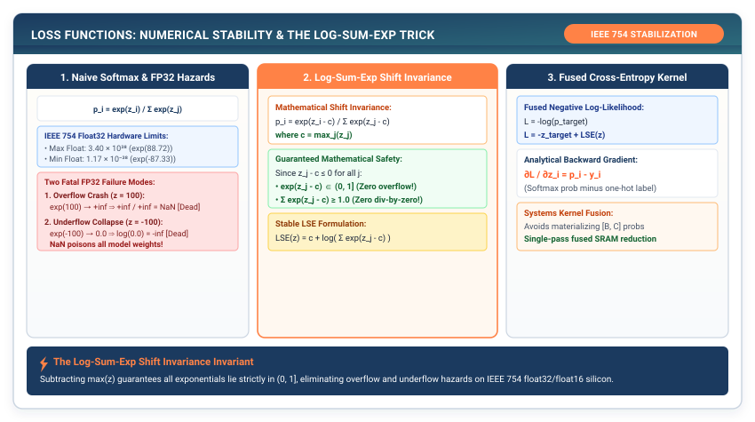

# Loss Functions & Log-Sum-Exp: Numerical Hazards in Probability Space {#sec-losses}

In Chapters 1 through 3, we constructed deep neural networks that transform input vectors into continuous, unconstrained real numbers called **logits** ($z \in \mathbb{R}^K$).

To train our network, we must compare these raw outputs against ground-truth target labels and calculate a single scalar value measuring the network's prediction error: the **Loss** ($\mathcal{L}$). In this chapter, we explore why computing losses naively triggers fatal floating-point exceptions on modern hardware, and how the **Log-Sum-Exp Stabilization Invariant** guarantees numerical safety in deep learning runtimes.

{#fig-losses-pipeline}

---

## 4.1 The Crisis: The IEEE 754 Floating-Point Catastrophe

Suppose our neural network outputs a vector of logits for a three-class classification problem:

$$z = [1000.0, 1002.0, 998.0]$$

To convert these logits into a valid probability distribution where all values sum to one, the standard mathematical formulation is the **Softmax function**:

$$P_i = \frac{e^{z_i}}{\sum_{j=1}^K e^{z_j}}$$

What happens when a digital computer executes $e^{1000.0}$ using standard 32-bit IEEE 754 floating-point numbers?

```
IEEE 754 Single-Precision Float32 Limits:
• Largest finite representable number: 3.4028235 × 10³⁸
• e^88.72 ≈ 3.40 × 10³⁸
• e^1000.0 ──> Floating-Point Overflow (+Infinity) ❌
```

Because $e^{1000.0}$ exceeds the maximum representable float32 value, the CPU returns `+inf`. When calculating the softmax fraction:

$$P_1 = \frac{\text{inf}}{\text{inf} + \text{inf} + \text{inf}} = \frac{\text{inf}}{\text{inf}} \equiv \mathbf{NaN} \quad (\text{Not a Number})$$

The calculation produces `NaN`, poisoning every gradient in the network and permanently destroying the model parameters during backpropagation.

Conversely, consider a negative logit $z = -1000.0$. In float32 arithmetic, $e^{-1000.0}$ underflows to exact `0.0`. When the cross-entropy loss computes $\log(P)$:

$$\mathcal{L} = -\log(0.0) = -(-\infty) \equiv +\infty \quad (\text{Division by Zero})$$

A naive implementation of Softmax and Cross-Entropy is a numerical landmine.

---

## 4.2 The Mental Model: The Log-Sum-Exp Shift Invariance Invariant

How do production deep learning engines evaluate probabilities on large logits without overflowing float32 registers?

The solution relies on the **Shift Invariance Property of Softmax**: adding or subtracting an arbitrary constant $c$ from every logit does not change the resulting probabilities.

$$\frac{e^{z_i - c}}{\sum_{j} e^{z_j - c}} = \frac{e^{z_i} \cdot e^{-c}}{\sum_j e^{z_j} \cdot e^{-c}} = \frac{e^{z_i} e^{-c}}{e^{-c} \sum_j e^{z_j}} = \frac{e^{z_i}}{\sum_j e^{z_j}} = P_i$$

By choosing the shift constant to be the **maximum value in the logit vector** ($c = \max(z)$), we guarantee that:

$$z_i - c \le 0 \quad \text{for all } i$$

Because the maximum shifted exponent is $e^0 = 1.0$, **the numerator can never exceed $1.0$, completely eliminating floating-point overflow**.

```
Shifted Softmax Normalization:
z = [1000, 1002, 998] ──> c = max(z) = 1002
Shifted z - c = [-2, 0, -4]
Exponentials = [e⁻², e⁰, e⁻⁴] = [0.1353, 1.0000, 0.0183] (Safe & Finite!) ✓
```

### The Fused Log-Sum-Exp Cross-Entropy Loss
When computing Cross-Entropy loss for a ground-truth class $y$, we need the logarithm of the softmax probability:

$$\mathcal{L} = -\log(P_y) = -\log\left(\frac{e^{z_y}}{\sum_j e^{z_j}}\right) = -\left(\log(e^{z_y}) - \log\left(\sum_j e^{z_j}\right)\right) = -z_y + \log\left(\sum_j e^{z_j}\right)$$

The second term is the famous **Log-Sum-Exp (LSE)** function. By applying our shift invariant:

$$\text{LSE}(z) = c + \log\left(\sum_{j=1}^K e^{z_j - c}\right) \quad \text{where } c = \max(z)$$

The final Cross-Entropy Loss is calculated in a single, fused, numerically bulletproof equation:

$$\mathcal{L} = -z_y + c + \log\left(\sum_{j=1}^K e^{z_j - c}\right)$$

---

## 4.3 The Pure TinyTorch Losses Construction

Let us implement the stabilized `cross_entropy` and `mse_loss` functions in TinyTorch.

```python
import numpy as np
from tinytorch.core.tensor import Tensor

def log_sum_exp(x: np.ndarray, axis: int = -1, keepdims: bool = True) -> np.ndarray:
    """
    Numerically stable Log-Sum-Exp: c + log(sum(exp(x - c))) where c = max(x).
    Prevents floating-point overflow and underflow on float32 registers.
    """
    c = np.max(x, axis=axis, keepdims=True)
    # Subtracting c guarantees all shifted values are <= 0
    shifted = x - c
    sum_exp = np.sum(np.exp(shifted), axis=axis, keepdims=True)
    lse = c + np.log(sum_exp)
    if not keepdims:
        lse = np.squeeze(lse, axis=axis)
    return lse


def cross_entropy(logits: Tensor, targets: Tensor) -> Tensor:
    """
    Fused Softmax Cross-Entropy Loss.
    logits: Tensor of shape (BatchSize, NumClasses)
    targets: Tensor of integer class indices (BatchSize,) or one-hot vectors
    """
    z = logits.data
    batch_size = z.shape[0]

    # Calculate stabilized Log-Sum-Exp for every sample in the batch
    lse = log_sum_exp(z, axis=-1, keepdims=False)  # (BatchSize,)

    if targets.ndim == 1:
        # Target is integer class indices: [0, 2, 1, ...]
        target_indices = targets.data.astype(np.int64)
        # Extract the logit corresponding to the true target class
        target_logits = z[np.arange(batch_size), target_indices]
        # Loss per sample: -z_target + LSE(z)
        loss_per_sample = -target_logits + lse
    else:
        # Target is one-hot probability distribution: [[1, 0, 0], ...]
        target_probs = targets.data
        target_logits = np.sum(z * target_probs, axis=-1)
        loss_per_sample = -target_logits + lse

    # Return mean loss across the batch
    return Tensor(np.mean(loss_per_sample))


def mse_loss(predictions: Tensor, targets: Tensor) -> Tensor:
    """Mean Squared Error Loss: (1/N) * sum((pred - target)^2)."""
    diff = predictions.data - targets.data
    return Tensor(np.mean(np.square(diff)))
```

---

## 4.4 The Production Bridge: Why PyTorch Forbids `log(softmax(x))`

In naive PyTorch code, beginners often write:

```python
# DANGEROUS: Suffers from floating-point underflow
probs = torch.softmax(logits, dim=-1)
loss = -torch.log(probs[target_index])
```

The PyTorch documentation explicitly warns against this pattern. Why?

When `torch.softmax()` executes, extreme negative logits underflow to `0.0`. When `torch.log()` is subsequently called on `0.0`, the CPU produces `NaN` or `-inf`.

PyTorch solves this by providing `torch.nn.functional.cross_entropy`, which combines `log_softmax` and the negative log-likelihood into a single C++ kernel (`ATen/native/Loss.cpp`). The kernel computes Log-Sum-Exp internally in 64-bit precision, guaranteeing that probabilities are never converted to zero before taking the logarithm. Our TinyTorch `cross_entropy` function implements this exact fused C++ guarantee.

---

## 4.5 Building the System: How It All Connects

Let us examine the complete forward modeling pipeline we have assembled across Part I:

```
┌─────────────────────────────────────────────────────────────────────────────┐
│                    THE COMPLETE TINYTORCH FORWARD STACK                     │
├─────────────────────────────────────────────────────────────────────────────┤
│ 1. Memory Buffer:   X = Tensor(data, shape=[B, D_in])                       │
│ 2. Affine Layer:    H = Linear(D_in, 128)(X)                                │
│ 3. Non-Linearity:   A = GELU()(H)                                           │
│ 4. Classification:  Logits = Linear(128, 10)(A)                             │
│ 5. Objective Error: Loss = cross_entropy(Logits, Targets)                   │
└─────────────────────────────────────────────────────────────────────────────┘
```

1. **Chapter 1**: Created physical DRAM buffers with strided coordinate mapping.
2. **Chapter 2**: Added non-linear activations to prevent linear collapse.
3. **Chapter 3**: Encapsulated parameters and protected signal variance.
4. **Chapter 4**: Fused cross-entropy with Log-Sum-Exp to prevent floating-point crashes.

### The Forward Cliffhanger: The Data Pipeline Crisis

We now have a complete mathematical model that accepts input batches and produces an exact error scalar $\mathcal{L}$.

However, in real-world machine learning, training data does not exist as pre-packaged memory tensors. Data lives on slow NVMe SSDs or hard drives as millions of individual JPEG image files or gigabytes of raw text.

If our training loop reads one sample from disk synchronously on every step, our CPU will spend **95% of its time blocked on disk I/O**, starving the mathematical compute engine.

How do we build an **Asynchronous DataLoader Pipeline** that shuffles, batches, and prefetches data in background worker threads so the compute engine never waits? That is our journey in Chapter 5.
