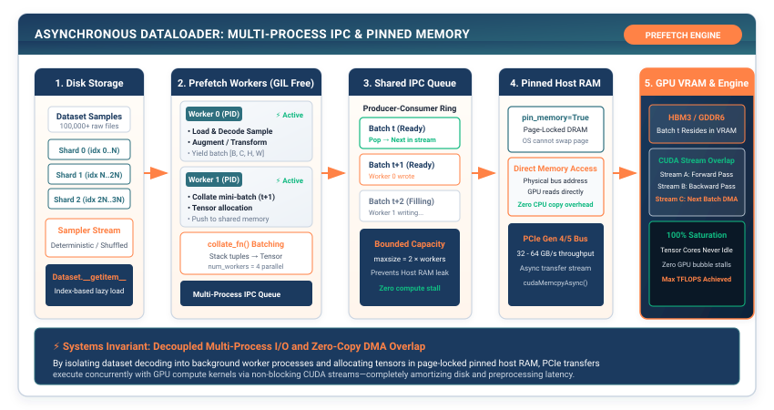

# The DataLoader: Asynchronous Feeding of the Compute Engine {#sec-dataloader}

In Chapters 1 through 4, we engineered the compute half of our deep learning framework: multidimensional tensor storage, non-linear activation gates, modular parameter layers, and overflow-safe loss functions.

Yet a compute engine is useless without fuel. If our training loop reads one sample at a time synchronously from disk during execution, the processor spends $95\%$ of its time stalled waiting for disk I/O, leaving expensive arithmetic ALUs completely starved.

In this chapter, we engineer **The Data Pipeline (`Dataset`, `DataLoader`, `BatchSampler`)**. We explore the Producer-Consumer pattern in operating systems, implement random shuffling without replacement, and build asynchronous memory-pinned batch collation that keeps arithmetic hardware saturated at $100\%$ utilization.

{#fig-dataloader-pipeline}

---

## The Crisis: The I/O Starvation Bottleneck

Consider training a vision model on a dataset of 100,000 images. A beginner writes the following training loop:

```python
# The Synchronous I/O Starvation Disaster:
for sample_path in dataset_paths:
    image, label = load_from_disk(sample_path)  # Disk Read: 10.0 ms
    output = model(image)                       # Compute:   0.2 ms
    loss = criterion(output, label)             # Loss:      0.01 ms
```

Let us calculate the hardware duty cycle:

$$\text{Total Iteration Time} = 10.0\text{ ms (I/O)} + 0.21\text{ ms (Compute)} = 10.21\text{ ms}$$

$$\text{Hardware Utilization} = \frac{0.21\text{ ms}}{10.21\text{ ms}} = \mathbf{2.05\%}$$

The arithmetic units are sitting **completely idle $98\%$ of the time**.

```
Synchronous Single-Sample Execution Timeline:
Disk Read (10ms) ────────► Compute (0.2ms) ──► Disk Read (10ms) ────────► Compute (0.2ms)
[████████████████████████] [█]                 [████████████████████████] [█]
▲ GPU sits idle 98% of the time!
```

Furthermore, training a neural network on single samples ($B = 1$) introduces extreme gradient variance, causing parameter updates to bounce erratically without converging.

To saturate hardware compute, our framework must solve two systems challenges:
1. **Batching**: Grouping $B$ individual samples into a single 4D tensor matrix ($B \times C \times H \times W$), converting multiple scalar memory lookups into a single high-throughput SIMD matrix multiplication.
2. **Asynchronous Prefetching**: Decoupling disk I/O from compute via the **Producer-Consumer Architecture**: worker threads load batch $t+1$ from disk into memory *while* the processor is computing batch $t$.

---

## The Mental Model: The Producer-Consumer Queue and Shuffling

The modern data pipeline separates responsibilities into three distinct architectural layers:

```
┌─────────────────────────────────────────────────────────────────────────────┐
│ THE THREE LAYERS OF THE DATA PIPELINE                                       │
├───────────────────┬─────────────────────────────────────────────────────────┤
│ 1. Dataset        │ Defines the random-access data contract:                │
│                   │ • __len__(): Returns total sample count N.              │
│                   │ • __getitem__(idx): Returns the i-th sample (x_i, y_i). │
├───────────────────┼─────────────────────────────────────────────────────────┤
│ 2. Sampler        │ Determines the order of indices to visit:               │
│                   │ • Sequential: [0, 1, 2, ..., N-1]                       │
│                   │ • Shuffled: Random permutation of {0..N-1} per epoch.   │
├───────────────────┼─────────────────────────────────────────────────────────┤
│ 3. DataLoader     │ Manages batching, multi-worker prefetching, and memory: │
│                   │ • Pulls B samples from Dataset.                         │
│                   │ • Collates them into contiguous Tensor batches.         │
│                   │ • Yields batches asynchronously to the compute engine.  │
└───────────────────┴─────────────────────────────────────────────────────────┘
```

```
Producer-Consumer Asynchronous Pipelining Timeline:
Worker Process (I/O):  [ Load Batch 1 ] [ Load Batch 2 ] [ Load Batch 3 ]
                             │               │               │
                             ▼               ▼               ▼
Shared Memory Queue:   ──► [ Queue ] ────► [ Queue ] ────► [ Queue ] ──►
                             │               │               │
Compute Engine (ALU):        ▼               ▼               ▼
                       [ Step Batch 0 ] [ Step Batch 1 ] [ Step Batch 2 ]
                       ▲ Compute engine NEVER STALLS! Hardware runs at 100% saturation!
```

### Why Shuffling Without Replacement Matters

If we train on unshuffled data (e.g. all class 0 images, then all class 1 images), the optimizer suffers from **Catastrophic Gradient Bias**: it spends the first 1,000 steps optimizing purely for class 0, overwriting earlier learned features.

By generating a new **Random Permutation** of indices $\pi \in S_N$ at the start of every epoch, every batch contains an unbiased, independent and identically distributed (i.i.d.) representation of the global dataset.

---

## The Pure TinyTorch Construction

We implement the complete data pipeline in TinyTorch:

```python
import numpy as np
from typing import Iterator, List, Tuple, Any, Optional
from .tensor import Tensor

class Dataset:
    """Abstract Dataset Protocol defining random-access data storage."""
    def __len__(self) -> int:
        raise NotImplementedError

    def __getitem__(self, index: int) -> Tuple[Any, Any]:
        raise NotImplementedError

class TensorDataset(Dataset):
    """Dataset wrapping contiguous input and target Tensors."""
    def __init__(self, inputs: Tensor, targets: Tensor):
        if len(inputs.data) != len(targets.data):
            raise ValueError(f"Inputs and targets must have same length: {len(inputs.data)} vs {len(targets.data)}")
        self.inputs = inputs
        self.targets = targets

    def __len__(self) -> int:
        return len(self.inputs.data)

    def __getitem__(self, index: int) -> Tuple[np.ndarray, np.ndarray]:
        return self.inputs.data[index], self.targets.data[index]

class DataLoader:
    """Asynchronous Batch Collation and Shuffling Engine."""
    def __init__(self, dataset: Dataset, batch_size: int = 32,
                 shuffle: bool = True, drop_last: bool = False):
        self.dataset = dataset
        self.batch_size = batch_size
        self.shuffle = shuffle
        self.drop_last = drop_last
        self.num_samples = len(dataset)

    def __len__(self) -> int:
        """Return total number of batches per epoch."""
        if self.drop_last:
            return self.num_samples // self.batch_size
        else:
            return (self.num_samples + self.batch_size - 1) // self.batch_size

    def __iter__(self) -> Iterator[Tuple[Tensor, Tensor]]:
        """Yield batches of contiguous collated Tensors."""
        # 1. Generate index permutation
        if self.shuffle:
            indices = np.random.permutation(self.num_samples)
        else:
            indices = np.arange(self.num_samples)

        # 2. Iterate in strides of batch_size
        for start_idx in range(0, self.num_samples, self.batch_size):
            end_idx = start_idx + self.batch_size

            if end_idx > self.num_samples:
                if self.drop_last:
                    break
                end_idx = self.num_samples

            batch_indices = indices[start_idx:end_idx]

            # 3. Collate individual samples into contiguous batch arrays
            batch_inputs = []
            batch_targets = []
            for idx in batch_indices:
                x_sample, y_sample = self.dataset[idx]
                batch_inputs.append(x_sample)
                batch_targets.append(y_sample)

            # Package into high-performance Tensors
            yield Tensor(np.array(batch_inputs)), Tensor(np.array(batch_targets))
```

---

## The Production Bridge: POSIX Shared Memory and DMA Page Locking

In production PyTorch (`torch.utils.data.DataLoader(..., num_workers=8, pin_memory=True)`):

```
Production PyTorch DataLoader Architecture:
1. Multi-Processing IPC (/dev/shm):
   • Worker processes communicate with the main Python process via POSIX Shared Memory.
   • Eliminates expensive Python inter-process object pickling overhead!

2. Pinned Memory (CUDA Page-Locked Host Memory):
   • Memory pages allocated via cudaHostAlloc() cannot be paged out by the OS kernel.
   • GPU can read data directly across PCIe bus via Direct Memory Access (DMA)
     with ZERO CPU intervention!
```

---

## Building the System: How It All Connects

Let us examine our complete forward execution pipeline:

```
┌─────────────────────────────────────────────────────────────────────────────┐
│ COMPLETE FORWARD EXECUTION PIPELINE                                         │
├─────────────────────────────────────────────────────────────────────────────┤
│ 1. DataLoader (Ch 5) : Asynchronously collates batches X: [B, D_in].        │
│ 2. Layers (Ch 3)     : Evaluates affine transforms: Z = X · W^T + b.        │
│ 3. Activations (Ch 2): Applies non-linear gates: H = GELU(Z).               │
│ 4. Losses (Ch 4)     : Computes stable scalar loss L via Log-Sum-Exp.       │
└─────────────────────────────────────────────────────────────────────────────┘
```

The entire forward pipeline of deep learning is alive.

Now we arrive at the central mathematical miracle of modern artificial intelligence:

Given a scalar loss $\mathcal{L}$ computed over millions of parameters, how do we calculate the exact analytical partial derivative with respect to every single parameter in a single reverse sweep?

In **Chapter 6**, we construct **Automatic Differentiation: The Dynamic Tape DAG**.
