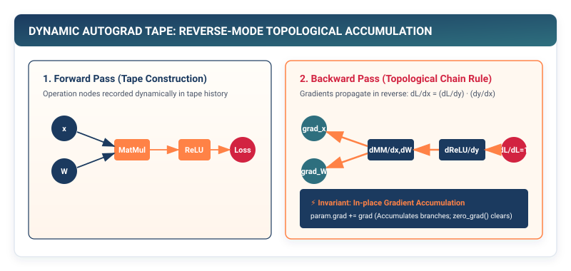

# Automatic Differentiation: The Dynamic Tape DAG {#sec-autograd}

In Chapters 1 through 5, we constructed the complete forward execution pipeline of TinyTorch. We can stream batches of data asynchronously from disk, pass them through deep layers of non-linear transformations, and compute an exact scalar loss $\mathcal{L}$.

Now we confront the central mathematical engine of all modern artificial intelligence: **Automatic Differentiation (Autograd)**. In this chapter, we explore why numerical and symbolic differentiation fail for deep networks, and construct a **Dynamic Reverse-Mode Tape Directed Acyclic Graph (DAG)** that evaluates exact analytical gradients for millions of parameters in a single reverse sweep.

{#fig-autograd-dag}

---

## The Crisis: The Derivative Calculation Bottleneck

To minimize our loss function $\mathcal{L}(W)$ using gradient descent, we must compute the partial derivative of the loss with respect to every single parameter weight $w_i$:

$$\nabla_W \mathcal{L} = \left[ \frac{\partial \mathcal{L}}{\partial w_1}, \frac{\partial \mathcal{L}}{\partial w_2}, \dots, \frac{\partial \mathcal{L}}{\partial w_N} \right]$$

In computer science history, engineers attempted three distinct approaches to differentiation before modern autograd was discovered:

```
┌─────────────────────────────────────────────────────────────────────────────┐
│ 1. NUMERICAL FINITE DIFFERENCES: The O(N) Compute Wall                      │
│    • Formula:  ∂L/∂w_i ≈ (L(w_i + ε) - L(w_i)) / ε                          │
│    • Flaw:     Requires N+1 forward passes for N parameters.                │
│    • Reality:  A 100M parameter model would take 3 years for ONE step! ❌   │
├─────────────────────────────────────────────────────────────────────────────┤
│ 2. SYMBOLIC ALGEBRAIC DIFFERENTIATION: The Expression Explosion             │
│    • Formula:  Applies product/chain rules algebraically (e.g. Mathematica).│
│    • Flaw:     Expression length grows exponentially with network depth.    │
│    • Reality:  Differentiating a 50-layer network yields gigabytes of math! ❌│
├─────────────────────────────────────────────────────────────────────────────┤
│ 3. MANUAL ANALYTICAL DERIVATION: The Brittleness Wall                       │
│    • Formula:  Hand-coding backward formulas in C++ for every network.      │
│    • Flaw:     Breaks instantly if a researcher adds an `if` branch. ❌    │
└─────────────────────────────────────────────────────────────────────────────┘
```

Modern deep learning demands an engine that can compute exact analytical derivatives for **arbitrary, dynamically branching Python code** with the computational cost of just **two forward passes** ($O(1)$ scaling with respect to parameter count).

That engine is **Reverse-Mode Automatic Differentiation on a Dynamic Tape**.

---

## The Mental Model: The Reverse-Mode Tape DAG

Reverse-mode automatic differentiation operates across two distinct phases:

### Phase 1: Forward Tape Recording
During the forward pass, as each mathematical operation (`+`, `*`, `matmul`, `gelu`) executes, the runtime dynamically records an **Operation Node (`Op`)** on an in-memory execution tape.

Each Node stores three pieces of information:
1. **Pointers to Input Tensors**: The parent nodes in the computational graph.
2. **Saved Tensors for Backward**: Any intermediate activations needed to compute local derivatives (e.g., input $x$ for $\text{ReLU}$, or inputs $A$ and $B$ for $\text{MatMul}$).
3. **The Vector-Jacobian Product (VJP) Function**: A function that multiplies an incoming upstream gradient by the local Jacobian matrix.

```
Forward Graph Construction (DAG):
X [B, D] ────┐
             ├──>[ MatMulOp ]──> Z [B, H] ──>[ GeluOp ]──> A [B, H] ──>[ LossOp ]──> L (Scalar)
W [D, H] ────┘
```

### Phase 2: Reverse-Mode Topological Sweep
Once the forward pass computes the scalar loss $\mathcal{L}$, we initiate backpropagation by seeding the loss with its own derivative:

$$\frac{\partial \mathcal{L}}{\partial \mathcal{L}} = 1.0$$

The engine performs a **Reverse Topological Sort** of the computational graph, visiting each operation in exact reverse order of execution. For each node, it evaluates the local chain rule:

$$\text{Gradient to Parent } i = \text{Upstream Gradient} \times \text{Local Jacobian}$$

```
Reverse Gradient Propagation:
dL/dX ◄────┐
           ├──◄[ dMatMul ]◄──── dL/dZ ◄────[ dGELU ]◄──── dL/dA ◄────[ dLoss ]◄──── dL/dL = 1.0
dL/dW ◄────┘
```

---

## The Fundamental Vector-Jacobian Products (VJPs)

Let us derive the exact Vector-Jacobian Products for the elementary operators in TinyTorch:

### Matrix Multiplication: $Y = A \cdot B$

Given incoming upstream gradient $\frac{\partial \mathcal{L}}{\partial Y} = \mathbf{G} \in \mathbb{R}^{M \times N}$:

$$\frac{\partial \mathcal{L}}{\partial A} = \mathbf{G} \cdot B^T, \qquad \frac{\partial \mathcal{L}}{\partial B} = A^T \cdot \mathbf{G}$$

Notice the beautiful symmetry: the backward pass of a matrix multiplication is simply **two transposed matrix multiplications**!

### Elementwise Addition: $Y = A + B$

$$\frac{\partial \mathcal{L}}{\partial A} = \mathbf{G}, \qquad \frac{\partial \mathcal{L}}{\partial B} = \mathbf{G}$$

The upstream gradient flows backward unchanged to both inputs.

### In-Place Gradient Accumulation: `param.grad += grad`

In neural architectures with **branching dataflow** (such as residual skip connections where $y = x + f(x)$), input tensor $x$ is consumed by multiple child nodes.

By the multivariate chain rule:

$$\frac{\partial \mathcal{L}}{\partial x} = \sum_{\text{children } c} \frac{\partial \mathcal{L}}{\partial y_c} \frac{\partial y_c}{\partial x}$$

Therefore, autograd engines must **accumulate gradients in-place** (`+=`), rather than overwriting them:

```python
if param.grad is None:
    param.grad = local_grad
else:
    param.grad += local_grad
```

---

## The Pure TinyTorch Construction

We implement the complete dynamic autograd engine in TinyTorch:

```python
import numpy as np
from typing import List, Set
from .tensor import Tensor

def topological_sort(root: Tensor) -> List[Tensor]:
    """Perform post-order DFS to obtain topologically sorted execution order."""
    order: List[Tensor] = []
    visited: Set[int] = set()

    def dfs(node: Tensor):
        node_id = id(node)
        if node_id in visited:
            return
        visited.add(node_id)
        for parent in getattr(node, '_parents', []):
            if isinstance(parent, Tensor):
                dfs(parent)
        order.append(node)

    dfs(root)
    return order

def backward(loss_tensor: Tensor, grad: Optional[np.ndarray] = None):
    """Execute reverse-mode automatic differentiation across the computational tape."""
    if grad is None:
        loss_tensor.grad = np.ones_like(loss_tensor.data)
    else:
        loss_tensor.grad = grad

    # 1. Obtain reverse topological ordering of DAG
    nodes = reversed(topological_sort(loss_tensor))

    # 2. Propagate VJPs backward
    for node in nodes:
        if node.grad is None or not hasattr(node, '_op') or node._op is None:
            continue

        upstream_grad = node.grad if isinstance(node.grad, np.ndarray) else node.grad.data
        op = node._op
        parents = node._parents

        if op == "Add":
            for p in parents:
                if isinstance(p, Tensor) and p.requires_grad:
                    # Handle broadcasting reductions if shapes differ
                    g = upstream_grad
                    while g.ndim > p.data.ndim:
                        g = g.sum(axis=0)
                    for dim in range(p.data.ndim):
                        if p.data.shape[dim] == 1 and g.shape[dim] > 1:
                            g = g.sum(axis=dim, keepdims=True)
                    p.grad = g if p.grad is None else p.grad + g

        elif op == "MatMul":
            A, B = parents[0], parents[1]
            if A.requires_grad:
                g_A = np.matmul(upstream_grad, B.data.T)
                A.grad = g_A if A.grad is None else A.grad + g_A
            if B.requires_grad:
                g_B = np.matmul(A.data.T, upstream_grad)
                B.grad = g_B if B.grad is None else B.grad + g_B

        elif op == "ReLU":
            p = parents[0]
            if p.requires_grad:
                g = upstream_grad * (p.data > 0.0).astype(np.float32)
                p.grad = g if p.grad is None else p.grad + g

# Attach backward method directly to Tensor class
Tensor.backward = backward
```

---

## The Production Bridge: PyTorch C++ `torch::autograd::Engine`

In production PyTorch, autograd is executed by a dedicated C++ multithreaded worker queue called **`torch::autograd::Engine`**:

```cpp
// PyTorch Autograd Engine (torch/csrc/autograd/engine.cpp)
struct Node {
  virtual variable_list apply(variable_list&& grads) = 0;
  std::vector<Edge> next_edges_;
};
```

When you call `loss.backward()`, PyTorch pushes `Node` execution tasks into a multi-threaded task queue. As soon as all child dependencies of an operator have completed their VJPs, worker threads execute their backward kernels concurrently across multiple CPU and GPU streams.

---

## Building the System: How It All Connects

With Chapter 6, TinyTorch has unlocked the engine of gradient calculus:

```
┌─────────────────────────────────────────────────────────────────────────────┐
│ THE COMPLETE AUTOGRAD LEARNING LOOP                                         │
├─────────────────────────────────────────────────────────────────────────────┤
│ 1. Forward Pass : Evaluates loss L; dynamically records DAG tape in RAM.    │
│ 2. backward()   : Traverses DAG in reverse topological order.               │
│ 3. Output       : Populates .grad field for EVERY learnable parameter W, b. │
└─────────────────────────────────────────────────────────────────────────────┘
```

We now have exact gradient vectors pointing uphill on the loss surface.

How do we use these gradients to update parameters without getting stuck in high-dimensional saddle points or oscillating erratically across steep ravines?

In **Chapter 7**, we engineer **Optimizers: Momentum, AdamW, and Decoupled Weight Decay**.
