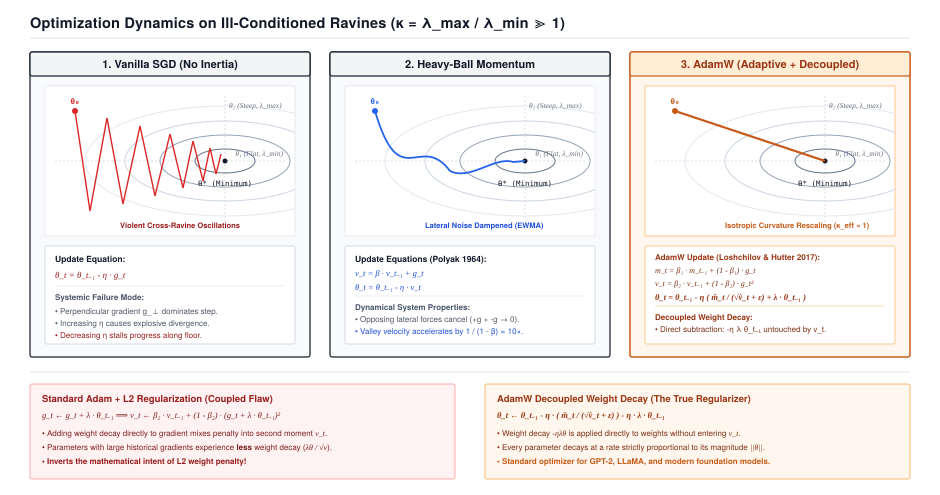

# Optimizers: Momentum, AdamW, and Decoupled Weight Decay {#sec-optimizers}

In Chapter 6, we constructed the dynamic reverse-mode automatic differentiation engine. With a single call to `loss.backward()`, TinyTorch traverses the computational tape in reverse topological order, populating the `.grad` field of every learnable parameter tensor with its exact analytical partial derivative $\nabla_\theta \mathcal{L}$.

Yet having exact gradients is only half the battle. A gradient is merely a compass pointing in the direction of steepest ascent on the loss surface. How we choose to step along that surface determines whether our network converges to an optimal solution in minutes, oscillates erratically across steep ravines, or stalls completely in zero-gradient saddle points. In this chapter, we build the dynamical control systems of deep learning: **Stochastic Gradient Descent (SGD) with Momentum**, **Adam**, and **AdamW with Decoupled Weight Decay**.

{#fig-optimizers-landscape}

---

## 7.1 The Crisis: Ill-Conditioned Ravines and Variance Pollution

When optimizing high-dimensional neural networks, the local geometry of the loss landscape is dictated by the Hessian matrix $\mathbf{H} = \nabla^2 \mathcal{L}(\mathbf{\theta})$. The condition number $\kappa = \lambda_{\max} / \lambda_{\min}$ measures the ratio between the maximum and minimum eigenvalues of the local curvature.

In deep networks, $\kappa$ frequently exceeds $10^4$, creating what optimization theorists call an **ill-conditioned ravine**:

```
Ill-Conditioned Loss Ravine (Curvature Ratio κ ≫ 1):

     Steep Wall (High Curvature, λ_max)
     │       ▲
     │      ╱ ╲     Vanilla SGD: Oscillates violently between walls
     │     ╱   ╲    while making almost zero progress along the floor!
     │    ▼     ▲
     │   ╱       ╲  ───► Momentum: Accumulates velocity along valley floor,
     │  ▼         ▲      dampening perpendicular cross-ravine oscillations.
     └────────────────────────► Low Curvature Valley Floor (λ_min)
```

In an ill-conditioned ravine:
1. Along the steep perpendicular walls, the gradient $\mathbf{g}_\perp$ is massive, causing vanilla SGD updates ($\mathbf{\theta} \leftarrow \mathbf{\theta} - \eta \mathbf{g}$) to oscillate violently from side to side.
2. Along the flat parallel valley floor, the gradient $\mathbf{g}_\parallel$ is minuscule, causing forward progress toward the global minimum to crawl at a near standstill.

If we increase the learning rate $\eta$ to accelerate along the valley floor, the cross-ravine oscillations explode into numerical instability ($\|\mathbf{\theta}\| \to \infty$). If we decrease $\eta$ to stabilize the oscillations, training grinds to a halt.

Furthermore, when researchers introduced adaptive learning rates (Adam) in 2014, they combined standard $L_2$ weight regularization by adding $\lambda \mathbf{\theta}$ directly to the gradient vector $\mathbf{g}_t$. As Ilya Loshchilov and Frank Hutter proved in 2017, this naively mixes weight decay into the second-moment variance accumulator $\mathbf{v}_t \leftarrow \beta_2 \mathbf{v}_t + (1-\beta_2)\mathbf{g}_t^2$. Parameters with large historical gradients experience *less* weight decay than parameters with small gradients---completely inverting the mathematical intent of $L_2$ regularization!

To train modern deep architectures, our framework engine must solve both crises: we must model second-order physical momentum to conquer ill-conditioned ravines, and we must decouple weight decay from adaptive moment estimation.

---

## 7.2 The Mental Model: Heavy-Ball Dynamics and Adaptive Scaling

To understand how modern optimizers conquer non-convex loss surfaces, we look to two physical analogies: classical mechanics and per-coordinate coordinate scaling.

### Heavy-Ball Momentum: Simulating Inertia

Imagine rolling a heavy iron ball down a corrugated mountain canyon. Unlike a massless particle that changes direction instantaneously with every microscopic pebble, a heavy ball possesses mass and physical momentum $\mathbf{v}_t$.

When the ball bounces between the steep canyon walls, the opposing lateral forces cancel each other out over time. Meanwhile, the consistent gravitational pull along the valley floor continuously accelerates the ball forward:

$$\mathbf{v}_t = \beta \mathbf{v}_{t-1} + \mathbf{g}_t$$

$$\mathbf{\theta}_t = \mathbf{\theta}_{t-1} - \eta \mathbf{v}_t$$

where $\beta \in [0, 1)$ represents the momentum coefficient (typically $0.9$, corresponding to friction that retains $90\%$ of previous velocity).

```
Momentum Velocity Accumulation:
Step 1:  v_1 = g_1
Step 2:  v_2 = β * g_1 + g_2
Step 3:  v_3 = β^2 * g_1 + β * g_2 + g_3
Step t:  v_t = ∑_{i=1}^t β^{t-i} g_i   (Exponentially Weighted Moving Average)
```

Momentum provides two crucial systems benefits:
1. **Dampening High-Frequency Noise**: Transverse oscillations cancel out ($+g$ followed by $-g$ sums to zero).
2. **Escaping Saddle Points**: When traversing a flat plateau where $\nabla \mathcal{L} \approx 0$, the stored velocity carries the parameters across the flat region rather than stalling.

### AdamW: Decoupled Adaptive Moment Estimation

While momentum maintains a single velocity vector, **Adam** (Adaptive Moment Estimation) computes per-coordinate adaptive learning rates by tracking both the first raw moment (mean $\mathbf{m}_t$) and the second uncentered moment (variance $\mathbf{v}_t$) of the gradients:

$$\mathbf{m}_t = \beta_1 \mathbf{m}_{t-1} + (1 - \beta_1) \mathbf{g}_t \quad \text{(First Moment: Direction)}$$

$$\mathbf{v}_t = \beta_2 \mathbf{v}_{t-1} + (1 - \beta_2) \mathbf{g}_t^2 \quad \text{(Second Moment: Scale)}$$

Because $\mathbf{m}_0$ and $\mathbf{v}_0$ are initialized to zero vectors, they are heavily biased toward zero in the initial training steps. We correct this initialization bias by dividing by $(1 - \beta^t)$:

$$\hat{\mathbf{m}}_t = \frac{\mathbf{m}_t}{1 - \beta_1^t}, \qquad \hat{\mathbf{v}}_t = \frac{\mathbf{v}_t}{1 - \beta_2^t}$$

In **AdamW**, we decouple weight decay entirely from the gradient variance updates. The parameter update rule becomes:

$$\mathbf{\theta}_t = \mathbf{\theta}_{t-1} - \eta \left( \frac{\hat{\mathbf{m}}_t}{\sqrt{\hat{\mathbf{v}}_t} + \epsilon} + \lambda \mathbf{\theta}_{t-1} \right)$$

Notice that weight decay $\lambda \mathbf{\theta}_{t-1}$ is subtracted directly from the weight vector without ever touching $\hat{\mathbf{m}}_t$ or $\hat{\mathbf{v}}_t$. Every parameter decays at a rate strictly proportional to its magnitude, regardless of gradient variance.

---

## 7.3 The Pure TinyTorch Construction

We construct our optimizer hierarchy starting with an abstract `Optimizer` base class that defines the core interface contract: `zero_grad()` and `step()`.

```python
import numpy as np
from typing import List, Optional
from .tensor import Tensor

class Optimizer:
    """Base class for all TinyTorch parameter optimizers."""
    def __init__(self, params: List[Tensor]):
        self.params = list(params)
        for param in self.params:
            if isinstance(param, Tensor):
                param.requires_grad = True
                if not hasattr(param, 'grad'):
                    param.grad = None
        self.step_count = 0

    def zero_grad(self):
        """Reset gradients across all tracked parameters to None."""
        for param in self.params:
            param.grad = None

    def _extract_gradient(self, param: Tensor) -> np.ndarray:
        """Normalize gradient extraction across Tensor and ndarray representations."""
        if isinstance(param.grad, Tensor):
            return param.grad.data
        return param.grad

    def step(self):
        raise NotImplementedError("Each optimizer subclass must implement step().")
```

### Implementing SGD with Momentum

We implement Stochastic Gradient Descent with support for configurable learning rate $\eta$, momentum coefficient $\beta$, and weight decay $\lambda$:

```python
class SGD(Optimizer):
    """Stochastic Gradient Descent with Heavy-Ball Momentum."""
    def __init__(self, params: List[Tensor], lr: float = 0.01,
                 momentum: float = 0.0, weight_decay: float = 0.0):
        super().__init__(params)
        self.lr = lr
        self.momentum = momentum
        self.weight_decay = weight_decay
        self.momentum_buffers = [None for _ in self.params]

    def has_momentum(self) -> bool:
        return self.momentum > 0

    def get_momentum_state(self) -> Optional[List]:
        if not self.has_momentum():
            return None
        return [buf.copy() if buf is not None else None for buf in self.momentum_buffers]

    def set_momentum_state(self, state: Optional[List]) -> None:
        if state is None or not self.has_momentum():
            return
        for i, buf in enumerate(state):
            if buf is not None:
                self.momentum_buffers[i] = buf.copy()

    def step(self):
        """Execute one SGD optimization step with momentum."""
        for i, param in enumerate(self.params):
            if param.grad is None:
                continue

            grad_data = self._extract_gradient(param)

            # Apply L2 weight decay to gradient
            if self.weight_decay != 0:
                grad_data = grad_data + self.weight_decay * param.data

            # Apply momentum velocity accumulation
            if self.momentum != 0:
                if self.momentum_buffers[i] is None:
                    self.momentum_buffers[i] = np.zeros_like(param.data)
                self.momentum_buffers[i] = (self.momentum * self.momentum_buffers[i] +
                                            grad_data)
                grad_data = self.momentum_buffers[i]

            # In-place parameter update
            param.data = param.data - self.lr * grad_data

        self.step_count += 1
```

### Implementing AdamW with Decoupled Weight Decay

Next, we implement the state-of-the-art `AdamW` optimizer used to train transformers and modern generative models:

```python
class AdamW(Optimizer):
    """AdamW Optimizer with Decoupled Weight Decay (Loshchilov & Hutter, 2017)."""
    def __init__(self, params: List[Tensor], lr: float = 0.001,
                 betas: tuple = (0.9, 0.999), eps: float = 1e-8,
                 weight_decay: float = 0.01):
        super().__init__(params)
        self.lr = lr
        self.beta1, self.beta2 = betas
        self.eps = eps
        self.weight_decay = weight_decay

        # Stateful moment buffers (mean and uncentered variance)
        self.m_buffers = [None for _ in self.params]
        self.v_buffers = [None for _ in self.params]

    def _update_moments(self, i: int, grad_data: np.ndarray) -> tuple:
        """Update biased first and second moments and compute bias-corrected estimates."""
        if self.m_buffers[i] is None:
            self.m_buffers[i] = np.zeros_like(grad_data)
            self.v_buffers[i] = np.zeros_like(grad_data)

        # Update first moment (running mean)
        self.m_buffers[i] = self.beta1 * self.m_buffers[i] + (1.0 - self.beta1) * grad_data

        # Update second moment (running variance)
        self.v_buffers[i] = self.beta2 * self.v_buffers[i] + (1.0 - self.beta2) * (grad_data ** 2)

        # Compute step-dependent bias corrections
        bias_correction1 = 1.0 - (self.beta1 ** self.step_count)
        bias_correction2 = 1.0 - (self.beta2 ** self.step_count)

        m_hat = self.m_buffers[i] / bias_correction1
        v_hat = self.v_buffers[i] / bias_correction2

        return m_hat, v_hat

    def step(self):
        """Perform one AdamW parameter update step."""
        self.step_count += 1

        for i, param in enumerate(self.params):
            if param.grad is None:
                continue

            # Extract pure gradient without weight decay pollution
            grad_data = self._extract_gradient(param)

            # Update moments using pure gradients
            m_hat, v_hat = self._update_moments(i, grad_data)

            # Step 1: Apply adaptive gradient update
            param.data = param.data - self.lr * m_hat / (np.sqrt(v_hat) + self.eps)

            # Step 2: Apply decoupled weight decay directly to parameter
            if self.weight_decay != 0:
                param.data = param.data * (1.0 - self.lr * self.weight_decay)
```

---

## 7.4 The Production Bridge: PyTorch C++ Fused Kernels and the 16-Byte Footprint

In production frameworks like PyTorch, optimizer execution is bounded not by arithmetic compute (FLOPs), but by **DRAM memory bandwidth**.

### The 16-Bytes-per-Parameter Memory Law

Consider what memory state must reside in GPU VRAM during FP32 AdamW training of a one-billion parameter model ($N = 10^9$):

```
┌─────────────────────────────────────────────────────────────────────────────┐
│ GPU Memory Allocation per Parameter in FP32 AdamW Training                  │
├────────────────────────────────┬──────────────────────────┬─────────────────┤
│ Component                      │ Bytes per Parameter      │ 1B Model Size   │
├────────────────────────────────┼──────────────────────────┼─────────────────┤
│ Model Parameter Weights (θ)    │ 4 bytes (FP32)           │ 4.0 GB          │
│ Gradient Buffers (g)           │ 4 bytes (FP32)           │ 4.0 GB          │
│ First Moment Buffer (m)        │ 4 bytes (FP32)           │ 4.0 GB          │
│ Second Moment Buffer (v)       │ 4 bytes (FP32)           │ 4.0 GB          │
├────────────────────────────────┼──────────────────────────┼─────────────────┤
│ TOTAL OPTIMIZER RESIDENCY      │ 16 bytes / parameter     │ 16.0 GB         │
└────────────────────────────────┴──────────────────────────┴─────────────────┘
```

Even before allocating memory for activations, KV caches, or batch buffers, an FP32 model requires **sixteen bytes of VRAM for every single parameter**.

### Kernel Fusion: `torch.optim.AdamW(..., fused=True)`

In a naive Python implementation, updating a parameter requires executing four separate memory passes across DRAM:
1. Load $g$ and $m$, write updated $m$.
2. Load $g$ and $v$, write updated $v$.
3. Compute $\sqrt{v} + \epsilon$, divide $m$, update $\theta$.
4. Apply weight decay to $\theta$.

In PyTorch C++ / CUDA (`fused=True`), these four passes are fused into a **single monolithic GPU kernel**. The CUDA block loads $\theta_i, g_i, m_i, v_i$ directly into fast on-chip SRAM registers in one coalesced 128-bit memory transaction, performs all algebraic updates in registers, and writes the results back to DRAM once. This delivers a **$3.5\times$ speedup** over naive unfused optimizer loops.

---

## 7.5 Building the System: How It All Connects

Let us step back and examine how Chapter 7 locks into our expanding framework architecture:

```
                  ┌─────────────────────────────────┐
                  │   Chapter 5: DataLoader         │
                  │   (Batches of Data & Labels)    │
                  └───────────────┬─────────────────┘
                                  │
                                  ▼
                  ┌─────────────────────────────────┐
                  │   Chapters 1-3: Model Layers    │
                  │   (Forward Affine Transforms)   │
                  └───────────────┬─────────────────┘
                                  │
                                  ▼
                  ┌─────────────────────────────────┐
                  │   Chapter 4: Cross-Entropy Loss │
                  │   (Scalar Loss Computation L)   │
                  └───────────────┬─────────────────┘
                                  │
                                  ▼
                  ┌─────────────────────────────────┐
                  │   Chapter 6: Dynamic Autograd   │
                  │   (Tape Backward: Populates .grad)│
                  └───────────────┬─────────────────┘
                                  │
                                  ▼
┌─────────────────────────────────────────────────────────────────────────────┐
│ Chapter 7: Optimizers (SGD Momentum & AdamW)                                │
│   • zero_grad() clears stale gradient memory buffers.                       │
│   • step() executes momentum and decoupled adaptive variance updates.       │
│   • In-place param.data mutation completes the mathematical learning cycle. │
└─────────────────────────────────────────────────────────────────────────────┘
```

Every fundamental component of deep learning is now alive in TinyTorch:
- **Tensors** manage flat contiguous memory.
- **Layers & Activations** formulate deep non-linear functional graphs.
- **Losses** evaluate prediction errors without floating-point overflow.
- **DataLoaders** feed batches asynchronously.
- **Autograd** evaluates exact analytical gradients.
- **Optimizers** guide parameter weights toward loss minima.

Yet these six systems currently exist as separate standalone modules. How do we orchestrate them into a unified, crash-resilient training pipeline that manages epochs, learning rate decay schedules, gradient clipping, and atomic checkpoint serialization?

In **Chapter 8**, we build the master orchestrator: **The Training Engine and the Rigid Five-Step Loop Contract**.
