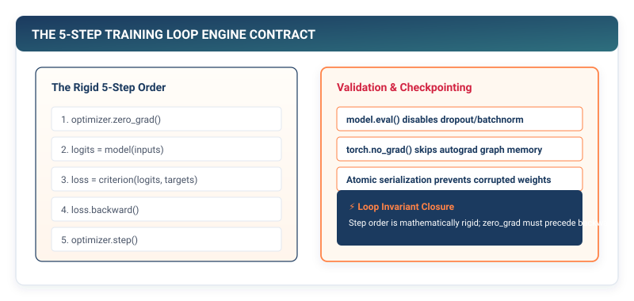

# The Training Engine: The Rigid Five-Step Loop Contract {#sec-training}

In Chapters 1 through 7, we engineered all six core subsystems of a deep learning framework: multidimensional tensor storage, non-linear activation functions, modular parameter containers, numerically stable loss functions, asynchronous data streaming, dynamic autograd tape recording, and adaptive moment optimizers.

Yet an engine is not merely a collection of isolated gears. If the gears are engaged out of order---if gradients are not cleared before the backward pass, if the optimizer steps before loss backpropagation finishes, or if parameters mutate during evaluation---the entire mathematical runtime collapses into silent corruption. In this chapter, we engineer **The Training Engine**: the state machine that enforces the **Rigid Five-Step Loop Contract**, manages dynamic cosine learning rate schedules, executes global gradient norm clipping, and guarantees atomic checkpoint serialization.

{#fig-training-pipeline}

---

## 8.1 The Crisis: The Silent Corruption of Misordered Loops

In software engineering, a syntax error crashes immediately with a loud stack trace. In deep learning framework engineering, an ordering bug in the training loop almost never crashes; instead, it causes **silent mathematical corruption**:

```
The Three Fatal Training Loop Bugs:

1. FORGOTTEN zero_grad():
   • Gradients accumulate indefinitely: g_t = g_1 + g_2 + ... + g_t.
   • Result: Gradient norms explode into infinity (NaN loss). ❌

2. PREMATURE optimizer.step() BEFORE backward():
   • Parameters are updated using stale gradients from the PREVIOUS batch.
   • Result: The model updates on obsolete loss surfaces, failing to converge. ❌

3. MISSING eval() MODE SWITCH:
   • Dropout drops 50% of activations during test-time inference.
   • Result: Test accuracy drops by 40% due to unscaled random noise. ❌
```

Consider what happens when a developer forgets to call `optimizer.zero_grad()` at the beginning of each iteration. Because autograd relies on in-place gradient accumulation (`param.grad += grad`) to support multi-branch computational DAGs, gradients from batch $t$ add directly to gradients from batch $t-1$. Within ten steps, parameter updates explode into floating-point overflow (`inf`), destroying hours of cluster compute.

Similarly, in recurrent neural networks or deep transformers, steep cliffs on the loss surface produce momentary "gradient explosions" where $\|\mathbf{g}\|_2 > 1000$. A single unclipped step can blast parameter weights far outside their stable activation regimes, causing irreparable catastrophic forgetting.

To make deep learning reproducible and robust, a framework must formalize the training loop as a **rigid, immutable state transition machine**.

---

## 8.2 The Mental Model: The Rigid Five-Step State Machine

Every robust deep learning framework executes training through an invariant five-step lifecycle:

```
┌─────────────────────────────────────────────────────────────────────────────┐
│ The Rigid Five-Step Training Loop Contract                                  │
├─────────┬───────────────────┬───────────────────────────────────────────────┤
│ Step    │ Action            │ Systems / Hardware State                      │
├─────────┼───────────────────┼───────────────────────────────────────────────┤
│ Step 1  │ optimizer.zero_   │ Clears old .grad references, resetting memory │
│         │ grad()            │ pointers for new gradient accumulation.       │
├─────────┼───────────────────┼───────────────────────────────────────────────┤
│ Step 2  │ outputs = model(  │ Traverses forward DAG; records Op tape in     │
│         │ inputs)           │ memory; caches intermediate activations.      │
├─────────┼───────────────────┼───────────────────────────────────────────────┤
│ Step 3  │ loss = loss_fn(   │ Compares logits to targets; computes scalar L │
│         │ outputs, targets) │ via numerically stable Log-Sum-Exp.          │
├─────────┼───────────────────┼───────────────────────────────────────────────┤
│ Step 4  │ loss.backward()   │ Traverses tape in reverse topological order;  │
│         │                   │ populates param.grad via VJP accumulation.    │
├─────────┼───────────────────┼───────────────────────────────────────────────┤
│ Step 5  │ optimizer.step()  │ Applies momentum/AdamW updates in-place to    │
│         │                   │ param.data; increments step_count.            │
└─────────┴───────────────────┴───────────────────────────────────────────────┘
```

### Global Gradient Norm Clipping

When gradients spike due to sharp cliffs in the loss surface, clipping each parameter independently distorts the *direction* of the gradient vector. To preserve the exact optimization trajectory while bounding the step size, we compute the **Global Gradient Norm** across all $P$ parameter tensors:

$$\|\mathbf{g}\|_{\text{global}} = \sqrt{\sum_{i=1}^P \|\mathbf{g}_i\|_2^2} = \sqrt{\sum_{i=1}^P \sum_{j} (g_{i,j})^2}$$

If $\|\mathbf{g}\|_{\text{global}} > \gamma_{\max}$, we scale every gradient tensor uniformly by the clipping coefficient:

$$\mathbf{g}_i \leftarrow \mathbf{g}_i \times \left( \frac{\gamma_{\max}}{\|\mathbf{g}\|_{\text{global}}} \right)$$

This guarantees that the gradient vector points in the exact same mathematical direction in high-dimensional parameter space, but with its Euclidean magnitude clamped strictly to $\gamma_{\max}$.

### Cosine Annealing Learning Rate Schedule

Rather than training with a static learning rate, modern models utilize **Cosine Annealing** (Loshchilov & Hutter, 2016). The learning rate smoothly decays from $\eta_{\max}$ to $\eta_{\min}$ following a half-period cosine curve over $T$ total epochs:

$$\eta_t = \eta_{\min} + \frac{1}{2} (\eta_{\max} - \eta_{\min}) \left( 1 + \cos\left( \frac{\pi \cdot t}{T} \right) \right)$$

```
Cosine Annealing Learning Rate Decay:

  η_max ──┐
          │╲
          │ ╲
          │  ╲
          │   ╲___
  η_min ──┴───────┴───────► Epochs (T)
          0      T/2      T
```

In early epochs, high learning rates allow parameters to escape shallow local minima. In later epochs, infinitesimal learning rates allow the optimizer to settle into the deepest, sharpest valleys of the loss surface.

---

## 8.3 The Pure TinyTorch Construction

We implement the complete training orchestration suite in pure Python, beginning with `CosineSchedule` and `clip_grad_norm`.

### Implementing the Cosine Schedule and Gradient Norm Clipper

```python
import numpy as np
import pickle
import os
from pathlib import Path
from typing import List, Tuple, Optional, Dict, Any
from .tensor import Tensor

class CosineSchedule:
    """Cosine annealing learning rate schedule across training epochs."""
    def __init__(self, max_lr: float = 0.1, min_lr: float = 0.01, total_epochs: int = 100):
        self.max_lr = max_lr
        self.min_lr = min_lr
        self.total_epochs = total_epochs

    def get_lr(self, epoch: int) -> float:
        """Evaluate learning rate for the given epoch."""
        if epoch >= self.total_epochs:
            return self.min_lr
        cosine_factor = (1.0 + np.cos(np.pi * epoch / self.total_epochs)) / 2.0
        return self.min_lr + (self.max_lr - self.min_lr) * cosine_factor

def clip_grad_norm(parameters: List[Tensor], max_norm: float = 1.0) -> float:
    """Clips gradient norm across all model parameters in-place."""
    if not parameters:
        return 0.0

    # Compute global sum of squared gradients
    total_norm = 0.0
    for param in parameters:
        if param.grad is not None:
            grad_data = param.grad.data if isinstance(param.grad, Tensor) else param.grad
            total_norm += np.sum(grad_data ** 2)

    total_norm = np.sqrt(total_norm)

    # Scale gradients if global norm exceeds threshold
    if total_norm > max_norm:
        clip_coef = max_norm / total_norm
        for param in parameters:
            if param.grad is not None:
                if isinstance(param.grad, Tensor):
                    param.grad.data = param.grad.data * clip_coef
                else:
                    param.grad = param.grad * clip_coef

    return float(total_norm)
```

### Implementing the Unified `Trainer` Class

The `Trainer` class encapsulates the full training loop, evaluation mode, gradient accumulation, metric tracking, and atomic serialization:

```python
class Trainer:
    """Master Training Orchestrator for TinyTorch models."""
    def __init__(self, model, optimizer, loss_fn,
                 scheduler: Optional[CosineSchedule] = None,
                 grad_clip_norm: Optional[float] = None):
        self.model = model
        self.optimizer = optimizer
        self.loss_fn = loss_fn
        self.scheduler = scheduler
        self.grad_clip_norm = grad_clip_norm

        # Enable gradient tracking on all model parameters
        for param in self.model.parameters():
            if isinstance(param, Tensor):
                param.requires_grad = True

        self.epoch = 0
        self.step = 0
        self.training_mode = True
        self.history = {'train_loss': [], 'eval_loss': [], 'learning_rates': []}

    def _process_batch(self, inputs: Tensor, targets: Tensor, accumulation_steps: int = 1) -> float:
        """Process a single batch: Forward -> Loss -> Backward."""
        # Forward pass
        outputs = self.model.forward(inputs)
        loss = self.loss_fn.forward(outputs, targets)

        # Scale loss for gradient accumulation
        scaled_loss = loss.data / accumulation_steps
        scaled_gradient = np.ones_like(loss.data) / accumulation_steps
        loss.backward(scaled_gradient)

        return float(scaled_loss)

    def _optimizer_update(self):
        """Execute gradient clipping, parameter update, and zero_grad."""
        if self.grad_clip_norm is not None:
            clip_grad_norm(self.model.parameters(), self.grad_clip_norm)
        self.optimizer.step()
        self.optimizer.zero_grad()

    def train_epoch(self, dataloader, accumulation_steps: int = 1) -> float:
        """Train for one complete epoch across the dataset."""
        self.model.training = True
        self.training_mode = True

        # Update learning rate schedule
        if self.scheduler is not None:
            current_lr = self.scheduler.get_lr(self.epoch)
            self.optimizer.lr = current_lr
            self.history['learning_rates'].append(current_lr)

        total_loss = 0.0
        num_batches = 0
        accumulated_loss = 0.0

        for batch_idx, (inputs, targets) in enumerate(dataloader):
            accumulated_loss += self._process_batch(inputs, targets, accumulation_steps)

            if (batch_idx + 1) % accumulation_steps == 0:
                self._optimizer_update()
                total_loss += accumulated_loss
                accumulated_loss = 0.0
                num_batches += 1
                self.step += 1

        if accumulated_loss > 0:
            self._optimizer_update()
            total_loss += accumulated_loss
            num_batches += 1

        avg_loss = total_loss / max(num_batches, 1)
        self.history['train_loss'].append(avg_loss)
        self.epoch += 1
        return avg_loss

    def evaluate(self, dataloader) -> Tuple[float, float]:
        """Evaluate model in inference mode without gradient tracking."""
        self.model.training = False
        self.training_mode = False

        total_loss = 0.0
        correct = 0
        total = 0
        num_batches = 0

        for inputs, targets in dataloader:
            outputs = self.model.forward(inputs)
            loss = self.loss_fn.forward(outputs, targets)

            total_loss += float(loss.data)
            num_batches += 1

            if len(outputs.data.shape) > 1 and outputs.data.shape[-1] > 1:
                preds = np.argmax(outputs.data, axis=1)
                targs = targets.data if len(targets.data.shape) == 1 else np.argmax(targets.data, axis=1)
                correct += int(np.sum(preds == targs))
                total += len(preds)

        avg_loss = total_loss / max(num_batches, 1)
        accuracy = (correct / total) if total > 0 else 0.0
        self.history['eval_loss'].append(avg_loss)
        return avg_loss, accuracy
```

### Atomic Checkpointing: Safe POSIX Serialization

When training large models for days across GPU clusters, a node failure or power interruption mid-checkpoint can leave a half-written, corrupted file on disk. We implement **Atomic Checkpoint Replacement** using POSIX `os.replace()`:

```python
    def save_checkpoint(self, path: str):
        """Atomically serialize training state to disk."""
        checkpoint = {
            'epoch': self.epoch,
            'step': self.step,
            'model_state': {i: p.data.copy() for i, p in enumerate(self.model.parameters())},
            'optimizer_state': {'lr': self.optimizer.lr},
            'history': self.history,
            'training_mode': self.training_mode
        }

        Path(path).parent.mkdir(parents=True, exist_ok=True)
        tmp_path = f"{path}.tmp"
        try:
            with open(tmp_path, 'wb') as f:
                pickle.dump(checkpoint, f)
            # os.replace is an atomic rename on POSIX and Windows
            os.replace(tmp_path, path)
        except BaseException:
            if os.path.exists(tmp_path):
                os.remove(tmp_path)
            raise

    def load_checkpoint(self, path: str):
        """Restore full model and training state from checkpoint."""
        with open(path, 'rb') as f:
            checkpoint = pickle.load(f)

        self.epoch = checkpoint['epoch']
        self.step = checkpoint['step']
        self.history = checkpoint['history']
        self.training_mode = checkpoint['training_mode']

        # Restore parameter weights
        for i, param in enumerate(self.model.parameters()):
            if i in checkpoint['model_state']:
                param.data = checkpoint['model_state'][i].copy()
```

---

## 8.4 The Production Bridge: PyTorch DDP and Distributed AllReduce

In distributed training across thousands of GPUs, the training loop contract extends beyond a single node:

```
Distributed Data Parallel (PyTorch DDP) Gradient Ring AllReduce:

GPU 0 (Batch 0) ──► Forward ──► Backward ──► Local dL/dW_0 ─┐
                                                            │ Ring AllReduce
GPU 1 (Batch 1) ──► Forward ──► Backward ──► Local dL/dW_1 ─┼──► Synchronized
                                                            │     dL/dW_avg
GPU 2 (Batch 2) ──► Forward ──► Backward ──► Local dL/dW_2 ─┤        │
                                                            │        ▼
GPU 3 (Batch 3) ──► Forward ──► Backward ──► Local dL/dW_3 ─┘  optimizer.step()
```

In PyTorch `DistributedDataParallel` (DDP), the 5-step loop invariant is preserved, but `loss.backward()` triggers an asynchronous **Ring-AllReduce** across GPU interconnects (NVLink / InfiniBand). While earlier layers are still computing their backward VJPs, gradients from the final layers are already streaming across the network, overlapping communication with computation.

---

## 8.5 Building the System: How It All Connects

With the completion of Chapter 8, we have constructed **Part I: The Core Engine** of TinyTorch:

```
┌─────────────────────────────────────────────────────────────────────────────┐
│                          TINYTORCH PART I: THE CORE ENGINE                  │
├─────────────────────────────────────────────────────────────────────────────┤
│ 1. Tensors & Strides      : Contiguous 1D memory buffers & strided views    │
│ 2. Activations            : Non-linear gates (ReLU, GELU) preventing collapse│
│ 3. Layers & Parameters    : Parameter encapsulation & Kaiming initialization│
│ 4. Loss Functions         : Numerical stability via Log-Sum-Exp             │
│ 5. The DataLoader         : Asynchronous batch streaming & memory pinning   │
│ 6. Automatic Diff         : Dynamic tape DAG & reverse topological VJPs     │
│ 7. Optimizers             : Momentum & AdamW decoupled weight decay         │
│ 8. The Training Engine    : The rigid 5-step loop & atomic checkpointing    │
└─────────────────────────────────────────────────────────────────────────────┘
```

The foundational engine of our machine learning framework is fully assembled, self-contained, and operational.

To prove that our engine works, we now stand at the threshold of a historic test. In **Milestone I**, we step back into the history of artificial intelligence---from Frank Rosenblatt's 1958 Perceptron to Marvin Minsky's 1969 XOR crisis, to Rumelhart, Hinton, and Williams' 1986 backpropagation breakthrough---and validate our complete Core Engine on real-world handwritten digit classification.
