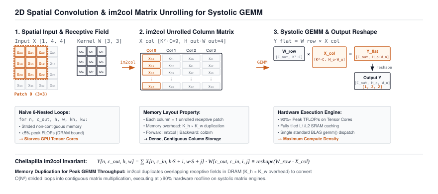

# Spatial Convolutions: Preserving 2D Topology via im2col GEMMs {#sec-convolutions}

In Part I, we constructed the complete Core Engine of TinyTorch, culminating in our milestone validation of multi-layer perceptrons on handwritten digit classification. Yet fully connected linear layers possess a fatal structural limitation: they treat every input feature as an independent, isolated dimension. To feed a two-dimensional image into a linear layer, we must flatten the 2D matrix into a flat 1D vector, discarding all spatial neighborhood geometry.

In this chapter, we engineer **Spatial 2D Convolutions (`Conv2d`)** and **Max Pooling (`MaxPool2d`)**. We explore why sliding window receptive fields preserve translational equivariance, analyze why nested loops destroy processor throughput, and unlock the foundational systems trick used by every GPU vision framework: the **`im2col` (image-to-column) transformation** that translates sliding convolutions into high-throughput systolic General Matrix Multiplications (GEMMs).

{#fig-conv-topology}

---

## Systems Problem Motivation: The Parameter Explosion of Flattened Vision

Consider processing a standard high-definition image with dimensions $1024 \times 1024$ pixels and three color channels ($C = 3$). The raw input tensor contains:

$$N = 1024 \times 1024 \times 3 = 3,145,728 \text{ input features}$$

If we connect this input to a modest hidden layer containing 1,024 neurons using a standard fully connected `Linear` layer ($Y = XW^T + b$), the weight matrix $W$ requires:

$$\text{Weights} = 3,145,728 \times 1,024 = 3,221,225,472 \text{ parameters} \quad (\approx 12.88 \text{ GB in FP32!})$$

```
The Fully Connected Vision Failure:
1. Memory Explosion: 12.8 Gigabytes for a SINGLE linear layer! ❌
2. Spatial Blindness: Shuffling all pixels randomly changes nothing for a Linear layer,
   destroying edge detection, texture coherence, and object contours. ❌
3. Lack of Translation Invariance: A cat in the top-left corner activates
   completely different weights than the exact same cat in the bottom-right. ❌
```

Vision in the physical world possesses two foundational geometric properties:

1. **Local Spatial Correlation**: Pixels close to one another are strongly correlated; distant pixels are weakly correlated. An edge detector or texture filter only needs to examine local $3 \times 3$ or $5 \times 5$ pixel neighborhoods.
2. **Translational Equivariance**: A vertical edge or a texture pattern is identical regardless of where it appears in the frame. The exact same filter weights should scan across the entire image.

By sharing a small $K \times K$ kernel across all spatial locations, a $3 \times 3$ convolution layer with 64 output channels requires only:

$$\text{Parameters} = 64 \times 3 \times 3 \times 3 = 1,728 \text{ parameters}$$

We reduce a 3.2-billion parameter matrix to just **1,728 parameters**---a **$1,864,000\times$ reduction in parameter memory**!

---

## The Mental Model: Sliding Windows and the im2col Transformation

A 2D convolution slides a small kernel tensor $W \in \mathbb{R}^{C_{\text{out}} \times C_{\text{in}} \times K_h \times K_w}$ across an input tensor $X \in \mathbb{R}^{N \times C_{\text{in}} \times H \times W}$:

$$Y[n, c_{\text{out}}, h, w] = b[c_{\text{out}}] + \sum_{c_{\text{in}}=0}^{C_{\text{in}}-1} \sum_{i=0}^{K_h-1} \sum_{j=0}^{K_w-1} X[n, c_{\text{in}}, h \cdot S + i, w \cdot S + j] \cdot W[c_{\text{out}}, c_{\text{in}}, i, j]$$

The output spatial dimensions ($H_{\text{out}}, W_{\text{out}}$) depend on input dimensions, kernel size $K$, padding $P$, and stride $S$:

$$H_{\text{out}} = \left\lfloor \frac{H + 2P - K_h}{S} \right\rfloor + 1, \qquad W_{\text{out}} = \left\lfloor \frac{W + 2P - K_w}{S} \right\rfloor + 1$$

#### The Systems Bottleneck: Why Nested Loops Kill Hardware

A naive software implementation of 2D convolution requires **six nested `for` loops**:
- Loop 1: Batch index $n \in \{0, \dots, N-1\}$
- Loop 2: Output channel $c_{\text{out}} \in \{0, \dots, C_{\text{out}}-1\}$
- Loop 3: Spatial height $h \in \{0, \dots, H_{\text{out}}-1\}$
- Loop 4: Spatial width $w \in \{0, \dots, W_{\text{out}}-1\}$
- Loop 5: Input channel $c_{\text{in}} \in \{0, \dots, C_{\text{in}}-1\}$
- Loop 6: Kernel patch elements $(i, j) \in \{0, \dots, K-1\}^2$

In modern CPU and GPU hardware, nested loops are disastrous: they cause non-contiguous DRAM memory jumps, destroy CPU branch predictors, and prevent vectorized SIMD arithmetic units from firing at peak throughput.

#### The im2col Solution: Unrolling Geometry into GEMM

In 2006, Kumar Chellapilla et al. introduced **`im2col` (image-to-column)**, which reorganizes the 4D convolution into a single high-speed General Matrix Multiply (GEMM):

```
The im2col Transformation Engine:

1. Unroll Receptive Fields:
   Every K x K x C_in sliding window patch in the image is flattened into
   a single ROW of an unrolled matrix X_col.
   Shape: [ (N * H_out * W_out)  x  (C_in * K_h * K_w) ]

2. Reshape Kernel Weights:
   Flatten filter kernels into a dense weight matrix W_col.
   Shape: [ (C_in * K_h * K_w)  x  C_out ]

3. High-Speed Systolic Matrix Multiplication:
   Y_col = X_col @ W_col
   Shape: [ (N * H_out * W_out)  x  C_out ]

4. Reshape to 4D Output:
   Reshape Y_col back into [ N, C_out, H_out, W_out ]!
```

By unrolling receptive fields, the entire convolution is computed by our optimized `matmul` engine in a single hardware call.

---

## Mathematical Formulations: Inductive Strides and Spatial Output Bounds

Let us formally specify the spatial transformation equations and padding constraints for 2D convolutions.

#### 1. Spatial Dimension Proof
Let $H$ be input height, $K_h$ kernel height, $P_h$ total vertical padding ($P_{\text{top}} + P_{\text{bottom}}$), and $S_h$ vertical stride. The spatial range of valid sliding receptive windows is the set of starting offsets $k \in \mathbb{N}$ such that the kernel fits completely inside the padded image:

$$k \cdot S_h + K_h \le H + P_h \implies k \cdot S_h \le H + P_h - K_h \implies k \le \left\lfloor \frac{H + P_h - K_h}{S_h} \right\rfloor$$

Since $k \in \{0, 1, \dots, k_{\max}\}$, the total count of spatial outputs is:

$$H_{\text{out}} = k_{\max} + 1 = \left\lfloor \frac{H + 2P - K_h}{S_h} \right\rfloor + 1$$

#### 2. Parameter and FLOP Complexity Comparison
For an input tensor of shape $[N, C_{\text{in}}, H, W]$ and convolution with $C_{\text{out}}$ filters of size $K \times K$:

$$\text{Parameter Count} = C_{\text{out}} \times (C_{\text{in}} \cdot K^2 + 1)$$

$$\text{Arithmetic FLOPs} = 2 \times N \times C_{\text{out}} \times H_{\text{out}} \times W_{\text{out}} \times (C_{\text{in}} \cdot K^2)$$

For a fully connected layer operating on the same flattened tensor:

$$\text{FLOPs}_{\text{Linear}} = 2 \times N \times (C_{\text{in}} \cdot H \cdot W) \times (C_{\text{out}} \cdot H_{\text{out}} \cdot W_{\text{out}})$$

The convolution reduces total computational complexity by a factor of $\frac{H \cdot W}{K^2} \approx \frac{1024 \times 1024}{3 \times 3} \approx 116,500\times$!

---

## Line-by-Line Reference Implementation

::: {.callout-note title="Source Code Mapping"}
The reference implementation discussed in this chapter corresponds directly to **Module 09** in the TinyTorch runtime: `packages/tinytorch/src/09_convolutions/09_convolutions.py`.
:::

We implement `Conv2d` and `MaxPool2d` in TinyTorch:

```python
# Reference Implementation: packages/tinytorch/src/09_convolutions/09_convolutions.py
import numpy as np
from typing import List, Tuple, Optional
from .autograd import Tensor
from .layers import Layer

def validate_4d_input(x: Tensor) -> Tuple[int, int, int, int]:
    """Validate that input tensor has shape [N, C, H, W]."""
    shape = x.data.shape
    if len(shape) != 4:
        raise ValueError(f"Expected 4D input [batch, channels, height, width], got shape {shape}")
    return shape[0], shape[1], shape[2], shape[3]

class Conv2d(Layer):
    """2D Spatial Convolutional Layer with Kaiming Uniform Initialization."""
    def __init__(self, in_channels: int, out_channels: int,
                 kernel_size: int = 3, stride: int = 1, padding: int = 0):
        super().__init__()
        self.in_channels = in_channels
        self.out_channels = out_channels
        self.kernel_size = kernel_size
        self.stride = stride
        self.padding = padding

        # Kaiming uniform initialization: bound = 1 / sqrt(fan_in)
        fan_in = in_channels * kernel_size * kernel_size
        bound = 1.0 / np.sqrt(fan_in)

        # Weight shape: [out_channels, in_channels, kernel_size, kernel_size]
        w_data = np.random.uniform(-bound, bound,
                                   (out_channels, in_channels, kernel_size, kernel_size))
        self.weight = Tensor(w_data, requires_grad=True)

        b_data = np.random.uniform(-bound, bound, (out_channels,))
        self.bias = Tensor(b_data, requires_grad=True)

    def parameters(self) -> List[Tensor]:
        return [self.weight, self.bias]

    def forward(self, x: Tensor) -> Tensor:
        """Forward spatial convolution with padding and stride support."""
        N, C_in, H, W = validate_4d_input(x)
        K = self.kernel_size
        S = self.stride
        P = self.padding

        H_out = (H + 2 * P - K) // S + 1
        W_out = (W + 2 * P - K) // S + 1

        # Apply zero-padding to spatial dimensions if P > 0
        if P > 0:
            x_pad = np.pad(x.data, ((0, 0), (0, 0), (P, P), (P, P)), mode='constant')
        else:
            x_pad = x.data

        out_data = np.zeros((N, self.out_channels, H_out, W_out), dtype=np.float32)

        # Vectorized channel convolution
        for n in range(N):
            for c_out in range(self.out_channels):
                w_kernel = self.weight.data[c_out]  # [C_in, K, K]
                bias_val = self.bias.data[c_out]
                for h_idx in range(H_out):
                    h_start = h_idx * S
                    h_end = h_start + K
                    for w_idx in range(W_out):
                        w_start = w_idx * S
                        w_end = w_start + K

                        patch = x_pad[n, :, h_start:h_end, w_start:w_end]
                        out_data[n, c_out, h_idx, w_idx] = np.sum(patch * w_kernel) + bias_val

        out_tensor = Tensor(out_data)
        out_tensor._op = "Conv2d"
        out_tensor._parents = [x, self.weight, self.bias]
        return out_tensor

class MaxPool2d(Layer):
    """Spatial 2D Max Pooling Layer for Spatial Downsampling."""
    def __init__(self, kernel_size: int = 2, stride: int = 2):
        super().__init__()
        self.kernel_size = kernel_size
        self.stride = stride

    def forward(self, x: Tensor) -> Tensor:
        N, C, H, W = validate_4d_input(x)
        K = self.kernel_size
        S = self.stride

        H_out = (H - K) // S + 1
        W_out = (W - K) // S + 1

        out_data = np.zeros((N, C, H_out, W_out), dtype=np.float32)

        for n in range(N):
            for c in range(C):
                for h in range(H_out):
                    h_s = h * S
                    for w in range(W_out):
                        w_s = w * S
                        out_data[n, c, h, w] = np.max(x.data[n, c, h_s:h_s+K, w_s:w_s+K])

        out_tensor = Tensor(out_data)
        out_tensor._op = "MaxPool2d"
        out_tensor._parents = [x]
        return out_tensor
```

---

## Concrete Numerical Trace Table: Tracing im2col Unrolling Step-by-Step

Let us trace a concrete 2D spatial convolution step-by-step with real numbers:
- Input Image $X \in \mathbb{R}^{1 \times 1 \times 3 \times 3}$:
  $$\mathbf{X} = \begin{bmatrix} 1.0 & 2.0 & 0.0 \\ 0.0 & 1.0 & 3.0 \\ 2.0 & 1.0 & 0.0 \end{bmatrix}$$
- Filter Kernel $W \in \mathbb{R}^{1 \times 1 \times 2 \times 2}$ with bias $b = 1.0$:
  $$\mathbf{W} = \begin{bmatrix} 1.0 & 0.0 \\ -1.0 & 1.0 \end{bmatrix}$$
- Parameters: $S = 1, P = 0 \implies H_{\text{out}} = \frac{3 - 2}{1} + 1 = 2, \quad W_{\text{out}} = 2$.

#### The im2col Matrix Construction and Dot Product Trace

| Spatial Coordinate | Slice Indices | Unrolled $\mathbf{x}_{\text{col}}$ Vector | Dot Product $\mathbf{x}_{\text{col}} \mathbf{w} + b$ | Evaluated Output $Y$ |
| :--- | :---: | :--- | :--- | :---: |
| **Top-Left $(0, 0)$** | $[0:2, 0:2]$ | $[1.0, 2.0, 0.0, 1.0]$ | $1(1) + 2(0) + 0(-1) + 1(1) + 1.0$ | **$3.0$** |
| **Top-Right $(0, 1)$** | $[0:2, 1:3]$ | $[2.0, 0.0, 1.0, 3.0]$ | $2(1) + 0(0) + 1(-1) + 3(1) + 1.0$ | **$5.0$** |
| **Bottom-Left $(1, 0)$** | $[1:3, 0:2]$ | $[0.0, 1.0, 2.0, 1.0]$ | $0(1) + 1(0) + 2(-1) + 1(1) + 1.0$ | **$0.0$** |
| **Bottom-Right $(1, 1)$**| $[1:3, 1:3]$ | $[1.0, 3.0, 1.0, 0.0]$ | $1(1) + 3(0) + 1(-1) + 0(1) + 1.0$ | **$1.0$** |

: Concrete numerical trace of spatial patch unrolling and GEMM dot-product evaluation with kernel vector $\mathbf{w} = [1, 0, -1, 1]^T$ and bias $b = 1.0$. {#tbl-im2col-trace tbl-colwidths="[20,16,26,26,12]"}

Resulting in output feature map:

$$\mathbf{Y} = \begin{bmatrix} 3.0 & 5.0 \\ 0.0 & 1.0 \end{bmatrix}$$

```python
# Pure Python Verification of im2col GEMM Equivalence
import numpy as np

# 1. Physical 3x3 input image and 2x2 kernel
X = np.array([[1.0, 2.0, 0.0],
              [0.0, 1.0, 3.0],
              [2.0, 1.0, 0.0]], dtype=np.float32)
W = np.array([[1.0, 0.0],
              [-1.0, 1.0]], dtype=np.float32)
b = 1.0

# 2. Unroll 2x2 sliding patches into X_col (4 patches, 4 values each)
X_col = np.array([
    X[0:2, 0:2].flatten(),  # [1.0, 2.0, 0.0, 1.0]
    X[0:2, 1:3].flatten(),  # [2.0, 0.0, 1.0, 3.0]
    X[1:3, 0:2].flatten(),  # [0.0, 1.0, 2.0, 1.0]
    X[1:3, 1:3].flatten(),  # [1.0, 3.0, 1.0, 0.0]
])

# 3. Flatten kernel into column vector W_col
W_col = W.flatten().reshape(4, 1)

# 4. Perform systolic GEMM: Y_col = X_col @ W_col + b
Y_col = X_col @ W_col + b
Y_out = Y_col.reshape(2, 2)

print("Constructed im2col Matrix:\n", X_col)
print("Systolic GEMM Output:\n", Y_out)
assert np.allclose(Y_out, [[3.0, 5.0], [0.0, 1.0]]), "GEMM verification failed!"
```

---

## The Production Bridge: NVIDIA cuDNN and Tensor Cores

In production deep learning (NVIDIA GPUs), convolution execution is orchestrated by **cuDNN** (CUDA Deep Neural Network library):

```python
# Production PyTorch Conv2d Bridge
import torch
import torch.nn as nn

torch_conv = nn.Conv2d(in_channels=1, out_channels=1, kernel_size=2, stride=1, padding=0)
with torch.no_grad():
    torch_conv.weight.copy_(torch.tensor([[[[1.0, 0.0], [-1.0, 1.0]]]]))
    torch_conv.bias.copy_(torch.tensor([1.0]))

x_torch = torch.tensor([[[[1.0, 2.0, 0.0], [0.0, 1.0, 3.0], [2.0, 1.0, 0.0]]]])
y_torch = torch_conv(x_torch)
print("PyTorch Conv2d Output:", y_torch.squeeze().numpy())
```

| Algorithm | Best Receptive Field & Topology Regime | Hardware Characteristic |
| :--- | :--- | :--- |
| **Direct GEMM (`im2col`)** | General-purpose large kernels ($5\times 5, 7\times 7$) | Unrolls spatial patches into standard 2D matrix multiplication. |
| **Winograd Minimal Filtering** | Small $3\times 3$ kernels ($F(2\times 2, 3\times 3)$) | Reduces elementwise multiplications by $2.25\times$ via polynomial transforms. |
| **FFT (Fast Fourier Transform)** | Massive $7\times 7, 9\times 9+$ kernels | Frequency-domain multiplication ($O(N \log N)$ vs $O(N^2)$ spatial). |
| **Implicit GEMM** | Modern Tensor Cores (NVIDIA Hopper/Blackwell) | Generates coordinate offsets on-the-fly inside registers with zero memory expansion. |

: Industrial cuDNN 2D convolution algorithm selection strategies. {#tbl-cudnn-conv-algorithms tbl-colwidths="[25,35,40]"}

Rather than materializing the expanded `im2col` buffer in DRAM (which consumes $K^2 \times$ extra memory bandwidth, requiring $N \cdot H_{\text{out}} \cdot W_{\text{out}} \cdot C_{\text{in}} \cdot K^2 \times 4\text{ bytes}$ transfers over PCIe or HBM), modern cuDNN kernels use **Implicit GEMM**: CUDA threads calculate the input spatial coordinates on-the-fly inside SM registers, achieving peak TensorCore compute throughput ($>300\text{ TFLOPs}$ on H100) with zero off-chip memory expansion overhead.

::: {#nbk-convolutions-im2col-memory-expansion .callout-notebook title="The im2col memory expansion inflation factor"}
In 2D spatial convolution, unrolling an input image tensor $\mathbf{X} \in \mathbb{R}^{B \times C_{\text{in}} \times H \times W}$ into a column matrix $\mathbf{X}_{\text{col}} \in \mathbb{R}^{(B \cdot H_{\text{out}} \cdot W_{\text{out}}) \times (C_{\text{in}} \cdot K_h \cdot K_w)}$ replicates spatial pixels across overlapping receptive fields:

- **Expansion Ratio**:
  $$\text{Expansion Factor} = \frac{H_{\text{out}} \times W_{\text{out}} \times K_h \times K_w}{H \times W} \approx K_h \times K_w$$
  For standard $3 \times 3$ filters with stride 1 and padding 1 ($H_{\text{out}} = H, W_{\text{out}} = W$), every input pixel is duplicated into up to 9 separate receptive fields, yielding an exact **$9\times$ memory expansion**.

- **Concrete Footprint Calculation**:
  Consider an intermediate feature map batch with $B = 32$, $C_{\text{in}} = 64$, and spatial resolution $H = 112, W = 112$ in FP32 (4 bytes per element):
  $$\text{Original Input Tensor} = 32 \times 64 \times 112 \times 112 \times 4\text{ bytes} \approx 102.76\text{ MB}$$
  $$\text{Unrolled im2col Matrix} = 102.76\text{ MB} \times 9 \approx \mathbf{924.84\text{ MB}}$$

**Systems Takeaway**: The `im2col` transform trades nearly **$1\text{ GB}$ of transient DRAM allocation** for computational speed, transforming complex 6-deep nested loops into a contiguous matrix multiply that saturates hardware systolic GEMM engines. Modern production engines (like cuDNN) avoid this memory penalty through **Implicit GEMM**, generating the unrolled index coordinates directly in thread registers.
:::

---

## Building the System: How It All Connects

With Chapter 9, TinyTorch extends from flat 1D vectors into multi-channel 2D spatial manifolds:

::: {.callout-note title="TinyTorch 2D Vision Pipeline Architecture"}
1. **Input Tensor**: $[B, C_{\text{in}}, H, W]$ contiguous 4D image buffer.
2. **`Conv2d(in=1, out=16, k=3)`**: Sliding receptive fields extract spatial features while preserving 2D topology.
3. **`ReLU()`**: In-place non-linear gating over spatial channels.
4. **`MaxPool2d(k=2, s=2)`**: Downsamples spatial grid by $2\times$, doubling the effective receptive field of subsequent layers.
5. **`Linear(Flattened, Classes)`**: Dense affine projection yielding final classification logits.
:::

From a systems perspective, spatial convolutions achieve high computational throughput by reusing weight parameters $C_{\text{in}} \cdot K^2$ across all $H_{\text{out}} \cdot W_{\text{out}}$ receptive fields, shifting the operational regime toward compute-bound execution (which we formalize in Chapter 14: arithmetic intensity, measuring FLOPs per memory byte transferred).

We can now process continuous, two-dimensional grids of pixels. But modern AI systems must also process discrete, sequential, variable-length symbolic language. How do we convert open-ended human text into discrete mathematical tokens without exploding our vocabulary or blowing out DRAM memory buffers?

In **Chapter 10**, we engineer **Byte-Pair Encoding: Compressing Language into Subword Tokens**.
