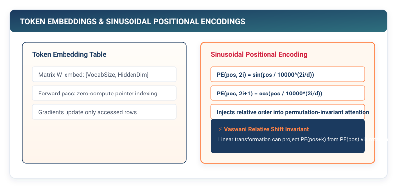

# Embeddings & Position: Projecting Meaning and Temporal Waveforms {#sec-embeddings}

In Chapter 10, we engineered Byte-Pair Encoding, converting raw UTF-8 text into compact sequences of discrete integer token IDs (such as $[1542, 892, 43]$).

Yet an integer ID is merely a discrete categorical index. Mathematically, token $1542$ is no closer to token $1543$ than it is to token $50000$. Furthermore, self-attention operations in modern transformers are fundamentally **permutation-invariant**: swapping the positions of words in a sentence produces the exact same attention score matrix.

In this chapter, we engineer **Continuous Dense Embeddings (`Embedding`)** and **Sinusoidal Positional Waveforms (`PositionalEncoding`)**. We explore why embedding lookup tables are zero-compute DRAM gather operations, and how Vaswani et al.'s geometric sinusoidal frequencies inject temporal and sequential order into neural networks.

{#fig-embeddings-pipeline}

---

## 11.1 The Crisis: The Geometry of Meaning and Temporal Blindness

When handling categorical variables in computer science, the simplest representation is a **one-hot vector** $\mathbf{e}_i \in \{0, 1\}^V$.

If our vocabulary contains $V = 50,257$ tokens, representing a single word requires a 50,257-dimensional sparse vector with a single $1$ at index $i$ and zeros everywhere else:

$$\mathbf{e}_{\text{king}} = [0, 0, \dots, 1, \dots, 0]^T, \qquad \mathbf{e}_{\text{queen}} = [0, 1, \dots, 0, \dots, 0]^T$$

```
The Fatal Geometry of One-Hot Vectors:
1. Orthogonality: The dot product between ANY two distinct words is exactly ZERO:
   ⟨e_king, e_queen⟩ = 0.0
   The model has zero prior knowledge that "king" and "queen" share semantic meaning! ❌
2. Memory Waste: A batch of 1,024 tokens would require 50 million floating-point numbers,
   99.998% of which are redundant zeros. ❌
```

Furthermore, consider two sentences with opposite semantic meanings:
- *"The dog bit the man."*
- *"The man bit the dog."*

If a neural network computes bag-of-words or unmasked set attention over embeddings without positional context, both sentences produce identical internal activations. The network is completely **blind to word order and temporal direction**.

To build language intelligence, our framework must solve both challenges:
1. Project discrete token IDs into a dense, continuous latent space $\mathbb{R}^D$ where geometric vector distance ($\|\mathbf{w}_1 - \mathbf{w}_2\|$) reflects semantic similarity.
2. Superimpose a unique, non-repeating geometric frequency waveform onto each token vector that encodes its exact absolute and relative position in time.

---

## 11.2 The Mental Model: Lookup Gather Tables and Fourier Waveforms

### The Dense Embedding Table: Zero-Compute DRAM Gathering

Mathematically, multiplying a one-hot vector $\mathbf{e}_i \in \mathbb{R}^V$ by an embedding weight matrix $W_{\text{emb}} \in \mathbb{R}^{V \times D}$ extracts the $i$-th row of $W_{\text{emb}}$:

$$\mathbf{x}_i = \mathbf{e}_i^T W_{\text{emb}} = W_{\text{emb}}[i, :]$$

In hardware systems engineering, performing a matrix multiplication by a one-hot vector is completely wasteful. Instead, an `Embedding` layer is implemented as a **direct memory pointer gather**:

```
DRAM Pointer Gathering (Zero FLOPs):
Input Token ID: i = 42
Embedding Table Pointer: 0x7FFF0000 (Stride = D * 4 bytes)
Target Row Address: 0x7FFF0000 + (42 * D * sizeof(float32))
Directly stream D float values into GPU registers without performing a single multiply!
```

### Sinusoidal Positional Encoding: Geometric Frequency Scales

To encode position without consuming extra learnable parameters, Vaswani et al. (2017) introduced **Sinusoidal Positional Encodings**. For each position $\text{pos} \in \{0, 1, \dots, S-1\}$ and embedding dimension $i \in \{0, 1, \dots, D-1\}$:

$$PE_{(\text{pos}, 2i)} = \sin\left( \frac{\text{pos}}{10000^{2i / D}} \right)$$

$$PE_{(\text{pos}, 2i+1)} = \cos\left( \frac{\text{pos}}{10000^{2i / D}} \right)$$

```
Positional Encoding Frequencies Across Dimensions:
Dim 0, 1 (High Frequency):    ∿∿∿∿∿∿∿∿∿∿∿∿  (Oscillates rapidly: local word spacing)
Dim D/2 (Medium Frequency):  ∿  ∿  ∿  ∿    (Oscillates moderately: phrase structure)
Dim D-1 (Low Frequency):     ∿             (Oscillates slowly: paragraph context)
```

Why does this formula work?
1. **Bounded Energy**: Because $\sin$ and $\cos$ are bounded within $[-1, +1]$, adding positional encodings cannot cause activation magnitudes to explode.
2. **Linear Offset Translation**: For any fixed offset $k$, there exists a linear transformation matrix $M_k$ such that $PE_{\text{pos}+k} = M_k \cdot PE_{\text{pos}}$. The self-attention mechanism can easily learn to attend to relative distances ($j - i$) by computing linear dot products between queries and keys.

---

## 11.3 The Pure TinyTorch Construction

We implement the `Embedding` layer and `PositionalEncoding` engine in pure TinyTorch:

```python
import numpy as np
from typing import List, Optional
from .tensor import Tensor
from .layers import Layer

class Embedding(Layer):
    """Dense Embedding Lookup Table Layer."""
    def __init__(self, num_embeddings: int, embedding_dim: int):
        super().__init__()
        self.num_embeddings = num_embeddings
        self.embedding_dim = embedding_dim

        # Standard normal initialization scaled by unit variance
        weight_data = np.random.randn(num_embeddings, embedding_dim).astype(np.float32)
        self.weight = Tensor(weight_data, requires_grad=True)

    def parameters(self) -> List[Tensor]:
        return [self.weight]

    def forward(self, x: Tensor) -> Tensor:
        """Extract embedding vectors for input integer token indices.

        Args:
            x: Tensor of integer token IDs with shape [batch_size, seq_len]
        Returns:
            Tensor of continuous embeddings with shape [batch_size, seq_len, embedding_dim]
        """
        indices = x.data.astype(np.int64)

        # Zero-compute DRAM row extraction via NumPy indexing
        out_data = self.weight.data[indices]

        out_tensor = Tensor(out_data)
        out_tensor._op = "Embedding"
        out_tensor._parents = [self.weight]
        return out_tensor
```

### Implementing Geometric Sinusoidal Positional Encodings

```python
def create_sinusoidal_embeddings(max_seq_len: int, embed_dim: int) -> Tensor:
    """Precompute static Vaswani sinusoidal positional encodings table."""
    pe = np.zeros((max_seq_len, embed_dim), dtype=np.float32)
    position = np.arange(0, max_seq_len, dtype=np.float32)[:, np.newaxis]

    # Division term: 10000^(2i / embed_dim)
    div_term = np.exp(np.arange(0, embed_dim, 2, dtype=np.float32) * -(np.log(10000.0) / embed_dim))

    # Apply sin to even dimensions; cos to odd dimensions
    pe[:, 0::2] = np.sin(position * div_term)
    pe[:, 1::2] = np.cos(position * div_term)

    return Tensor(pe, requires_grad=False)

class PositionalEncoding(Layer):
    """Injects temporal positional waveforms into token embedding vectors."""
    def __init__(self, max_seq_len: int, embed_dim: int, dropout: float = 0.0):
        super().__init__()
        self.pe = create_sinusoidal_embeddings(max_seq_len, embed_dim)
        self.dropout = dropout

    def parameters(self) -> List[Tensor]:
        return []  # Sinusoidal encodings have zero learnable parameters

    def forward(self, x: Tensor) -> Tensor:
        """Superimpose positional frequencies onto input embeddings.

        Args:
            x: Input embeddings of shape [batch_size, seq_len, embed_dim]
        Returns:
            Position-encoded embeddings of shape [batch_size, seq_len, embed_dim]
        """
        seq_len = x.data.shape[1]

        # Slice static positional table to match current sequence length
        pos_slice = self.pe.data[:seq_len, :]  # Shape: [seq_len, embed_dim]

        # Additive broadcasting across batch dimension
        out_data = x.data + pos_slice

        out_tensor = Tensor(out_data)
        out_tensor._op = "PositionalEncoding"
        out_tensor._parents = [x]
        return out_tensor
```

---

## 11.4 The Production Bridge: PyTorch `nn.Embedding` and Rotary Positional Encodings (RoPE)

In modern production language models (such as LLaMA 3 and Mistral), sinusoidal additions have been evolved into **Rotary Positional Encodings (RoPE)**:

```
Modern Positional Encoding Evolution:

1. Vaswani Sinusoidal (2017):
   • x_pos = x_token + PE(pos)  (Additive in DRAM).

2. Learned Positional Embeddings (GPT-2, 2019):
   • W_pos ∈ R^{MaxSeqLen x D} (Learnable parameter table).

3. Rotary Position Embeddings (RoPE - LLaMA, 2023):
   • Multiplies Query and Key vectors by a 2D rotation matrix:
     R_Θ(pos) · Q = [ cos(mθ)  -sin(mθ) ] [ q_1 ]
                    [ sin(mθ)   cos(mθ) ] [ q_2 ]
   • Natural relative distance decay: ⟨R_Θ(m)q, R_Θ(n)k⟩ depends strictly on (m - n)!
```

In production GPU runtimes, `nn.Embedding` backward passes use **Sparse Gradient Accumulation**: instead of computing gradients for all 50,000 rows in the embedding table, CUDA kernels update only the specific rows accessed in the current batch via atomic memory adds (`atomicAdd`).

---

## 11.5 Building the System: How It All Connects

Let us examine the complete token processing pipeline now active in TinyTorch:

```
Raw Input Text: "The xv6 of Machine Learning"
   │
   ▼
[ BPETokenizer (Chapter 10) ] ──► Token IDs: [ 464, 1892, 22, 318, 5928, 4821 ]
   │
   ▼
[ Embedding(V=50257, D=768) ] ──► Continuous Semantic Vectors: [ 1, 6, 768 ]
   │
   ▼
[ PositionalEncoding(D=768) ] ──► Superimposes Fourier Waveforms: [ 1, 6, 768 ]
   │
   ▼ (Next: Chapter 12)
[ Scaled Dot-Product Attention ] ──► Tokens dynamically communicate with all other tokens
```

We now have dense, continuous token representations that carry both semantic meaning and exact temporal coordinates.

Yet our tokens cannot yet communicate with one another. How does a pronoun like *"it"* look back in a sentence to determine whether it refers to *"the machine"* or *"the code"*?

In **Chapter 12**, we construct the crown jewel of deep learning: **Scaled Dot-Product Multi-Head Attention**.
