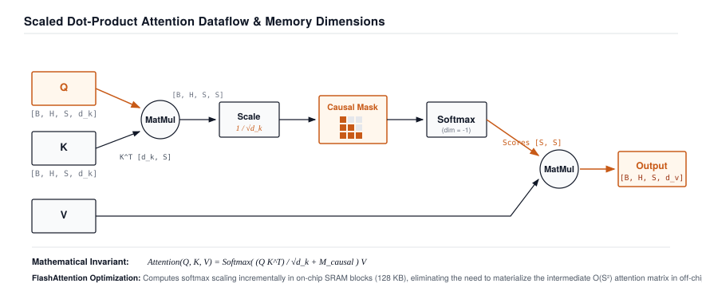

# Attention Mechanisms: Scaled Dot-Product & Causal Masking {#sec-attention}

In Chapters 10 and 11, we converted raw human text into continuous semantic vectors infused with temporal positional waveforms. Yet our tokens currently travel through the framework in complete isolation: no token can inspect, communicate with, or gather context from any other token in the sequence.

In this chapter, we engineer the core mathematical engine of the modern AI revolution: **Scaled Dot-Product Multi-Head Attention (`MultiHeadAttention`)**. We explore why recurrence (RNNs) failed the test of systems scalability, why raw dot-product variances explode without the $1/\sqrt{d_k}$ scaling factor, and how **Causal Lower-Triangular Masking** enforces the arrow of time during autoregressive language generation.

{#fig-attention-engine}

---

## 12.1 The Crisis: The Recurrence Bottleneck and the Softmax Gradient Cliff

Before the transformer architecture was discovered, sequential language was processed using **Recurrent Neural Networks (RNNs)** and LSTMs.

An RNN maintains a hidden state vector $\mathbf{h}_t$, updating it one step at a time:

$$\mathbf{h}_t = \tanh(W_{hh} \mathbf{h}_{t-1} + W_{xh} \mathbf{x}_t)$$

```
The Fatal Recurrence Bottleneck in GPU Hardware:

Time Step 1        Time Step 2        Time Step 3        Time Step S
  [ x_1 ]            [ x_2 ]            [ x_3 ]            [ x_S ]
     │                  │                  │                  │
     ▼                  ▼                  ▼                  ▼
  [ h_1 ] ─────────► [ h_2 ] ─────────► [ h_3 ] ─────────► [ h_S ]
  (Executed 1st)     (Executed 2nd)     (Executed 3rd)     (Executed S-th)

To compute h_S, the GPU MUST wait for S sequential serial steps!
GPU parallel tensor cores sit 95% idle waiting on serial dependency chains! ❌
```

Recurrence is fundamentally incompatible with massively parallel GPU accelerators: to compute step $t$, the hardware *must* wait for step $t-1$. We cannot parallelize over time.

### The Variance Explosion of Raw Dot Products

When researchers replaced recurrence with all-to-all dot products ($A = Q K^T$), they encountered a second crisis: **vanishing gradients in softmax space**.

Consider two random vectors $\mathbf{q}, \mathbf{k} \in \mathbb{R}^{d_k}$ with components independently sampled with zero mean and unit variance ($q_i, k_i \sim \mathcal{N}(0, 1)$). The dot product is:

$$z = \mathbf{q}^T \mathbf{k} = \sum_{i=1}^{d_k} q_i k_i$$

The mean and variance of $z$ are:

$$\mathbb{E}[z] = \sum_{i=1}^{d_k} \mathbb{E}[q_i] \mathbb{E}[k_i] = 0$$

$$\text{Var}(z) = \sum_{i=1}^{d_k} \text{Var}(q_i k_i) = \sum_{i=1}^{d_k} \text{Var}(q_i) \text{Var}(k_i) = \sum_{i=1}^{d_k} (1)(1) = d_k$$

```
The Softmax Gradient Cliff (For d_k = 64):
• Standard Deviation of dot products: σ = √64 = 8.0.
• Dot product scores range from -24.0 to +24.0.
• When inputs to Softmax exceed |z| > 10, Softmax saturates:
  Softmax([24.0, -8.0, 0.0]) ──► [1.0, 0.0, 0.0]
• Derivative of Softmax: ∂S_i / ∂z_j = S_i (δ_ij - S_j).
• For saturated probabilities (S_i ≈ 1 or S_i ≈ 0), GRADIENTS BECOME ZERO! ❌
```

Without scaling, the largest dot product dominates completely, saturating the softmax function and causing **all backpropagation gradients to vanish to zero**.

---

## 12.2 The Mental Model: Database Retrieval and Causal Masking

To understand Scaled Dot-Product Attention, we use the analogy of a **differentiable database query**:

```
The Query-Key-Value Database Analogy:
1. Queries (Q): What each token is currently searching for ("I am a pronoun looking for my subject").
2. Keys (K)   : What each token advertises about itself ("I am a singular noun in the subject position").
3. Values (V) : The actual semantic content retrieved when a Query matches a Key.
```

The mathematical formula for Scaled Dot-Product Attention is:

$$\text{Attention}(Q, K, V) = \text{Softmax}\left( \frac{Q K^T}{\sqrt{d_k}} + M \right) V$$

### Why $1/\sqrt{d_k}$ Restores Unit Variance

By dividing the dot product by $\sqrt{d_k}$, the variance of the scaled attention scores becomes:

$$\text{Var}\left( \frac{\mathbf{q}^T \mathbf{k}}{\sqrt{d_k}} \right) = \frac{1}{d_k} \text{Var}(\mathbf{q}^T \mathbf{k}) = \frac{d_k}{d_k} = 1.0$$

The inputs to Softmax remain nicely bounded within $[-2, +2]$ regardless of whether head dimension $d_k$ is $64$, $128$, or $512$. Softmax gradients remain healthy and non-vanishing throughout deep training.

### Causal Masking: Enforcing the Arrow of Time

In autoregressive language generation, token $t$ is allowed to look at past tokens $1, 2, \dots, t$, but is strictly forbidden from "looking into the future" at tokens $t+1, t+2, \dots, S$.

We enforce this constraint by adding a **Causal Lower-Triangular Mask Matrix** $M \in \mathbb{R}^{S \times S}$:

$$M_{i, j} = \begin{cases} 0 & \text{if } j \le i \quad \text{(Past and Present: Allowed)} \\ -\infty & \text{if } j > i \quad \text{(Future: Forbidden)} \end{cases}$$

```
Causal Mask Matrix M (4x4 Sequence):
              Token 0   Token 1   Token 2   Token 3
Token 0 (Now) ┌   0       -inf      -inf      -inf   ┐
Token 1 (Now) │   0         0       -inf      -inf   │
Token 2 (Now) │   0         0         0       -inf   │
Token 3 (Now) └   0         0         0         0    ┘

After Softmax: exp(-inf) = 0.0! Future positions receive EXACTLY ZERO attention weight.
```

---

## 12.3 The Pure TinyTorch Construction

We implement Scaled Dot-Product Attention and Multi-Head Attention in TinyTorch:

```python
import numpy as np
from typing import List, Tuple, Optional
from .tensor import Tensor
from .layers import Layer, Linear
from .losses import LogSumExpStabilizer

def scaled_dot_product_attention(Q: Tensor, K: Tensor, V: Tensor,
                                 mask: Optional[Tensor] = None) -> Tuple[Tensor, Tensor]:
    """Compute Scaled Dot-Product Attention: Softmax(QK^T / sqrt(d_k) + Mask) V.

    Args:
        Q: Queries of shape [batch, heads, seq_len, d_k]
        K: Keys of shape [batch, heads, seq_len, d_k]
        V: Values of shape [batch, heads, seq_len, d_k]
        mask: Optional additive causal mask of shape [seq_len, seq_len]
    Returns:
        Tuple of (Context Output, Attention Weights)
    """
    d_k = Q.data.shape[-1]
    scale = 1.0 / np.sqrt(d_k)

    # 1. Compute raw affinity scores: Q @ K^T -> [batch, heads, seq_len, seq_len]
    scores_data = np.matmul(Q.data, np.swapaxes(K.data, -1, -2)) * scale

    # 2. Apply causal mask if provided
    if mask is not None:
        scores_data = scores_data + mask.data

    # 3. Numerically stable softmax across the last dimension
    max_scores = np.max(scores_data, axis=-1, keepdims=True)
    exp_scores = np.exp(scores_data - max_scores)
    attn_weights_data = exp_scores / np.sum(exp_scores, axis=-1, keepdims=True)

    # 4. Multiply attention weights by Values: Attn @ V -> [batch, heads, seq_len, d_k]
    out_data = np.matmul(attn_weights_data, V.data)

    out_tensor = Tensor(out_data)
    attn_weights = Tensor(attn_weights_data)
    out_tensor._op = "ScaledDotProductAttention"
    out_tensor._parents = [Q, K, V]
    return out_tensor, attn_weights

class MultiHeadAttention(Layer):
    """Multi-Head Attention Layer with Parallel Projections."""
    def __init__(self, embed_dim: int, num_heads: int):
        super().__init__()
        if embed_dim % num_heads != 0:
            raise ValueError(f"embed_dim ({embed_dim}) must be divisible by num_heads ({num_heads})")

        self.embed_dim = embed_dim
        self.num_heads = num_heads
        self.d_k = embed_dim // num_heads

        # Linear projections for Q, K, V and Output
        self.q_proj = Linear(embed_dim, embed_dim)
        self.k_proj = Linear(embed_dim, embed_dim)
        self.v_proj = Linear(embed_dim, embed_dim)
        self.out_proj = Linear(embed_dim, embed_dim)

    def parameters(self) -> List[Tensor]:
        return (self.q_proj.parameters() + self.k_proj.parameters() +
                self.v_proj.parameters() + self.out_proj.parameters())

    def forward(self, x: Tensor, mask: Optional[Tensor] = None) -> Tensor:
        """Forward multi-head attention over input sequence.

        Args:
            x: Input embeddings of shape [batch_size, seq_len, embed_dim]
            mask: Optional causal mask
        Returns:
            Output activations of shape [batch_size, seq_len, embed_dim]
        """
        B, S, D = x.data.shape
        H = self.num_heads
        d_k = self.d_k

        # 1. Project inputs to Q, K, V
        Q = self.q_proj.forward(x)  # [B, S, D]
        K = self.k_proj.forward(x)  # [B, S, D]
        V = self.v_proj.forward(x)  # [B, S, D]

        # 2. Reshape and transpose for multi-head parallel attention: [B, H, S, d_k]
        Q_heads = Tensor(Q.data.reshape(B, S, H, d_k).swapaxes(1, 2))
        K_heads = Tensor(K.data.reshape(B, S, H, d_k).swapaxes(1, 2))
        V_heads = Tensor(V.data.reshape(B, S, H, d_k).swapaxes(1, 2))

        # 3. Scaled dot-product attention across all heads simultaneously
        attn_out, _ = scaled_dot_product_attention(Q_heads, K_heads, V_heads, mask)

        # 4. Concatenate heads back into [B, S, D]
        out_concat_data = attn_out.data.swapaxes(1, 2).reshape(B, S, D)
        out_concat = Tensor(out_concat_data)

        # 5. Final output projection
        return self.out_proj.forward(out_concat)
```

---

## 12.4 The Production Bridge: FlashAttention-2 and SRAM Tiling

In standard PyTorch, materializing the attention score matrix $S = Q K^T$ requires allocating $O(S^2)$ bytes in GPU HBM (DRAM):

```
Standard Attention Memory Traffic (DRAM Roundtrips):
1. Load Q, K from DRAM ──► Compute S = Q K^T ──► Write S to DRAM  (O(S^2) Memory Traffic)
2. Load S from DRAM    ──► Compute Softmax   ──► Write P to DRAM  (O(S^2) Memory Traffic)
3. Load P, V from DRAM ──► Compute O = P V   ──► Write O to DRAM  (O(S^2) Memory Traffic)
```

For long sequences ($S = 8,192$), DRAM bandwidth stalls consume $80\%$ of execution time.

In 2022, Tri Dao introduced **FlashAttention-2**:

```
FlashAttention-2 SRAM Tiling Engine:
┌─────────────────────────────────────────────────────────────────────────────┐
│ 1. Block Tiling: Divide Q, K, V into SRAM-sized blocks (e.g. 128x128).     │
│ 2. Online Softmax: Compute incremental softmax statistics (m_i, l_i)       │
│    without ever writing the full S matrix back to DRAM.                     │
│ 3. Zero DRAM S Matrix: Eliminates O(S^2) memory footprint entirely!         │
│ 4. Result: 3x to 5x faster attention with O(S) memory footprint.            │
└─────────────────────────────────────────────────────────────────────────────┘
```

PyTorch natively exposes this via `torch.nn.functional.scaled_dot_product_attention`.

---

## 12.5 Building the System: How It All Connects

Let us observe the complete attention transformation pipeline:

```
Positional Embeddings X: [Batch, Seq_Len, Embed_Dim]
   │
   ├────────────────────────┬────────────────────────┐
   ▼                        ▼                        ▼
[ Q Projection ]         [ K Projection ]         [ V Projection ]
   │                        │                        │
   └────────────────────────┼────────────────────────┘
                            ▼
      [ Scaled Dot-Product Attention + Causal Mask ]
                            │
                            ▼
              [ Multi-Head Output Projection ]
                            │
                            ▼ (Next: Chapter 13)
        [ Complete GPT-2 Transformer Architecture ]
```

We now have multi-head scaled attention that routes context across tokens with causal discipline.

However, stacking ten layers of raw attention directly on top of each other causes activations to explode and gradients to vanish. How do we stabilize deep transformer stacks and provide non-linear feature transformations?

In **Chapter 13**, we construct **The Transformer: Assembling GPT-2 with Pre-LN Residual Highways**.
