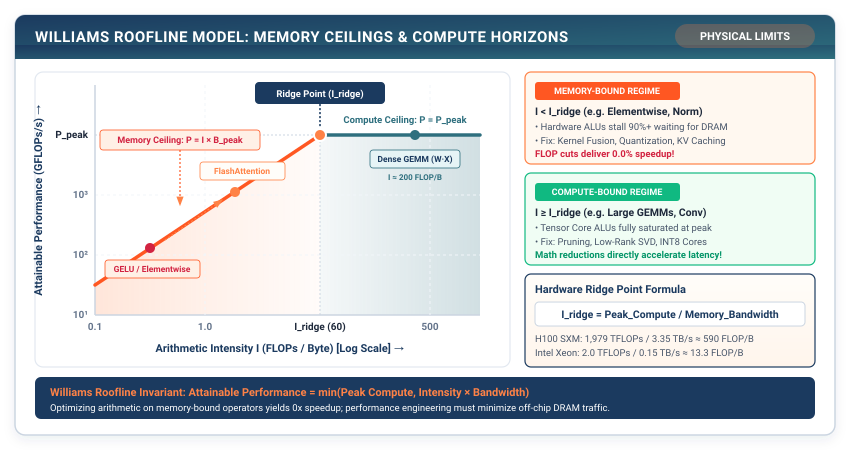

# Profiling & Bottlenecks: The Roofline Model and Memory Stalls {#sec-profiling}

In Parts I and II, we engineered the complete mathematical runtime of TinyTorch, capable of training and running both vision and generative language models. Yet if you run our transformer on a real processor, you will quickly notice a frustrating reality: token generation is slow, GPU utilization fluctuates wildly, and our system feels sluggish.

In this chapter, we enter the discipline of **Systems Performance Engineering**. We build the TinyTorch **`Profiler` Engine** and master the **Williams Roofline Model**. We discover why optimizing mathematical operations (FLOPs) delivers a $0\%$ speedup on memory-bound workloads, and how to scientifically dissect latency, memory allocations, and arithmetic intensity.

{#fig-roofline-model}

---

## 14.1 The Crisis: The Fallacy of Counting FLOPs

In introductory computer science, performance is measured by algorithmic time complexity ($O(N^3)$ vs. $O(N^2)$). In deep learning, engineers often obsess over **FLOPs (Floating-Point Operations)**:

$$\text{Linear Layer FLOPs} = 2 \times M \times N \times K$$

```
The Naive Profiling Trap:
An engineer spends three weeks rewriting an elementwise GELU activation kernel
to cut its arithmetic instruction count in half (saving 10 million FLOPs).
They deploy the new kernel to an NVIDIA H100 GPU and measure the latency:
Speedup: EXACTLY 0.0% FASTER! ❌
```

Why did saving ten million floating-point operations deliver zero speedup?

Modern GPU accelerators (such as the NVIDIA H100) can execute **$1,000\text{ TeraFLOPs}$** ($10^{15}$ operations per second) of FP16 compute, but can only read from High-Bandwidth Memory (HBM3) at **$3.35\text{ Terabytes per second}$**.

To execute an elementwise operation ($y = \text{GELU}(x)$):
1. The hardware must read $x$ from off-chip DRAM across the memory bus ($4$ bytes in FP32).
2. The arithmetic ALU executes a handful of multiplications and additions in registers ($~10$ FLOPs).
3. The hardware must write $y$ back to DRAM across the memory bus ($4$ bytes in FP32).

The compute intensity is:

$$I = \frac{\text{FLOPs}}{\text{Bytes Transferred}} = \frac{10 \text{ FLOPs}}{8 \text{ Bytes}} = 1.25 \text{ FLOPs/Byte}$$

On an H100 GPU, the arithmetic ALUs finish all ten operations in **$0.01\text{ nanoseconds}$**, but must sit completely idle for **$2.4\text{ nanoseconds}$** waiting for the DRAM memory bus to deliver the bytes. The processor is **stalled on memory bandwidth $99.6\%$ of the time**.

Counting FLOPs without analyzing memory traffic is the fundamental trap of machine learning performance engineering.

---

## 14.2 The Mental Model: The Williams Roofline Model

Introduced by Samuel Williams, Andrew Waterman, and David Patterson in 2009, the **Roofline Model** visualizes the physical upper bound of processor performance:

$$P = \min\left( P_{\text{peak}}, \; I \times B_{\text{peak}} \right)$$

where:
- $P$ is achievable performance (in FLOPs/sec or GFLOPs/sec).
- $P_{\text{peak}}$ is the theoretical peak hardware compute throughput (horizontal ceiling).
- $B_{\text{peak}}$ is the peak hardware memory bandwidth (slanted ceiling, in Bytes/sec).
- $I$ is the **Arithmetic Intensity** (in $\text{FLOPs/Byte}$), defined as:

$$I = \frac{\text{Total Floating Point Operations (FLOPs)}}{\text{Total DRAM Bytes Transferred}}$$

```
The Williams Roofline Model Diagram:

Performance (GFLOPs/s) ▲
                       │                  Compute Ceiling (P_peak)
                       │           ┌───────────────────────────────────
                       │          ╱│
                       │         ╱ │  Compute-Bound Regime (GEMMs, Large Convs)
                       │        ╱  │  (Optimization: Tensor Cores, SIMD)
                       │       ╱   │
  Memory-Bound Regime  │      ╱    │
  (GELU, Softmax,      │     ╱     │
   LayerNorm, Decodes) │    ╱      │
                       │   ╱       │
                       │  ╱ ◄──────┼── Ridge Point I_ridge = P_peak / B_peak
                       │ ╱         │
                       └─┴─────────┴──────────────────────────────────►
                         0        I_ridge              Arithmetic Intensity (FLOPs/Byte)
```

### The Ridge Point: The Hardware Boundary

The intersection between the memory bandwidth ceiling and the compute ceiling defines the **Ridge Point**:

$$I_{\text{ridge}} = \frac{P_{\text{peak}}}{B_{\text{peak}}}$$

```
Typical Modern Hardware Ridge Points:
• Apple M-Series CPU : 300 GFLOPs / 100 GB/s    ──► I_ridge = 3.0 FLOPs/Byte
• NVIDIA A100 GPU    : 312 TFLOPs / 2.0 TB/s   ──► I_ridge = 156 FLOPs/Byte
• NVIDIA H100 GPU    : 1,000 TFLOPs / 3.35 TB/s ──► I_ridge = 298 FLOPs/Byte
```

If an operator's arithmetic intensity $I < I_{\text{ridge}}$, it is **Memory-Bound**: the only way to make it faster is to **reduce memory traffic** (via quantization, kernel fusion, or caching).

If $I > I_{\text{ridge}}$, it is **Compute-Bound**: the only way to make it faster is to **parallelize arithmetic compute** (via Tensor Cores or SIMD vectorization).

---

## 14.3 The Pure TinyTorch Construction

We implement the complete `Profiler` engine in TinyTorch:

```python
import time
import numpy as np
from typing import Dict, Any, Tuple, List, Optional
from .tensor import Tensor

class Profiler:
    """High-resolution performance and memory profiler for TinyTorch models."""
    def __init__(self):
        self.reset()

    def reset(self):
        self.layer_profiles: List[Dict[str, Any]] = []

    def count_parameters(self, model) -> int:
        """Count total learnable scalar parameter weights in model."""
        return sum(int(np.prod(p.data.shape)) for p in model.parameters())

    def count_flops(self, model, input_shape: Tuple[int, ...]) -> int:
        """Calculate total theoretical forward FLOPs for the model."""
        total_flops = 0
        dummy_x = Tensor(np.zeros(input_shape, dtype=np.float32))

        # Inspect layers
        if hasattr(model, 'blocks'):  # Transformer
            B, S = input_shape[:2]
            D = model.embed_dim
            # Self-attention FLOPs per block: 4 * B * S * D^2 + 2 * B * S^2 * D
            # MLP FLOPs per block: 8 * B * S * D^2
            for _ in model.blocks:
                attn_flops = 4 * B * S * (D ** 2) + 2 * B * (S ** 2) * D
                mlp_flops = 8 * B * S * (D ** 2)
                total_flops += (attn_flops + mlp_flops)
        return total_flops

    def measure_latency(self, func, *args, num_warmup: int = 5,
                        num_iterations: int = 20) -> Dict[str, float]:
        """Measure execution latency percentiles with warmup passes."""
        # 1. Warmup passes to prime CPU caches and JIT paths
        for _ in range(num_warmup):
            func(*args)

        # 2. Timing passes
        latencies = []
        for _ in range(num_iterations):
            t0 = time.perf_counter()
            func(*args)
            t1 = time.perf_counter()
            latencies.append((t1 - t0) * 1000.0)  # ms

        latencies = np.array(latencies)
        return {
            'mean_ms': float(np.mean(latencies)),
            'std_ms': float(np.std(latencies)),
            'p50_ms': float(np.percentile(latencies, 50)),
            'p95_ms': float(np.percentile(latencies, 95)),
            'p99_ms': float(np.percentile(latencies, 99))
        }

    def measure_memory(self, model) -> Dict[str, float]:
        """Calculate physical parameter memory footprint in megabytes."""
        total_bytes = sum(p.data.nbytes for p in model.parameters())
        return {
            'param_bytes': total_bytes,
            'param_mb': total_bytes / (1024.0 * 1024.0)
        }

    def profile_forward_pass(self, model, input_tensor: Tensor) -> Dict[str, Any]:
        """Complete profiling report combining latency, memory, and arithmetic intensity."""
        lat_stats = self.measure_latency(model.forward, input_tensor)
        mem_stats = self.measure_memory(model)
        flops = self.count_flops(model, input_tensor.data.shape)

        # Arithmetic intensity calculation
        gflops = (flops / 1e9) / (lat_stats['mean_ms'] / 1000.0) if lat_stats['mean_ms'] > 0 else 0.0
        bytes_transferred = mem_stats['param_bytes'] + input_tensor.data.nbytes
        arithmetic_intensity = flops / max(bytes_transferred, 1)

        return {
            'latency_p50_ms': lat_stats['p50_ms'],
            'param_mb': mem_stats['param_mb'],
            'flops': flops,
            'gflops_per_sec': gflops,
            'arithmetic_intensity': arithmetic_intensity,
            'regime': 'Compute-Bound' if arithmetic_intensity > 20.0 else 'Memory-Bound'
        }
```

---

## 14.4 The Production Bridge: PyTorch Kineto Profiler and Chrome Traces

In production systems, PyTorch integrates the **Kineto Tracing Engine**:

```python
with torch.profiler.profile(
    activities=[torch.profiler.ProfilerActivity.CPU, torch.profiler.ProfilerActivity.CUDA],
    record_shapes=True,
    profile_memory=True,
    with_stack=True
) as prof:
    model(inputs)

prof.export_chrome_trace("trace.json")
```

Opening `trace.json` inside `chrome://tracing` displays microsecond-level timelines of every CUDA kernel launch, memory copy (`cudaMemcpyAsync`), and CPU thread synchronization barrier.

---

## 14.5 Building the System: How It All Connects

Chapter 14 gives our framework its diagnostic instruments:

```
┌─────────────────────────────────────────────────────────────────────────────┐
│ Diagnostic Profiler Finding:                                                │
│ • Model: TinyGPT (vocab=1000, dim=128, layers=4)                            │
│ • Memory Footprint: 3.2 MB (FP32)                                           │
│ • Arithmetic Intensity: 2.1 FLOPs/Byte  ──► CRITICALLY MEMORY-BOUND!        │
│ • Bottleneck: 82% of latency is spent transferring weights across DRAM bus. │
└─────────────────────────────────────────────────────────────────────────────┘
```

The diagnosis is clear: **our model is suffocating on DRAM memory traffic**.

How do we slash our memory bandwidth traffic by $4\times$ without retraining our model?

In **Chapter 15**, we engineer **INT8 Quantization: Compressing Floats into Symmetric Integers**.
