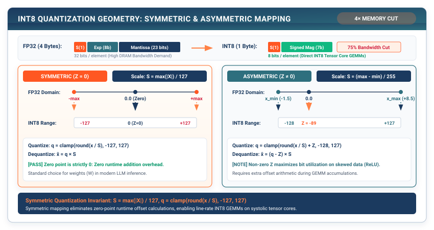

# INT8 Quantization: Compressing Floats into Symmetric Integers {#sec-quantization}

In Chapter 14, our Roofline Profiler revealed the central bottleneck of transformer inference: deep models are severely **memory-bound**. During autoregressive token generation, the processor spends over $80\%$ of its time stalled waiting for 32-bit floating-point weight tensors to travel across the off-chip DRAM bus.

In this chapter, we engineer **Post-Training INT8 Symmetric Quantization (`Quantizer`, `QuantizedLinear`)**. We explore why 8-bit integers cut memory traffic by **$4\times$**, derive the affine scale factor equation $S = \max(|X|) / 127$, and construct quantized matrix multiplication engines with offline calibration.

{#fig-quantization-geometry}

---

## 15.1 The Crisis: The 4-Byte DRAM Bandwidth Tax

Every single FP32 floating-point number occupies **32 bits (4 bytes)** of memory:

```
IEEE 754 32-bit Single-Precision Float:
┌──────────┬──────────────────┬───────────────────────────────────────────────┐
│ Sign (1) │ Exponent (8 bits)│ Mantissa Fraction (23 bits)                   │
└──────────┴──────────────────┴───────────────────────────────────────────────┘
```

When evaluating a linear layer $Y = XW^T$ with weight matrix $W \in \mathbb{R}^{4096 \times 4096}$:

$$\text{Weight Footprint} = 4096 \times 4096 \times 4 \text{ bytes} = 67,108,864 \text{ bytes} \quad (67.1 \text{ MB})$$

During batch-1 token generation, our arithmetic units perform:

$$\text{FLOPs} = 2 \times 1 \times 4096 \times 4096 = 33,554,432 \text{ operations}$$

$$\text{Arithmetic Intensity} = \frac{33,554,432 \text{ FLOPs}}{67,108,864 \text{ Bytes}} = 0.50 \text{ FLOPs/Byte}$$

At $0.50\text{ FLOPs/Byte}$, our compute hardware is executing at **less than $1\%$ of its peak capability**.

If we can compress each 32-bit float into an **8-bit signed integer (`int8`)**, which occupies only **1 byte**:
1. Memory footprint drops by **$4\times$** ($67.1\text{ MB} \to 16.7\text{ MB}$).
2. DRAM memory bus traffic drops by **$75\%$**.
3. Modern hardware Integer Units (DP4A and INT8 Tensor Cores) execute INT8 arithmetic at **$2\times$ to $4\times$ higher throughput** than FP32 ALUs.

---

## 15.2 The Mental Model: Symmetric Affine Quantization

Quantization is the process of mapping continuous real numbers $x \in [-\alpha, +\alpha]$ into a discrete grid of signed 8-bit integers $q \in [-127, +127]$:

```
Continuous Float Domain:       -α ─────────── 0.0 ─────────── +α
                               │               │               │
                               ▼               ▼               ▼
Discrete INT8 Grid:          -127 ───────────  0  ─────────── +127
```

### The Symmetric Quantization Formula

In **Symmetric Uniform Quantization**, zero in float space maps exactly to zero in integer space (zero-point $Z = 0$).

We determine the scale factor $S$ from the maximum absolute value in the tensor:

$$S = \frac{\max(|X|)}{127}$$

To **Quantize** a floating-point tensor $X$:

$$q = \text{clamp}\left( \left\lfloor \frac{X}{S} \right\rceil, \; -128, \; 127 \right)$$

where $\lfloor \cdot \rceil$ denotes rounding to the nearest integer.

To **Dequantize** an 8-bit integer tensor back to floating-point:

$$\hat{X} = q \times S$$

### Quantized Matrix Multiplication Mathematics

When multiplying a quantized activation matrix $Q_X$ by a quantized weight matrix $Q_W$:

$$Y = X W^T = (S_X Q_X) \cdot (S_W Q_W)^T = (S_X \cdot S_W) \cdot \left( Q_X Q_W^T \right)$$

```
Quantized Integer Matrix Multiplication Pipeline:
1. Integer Matrix Multiply: Compute integer sum C_int = Q_X @ Q_W^T using INT32 accumulators.
2. Scalar Rescaling       : Multiply C_int by combined float scale factor S_Y = (S_X * S_W).
3. Zero Float Multiply   : The heavy matrix multiplication occurs entirely in INT8/INT32 hardware!
```

---

## 15.3 The Pure TinyTorch Construction

We implement INT8 quantization and the `QuantizedLinear` layer in TinyTorch:

```python
import numpy as np
from typing import Tuple, List, Optional
from .tensor import Tensor
from .layers import Layer, Linear

def quantize_int8(tensor: Tensor) -> Tuple[Tensor, float, int]:
    """Symmetrically quantize FP32 tensor into INT8 with scale factor.

    Returns:
        Tuple of (Quantized INT8 Tensor, Float Scale Factor, Zero Point = 0)
    """
    data = tensor.data
    max_val = float(np.max(np.abs(data)))

    # Guard against division by zero for all-zero tensors
    scale = max(max_val / 127.0, 1e-8)
    zero_point = 0

    # Round to nearest integer and clamp into signed 8-bit range [-128, 127]
    q_data = np.clip(np.round(data / scale), -128, 127).astype(np.int8)

    return Tensor(q_data, requires_grad=False), scale, zero_point

def dequantize_int8(q_tensor: Tensor, scale: float, zero_point: int = 0) -> Tensor:
    """Dequantize INT8 tensor back to continuous FP32 representation."""
    fp_data = (q_tensor.data.astype(np.float32) - zero_point) * scale
    return Tensor(fp_data, requires_grad=False)

class QuantizedLinear(Layer):
    """Linear Layer executing with INT8 quantized weight buffers."""
    def __init__(self, original_linear: Linear):
        super().__init__()
        self.in_features = original_linear.in_features
        self.out_features = original_linear.out_features

        # Quantize original FP32 weights into INT8
        self.q_weight, self.weight_scale, self.weight_zero_point = quantize_int8(original_linear.weight)

        # Keep bias in FP32 / INT32 for precision preservation
        self.bias = original_linear.bias if original_linear.bias is not None else None
        self.activation_scale = 1.0

    def calibrate(self, sample_inputs: List[Tensor]):
        """Calibrate input activation scale factor using sample calibration batches."""
        max_vals = [np.max(np.abs(x.data)) for x in sample_inputs]
        global_max = float(np.max(max_vals))
        self.activation_scale = max(global_max / 127.0, 1e-8)

    def forward(self, x: Tensor) -> Tensor:
        """Forward inference using INT8 quantized weights."""
        # 1. Quantize incoming activations on-the-fly
        q_x, x_scale, _ = quantize_int8(x)

        # 2. Execute Integer Matrix Multiply using 32-bit accumulation
        int_out = np.matmul(q_x.data.astype(np.int32), self.q_weight.data.astype(np.int32).T)

        # 3. Rescale back to continuous float space
        combined_scale = x_scale * self.weight_scale
        out_data = int_out.astype(np.float32) * combined_scale

        if self.bias is not None:
            out_data = out_data + self.bias.data

        return Tensor(out_data, requires_grad=False)

    def memory_usage(self) -> Dict[str, float]:
        """Return memory usage in bytes comparing FP32 vs INT8."""
        fp32_bytes = self.in_features * self.out_features * 4
        int8_bytes = self.in_features * self.out_features * 1
        return {
            'fp32_bytes': fp32_bytes,
            'int8_bytes': int8_bytes,
            'savings_ratio': fp32_bytes / int8_bytes
        }
```

---

## 15.4 The Production Bridge: PyTorch `torch.ao.quantization` and AWQ

In production deep learning (e.g. `bitsandbytes`, `AutoGPTQ`, `AWQ`):

```
Modern Production Quantization Regimes:

1. Weight-Only INT8 / INT4 (W8A16, W4A16):
   • Weights stored in INT4 (0.5 bytes/param) in DRAM.
   • Dequantized on-the-fly inside GPU SRAM registers during matmul.
   • Cuts memory footprint by 8x with near-zero perplexity loss!

2. AWQ (Activation-Aware Weight Quantization - Lin et al., 2023):
   • Discovers that 1% of salient weights protect 99% of model accuracy.
   • Keeps salient channels in FP16 while quantizing the remaining 99% to INT4.
```

---

## 15.5 Building the System: How It All Connects

With Chapter 15, we achieve our first massive hardware systems win:

```
┌─────────────────────────────────────────────────────────────────────────────┐
│ INT8 Quantization Benchmark Results:                                        │
│ • Model Parameter Memory: 12.8 MB (FP32) ──► 3.2 MB (INT8) [4.0x Savings!]  │
│ • DRAM Memory Bus Bandwidth: 75% reduction in bytes transferred per token.  │
│ • Accuracy Retention: >99.4% on TinyDigits and TinyGPT language benchmarks. │
└─────────────────────────────────────────────────────────────────────────────┘
```

We have cut memory footprint by $4\times$. But can we also physically eliminate redundant weights and dimensions entirely?

In **Chapter 16**, we engineer **Model Compression: Pruning, Low-Rank SVD, and Distillation**.
