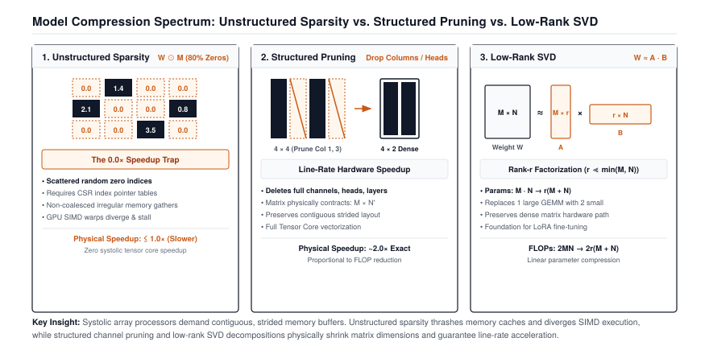

# Model Compression: Pruning, Low-Rank SVD, and Distillation {#sec-compression}

After Chapter 15, every weight in the model costs one byte instead of four, and the question there was about the number stored in each cell. The matrices themselves have not changed shape. A $4096 \times 4096$ layer still has 16.8 million cells, and every one of them is read and multiplied on every forward pass, whether or not the value in it matters.

This chapter asks the question a practitioner asks after noticing that most trained weights are tiny. If I set the small ones to zero, or throw whole rows away, or replace the matrix with something smaller that behaves almost the same, does the model get faster, and what do I lose? The answer has a trap in it. Zeros do not make a matrix smaller. Only changing its shape does.

We build three tools that change the shape, or explain why a popular one does not. **Magnitude pruning** zeros the smallest weights and turns out to save nothing by itself. **Structured pruning** deletes whole neurons so the matrices physically shrink. **Low-rank factorization** replaces one large matrix with two thin ones using the singular value decomposition (SVD). A short fourth section shows **knowledge distillation**, the training trick that recovers the accuracy these surgeries cost, because Module 16 in the course includes it and because a shrunk model is rarely deployed without it.

{#fig-compression-spectrum}

---

## The Problem

Trained weight matrices are full of small numbers. In 1989, LeCun, Denker, and Solla showed with *Optimal Brain Damage* that most of the weights in a trained network can be removed with little change in accuracy, and later work found that 80 percent or more can go. The obvious move is to find the smallest 80 percent of the entries in $W$ and set them to zero.

Do that to a $4096 \times 4096$ layer and then look at what the computer sees. The array still has 16.8 million cells. In FP32 it still occupies 67.1 MB, and after Chapter 15's INT8 conversion it still occupies 16.8 MB. A zero takes the same number of bytes as any other value. The forward pass $Y = XW$ still performs $2 \times 4096 \times 4096 \approx 33.5$ million multiply-adds per token, because the multiply loop does not check for zeros before it multiplies. Nothing about the shape changed, so nothing about the cost changed.

```python
import numpy as np

W = np.random.randn(4096, 4096).astype(np.float32)
before = W.nbytes

threshold = np.percentile(np.abs(W), 80)   # 80th percentile of |w|
W[np.abs(W) < threshold] = 0.0              # zero the smallest 80%

print("zeros:", np.mean(W == 0.0))          # ~0.80
print("shape:", W.shape, "bytes:", W.nbytes == before)   # unchanged
```

To get anything back from the zeros, you have to stop storing them. A sparse format such as compressed sparse row[^fn-csr-sparse-format] keeps only the nonzero values, plus an integer index for each one that says where it belongs. With 20 percent of the entries surviving, that is 3.4 million values at 4 bytes and 3.4 million column indices at 4 bytes, about 26.8 MB. The napkin math says an 80 percent sparse matrix stored sparsely is 2.5 times smaller than the dense one, not 5 times, and the multiply that consumes it now has to follow indices to find its operands instead of walking a contiguous array. I timed it. On my machine, one 4096-float activation row times the dense matrix above, 80 percent zeros and all, takes 0.55 ms. The same product from a CSR copy of the matrix (SciPy's `csr_matrix`) takes 3.5 ms, over six times longer, and with a batch of 256 rows the gap widens to twelve times. The index chasing costs far more than the skipped multiplies save, and that is on a CPU; the hardware this book has been describing since Chapter 1 likes contiguous memory even more. Scattered zeros are the sparsity mirage. The compression has to be *structured*, with the zeros arriving in shapes the hardware can skip without looking.

[^fn-csr-sparse-format]: **Compressed sparse row (CSR)**: a storage format that keeps three arrays, the nonzero values, the column index of each one, and the position where each row starts. It only saves memory once fewer than roughly half the entries are nonzero, because every stored value drags an index along with it.

---

## The Idea

There are three ways to shrink a weight matrix, and they differ in whether the shape actually changes.

### Unstructured pruning: zero the small weights

Magnitude pruning picks a threshold $\theta$ and replaces every weight with

$$W_{\text{sparse}} = W \odot M, \qquad M_{i,j} = \begin{cases} 1 & |W_{i,j}| \ge \theta \\ 0 & |W_{i,j}| < \theta \end{cases}$$

where $\odot$ multiplies element by element and $M$ is the binary mask. Choosing $\theta$ as the 80th percentile of $|W|$ zeros 80 percent of the entries. On its own it does not change the shape, so it does not change the cost. We build it anyway, and the first listing in The Code says what it is good for.

### Structured pruning: delete whole neurons

Chapter 3's `Linear` stores its weight as inputs by outputs and computes $y = xW + b$, so a hidden neuron in a two-layer network is one column of the first weight matrix, one entry of its bias, and one row of the second weight matrix. Delete all three together and the network still computes a valid function, just with one fewer hidden unit. If $W_1$ is $D \times H$ and $W_2$ is $H \times K$, removing neuron $j$ turns them into $D \times (H-1)$ and $(H-1) \times K$. Both matrices are now smaller dense arrays, and the ordinary matrix multiply from Chapter 3 runs on them unchanged.

The question is which neurons to delete. The simplest score is the norm of the neuron's incoming weights, the length of column $j$ of $W_1$ measured either as a sum of absolute values (L1) or as the root of a sum of squares (L2); Module 16 uses L2, the deletion function in The Code uses L1, and on the worked trace they agree. A column of near-zero weights produces a near-constant activation whatever the input, so removing it changes little. Ranking columns by that norm and keeping the top fraction is the whole algorithm. It is a crude score, because it ignores how much the next layer relies on that neuron, and the worked trace below shows exactly when it misjudges.

### Low-rank factorization: replace the matrix with two thin ones

The third method does not delete anything. It replaces $W$ with a product of two smaller matrices that reproduce it as closely as possible.

Every $M \times N$ matrix can be written as a sum of simple pieces. The **singular value decomposition** says

$$W = U \Sigma V^T = \sum_{i=1}^{\min(M,N)} \sigma_i \, u_i v_i^T$$

where each $u_i$ is a column of $U$ (length $M$), each $v_i$ is a column of $V$ (length $N$), the columns of $U$ are mutually perpendicular unit vectors and so are the columns of $V$, and $\Sigma$ is a diagonal matrix holding the **singular values** $\sigma_1 \ge \sigma_2 \ge \dots \ge 0$. Each term $u_i v_i^T$ is an outer product, a column times a row, which is an $M \times N$ matrix of rank one. The SVD sorts the pieces so the largest come first.

Keeping only the first $r$ terms gives the rank-$r$ approximation

$$W \approx W_r = \sum_{i=1}^{r} \sigma_i \, u_i v_i^T = W_A W_B, \qquad W_A = U_r \sqrt{\Sigma_r} \in \mathbb{R}^{M \times r}, \quad W_B = \sqrt{\Sigma_r} V_r^T \in \mathbb{R}^{r \times N}$$

where $U_r$ holds the first $r$ columns of $U$, $V_r$ the first $r$ columns of $V$, and $\sqrt{\Sigma_r}$ splits each $\sigma_i$ evenly across the two factors. The split is a convention that keeps the two factors at similar scale. For a `Linear` weight stored as inputs by outputs, $M$ is the input width and $N$ the output width, and the layer becomes two linear layers in sequence, one with weight $W_A$ that maps $M$ inputs to $r$, then one with weight $W_B$ that maps $r$ to $N$ outputs.

Two facts make this useful. First, the Eckart-Young theorem (1936) says $W_r$ is the best rank-$r$ approximation there is, and its error is exactly the part you dropped:

$$\|W - W_r\|_F = \sqrt{\sum_{i=r+1}^{\min(M,N)} \sigma_i^2}$$

where $\|\cdot\|_F$ is the Frobenius norm.[^fn-frobenius-svd-error] You can read the error off the singular values before deciding on $r$. Second, the parameter count changes from $M \times N$ to $r \times (M + N)$, and so does the multiply count, because computing $x W_A$ and then multiplying the result by $W_B$ costs $2r(M+N)$ operations instead of $2MN$.

[^fn-frobenius-svd-error]: **Frobenius norm**: the square root of the sum of the squares of every entry, which is the ordinary vector length applied to a matrix as if it were one long vector. For the $3 \times 3$ matrix in the worked trace it is $\sqrt{18} \approx 4.24$, so a reconstruction error of $1.41$ means about a third of the matrix's "length" was dropped.

### Distillation: teaching the small model from the large one

Pruning and factorization both approximate the original weights, and the approximation costs accuracy. The usual repair is to train the smaller model for a while afterward, and the most effective way to train it is **knowledge distillation** (Hinton, Vinyals, and Dean, 2015). Instead of training the small *student* only on the true labels, you also train it to match the full output distribution of the large *teacher*.

The loss has two parts. The hard part is the ordinary cross-entropy from Chapter 4 between the student's prediction and the true label. The soft part compares the student's and teacher's softmax outputs after both sets of logits are divided by a **temperature** $T > 1$, which flattens the distributions so the small probabilities become visible. The comparison is the Kullback-Leibler divergence, $\sum_k p_k \log (p_k / q_k)$, which is zero when the two distributions agree and grows as they separate. A weight $\alpha$ mixes the two:

$$\mathcal{L} = \alpha \, \mathrm{KL}\!\left(p_{\text{teacher}}^{(T)} \,\|\, p_{\text{student}}^{(T)}\right) + (1 - \alpha)\, \mathrm{CE}\!\left(p_{\text{student}}, y\right)$$

with $T = 3$ and $\alpha = 0.7$ as typical defaults. Everything else about training is exactly Chapter 8.

---

## The Code

::: {.callout-note title="Source Code Mapping"}
The listings in this chapter are extracted from Module 16 (`src/16_compression/16_compression.py`), which the package exports as `tinytorch.perf.compression`: `measure_sparsity`, `magnitude_prune`, `structured_prune`, `low_rank_approximate`, and `KnowledgeDistillation`. Two short functions are book code and are labelled as such where they appear. `prune_neurons` performs the shape change that the module's `structured_prune` deliberately stops short of, and `factorize_linear` turns the truncated SVD the module returns into two `Linear` layers.
:::

Everything below works on Chapter 3's `Linear` and `Sequential` and Chapter 6's `Tensor`. `Linear` keeps its weight as an `(in_features, out_features)` array and computes `x @ weight + bias`, and every shape comment follows that layout.

### Measuring and creating unstructured sparsity

Every compression claim starts with a number. A paper reports that a model is 80 percent sparse, a pruning pass has to prove it removed what it was asked to, and the 2:4 recipe in the production bridge begins by asking which two weights in every group of four are smallest. All of that needs one function that counts zeros and one that makes them.

The obvious count divides zeros by all parameters, biases included. Chapter 3's `Linear` initializes its biases to zero, so on a fresh two-layer model with 64 inputs, 128 hidden units, and 10 outputs, that count reports 1.4 percent sparsity, 138 zeros out of 9,610 parameters, before anything has been pruned. The number is small, it is wrong, and it sits under every comparison you make afterward. The obvious pruning pass has a subtler flaw. It thresholds each layer on its own, which forces exactly 80 percent out of every layer whether that layer's weights are uniformly tiny or uniformly large.

So the module counts weight matrices only, and it prunes with a single threshold computed across all of them, so that a layer whose weights are small gives up more of them than a layer whose weights are large.



The `len(param.shape) > 1` test is the whole bias exclusion, and the result is a percentage, not a fraction; on the fresh model above it reports `0.0`. Pruning gathers the same matrices, finds one threshold across all of them, and masks each in place.



Notice that the loop ends by multiplying by a mask. The array it writes back has the same shape and the same `nbytes` as the one it read. On the two-layer model above, `magnitude_prune(model, 0.8)` leaves `measure_sparsity` reporting `79.99` and not one byte has left memory. The global threshold shows in how the loss is shared. The first layer, whose 64-input weights are larger under Chapter 3's LeCun initialization, loses 78 percent of its entries; the second, with 128 inputs and smaller weights, loses 91 percent. The function is a diagnostic, and it is the first step of the 2:4 pattern in the bridge, but it is not a speedup. PyTorch's `prune.l1_unstructured` is the same mask under a different name.

### Structured pruning: deleting neurons across a layer pair

Take the MLP from Chapter 13 at a production width, $D = 4096$. Its two matrices are $4096 \times 16384$ and $16384 \times 4096$, 67.1 million weights each, and they are where Chapter 14's profiler found the block spending most of its time. Suppose a quarter of the 16,384 hidden units turn out to be useless.

Zeroing their weights is `magnitude_prune` again, with the zeros arranged in whole columns instead of scattered. That is what the module's `structured_prune` does, and it does it on purpose, so that `measure_sparsity` can see its work and so that the next step, the shape change, is a separate decision.



It scores each output unit of a `Linear` by the L2 norm of its column, uses `argpartition` to find the `num_to_prune` smallest without sorting the rest, and zeros those columns and their bias entries. Two things to know before you call it. The arrays keep their shape, so both matrices in the MLP above still have 67.1 million cells and the multiply still reads every one; and it prunes the hidden layers only. The last `Linear` in a model is the head, whose output channels are the classes, so zeroing its columns would remove classes rather than neurons, and the function leaves it alone; a model with a single `Linear` has nothing else to prune and is pruned as it is.

The shape change comes from where a hidden unit lives. It occupies exactly three places, one column of $W_1$, one entry of $b_1$, and one row of $W_2$, and deleting all three leaves a network that still computes a valid function with 12,288 hidden units. Each matrix becomes $4096 \times 12288$, 50.3 million weights, so the pair sheds 33.6 million parameters, 134 MB in FP32, and Chapter 3's matmul runs on the smaller arrays with nothing to decode. The function that does the deletion is book code, not in Module 16. It takes both layers because a deletion touches both, ranks the columns of the first layer's weight by L1 norm, keeps the highest-scoring `keep` of them, slices the surviving columns out of $W_1$ and $b_1$ and the matching rows out of $W_2$, and copies the slices into fresh `Linear` layers of the smaller size.

```python
def prune_neurons(first: Linear, second: Linear, keep: int):
    """Delete hidden neurons between two Linear layers; return the new pair. Not in Module 16."""
    w1, w2 = first.weight.data, second.weight.data     # [D, H] and [H, K]
    scores = np.sum(np.abs(w1), axis=0)                # L1 norm of each column
    survivors = np.sort(np.argsort(scores)[-keep:])    # top-`keep`, in order

    new_first = Linear(first.in_features, keep)
    new_first.weight = Tensor(w1[:, survivors].copy(), requires_grad=True)
    if first.bias is not None:
        new_first.bias = Tensor(first.bias.data[survivors].copy(), requires_grad=True)
    new_second = Linear(keep, second.out_features)
    new_second.weight = Tensor(w2[survivors, :].copy(), requires_grad=True)
    new_second.bias = second.bias                       # outputs are untouched
    return new_first, new_second
```

`np.sort` on the survivor indices keeps the neurons in their original order, which does not affect the math but makes the trace easier to read. Indexing with an integer array already gives NumPy a fresh array, so the `.copy()` calls are there to make the intent visible; the returned layers own contiguous memory of the new size, not a view into the old matrix. The module scores by L2 and this function by L1, and on the worked trace both pick the same neuron. PyTorch has no built-in for this surgery; libraries such as `torch-pruning` do exactly this slicing across layer pairs.

### Low-rank factorization

Structured pruning needs hidden units that are individually useless. Take one of Chapter 13's attention projections at production width, a square $4096 \times 4096$ matrix with 16.8 million weights. Every column may carry weight, so the column score in `prune_neurons` finds nothing to delete, and yet the matrix as a whole can still be redundant, because its columns are close to combinations of a few directions. The SVD from The Idea finds those directions, and a matrix whose singular values fall off quickly can be replaced by two thin factors that keep almost all of it. The same two-factor form is what LoRA in the bridge trains, which is the other reason to build it. The napkin math says how thin the factors have to be before the trade pays.

::: {#nbk-compression-svd-breakeven-rank .callout-notebook title="Napkin math: the break-even rank"}
Factorizing $W \in \mathbb{R}^{M \times N}$ into $W_A \in \mathbb{R}^{M \times r}$ and $W_B \in \mathbb{R}^{r \times N}$ saves parameters only when

$$r \times (M + N) < M \times N \quad\Longleftrightarrow\quad r < \frac{MN}{M+N}.$$

For a square $4096 \times 4096$ layer the break-even rank is $4096^2 / 8192 = 2048$, half the full rank. At $r = 256$ the count drops from $16{,}777{,}216$ to $256 \times 8192 = 2{,}097{,}152$, an $8\times$ reduction in both bytes and multiply-adds. Whether the accuracy survives depends on how fast the singular values of that particular layer decay, which is a property of the trained weights, not of the method.
:::

The naive way to choose $r$ is trial. Pick a rank, factorize, retrain, measure, and repeat, with a training run per guess. Eckart-Young removes the guessing from the reconstruction side. One SVD returns every singular value, and the error at every $r$ reads off the tail of that list before a single factor is built. Whether the accuracy survives is still a question for fine-tuning, but you go into it knowing how much of the matrix you dropped.

The module's function does the SVD and the truncation and stops there.



It takes the rank as a fraction of the full rank, `rank_ratio`, and floors it at one, so `low_rank_approximate(W, 0.5)` on a $3 \times 3$ matrix keeps a single singular triple. `np.linalg.svd` returns the singular values already sorted from largest to smallest, so truncation is a slice, and the third value it returns is $V^T$, so `V_truncated` holds the first $r$ rows of $V^T$. What comes back is the triple $(U_r, \Sigma_r, V_r^T)$, and rebuilding a layer from it is book code: fold $\sqrt{\sigma_i}$ into both factors and wrap them as two `Linear` layers in sequence so that $x W_A W_B \approx x W$. The bias belongs to the second layer, since the first layer's output is only an intermediate of size $r$.

```python
def factorize_linear(layer: Linear, rank_ratio: float):
    """Replace one Linear(N -> M) with Linear(N -> r) then Linear(r -> M). Not in Module 16."""
    U, S, Vt = low_rank_approximate(layer.weight.data, rank_ratio)   # weight is [N, M]
    root = np.sqrt(S)
    inner = Linear(layer.in_features, len(S), bias=False)
    inner.weight = Tensor(U * root, requires_grad=True)             # [N, r], column i scaled by sqrt(sigma_i)
    outer = Linear(len(S), layer.out_features)
    outer.weight = Tensor(root[:, None] * Vt, requires_grad=True)   # [r, M], row i scaled by sqrt(sigma_i)
    outer.bias = layer.bias
    return Sequential(inner, outer)
```

Because Chapter 3's weight is inputs by outputs, the first factor is the one the input meets, and `inner` multiplies by $W_A$ ($N \times r$) before `outer` multiplies by $W_B$ ($r \times M$). At `rank_ratio=1.0` the pair reproduces the original layer's output to floating-point precision, which is a one-line check worth running; on an 8-to-6 layer I get a maximum difference of $2 \times 10^{-7}$, and at `rank_ratio=0.5`, which keeps three of six singular values, the outputs move by $0.4$. PyTorch has no factorize call of its own. The two-layer forward pass here is what a LoRA adapter computes in the bridge.

### The distillation loss

Every tool above makes the model worse at the moment it runs. The pruned pair in the worked trace moves its output by $0.1$ on a single input; a $4096 \times 4096$ layer cut to rank 256 loses whatever sits in singular values 257 through 4096. The accuracy comes back through training, and the question is what to train on.

Fine-tuning the small model on the labels alone hands it one number per example, the index of the correct class. The large model knows more than that. Show it a picture and its logits might be $[6, 2, 0]$ for cat, dog, and car, which softmax turns into $0.98$, $0.018$, and $0.002$. The ranking of the wrong answers, dog far ahead of car, is information the label throws away, and at $T = 1$ it is nearly invisible anyway. Divide the logits by $T = 3$ first and the same three become $0.715$, $0.188$, and $0.097$, a distribution a student can actually be trained to match.

So the loss has a soft term and a hard term. The soft term is the KL divergence from the teacher's tempered softmax to the student's, the hard term is Chapter 4's cross-entropy, and $\alpha$ mixes them. The module packages the two models and the two constants in a class whose only real method is the loss.



Read the argument order of `_kl_divergence` carefully, because it is the easiest thing to get backwards. The first argument is the reference distribution, the one under the sum, and it is the teacher's; the loss is $\mathrm{KL}(p_{\text{teacher}} \,\|\, p_{\text{student}})$, which is zero when the student matches and grows fastest where the teacher puts probability the student does not. The `1e-8` inside the logarithms guards against a zero probability, and it means the soft term with identical logits is a hair above zero rather than exactly zero. With teacher and student both at $[6, 2, 0]$ and label 0 the loss is $0.0062$, which is $0.3$ times the cross-entropy of $0.0206$ and nothing else, the sanity check I run first on any distillation code. The soft term is summed over the batch and the hard term is averaged. Hinton's paper also multiplies the soft term by $T^2$ so that its gradient magnitude does not shrink as $T$ grows; the module omits that factor, and says so in its comment. The loss is a plain function of logits, so training with it is the Chapter 8 loop with this method in place of cross-entropy. In PyTorch the same two terms are `F.kl_div` on log-softmaxed logits plus `F.cross_entropy`.

---

## A Worked Trace

### Deleting one neuron

Take a two-layer network with two inputs, three hidden neurons, and one output, with ReLU between the layers. In Chapter 3's layout the first weight is $2 \times 3$ with one column per hidden neuron, and the second is $3 \times 1$ with one row per hidden neuron:

$$W_1 = \begin{bmatrix} 1.0 & 0.1 & 3.0 \\ -2.0 & 0.2 & 1.0 \end{bmatrix}, \quad b_1 = \begin{bmatrix} 0.5 & 0.0 & -1.0 \end{bmatrix}, \quad W_2 = \begin{bmatrix} 2.0 \\ 0.5 \\ -1.0 \end{bmatrix}, \quad b_2 = 0.1$$

The L1 column norms of $W_1$ are $3.0$, $0.3$, and $4.0$, and the L2 norms are $2.24$, $0.22$, and $3.16$; by either score the middle neuron loses. For the input $x = [1.0, 0.5]$, the hidden activations before pruning are $h = \mathrm{ReLU}(xW_1 + b_1) = \mathrm{ReLU}([0.5, 0.2, 2.5]) = [0.5, 0.2, 2.5]$ and the output is $y = 2.0(0.5) + 0.5(0.2) - 1.0(2.5) + 0.1 = -1.3$. After pruning, $h' = [0.5, 2.5]$ and $y' = 1.0 - 2.5 + 0.1 = -1.4$. The layers shrank from $2 \times 3$ and $3 \times 1$ to $2 \times 2$ and $2 \times 1$, and the output moved by $0.1$.

That $0.1$ is the deleted neuron's activation ($0.2$) times its outgoing weight ($0.5$). Had the outgoing weight been $4.0$ instead, the same deletion would have moved the output by $0.8$ while the column score stayed at $0.3$. The incoming-weight score is blind to what the next layer does with the neuron, which is why production pruning methods score with gradients or with the effect on the loss rather than with weight magnitude alone.

Both functions agree with the hand arithmetic, and running them side by side shows exactly what separates them. `prune_neurons` returns a narrower pair; `structured_prune` zeros the same neuron in place and leaves the shapes alone. The zeroed neuron has a zero bias and a zero column, so its activation is $\mathrm{ReLU}(0) = 0$ and it contributes nothing, which is why the two outputs match.

```python
import numpy as np
from tinytorch.core.tensor import Tensor
from tinytorch.core.layers import Linear, Sequential
from tinytorch.core.activations import ReLU
from tinytorch.perf.compression import structured_prune

first, second = Linear(2, 3), Linear(3, 1)
first.weight.data[:] = [[1.0, 0.1, 3.0], [-2.0, 0.2, 1.0]]
first.bias.data[:] = [0.5, 0.0, -1.0]
second.weight.data[:] = [[2.0], [0.5], [-1.0]]
second.bias.data[:] = [0.1]
x = Tensor(np.array([[1.0, 0.5]], dtype=np.float32))
net = Sequential(first, ReLU(), second)
print(net.forward(x).data)                                     # [[-1.3]]

small_first, small_second = prune_neurons(first, second, keep=2)
small = Sequential(small_first, ReLU(), small_second)
print(small.forward(x).data, small_first.weight.data.shape)    # [[-1.4]] (2, 2)

structured_prune(net, prune_ratio=1 / 3)
print(first.weight.data)                                       # middle column zeroed
print(net.forward(x).data, first.weight.data.shape)            # [[-1.4]] (2, 3)
```

### Rank-1 approximation of a $3 \times 3$ matrix

Now the matrix

$$W = \begin{bmatrix} 2 & 1 & 1 \\ 1 & 2 & 1 \\ 1 & 1 & 2 \end{bmatrix}$$

Its singular values are $\sigma_1 = 4$, $\sigma_2 = 1$, $\sigma_3 = 1$. You can check the first one by hand. $W$ times the vector $[1, 1, 1]$ gives $[4, 4, 4]$, so $u_1 = v_1 = [1,1,1]/\sqrt{3}$ with $\sigma_1 = 4$. Keeping only that term,

$$W_1 = \sigma_1 u_1 v_1^T = \frac{4}{3}\begin{bmatrix} 1 & 1 & 1 \\ 1 & 1 & 1 \\ 1 & 1 & 1 \end{bmatrix}, \qquad W - W_1 = \frac{1}{3}\begin{bmatrix} 2 & -1 & -1 \\ -1 & 2 & -1 \\ -1 & -1 & 2 \end{bmatrix}$$

The Frobenius norm of the residual is $\sqrt{3 \cdot (2/3)^2 + 6 \cdot (1/3)^2} = \sqrt{2} \approx 1.41$, and Eckart-Young predicts $\sqrt{\sigma_2^2 + \sigma_3^2} = \sqrt{2}$. The two factors are $W_A = \sqrt{4} \, u_1 \approx [1.155, 1.155, 1.155]^T$ and $W_B = \sqrt{4} \, v_1^T$, the same three numbers as a row. On my machine `low_rank_approximate(W, 1 / 3)` returns $u_1$ with the sign flipped, $-0.577$ in every position, and $v_1^T$ flipped to match, since the SVD only fixes the sign of the product. Each of the three ranks tells a different story about storage, summarized in @tbl-svd-trace.

| Rank $r$ | Stored numbers | Factor shapes | Singular values kept | Frobenius error | Size vs. original |
| :--- | :---: | :---: | :--- | :---: | :---: |
| 3 (full) | 9 | none, store $W$ | all three | $0$ | $1.0\times$ |
| 2 | 12 | $(3 \times 2), (2 \times 3)$ | $\sigma_1, \sigma_2$ | $\sigma_3 = 1$ | $1.33\times$ (larger) |
| 1 | 6 | $(3 \times 1), (1 \times 3)$ | $\sigma_1$ | $\sqrt{2} \approx 1.41$ | $0.67\times$ |

: Truncated SVD of the $3 \times 3$ example at each rank, with the reconstruction error Eckart-Young predicts from the dropped singular values. {#tbl-svd-trace tbl-colwidths="[14,16,22,20,14,14]"}

Rank 2 is worse than storing the matrix, which is the break-even rule from the napkin math ($r < 9/6 = 1.5$) showing up on a tiny matrix. On a $4096 \times 4096$ layer the same rule allows any $r$ below $2048$, and the practical question becomes how quickly that layer's singular values fall off.

Here is the same check through the module, so you can confirm the numbers, and the sign flip, on your own machine. The rank ratio is $r / 3$ because the matrix has full rank 3. The last line is the Eckart-Young theorem as an `assert`.

```python
from tinytorch.perf.compression import low_rank_approximate

W = np.array([[2.0, 1.0, 1.0],
              [1.0, 2.0, 1.0],
              [1.0, 1.0, 2.0]])
all_sigma = np.linalg.svd(W, compute_uv=False)
print("singular values:", np.round(all_sigma, 3))          # [4. 1. 1.]

for r in (1, 2, 3):
    U, S, Vt = low_rank_approximate(W, r / 3)
    W_r = (U * S) @ Vt
    error = np.linalg.norm(W - W_r)
    predicted = np.sqrt(np.sum(all_sigma[r:] ** 2))
    print(f"rank {r}: kept {np.round(S, 3)}, error {error:.3f}, Eckart-Young predicts {predicted:.3f}")
    assert np.isclose(error, predicted)
print(np.round(U[:, 0], 3))                                 # [-0.577 -0.577 -0.577]
```

On my machine rank 1 prints `error 1.414, Eckart-Young predicts 1.414`, rank 2 prints `1.000` for both, the last singular value, and rank 3 prints zeros, exactly as the table says.

---

## From TinyTorch to Production

PyTorch ships pruning as `torch.nn.utils.prune`, and its design confirms the lesson of The Problem. `prune.l1_unstructured(layer, "weight", amount=0.8)` does not shrink anything. It renames the original tensor to `weight_orig`, registers a binary `weight_mask`, and recomputes `weight = weight_orig * weight_mask` on every forward pass. The layer is now doing slightly *more* work than before. `prune.remove` bakes the mask in permanently, and the result is a dense tensor full of zeros that runs at dense speed. Practitioners who report a speedup from unstructured pruning in PyTorch are almost always measuring something else.

The exception exists because hardware was built for it. NVIDIA's tensor cores from the Ampere generation onward (the units Chapter 9 introduced, which multiply small dense tiles in one instruction) accept a **2:4 sparse** pattern, in which every group of four consecutive weights along a row holds exactly two zeros. The nonzero values are packed to half size, and a 2-bit index per pair records which two positions they came from. Because the pattern is fixed, the hardware can expand it while streaming, without the pointer chasing that a general sparse format needs, and the matrix multiply runs at up to twice the dense rate on half the bytes. The 50 percent sparsity is chosen by exactly the magnitude rule in `magnitude_prune`, applied within each group of four, followed by a short fine-tuning pass. The library that does this is cuSPARSELt, exposed in PyTorch as `torch.sparse.to_sparse_semi_structured`. Structure, not sparsity, is what the silicon rewards.

Low-rank factorization reached production from a different direction. Compressing a trained layer with SVD, as `factorize_linear` does, works for some layers and not others, because a trained weight matrix is often close to full rank. What turned out to be reliably low-rank is the *update* that fine-tuning makes to a weight. **LoRA** (Hu et al., 2021) freezes the pretrained $W$ and learns $W + \frac{\alpha}{r} BA$ with $B \in \mathbb{R}^{M \times r}$, $A \in \mathbb{R}^{r \times N}$, and $r$ as small as 8. The frozen base is shared, only $r(M+N)$ parameters per layer are trained and stored, and a single 7-billion-parameter base can carry hundreds of adapters of a few tens of megabytes each. The arithmetic is the break-even calculation from the napkin box, and the two-factor forward pass is the same `inner` then `outer` sequence as `factorize_linear`, with the base layer added back.

Distillation carries over almost unchanged. DistilBERT was trained with a loss of the same shape as `KnowledgeDistillation.distillation_loss`, and the temperature-scaled softmax is the standard form. Modern usage adds the $T^2$ factor the listing omits, sometimes matches intermediate activations as well as the final logits, and increasingly uses a large model to *generate* training data for a small one, which is distillation with the soft targets replaced by sampled text.

What should you now expect in your own work? First, when a compression method claims a speedup, check whether the tensor shapes changed or whether a mask was applied. Only a shape change, or a hardware-recognized pattern like 2:4, will show up in latency. Second, before factorizing a layer, compute its singular values and see where they fall off; Eckart-Young tells you the error for every $r$ at once, before you commit to any. Third, budget for recovery training. Every method in this chapter degrades the model at the moment it is applied, and the accuracy comes back through fine-tuning or distillation, not through a better pruning score.

| | Unstructured pruning | 2:4 sparsity | Structured pruning | Low-rank / LoRA |
| :--- | :--- | :--- | :--- | :--- |
| Shape changes | no | packed to half | yes | one matrix becomes two |
| Bytes saved | none (dense) | $2\times$ | proportional to neurons removed | $MN \to r(M+N)$ |
| Speedup source | none | hardware decoder | ordinary dense matmul | two smaller matmuls |
| Where it lives | `torch.nn.utils.prune` | cuSPARSELt, `torch.sparse` | manual surgery, `torch-pruning` | `peft`, any LoRA library |

: How each compression method behaves in production, and where the speedup comes from when there is one. {#tbl-compression-production tbl-colwidths="[20,20,20,20,20]"}

---

## Summary

You built four tools, and only the two written as book code change a matrix's shape. `magnitude_prune` zeros the smallest weights across every matrix and leaves each array exactly as large and exactly as slow as before, which makes it a diagnostic rather than a compression, and `structured_prune` does the same with whole columns. `prune_neurons` deletes a hidden unit from both layers that touch it and returns two genuinely smaller dense matrices. `low_rank_approximate` truncates a matrix's SVD, `factorize_linear` turns the triple into two thin layers, and the Eckart-Young theorem lets you read the reconstruction error off the singular values before you choose the rank. `KnowledgeDistillation.distillation_loss` recovers the accuracy any of them cost by training the small model on the large model's soft outputs. The invariant to carry forward is that a zero costs as much as any other number unless the hardware is told, by shape or by a fixed pattern, that it can skip it. Chapter 17 takes for granted that the weights are already as small as quantization and compression can make them, and asks why the forward pass still spends most of its time moving activations to memory and back between one operation and the next.

---

## Exercises

1. A transformer feed-forward layer maps 4096 inputs to 11008 outputs. Compute its break-even rank with the napkin formula, then check whether $r = 1024$ saves parameters and by how much. Repeat for the $4096 \times 4096$ attention projection and explain why the two answers differ.

2. Extend `prune_neurons` to a `Sequential` of three `Linear` layers with ReLU between them, pruning both hidden widths. Build a random model, run an input through it, prune with `keep` equal to the full width (so nothing is deleted), and confirm the output is unchanged. Then prune to half width and report how far the output moves.

3. Take a matrix that is exactly rank 2 plus a little noise, for example `np.outer(a, b) + np.outer(c, d) + 0.01 * np.random.randn(8, 8)`. Print its singular values, truncate it with `low_rank_approximate` at rank ratios of $1/8$, $2/8$, and $3/8$, and compare the measured Frobenius error with the Eckart-Young prediction at each rank. Where does the curve flatten, and what does that tell you about the right $r$?
