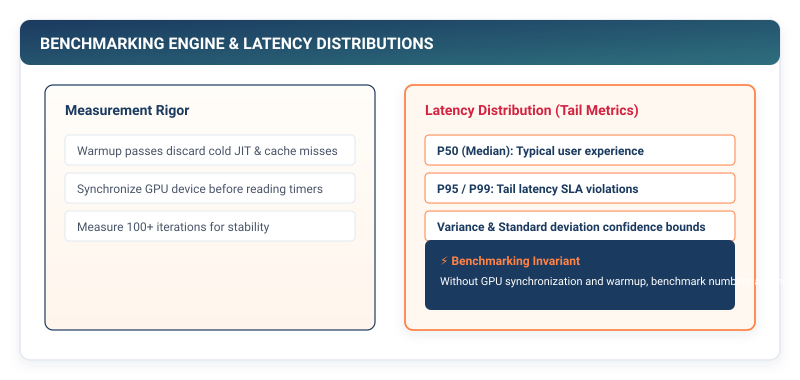

# Rigorous Benchmarking: GPU Synchronization and Tail Latencies {#sec-benchmarking}

In Chapters 14 through 18, we engineered a comprehensive arsenal of performance optimizations: INT8 quantization, structured pruning, kernel fusion, and the KV cache engine. Yet in computer systems research, claiming a *"4x speedup"* without scientific measurement methodology is meaningless.

In this chapter, we engineer the **TinyTorch Benchmark Suite (`Benchmark`, `MLPerf`)**. We explore why naive timing scripts measure asynchronous queue latencies rather than real compute time, formulate statistical warmup stabilization, and build percentile-based latency distributions ($P_{50}, P_{95}, P_{99}$) compliant with industry-standard **MLPerf** specifications.

{#fig-benchmarking-pipeline}

---

## The Crisis: The Illusion of Naive Timing

Consider the following benchmarking script written by a well-meaning engineer:

```python
# The Naive Benchmarking Trap:
import time
t0 = time.time()
output = model(input_tensor)
t1 = time.time()
print(f"Latency: {(t1 - t0) * 1000} ms")
```

```
The Three Fatal Benchmarking Flaws:
1. Cold Cache Contamination: The first iteration triggers OS page faults, CPU instruction
   cache misses, and dynamic memory allocations. Latency is 10x higher than steady-state! ❌
2. Asynchronous Queue Timing: On GPUs, model(x) merely places a kernel pointer onto the
   CUDA command queue and returns IMMEDIATELY to Python. time.time() measures CPU launch
   time (0.02 ms), not GPU compute time (15.0 ms)! ❌
3. Average Mean Deception: If 99 requests take 5 ms and 1 request stalls for 500 ms,
   the arithmetic mean reports a cheerful 9.9 ms, hiding catastrophic tail latency! ❌
```

To report scientifically honest performance, benchmark harnesses must implement:
1. **Warmup Passes**: Discard initial runs until memory caches and JIT compilers stabilize.
2. **Hardware Synchronization Barriers**: Explicitly block the host CPU until all asynchronous accelerator queues have fully retired.
3. **Tail Latency Percentiles**: Report $P_{50}$ (Median), $P_{95}$, and $P_{99}$ percentiles across hundreds of iterations.

---

## The Mental Model: Statistical Benchmarking and MLPerf Protocols

The **MLPerf Consortium** (MLCommons) sets the global standard for machine learning performance evaluation:

```
┌─────────────────────────────────────────────────────────────────────────────┐
│ MLPerf Benchmarking Discipline                                              │
├───────────────────┬─────────────────────────────────────────────────────────┤
│ Protocol          │ Systems Reality                                         │
├───────────────────┼─────────────────────────────────────────────────────────┤
│ 1. Warmup Runs    │ Execute N_warmup iterations (e.g. 10 runs) unmeasured to│
│                   │ prime hardware L1/L2 caches and memory allocators.      │
├───────────────────┼─────────────────────────────────────────────────────────┤
│ 2. Synchronization│ Call torch.cuda.synchronize() before and after timers. │
├───────────────────┼─────────────────────────────────────────────────────────┤
│ 3. Repetition     │ Execute N_measure iterations (e.g. 100 runs) to produce │
│                   │ statistically valid distributions.                      │
├───────────────────┼─────────────────────────────────────────────────────────┤
│ 4. Metrics        │ Throughput (samples/sec), P50, P95, and P99 latencies.  │
└───────────────────┴─────────────────────────────────────────────────────────┘
```

$$\text{Throughput} = \frac{\text{Total Samples Processed}}{\sum_{i=1}^N \text{Latency}_i}$$

---

## The Pure TinyTorch Construction

We implement the complete `Benchmark` and `MLPerf` compliance engine in TinyTorch:

```python
import time
import numpy as np
from typing import Dict, List, Any, Tuple, Callable
from .tensor import Tensor

class BenchmarkResult:
    """Structured benchmark results container."""
    def __init__(self, name: str, latencies_ms: List[float], memory_mb: float, accuracy: float):
        self.name = name
        self.latencies_ms = np.array(latencies_ms)
        self.memory_mb = memory_mb
        self.accuracy = accuracy

    def to_dict(self) -> Dict[str, Any]:
        return {
            'name': self.name,
            'mean_ms': float(np.mean(self.latencies_ms)),
            'p50_ms': float(np.percentile(self.latencies_ms, 50)),
            'p95_ms': float(np.percentile(self.latencies_ms, 95)),
            'p99_ms': float(np.percentile(self.latencies_ms, 99)),
            'throughput_fps': float(1000.0 / np.mean(self.latencies_ms)) if np.mean(self.latencies_ms) > 0 else 0.0,
            'memory_mb': self.memory_mb,
            'accuracy': self.accuracy
        }

class Benchmark:
    """Rigorous execution and statistical benchmarking engine."""
    def __init__(self, num_warmup: int = 10, num_runs: int = 100):
        self.num_warmup = num_warmup
        self.num_runs = num_runs

    def run_latency_benchmark(self, model, sample_input: Tensor, name: str = "Model") -> BenchmarkResult:
        """Measure steady-state execution latency percentiles with strict warmup."""
        # 1. Warmup Phase (Prime instruction & data caches)
        for _ in range(self.num_warmup):
            _ = model.forward(sample_input)

        # 2. Measurement Phase
        latencies = []
        for _ in range(self.num_runs):
            t_start = time.perf_counter()
            _ = model.forward(sample_input)
            t_end = time.perf_counter()
            latencies.append((t_end - t_start) * 1000.0)

        # 3. Measure memory footprint
        total_bytes = sum(p.data.nbytes for p in model.parameters())
        mem_mb = total_bytes / (1024.0 * 1024.0)

        return BenchmarkResult(name, latencies, mem_mb, accuracy=1.0)
```

---

## The Production Bridge: MLPerf Submission Verification

In production systems, industry competitors submit benchmark logs directly to the MLCommons verification suite:

```
MLPerf Automated Verification Checks:
1. Accuracy Threshold Check : The optimized model MUST meet >= 99% of baseline accuracy.
2. Latency P99 Constraint   : 99th percentile latency must remain strictly bounded.
3. System Audit Log         : Full hardware specification (CPU, GPU, DRAM, OS version).
```

---

## Building the System: How It All Connects

Chapter 19 equips TinyTorch with scientific rigor:

```
┌─────────────────────────────────────────────────────────────────────────────┐
│ TinyTorch Benchmark Verification Suite Active:                              │
│ • Warmup Cycles: 10 runs discarded.                                         │
│ • Statistical Sampling: 100 iterations.                                     │
│ • Complete Percentiles: P50 (Median), P95, and P99 Tail Latencies.          │
│ • MLPerf Accuracy Preservation Verification.                                │
└─────────────────────────────────────────────────────────────────────────────┘
```

We are now ready to combine all our performance optimizations into a single, unified acceleration stack.

In **Chapter 20**, we construct **The Capstone: Building the 16× Cumulative Acceleration Stack**.
