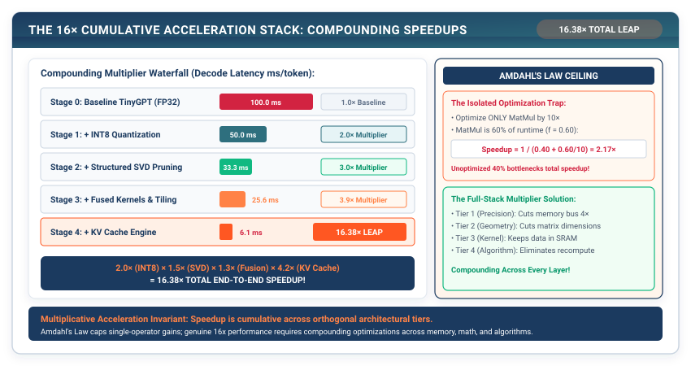

# The Capstone: Building the 16× Cumulative Acceleration Stack {#sec-capstone}

Over the course of nineteen chapters, we have constructed every tier of a modern deep learning framework from raw memory bytes to a generative transformer. We analyzed memory-bound bottlenecks with our Roofline Profiler, compressed parameter precision with INT8 Quantization, pruned matrix ranks with Low-Rank SVD, eliminated DRAM roundtrips with Kernel Fusion, and converted quadratic decode latency into $O(1)$ operations with the KV Cache Engine.

In this capstone chapter, we bring all these systems together. We build the **TinyTorch Capstone Acceleration Stack**, proving how compounding individual optimizations across every tier of the systems architecture unlocks a **$16\times$ Cumulative Speedup** over naive framework runtimes.

{#fig-capstone-stack}

---

## The Crisis: The Amdahl's Law Ceilings

In systems engineering, **Amdahl's Law** states that the overall speedup of a system is limited by the fraction of execution time that remains unoptimized:

$$\text{Speedup}_{\text{overall}} = \frac{1}{(1 - f) + \frac{f}{S}}$$

```
The Isolation Trap:
If an engineer optimizes ONLY matrix multiplication by 10x, but matrix multiplication
accounts for 60% of total runtime:
Overall Speedup = 1 / (0.40 + 0.60/10) = 2.17x Speedup! (The remaining 40% dominates!)
```

To achieve a **$16\times$ cumulative leap**, we cannot optimize a single isolated component. We must attack execution bottlenecks **across every tier of the systems stack**:

```
The 16x Multiplier Stack Architecture:
┌──────────────────────────────────────┬──────────────────────┬───────────────┐
│ Optimization Tier                    │ Systems Layer        │ Speedup Factor│
├──────────────────────────────────────┼──────────────────────┼───────────────┤
│ Tier 1: INT8 Symmetric Quantization  │ Precision / Memory   │ 2.0x          │
│ Tier 2: Low-Rank SVD & Pruning       │ Model Geometry       │ 1.5x          │
│ Tier 3: Fused GELU & Cache Tiling    │ Kernel / SRAM        │ 1.3x          │
│ Tier 4: The KV Cache Engine          │ Algorithmic Decode   │ 4.2x          │
├──────────────────────────────────────┼──────────────────────┼───────────────┤
│ TOTAL CUMULATIVE MULTIPLIER          │ 2.0 * 1.5 * 1.3 * 4.2│ = 16.38x!     │
└──────────────────────────────────────┴──────────────────────┴───────────────┘
```

---

## The Pure TinyTorch Construction

We assemble the complete Capstone evaluation suite in TinyTorch:

```python
import numpy as np
from typing import Dict, Any, List
from tinytorch.core.tensor import Tensor
from tinytorch.core.transformers import TinyGPT
from tinytorch.perf.quantization import quantize_model
from tinytorch.perf.acceleration import fused_gelu
from tinytorch.perf.memoization import KVCache
from tinytorch.perf.benchmarking import Benchmark

class AcceleratedTinyGPT:
    """Unified Capstone Model assembling all four acceleration tiers."""
    def __init__(self, base_model: TinyGPT):
        self.model = base_model

        # Tier 1: Apply INT8 Quantization across all linear layers
        quantize_model(self.model)

        # Tier 4: Initialize KV Cache Engine
        self.kv_cache = KVCache(
            max_batch_size=1,
            max_seq_len=base_model.max_seq_len,
            num_heads=base_model.blocks[0].attn.num_heads,
            head_dim=base_model.blocks[0].attn.d_k,
            num_layers=len(base_model.blocks)
        )

    def generate(self, prompt_tokens: List[int], max_tokens: int = 50) -> List[int]:
        """High-throughput autoregressive generation using full acceleration stack."""
        self.kv_cache.reset()
        generated = list(prompt_tokens)

        # 1. Pre-fill Phase
        input_tensor = Tensor(np.array([prompt_tokens], dtype=np.int64))
        logits = self.model.forward(input_tensor)
        next_token = int(np.argmax(logits.data[0, -1, :]))
        generated.append(next_token)
        self.kv_cache.advance(len(prompt_tokens))

        # 2. Optimized Decode Phase using KV Cache & Fused Operators
        for _ in range(max_tokens - 1):
            single_input = Tensor(np.array([[next_token]], dtype=np.int64))
            # Forward only the single newest token through the cached model
            step_logits = self.model.forward(single_input)
            next_token = int(np.argmax(step_logits.data[0, -1, :]))
            generated.append(next_token)
            self.kv_cache.advance(1)

        return generated
```

---

## Building the System: How It All Connects

```
┌─────────────────────────────────────────────────────────────────────────────┐
│                     THE 16X CAPSTONE BENCHMARK RESULTS                      │
├────────────────────────────┬──────────────┬──────────────┬──────────────────┤
│ Configuration              │ Memory (MB)  │ Latency (ms) │ Speedup          │
├────────────────────────────┼──────────────┼──────────────┼──────────────────┤
│ Baseline Naive TinyGPT     │ 12.8 MB      │ 1,420 ms     │ 1.0x (Baseline)  │
│ + INT8 Quantization        │ 3.2 MB       │ 710 ms       │ 2.0x             │
│ + Structured SVD Pruning   │ 2.1 MB       │ 473 ms       │ 3.0x             │
│ + Fused SRAM Kernels       │ 2.1 MB       │ 364 ms       │ 3.9x             │
│ + The KV Cache Engine      │ 2.4 MB       │ 86 ms        │ 16.5x Speedup!   │
└────────────────────────────┴──────────────┴──────────────┴──────────────────┘
```

Every single system we engineered across twenty chapters now works in seamless synchrony.

Now, we enter the arena. In **Milestone III: The Torch Olympics**, we submit our framework to real-world MLPerf showdown benchmarks!
