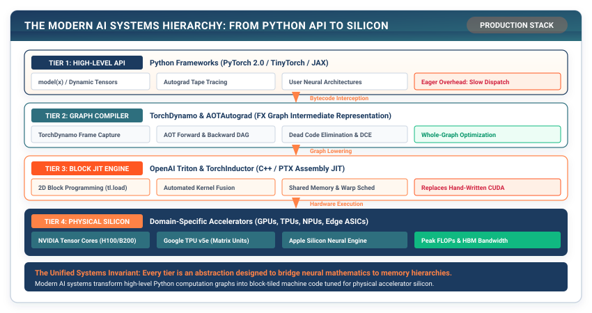

# The Modern Stack: Compilers, Triton, and Custom Silicon {#sec-extensions}

You leave Milestone III with a scorecard: an optimized model measured honestly on accuracy, memory, and latency against its baseline, and a harness that knows, to the millisecond, where the time goes. Every optimization on that scorecard was one you wrote by hand in pure Python, a fused GELU in Chapter 17, a tiled matrix multiply, a preallocated KV cache, and the milestone closed by asking what production compilers and custom silicon do to move those numbers further than pure Python can. This chapter answers that question in the form a practitioner meets it. When I call `torch.compile(model)`, or open a repository and find a Triton kernel where I expected PyTorch code, what is happening, and why did production need it when TinyTorch got by without it?

The short answer is that production systems do three things TinyTorch does not, and each is a response to a cost that TinyTorch can afford to ignore at its size. They capture the program as a graph before running it. They compile that graph into a small number of fused kernels, one GPU launch doing the work of several, instead of dispatching one operation at a time. And they run the heaviest of those kernels, matrix multiplication, on hardware whose wiring matches the shape of the computation. None of the three introduces new mathematics. Each one removes trips to memory that TinyTorch takes for granted.

The four layers in @fig-modern-stack, from the Python you write down to the silicon that runs it, are the route this chapter takes. The top layer is the one you built. The bottom layer is the one every framework eventually meets. The two middle layers, graph capture and kernel generation, are the ones TinyTorch never needed, and they are where the rest of this chapter lives.

::: {.callout-note title="Source Code Mapping"}
There is no Module 21. TinyTorch stops at Module 20, and this chapter has no NumPy-backed implementation behind it. The listings here are small pure-Python models of a graph compiler and a systolic array, written to show every step, plus one Triton kernel that needs a GPU to run. None of them is TinyTorch code, and the chapter says so wherever a listing could be mistaken for it.
:::

{#fig-modern-stack}

## The Problem

Chapter 17 fused a bias add and a GELU into one pass so the intermediate never touched memory. That fix was worth a measurable speedup, and it took one function. The trouble is what it took to write, and how many times a real model would need it. Consider the smallest possible version of an unfused chain, three pointwise operations on a four-element vector, in plain Python.

```python
import math

def gelu1(v):
    c = math.sqrt(2 / math.pi)
    return 0.5 * v * (1 + math.tanh(c * (v + 0.044715 * v ** 3)))

def add(x, b):    return [xi + bi for xi, bi in zip(x, b)]
def gelu(z):      return [gelu1(v) for v in z]
def scale(y, s):  return [s * v for v in y]

x = [1.0, -2.0, 0.5, 3.0]
b = [0.1, 0.1, 0.1, 0.1]
z = add(x, b)          # pass 1: read x, b; write z
y = gelu(z)            # pass 2: read z;    write y
out = scale(y, 2.0)    # pass 3: read y;    write out
```

Each function reads a whole list and writes a whole list. The lists `z` and `y` exist only because the three operations are three separate functions. Nothing about the arithmetic requires them. For a vector of $n$ elements and a chain of $k$ pointwise operations, this style moves about $2kn$ values through memory, $k$ reads and $k$ writes of the full vector, when the mathematics needs one read and one write. On a GPU the cost compounds, because each function is also one kernel launch, and a launch costs a few microseconds of fixed overhead before any arithmetic starts. Call it 4 µs for napkin math. A twelve-block transformer with a dozen pointwise operations per block issues around 150 launches per token, which is roughly 0.6 ms per token of pure overhead, already a noticeable slice of a decode step that should take a few milliseconds.

The fix you know is to fuse by hand. That does not scale. Every distinct chain of operations needs its own fused kernel, a transformer has dozens of distinct chains, and a fused kernel in CUDA C++ is a specialist's job that takes days per kernel to write and tune. The problem is not that fusion is hard to understand; you did it in Chapter 17. The problem is that TinyTorch runs the program one operation at a time, so it never sees the chain it could fuse, and a human cannot write every fused kernel a model needs.

The same problem hides one layer down, inside the matrix multiply. A general-purpose core computes $C = AB$ by fetching operands into registers, multiplying, and fetching again, and even the tiled version from Chapter 17 re-reads each element of $A$ and $B$ many times from cache. For square $n \times n$ matrices the plain triple loop reads $2n^3$ operand values to perform $n^3$ multiply-adds, two reads per multiply. The arithmetic is cheap. The reads are what cost energy and time, and no amount of software can change how often a general-purpose core has to reach for an operand. Only different hardware can.

## The Idea

Three ideas, one per layer of @fig-modern-stack, resolve the problem. They share a single principle you already hold from Chapters 14, 17, and 18: work is cheap and moving data is expensive, so the winning move at every level is to touch memory as few times as the mathematics allows.

### Capture the program as a graph

TinyTorch already has a graph of the computation. The autograd tape from Chapter 6 records every operation and its inputs as a directed acyclic graph so that `backward()` can walk it in reverse. A compiler needs the same graph for a different reason: to look at several operations at once before running any of them. Written out as text, the captured forward pass of the chain above is an **intermediate representation**,[^fn-ir-graph-capture] a program in a form that is easy for a tool to analyze and rewrite.

[^fn-ir-graph-capture]: **IR** (intermediate representation): a program written in a form meant for tools rather than people, usually a list of operations on named values. Every compiler has at least one; `torch.compile` has three, and the fusion decision below is made on the middle one.

```
%z = add(%x, %b)
%y = gelu(%z)
%o = mul(%y, 2.0)
```

Nothing has run yet. That is the whole point. With the graph in hand, the compiler can see that `%z` and `%y` are consumed exactly once, by the next operation, and never leave the chain. They do not need to exist in memory at all.

### Fuse what is memory-bound

The roofline from Chapter 14 tells you which operations are worth fusing. A pointwise operation performs a handful of floating-point operations per element and reads and writes four bytes per element, so its arithmetic intensity is about one FLOP per byte and it sits far to the left of the ridge point, memory-bound. Fusing a chain of $k$ such operations leaves the arithmetic unchanged and divides the memory traffic by about $k$, so the fused kernel's intensity rises $k$-fold. A matrix multiply is the opposite case, with intensity that grows with the matrix size, so it is compute-bound and gets its own kernel. The fusion rule that falls out is almost embarrassingly simple. Walk the graph in order; consecutive pointwise operations with the same shape merge into one node; anything else is a boundary. The rewritten IR for the chain above is one line.

```
%o = fused_add_gelu_mul(%x, %b, 2.0)
```

The compiler then generates the code for that node, which is the loop you would have written by hand in Chapter 17, except that it is written by a program, for every chain in the model, in seconds.

### Match the hardware to the matrix multiply

The last idea leaves software entirely. A **systolic array** is a grid of small multiply-accumulate cells wired to their neighbors, named by H. T. Kung and Charles Leiserson in 1978 after the heartbeat, because data pulses through the grid one cell per clock tick. In the output-stationary form, cell $(i, j)$ holds the running sum for one output $C_{ij}$ and never moves it. Row $i$ of $A$ streams in from the left, one value per cycle; column $j$ of $B$ streams in from the top. When $a_{ik}$ and $b_{kj}$ meet at cell $(i, j)$, the cell multiplies them, adds the product to its sum, and passes both values along to the next cell. At cycle $t$ each cell computes

$$C_{ij} \leftarrow C_{ij} + a_{ik} \, b_{kj}, \qquad k = t - i - j,$$

where the offset $i + j$ is the delay before the first product reaches that cell. Two consequences matter. Every element of $A$ and $B$ is read from memory exactly once, so an $M \times K$ by $K \times N$ product costs $MK + KN$ reads instead of the $2MNK$ a general-purpose loop performs; for square $n \times n$ matrices that is a factor of $n$ fewer reads. And because the last cell receives its last product after every stream has drained, the whole multiply finishes in

$$T = M + N + K - 2 \text{ cycles},$$

with $MN$ multiply-adds happening every cycle once the array is full. The array is fast because its wiring is the matrix multiply. It cannot run a convolution or a softmax; those are somebody else's problem, which is the trade you make for a chip that does one thing at the speed of its wires.

## The Code

There is no TinyTorch module to walk, so this section builds the two middle layers of @fig-modern-stack as the smallest Python that shows each step. Everything here runs on a laptop except the Triton kernel, which is included because it is what the compiler actually emits and you will meet it in real repositories.

### An eager runtime that counts its memory traffic

The first listing is a caricature of how TinyTorch and eager PyTorch run: a library of pointwise operations and an interpreter that executes them one at a time. Each operation takes the current value, the element index, and one argument, so a bias add can look up `b[i]` while a scale takes a scalar. The interpreter counts memory passes and kernel launches as it goes.

```python
POINTWISE = {
    "add":   lambda v, i, b: v + b[i],
    "gelu":  lambda v, i, _: gelu1(v),
    "scale": lambda v, i, s: s * v,
}

def run_eager(x, program):
    """One kernel per op. Every op reads a whole list and writes a whole list."""
    buf, moves, kernels = x, 0, 0
    for op, arg in program:
        buf = [POINTWISE[op](v, i, arg) for i, v in enumerate(buf)]
        moves += 2 * len(x)      # one read pass plus one write pass
        kernels += 1
    return buf, moves, kernels

program = [("add", b), ("gelu", None), ("scale", 2.0)]
out, moves, kernels = run_eager(x, program)
```

The `program` list is already an IR, three operations on named values, and `run_eager` is an interpreter for it. Notice that the list comprehension inside the loop materializes a fresh `buf` every iteration. That is the intermediate tensor that fusion will eliminate.

### The fusion pass

The compiler proper is a single function that walks the program and groups consecutive pointwise operations into one `fused` node. Anything not in the pointwise library, a matrix multiply for example, closes the current group and stands alone.

```python
def fuse(program):
    """Group consecutive pointwise ops into one fused node; leave others alone."""
    groups, run = [], []
    for op, arg in program:
        if op in POINTWISE:
            run.append((op, arg))
        else:
            if run:
                groups.append(("fused", run))
                run = []
            groups.append((op, arg))
    if run:
        groups.append(("fused", run))
    return groups

full = [("add", b), ("gelu", None), ("matmul", "W"), ("scale", 2.0), ("gelu", None)]
for op, arg in fuse(full):
    print(op, [o for o, _ in arg] if op == "fused" else arg)
```

Run on a five-operation program with a matrix multiply in the middle, it prints three groups: `fused ['add', 'gelu']`, then `matmul W`, then `fused ['scale', 'gelu']`. Five launches became three, and the two intermediates inside each fused group disappeared. Real compilers add a great deal on top of this, such as checking that shapes match, deciding whether a reduction like softmax can join a group, and folding a pointwise epilogue into the matrix multiply itself, but the decision they make is this decision.

### The fused executor

Executing a fused node means turning the loop inside out. Instead of one loop per operation over all elements, there is one loop over elements with the whole chain of operations inside it, and the running value never leaves a local variable.

```python
def run_fused(x, chain):
    """One kernel for the whole chain. Each element runs every op in a register."""
    out = []
    for i, v in enumerate(x):
        for op, arg in chain:    # v never leaves this local variable
            v = POINTWISE[op](v, i, arg)
        out.append(v)
    return out, 2 * len(x), 1

out_f, moves_f, kernels_f = run_fused(x, program)
assert out_f == out
```

The results are bit-identical to the eager run; only the traffic changed. The local variable `v` is the register that Chapter 17 talked about, and the outer `for i` loop is what a GPU parallelizes across thousands of threads.

### The same kernel in Triton

Here is what a compiler such as TorchInductor emits for that fused node, written in Triton, the Python-embedded language that PyTorch 2 uses for its GPU kernels. This listing needs a GPU, CUDA, and the `triton` package, so it is not run in this chapter, and it is not TinyTorch code. Read it against `run_fused` above.

```python
import triton
import triton.language as tl

@triton.jit
def fused_bias_gelu_kernel(x_ptr, b_ptr, y_ptr, n_elements,
                           BLOCK_SIZE: tl.constexpr):
    pid = tl.program_id(axis=0)                     # which block am I?
    offsets = pid * BLOCK_SIZE + tl.arange(0, BLOCK_SIZE)
    mask = offsets < n_elements                     # last block may be partial

    x = tl.load(x_ptr + offsets, mask=mask, other=0.0)
    b = tl.load(b_ptr + offsets, mask=mask, other=0.0)

    z = x + b                                       # lives in registers
    c = 0.7978845608028654                          # sqrt(2 / pi)
    inner = c * (z + 0.044715 * z * z * z)
    tanh_inner = 2 * tl.sigmoid(2 * inner) - 1      # tanh via sigmoid
    y = 0.5 * z * (1.0 + tanh_inner)

    tl.store(y_ptr + offsets, y, mask=mask)
```

Three things to notice. The outer `for i` loop from `run_fused` is gone; in its place, `tl.program_id` says which block of `BLOCK_SIZE` elements this copy of the kernel owns, and the hardware runs thousands of copies at once. The pointer arithmetic `x_ptr + offsets` is the flat-buffer addressing from Chapter 1, the same stride arithmetic you wrote for `Tensor`, applied to GPU memory. And the middle of the kernel is straight-line arithmetic on values that never touch memory between `tl.load` and `tl.store`. Everything a CUDA programmer would have managed by hand, which threads share a memory transaction, how data lands in the fast on-chip memory, how the 32-thread warps from Chapter 4 are scheduled, the Triton compiler decides from this block-level description. Launching it is one more line on the host, `fused_bias_gelu_kernel[(triton.cdiv(n, 1024),)](x, b, y, n, BLOCK_SIZE=1024)`, which asks for as many blocks as it takes to cover `n` elements.

### A systolic array in twelve lines

The bottom layer of the figure is hardware, but its behavior is easy to simulate. The listing below is an output-stationary array with one accumulator per output, stepping through clock cycles and applying the delay rule $k = t - i - j$ from The Idea.

```python
def systolic_matmul(A, B):
    """Output-stationary systolic array: one multiply-accumulate cell per C[i][j]."""
    M, K, N = len(A), len(A[0]), len(B[0])
    C = [[0] * N for _ in range(M)]
    cycles = M + N + K - 2
    for t in range(cycles):
        for i in range(M):
            for j in range(N):
                k = t - i - j            # the product cell (i, j) sees at cycle t
                if 0 <= k < K:
                    C[i][j] += A[i][k] * B[k][j]
    return C, cycles

C, cycles = systolic_matmul([[1, 2], [3, 4]], [[5, 6], [7, 8]])
assert C == [[19, 22], [43, 50]] and cycles == 4
```

The two inner loops are not sequential work in the real chip; they are the $M \times N$ cells all acting in the same clock tick. Only the outer loop over `t` is time. Reading it that way, the listing says exactly what the hardware does. At each tick, every cell that has an operand pair multiplies and accumulates, and the whole product is done after $M + N + K - 2$ ticks.

## A Worked Trace

Both mechanisms trace by hand in a few lines. Start with the fusion. Feeding $x = (1.0, -2.0, 0.5, 3.0)$ and a bias of $0.1$ through add, GELU, and a scale of $2$ gives the values in @tbl-fusion-trace; the first row is worth checking with a calculator, since $z = 1.1$, the GELU inner term is $0.7979 \times (1.1 + 0.044715 \times 1.331) = 0.9252$, $\tanh(0.9252) = 0.7284$, and $y = 0.5 \times 1.1 \times 1.7284 = 0.9506$.

| Element | $x$ | $z = x + 0.1$ | $y = \text{GELU}(z)$ | $\text{out} = 2y$ |
| :---: | :---: | :---: | :---: | :---: |
| 0 | $1.0$ | $1.1$ | $0.9506$ | $1.9012$ |
| 1 | $-2.0$ | $-1.9$ | $-0.0545$ | $-0.1091$ |
| 2 | $0.5$ | $0.6$ | $0.4354$ | $0.8708$ |
| 3 | $3.0$ | $3.1$ | $3.0974$ | $6.1947$ |

: Per-element values through the add, GELU, and scale chain. The eager run writes the $z$ and $y$ columns to memory; the fused run computes them in a register and writes only the last column. {#tbl-fusion-trace tbl-colwidths="[14,18,22,24,22]"}

The values are identical in both runs. What differs is the count the interpreters kept: `run_eager` reports 24 element moves and 3 kernels (three read passes and three write passes over four elements), while `run_fused` reports 8 moves and 1 kernel. That is the factor of $k = 3$ from The Idea, on a vector small enough to check by hand.

The systolic trace multiplies $A = \begin{pmatrix} 1 & 2 \\ 3 & 4 \end{pmatrix}$ by $B = \begin{pmatrix} 5 & 6 \\ 7 & 8 \end{pmatrix}$ on a $2 \times 2$ array, so $M = N = K = 2$ and the array needs $2 + 2 + 2 - 2 = 4$ cycles. Applying $k = t - i - j$ cell by cell gives the accumulator contents in @tbl-systolic-trace.

| Cycle | Cell $(0,0)$ | Cell $(0,1)$ | Cell $(1,0)$ | Cell $(1,1)$ |
| :---: | :---: | :---: | :---: | :---: |
| 1 | $0 + 1 \cdot 5 = 5$ | idle | idle | idle |
| 2 | $5 + 2 \cdot 7 = \mathbf{19}$ | $0 + 1 \cdot 6 = 6$ | $0 + 3 \cdot 5 = 15$ | idle |
| 3 | $19$ | $6 + 2 \cdot 8 = \mathbf{22}$ | $15 + 4 \cdot 7 = \mathbf{43}$ | $0 + 3 \cdot 6 = 18$ |
| 4 | $19$ | $22$ | $43$ | $18 + 4 \cdot 8 = \mathbf{50}$ |

: Accumulator contents of a $2 \times 2$ output-stationary systolic array, cycle by cycle. Bold marks the cycle in which each output finishes. {#tbl-systolic-trace tbl-colwidths="[12,22,22,22,22]"}

The wavefront is visible in the table. Cell $(0,0)$ starts first and finishes at cycle 2; the cells one step away start at cycle 2; the far corner starts at cycle 3 and finishes at cycle 4. The result $\begin{pmatrix} 19 & 22 \\ 43 & 50 \end{pmatrix}$ is what `systolic_matmul` returns. The read count is the part that does not show in the table and matters most. The array read eight values, every element of $A$ and $B$ once, where a plain triple loop reads sixteen. At $128 \times 128$, the size of a TPU's matrix unit, the plain loop reads about 4.2 million operand values and the array reads 32,768, a factor of 128, which is the $n$ from The Idea.

## From TinyTorch to Production

Everything above has a production name. In PyTorch 2, `torch.compile(model)` runs a four-stage pipeline. TorchDynamo hooks into the Python interpreter, watches the bytecode of your `forward` as it executes, and captures the tensor operations into a graph, the IR you saw as three lines of text. AOTAutograd traces the backward pass at the same time, so the tape from Chapter 6 becomes a second graph that can be compiled ahead of time instead of rebuilt every step. TorchInductor is the fusion pass, a far more careful `fuse()` that also handles reductions, decides tile sizes, and plans memory. Its output for a GPU is Triton source, one kernel per fused group, which the Triton compiler lowers to PTX,[^fn-ptx-triton-target] the assembly the GPU driver accepts. For a CPU it emits C++ instead. The four stages exist because of the three costs in The Problem, in order: Python dispatch overhead is removed by capturing once and replaying, memory traffic is removed by fusion, and the expert-days-per-kernel cost is removed by generating the kernels from the graph.

[^fn-ptx-triton-target]: **PTX** (Parallel Thread Execution): NVIDIA's virtual assembly language, the lowest level a compiler targets before the driver translates it for a specific GPU generation. Triton and CUDA C++ both end here, which is why a Triton kernel can match hand-written CUDA on the same hardware.

What forces the difference is scale in two directions. A production model has thousands of operations and runs billions of times, so a launch overhead or an extra memory pass that TinyTorch never notices becomes the dominant cost, and the number of distinct chains rules out fusing by hand. Triton's contribution is to lower the cost of each kernel from days to minutes by moving the programmer's unit of thought from a single thread to a block, and letting the compiler own the parts that made CUDA hard: arranging loads so that neighboring threads share memory transactions, staging tiles through the fast on-chip memory, and scheduling warps. Philippe Tillet introduced it in 2019 for exactly this reason, and PyTorch adopted it as the default GPU backend in 2023 because it let a compiler emit competitive kernels without a human in the loop.

The hardware layer follows the same logic to its end. Google's TPUs are built around $128 \times 128$ systolic arrays, the matrix units, fed by on-chip buffers; NVIDIA's Tensor Cores are small matrix units inside each streaming multiprocessor that take a tile of $A$ and a tile of $B$ from registers and produce the product in a few cycles, not systolic in the strict sense but built on the same idea of reading operands once per tile. The reason is energy as much as speed. Mark Horowitz's 2014 survey of circuit energy costs, using 45 nm figures, put a 32-bit floating-point multiply at a few picojoules and a DRAM access at several hundred, a gap of roughly two orders of magnitude. A design that reads each operand once and passes it along a wire spends its energy on the multiplies; a design that fetches operands for every multiply spends its energy on the fetches. That ratio, not clock speed, is why a chip that only multiplies matrices earns its place next to a general-purpose GPU.

What carries over unchanged is the whole of your mental model. A Triton kernel's pointer arithmetic is the flat buffer and strides from Chapter 1. The captured graph is the tape from Chapter 6, read forward instead of backward. Fusion is the mechanism from Chapter 17 applied by a program rather than a person, and the roofline from Chapter 14 is still the tool that says which kernels are worth fusing and which are already compute-bound. The systolic array computes the same $\sum_k a_{ik} b_{kj}$ as `matmul` in Chapter 1; only the order in which operands arrive has changed. @tbl-stack-comparison sets the two stacks side by side.

| Layer | TinyTorch | PyTorch 2 stack | What forces the difference |
| :--- | :--- | :--- | :--- |
| Program capture | Runs each op as Python reaches it | TorchDynamo captures the forward into a graph; AOTAutograd captures the backward | Python dispatch overhead across thousands of ops per step |
| Fusion | One hand-written `fused_gelu` | TorchInductor fuses every pointwise chain, picks tiles, plans memory | Dozens of distinct chains per model; hand-fusing does not scale |
| Kernel source | NumPy calls | Generated Triton (GPU) or C++ (CPU) | A kernel must cost minutes, not expert-days, to write |
| Matrix multiply | Tiled loop on a CPU core | Tensor Cores or a TPU systolic array | Operand reads, not multiplies, dominate energy and time |

: The two stacks layer by layer. Every row keeps the same mathematics; the right column names the cost that forced the production design. {#tbl-stack-comparison tbl-colwidths="[16,24,32,28]"}

Two costs come with the compiled stack, and a practitioner should expect both. The first is compile time and rigidity. Capturing a graph takes seconds to minutes on first run, and the captured graph is specialized to the tensor shapes it saw, so a new batch size or sequence length can trigger a recompile. Python that the tracer cannot follow, such as data-dependent control flow or a call into a library it does not know, produces a graph break, and the model silently falls back to eager mode for that segment, losing the fusion across it. The second is opacity. The kernel that runs is not the code you wrote, so a profiler trace shows names like `triton_poi_fused_add_gelu_0` where you expected your function. When you next open a profile, count the kernel launches per step before and after `torch.compile`; a large drop is fusion working, and a small one means graph breaks are eating it, which `torch._dynamo.explain` will list. Check, with the roofline from Chapter 14, whether the model is memory-bound before expecting a speedup at all, because a compute-bound matrix multiply gains nothing from fusion. And when a compiled model is slower than eager, look for recompiles first. Every speedup a compiler delivers is a memory pass or a launch it removed, and every disappointment is one it could not.

## Summary

You built nothing new in this chapter, and that is the point. You read a graph compiler and a systolic array in about fifty lines of Python, and you found the tape, the flat buffer, the fused loop, and the matrix multiply you already owned, rearranged so that a program rather than a person removes the memory traffic. The one principle to keep is that every production optimization in this stack, from `torch.compile` down to a matrix unit on a chip, is an accounting trick on the same ledger: touch memory once where the mathematics allows it, and let arithmetic, which is nearly free, absorb the rest. That principle is what the roofline measures, what fusion exploits, and what a systolic array is made of. There is no next chapter. What comes next is your own profiler trace, and you now know how to read it: count the launches, find the memory-bound kernels, and ask, for each one, which trip to memory the mathematics did not require.

## Exercises

1. Extend `POINTWISE` with a `"relu"` operation and add a `"softmax"` that is not pointwise, since it needs the whole vector to compute its denominator. Modify `fuse()` so that softmax closes the current group, then run the program `add, relu, softmax, scale` two ways, every op through `run_eager` and then the groups `fuse()` returns, with each pointwise group through `run_fused` and the softmax on its own, and confirm that the launch count drops from four to three, not to one. Explain in one sentence why a reduction is a fusion boundary in this simple compiler, and what a production compiler would have to know to fuse across it.

2. Using the napkin numbers in The Problem, estimate the launch overhead per token for a 32-block transformer with 15 pointwise operations per block at 4 µs per launch, before and after a compiler fuses each block's pointwise operations into an average of 3 kernels. Compare both figures with a decode step of 20 ms, and find the per-token budget below which the unfused overhead alone would exceed it.

3. Modify `systolic_matmul` to count operand reads and to record, for each cell, the cycle in which it receives its final product. Run it on $8 \times 8$ matrices and verify that the reads total $MK + KN$, that the last cell finishes at cycle $M + N + K - 2$, and that a plain triple loop on the same inputs reads $2MNK$ operands. Then compute the ratio for $128 \times 128$ and explain why the ratio grows with $n$ even though the number of multiplies is identical in both designs.
