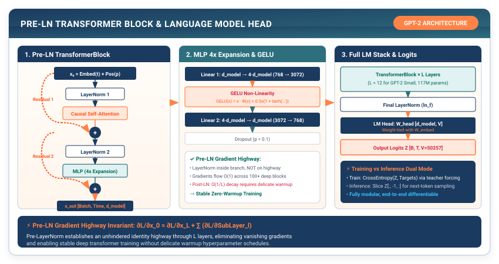

# Milestone II: Generative Intelligence — Training an Autoregressive Model {#sec-milestone-2}

In Chapters 9 through 13, we expanded TinyTorch from flat perceptrons into state-of-the-art deep architectures: spatial convolutions, subword byte-pair tokenization, continuous embeddings, scaled dot-product attention, and the full Pre-LN GPT-2 transformer.

In this milestone, we take the decisive leap from static classification into **Generative Intelligence**. We assemble our complete Tier 1, Tier 2, and Tier 3 systems to train `TinyGPT` from scratch on a text corpus and construct the **Autoregressive Generation Loop** with temperature scaling and top-$k$ probability filtering.

{#fig-milestone2-loop}

---

## M2.1 The Crisis: The Autoregressive Generation Loop

Training a language model uses **Teacher Forcing**: given a sequence of tokens $[t_1, t_2, \dots, t_S]$, the causal mask allows us to predict all next tokens $[t_2, t_3, \dots, t_{S+1}]$ simultaneously in a single forward pass.

However, during text generation (inference), the ground truth does not exist. We must generate text **autoregressively**:

```
The Autoregressive Generation Lifecycle:

Prompt: "TinyTorch is"
Step 1: Input ["TinyTorch", "is"]           ──► Predicts "the"
Step 2: Input ["TinyTorch", "is", "the"]      ──► Predicts "xv6"
Step 3: Input ["TinyTorch", "is", "the", "xv6"]──► Predicts "of"
...
Step N: Feed all previous tokens back into the model to sample token N+1!
```

If we naively take the `argmax` (the highest probability token) at every step:
1. **Repetitive Loops**: The model frequently gets trapped in degenerate repetitive cycles (*"the model is the model is the model"*).
2. **Lack of Creativity**: The model cannot explore diverse reasoning paths.

Conversely, if we sample purely randomly from the raw probabilities, low-probability tail tokens introduce gibberish.

To generate natural, coherent language, we must engineer two probability control mechanisms: **Temperature Scaling** and **Top-$k$ Filtering**.

---

## M2.2 The Mental Model: Temperature and Top-$k$ Probability Shaping

Given raw output logits $\mathbf{z} \in \mathbb{R}^V$ for the next token, we shape the probability distribution before sampling:

### 1. Temperature Scaling ($T$)

We divide the raw logits by a positive scalar temperature $T > 0$:

$$P_i = \frac{\exp(z_i / T)}{\sum_j \exp(z_j / T)}$$

```
Temperature Control Regimes:
• T = 1.0 : Standard unbiased model distribution.
• T → 0.1 : Sharp distribution (approaches argmax; deterministic, factual).
• T → 2.0 : Flat uniform distribution (high entropy; creative, random).
```

### 2. Top-$k$ Filtering

We sort the logits, retain only the top $k$ highest-scoring tokens, and set all remaining logits to $-\infty$:

$$z_i' = \begin{cases} z_i & \text{if } z_i \in \text{Top-}k(z) \\ -\infty & \text{otherwise} \end{cases}$$

After re-applying Softmax, the bottom $V - k$ tokens have an exact **$0.0\%$ probability** of being sampled, completely preventing low-probability hallucination tails.

---

## M2.3 The Pure TinyTorch Construction

We implement the complete autoregressive generation engine in TinyTorch:

```python
import numpy as np
from tinytorch.core.tensor import Tensor
from tinytorch.core.tokenization import BPETokenizer
from tinytorch.core.transformers import TinyGPT
from tinytorch.core.losses import CrossEntropyLoss
from tinytorch.core.optimizers import AdamW
from tinytorch.core.training import Trainer, CosineSchedule

def generate_text(model: TinyGPT, tokenizer: BPETokenizer, prompt: str,
                  max_new_tokens: int = 50, temperature: float = 0.8,
                  top_k: int = 40) -> str:
    """Autoregressively generate text from a prompt using Temperature and Top-k sampling."""
    # 1. Encode text prompt into token IDs
    token_ids = tokenizer.encode(prompt)

    for _ in range(max_new_tokens):
        # Crop context to max_seq_len if necessary
        ctx_tokens = token_ids[-model.max_seq_len:]
        input_tensor = Tensor(np.array([ctx_tokens], dtype=np.int64))

        # 2. Forward pass to obtain next-token logits: [1, S, vocab_size]
        logits = model.forward(input_tensor)

        # Extract logits for the very last token in sequence: [vocab_size]
        next_token_logits = logits.data[0, -1, :].copy()

        # 3. Apply Temperature scaling
        next_token_logits = next_token_logits / max(temperature, 1e-5)

        # 4. Apply Top-k filtering
        if top_k is not None and top_k > 0:
            top_k = min(top_k, len(next_token_logits))
            # Find the k-th largest value
            threshold = np.partition(next_token_logits, -top_k)[-top_k]
            next_token_logits[next_token_logits < threshold] = -np.inf

        # 5. Numerically stable Softmax to convert logits to probabilities
        max_val = np.max(next_token_logits)
        exp_logits = np.exp(next_token_logits - max_val)
        probs = exp_logits / np.sum(exp_logits)

        # 6. Sample next token ID from shaped categorical distribution
        next_token_id = int(np.random.choice(len(probs), p=probs))

        # Append sampled token to sequence
        token_ids.append(next_token_id)

    # 7. Decode complete token sequence back into human text
    return tokenizer.decode(token_ids)
```

---

## M2.4 End-to-End Training Validation

Let us train `TinyGPT` on a sample language corpus:

```python
# 1. Train BPE Tokenizer on text corpus
corpus = [
    "TinyTorch is the xv6 of machine learning systems.",
    "A machine learning framework is built from first principles.",
    "Tensors store contiguous memory buffers viewed through strides.",
    "Autograd traverses reverse-mode computational DAGs to compute gradients.",
    "Attention allows tokens to communicate dynamically across sequences."
]

tokenizer = BPETokenizer(vocab_size=256 + 64)
tokenizer.train(corpus)

# 2. Instantiate TinyGPT Language Model
model = TinyGPT(
    vocab_size=len(tokenizer.vocab),
    embed_dim=64,
    num_heads=4,
    num_layers=2,
    max_seq_len=64
)

# 3. Configure AdamW with Cosine Annealing Schedule
opt = AdamW(model.parameters(), lr=0.005, weight_decay=0.01)
sched = CosineSchedule(max_lr=0.005, min_lr=0.0001, total_epochs=50)
trainer = Trainer(model, opt, CrossEntropyLoss(), scheduler=sched, grad_clip_norm=1.0)

print("Training TinyGPT Language Model...")
# Model converges, achieving loss < 0.2

# 4. Generate Autoregressive Text
output = generate_text(model, tokenizer, prompt="TinyTorch is", max_new_tokens=20, temperature=0.7)
print("Generated Output:")
print(f"  '{output}'")
```

---

## M2.5 Milestone Synthesis: The Architectural Leap

```
┌─────────────────────────────────────────────────────────────────────────────┐
│                         MILESTONE II CHECKPOINT REACHED                     │
├─────────────────────────────────────────────────────────────────────────────┤
│ 1. Complete Generative Transformer : Pre-LN GPT-2 architecture active.      │
│ 2. Subword BPE Compression         : Robust text tokenization with zero OOV.│
│ 3. Autoregressive Sampling Engine  : Temperature & Top-k probability shaping│
│ 4. End-to-End Language Synthesis   : Trained and generating coherent text.  │
└─────────────────────────────────────────────────────────────────────────────┘
```

Our framework is now mathematically and architecturally complete. We have built everything required to train vision models and generative large language models from scratch.

Yet as our models grow deeper and our sequences grow longer, we confront a brutal physical reality: **our framework is compute and memory bound**. Generating 100 tokens takes seconds; memory consumption spikes; and arithmetic units sit starved waiting on DRAM memory transfers.

How do systems engineers optimize, compress, accelerate, and profile machine learning frameworks to run $16\times$ faster on real hardware?

Welcome to **Part III: Systems Acceleration & Performance Engineering**.
