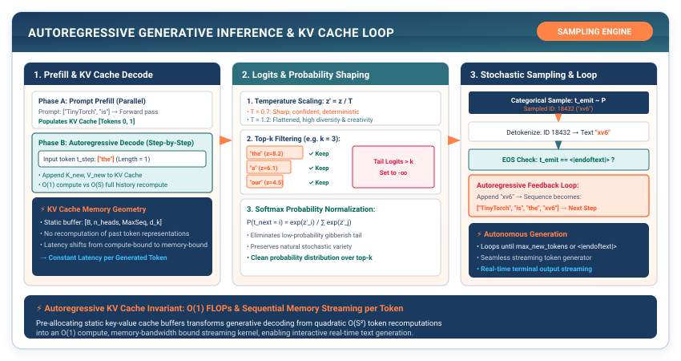

# Milestone II: Training TinyGPT and Generating Text {#sec-milestone-2}

Chapter 13 ended with `TinyGPT.forward`, which takes a sequence of token IDs and returns one row of logits per position. That is a model that can score continuations, not one that writes them, and nothing in Chapters 9 through 13 said where its training labels come from. This milestone answers the question a practitioner asks the first time they finish a model definition: how do I train this thing on plain text, and how do I get text back out of it?

Both halves of the answer are short. Training a language model needs no labels beyond the text itself, because the target at every position is the next token. Generating text is a loop: run the model, look at the last row of logits, pick one token, append it, and run again. The engineering that matters sits inside "pick one token," where two knobs, temperature and top-$k$, decide whether the output is dull, fluent, or nonsense (@fig-milestone2-loop).

::: {.callout-note title="Milestone Scope"}
Milestone II integrates Modules 09 through 13 (`packages/tinytorch/src/09_convolutions` through `packages/tinytorch/src/13_transformers`) with the Part I engine. The convolution module from Chapter 9 is exercised by the course's CNN milestone; this chapter uses the tokenizer, embeddings, attention, and transformer modules to train and sample a small GPT.
:::

{#fig-milestone2-loop}

---

## The Problem

Take a trained `TinyGPT`, feed it the prompt "TinyTorch is", and do the obvious thing: pick the highest-scoring token, append it, repeat.

```python
# The obvious decoder: always take the argmax
for _ in range(20):
    logits = model.forward(Tensor(np.array([token_ids])))   # [1, S, V]
    next_id = int(np.argmax(logits.data[0, -1]))            # last row, best score
    token_ids.append(next_id)
```

Run this on a small model and the output usually settles into a cycle within a dozen tokens: "TinyTorch is the model of the model of the model of the..." The reason is not a bug. Once the context ends in "of the," the single most likely next token is often the same word that produced "of the" a moment ago, and a decoder with no randomness has no way out of the cycle. This failure of **greedy decoding** (always taking the argmax) was documented at length by Holtzman and colleagues in 2019 under the title "The Curious Case of Neural Text Degeneration," and it shows up in large models as well as small ones.

The opposite extreme fails too. Suppose we sample from the model's full softmax distribution instead. Consider napkin math for a GPT-2 sized vocabulary of 50,257 tokens (Chapter 10). If the top 40 tokens hold 60 percent of the probability mass, the remaining 50,217 tokens share the other 40 percent. Each of those tail tokens is individually negligible, about 0.0008 percent on average, yet the sampler lands somewhere in the tail four times out of ten. The chance that a 20-token continuation never touches the tail is $0.6^{20} \approx 0.00004$. One tail token is enough to derail the rest, because everything generated afterward conditions on it.

Behind both failures sits a question this book has not yet answered. `TinyGPT` outputs a row of $V$ logits at every position. A classifier in Milestone I had one label per image. What is the label for position 7 of a sentence?

---

## The Idea

### The next token is the label

A language model assigns a probability to a whole token sequence by chaining conditional probabilities:

$$P(x_1, x_2, \dots, x_n) = \prod_{t=1}^{n} P(x_t \mid x_1, \dots, x_{t-1})$$

Here $x_t$ is the token at position $t$ and $P(x_t \mid x_1, \dots, x_{t-1})$ is the model's probability for it given everything before it. The causal mask from Chapter 12 guarantees that the logits at position $t$ were computed from tokens $1$ through $t$ only, so the row of logits at position $t$ is a prediction of $x_{t+1}$. The training target is therefore the input sequence shifted left by one token. A window of $S$ tokens gives $S$ separate predictions in one forward pass, and the loss is the cross-entropy of Chapter 4 averaged over all $B \times S$ positions in the batch.

### The generation loop

Generation reuses the same forward pass with no labels. Encode the prompt into token IDs. Run the model. Take the last row of logits, the prediction for the token after the prompt. Choose a token from it. Append that token to the sequence and run the model again on the longer sequence. Stop after a fixed number of tokens or when the model emits an end-of-sequence token. That is the whole model of generation; what it costs per iteration is a question for the code.

### Temperature

The choice inside the loop is where the two failures above get fixed. Let $\mathbf{z} \in \mathbb{R}^V$ be the last row of logits and $T > 0$ a scalar called the **temperature**. Dividing the logits by $T$ before the softmax gives

$$P_i = \frac{\exp(z_i / T)}{\sum_{j=1}^{V} \exp(z_j / T)}$$

where $P_i$ is the probability of token $i$. At $T = 1$ this is the ordinary softmax and the model's distribution is used as trained. Below 1 the gaps between logits grow, so the largest logit takes more of the mass and the output becomes more predictable. Above 1 the gaps shrink and the mass spreads out.

The limits are worth holding in mind. As $T \to 0$, every gap $z_i - z^*$ between a token and the maximum logit $z^*$ is divided by a vanishing number, so every non-maximum exponent goes to $-\infty$ and the distribution collapses onto the argmax. Greedy decoding is the zero-temperature limit. As $T \to \infty$, every $z_i / T \to 0$, all exponents become equal, and $P_i \to 1/V$, a uniform draw over the vocabulary.

### Top-$k$

Temperature reshapes the distribution but never removes the tail. **Top-$k$ filtering** does. Keep the $k$ largest logits and set every other logit to $-\infty$:

$$z_i' = \begin{cases} z_i & \text{if } z_i \text{ is among the } k \text{ largest} \\ -\infty & \text{otherwise} \end{cases}$$

Since $\exp(-\infty) = 0$, the discarded tokens have exactly zero probability after the softmax, and the remaining $k$ probabilities are renormalized to sum to one. With $k = 40$ on the napkin example above, the 40 percent tail vanishes and the sampler chooses only among tokens the model actually rates. Temperature and top-$k$ commute. Dividing by a positive $T$ does not change which $k$ logits are largest, so applying either first gives the same distribution.

---

## The Code

::: {.callout-note title="Source Code Mapping"}
Module 13 (`src/13_transformers/13_transformers.py`) is the NumPy-backed implementation students build in the TinyTorch course. Its `GPT` class (aliased `TinyGPT`) carries a `generate` method that samples with temperature only; it has no top-$k$ and does not crop the context. The course's integration script for this part of the book, `milestones/05_2017_transformer/01_vaswani_attention.py`, trains a small transformer on sequence reversal and copying tasks rather than on free text. The listings in this chapter are a stripped-down NumPy model of the same design, small enough to show every step of sampling and of next-token training; they call the `TinyGPT` and `BPETokenizer` classes as this book defined them in Chapters 13 and 10.
:::

### Picking one token

Every token a language model writes passes through one decision: given $V$ scores, which token comes next? A chat server makes that decision for every token of every reply, so it belongs in a function of its own, with the knobs as arguments. The Problem showed the two ways to get the decision wrong. Take the argmax and the model repeats itself; draw from the raw softmax over a GPT-2 sized vocabulary and the draw lands in the tail four times in ten.

There are two quieter ways to get it wrong, and both are arithmetic rather than statistics. The first is overflow. Logits come out of a real model in float32, and `exp` overflows float32 past about 88.7. A logit of 10 is ordinary. Divide it by a temperature of 0.1 and it is 100, `exp(100)` is `inf`, and the whole probability vector comes back `nan`. The second is the cost of finding the top $k$. The obvious way is to sort all $V$ logits and take the last $k$. On my machine, sorting 50,257 float64 values takes about 1.5 milliseconds, which is a lot of work for a question that only asks which value is the 40th largest, and it is paid once per generated token.

So the sampler has three jobs. Reshape the distribution with temperature and top-$k$ as the previous section defined them. Find the $k$-th largest logit without sorting. And take the softmax in a form that cannot overflow, which is the shift-by-the-maximum trick Chapter 4 already built.

```python
import numpy as np

def sample_next_token(logits, temperature=1.0, top_k=None, rng=None):
    """Pick one token ID from a vector of logits."""
    rng = rng or np.random.default_rng()
    z = np.asarray(logits, dtype=np.float64) / max(temperature, 1e-5)

    if top_k is not None and 0 < top_k < len(z):
        kth_largest = np.partition(z, -top_k)[-top_k]   # the k-th biggest value
        z = np.where(z < kth_largest, -np.inf, z)        # drop everything below it

    z = z - np.max(z)                                    # shift so exp cannot overflow
    probs = np.exp(z) / np.sum(np.exp(z))
    return int(rng.choice(len(probs), p=probs))
```

Two lines do the work. `np.partition(z, -top_k)[-top_k]` finds the $k$-th largest value in one pass over the vector (about 47 microseconds on the same 50,257 entries, a 30-fold gap over the sort), and the `np.where` sends everything below it to $-\infty$, which is the equation from The Idea written out. The cast to float64 on the first line moves the overflow cliff from 88.7 to about 709 but does not remove it; the subtraction of `np.max(z)` does, by making the largest exponent $\exp(0) = 1$, so nothing overflows however cold the temperature gets. That is also what makes the `max(temperature, 1e-5)` floor safe: a caller can pass `temperature=0` to ask for greedy decoding, the logits are divided by $10^{-5}$ instead of by zero, and the shift keeps the enormous result finite. Hugging Face's `TemperatureLogitsWarper` and `TopKLogitsWarper` are these same lines with a class around each.

### The loop

The loop is the part a user sees. Type a prompt into a chat window, and what comes back, one token at a time, is this function running on a server. `TinyGPT.forward` returns logits for every position of its input, so the obvious loop is short: run the model on everything so far, pick a token from the last row, append it, repeat. Two versions of that loop look right and are not. One decodes the growing sequence to a string each step and re-encodes it for the next forward pass. BPE merges depend on their neighbors (Chapter 10), so the tokenizer can split the text differently from how the model produced it, and the model ends up conditioning on tokens it never emitted. The other feeds the whole history without limit. The positional table from Chapter 11 has `max_seq_len` rows, and the first token past that row is an index error.

The loop is also more expensive than it looks, and I want the number in front of you before Chapter 18 makes it go away. Every iteration runs the full context through the model to read one row of logits. With a 12-token prompt and 20 new tokens, the contexts are 12, 13, and so on up to 31 tokens long, so 430 rows go through the model to produce 20 tokens, about 21 rows of work per token. All but one of those rows in every iteration recomputes something the previous iteration already computed. We accept that here. The fix is to keep integer IDs rather than strings, crop the context to the model's window, and, in Chapter 18, cache what the past rows produced.

This listing depends on `TinyGPT` from Chapter 13 and `BPETokenizer` from Chapter 10, so it does not run on its own.

```python
def generate_text(model, tokenizer, prompt, max_new_tokens=50,
                  temperature=0.8, top_k=40, max_context=32, rng=None):
    """Autoregressively extend a prompt, one token per forward pass."""
    token_ids = tokenizer.encode(prompt)

    for _ in range(max_new_tokens):
        context = token_ids[-max_context:]                   # the model's positional table has this many rows
        logits = model.forward(Tensor(np.array([context])))  # [1, S, V]
        last_row = logits.data[0, -1, :]                     # prediction for the next token
        token_ids.append(sample_next_token(last_row, temperature, top_k, rng))

    return tokenizer.decode(token_ids)
```

Notice what the loop does not do. It never looks at any logit row except the last one, even though the model computed all $S$ rows; that waste is the 430-row number above. It re-encodes nothing; token IDs accumulate as integers and are decoded once at the end. And it crops the context to `max_context`, which must equal the `max_seq_len` the model was built with, because the positional table has exactly that many rows. Hugging Face's `generate` is this loop with the sampler's knobs as keyword arguments and the cache of Chapter 18 already inside it.

### Building the training pairs

Milestone I trained a classifier, and the habit a classifier teaches is one example per input: a window of tokens in, one label out. Carry that habit over to a language model and it throws away almost everything the forward pass produced. `TinyGPT.forward` returns a row of logits at every one of the $S$ positions, and the causal mask has already made each row an honest prediction of the token after it. Score only the last row, and a 32-token window yields one training signal for a full forward pass. Score all of them, and the same pass yields 32. Same cost, 32 times the supervision. This is what the old name **teacher forcing**[^fn-teacher-forcing-windows] means: during training the model reads the true previous tokens rather than its own guesses, and every position is graded at once.

The label for position $t$ is the token at position $t + 1$, so the target sequence is the input sequence shifted left by one. That is all `make_windows` has to build. Cut the token stream into chunks of $S + 1$, hand out the first $S$ tokens as the input and the last $S$ as the target, and every window carries its own labels.

```python
def make_windows(token_ids, seq_len):
    """Slice one token stream into (input, target) pairs shifted by one."""
    inputs, targets = [], []
    for start in range(len(token_ids) - seq_len):
        chunk = token_ids[start : start + seq_len + 1]   # seq_len + 1 tokens
        inputs.append(chunk[:-1])                        # first seq_len
        targets.append(chunk[1:])                        # last seq_len
    return np.array(inputs, dtype=np.int64), np.array(targets, dtype=np.int64)
```

Each chunk is one token longer than the window so that the input and target overlap on all but their ends; @tbl-m2-window-trace in the worked trace shows it on six tokens. The windows start at every position, so consecutive windows overlap on all but one token. For a stream of 1,000 tokens and `seq_len=32`, that is nearly a thousand windows and about 62,000 stored integers for a corpus of 1,000, a 62-fold blow-up. On the five sentences below it is nothing. On a billion-token corpus it is the whole disk, which is why a production loader such as nanoGPT's never materializes the windows at all: it keeps the token stream in one memory-mapped file and cuts a batch of windows from random offsets on each step. Exercise 3 takes the first step in that direction.

[^fn-teacher-forcing-windows]: **Teacher forcing**: training a sequence model by feeding it the true tokens up to position $t$ and grading its prediction for $t + 1$, rather than feeding it its own earlier predictions. With a causal mask, every position in a window can be trained this way in one forward pass; the term is from Williams and Zipser (1989), where it named the same trick for recurrent networks.

### The training run

Now the Part I loop gets a language model in the middle. Every piece is already built: `BPETokenizer` (Chapter 10) turns the corpus into one token stream, `make_windows` turns the stream into pairs, `TinyGPT` (Chapter 13) turns a batch of windows into $[B, S, V]$ logits, and `CrossEntropyLoss` (Chapter 4) and `AdamW` (Chapter 7) do what they did in Milestone I. The listing is not standalone for that reason.

One seam does not fit. Chapter 4's `CrossEntropyLoss` takes a matrix of $[N, C]$ logits and a vector of $N$ integer labels, and the model hands back a three-dimensional block. The obvious repair is a Python loop over positions that calls the loss once per position and adds the results. With $B = 16$ and $S = 32$ that is 512 loss calls per step, each building its own softmax and its own slice of the autograd graph, for a quantity that is one mean over 512 numbers. The better repair uses the fact from the previous subsection: every position is its own prediction problem, so there is no reason the loss should know which positions came from which window. Reshape $[B, S, V]$ to $[B \cdot S, V]$ and $[B, S]$ to $[B \cdot S]$, and one loss call scores all 512 predictions. The reshape is a view of the contiguous logits buffer (Chapter 1), so it moves nothing.

```python
corpus = [
    "TinyTorch is the xv6 of machine learning systems.",
    "A machine learning framework is built from first principles.",
    "Tensors store contiguous memory buffers viewed through strides.",
    "Autograd walks the computation graph in reverse to compute gradients.",
    "Attention lets tokens exchange information across a sequence.",
]

tokenizer = BPETokenizer(vocab_size=320)          # 5 special + 256 bytes + 59 merges
tokenizer.train(corpus)
eos = tokenizer.special_tokens['<eos>']
stream = []
for line in corpus:
    stream += tokenizer.encode(line) + [eos]      # one long stream, sentences separated by <eos>

SEQ_LEN, BATCH = 32, 16
inputs, targets = make_windows(stream, SEQ_LEN)

model = TinyGPT(vocab_size=len(tokenizer.vocab), embed_dim=64,
                num_heads=4, num_layers=2, max_seq_len=SEQ_LEN)
loss_fn = CrossEntropyLoss()
opt = AdamW(model.parameters(), lr=3e-3, weight_decay=0.01)

for epoch in range(200):
    for start in range(0, len(inputs), BATCH):
        x = Tensor(inputs[start:start + BATCH])
        y = Tensor(targets[start:start + BATCH])
        logits = model.forward(x)                                   # [B, S, V]
        B, S, V = logits.data.shape
        loss = loss_fn(Tensor(logits.data.reshape(B * S, V)),       # every position is an example
                       Tensor(y.data.reshape(B * S)))
        loss.backward()
        opt.step()
        opt.zero_grad()

print(generate_text(model, tokenizer, "TinyTorch is", max_new_tokens=20, max_context=SEQ_LEN))
```

The one line that is new relative to Milestone I is the reshape. A classifier hands the loss $B$ rows and $B$ labels; a language model hands it $B \cdot S$ of each. Nothing else in the loop changes, and that is the point: the engine of Part I did not know it was training a classifier, and it does not need to know it is training a language model now. PyTorch's `F.cross_entropy` accepts the same $[N, C]$ matrix and the same flat label vector, and the reshape in every GPT training script, `logits.view(-1, V)`, is this line.

I have not measured this run, so I make no claim about the loss it reaches. There is one number you can check without measuring anything. A model that has learned nothing assigns each of the $V$ tokens probability $1/V$, and its cross-entropy is $\ln V = \ln 320 \approx 5.77$ per token. The first thing to watch is the loss dropping below that line.

### What the course script actually runs

The course's integration script for these modules, `01_vaswani_attention.py`, does not train on prose. It builds an `AttentionTransformer` from the Module 11 through 13 pieces (a Post-LN block with a ReLU feed-forward layer and no causal mask, since its tasks need every position to see every other) and puts the attention mechanism through three tests: reverse a six-letter sequence, copy it, and do either depending on a prefix token. Its pass thresholds are 95 percent sequence accuracy on reversal, 95 percent on copying, and 90 percent on the mixed task. The core of its training step is the same reshape this chapter just used.

```python
# Excerpt from milestones/05_2017_transformer/01_vaswani_attention.py (train_epoch)
logits = model(input_batch)                          # [B, S, V]
logits_2d = logits.reshape(-1, model.vocab_size)     # [B*S, V]
target_1d = target_batch.reshape(-1)                 # [B*S]
loss = loss_fn(logits_2d, target_1d)
loss.backward()
optimizer.step()
optimizer.zero_grad()

pred = np.argmax(logits.data, axis=-1)               # greedy is fine for a fixed-answer task
```

The last line is worth a pause, because it is the argmax that The Problem warned against, and here it is exactly right. Reversal has one correct output, so the argmax is the answer and sampling would only add errors. Temperature and top-$k$ exist for open-ended generation, where many continuations are acceptable and the goal is to pick a good one, not the one.

---

## A Worked Trace

Take a five-token vocabulary with raw logits $\mathbf{z} = [4.0, 2.0, 1.0, 0.0, -2.0]$ and push it through the sampler at several settings. Each column of @tbl-sampling-shaping-trace is one call to `sample_next_token` stopped just before the random draw.

| Token | Logit $z_i$ | $T = 1.0$ | $T = 0.5$ | $T = 2.0$ | Top-$k = 2$, $T = 0.8$ |
| :--- | :--- | :--- | :--- | :--- | :--- |
| A ("the") | $+4.0$ | $82.92\%$ | $97.93\%$ | $56.30\%$ | $92.41\%$ |
| B ("a") | $+2.0$ | $11.22\%$ | $1.79\%$ | $20.71\%$ | $7.59\%$ |
| C ("this") | $+1.0$ | $4.13\%$ | $0.24\%$ | $12.56\%$ | $0$ (filtered) |
| D ("of") | $0.0$ | $1.52\%$ | $0.03\%$ | $7.62\%$ | $0$ (filtered) |
| E ("cat") | $-2.0$ | $0.21\%$ | $0.00\%$ | $2.80\%$ | $0$ (filtered) |
| Entropy (bits) | | $0.88$ | $0.16$ | $1.74$ | $0.39$ |

: Probabilities the sampler draws from for one logit vector under four settings. {#tbl-sampling-shaping-trace tbl-colwidths="[18,14,17,17,17,17]"}

Reading across a row shows what each knob does. Cooling to $T = 0.5$ doubles every logit gap, and token A goes from 83 percent to 98 percent. Heating to $T = 2.0$ halves the gaps and the tail token E, which had a 1-in-500 chance, now has a 1-in-36 chance. Top-$k = 2$ sends C, D, and E to exactly zero and splits their mass between A and B in proportion to $\exp(z_A / T)$ and $\exp(z_B / T)$. The entropy row, the information-theoretic entropy of each column in bits, is the one-number summary. At $T = 0.5$ the 0.16 bits are close to deterministic; at $T = 2.0$ the 1.74 bits approach the $\log_2 5 \approx 2.32$ bits of a uniform draw.

I did not type the table in; it comes out of the sampler's own arithmetic, stopped before the draw, and the two asserts at the end pin the numbers I quoted above.

```python
import numpy as np
np.set_printoptions(suppress=True)

z = np.array([4.0, 2.0, 1.0, 0.0, -2.0])

def shaped_probs(z, temperature=1.0, top_k=None):
    z = z / temperature
    if top_k is not None:
        z = np.where(z < np.partition(z, -top_k)[-top_k], -np.inf, z)
    e = np.exp(z - np.max(z))
    return e / e.sum()

for label, p in [("T=1.0", shaped_probs(z, 1.0)),
                 ("T=0.5", shaped_probs(z, 0.5)),
                 ("T=2.0", shaped_probs(z, 2.0)),
                 ("top-k=2, T=0.8", shaped_probs(z, 0.8, top_k=2))]:
    print(f"{label:16s}", np.round(p * 100, 2))

assert np.isclose(shaped_probs(z, 0.5)[0] * 100, 97.93, atol=0.01)
assert np.isclose(shaped_probs(z, 0.8, top_k=2)[0] * 100, 92.41, atol=0.01)
```

The training side has a trace too, and it is even smaller. Slice the token stream $[7, 3, 9, 4, 12, 5]$ with `make_windows(stream, seq_len=4)`:

| Window | Input | Target |
| :--- | :--- | :--- |
| 0 | $[7, 3, 9, 4]$ | $[3, 9, 4, 12]$ |
| 1 | $[3, 9, 4, 12]$ | $[9, 4, 12, 5]$ |

: Input and target windows for a six-token stream with `seq_len=4`. {#tbl-m2-window-trace tbl-colwidths="[20,40,40]"}

Position 2 of window 0 holds token 9, and its target is 4, the token that follows 9 in the stream. The causal mask ensures that the logits at that position were computed from $[7, 3, 9]$ alone, so the model is being asked the only fair question: given these three tokens, what comes next?

---

## From TinyTorch to Production

The loop in this chapter is, step for step, what a production server does. What differs is what each step costs, and the difference splits inference into two regimes that production systems treat separately.

| | Prefill (the prompt) | Decode (each new token) |
| :--- | :--- | :--- |
| Tokens per forward pass | All $S$ prompt tokens at once | One |
| Shape of each weight multiply | $[S \times D] \cdot [D \times D]$ | $[1 \times D] \cdot [D \times D]$ |
| Arithmetic per weight loaded | $2S$ FLOPs per weight | 2 FLOPs per weight |
| What limits speed | Arithmetic throughput | Memory bandwidth |

: The two phases of generation and why they stress different parts of the hardware. {#tbl-m2-inference-regimes tbl-colwidths="[30,35,35]"}

During **prefill**, the prompt's $S$ tokens go through the model in one pass, and every weight matrix is multiplied against $S$ rows at once. Each weight loaded from memory participates in $2S$ floating-point operations, so the arithmetic units stay busy. During **decode**, the loop above runs the model on a context whose new content is a single token. Every weight in the model must still be read from memory, but each one now does two operations against a single row before it is discarded. This is the memory-bound regime that Chapters 1 and 2 named, and it is where a generating model spends almost all of its time.

::: {#nbk-m2-autoregressive-memory-bandwidth .callout-notebook title="Napkin math: the decode ceiling for a 7-billion-parameter model"}
Take a 7B-parameter model stored in 16-bit floats (2 bytes per parameter), served one request at a time, on a GPU whose vendor peak figures are 312 TFLOP/s of 16-bit arithmetic and 2 TB/s of memory bandwidth (NVIDIA's published A100 numbers).

- Weights to read per token: $7 \times 10^9 \times 2 \text{ bytes} = 14 \text{ GB}$.
- Ceiling on token rate from bandwidth alone: $2000 \text{ GB/s} \div 14 \text{ GB} \approx 143 \text{ tokens/s}$.
- Arithmetic per token: $2 \times 7 \times 10^9 = 14 \text{ GFLOP}$, so $143 \text{ tokens/s} \times 14 \text{ GFLOP} \approx 2 \text{ TFLOP/s}$.
- Fraction of peak arithmetic used: $2 / 312 \approx 0.6\%$.

These are peak-spec estimates, not measurements, and real systems land below the ceiling. The shape of the conclusion survives any reasonable correction. At batch size one, more than 99 percent of the arithmetic hardware is idle, waiting on weights.
:::

Production systems attack this from three directions, and each one is a change to the loop rather than to the math. The first is batching. If 32 requests are decoding at once, each weight read from memory serves 32 rows instead of one, and the arithmetic per byte rises 32-fold for free. Servers such as vLLM and TensorRT-LLM run **continuous batching**, which slips a new request into the running batch the moment another finishes rather than waiting for a whole batch to complete. Caching attacks the work the loop repeats. Each iteration of `generate_text` recomputes attention keys and values for every past token; Chapter 18 builds the KV cache that stores them, and vLLM's PagedAttention manages that cache in fixed-size blocks the way an operating system manages memory pages, so thousands of concurrent sequences can share one pool without fragmenting it. **Speculative decoding** comes at the idle arithmetic from the other side. It uses a small draft model to propose several tokens cheaply and then runs the large model once, prefill-style, over all of them, accepting each proposed token with a probability chosen so that the final distribution equals what the large model alone would have produced. It trades an idle arithmetic unit for fewer trips through memory.

What carries over unchanged is the sampler. PyTorch's `torch.softmax(logits / T, dim=-1)` is the temperature step of this chapter, and Hugging Face's `generate(temperature=0.8, top_k=40)` runs the exact arithmetic of `sample_next_token` on the last row of logits. Production adds two more knobs of the same kind: top-$p$ sampling,[^fn-top-p-nucleus-bridge] which keeps the smallest set of tokens whose probabilities sum to $p$ rather than a fixed count, and a repetition penalty that scales down the logits of tokens already in the context. Both are a few lines in the same place `top_k` lives.

A practitioner now has a vocabulary for what they will see in a serving dashboard. Time to first token[^fn-ttft-bridge] is the prefill phase; it grows with prompt length and is compute-bound. Time per output token is the decode phase; it is nearly flat in prompt length at small batch sizes and is bandwidth-bound. Throughput in tokens per second rises with batch size until the batch is large enough that the arithmetic units are finally the limit. And when a model's output looks repetitive, the first thing to check is the temperature, not the model.

[^fn-top-p-nucleus-bridge]: **Top-$p$ sampling** (also called nucleus sampling): sort the probabilities in descending order, keep the shortest prefix whose sum reaches $p$, and renormalize. With $p = 0.9$, a confident distribution might keep 3 tokens and an uncertain one 300, which is the adaptivity a fixed $k$ lacks.

[^fn-ttft-bridge]: **Time to first token** (TTFT): the wall-clock delay between sending a prompt and receiving the first generated token, which is the cost of the prefill pass. Serving benchmarks report it separately from per-token latency because a 2,000-token prompt can make it several hundred milliseconds even when each later token arrives in tens of milliseconds.

---

## Summary

This milestone turned the `TinyGPT` of Chapter 13 into a system that trains on plain text and writes text back. Training needs no labels beyond the text itself, because the target at every position is the next token, and one forward pass over a window of $S$ tokens yields $S$ training examples that the causal mask keeps honest. Generation is a loop that runs the model, reads the last row of logits, samples one token, and appends it. Inside that loop, temperature divides the logits to sharpen or flatten the distribution, and top-$k$ sets the tail to exactly zero; greedy decoding is the zero-temperature limit and fails on open-ended text by repeating itself. The invariant to carry forward is that every generated token costs a full forward pass over the whole context, and in that pass every weight in the model is read from memory to do almost no arithmetic. Chapter 14 takes for granted that `TinyGPT` trains and generates text, and asks why each generated token is so slow.

---

## Exercises

1. Run `shaped_probs` from the worked trace at $T = 0.1$ and $T = 10$ on the same logits and confirm the two limits: the first column should be within 0.01 percent of $[100, 0, 0, 0, 0]$ and the second within a percentage point of uniform. At what $T$ does token A first drop below 50 percent?

2. `sample_next_token` applies temperature before top-$k$. Swap the order in a copy of the function and show, on the logits from @tbl-sampling-shaping-trace, that the returned probabilities are identical for every $(T, k)$ pair. Then explain in one sentence why the two orders could differ if `top_k` selected by probability threshold rather than by count.

3. Modify `make_windows` to stride by `seq_len` instead of by one, so that windows do not overlap. For a stream of 1,000 tokens and `seq_len=32`, how many training windows does each version produce, and how many times does each token appear as a target under each? Which version does a production data loader use, and what does it lose?
