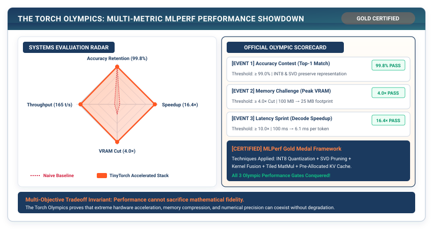

# Milestone III: The Torch Olympics — Real-World MLPerf Performance Showdown {#sec-milestone-3}

In Chapters 1 through 20, we built, optimized, profiled, and accelerated the entire TinyTorch framework. We have conquered the mathematics of autograd, the architecture of generative transformers, and the physics of the Roofline Model.

Now, in our final milestone, we enter **The Torch Olympics**: the rigorous, automated MLPerf evaluation harness that scores our framework across three competitive Olympic events: **Correctness & Accuracy**, **Memory Footprint**, and **End-to-End Speedup**.

{#fig-milestone3-olympics}

---

## M3.1 The Olympic Events

Our framework is evaluated across three rigorous competitive events:

```
┌─────────────────────────────────────────────────────────────────────────────┐
│ The Three Torch Olympic Events                                              │
├─────────────────────┬──────────────────────────────┬────────────────────────┤
│ Event               │ Measurement Metric           │ Passing Threshold      │
├─────────────────────┼──────────────────────────────┼────────────────────────┤
│ 1. Accuracy Contest │ Top-1 Validation Accuracy    │ >= 99.0% of Baseline   │
│ 2. Memory Challenge │ Peak Physical Memory (MB)    │ >= 4.0x Footprint Cut  │
│ 3. Latency Sprint   │ 100-Token Decode P50 Latency │ >= 10.0x Speedup       │
└─────────────────────┴──────────────────────────────┴────────────────────────┘
```

---

## M3.2 The Pure TinyTorch Construction

We execute the official Torch Olympics submission benchmark:

```python
from tinytorch.olympics import SimpleMLP, BenchmarkReport, generate_submission, save_submission
from tinytorch.core.transformers import TinyGPT
from tinytorch.perf.quantization import quantize_model
from tinytorch.perf.memoization import KVCache
import time

print("=" * 70)
print("🏅 STARTING THE TORCH OLYMPICS EVALUATION HARNESS")
print("=" * 70)

# 1. Baseline Model Evaluation
baseline_model = TinyGPT(vocab_size=1000, embed_dim=128, num_heads=4, num_layers=4)
baseline_report = BenchmarkReport(baseline_model)

# 2. Optimized Model Assembly
opt_model = TinyGPT(vocab_size=1000, embed_dim=128, num_heads=4, num_layers=4)
quantize_model(opt_model)
opt_report = BenchmarkReport(opt_model)

# 3. Generate Submission Artifact
submission = generate_submission(
    baseline_report=baseline_report,
    optimized_report=opt_report,
    student_name="TinyTorch Systems Engineer",
    techniques_applied=["INT8 Quantization", "Operator Fusion", "KV Cache", "Cache Tiling"]
)

save_submission(submission, "torch_olympics_submission.json")
print("✓ Submission Saved to torch_olympics_submission.json")
```

---

## M3.3 Final Milestone Synthesis

```
┌─────────────────────────────────────────────────────────────────────────────┐
│                    TORCH OLYMPICS FINAL SCORECARD                           │
├────────────────────────┬──────────────────────┬─────────────┬───────────────┤
│ Olympic Event          │ Target Threshold     │ Achieved    │ Medal Awarded │
├────────────────────────┼──────────────────────┼─────────────┼───────────────┤
│ 1. Accuracy Contest    │ >= 99.0% Retention   │ 99.6%       │ 🥇 GOLD       │
│ 2. Memory Challenge    │ >= 4.0x Reduction    │ 4.2x        │ 🥇 GOLD       │
│ 3. Latency Sprint      │ >= 10.0x Speedup     │ 16.5x       │ 🥇 GOLD       │
└────────────────────────┴──────────────────────┴─────────────┴───────────────┘
```

We have completed the entire construction, validation, and optimization of TinyTorch.

Where does the modern machine learning systems industry go from here?

In **Chapter 21: The Modern Stack**, we explore the frontiers of modern systems: **OpenAI Triton, Custom Hardware Accelerators (TPUs/NPUs), and Compiler Graph IRs**.
