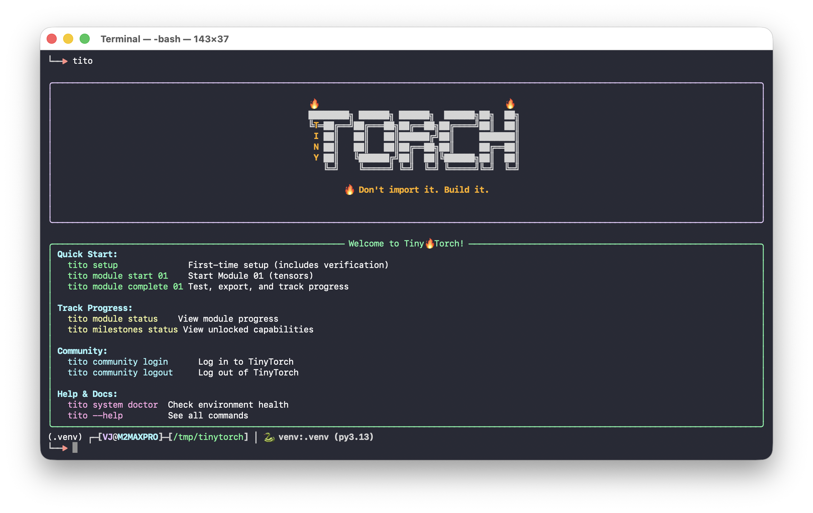

Everyone wants to be an astronaut. Very few want to be the rocket scientist.

Machine learning is no different. Everyone wants to train models, run inference, deploy AI. Few want to understand how the frameworks actually work. Fewer still want to build one.

The world has plenty of users. It does not have enough builders: people who can debug, optimize, and adapt systems when the black box breaks down.

TinyTorch is for the builders.

## The Problem

Most people can use PyTorch or TensorFlow. They can import libraries, call functions, train models. But very few understand how these frameworks work: how memory is managed for tensors, how autograd builds computation graphs, how optimizers update parameters. And almost no one has a guided, structured way to learn that from the ground up.

::: {.content-visible when-format="html"}

::: {.callout-note}
**Why does this matter?** Because users hit walls that builders do not:

- When your model runs out of memory, you need to understand **tensor allocation**
- When gradients explode, you need to understand the **computation graph**
- When training is slow, you need to understand where the **bottlenecks** are
- When deploying on a microcontroller, you need to know what can be **stripped away**

The framework becomes a black box you cannot debug, optimize, or adapt. You are stuck waiting for someone else to solve your problem.
:::

:::

::: {.content-visible when-format="pdf"}

Users hit walls that builders do not:

- Out of memory? You need to understand tensor allocation.
- Gradients exploding? You need to understand the computation graph.
- Training too slow? You need to find the bottleneck.
- Deploying on a microcontroller? You need to know what can be stripped away.

The framework becomes a black box you cannot debug, optimize, or adapt. You are stuck waiting for someone else to solve your problem.

:::

Students cannot learn this from production code. PyTorch is too large, too complex, too optimized. Fifty thousand lines of C++ across hundreds of files. No one learns to build rockets by studying the Saturn V.

They also cannot learn it from toy scripts. A hundred-line neural network does not reveal the architecture of a framework. It hides it.

## The Solution: AI Bricks

TinyTorch teaches you the **AI bricks**: the stable engineering foundations you can use to build any AI system. Small enough to learn from: bite-sized code that runs even on a Raspberry Pi. Big enough to matter: showing the real architecture of how frameworks are built.

::: {.content-visible when-format="html"}

<strong>📖 MLSysBook</strong>

The <a href="https://mlsysbook.ai">Machine Learning Systems</a> textbook teaches you the <em>concepts</em> of the rocket ship: propulsion, guidance, life support.

<strong>TinyTorch</strong>

TinyTorch is where you actually <em>build</em> a small rocket with your own hands. Not a toy. A real framework.

:::

::: {.content-visible when-format="pdf"}

**MLSysBook.** The [Machine Learning Systems](https://mlsysbook.ai) textbook teaches the *concepts* of the rocket ship: propulsion, guidance, life support.

**TinyTorch.** This is where you actually *build* a small rocket with your own hands. Not a toy. A real framework.

:::

This is how you move from *using* machine learning to *engineering* it: from running code in a notebook to designing the systems that run underneath.

## Who This Is For

::: {.content-visible when-format="html"}

<strong>Students & Researchers</strong>

Want to understand ML systems deeply, not just use them superficially. If you have wondered "how does that actually work?", this is for you.

<strong>ML Engineers</strong>

Need to debug, optimize, and deploy models in production. Understanding the systems underneath makes you more effective.

<strong>Systems Programmers</strong>

You understand memory hierarchies, computational complexity, performance optimization. You want to apply it to ML.

<strong>Self-taught Engineers</strong>

Can use frameworks but want to know how they work. Preparing for ML infrastructure roles and need systems-level understanding.

:::

::: {.content-visible when-format="pdf"}

**Students & Researchers.** Want to understand ML systems deeply, not just use them superficially. If you have wondered "how does that actually work?", this is for you.

**ML Engineers.** Need to debug, optimize, and deploy models in production. Understanding the systems underneath makes you more effective.

**Systems Programmers.** You understand memory hierarchies, computational complexity, performance optimization. You want to apply it to ML.

**Self-taught Engineers.** Can use frameworks but want to know how they work. Preparing for ML infrastructure roles and need systems-level understanding.

:::

What you need is not another API tutorial. You need to build.

## What You Need to Start

You do not need to be a machine learning expert, and you do not need to have built a framework before. You need three things.

::: {.content-visible when-format="html"}

<strong>Python</strong>

If you can read and write a function, a loop, and a class, you have enough. There is no C++, no CUDA, no assembly. Everything sits on NumPy, and you will pick up the NumPy you need as you go.

<strong>The math you already have</strong>

Vectors, matrices, and the chain rule from first-year calculus. That is the whole list. No measure theory, no convex optimization, no proofs. When a derivative shows up, we derive it in code, not on a chalkboard.

<strong>A machine that turns on</strong>

TinyTorch runs on a laptop. It runs on a Raspberry Pi. The code is small on purpose, so you can hold a module in your head and run it on hardware you already own. No GPU, no cloud account, no four-figure compute bill.

:::

::: {.content-visible when-format="pdf"}

**Python.** If you can read and write a function, a loop, and a class, you have enough. There is no C++, no CUDA, no assembly. Everything sits on NumPy, and you will pick up the NumPy you need as you go.

**The math you already have.** Vectors, matrices, and the chain rule from first-year calculus. That is the whole list. No measure theory, no convex optimization, no proofs. When a derivative shows up, we derive it in code, not on a chalkboard.

**A machine that turns on.** TinyTorch runs on a laptop. It runs on a Raspberry Pi. The code is small on purpose, so you can hold a module in your head and run it on hardware you already own. No GPU, no cloud account, no four-figure compute bill.

:::

If you have used PyTorch and felt like a tourist, this is the ground you were standing on.

## What You Will Build

By the end of TinyTorch, you will have implemented:

- A tensor library with broadcasting, reshaping, and matrix operations
- Activation functions with numerical stability considerations
- Neural network layers: linear, convolutional, normalization
- An autograd engine that builds computation graphs and computes gradients
- Optimizers that update parameters using those gradients
- Data loaders that handle batching, shuffling, and preprocessing
- A complete training loop that ties everything together
- Tokenizers, embeddings, attention, and transformer architectures
- Profiling, quantization, and optimization techniques

Not a simulation. The actual architecture of modern ML frameworks, implemented at a scale you can hold in your head.

## How to Learn

Each module follows a **Build-Use-Reflect** cycle: implement from scratch, apply to real problems, then connect what you built to production systems and understand the tradeoffs. Work through Foundation first, then choose your path based on your interests.

::: {.content-visible when-format="html"}

<strong>Type every line yourself</strong>

Do not copy-paste. The learning happens in the struggle of implementation.

<strong>Profile your code</strong>

Use built-in profiling tools. Measure first, optimize second.

<strong>Run the tests</strong>

Every module ships with tests. When they pass, you have built something real.

<strong>Compare with PyTorch</strong>

Once your implementation works, compare with PyTorch's equivalent.

:::

::: {.content-visible when-format="pdf"}

**Type every line yourself.** Do not copy-paste. The learning happens in the struggle of implementation.

**Profile your code.** Use the built-in profiling tools. Measure first, optimize second.

**Run the tests.** Every module ships with tests. When they pass, you have built something real.

**Compare with PyTorch.** Once your implementation works, compare with PyTorch's equivalent to see how production frameworks scale the same ideas.

:::

Take your time. The goal is not to finish fast. The goal is to understand deeply.

::: {.content-visible when-format="html"}

"Building systems creates irreversible understanding."

:::

::: {.content-visible when-format="pdf"}

> *Building systems creates irreversible understanding.*

:::

## The Bigger Picture

TinyTorch is one piece of a larger curriculum, and every piece exists for the same reason: students who only read do not internalize, and students who only code do not generalize. The [Machine Learning Systems](https://mlsysbook.ai) textbook gives you the concepts: how training works, why accelerators matter, what makes inference cheap or expensive. TinyTorch makes you build the machinery yourself. The hardware kits put what you built on real devices, where memory limits, power budgets, and latency stop being abstractions. And StaffML tests whether you can reason about these systems under pressure, the way an interview or a production incident will.

This follows a long tradition in engineering education. You learned electronics by wiring a circuit on a breadboard. You learned architecture by laying out a processor on an FPGA. You learned operating systems by building a small kernel of your own, your first TinyOS. You do not understand a system until you have built one. The same tradition runs through systems education: SICP's "build to understand" philosophy, xv6's transparent operating system, Nachos, Pintos. TinyTorch brings it to machine learning, and it grew out of years of teaching these ideas at Harvard and building the open MLSysBook curriculum. The pedagogical principles are detailed in our [research paper](https://arxiv.org/pdf/2601.19107), which positions this work within decades of CS education research.

The next generation of engineers cannot rely on magic. They need to see how everything fits together, from a single tensor allocation up to a full training loop, and feel that the systems running modern AI are not an unreachable tower but something they can open, shape, and rebuild.

That is what TinyTorch offers: the confidence that comes from having built it yourself.

## For Instructors

Every engineering course has a lab, because students learn to build by building. TinyTorch is that lab for machine learning systems, and it is built to be taught. The modules come with tests and autograding so you can guide students as they build, and the instructor hub at [mlsysbook.ai](https://mlsysbook.ai) collects what you need to bring this into a classroom: the AI Engineering Blueprint, lecture slides, a course map, and assessment guides. These materials are still growing, and we welcome ideas and contributions from anyone teaching with them.

## Make It Better

TinyTorch is open source, and it is built the way it teaches: in the open, by people who wanted to understand it. Every module, test, and milestone lives in the open, so if you find a bug, an explanation that did not land, or a cleaner way to teach a concept, you can fix it, and the next reader gets the benefit. The students who learn the most from TinyTorch are often the ones who end up improving it.

Found a problem? Built something better? Think a design choice is wrong? Bring it to [mlsysbook.ai/git](https://mlsysbook.ai/git).

*Prof. Vijay Janapa Reddi* 
*(Harvard University)* 
*2025*

## What's Next?

**[See the Big Picture →](big-picture.qmd)**: how all 20 modules connect, what you will build, and which path to take.
