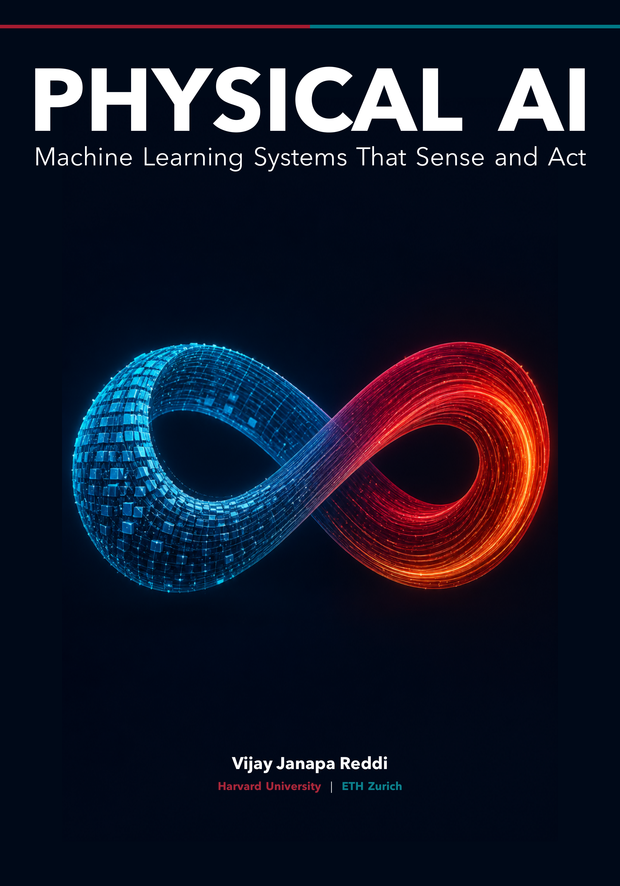

<p align="center">
  
</p>

<h1 align="center">Physical AI</h1>
<p align="center"><em>Machine Learning Systems That Sense and Act</em></p>
<p align="center">Harvard University · ETH Zurich</p>

**Open textbook, curriculum, and hardware studio** for machines where learned software may act in the physical world.

| | |
| --- | --- |
| **Portal** | [physical.mlsysbook.ai](https://physical.mlsysbook.ai) |
| **Course syllabus (students)** | [`course/README.md`](course/README.md) — GitHub renders this page |
| **Book (Quarto)** | [`book/`](book/) — preface, chapters, HTML/PDF build |
| **Labs** | [`labs/`](labs/) — kit contracts |
| **Author** | Prof. Vijay Janapa Reddi (Harvard / ETH Zurich) · [vj@eecs.harvard.edu](mailto:vj@eecs.harvard.edu) |

> TinyML taught you how to deploy a neural model to a microchip. Physical AI teaches you how to build an intelligent, safe machine under physical and resource laws.

**Repo layout in one line:** syllabus lives as Markdown under `course/`; the book is its own Quarto project under `book/`; labs are separate. You do not need a special HTML syllabus skin—GitHub (or any Markdown preview) is enough for the course page.


## The Big Picture: What is Physical AI Systems?

Standard machine learning ends at digital output. A classifier emits a label; a large language model emits text. In the digital realm, errors are harmlessly contained behind glass: transactions roll back, exceptions are caught, and dropped packets are retried.

**Physical AI Systems begin at the exact moment digital software commands physical actuators—accelerating mass, consuming energy, and permanently altering the state of the world ($W_t \to W_{t+1}$).**

Because physical actions cannot be rewound (**you cannot `ctrl+z` kinetic momentum or Joule heat**), this textbook and course answer one central systems question:

> **"What must the surrounding system know, measure, enforce, preserve, and prove before an unverified learned proposal may produce a physical consequence?"**


## The Three Universal Defining Properties of Physical AI

Across robotics, autonomous mobility, smart energy grids, and industrial automation, an engineered system is defined as **Physical AI** if and only if it satisfies three universal criteria:

| Property | Core Physical & Computational Principle | Systems Reality & Contrast |
| :--- | :--- | :--- |
| **1. Learned Foundation Component** | Incorporates high-capacity learned foundation models (Vision-Language-Action models, Latent World Models, Diffusion Policies) | Does not rely on rigid hardcoded if-then state machines; generalizes over unstructured, open-world environmental variability. |
| **2. Operations Across the Analog $\longleftrightarrow$ Digital Boundary** | Discrete software representations (tokens, embeddings, floating-point tensors) directly govern continuous analog energy fluxes | Digital clock ticks command 3-phase inverter MOSFETs, electromagnetic coil flux, hydraulic valves, and kinetic momentum. |
| **3. Governed by Irreversible Physical Laws** | Operates under strict physical conservation laws (conservation of energy, momentum $p=mv$, Joule heating $I^2R$, kinematic friction) | **Zero undo mechanism:** You cannot roll back a physical collision, rewind motor coil overheating, or catch a dropped glass with a software exception handler. |

: The Three Universal Defining Properties of Physical AI. {#tbl-defining-properties}


## The Three Canonical Archetypes

To ensure broad engineering generalization beyond any single robotics niche, every concept in this curriculum is anchored across **Three Canonical Archetypes** and a dedicated **Desk Bench Twin**:

| Archetype | Primary Physical Action | Representative Industrial Systems | Core Systems Challenge |
| :--- | :--- | :--- | :--- |
| **Archetype 1: Locomotion & Mobility** | Free-Space Movement & Spatial Navigation | Autonomous Vehicles (Waymo), High-Speed Delivery Drones (Skydio), Quadrupeds (Spot) | Tail latency ($P_{99}$) and dynamic stopping envelopes ($d_{\text{stop}}$) under high-speed kinetic momentum. |
| **Archetype 2: Contact Manipulation** | Touching, Shaping & Assembling Matter | Humanoid Robots (Optimus, Figure), 6-DoF Industrial Arms, Surgical Robots | Discontinuous contact transitions, torque rate limits ($\dot{\boldsymbol{\tau}}$), and harmonic drive gearbox shear. |
| **Archetype 3: Cybernetic Process & Energy** | Continuous State & Flow Regulation | Smart Grid Power Inverters, EV Battery Management Systems (BMS), Dialysis Pumps | Microsecond AC phase tracking, $I^2R$ Joule heating, and electrochemical thermal runaway prevention. |
| **The Desk Bench Twin (The Lab Kit)** | Precision Dual-Brain Desktop Pick-and-Place | **Arduino UNO Q Dual-Brain Kit** (Linux Application MPU + Cortex-M4 MCU + MIPI Camera) | Zero-magic laboratory realization grounding every architectural contract on real bench silicon. |

: The Three Canonical Archetypes and the Desk Bench Twin. {#tbl-canonical-archetypes}


## The Grand Systems Conflict: Less Time vs. More Time

The foundational tension of Physical AI is the structural collision between two opposing vectors:

```
 THE FUNDAMENTAL TUG-OF-WAR IN PHYSICAL AI

 PHYSICS & HARDWARE LAWS COGNITIVE FOUNDATION MODELS
 (Chapter 2: The Physical Columns) (Chapter 3: The Cognitive Rows)
 ───────────────────────────────────── ─────────────────────────────────────
 • LESS TIME IS BETTER ($t \to 0$) • MORE TIME IS BETTER ($t \to \infty$)
 • Moving mass travels ($v \cdot \Delta t$) • Foundation models need FLOPs & tokens
 • Stator coils heat ($I^2 R$) • Spatial transformers need self-attention
 • Sensor evidence decays instantly • Diffusion policies need denoising steps
 • Phase margin erodes ($e^{-s T_d}$) • VLMs need chain-of-thought reasoning
 • "Act in 1 ms or the arm collides!" • "Give me 500 ms to resolve ambiguity!"
```

### The Resolution: The Three Cadences of Intelligence

Physical AI reconciles this conflict by decoupling execution across **three asynchronous temporal cadences** hosted on heterogeneous silicon:

| Temporal Tier | Cadence & Frequency | Silicon Substrate | Operating System | Primary Systems Role | Privilege Tier |
| :--- | :---: | :--- | :--- | :--- | :--- |
| **System 2: Semantic Deliberation** | $0.5\text{--}2\text{ Hz}$ ($500\text{--}2000\text{ ms}$) | Multi-Core Host (Linux MPU / Cloud) | Embedded Linux (`PREEMPT_RT`) | Open-world goal decomposition & VLM scene reasoning | **Untrusted Proposal Service** (Emits Expiring Intent Leases $\mathcal{L}_{\text{intent}}$) |
| **System 1.5: Trajectory Decoding** | $20\text{--}50\text{ Hz}$ ($20\text{--}50\text{ ms}$) | Edge NPU / Tensor Accelerator | Linux User Space (`SCHED_FIFO`) | Multi-step action chunking (ACT / Diffusion) & $\mathcal{C}^2$ jerk splines | **Candidate Trajectory Generator** (Emits $H=16$ Waypoint Chunks) |
| **System 1: Real-Time Reflex** | $1000\text{ Hz}$ ($1.0\text{ ms} \pm 5\,\mu\text{s}$) | Dedicated Bare-Metal MCU (Cortex-M4) | Bare-Metal / FreeRTOS (Static Memory) | 1 kHz Control Barrier Functions (CBF), dynamic stopping ($d_{\text{stop}}$), & $20\text{ kHz}$ FOC | **Sole Hardware Permission Authority** (Holds Inverter PWM Locks) |

: The Three Cadences of Intelligence. Decoupling cognitive speeds across heterogeneous silicon. {#tbl-three-cadences}


## The Grand Map: The Physical AI Co-Design Matrix

The curriculum and book are organized around the **$5 \times 5$ Co-Design Matrix**, formed by crossing the **five cognitive obligations (Chapter 3 rows)** with the **five physical constraints (Chapter 2 columns)**. Each cell is a question Part II answers, and the grid is deliberately uneven: where a column does not reach a row, saying so is part of the lesson.

| Cognitive Row | C1: Time & Freshness | C2: Inertia & Stopping | C3: Actuation Limits | C4: Energy & Thermal | C5: Silicon Determinism | Owning Chapter |
| :--- | :--- | :--- | :--- | :--- | :--- | :--- |
| **Perceive** | When did this observation happen? | How far ahead must you see? | *Not binding* | What does sensor heat do to geometry? | **What does moving the pixels cost?** | **Ch 4** |
| **Remember** | **What is a belief worth after $\Delta t$?** | How much world must you hold? | *Thin* | Which calibration drifts with heat? | Bounded state without allocation | **Ch 5** |
| **Reason** | **How long may intent outlive its world?** | *Not binding at this cadence* | *Not binding* | What does throttling do to a deadline? | Keeping a large model off the real-time core | **Ch 6** |
| **Plan** | Outliving the latency that produced it | What makes a plan abandonable? | **What shapes may a command take?** | What does a legal motion cost per shift? | *Thin* | **Ch 7** |
| **Execute** | The deadline, and the cycle it is missed | **How much margin does stopping need?** | Can the veto violate the limit it protects? | What clamps current the policy asked for? | Code that may never pause | **Ch 8** |

: The Physical AI Co-Design Matrix. Five cognitive obligations against five physical constraints. Bold marks each chapter's dominant cell. {#tbl-codesign-matrix}

Columns 3 and 4 are often taught as one. They are separated because they bind different rows: actuation limits reach only the stages that command motion, while heat reaches the sensor mount, the inference accelerator, and the motor alike.


## The 4-Pillar Pedagogical Formula for Part II (Chapters 4–8)

Every chapter in Part II systematically conquers one row of the matrix using a standardized **4-Pillar Pedagogical Formula**:

1. **The Model Standpoint:** The machine learning representation, foundation model algorithm, and mathematical formulation (ViTs, latent JEPAs, VLMs, ACT/Diffusion, CBFs).
2. **The Silicon & System Substrate:** The physical execution target (MPU vs. NPU vs. MCU), DRAM crossbar contention, DMA memory channels, cache line invalidations, and allocation rules.
3. **The Timing Cadence & Multi-Rate Mapping:** The operational clock frequency, synchronization mechanisms (PTP exposure midpoints, delay amortization), and IPC mailboxes.
4. **The Physical Invariant & Safety Constraint:** The mathematical conservation laws, geometric bounds, and safety filters that prevent physical destruction.


## Textbook Structure & engineering notebook

Across the 12 chapters, students and engineers construct an 11-artifact **engineering notebook** for an embodied physical system:

| Part | Chapter | Title / Subsystem Focus | engineering notebook Deliverable | Companion Lab |
| :--- | :--- | :--- | :--- | :--- |
| **Part I: Foundations & Co-Design Matrix** | Chapter 1 | **The Causal Boundary & The Co-Design Challenge** | loop charter (Loop Charter & Invariants) | `labs/01-close-the-loop` |
| | Chapter 2 | **The Physical Constraints: Freshness, Stopping & Silicon** | requirements ledger (Requirements & Latency Ledger) | `labs/02-metrology-wall` |
| | Chapter 3 | **The Cognitive Dimensions: The 5 Stages & Co-Design Matrix** | workflow charter (Workflow & Multi-Rate Charter) | `labs/03-agent-workflow` |
| **Part II: The Embodied Lifecycle** | Chapter 4 | **Perception: Spatial Grounding & Ingestion Taxes** | observation contract (Observation Contract & 3D Tokens) | `labs/04-dma-tokens` |
| | Chapter 5 | **Memory & State: Latent World Models & SE(3) Trees** | state and timing model (State & Timing Model) | `labs/05-latent-state` |
| | Chapter 6 | **Semantic Intent: Multimodal VLMs & Expiring Leases** | intent schema (Policy & Intent Schema) | `labs/06-vlm-intent` |
| | Chapter 7 | **Planning & Chunking: Diffusion Policies & C2 Jerk** | planning schema (Planning Schema & Chunking) | `labs/07-action-chunking` |
| | Chapter 8 | **Execution & Safety: 1 kHz MCU Safety Invariants** | enforcement design (Enforcement Design & CBFs) | `labs/08-cbf-enforcer` |
| **Part III: Placement, Governance & Release** | Chapter 9 | **Placement: Heterogeneous Silicon & Memory Bus QoS** | placement ledger (Placement Map & Resource Ledger) | `labs/09-heterogeneous-placement` |
| | Chapter 10 | **Governance: Bumpless Transfer & Governed Flywheels** | authority design (Authority & Governance Record) | `labs/10-bumpless-governance` |
| | Chapter 11 | **Assurance & Release: Seeded Faults & Safety Cases** | release case (Claim-Argument-Evidence Case) | `labs/11-fault-injection-rig` |
| **Capstone** | Chapter 12 | **Whole-System Bench Defense Under Seeded Faults** | **Full Dossier Sign-Off & Release Verdict** | `labs/99-capstone-defense` |

: The Complete 12-Chapter Textbook Curriculum and engineering notebook Milestones. {#tbl-curriculum-dossier}


## Hardware Lab Track: The Arduino UNO Q Dual-Brain Kit

The laboratory track grounds every theoretical concept on zero-magic, reproducible bench hardware:

* **Host Brain (MPU):** Qualcomm Linux Application Processor running PyTorch, TensorRT, Vision-Language Models (VLMs), and ACT Action Chunk decoders.
* **Reflex Brain (MCU):** Dedicated ARM Cortex-M4 Microcontroller running bare-metal / FreeRTOS with strictly **zero dynamic heap allocation (`malloc = 0`)**, executing 1 kHz Control Barrier Functions and hardware emergency braking.
* **Sensory Suite:** MIPI CSI-2 camera with hardware DMA ring buffers, high-resolution optical encoders, and 6-DoF IMU.
* **Actuation Suite:** Multi-axis precision motion stage with phase current telemetry, thermal sensing, and hardware Safe Torque Off (STO) relays.


## Repository Structure

```text
PhysicalAI/
├── README.md                 # This hub (overview + links)
├── course/
│   ├── README.md             # Student-facing syllabus (start here for the course)
│   └── syllabus.md           # ETH packaging / instructor detail notes
├── book/                     # Quarto book project (website + PDF)
│   ├── _quarto.yml
│   ├── index.qmd             # Preface
│   ├── chapters/             # 01-boundary … 99-capstone
│   └── _build/               # Rendered HTML (after `quarto render`)
├── labs/                     # Dual-brain lab contracts
└── slides/                   # Course overview deck
```

| Want | Open |
| --- | --- |
| Syllabus | [`course/README.md`](course/README.md) |
| Book source | [`book/`](book/) |
| Book HTML (local build) | `book/_build/index.html` after `cd book && quarto render` |
| Labs | [`labs/README.md`](labs/README.md) |


## Building the Book

The book is authored in [Quarto](https://quarto.org) and compiles cleanly to both an interactive website and a publication-quality PDF via LuaLaTeX:

```bash
cd book

# 1. Live preview local web server with hot reload
quarto preview

# 2. Render complete HTML book and publication PDF
quarto render
```


## Teaching Team & Academic Credits

* **Prof. Vijay Janapa Reddi** — Author & Course Lecturer
 *Gordon McKay Professor of Electrical Engineering and Computer Engineering, Harvard University*
 *Visiting Professor, Integrated Systems Laboratory (IIS), D-ITET, ETH Zurich*
 Email: [vjanapa@ethz.ch](mailto:vjanapa@ethz.ch) · Web: [Homepage](https://profvjreddi.github.io/homepage)

* **Dr. Andrea Mattia Garavagno** — Kit & Studio Lead / Co-Instructor
 *Postdoctoral Researcher, Integrated Systems Laboratory (IIS), D-ITET, ETH Zurich*
 Leads the Physical AI Kit hardware design, bench laboratory firmware contracts, and hands-on studio checkpoints.


## The Lineage of Open Systems Education

This project is the culmination of a decade-long systems engineering progression:

1. **The TinyML Era (2018–2022):** *Can we compress and deploy neural models onto constrained microcontrollers?* (Focus: Quantization, micro-kernels, TinyML Kit with Arduino).
2. **The MLSys Era (2020–2025):** *How do we engineer systems that train, serve, and scale machine learning under physical hardware laws?* (Focus: Distributed training, serving systems, MLPerf, [`mlsysbook.ai`](https://mlsysbook.ai)).
3. **The Physical AI Systems Era (2026+):** *What must the system know, measure, enforce, and prove before a learned proposal may produce a physical consequence?* (Focus: Multi-rate runtimes, proposal-permission dual-brain architectures, $P_{99}$ latency tails, real-time safety enforcers, and defensible release cases).
