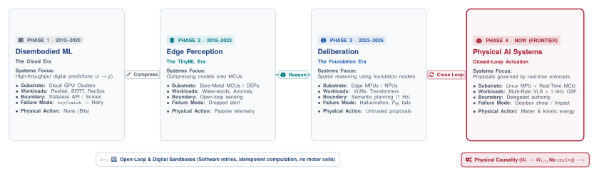
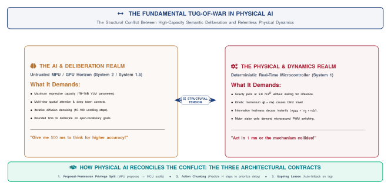
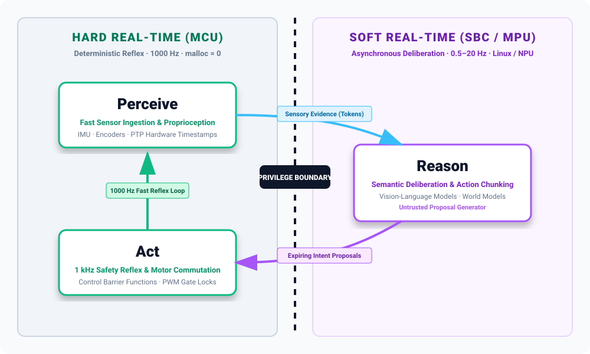
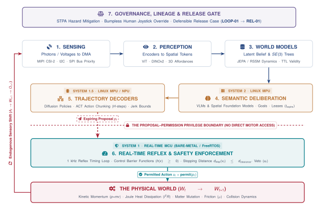
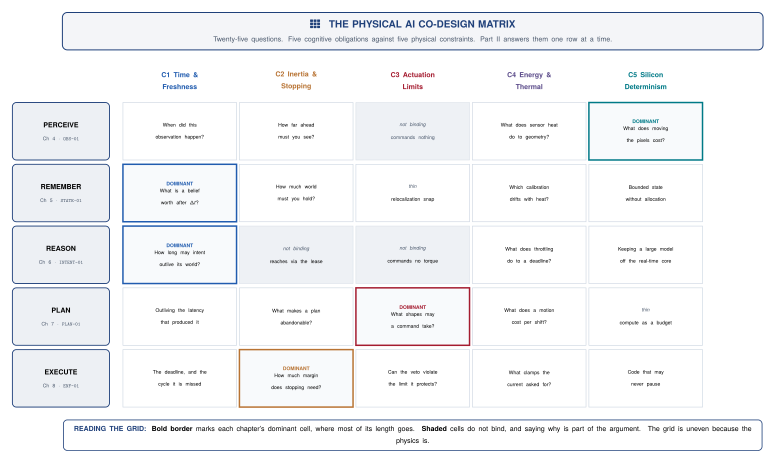

## The North Star: What is Physical AI Systems? {data-background="#f8f9fa"}

::: {.columns}
::: {.column width="60%"}
### Software Beyond the Glass

* **Digital Machine Learning:**
 * **Digital Outputs:** Classifiers emit labels; LLMs emit text.
 * **Contained Blast Radius:** Errors are safely isolated—exceptions are caught, dropped packets retry, transactions roll back.
* **Physical AI Systems:**
 * **Physical Actuation:** Commands inverter MOSFETs, accelerates kilograms of mass, consumes energy, and interacts with humans.
 * **The Irreversibility Law:** You cannot `ctrl+z` kinetic momentum or Joule heat ($I^2R$).
:::

::: {.column width="40%"}
::: {.callout-rule title="The Central Systems Question"}
> *"What must the surrounding system know, measure, enforce, preserve, and prove before an unverified learned proposal may produce a physical consequence?"*
:::
:::
:::


## The 4 Eras of Intelligent Systems

{width="100%"}

* **TinyML (2018–2022):** Taught us how to compress and deploy neural networks to constrained microcontrollers.
* **Physical AI (2026+):** Teaches us how to build **intelligent, safe, closed-loop acting machines** under physical conservation laws and memory/timing limits.


## The Three Universal Defining Properties

An engineered system is defined as **Physical AI** if and only if it satisfies three universal criteria:

| Property | Computational & Physical Principle | Industrial Reality & Contrast |
| :--- | :--- | :--- |
| **1. Learned Foundation Component** | High-capacity learned models (VLMs, Latent World Models, Diffusion Policies) | Replaces brittle hardcoded if-then rules with open-world generalization. |
| **2. Analog $\longleftrightarrow$ Digital Boundary** | Discrete software tensors and tokens directly govern continuous physical energy fluxes | Digital clock ticks command 3-phase inverter MOSFETs, motor coils, and fluid valves. |
| **3. Governed by Irreversible Physical Laws** | Operates under strict physical conservation laws ($E_k = \frac{1}{2}mv^2$, Joule heat $I^2R$, friction) | **Zero undo button:** You cannot rewind a mechanical collision or motor winding thermal burnout. |


## The Three Canonical Archetypes

Every concept in this curriculum is anchored across **Three Canonical Archetypes** and a dedicated **Desk Bench Twin**:

::: {.columns}
::: {.column width="33%"}
### 1. Locomotion & Mobility
* **Systems:** Autonomous Vehicles, Drones, Quadrupeds.
* **Physical Core:** Free-space movement & spatial navigation.
* **Key Challenge:** $P_{99}$ latency tails and dynamic stopping envelopes ($d_{\text{stop}}$).
:::

::: {.column width="33%"}
### 2. Contact Manipulation
* **Systems:** Humanoids, 6-DoF Arms, Surgical Robots.
* **Physical Core:** Touching, grasping, and shaping matter.
* **Key Challenge:** Discontinuous contact, torque rates ($\dot{\boldsymbol{\tau}}$), and gearbox shear.
:::

::: {.column width="33%"}
### 3. Cybernetic Process & Energy
* **Systems:** Smart Grid Inverters, EV Battery Management.
* **Physical Core:** Continuous state & energy flows.
* **Key Challenge:** Microsecond AC phase sync, $I^2R$ Joule heating, and thermal runaway.
:::
:::

::: {.callout-lab title="The Desk Bench Twin: Arduino UNO Q Dual-Brain Kit"}
The laboratory hardware realization combining a Linux Application Processor (MPU) with a Real-Time Cortex-M4 Microcontroller (MCU).
:::


## The Grand Systems Conflict: Less Time vs. More Time

{width="90%"}

* **Physics Demands *Less Time* ($t \to 0$):** Mass continues moving ($v \cdot \Delta t$); coils heat ($I^2R$); sensor data decays; phase margin erodes.
* **Cognition Demands *More Time* ($t \to \infty$):** Foundation models need FLOPs and tokens to resolve open-world visual ambiguities.


## The Resolution: The Three Cadences of Intelligence

{width="95%"}

* **System 2 (Slow · 1 Hz · Linux MPU):** Untrusted proposal service emitting Expiring Intent Leases ($\mathcal{L}_{\text{intent}}$).
* **System 1.5 (Medium · 20–50 Hz · Edge NPU):** Candidate trajectory generator emitting $H=16$ Action Chunks with $\mathcal{C}^2$ jerk splines.
* **System 1 (Fast · 1000 Hz · Bare-Metal MCU):** Sole hardware permission authority running Control Barrier Functions with **`malloc = 0`**.


## The Embodied Control Loop: Hard Real-Time (MCU) vs. Soft Real-Time (SBC)

{width="85%"}

* **Hard Real-Time (MCU):** Continuous, zero-allocation 1000 Hz closed-loop reflex ($\text{Act} \to \text{Perceive}$) evaluating Control Barrier Functions and dynamic stopping envelopes.
* **Soft Real-Time (SBC / Linux MPU):** High-capacity foundation models (VLMs, World Models, Diffusion Chunks) processing sensory evidence ($\text{Perceive} \to \text{Reason}$) and proposing expiring intent leases ($\text{Reason} \to \text{Act}$).


## The Dual-Brain Anatomy & The Proposal–Permission Split


{width="95%"}

* **The MPU never touches motor PWM registers:** It proposes intended trajectories over shared SRAM.
* **The MCU evaluates forward invariance ($h(x) \ge 0$):** If safe, it permits actuation; if dangerous or timed out, it trips independent dynamic braking.


## The Grand Map: The Physical AI Co-Design Matrix

{width="95%"}

Every cell in this matrix represents an unyielding physical constraint where digital software assumptions collide with matter, energy, and silicon determinism.


## The Curriculum Arc (Three Progressive Parts)

::: {.columns}
::: {.column width="33%"}
### Part I: Foundations & Matrix
* **Ch 1:** The Causal Boundary & Closed-Loop State Mutation
* **Ch 2:** The 4 Physical Constraints (Time, Inertia, Jerk, Silicon)
* **Ch 3:** The 5 Cognitive Dimensions & Multi-Rate Cadences
:::

::: {.column width="33%"}
### Part II: The Embodied Lifecycle
* **Ch 4 (Perceive):** 3D Spatial Affordance Tokens & DMA Taxes
* **Ch 5 (Remember):** Latent World Models & Dynamic $SE(3)$ Trees
* **Ch 6 (Reason):** Multimodal VLMs & Expiring Intent Leases
* **Ch 7 (Plan):** Diffusion Action Chunking & $\mathcal{C}^2$ Jerk Splines
* **Ch 8 (Execute):** 1 kHz Bare-Metal Control Barrier Functions
:::

::: {.column width="33%"}
### Part III: Placement & Release
* **Ch 9 (Placement):** Heterogeneous Silicon & Bus QoS Arbitration
* **Ch 10 (Governance):** Bumpless Takeover & Governed Flywheels
* **Ch 11 (Assurance):** Seeded Fault Injection & Safety Cases
* **Ch 12 (Capstone):** Live Bench Defense Under Seeded Faults
:::
:::


## The Hardware Studio: The Arduino UNO Q Dual-Brain Kit

::: {.columns}
::: {.column width="55%"}
### Zero-Magic Laboratory Hardware

* **Host Brain (MPU):** Qualcomm Linux Application Processor running PyTorch, TensorRT, VLMs, and ACT Action Chunk decoders.
* **Reflex Brain (MCU):** Dedicated ARM Cortex-M4 Microcontroller running bare-metal / FreeRTOS with strictly **zero dynamic heap allocation (`malloc = 0`)**.
* **Vision & Sensing:** MIPI CSI-2 camera module with DMA ring buffer capture, 6-DoF IMU, high-resolution optical encoders.
* **Actuation:** Multi-axis precision motion stage with phase current telemetry and hardware Safe Torque Off (STO) relays.
:::

::: {.column width="45%"}
### The Laboratory Arc
* **Lab 1:** Advisory Open-Loop vs Closed-Loop Mutation
* **Lab 2:** $P_{99}$ Latency Tail Metrology & Stopping Bounds
* **Lab 3:** Multi-Rate Scheduling & MPU Crash Survival
* **Lab 4:** MIPI DMA Bus Contention & 3D Spatial Tokens
* **Lab 5:** $SE(3)$ Frame Trees & Occlusion Leases
* **Lab 6:** VLM Prompt Grounding & Intent Leases
* **Lab 7:** ACT Trajectory Decoding & $\mathcal{C}^2$ Splines
* **Lab 8:** 1 kHz MCU Control Barrier Function Enforcers
* **Lab 9:** UMA Memory Arbitration & Thermal Derating
* **Lab 10:** Bumpless Joystick Takeover & Flight Logs
* **Lab 11:** Cross-Layer Seeded Fault Injection Rig
* **Capstone:** Live System Jury Defense
:::
:::


## Course Evaluation & Capstone Defense

::: {.columns}
::: {.column width="50%"}
### Assessment Structure (**No Written Exam**)

* **20% — Process & Studio Checkpoints:**
 * Weekly hands-on lab progress and firmware verification on the bench.
* **15% — Midterm System Review:**
 * Live bench demo of working observe $\to$ propose $\to$ permit loop.
* **25% — Final Capstone Defense:**
 * Oral jury defense and live recovery from unannounced seeded bench faults.
* **40% — engineering notebook:**
 * The evolving, versioned engineering record documenting system invariants, contracts, and safety release cases.
:::

::: {.column width="50%"}
### The Capstone Defense Trial
1. Team presents their complete engineering dossier to the faculty jury.
2. The instructor injects an **unannounced fault**:
 * *Example:* Pulling the MIPI camera cable mid-trajectory.
 * *Example:* Triggering an MPU kernel memory exhaustion storm.
 * *Example:* Inducing artificial clock skew on IPC mailboxes.
3. **The Gold Standard:** The system must autonomously transition to a safe state without violating physical invariants ($h(x) \ge 0, d_{\text{stop}} \le d_{\text{clear}}$), and the team must diagnose the root cause live from telemetry logs.
:::
:::


## Summary: The Physical AI Paradigm

```
 THE COMPLETE PHYSICAL AI SYSTEMS PARADIGM

 MACHINE LEARNING (AI) EMBEDDED SYSTEMS (ECE) ROBOTICS & CONTROL (CPS)
 ┌─────────────────────────┐ ┌─────────────────────────┐ ┌─────────────────────────┐
 │ • High-Capacity VLMs │ │ • Microsecond PTP Clocks│ │ • Rigid Body Dynamics │
 │ • 3D Spatial Tokens │ │ • Zero-Copy DMA Buffers │ │ • Control Barrier Funcs │
 │ • Diffusion Action Chunks││ • Lock-Free Shared SRAM │ │ • Kinetic Stopping Envs │
 └────────────┬────────────┘ └────────────┬────────────┘ └────────────┬────────────┘
 │ │ │
 └───────────────────────────┼───────────────────────────┘
 ▼
 PHYSICAL AI SYSTEMS
 "Intelligence That Safely Senses and Acts in the Real World"
```

* **Reference Portal:** [`physical.mlsysbook.ai`](https://physical.mlsysbook.ai)
* **Contacts:** Prof. Vijay Janapa Reddi (`vjanapa@ethz.ch`) & Dr. Andrea Mattia Garavagno
