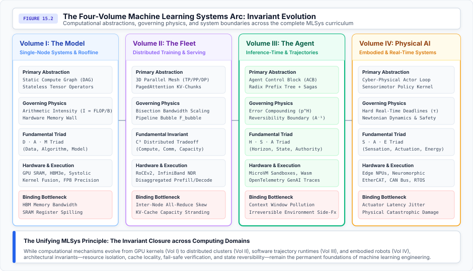
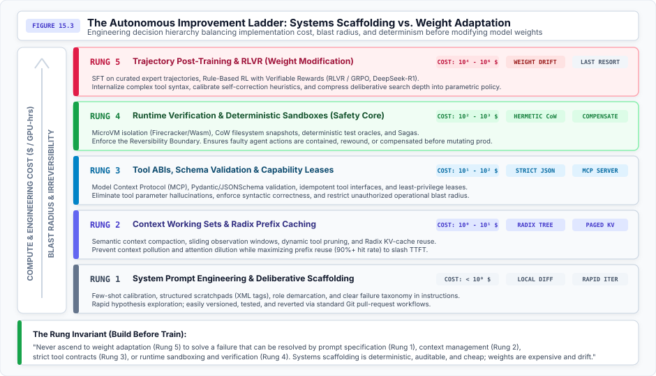
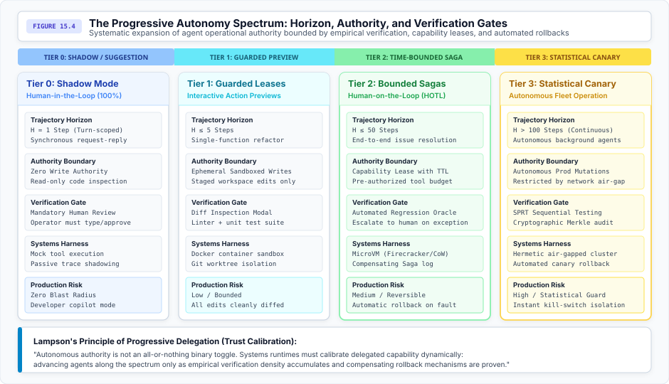

# Conclusion {#sec-vol3-conclusion}

::: {layout-narrow}
::: {.column-margin}

\chapterminitoc

:::
:::

## Purpose {.unnumbered .unlisted}

_What enduring systems principles govern the design of autonomous, intelligent software across future shifts in neural model scale and architecture?_

As this volume concludes, artificial intelligence continues its rapid transformation. New model architectures will emerge, context lengths will expand, and parameter scales will shift. Yet computer systems engineering teaches that while mechanisms change, architectural invariants endure. The transition from stateless token generation to stateful trajectory execution is not a temporary technique; it is a permanent computing regime. As long as models are stochastic and real-world actions are irreversible, systems runtimes will be required to manage execution descriptors, schedule heavy-tailed service times, bound attention memory, isolate execution domains, verify semantic outcomes, and coordinate fleets of actors. The discipline of agentic machine learning systems is building reliable, deterministic applications from stochastic components. This volume establishes the digital systems foundation for autonomous software, setting the stage for the ultimate future challenge: acting with provable reliability in the physical world.

::: {.content-visible when-format="pdf"}

\newpage

:::

\begin{marginfigure}
\mlagentstack{30}{30}{30}{30}{30}{30}
\caption{The Agentic Machine Learning Systems Stack. The Conclusion synthesizes durable systems invariants across all six layers.}
\end{marginfigure}

::: {.callout-learning-objectives}

### In this concluding chapter, we synthesize:

- How Richard Sutton's Bitter Lesson applies to inference-time systems, proving why general-purpose search and memory hierarchies outperform heuristic wrappers.
- The Invariant Closure Principle, showing why safety, leases, and rollback invariants must close at the trajectory boundary rather than per-token.
- The Sovereign Law of Agency, mathematically modeling the exponential decay of unverified trajectories and superlinear context accumulation.
- The Reversibility Boundary as an architectural divide between internal scratchpad mutations and irreversible external operations.
- The structural consequence of the broken code/data separation ($W \oplus X$) in Transformer architectures and why security requires virtualization.
- How Postel's Law dictates the asymmetry of agentic interfaces: liberal ingestion of unstructured data and conservative emission of strict JSON schemas.
- Why Amdahl's Law and The Tail at Scale place strict performance ceilings on parallel multi-agent swarms and sequential tool I/O.
- The Five-Tier Autonomous Improvement Ladder, establishing the decision hierarchy between systems scaffolding and parametric weight retraining.
- The Progressive Autonomy Spectrum, calibrating human supervisory authority against empirical verification density and rollback guarantees.
- The synthesis across the four-volume MLSys curriculum, bridging digital software agency to physical embodied systems.

:::

## The Bitter Lesson at Inference Time {#sec-vol3-conclusion-the-bitter-lesson-at}

In his 2019 essay on computational intelligence, Richard Sutton articulated **The Bitter Lesson**: the biggest lesson that can be read from 70 years of AI research is that general methods that leverage computation are ultimately the most effective, by a large margin [@sutton2019bitter]. Sutton observed that researchers repeatedly attempt to build human domain knowledge into algorithms—handcrafted vision filters, linguistic parse trees, rule-based expert systems—only to see those bespoke heuristics completely eclipsed when massive compute is coupled with search and learning.

In the era of autonomous agents, systems engineering faces its own bitter lesson. When foundation models first displayed rudimentary reasoning, the software industry responded with an explosion of bespoke application wrappers:

- Fragile prompt-chaining libraries
- Hardcoded regex parsers
- Multi-agent conversational role-play templates
- Brittle state machines

These frameworks attempted to force non-deterministic models into deterministic pipelines through complex syntactic micromanagement.

Within months, each subsequent foundation model upgrade rendered these handcrafted chains obsolete. Systems designed around static few-shot examples or rigid if-else prompt orchestrations broke under model weight drift. Conversely, systems built upon general-purpose inference-time compute—such as Monte Carlo Tree Search (MCTS), beam search with learned PRMs, and scalable Radix prefix-caching memory hierarchies [@snell2024scaling; @zheng2024sglang]—scaled monotonically with available FLOPs.

The bitter lesson at inference time establishes that:

1. **Search Over Heuristics:** General-purpose tree search over verified intermediate states systematically outperforms brittle, human-engineered prompt trees.
2. **Memory Hierarchies Over Prompt Hacks:** Operating systems that dynamically page, evict, and cache KV tensors across physical memory tiers (high-bandwidth memory (HBM), Compute Express Link (CXL), and Non-Volatile Memory Express (NVMe)) systematically outperform ad-hoc prompt trimming and manual string truncation.
3. **Verified Environments Over Synthetic Personas:** Grounding agents in hermetic sandboxes with compiler feedback and unit test oracles systematically outperforms ungrounded conversational multi-agent debate.

Systems architects must resist the urge to hardcode reasoning pathways. The role of the agent systems runtime is to provide the high-throughput, low-latency execution substrate—memory allocation, capability isolation, and deterministic verification—that allows general search algorithms to explore solution spaces at scale.

## The Invariant Closure Principle {#sec-vol3-conclusion-the-invariant-closure-principle}

In 1984, Saltzer, Reed, and Clark formulated the foundational principle of networked computing: the **End-to-End Argument** [@saltzer1984endtoend]. They demonstrated that certain reliability and security functions can only be completely and correctly implemented with the knowledge and help of the endpoint application. Pushing partial reliability mechanisms into intermediate communication layers (such as hop-by-hop packet checksums) is redundant and insufficient to guarantee end-to-end correctness.

In agentic machine learning systems, this architectural truth manifests as the **Invariant Closure Principle** [@reddi2026agentic]. Modern AI systems frequently attempt to enforce safety, security, and budgeting invariants at the token or single-inference layer:

- Training models to refuse harmful queries
- Applying output logit bias filters
- Rate-limiting individual HTTP endpoints

While helpful as defense-in-depth, these intermediate mechanisms can never guarantee system invariants.

The volume closes where it opened. Principle \ref{pri-vol3-invariant-closure} was stated in the introduction as a claim about where guarantees can live; every part since has supplied a case that could not be enforced at the token or request scope. Capability leases expire on trajectories, not calls. Taint propagates across steps. Budgets are exhausted by loops no single request violates. The principle earned its scope by surviving each of them.

Consider monetary budgeting: an agent delegated an autonomous refactoring task might make 80 individual API calls, each costing $\$0.02$, for a nominal spend of $\$1.60$. While every single call is well within individual request limits, nothing in that per-call check bounds the trajectory: an unterminated hallucination loop that reaches 8,000 calls burns $\$160.00$ against the same limits. Similarly, a prompt-injection payload ingested at Step 4 may not trigger malicious behavior until combined with a file-write tool call at Step 37.

As illustrated in @fig-vol3-four-volume-arc, systems engineering provides the structural container that guarantees invariant closure across all four volumes of the MLSys curriculum: from single-node kernel execution to fleet-scale distributed serving, multi-step trajectory runtimes, and physical robot actuation.

::: {#fig-vol3-four-volume-arc fig-env="figure" fig-pos="htb" fig-cap="**The Four-Volume Machine Learning Systems Arc: Invariant Evolution**: Computational abstractions, governing physics, fundamental triads, and systems boundaries across the complete MLSys curriculum." fig-alt="Four-panel diagram illustrating the MLSys curriculum across Volume I (The Model), Volume II (The Fleet), Volume III (The Agent), and Volume IV (Physical AI)."}

:::

## The Sovereign Law of Agency {#sec-vol3-conclusion-the-sovereign-law-of}

Every autonomous system operates under physical constraints that dictate its operational boundary. In agentic systems, this boundary is governed by three coupled variables: **Horizon ($H$)**, **Step Error Rate ($\epsilon$)**, and **Context Length ($L_t$)**.

### Exponential trajectory decay

Let an autonomous task require an execution horizon of $H$ sequential interaction steps. At each step $t \in \{1, \dots, H\}$, the agent samples an action $a_t \sim \pi_\theta(a_t \mid h_t)$ from its policy. Let $p_t = 1 - \epsilon_t$ denote the probability that action $a_t$ is semantically correct and does not introduce an unrecoverable failure.

If execution proceeds open-loop without intermediate external verification, the probability that the entire trajectory $\tau$ succeeds decays exponentially with horizon length:

$$P(\tau_{\text{success}}) = \prod_{t=1}^H p_t = (1 - \epsilon)^H \approx \exp(-\epsilon H)$$ {#eq-vol3-sovereign-law-horizon}

As established in @eq-vol3-sovereign-law-horizon, the mathematical ceiling of unverified autonomy becomes apparent. If an engineering team deploys a frontier model with an impressive 98 percent per-step accuracy ($p = 0.98, \epsilon = 0.02$):

- Over a short horizon of $H = 5$ steps: $P(\text{success}) = 0.98^5 \approx 0.904$ (90.4 percent).
- Over a moderate horizon of $H = 30$ steps: $P(\text{success}) = 0.98^{30} \approx 0.545$ (54.5 percent).
- Over an enterprise horizon of $H = 100$ steps: $P(\text{success}) = 0.98^{100} \approx 0.133$ (13.3 percent).

To achieve a commercially viable 95 percent trajectory success rate over $H = 100$ steps through raw model scaling alone would require an absurd per-step accuracy of $p \ge 0.95^{1/100} \approx 0.99948$ (an error rate of less than 1 in 2,000 steps). Because foundation models are probabilistic estimators trained on human web data, achieving such ultra-low error rates across out-of-distribution environments is mathematically intractable.

### Verification as a mandatory physical tax

The only systems mechanism that counteracts exponential decay is **Intermediate Verification** [@cobbe2021training; @deepseekai2025deepseekr1]. If the systems runtime couples each step with an external, deterministic verification oracle (compiler, test suite, formal linter) that detects faults with precision $v_t \in [0, 1]$ and triggers an immediate rollback or retry, the compounded success probability is restored:

$$P(\tau_{\text{verified}}) = \prod_{t=1}^H \left( 1 - \epsilon (1 - v_t) \right) \approx \exp\left(-\epsilon \sum_{t=1}^H (1 - v_t)\right)$$ {#eq-vol3-sovereign-law-verified}

In @eq-vol3-sovereign-law-verified, when $v_t \to 1$ (complete verification), $P(\tau_{\text{verified}}) \to 1$, independent of horizon $H$. Verification is not an optional software feature; it is the mathematical precondition for long-horizon autonomous systems.

### Superlinear context accumulation

Simultaneously, the agent's context history $L_t$ accumulates with every interaction step:

$$L_t = L_{\text{prompt}} + \sum_{i=1}^t \left( |a_i| + |o_i| \right)$$ {#eq-vol3-context-accumulation}

As formalized in @eq-vol3-context-accumulation, because standard Transformer self-attention compute scales quadratically $\mathcal{O}(L_t^2)$ and memory allocation for the Key-Value (KV) cache grows linearly $\mathcal{O}(L_t)$ per concurrent agent, unmanaged context growth inevitably exhausts GPU SRAM and HBM capacity. Furthermore, as demonstrated in @sec-vol3-context-working-sets, feeding 100,000 uncurated historical tokens into the context window causes **attention dilution** and the "lost-in-the-middle" phenomenon, accelerating policy degradation. Systems runtimes must enforce semantic sliding windows, dynamic observation eviction, and Radix prefix sharing to keep context working sets strictly bounded.

## The Reversibility Boundary Law {#sec-vol3-conclusion-the-reversibility-boundary-as}

In 1978, Jim Gray revolutionized distributed systems by defining the formal properties of database transactions: Atomicity, Consistency, Isolation, and Durability (ACID) [@gray1978notes]. Gray recognized that the physical universe does not support undo operations: once an automated teller machine dispenses cash or a factory punch-press cuts sheet metal, no database `ROLLBACK` command can revert physical reality.

In agentic computing, this division establishes the **Reversibility Boundary** [@garciamolina1987sagas]. Every action an agent can take falls into one of two fundamental classes:

1. **Internal State Transitions ($\Delta \mathcal{S}_{\text{internal}}$):** Generating reasoning tokens in the scratchpad, updating intermediate variables in the Agent Control Block, or writing temporary files inside an isolated, Copy-on-Write (CoW) microVM. These operations are private, ephemeral, and strictly reversible ($A^{-1}$ exists at near-zero cost).
2. **External Environment Mutations ($a_t \in \mathcal{A}_{\text{external}}$):** Sending an email, charging a credit card, updating an external production database schema, or transmitting motor commands to a robotic gripper. These operations mutate shared external state and are fundamentally irreversible ($a^{-1} = \emptyset$).

Principle \ref{pri-vol3-reversibility-boundary} is the one this volume would keep if it could keep only one. Search, speculation and retry are all affordable on the reversible side of the boundary and all catastrophic on the other, and no amount of model capability moves an action from one side to the other. The engineering question a physical or financial side effect raises is not how confident the policy is, but whether the action can be taken back.

When irreversible operations cannot be avoided, the systems runtime must adopt Garcia-Molina and Salem's **Sagas** architecture [@garciamolina1987sagas]. An agentic trajectory is decomposed into a sequence of sub-transactions $(T_1, T_2, \dots, T_n)$ paired with predefined compensating actions $(C_1, C_2, \dots, C_{n-1})$. If the agent fails at step $k$, the runtime automatically aborts and executes the compensating sequence in reverse order: $C_{k-1}, \dots, C_1$, returning the external environment to an equivalent consistent state.

## The Broken Code/Data Separation {#sec-vol3-conclusion-the-broken-code-data}

In 1945, the classic von Neumann architecture revolutionized computation by storing program instructions and working data in the same physical memory space. However, decades of computer security history proved that failing to enforce a rigid architectural separation between instructions and data leads directly to catastrophic vulnerabilities: buffer overflows, format string bugs, and arbitrary code execution. Operating systems resolved this crisis by enforcing **$W \oplus X$ (Write XOR Execute)** at the hardware page table level: a memory page can be writable or executable, but never both simultaneously.

Modern Transformer foundation models reintroduce this structural vulnerability at an architectural level. In a Large Language Model, system instructions (the developer's system prompt), user requests, and untrusted external data (retrieved web pages, API JSON responses, customer files) are tokenized into the exact same vector embedding space and ingested into a unified attention matrix:

$$\mathbf{X} = [\text{System Instructions} \,\|\, \text{User Prompts} \,\|\, \text{Untrusted Observations}]$$

Every token attends to every other token. The neural network possesses no architectural mechanism—no privilege rings, no kernel/user mode bit, no hardware memory protection—to distinguish developer instructions from untrusted data strings.

Consequently, **Indirect Prompt Injection** [@greshake2023not] is not a temporary bug that will be patched by better prompt engineering or RLHF fine-tuning. It is an architectural characteristic of autoregressive Transformers lacking instruction/data separation. An adversarial payload embedded inside a webpage can hijack the agent's control flow with the same computational authority as the developer's original system instructions.

Because security cannot be achieved within the model weights, it must be enforced by the surrounding systems harness:

- **Virtualization Isolation:** Discarding shared Docker containers in favor of hardware-isolated microVMs (Firecracker, [@agache2020firecracker]) and WebAssembly sandboxes with zero host filesystem access.
- **Information Flow Control (IFC):** Tainting all external data inputs at the runtime layer and restricting tainted contexts from accessing privileged output tools (such as network sockets or credential stores).
- **Dual-Model Privilege Separation:** Separating the agent into an unprivileged untrusted worker (which processes raw external inputs) and a privileged supervisor (which evaluates sanitized outputs and holds capability keys).

## Postel's Law and Agentic Interfaces {#sec-vol3-conclusion-postels-law}

In 1980, Jon Postel formalized the **Robustness Principle** (often called Postel's Law) for the early Internet's TCP specification: *"Be conservative in what you do, be liberal in what you accept from others"* [@postel1980dod]. This systems principle ensured that heterogeneous networks could interoperate despite differing protocol implementations.

For autonomous agents, Postel's Law defines the fundamental asymmetry of agentic I/O interfaces:

1. **Liberal Acceptance (Unstructured Ingestion):** Agents operate in a fundamentally messy, human-centric environment. The systems runtime must equip agents to robustly ingest unstructured data—malformed HTML, partial compiler tracebacks, ambiguous user intents, and legacy API responses—using the foundation model's robust semantic parsing capabilities to map noise into structured latent representations.
2. **Conservative Emission (Structured Generation):** Conversely, when an agent takes action, it must emit strictly typed, syntactically conservative outputs. Tool calls must conform perfectly to JSON Schema specifications (such as the Model Context Protocol (MCP)), API requests must be meticulously validated, and state transitions must be deterministic.

Systems engineers often fail by violating this asymmetry: either attempting to force human users to provide perfectly structured prompts (violating liberal acceptance) or allowing agents to emit loosely structured, unverified commands (violating conservative emission). The agentic runtime bridges this gap, leveraging the neural network to absorb entropy while relying on deterministic scaffolding to enforce conservative outputs.

## Hardware Co-Design for Agent Workloads {#sec-vol3-conclusion-hardware-co-design-for-agent}

In their Turing Lecture, John Hennessy and David Patterson declared **A New Golden Age for Computer Architecture**, demonstrating that the end of Dennard scaling and Moore's Law requires domain-specific hardware accelerators [@hennessy2019golden]. The first decade of modern deep learning focused hardware co-design almost exclusively on dense matrix multiplication: systolic arrays, Tensor Cores, and massive HBM stacks optimized for static general matrix multiplication (GEMM) kernels in training clusters.

Agentic workloads represent a profound shift in hardware requirements. An agent trajectory is characterized by:

- **Heavy-Tailed, Dynamic Service Times:** A single user task may require anywhere from 1 to 200 sequential autoregressive steps, destroying traditional static batching assumptions.
- **Extreme KV-Cache Footprints:** Multi-turn conversational histories, scratchpad thoughts, and retrieved documentation rapidly exceed the HBM capacity of individual accelerators.
- **Asynchronous Tool Latency:** Agents spend significant wall-clock time blocked on external compilers, database queries, and microVM network calls, stranding expensive GPU memory.

These characteristics are driving the next wave of computer architecture co-design:

1. **CXL Disaggregated Memory Pooling:** Compute Express Link (CXL 3.0) enables heterogeneous memory disaggregation. Runtimes such as Mooncake [@qin2024mooncake] decouple compute servers from massive pools of shared DDR5/CXL memory, allowing KV-caches to persist across distributed clusters without consuming scarce GPU HBM.
2. **Hardware Radix Traversal Engines:** Trajectory serving runtimes rely heavily on Radix tree prefix caching to achieve over 90 percent prompt cache hit rates. Future SmartNICs and DPUs will feature dedicated silicon engines to traverse, match, and page-in token KV blocks directly over remote direct memory access (RDMA) before compute requests reach the GPU.
3. **Silicon-Accelerated MicroVM Instantiation:** To isolate millions of agent tool calls, cloud hypervisors are adopting hardware-assisted page-fault snapshot restoring, enabling microVMs (Firecracker) to instantiate in under 5 milliseconds with near-zero memory footprint.
4. **Disaggregated Prefill and Decode Clusters:** Separating compute-bound prefill servers (dense GEMM kernels on H100/B200 clusters) from memory-bandwidth-bound decode servers (optimized for speculative sampling and fast token streaming) eliminates head-of-line blocking in agentic workflows.

## Amdahl's Law and The Tail at Scale {#sec-vol3-conclusion-amdahls-law-and-tail-at-scale}

In 1967, Gene Amdahl formulated **Amdahl's Law**, which states that the theoretical speedup of a system is strictly limited by the sequential fraction of the workload that cannot be parallelized [@amdahl1967]. In 2013, Jeff Dean and Luiz André Barroso extended systems performance theory with **The Tail at Scale**, demonstrating that as systems fan out requests across distributed clusters, the 99th-percentile (P99) tail latency inevitably dictates the overall system response time [@dean2013tail].

In agentic machine learning systems, these two principles govern the performance limits of complex workflows:

1. **Amdahl's Bottleneck in Agent Execution:** While GPU inference speeds (tokens per second) scale with newer hardware accelerators, agentic workflows are intrinsically bottlenecked by sequential environmental interactions. If an agent spends 60 percent of its wall-clock time waiting for an external Python interpreter to execute a script or a search index to return results, an infinitely fast GPU can only ever yield a $1.6\times$ overall task speedup. System acceleration requires asynchronous tool dispatch, overlapping speculative decoding with I/O waits, and preemptive background retrieval.
2. **The Agentic Tail at Scale:** When an orchestrator agent delegates sub-tasks to 50 parallel worker agents (for example, to evaluate multiple search branches or map over a large document), the orchestrator cannot proceed until the slowest worker returns. Due to the stochastic nature of autoregressive generation lengths (where one worker might require 5 tokens and another 500) and variable KV-cache eviction delays, variance across parallel agent requests is exceptionally high. Runtimes must employ classic tail-tolerance techniques: hedged requests (sending duplicate sub-tasks and taking the first result), proactive straggler mitigation, and speculative execution timeouts.

Optimizing an agentic system requires looking beyond peak token throughput to address the sequential I/O bottlenecks and the compounding variance of distributed stochastic actors.

## The Goodput Economic Frontier {#sec-vol3-conclusion-macro-economics-of-autonomy-the}

The deployment of autonomous agent fleets is governed by economic substitution: trading human labor expenditure for GPU electrical power and infrastructure depreciation [@patterson2021carbon]. In an enterprise setting, an agentic system is viable if and only if its total cost to reliably resolve a unit of work is strictly less than the human equivalent:

$$C_{\text{goal}} = \frac{\mathbb{E}[C_{\text{tokens}}] + \mathbb{E}[C_{\text{compute}}]}{\mathbb{E}[R_{\text{success}}]} < C_{\text{human}}$$ {#eq-vol3-economic-equilibrium}

In @eq-vol3-economic-equilibrium, $C_{\text{goal}}$ is the cost per successful goal, $C_{\text{tokens}}$ is the API or serving cost of prompt and generation tokens, $C_{\text{compute}}$ is the cost of sandbox virtualization and tool execution, and $R_{\text{success}}$ is the empirical trajectory success rate.

As demonstrated in @sec-vol3-telemetry-evaluation, optimizing this equation does not mean blindly deploying the largest possible foundation model. Frontier dense models (such as GPT-4o or Claude 3.5 Sonnet) incur steep token pricing ($> \$15.00$ per million output tokens). If a task requires an extensive 50-step exploratory trajectory, token costs quickly exceed $\$2.00$ per attempt.

Instead, the frontier of autonomous efficiency is moving toward **Test-Time Search with Compact Models** [@snell2024scaling; @openai2024o1]. A compact 8B or 14B parameter model running locally on commodity GPUs costs less than $\$0.20$ per million tokens. By allocating inference compute to test-time Monte Carlo Tree Search, verifier scoring, and self-correction rollouts, the small model can match or exceed the task success rate of a frontier dense model at a fraction of the monetary cost.

The governing metric of fleet economics is Trajectory Goodput ($G$).

::: {.callout-definition title="Trajectory goodput"}
**Trajectory Goodput ($G$)**: The number of successfully verified tasks completed per unit of total energy or financial expenditure.
:::

Runtimes that maximize Trajectory Goodput—through sparse Mixture-of-Experts (MoE) routing, aggressive Radix prefix caching, and speculative verification gates—will dictate the commercial scalability of autonomous software.

## The Improvement Ladder {#sec-vol3-conclusion-the-improvement-ladder-build}

When an agent fails in production, what is the correct engineering response? Inexperienced teams frequently rush to fine-tune model weights or collect expensive reinforcement learning datasets. In production systems engineering, this is an anti-pattern.

Systems runtimes operate under **The Autonomous Improvement Ladder**, illustrated in @fig-vol3-improvement-ladder.

::: {#fig-vol3-improvement-ladder fig-env="figure" fig-pos="htb" fig-cap="**The Autonomous Improvement Ladder: Systems Scaffolding vs. Weight Adaptation**: Five-tier decision hierarchy balancing compute cost, blast radius, and determinism before modifying model weights." fig-alt="Vertical diagram showing 5 rungs from Prompt Engineering at the bottom to Post-Training at the top, annotated with cost and risk."}

:::

The ladder defines a strict five-tier engineering hierarchy, detailed in @tbl-vol3-improvement-ladder:

| Rung  | Subsystem Tier                      | Implementation Cost        | Primary Failure Modes Addressed                    | Reversibility & Auditability         |
|:------|:------------------------------------|:---------------------------|:---------------------------------------------------|:-------------------------------------|
| **1** | System Prompt Engineering           | $< \$1$ (Minutes)          | Ambiguous instructions, missing output format      | High (Git-versioned markdown)        |
| **2** | Context Working Sets & Prefix Cache | $\$1 - \$10$ (Hours)       | Working memory pollution, high TTFT latency        | High (Deterministic KV cache)        |
| **3** | Tool ABIs & Schemas (MCP)           | $\$10 - \$10^2$ (Days)     | Tool parameter hallucination, unhandled exceptions | High (Strict schema validation)      |
| **4** | Runtime Verification & Sandboxes    | $\$10^2 - \$10^3$ (Weeks)  | Destructive mutations, corrupted state, loops      | Absolute (CoW snapshot rollbacks)    |
| **5** | Trajectory Post-Training (SFT/RLVR) | $\$10^4 - \$10^6$ (Months) | Fundamental reasoning gaps, complex domain syntax  | Low (Parametric weights, drift risk) |
: **The Five-Tier Autonomous Improvement Ladder**: Engineering teams must exhaust lower-cost systems scaffolding (Rungs 1--4) before incurring the high financial cost, iteration latency, and behavioral drift of weight modification (Rung 5). {#tbl-vol3-improvement-ladder}

In accordance with John Ousterhout's *A Philosophy of Software Design* [@ousterhout2018philosophy], systems engineers must make modules "deep"—hiding non-deterministic complexity behind clean, simple, deterministic interfaces. Modifying neural weights (Rung 5) introduces catastrophic forgetting, non-deterministic behavioral shifts, and massive compute costs. Systems scaffolding (Rungs 1--4) is deterministic, modular, auditable, and instantly reversible.

## Progressive Autonomy and Trust Calibration {#sec-vol3-conclusion-progressive-autonomy-and-trust}

In his classic 1983 paper *Hints for Computer System Design*, Butler Lampson advised: "Don't hide power; delegate authority carefully" [@lampson1983hints]. In autonomous systems, trust cannot be granted as an unmonitored binary privilege. Human operators who place blind trust in probabilistic models inevitably succumb to catastrophic automation bias [@lee2004trust].

Robust systems enforce the **Progressive Autonomy Spectrum**, mapped in @fig-vol3-autonomy-spectrum:

::: {#fig-vol3-autonomy-spectrum fig-env="figure" fig-pos="htb" fig-cap="**The Progressive Autonomy Spectrum: Horizon, Authority, and Verification Gates**: Systematic expansion of agent operational authority bounded by empirical verification, capability leases, and automated rollbacks." fig-alt="Four-column spectrum showing Tier 0 Shadow Mode, Tier 1 Guarded Leases, Tier 2 Bounded Sagas, and Tier 3 Statistical Canary."}

:::

1. **Tier 0: Shadow Mode (Human-in-the-Loop, Full Oversight):** The agent operates with zero write authority ($H = 1$). It suggests code edits, queries logs, and mirrors production telemetry. A human engineer must inspect every diff and execute all physical mutations.
2. **Tier 1: Guarded Leases (Interactive Action Previews):** The agent is granted time-bounded, scoped leases ($H \le 5$) inside isolated Docker containers. Mutations are rendered in an interactive diff inspection modal. Irreversible actions require explicit human one-click authorization.
3. **Tier 2: Bounded Sagas (Human-on-the-Loop, HOTL):** The agent autonomously executes end-to-end multi-step tasks ($H \le 50$) inside Firecracker microVMs. The systems runtime monitors assertion invariants and compensating Saga logs, escalating to human operators only when an invariant is violated or confidence falls below threshold.
4. **Tier 3: Statistical Canary (Human-out-of-the-Loop, Continuous Fleet):** Fully autonomous background agents ($H > 100$) operate across production microservices. Safety is guaranteed through statistical release gates: Sequential Probability Ratio Testing (SPRT), real-time anomaly detection, and tamper-evident Merkle tree cryptographic audit logs.

## Stochastic Fault-Tolerant Systems {#sec-vol3-conclusion-fault-tolerant-systems-out-of}

In 1956, John von Neumann delivered a historic lecture titled *Probabilistic Logics and the Synthesis of Reliable Organisms from Unreliable Components* [@vonneumann1956probabilistic]. Von Neumann asked a profound mathematical question: how can nature construct biological organisms that operate with near-perfect reliability when the underlying biological neurons are noisy, stochastic, and prone to random failure? He proved that through multiplexing, voting redundancy, and error-correcting feedback loops, a system can achieve arbitrarily high reliability despite unreliable components.

Thirty years later, Jim Gray analyzed software reliability in Tandem computer systems, distinguishing between **Bohrbugs** (reproducible, deterministic faults) and **Heisenbugs** (transient, non-deterministic timing faults) [@gray1986computers]. Gray showed that fault tolerance requires process pairs and defensive isolation boundaries that contain transient Heisenbugs before they corrupt persistent state.

Agentic machine learning systems represent the modern culmination of von Neumann's and Gray's theories. A foundation model is an inherently unreliable, stochastic component: it exhibits hallucination, non-deterministic sampling variance, floating-point non-associativity, and fail-plausible reasoning errors.

Yet the central lesson of this volume is that **system reliability is an emergent property of the software architecture, not the model weights**. By surrounding stochastic models with deterministic systems scaffolding—Agent Control Blocks, Radix prefix caches, microVM sandboxes, multi-agent supervisor trees, W3C distributed tracing, and sequential statistical gates—we build mission-critical, enterprise-grade software out of probabilistic components.

## Unsolved Frontiers in Agent Systems {#sec-vol3-conclusion-unsolved-frontiers-in-agent}

While Volume III has formalized the foundational architecture of agentic machine learning systems, several open research frontiers remain at the intersection of computer systems and artificial intelligence:

1. **Zero-Drift Episodic Memory Consolidation:** How do we compress months of agent trajectories into persistent L3 episodic stores without semantic drift, representation obsolescence, or catastrophic retrieval corruption?
2. **Just-in-Time (JIT) Dynamic Tool Synthesis:** Moving beyond static MCP tool definitions toward runtimes that synthesize, compile, sandbox, and execute bespoke software tools on-the-fly to solve novel environment challenges.
3. **Byzantine Consensus Among Heterogeneous Foundation Models:** Formulating formal distributed consensus protocols that establish semantic truth among multiple competing neural models without vulnerable token-voting majorities.
4. **Cryptographic Proof-of-Trajectory Execution:** Developing zero-knowledge succinct non-interactive arguments of knowledge (ZK-SNARKs) to cryptographically verify that an autonomous agent followed its authorized policy and capability leases without data tampering.
5. **The Bridge to Embodied Physical AI:** Expanding the agentic systems harness from digital sandboxes to real-time cyber-physical systems operating under hard real-time latency deadlines ($\tau \le 20\text{ ms}$) and physical Newtonian dynamics—the core focus of **Volume IV: Physical AI**.

## A Decade of Systems Agency {#sec-vol3-conclusion-a-decade-of-systems}

As computer systems enter the second half of the 2020s, the paradigm of computing has irrevocably shifted. For seventy years, computers executed deterministic instruction streams crafted by human programmers. For the past decade, computers performed high-throughput statistical inference across static neural network layers.

Today, we stand at the threshold of **Systems Agency**: autonomous software that reasons, plans, executes tools, observes environmental feedback, and self-corrects across extended time horizons.

Yet this revolution does not render computer systems engineering obsolete. Quite the contrary: as foundation models become commoditized utility engines, systems architecture becomes the primary differentiator of real-world capability. The engineering disciplines developed across this textbook—managing cache locality, scheduling heavy-tailed workloads, bounding attention memory, isolating fault domains, verifying semantic outcomes, and coordinating distributed fleets—are the permanent pillars upon which the future of artificial intelligence will be built.

---

## Fallacies and Pitfalls {#sec-vol3-conclusion-fallacies}

::: {.fallacy-pitfall}

**Fallacy**: *Future model scaling will render systems harnesses obsolete.*

Scaling model parameters increases raw pattern recognition, but it expands the task horizon $H$ that users expect agents to tackle. Because unverified failure rates compound exponentially ($p^H$), longer horizons outpace per-step accuracy gains. Systems sandboxing, intermediate verification oracles, and transactional rollback mechanisms remain permanently mandatory.

:::

::: {.fallacy-pitfall}

**Fallacy**: *Agent reliability can be achieved solely by post-training neural weights.*

Fine-tuning weights via SFT or RLVR is expensive, induces catastrophic forgetting, and cannot enforce hard boundary conditions. Crucial systems invariants—monetary budgets, rate limits, capability isolation, and rollback Sagas—must be enforced by deterministic runtime harnesses outside the neural network.

:::

::: {.fallacy-pitfall}

**Fallacy**: *Human-in-the-loop oversight guarantees safety without sandboxing.*

Due to automation bias and cognitive fatigue, human operators succumb to rubber-stamping approval prompts after seeing high model success rates. Human oversight without automated sandboxing and diff verification provides an illusion of safety that fails under critical edge-case conditions.

:::

::: {.fallacy-pitfall}

**Pitfall**: *Attempting to enforce security policies through prompt instructions.*

Transformer architectures lack hardware instruction/data separation ($W \oplus X$). Prompt instructions and untrusted external data share the same attention space, making prompt-level security fundamentally bypassable via indirect prompt injection. Security boundaries must be enforced through virtualization sandboxes and runtime information flow control.

:::

::: {.fallacy-pitfall}

**Pitfall**: *Optimizing model inference latency while ignoring tool-wait memory tax.*

Profiling production agent fleets reveals that agents spend over 55 percent of their wall-clock time blocked on external tool I/O and verification runners. Pinning expensive GPU KV-caches in HBM while waiting for blocking tools causes massive memory stranding. Runtimes must offload and page KV-caches during external wait states.

:::

::: {.fallacy-pitfall}

**Pitfall**: *Deploying unconstrained multi-agent swarms without hierarchical supervisors.*

Peer-to-peer unconstrained conversational swarms suffer from quadratic token communication complexity $\mathcal{O}(M^2)$, semantic deadlocks, and Byzantine cascade failures. Reliable distributed scale demands formal Actor isolation, bounded communication graphs, and hierarchical supervisor trees with circuit breakers.

:::

## Chapter Summary {#sec-vol3-conclusion-summary}

- **The bitter lesson at inference time:** General-purpose test-time search and memory hierarchies systematically outperform handcrafted prompt-chaining heuristics.
- **The Invariant Closure Principle:** Critical operational invariants (budgets, capability leases, taint isolation, transaction rollbacks) must be enforced at the trajectory boundary by the systems runtime.
- **The Sovereign Law of Agency:** Unverified trajectory reliability decays exponentially ($p^H$), mandating intermediate deterministic verification oracles and sliding context working sets.
- **The Reversibility Boundary:** Internal scratchpad mutations are private and reversible; external operations mutate shared reality and require two-phase sandboxing and compensating Sagas.
- **The Broken Code/Data Separation:** Transformers lack $W \oplus X$ protection, making prompt injection an architectural reality that must be contained by microVM and WebAssembly isolation boundaries.
- **Postel's Law in Agentic I/O:** Runtimes must leverage neural networks to liberally accept unstructured environmental entropy while enforcing strict, deterministic, and conservative structured tool outputs.
- **Amdahl's Law and The Tail at Scale:** Agentic workflow acceleration is fundamentally constrained by sequential tool I/O bottlenecks and the high-variance latency of stochastic parallel sub-tasks.
- **The Autonomous Improvement Ladder:** Engineering teams must exhaust prompt engineering, context working sets, tool ABIs, and runtime sandboxing before modifying neural weights.
- **The Progressive Autonomy Spectrum:** Operational authority must be calibrated progressively across shadow mode, guarded previews, time-bounded Sagas, and statistical canary gates.
- **Fault Tolerance from Stochastic Parts:** High system reliability is an emergent property of the surrounding systems harness, fulfilling John von Neumann's and Jim Gray's foundational systems visions.
- **The Four-Volume Arc:** Volume III establishes the digital systems foundations for stateful trajectory execution, bridging single-node systems (Vol I) and distributed fleets (Vol II) to embodied physical intelligence (Vol IV).

::: {.content-visible when-format="pdf"}

\newpage

:::
