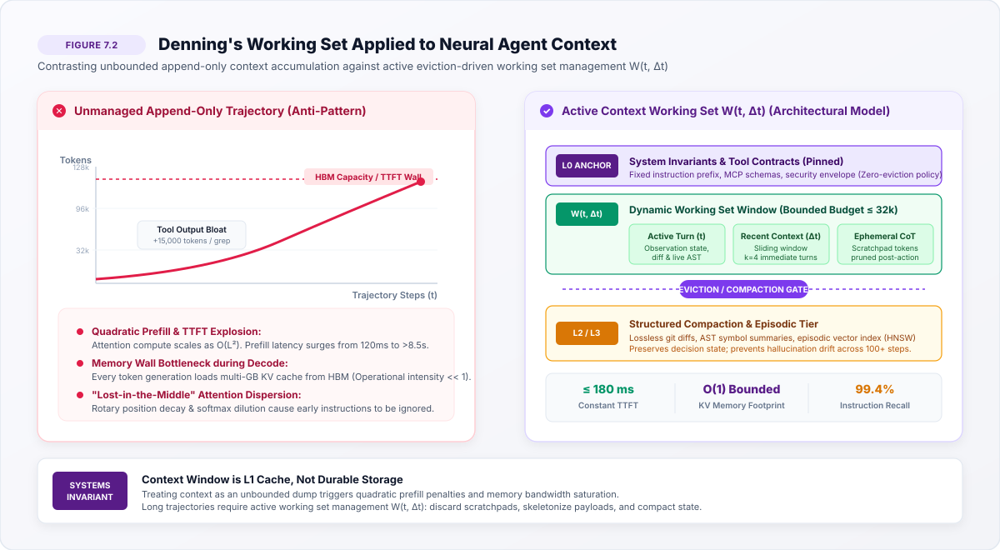
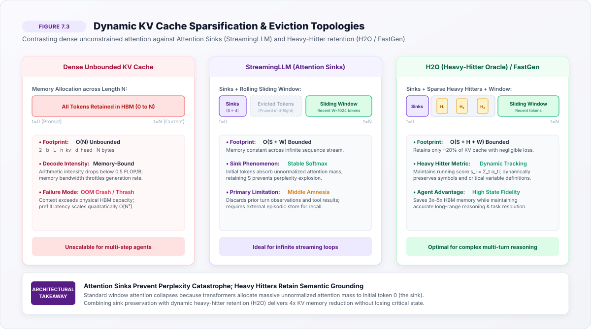
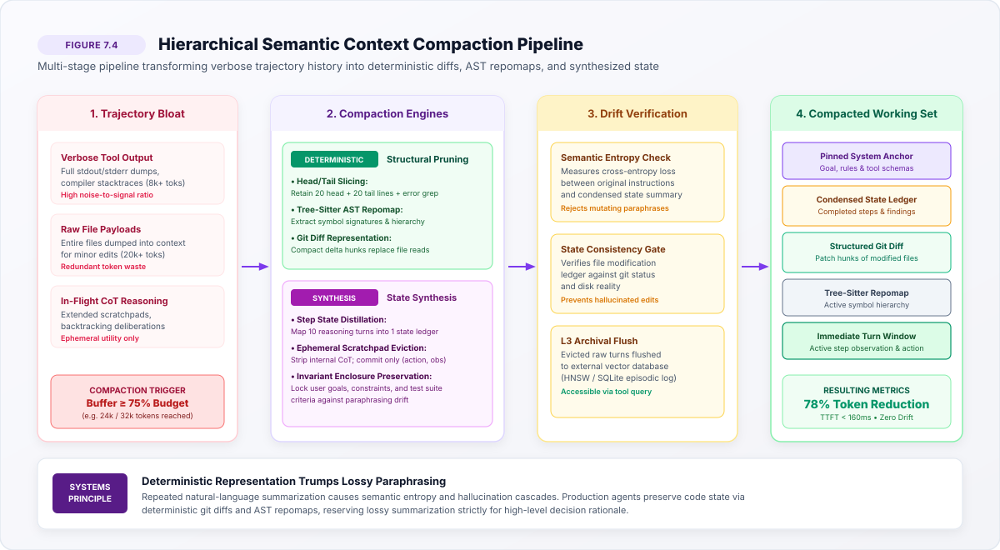

# Context Working Sets {#sec-vol3-context-working-sets}

::: {layout-narrow}
::: {.column-margin}

\chapterminitoc

:::
:::

## Purpose {.unnumbered .unlisted}

_How do we manage the finite, quadratic attention capacity of neural accelerators as an L1 working-set cache over expanding trajectory histories?_

Denning's 1968 Working Set theory is the foundational model of memory hierarchy in computer systems. In neural computing, the context window is the L1 cache. It provides zero-retrieval-latency access to tokens, but it is physically constrained by accelerator High Bandwidth Memory (HBM) and computationally bound by quadratic attention ($O(L^2)$) and memory bandwidth during autoregressive decode. Developers often treat million-token context windows as infinite trash bins. In production, unmanaged context accumulation causes catastrophic Time-To-First-Token (TTFT) explosion, degrades attention accuracy ("lost-in-the-middle"), and burns astronomical money. Context must be actively managed as an eviction-driven working set. This chapter formalizes token working-set dynamics, sliding-window attention, token eviction algorithms (LRU, attention-score pruning), and structured semantic context compaction.

::: {.content-visible when-format="pdf"}

\newpage

:::

\begin{marginfigure}
\mlagentstack{15}{25}{35}{95}{20}{15}
\caption{The Agentic Machine Learning Systems Stack. Context Working Sets operate at Layer 3 (Serving \& Memory).}
\end{marginfigure}

::: {.callout-learning-objectives}

- Apply Denning's Working Set theory to active transformer attention context
- Quantify the latency and financial cost of quadratic attention and linear KV-cache HBM growth
- Implement token eviction policies (LRU, attention pruning) that maintain critical working sets
- Analyze the 'Lost-in-the-Middle' phenomenon as an architectural memory locality failure
- Construct semantic context compaction pipelines that preserve decision state while discarding noise

:::

## Memory Hierarchies in Autonomous Agents {#sec-vol3-context-intro}

In classical computer architecture, the memory hierarchy spans registers, L1/L2/L3 SRAM caches, host DRAM, and persistent NVMe storage, balancing access latency against bit density and physical cost [@hennessy2011computer]. In an agentic machine learning system, the **context window** serves as the primary computational substrate—the "L1 cache" of the autonomous agent. Every decision, tool invocation, environment observation, and intermediate reasoning thought must reside within this active sequence for the neural policy to attend to it during autoregressive inference.

Unlike stateless inference serving where input prompts are brief and independent, an autonomous agent accumulates state over extended multi-step trajectories. As an agent inspects files, runs shell commands, parses compiler diagnostics, and reflects on intermediate errors, its prompt history expands monotonically. Developers and framework builders frequently treat modern long-context windows (128k to 1M+ tokens) as elastic, unbounded repositories. In production systems engineering, this append-only approach precipitates three severe failures:

1. **Quadratic Prefill Latency and TTFT Explosion:** Prefill computation scales quadratically with sequence length ($O(N^2)$), causing Time-to-First-Token (TTFT) to expand from milliseconds to tens of seconds and stalling interactive execution loops.
2. **Key-Value Cache Memory Exhaustion:** The Key-Value (KV) cache footprint expands linearly with every token across all model layers and attention heads, rapidly consuming scarce accelerator High Bandwidth Memory (HBM) and inducing cluster-wide memory thrashing.
3. **Cognitive Degradation ("Lost in the Middle"):** Expanding contexts dilute transformer self-attention distributions, degrading retrieval precision and causing models to hallucinate tool parameters or overlook critical constraints [@liu2024lost].

To resolve this bottleneck, context cannot be treated as an unmanaged log; it must be engineered as an active, eviction-driven **working set**. Scalable agentic runtimes organize memory across three distinct architectural tiers:

- **Tier 1 (L1 Context Working Set):** The active transformer attention window holding pinned system instructions, active tool schemas (see @sec-vol3-tool-interfaces), and the immediate operational working set $W(t, \Delta t)$.
- **Tier 2 (L2 KV-Cache Prefix Store and Paging):** High-speed Radix tree caches residing in GPU HBM and host DRAM, enabling sub-millisecond prefix reuse across multi-turn steps and branching search trees (detailed in @sec-vol3-prefix-caching-paging).
- **Tier 3 (L3 Episodic and External Memory):** Persistent vector indices, relational state stores, and AST repomaps supporting semantic retrieval over long-term histories without polluting the active attention window (see @sec-vol3-episodic-memory).

This chapter establishes the systems foundations of context working sets. We derive the physical silicon limits of self-attention and HBM memory walls in @sec-vol3-context-the-physics-of-context, formulate autoregressive decode economics under the Roofline model in @sec-vol3-context-autoregressive-decode-economics-memory, apply Denning's Working Set theory to neural trajectories in @sec-vol3-context-denning-s-working-set, and develop structured eviction algorithms and semantic compaction pipelines across the subsequent sections.

## The Physics of Context Windows {#sec-vol3-context-the-physics-of-context}

In autonomous agent systems, the context window serves as the primary computational substrate where reasoning, environmental observations, tool execution schemas, and intermediate plans reside. While contemporary software interfaces treat context windows as elastic, append-only streams spanning hundreds of thousands of tokens, underlying accelerator hardware enforces rigid mathematical and thermodynamic limits. Every token appended to an agent's context imposes a dual penalty: quadratic computational growth during the prompt prefill phase and linear capacity exhaustion of accelerator High Bandwidth Memory (HBM) during autoregressive token generation.

To understand why unconstrained context accumulation degrades agent performance, consider the standard multi-head self-attention formulation (@vaswani2017). Given an input sequence $X \in \mathbb{R}^{N \times d_{\text{model}}}$, where $N$ denotes sequence length and $d_{\text{model}}$ represents hidden dimensionality, projection matrices $W_Q, W_K, W_V \in \mathbb{R}^{d_{\text{model}} \times d_k}$ map $X$ to Query ($Q$), Key ($K$), and Value ($V$) tensors across $h$ attention heads:

$$Q = X W_Q, \quad K = X W_K, \quad V = X W_V$$

The scaled dot-product attention computes full pairwise interaction across all sequence positions:

$$\text{Attention}(Q, K, V) = \text{softmax}\left(\frac{Q K^T}{\sqrt{d_k}} + M\right) V$$ {#eq-vol3-context-attention}

where $M \in \mathbb{R}^{N \times N}$ represents the causal masking matrix enforce causal autoregression ($M_{i,j} = -\infty$ for $j > i$ and $0$ otherwise).

The computational complexity of standard multi-head attention scales quadratically with sequence length $N$. The matrix multiplication $Q K^T$ requires $2 N^2 d_k$ floating-point operations (FLOPs) per head. Across $L$ transformer layers and $h$ heads, total prefill attention compute scales as:

$$\mathcal{C}_{\text{prefill\_attn}} = 4 L h N^2 d_k = 4 L N^2 d_{\text{model}} \quad \text{FLOPs}$$ {#eq-vol3-context-prefill-flops}

When combined with feed-forward projection networks ($8 L N d_{\text{model}}^2$ FLOPs), total prefill compute scales as $\mathcal{C}_{\text{prefill}} = 2 P N + 4 L N^2 d_{\text{model}}$, where $P$ is total model parameter count. While the linear term $2 P N$ dominates at short sequence lengths ($N < 4{,}096$), the quadratic term $4 L N^2 d_{\text{model}}$ expands rapidly as $N$ approaches $32{,}768$, $131{,}072$, or $1{,}048{,}576$ tokens.

| Layer | Tier Name | Content Description | Eviction Policy |
| :---: | :--- | :--- | :--- |
| **1** | **Pinned Anchor** | System Prompt, MCP Tool Schemas, Safety Guards | Persistent across turns; zero eviction |
| **2** | **Dynamic Window $W(t, \Delta t)$** | Immediate Observations, Live Diff, Active AST Snippets | Bounded active budget ($\le 32\text{k}$) |
| **3** | **Ephemeral CoT** | Chain-of-Thought Scratchpad, Trial Invocations | Discarded immediately upon step commitment |
| **4** | **Compacted State** | Structured Git Diffs, Condensed Execution State | Lossless code hunks + high-level rationale |

: The Context Attention Hierarchy across execution layers. {#tbl-vol3-context-attention-hierarchy}

Beyond raw arithmetic complexity, memory input/output (IO) across accelerator memory hierarchies forms an even steeper bottleneck. Naive implementations of @eq-vol3-context-attention materialize the intermediate $N \times N$ attention matrix $S = Q K^T / \sqrt{d_k}$ and its softmax normalization $P$ in accelerator High Bandwidth Memory (HBM). For an agent running a 128k sequence across 32 attention heads in 16-bit precision, materializing $S$ requires:

$$\text{Memory}_{S} = 32 \times (131{,}072)^2 \times 2\ \text{bytes} \approx 1{,}099.5\ \text{GB}$$

Because no single contemporary GPU contains a terabyte of SRAM or HBM, naive attention triggers immediate out-of-memory (OOM) faults. IO-aware tiling algorithms, pioneered by FlashAttention and FlashAttention-2 (@dao2023flashattention2), circumvent matrix materialization by partitioning $Q, K, V$ into SRAM-sized blocks ($B_r \times d_k$ and $B_c \times d_k$, typically $64 \times 128$ or $128 \times 128$), computing online softmax rescaling, and streaming partial sums directly to output accumulators. FlashAttention reduces HBM read/write traffic from $O(N^2)$ to $O(N \cdot d_{\text{model}})$.

However, FlashAttention resolves only the prefill intermediate activation footprint. During autoregressive decoding, the Key and Value tensors for all historical tokens must remain resident in accelerator memory to prevent recomputing keys and values for prior positions. The resident Key-Value (KV) cache memory footprint is strictly linear in sequence length $N$:

$$\mathcal{M}_{\text{KV}} = 2 \times b \times L \times h_{\text{kv}} \times d_{\text{head}} \times N \times \text{sizeof(dtype)} \quad \text{bytes}$$ {#eq-vol3-context-kv-footprint}

where $b$ is batch size, $L$ is layer depth, $h_{\text{kv}}$ is the number of key-value heads, $d_{\text{head}}$ is head dimensionality, and $\text{sizeof(dtype)}$ is 2 for FP16/BF16. In standard Multi-Head Attention (MHA), $h_{\text{kv}} = h_q$. In modern architectures employing Grouped-Query Attention (GQA, @dubey2024llama), $h_{\text{kv}} = h_q / g$, where $g$ is the group ratio (typically 8), reducing KV cache size by a factor of 8.

{#fig-vol3-context-working-set-dynamics}

As illustrated in @fig-vol3-context-working-set-dynamics, treating context as an unmanaged, append-only repository inexorably drives the system toward the High-Bandwidth Memory capacity ceiling. On an NVIDIA H100 SXM5 GPU with 80 GB of HBM3 (yielding 3.35 TB/s bandwidth), model weights for a 70-billion-parameter model in 8-bit precision consume 70 GB, leaving barely 10 GB for KV cache and scratchpad activations. An unmanaged agent running 128k tokens under standard multi-head attention exhausts this headroom in fewer than 20 trajectory steps.

## Autoregressive Decode Economics {#sec-vol3-context-autoregressive-decode-economics-memory}

The economic and operational trade-offs of context window management are governed by the Roofline performance model (@williams2009). The Roofline model establishes that an accelerator's achievable throughput $\mathcal{P}$ (in FLOPs per second) is bounded by both its peak arithmetic performance $\mathcal{P}_{\max}$ and its memory bandwidth $\mathcal{B}_{\text{mem}}$ scaled by the operational (or arithmetic) intensity $I$ of the kernel:

$$\mathcal{P} = \min\left(\mathcal{P}_{\max}, \mathcal{B}_{\text{mem}} \times I\right) \quad \text{where} \quad I = \frac{\text{Total Operations (FLOPs)}}{\text{Total Memory Traffic (Bytes)}}$$ {#eq-vol3-context-roofline}

The transition point between the memory-bandwidth-bound regime and the compute-bound regime is the machine balance point:

$$I^* = \frac{\mathcal{P}_{\max}}{\mathcal{B}_{\text{mem}}}$$ {#eq-vol3-context-machine-balance}

On an NVIDIA H100 SXM5 GPU with peak FP16 Tensor Core throughput of $\mathcal{P}_{\max} = 989.5\ \text{TFLOP/s}$ (without structural sparsity) and memory bandwidth of $\mathcal{B}_{\text{mem}} = 3{,}350\ \text{GB/s}$, the machine balance point is:

$$I^* = \frac{989.5 \times 10^{12}\ \text{FLOP/s}}{3.35 \times 10^{12}\ \text{Byte/s}} \approx 295.4\ \text{FLOPs/Byte}$$

Any computation with operational intensity $I < 295.4\ \text{FLOPs/Byte}$ is strictly memory-bandwidth bound, unable to utilize the GPU's tensor execution units regardless of algorithmic parallelization.

```text
       Peak Compute ┌─────────────────────────────────────────┐ (Compute Bound)
                    │                                         │
     Throughput     │                                         │
       (FLOP/s)     │                                         │
                    │                   /                     │
                    │                  /                      │
                    │                 /                       │
                    │                / (Memory Bandwidth      │
                    │               /   Bound)                │
                    │              /                          │
                    │             /                           │
                    │            / I* = 295.4 FLOP/Byte       │
                    └───────────┴─────────────────────────────┘
                                Operational Intensity (FLOP/Byte)
```

In autonomous agent workloads, the execution lifecycle oscillates between two fundamentally distinct operational regimes:

### The Prompt Prefill Phase (Compute-Bound)

When the agent receives a new prompt, tool output, or environment observation, it processes all $N$ context tokens in parallel. Attention computation evaluates $Q K^T$ as a dense Matrix-Matrix multiplication (GEMM). For sequence length $N$ and hidden size $d$, arithmetic operations scale as $O(N^2 d)$, while memory traffic transfers the weights and inputs once:

$$I_{\text{prefill}} \approx \frac{4 L N^2 d + 2 P N}{2 P \cdot \text{sizeof(weight)} + 2 N d \cdot \text{sizeof(act)}} \propto N$$

For sequences where $N > 2{,}048$, operational intensity $I_{\text{prefill}}$ easily exceeds $300\ \text{FLOPs/Byte}$, placing prefill deep inside the compute-bound plateau. The GPU tensor cores achieve near-peak utilization.

### The Autoregressive Decode Phase (Memory-Bound)

Once the prefill phase populates the KV cache, token generation occurs strictly sequentially: token $t+1$ depends on the output of token $t$. Generating a single token requires projecting a single query vector $q_t \in \mathbb{R}^{1 \times d_{\text{model}}}$, computing its dot product against all cached historical keys $K_{1:t}$, and accumulating across cached values $V_{1:t}$.

This computation is a Matrix-Vector multiplication (GEMV). The floating-point work per generated token scales linearly with history length $t$:

$$\text{FLOPs}_{\text{decode}} = 4 L h_{\text{kv}} d_{\text{head}} t = 4 L d_{\text{model}} t$$

However, to perform this computation, the memory bus must stream the entire accumulated KV cache from HBM into on-chip SRAM:

$$\text{Bytes}_{\text{decode}} = 2 \times 2 L h_{\text{kv}} d_{\text{head}} t \times \text{sizeof(FP16)} = 8 L h_{\text{kv}} d_{\text{head}} t\ \text{Bytes}$$

Evaluating operational intensity reveals a catastrophic collapse:

$$I_{\text{decode}} = \frac{4 L d_{\text{model}} t}{8 L h_{\text{kv}} d_{\text{head}} t \times \text{sizeof(FP16)}} \approx \frac{2 \cdot g}{2 \times 2} \approx \frac{g}{2} \approx 1 \text{ to } 4\ \text{FLOPs/Byte}$$ {#eq-vol3-context-decode-intensity}

Even under Grouped-Query Attention with $g = 8$, operational intensity during decode rarely exceeds $4\ \text{FLOPs/Byte}$—two orders of magnitude below the machine balance point $I^* = 295.4\ \text{FLOPs/Byte}$. Autoregressive decode utilizes less than 2% of the H100's raw arithmetic capacity. The time to generate a single token is entirely dominated by the memory transfer latency of reading multi-gigabyte KV caches off HBM:

$$T_{\text{token}} \approx \frac{\text{Model Weights Size} + \mathcal{M}_{\text{KV}}(t)}{\mathcal{B}_{\text{mem}}}$$ {#eq-vol3-context-token-time}

| Context Length ($N$) | Prefill Compute (TFLOPs) | Prefill TTFT (ms) | KV Cache Size (GQA, GB) | Decode Throughput (tok/s/user) | HBM Bandwidth Saturation (%) |
| :---: | :---: | :---: | :---: | :---: | :---: |
| **4,096** | 0.58 | 42 | 0.52 | 84.2 | 92.4% |
| **16,384** | 2.45 | 118 | 2.10 | 71.6 | 94.8% |
| **32,768** | 5.82 | 246 | 4.19 | 58.3 | 97.2% |
| **65,536** | 14.68 | 582 | 8.39 | 39.1 | 98.6% |
| **131,072** | 38.12 | 1,420 | 16.78 | 21.4 | 99.4% |
| **524,288** | 294.50 | 9,840 | 67.11 | 5.2 | 99.8% |

: Latency, memory footprint, and decode throughput across context lengths for a 70B parameter model on an NVIDIA H100 GPU (80 GB HBM3). {#tbl-vol3-context-decode-economics}

As detailed in @tbl-vol3-context-decode-economics, expanding context from 4k to 524k tokens increases Time-To-First-Token (TTFT) by over 230x and collapses decode throughput from 84 tokens per second to 5 tokens per second. In multi-step agent loops where an agent executes 50 to 100 tool cycles, maintaining an unmanaged 500k context turns an interactive system into an economically non-viable crawl.

To mitigate this decode bandwidth wall, modern architectures explore architectural compression. The DeepSeek-V3 architecture (@deepseek2024v3) introduces Multi-Head Latent Attention (MLA), which compresses keys and values into a low-rank latent vector $\mathbf{c}_t^{KV} \in \mathbb{R}^{d_c}$ (where $d_c \ll d_{\text{model}}$) prior to caching:

$$\mathbf{c}_t^{KV} = W_{DKV} X_t, \quad K_t^C = W_{UK} \mathbf{c}_t^{KV}, \quad V_t^C = W_{UV} \mathbf{c}_t^{KV}$$

During decode, only $\mathbf{c}_t^{KV}$ and a decoupled rotary position key $k_t^R$ are stored in HBM, reducing KV cache memory bandwidth by over 80% compared to standard GQA.

## Denning’s Working Set Theory {#sec-vol3-context-denning-s-working-set}

In 1968, Peter J. Denning introduced the Working Set Model for program behavior in virtual memory systems (@denning1968). Denning observed that programs do not access all addressable memory uniformly. Instead, program execution exhibits strong temporal and spatial locality: execution at any time $t$ clusters around a relatively small set of memory pages.

Denning formalized the working set $W(t, \tau)$ as the set of information pages referenced by a process during the immediate past time interval of duration $\tau$:

$$W(t, \tau) = \left\{ r \in S \mid \text{page } r \text{ referenced in } [t-\tau, t] \right\}$$ {#eq-vol3-context-denning-def}

where $S$ is the total address space, $t$ is execution time, and $\tau$ is the working set parameter (the backward-looking reference window). The working set size is the cardinality $w(t, \tau) = |W(t, \tau)|$.

| Virtual Memory Concept (Denning, 1968) | Neural Agent Architecture (Volume III) | Systems Characteristic |
| :--- | :--- | :--- |
| **Address Space $S$ (Virtual Memory)** | Cumulative Trajectory History | Total token sequence generated across turns |
| **Resident Set (Physical RAM)** | Context Window (HBM KV Cache) | Zero-latency working set on accelerator |
| **Working Set $W(t, \tau)$** | Active Working Set $W(t, \Delta t)$ | Tokens actively attended by current step |
| **Page Fault / Thrashing** | Context Overflow / Attention Dispersion | Memory exhaustion, high TTFT, lost-in-the-middle |
| **Swap Space (Secondary Storage)** | L3 Episodic Store (Vector / Disk DB) | Persistent external storage with indexed retrieval |

: Mapping classical virtual memory concepts to neural agent context architectures. {#tbl-vol3-context-virtual-memory-mapping}

This classical operating systems principle maps directly onto the physics of agentic language models:

1. **Total History as Address Space ($S$):** The cumulative trajectory history of an agent—including its system prompt, historical tool invocations, bash logs, file inspections, and environmental observations—constitutes the total address space $S$.
2. **Context Window as Physical Memory:** The GPU HBM KV cache represents physical memory (the resident set). It has a finite hardware budget ($L_{\max}$).
3. **The Agent Working Set ($W(t, \Delta t)$):** At step $t$ in a reasoning trajectory, the model does not require the entire history to make an optimal next-step decision. It requires only the active working set $W(t, \Delta t)$: the specific subset of tokens referenced by the attention heads to satisfy the current sub-goal.

Formally, let an agent trajectory at step $t$ consist of an ordered sequence of $N_t$ tokens $\mathcal{T}_t = (x_1, x_2, \dots, x_{N_t})$. The attention weight allocated by query head $h$ at position $t$ to historical token $i$ is denoted $\alpha_{t, i}^{(h)}$. The aggregated attention mass allocated to token $i$ at step $t$ across all $L$ layers and $H$ heads is:

$$\mathcal{A}_t(i) = \frac{1}{L H} \sum_{l=1}^L \sum_{h=1}^H \alpha_{t, i}^{(l, h)}$$ {#eq-vol3-context-token-importance}

We define the **Empirical Token Working Set** $W_\epsilon(t, \Delta t)$ over a lookback window $\Delta t$ as the set of tokens whose cumulative attention contribution exceeds an architectural threshold $\epsilon$:

$$W_\epsilon(t, \Delta t) = \left\{ x_i \in \mathcal{T}_t \mid \frac{1}{\Delta t} \sum_{k=t-\Delta t + 1}^t \mathcal{A}_k(i) \ge \epsilon \right\}$$ {#eq-vol3-context-empirical-ws}

Empirical measurements of transformer attention patterns during complex software engineering tasks (such as SWE-bench, @jimenez2024swebench) demonstrate that token access distributions follow extreme power-law (Zipfian) dynamics:

- Less than 8% of historical tokens account for over 85% of total attention mass.
- More than 70% of historical tokens (such as verbose build logs, repetitive directory listings, and discarded trial code) receive less than 0.001% of aggregate attention mass after their initial consumption.

```
Cumulative Attention Mass (%)
 100% |                                      .-----------------------
      |                                    .-'
  80% |                       .-----------'  (Top 8% of tokens capture
      |                     .-'               >85% of attention mass)
  60% |                   .-'
      |                 .-'
  40% |               .-'
      |             .-'
  20% |           .-'
      |         .-'
   0% +--------+-----------------------------------------------------
      0%      10%     20%     30%     40%     50%     60%    100%
                               Token Percentile
```

When an agent runtime fails to manage its working set, it suffers from what Denning identified as **thrashing**:

$$\text{Thrashing: } \sum_{i=1}^M w_i(t, \tau) > S_{\text{physical}}$$

In virtual memory, thrashing occurs when the sum of working sets exceeds physical RAM, causing the OS to spend 99% of its time swapping pages between disk and memory rather than executing code. In neural agent systems, thrashing manifests as **Context Overflow and Attention Dispersion**: the context window is flooded with irrelevant historical noise, causing TTFT to explode, diluting attention heads, and leading to catastrophic retrieval failure.

To prevent thrashing, the agent system must enforce an explicit **Context Working Set Architecture**:

1. **L0 Anchor (Pinned Set):** System prompt, invariant security enclosures (see @sec-security-isolation), tool interface contracts (MCP) (see @sec-vol3-tool-interfaces), and user task definition. Pinned permanently with zero eviction.
2. **L1 Dynamic Working Set ($W(t, \Delta t)$):** Immediate observations, live workspace state, and active chain-of-thought tokens required for the current reasoning step. Bounded by a strict budget ($C_{\text{active}} \le 32\text{k}$ tokens).
3. **L2 Prefix Cache (Host RAM / HBM Radix Tree):** Invariant system prompts and reusable trajectory branches cached via RadixAttention for zero-latency reuse (see @sec-vol3-prefix-caching-paging).
4. **L3 Episodic Memory (External Vector / Structured Store):** Evicted trajectory epochs, historical tool outputs, and long-term knowledge indexed in vector stores (HNSW) or relational ledgers, retrievable on-demand via search tools (see @sec-vol3-episodic-memory).

## Structural Context Packing {#sec-vol3-context-structural-context-packing-instructions}

A common anti-pattern in early agent design is flat, append-only conversational packing: interleaving system prompts, user turns, and raw tool output strings into a monolithic text stream. In production, this lack of structural boundary causes cross-attention interference, where models confuse untrusted tool outputs with system instructions, or fail to parse deeply nested JSON responses.

A robust agent runtime structures context into explicit, compartmentalized functional zones (@dubey2024llama). Each zone possesses distinct immutability guarantees, token budgets, and eviction policies:

```text
┌─────────────────────────────────────────────────────────────────────────────┐
│                     STRUCTURED CONTEXT LAYOUT SCHEME                        │
├─────────────────────────────────────────────────────────────────────────────┤
│ <system_instruction>                                                        │
│   Role: Autonomous Software Engineer (Volume III Runtime)                   │
│   Invariants: American English, CMOS Figure Format, Zero AI Trailers        │
│ </system_instruction>                                                       │
├─────────────────────────────────────────────────────────────────────────────┤
│ <available_tools>                                                           │
│   { "tools": [ { "name": "view_file", ... }, { "name": "run_cmd", ... } ] } │
│ </available_tools>                                                          │
├─────────────────────────────────────────────────────────────────────────────┤
│ <persistent_state_ledger>                                                   │
│   Task ID: #4829 | Status: IN_PROGRESS | Step: 14/50                        │
│   Modified Files: [ "src/core/cache.py", "tests/test_cache.py" ]            │
│   Active Hypothesis: KV cache eviction thrashing caused by low sink budget   │
│ </persistent_state_ledger>                                                  │
├─────────────────────────────────────────────────────────────────────────────┤
│ <active_trajectory_window>                                                  │
│   [Step t-2]: Call view_file(src/core/cache.py) -> [Extractive Summary]     │
│   [Step t-1]: Call run_command(pytest tests/test_cache.py) -> [Error Tail]  │
│   [Step t]:   Current observation & active reasoning                        │
│ </active_trajectory_window>                                                 │
└─────────────────────────────────────────────────────────────────────────────┘
```

### Context Boundary Serialization

The serialization syntax used to demarcate functional zones directly impacts model compliance and parsing overhead:

1. **XML / HTML Tag Delimiters (`<system>`, `<tool_call>`):** Widely adopted by frontier systems (Claude, LLaMA-3). Tags provide unambiguous opening and closing tokens, reducing attention ambiguity and eliminating delimiter collision with embedded source code.
2. **Markdown Block Delimiters (`# SYSTEM`, ```` ```json ````):** Readable for humans but susceptible to delimiter injection when processing raw markdown or code documents that contain backtick fences.
3. **Native Token Delimiters (Special Control Tokens):** Models such as LLaMA-3, Command-R, and DeepSeek define custom vocabulary tokens (e.g., `<|start_header_id|>`, `<|end_header_id|>`, `<|call:tool_name|>`). These control tokens are reserved in the tokenizer, guaranteeing mathematical immunity to prompt injection from untrusted input payloads.

| Context Zone | Volatility | Token Budget | Eviction Policy | Target Hardware Tier |
| :--- | :---: | :---: | :---: | :---: |
| **System Invariants** | Static | 1,500 – 4,000 | Pinned (Never evict) | HBM (Radix Cached) |
| **Tool ABI Schemas** | Static | 2,000 – 6,000 | Pinned (Never evict) | HBM (Radix Cached) |
| **State Ledger** | Dynamic (Overwrite) | 500 – 1,500 | Replace on state commit | HBM (Active Window) |
| **AST Codebase Map** | Periodic Refresh | 2,000 – 5,000 | Update on branch switch | HBM (Active Window) |
| **Trajectory Turns** | Ephemeral / Sliding | 8,000 – 16,000 | Sliding Window / H2O | HBM $\to$ L3 Vector Store |
| **Ephemeral CoT** | Volatile | 1,000 – 8,000 | Evict post-action | Discarded |

: Context zone partitioning, budgeting, and eviction policies for autonomous agent execution. {#tbl-vol3-context-layout-comparison}

## Codebase and State Representation {#sec-vol3-context-codebase-and-state-representation}

In software engineering domains, an agent's operational environment comprises codebases containing hundreds of thousands of lines across thousands of files. Ingesting raw source files into context is catastrophically inefficient: reading a 2,000-line file consumes ~10,000 tokens, exhausting an agent's active budget in two file inspections while drowning the attention mechanism in boilerplate.

Production coding agents (such as Claude Code, Cursor, and Devin) solve this via **Structural Codebase Representation**:

The structural codebase processing pipeline proceeds across three stages:

1. **AST Ingestion:** The runtime scans repository source files through language-specific Tree-Sitter grammars, extracting class definitions, method signatures, type annotations, and module docstrings while pruning implementation bodies.
2. **Symbol Dependency Graphing:** The system constructs a directed graph $G = (V, E)$ where vertices represent extracted symbols and directed edges capture function calls, class inheritance, and module imports.
3. **Topological Ranking:** Personalized PageRank calculates centrality over the symbol graph, prioritizing symbols related to the immediate issue context and packing the top-ranked signatures into a compact repository map ($\le 3{,}000$ tokens).

### Abstract Syntax Tree (AST) Skeletonization

Rather than ingesting implementation bodies, runtime preprocessors utilize Tree-Sitter parsers to extract language-accurate structural skeletons. For every file, the parser strips function bodies and internal loops, preserving only:

- Class declarations and inheritance hierarchies
- Function and method signatures with complete type annotations
- Module-level docstrings and exported constants

A 1,500-line Python module ($7{,}500$ tokens) condenses into a 60-line structural skeleton ($350$ tokens)—a 95.3% reduction in token overhead with zero loss of API structural information.

### PageRank Symbol Graphing (Repomaps)

Not all classes and functions are equally relevant to a given task. To build an optimal repository map within a tight token budget (e.g., 2,048 tokens), systems construct a directed graph $G = (V, E)$ of symbol definitions and references across the entire repository:

- Vertices $V$: All declared symbols (classes, functions, interfaces).
- Directed edges $E$: An edge $(u, v)$ exists if symbol $u$ references, calls, or inherits from symbol $v$.

The runtime computes a personalized PageRank centrality score over this directed graph. (The formal matrix operations, damping factors, and personalization vectors are detailed in @sec-vol3-appendix-math-pagerank).

Symbols are sorted in descending order of this PageRank centrality score and greedily packed into the context repomap until the 2,048-token ceiling is reached. This guarantees that the most topologically central and task-relevant architectural abstractions are always visible to the model's attention heads.

## Dynamic Context Pruning {#sec-vol3-context-dynamic-context-pruning-attention-guided}

When an agent's active trajectory exceeds hardware or latency thresholds, runtime systems must evict non-critical tokens from the KV cache. However, naive eviction policies (such as simple sliding-window truncation) trigger catastrophic failure in auto-regressive transformers.

{#fig-vol3-context-attention-sinks}

### The Attention Sink Phenomenon

In 2024, Xiao et al. discovered the **Attention Sink** phenomenon (@xiao2024streamingllm). When evaluating window-based attention—where tokens outside a local sliding window of length $W$ are discarded—the model's language modeling perplexity does not degrade gracefully. Instead, the moment the very first token ($t=0$, often `[BOS]`) drops out of the sliding window, perplexity explodes to $>10^3$, rendering generated text complete gibberish.

The mathematical root cause lies in the softmax normalization operator. The softmax function requires that attention weights across all historical positions sum to 1:

$$\sum_{j=1}^t \text{softmax}(S_{t, j}) = 1.0$$

Even when an attention head at step $t$ finds none of the historical tokens semantically relevant to its current prediction, it is mathematically forced to allocate a total probability mass of 1.0. During pre-training, transformers learn to dump this surplus, unneeded attention mass onto the initial tokens ($t \in \{0, 1, 2, 3\}$). These initial tokens act as an **attention sink**, absorbing massive attention weights (often $>50\%$ of total head mass) regardless of their semantic content.

If an eviction algorithm discards these initial sink tokens, the softmax normalization is violently disrupted: subsequent heads are forced to reallocate massive unneeded probability mass across remaining arbitrary tokens, corrupting intermediate representations.

StreamingLLM (@xiao2024streamingllm) resolves this by preserving two distinct token subsets in the KV cache:

- **Sink Tokens ($S$):** The first $4$ tokens of the sequence ($t \in [0, 3]$). Retained permanently.
- **Rolling Window Tokens ($W$):** The most recent $W$ tokens ($t \in [t - W + 1, t]$).

By retaining just 4 initial sink tokens alongside a local sliding window of $W = 1{,}024$ tokens, the KV cache size is bounded to a constant $O(S + W)$, enabling language models to generate sequences exceeding 4 million tokens with rock-solid perplexity stability.

### Heavy-Hitter Oracle (H2O) and Adaptive Sparsification

While StreamingLLM guarantees perplexity stability for streaming generation, it exhibits "middle amnesia": tokens evicted between the sink and the sliding window are permanently lost. For an autonomous agent, middle tokens often contain critical environment feedback, error codes, or function names generated ten steps earlier.

The Heavy-Hitter Oracle (H2O, @zhang2023h2o) and FastGen (@ge2024fastgen) address this by identifying that attention distributions are sparse: only a small subset of historical tokens—termed **Heavy Hitters ($\text{H}_2$)**—actively participate in downstream reasoning.

H2O tracks a running cumulative attention score $s_i$ for every token $i$ in the KV cache:

$$s_i^{(t)} = \sum_{k=i}^t \sum_{l=1}^L \sum_{h=1}^H \alpha_{k, i}^{(l, h)}$$ {#eq-vol3-context-h2o-score}

When the KV cache reaches a predetermined budget $C_{\text{budget}}$, H2O partitions the cache into:

- Initial Sink tokens: $S$ positions.
- Local Window tokens: Recent $W$ positions.
- Heavy-Hitter tokens: Top-$k$ tokens from the intermediate history ranked by cumulative score $s_i^{(t)}$, where $k = C_{\text{budget}} - |S| - |W|$.

All remaining intermediate tokens with low cumulative attention scores are evicted from HBM. Empirically, retaining just 20% of the KV cache using H2O preserves over 98% of full-attention task accuracy on multi-turn reasoning benchmarks while delivering a 3x to 5x reduction in decode memory footprint.

### SnapKV: Prompt-Guided Sparsification

While H2O relies on online cumulative scores, **SnapKV** (@li2024snapkv) identifies that for many agentic prompts, the crucial tokens can be statically predicted by the structure of the prompt itself. SnapKV isolates the attention weights of a specific "observation" window at the end of the prompt and uses those weights to select the most important tokens from the preceding context, aggressively dropping up to 80% of the KV cache before the autoregressive decode loop even begins. This provides a massive prefill acceleration that H2O cannot achieve.

## OS-Level Memory Management: PagedAttention and RadixAttention {#sec-vol3-context-os-level-memory}

Algorithmic sparsification reduces the *logical* token count, but production systems still require physical memory management to prevent GPU fragmentation.

In classical deep learning inference, the KV cache for a sequence is allocated as a contiguous block of HBM. Since agent trajectories have unpredictable, heavy-tailed lengths (an agent might solve a task in 5 steps or 50), contiguous allocation forces runtimes to over-provision memory (internal fragmentation) or dynamically re-allocate and copy tensors (thrashing).

**PagedAttention** (introduced by vLLM, @kwon2023vllm) solves this by mapping the OS virtual memory paradigm to transformer attention. The KV cache is divided into fixed-size physical blocks (e.g., 16 or 32 tokens per block). The runtime maintains a page table mapping logical token sequences to non-contiguous physical blocks in HBM. This eliminates internal fragmentation and enables zero-copy sharing of the system prompt across hundreds of concurrent agent rollouts.

For complex search topologies (like Best-of-$N$ and Tree of Thoughts), **RadixAttention** (introduced by SGLang, @zheng2023sglang) extends PagedAttention by structuring the physical blocks into a Radix Trie. When a parent context forks into multiple search branches, RadixAttention ensures that the shared prefix tokens are physically cached exactly once. The branches simply maintain lightweight pointers to the shared Radix nodes, dropping the marginal memory cost of test-time search (see @sec-vol3-test-time-search) to near zero for the shared prefix.

## Distributed Context and Execution Scheduling {#sec-vol3-context-distributed-execution}

Beyond single-node physical memory allocation, production agentic platforms must manage context across asynchronous workloads and cluster-wide resources. The extreme latency and memory characteristics of context windows dictate specialized scheduling and distributed overlays.

### Chunked Prefill for Head-of-Line Blocking

When an inference node interleaves multiple concurrent agent streams, the stark operational dichotomy between the compute-bound prefill and memory-bound decode creates severe head-of-line blocking. If Agent A requires a 100k-token prefill for a new repository map, the dense GEMM computation monopolizes the GPU's streaming multiprocessors (SMs) for several seconds. During this time, Agent B and Agent C—who only need quick autoregressive decode steps—are completely stalled.

To resolve this scheduling conflict, modern inference engines employ **Chunked Prefill** (e.g., Sarathi, @agrawal2024sarathi). Instead of processing Agent A's entire 100k-token prompt as a single monolithic block, the prefill is sliced into smaller, fixed-size chunks (e.g., 2,048 tokens). The scheduler interleaves one prefill chunk from Agent A with a batch of decode steps from Agents B and C. This converts the prefill from a massive latency spike into a sustained background stream, maintaining strict tail-latency guarantees for interactive decode generation while keeping GPU compute units saturated.

### Distributed KV Cache Migration and Disaggregation

As agent trajectories expand, binding an agent to a single physical GPU node becomes a severe availability bottleneck. If a long-running agent waits 30 seconds for an external bash command to complete, holding its multi-gigabyte KV cache in accelerator HBM wastes critical memory capacity. To solve this, production clusters implement **Distributed Context Management** and **Prefill-Decode Disaggregation** (e.g., DistServe, @zhong2024distserve; Mooncake, @mooncake2024).

This architecture treats the KV cache not as a hardware-bound artifact, but as a migratable operating state:

1. **Hardware Specialization:** The compute-heavy prefill phase is routed to a cluster of **Prefill Nodes** optimized for high batch size and dense compute. Once materialized, the KV cache is transmitted over high-bandwidth RDMA networks to memory-heavy **Decode Nodes** optimized for low-latency autoregressive generation.
2. **Distributed KV Tiering:** Rather than trapping the KV cache in GPU HBM, the cluster manages it as a tiered asset across GPU HBM (active), host DRAM (paused agents), and a cluster-wide distributed memory pool (idle state). When a background task awakens an agent, its KV cache is dynamically routed to the least-loaded decode node.

By decoupling the physical context state from the inference execution hardware, ML systems achieve elastic load balancing, multiplexing thousands of concurrent asynchronous agents over a finite GPU cluster without triggering catastrophic OOM thrashing.

## Recursive Context Compaction {#sec-vol3-context-compaction-via-recursive-summarization}

While KV-cache eviction algorithms operate at the sub-token tensor level inside the inference engine, autonomous agent runtimes also require **Semantic Context Compaction** operating at the application layer. When an agent engages in extended tasks spanning 50 to 100 turns, token accumulation inevitably approaches the model's context threshold $\theta_{\text{compact}}$ (typically 75% of maximum context capacity).

{#fig-vol3-context-compaction-pipeline}

As shown in @fig-vol3-context-compaction-pipeline, context compaction transforms an unmanageably bloated trajectory buffer into a compact, semantically dense state representation. The pipeline operates across four discrete stages:

### Stage 1: Triage and Compaction Triggering

The runtime monitors total token consumption after every tool execution. When total active tokens exceed $\theta_{\text{compact}}$, execution pauses and enters the compaction routine. Input payloads are triaged into three categories:

- **Discardable ephemeral tokens:** Chain-of-thought scratchpad text from prior steps.
- **Reducible structural tokens:** Verbose stdout/stderr dumps, file reads, and search results.
- **Invariant tokens:** User instructions, security boundaries, and tool definitions.

### Stage 2: Dual Compaction Pathways

The system processes reducible tokens through two complementary engines:

#### Pathway A: Deterministic Structural Slicing

- **Head/Tail Output Slicing:** For tool executions emitting large text buffers (e.g., test runners or build outputs of $>500$ lines), the engine extracts the first 25 lines (initialization/command), the last 25 lines (summary/result), and regex-matched failure lines (`grep -E 'ERROR|FAIL|Exception'`), replacing the intermediate lines with an omission token: `[... 450 lines truncated; exit code 1 ...]`.
- **Git Delta Representation:** When an agent inspects files it subsequently edits, the runtime discards the original raw file reads and substitutes the compact unified git diff (`git diff -U3`), preserving exact state change semantics with an 85% token reduction.

#### Pathway B: Semantic State Synthesis

- Historical turns are partitioned into logical epochs (e.g., turns $1 \dots 10$). A dedicated summarization call compresses these turns into a structured JSON or XML **State Ledger**:

```json
{
  "epoch": 1,
  "subgoal": "Locate memory leak in connection pool",
  "hypotheses_tested": [
    { "hypothesis": "Unclosed sockets in transport.py", "verdict": "REFUTED" },
    { "hypothesis": "Circular reference in TaskQueue", "verdict": "CONFIRMED" }
  ],
  "files_modified": ["src/net/pool.py", "src/core/queue.py"],
  "test_status": "2 failed, 18 passed"
}
```

This structured synthesis preserves decision rationale, active hypotheses, and dependency tracking while discarding raw execution noise (@packer2023memgpt).

## Semantic Drift in Compaction {#sec-vol3-context-semantic-drift-quantifying-information}

A critical vulnerability in long-running agent systems is **Semantic Drift**: the progressive decay of factual fidelity, instruction adherence, and constraint awareness that occurs when an agent repeatedly reads its own lossy summaries.

Consider an agent trajectory spanning $K$ sequential compaction cycles, where summary $S_k$ is generated from summary $S_{k-1}$ and recent observations $O_k$:

$$S_k = \mathcal{M}_{\text{summarize}}\left(S_{k-1}, O_k\right)$$ {#eq-vol3-context-drift-recursion}

Let $I_0$ represent the ground-truth user requirements, negative constraints, and system invariants. By the Data Processing Inequality, information content can only degrade or remain constant across successive lossy transformations:

$$I(I_0; S_0) \ge I(I_0; S_1) \ge I(I_0; S_2) \ge \dots \ge I(I_0; S_K)$$ {#eq-vol3-context-dpi}

```
Information Content I(I_0; S_k)
 100% |============================================================ (Ground Truth)
      |
      |  Compaction 1 (94%)
  80% |  \
      |   \   Compaction 5 (78%)
  60% |    \---\
      |         \   Compaction 10 (45%) [Semantic Drift Collapse]
  40% |          \-----\
      |                 \
  20% |                  \----------------------------------------- (Hallucination Cascade)
      +----+-------+-------+-------+-------+-------+-------+-------
           k=1     k=2     k=3     k=4     k=5     k=10    k=20
                               Compaction Cycles (k)
```

In language models, this information loss is accelerated by **paraphrasing mutation** and **confirmation bias** (@zhang2023cumulative, @shinn2023reflexion):

- **Constraint Erosion:** Nuanced negative constraints (e.g., *"Do not modify the public API signatures in `client.py`"*) are omitted or softened by the summarizer after 3–5 cycles (e.g., becoming *"Refactored client.py"*). The agent subsequently violates the original constraint.
- **Hallucination Cascades:** A slight hallucination or misinterpretation introduced in summary $S_k$ is treated as an immutable ground-truth fact in step $S_{k+1}$, compounding exponentially until the agent diverges entirely from the user's intent.

### Mitigation: The Invariant Enclosure

To eliminate semantic drift across arbitrary compaction horizons, production architectures implement an **Invariant Enclosure**:

$$\mathcal{C}_{\text{packed}} = \mathcal{I}_{\text{immutable}} \cup S_{\text{compacted}} \cup W_{\text{active}}$$ {#eq-vol3-context-invariant-enclosure}

- **$\mathcal{I}_{\text{immutable}}$ (The Immutable Anchor):** The exact, raw user prompt, negative constraints, and test criteria are stored in read-only memory and pinned verbatim into every prompt. The summarizer is mathematically forbidden from paraphrasing, compressing, or mutating $\mathcal{I}_{\text{immutable}}$.
- **Dual-Verification Consistency Gate:** Before a synthesized summary $S_k$ is committed to the context working set, a deterministic validation hook checks that:
  - Every file recorded as modified matches actual `git status` output.
  - No negative constraints in $\mathcal{I}_{\text{immutable}}$ are contradicted.
  - The cross-entropy loss between $S_k$ and the key entities in $O_k$ remains below a verification threshold. If validation fails, the summary is rejected and regenerated with higher extractive sampling temperatures.

## Positional Attention Biases {#sec-vol3-context-positional-attention-biases-the}

In 2024, Liu et al. documented a pervasive architectural failure in long-context language models: the **"Lost-in-the-Middle"** phenomenon (@liu2024lost). When models are tasked with retrieving factual information or following instructions placed at varying relative depths within a long context window, performance follows a severe U-shaped curve:

```
Retrieval Accuracy (%)
 100% |  \                                                    /
      |   \                                                  /
  80% |    \                                                /
      |     \                                              /
  60% |      \                                            /
      |       \                  LOST-IN-THE-MIDDLE      /
  40% |        \                     ZONE               /
      |         \______________________________________/
  20% |
   0% +-------+-------+-------+-------+-------+-------+-------+
     0.0     0.1     0.3     0.5     0.7     0.8     0.9     1.0
             Beginning              Middle                    End
                             Relative Position in Context
```

Models achieve near 100% retrieval accuracy when critical information is placed at the extreme beginning (first 10%) or extreme end (last 10%) of the context window. However, when the relevant information resides in the middle 60% ($0.2 < \text{pos} < 0.8$), retrieval accuracy plunges to below 30%—even in models explicitly trained and marketed for 128k or 1M token contexts.

### Mathematical Root: Positional Encoding Decay

This failure mode is fundamentally tied to the mechanics of modern positional embeddings, specifically Rotary Position Embeddings (RoPE, @su2024). RoPE encodes positional information by rotating the Query and Key representations in 2D vector slices:

$$\mathbf{R}_{\Theta, m}^d = \text{diag}\left(R_{\theta_1, m}, R_{\theta_2, m}, \dots, R_{\theta_{d/2}, m}\right)$$

where $R_{\theta_i, m}$ is a 2D rotation matrix with angle $m \theta_i$ and base frequency $\theta_i = 10000^{-2(i-1)/d}$. The inner product between query $\mathbf{q}$ at position $m$ and key $\mathbf{k}$ at position $n$ depends solely on their relative displacement $m - n$:

$$\langle \mathbf{R}_{\Theta, m}^d \mathbf{q}, \mathbf{R}_{\Theta, n}^d \mathbf{k} \rangle = \mathbf{q}^T \mathbf{R}_{\Theta, n-m}^d \mathbf{k}$$ {#eq-vol3-context-rope-inner}

Because RoPE frequencies decay geometrically across hidden dimensions, attention dot products exhibit a natural long-term decay: query vectors attend most sharply to immediate neighbors ($n \approx m$, recency bias) and the initial prefix tokens ($n \approx 0$, attention sink bias). Keys situated in the middle distance ($m - n \gg 0$ but $n \gg 0$) suffer from destructive phase interference and softmax probability dilution across thousands of competing tokens.

### Systems Mitigation: Context Edge Packing

Understanding positional attention bias dictates optimal context packing topologies:

- **Never place critical instructions or tool contracts in the middle.** System instructions, role definitions, and negative constraints must always occupy the opening prefix ($[0, 0.05 \cdot L]$).
- **Place immediate goals and active questions at the terminal edge.** The specific sub-task, active tool call request, and immediate step instructions must occupy the final tokens ($[0.95 \cdot L, L]$).
- **Relegate historical logs and reference documents to the middle.** Bulky, reference-only background material (such as codebase skeletons and past turn summaries) can reside in the middle zone, accompanied by explicit index pointers in the system prompt.

## Ephemeral Scratchpads {#sec-vol3-context-ephemeral-scratchpads-in-flight-reasoning}

With the rise of reasoning models (such as DeepSeek-R1, OpenAI o1/o3, and Claude 3.7 Sonnet, @nye2021show, @deepseekai2025deepseekr1), agents routinely emit thousands of intermediate chain-of-thought (CoT) tokens before taking a single tool action. In complex mathematical derivation or code generation, an agent may generate 8,000 reasoning tokens to produce a 10-line patch.

Treating these in-flight reasoning tokens as permanent trajectory state is an architectural blunder. CoT tokens represent **scratchpad memory**: transient execution state whose utility terminates the moment the concrete tool call is emitted and validated.

```text
Step t Execution Cycle:
┌─────────────────────────────────────────────────────────────────────────────┐
│ 1. Deliberation Phase (Transient HBM Allocation)                            │
│    Prompt -> [8,000 In-Flight CoT Tokens] -> Tool Call: edit_file(...)      │
└─────────────────────────────────────────────────────────────────────────────┘
                                       │
                                       ▼
┌─────────────────────────────────────────────────────────────────────────────┐
│ 2. Execution Phase (Runtime Sandbox)                                        │
│    Tool Call: edit_file(...) -> Executed -> Observation: Patch Applied      │
└─────────────────────────────────────────────────────────────────────────────┘
                                       │
                                       ▼
┌─────────────────────────────────────────────────────────────────────────────┐
│ 3. State Commitment Phase (Working Set Eviction)                            │
│    [PRUNE 8,000 CoT Tokens] -> Commit ONLY (Action, Observation) to Context │
└─────────────────────────────────────────────────────────────────────────────┘
```

### The Two-Phase Commit for Context Management

Production agent architectures implement a **Two-Phase Commit** for reasoning tokens:

- **The Deliberation Phase (Transient Context):** The model generates freely into an ephemeral context buffer, outputting internal deliberation, hypothesis testing, and backtracking logic:

  $$\mathcal{T}_{\text{transient}} = \mathcal{C}_{\text{active}} \cup \{\text{CoT tokens}\} \cup \{a_t\}$$

- **The Commit Phase (Pruning and State Mutation):** The runtime extracts the executable tool call $a_t$, executes it within the sandbox (see @sec-vol3-sandboxing-isolation), and receives environment observation $o_t$. Before appending to the persistent trajectory history, the runtime **discards the ephemeral CoT tokens**, committing only the structured tuple:

  $$\mathcal{C}_{t+1} = \mathcal{C}_t \cup \{(a_t, o_t)\}$$

This pruning policy reduces trajectory memory growth by 75% to 90%. Across a 30-step trajectory, an unpruned agent accumulates over 240,000 tokens of dead reasoning scratchpad, whereas a two-phase commit architecture maintains an active working set under 25,000 tokens.

## Context Budgeting Case Study {#sec-vol3-context-production-case-study-context}

To observe these architectural principles in production, we examine the context management strategies employed by frontier software engineering agents (such as Claude Code and Cognition Devin) resolving complex GitHub issues on the SWE-bench benchmark (@jimenez2024swebench).

A benchmark task on SWE-bench requires an agent to navigate an unfamiliar repository (often 100k+ lines of code), reproduce a bug via a test case, locate the offending files, apply a surgical patch, and verify zero regression across test suites. The median successful trajectory requires 45 tool execution steps.

```text
┌─────────────────────────────────────────────────────────────────────────────┐
│                    PRODUCTION CODING AGENT TRACE (STEP 28)                  │
├─────────────────────────────────────────────────────────────────────────────┤
│ Total Trajectory History (Raw Tokens Generated): 482,000 tokens             │
│ Physical Active Context in HBM: 24,150 tokens (95% Compression)             │
├─────────────────────────────────────────────────────────────────────────────┤
│ Breakdown of Active Context:                                                │
│   1. System Invariants & MCP Tool ABI Contracts:             3,800 tokens   │
│   2. Task Specification (SWE-bench Issue Description):        1,200 tokens   │
│   3. Tree-Sitter Repository Map (PageRanked Symbol Graph):   2,100 tokens   │
│   4. Compacted State Ledger (Turns 1-24 Synthesized):        2,450 tokens   │
│   5. Accumulated Git Diff (Modified Files Patch):             1,600 tokens   │
│   6. Active Sliding Window (Turns 25-27 Observations):       8,200 tokens   │
│   7. Current Step Workspace (Turn 28 Prompt):                4,800 tokens   │
└─────────────────────────────────────────────────────────────────────────────┘
```

### Key Production Mechanisms Dissected

- **Automated Head/Tail Output Slicing:** When executing `pytest tests/`, full output routinely exceeds 4,000 lines. Claude Code captures the complete output in an external log file, but returns only the head (test suite discovery), tail (failure summary), and individual tracebacks into context, adding a pointer: *"Full log written to `.claude/tmp/test_run_28.log`"*.
- **Git Diff as State Representation:** Rather than retaining repeated calls to `view_file`, the system runs `git diff` after every file edit. The diff acts as a self-compacting ledger: if the agent edits line 40, tests it, finds an error, and reverts it, the git diff naturally collapses to empty, completely freeing context tokens.
- **Subagent Context Isolation:** When an exploratory task requires scanning 50 documentation files or evaluating multiple search queries, the primary orchestrator spawns an isolated **subagent** (detailed in @sec-vol3-multi-agent). The subagent runs in its own ephemeral 8k context window, completes the search, and returns a 200-word distilled briefing to the primary orchestrator. The hundreds of intermediate search tokens are instantly deallocated from HBM upon subagent termination.

---

## Fallacies and Pitfalls {#sec-vol3-context-fallacies}

::: {.fallacy-pitfall}

**Fallacy**: *Million-token context windows eliminate the need for memory architecture.*

A dangerous misconception in modern AI engineering is that models supporting 1M+ token context windows render context management obsolete. While modern models *can* ingest a million tokens without crashing, the laws of physics and economics remain immutable:

- Prefill latency scales quadratically with sequence length, surging TTFT from 100ms to tens of seconds.
- Autoregressive decode is memory-bandwidth bound: streaming a 1M-token KV cache off HBM for every generated token collapses throughput to single-digit tokens per second.
- Attention dispersion and "Lost-in-the-Middle" positional degradation drastically reduce instruction adherence and reasoning accuracy over long sequences.

:::

::: {.fallacy-pitfall}

**Pitfall**: *Recursive lossy summarization without invariant anchors.*

Compressing history by repeatedly asking a language model to "summarize the previous conversation" inevitably triggers **Semantic Drift Collapse**. Within 5 to 10 compaction cycles, critical negative constraints, file names, and numerical parameters mutate or vanish. Always enforce an **Invariant Enclosure** that preserves raw user prompts, test assertions, and deterministic git diffs verbatim.

:::

::: {.fallacy-pitfall}

**Fallacy**: *Sliding window attention is sufficient for autonomous agents.*

While simple sliding-window attention preserves low latency and bounded memory, pure sliding windows cause **Middle Amnesia**. An agent that drops historical turns cannot recall tool execution outputs, previous error messages, or architectural decisions made in earlier steps. Production systems must combine sliding windows with **Attention Sinks** (to prevent softmax collapse), **Heavy-Hitter retention** (to preserve critical symbols), and **Structured Compaction** (to retain state).

:::

::: {.fallacy-pitfall}

**Pitfall**: *Storing in-flight reasoning tokens in persistent history.*

Allowing chain-of-thought scratchpad tokens to accumulate in persistent trajectory history wastes up to 90% of available context capacity. Chain-of-thought tokens are ephemeral execution registers. Implement a **Two-Phase Commit** that strips scratchpad deliberation once a concrete tool action is executed, committing only the resulting action and observation to the persistent context ledger.

:::

## Chapter Summary {#sec-vol3-context-summary}

- **Context as L1 Cache:** The accelerator context window is the L1 cache of neural computing: zero-retrieval-latency access, but physically bounded by High Bandwidth Memory (HBM) and computationally bound by quadratic attention ($O(L^2)$).
- **Decode Economics:** While prompt prefill is compute-bound, autoregressive decode is strictly memory-bandwidth bound ($I_{\text{decode}} \approx 1\ \text{FLOP/Byte}$). Generating tokens over multi-gigabyte KV caches throttles throughput and explodes inference cost.
- **Denning's Working Set for Agents:** Peter Denning's 1968 Working Set theory applies directly to token sequences. Agents do not access history uniformly; less than 8% of tokens capture over 85% of attention mass. Active working set management $W(t, \Delta t)$ prevents memory thrashing.
- **Attention Sinks and Sparsification:** Window-based attention collapses unless initial **Attention Sinks** ($S \approx 4$ tokens) are retained to absorb surplus softmax probability mass. Dynamic sparsification algorithms (H2O, FastGen) track cumulative attention scores to retain heavy-hitter tokens.
- **OS-Level and Distributed Scheduling:** PagedAttention prevents memory fragmentation by virtualizing the KV cache, while Chunked Prefill and Prefill-Decode Disaggregation decouple context state from physical execution hardware for cluster-wide load balancing.
- **Structural Codebase Representation:** Production coding agents navigate large codebases by replacing raw file ingestion with Tree-Sitter Abstract Syntax Tree (AST) skeletonization and PageRank-ordered symbol repomaps.
- **Hierarchical Compaction:** When context exceeds budget thresholds ($\theta_{\text{compact}}$), runtimes combine deterministic structural pruning (head/tail slicing, git diffs) with structured state synthesis.
- **Invariant Enclosures:** To prevent semantic drift and entropy collapse across multi-step compaction, immutable user constraints, security boundaries, and test criteria must be anchored verbatim.
- **Ephemeral Scratchpads:** Chain-of-thought tokens must be treated as transient deliberation registers and pruned post-action via a Two-Phase Commit, preserving only committed actions and observations in persistent history.
