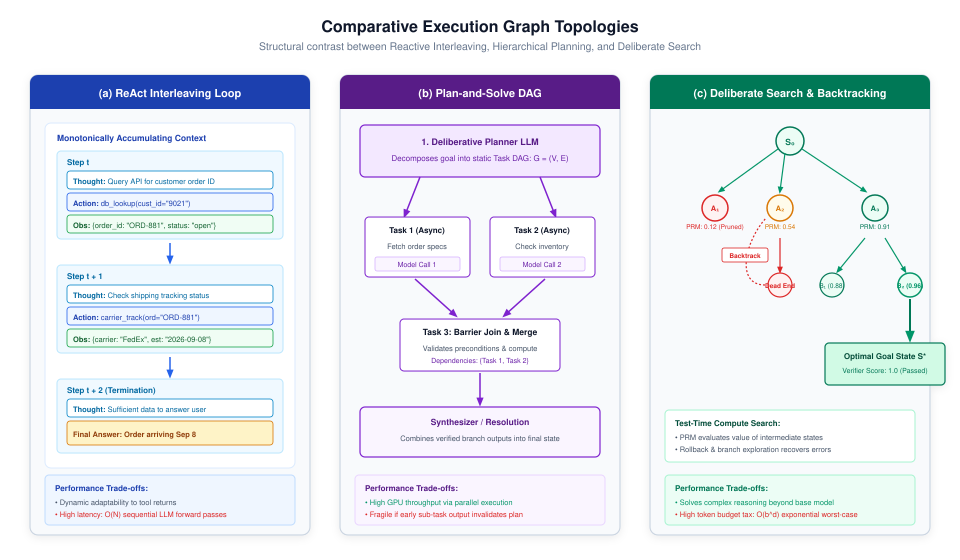
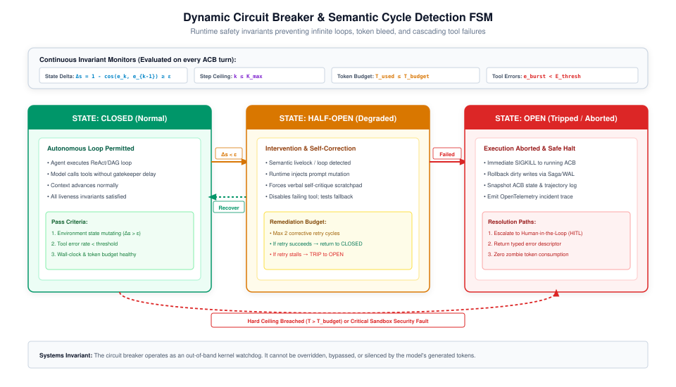

# Control Topologies {#sec-vol3-control-topologies}

::: {layout-narrow}
::: {.column-margin}

\chapterminitoc

:::
:::

## Purpose {.unnumbered .unlisted}

_How can non-deterministic reasoning steps be structured into finite, dependable execution graphs that guarantee forward progress?_

An unconstrained `while True:` loop wrapped around a stochastic model is an architectural Denial-of-Service vulnerability against your own infrastructure. Without structural bounds, language models fall into semantic livelocks: repeating edits, cycling between conflicting goals, and burning thousands of dollars of compute without making progress. Autonomous execution must be constrained by formal control topologies: Directed Acyclic Graphs (DAGs) and hierarchical statecharts where models are restricted to bounded decision nodes. This chapter establishes the Anti-Swarm Principle, demonstrating why production systems reject chaotic peer-to-peer chat swarms in favor of unidirectional supervisor trees. We formulate dynamic termination invariants, cycle-detection algorithms over semantic state spaces, and test-time search topologies (@sec-vol3-test-time-search) that guarantee monotonic forward progress.

::: {.content-visible when-format="pdf"}

\newpage

:::

\begin{marginfigure}
\mlagentstack{20}{95}{35}{25}{20}{15}
\caption{The Agentic Machine Learning Systems Stack. Control Topologies operate at Layer 5 (Control Plane).}
\end{marginfigure}

::: {.callout-learning-objectives}

- Compare the reliability, latency, and cost trade-offs across prompt chains, routing trees, parallel DAGs, supervisor trees, and autonomous loops
- Formulate the Anti-Swarm Principle and explain why production engineering standardizes on unidirectional supervisor trees over peer-to-peer mesh swarms
- Mathematically formulate agent execution traces as Directed Acyclic Graphs and Partially Observable Markov Decision Processes
- Implement multi-tier cycle and semantic livelock detection using exact state hashing, semantic vector distance, and progress metrics
- Design out-of-band watchdog timers and three-state dynamic circuit breakers that enforce finite execution horizons under non-determinism
- Analyze compile-time statechart verification algorithms that eliminate unreachable states and deadlock before runtime dispatch

:::

## The Spectrum of Control {#sec-vol3-topologies-the-spectrum-of-control}

The architecture of an agentic machine learning system is fundamentally defined by where it draws the boundary between deterministic software engineering and stochastic neural inference. A rigorous systems perspective models this as the separation of the **Control Plane** and the **Data Plane**. The Control Plane consists of the stochastic model deciding *what* to do next via routing and planning, while the Data Plane encompasses the deterministic tools executing physical side-effects and data transformations. In naive implementations, developers often assume an all-or-nothing dichotomy: either a program is a hardcoded procedural script, or it is a fully unconstrained, autonomous agent that decides its own control flow. Production engineering reveals that robust systems exist along a continuous architectural spectrum [@anthropic2024effective], progressively shifting more routing and execution responsibilities from the deterministic data plane to the stochastic control plane.

@Fig-vol3-topologies-spectrum illustrates this progression across five canonical archetypes: prompt chaining, routing and dispatch, parallel fan-out, supervisor-worker hierarchies, and autonomous loops. As an architecture moves from left to right along this spectrum, model autonomy and problem-solving flexibility increase, but so do non-determinism, verification complexity, latency variance, and the risk of catastrophic failure.

::: {#fig-vol3-topologies-spectrum fig-env="figure" fig-pos="htb" fig-cap="**The Architectural Spectrum of Agentic Control**: Progression from deterministic linear pipelines to open-ended autonomous loops, highlighting the trade-offs between model autonomy, verification burden, and cost unpredictability." fig-alt="Diagram showing five stages of agentic control from left to right: Prompt Chaining, Routing and Dispatch, Parallel Fan-Out, Supervisor-Workers, and Autonomous Loops, with comparison bars below showing increasing model autonomy, verification burden, and cost variance."}

{width="100%"}

:::

- **Prompt Chaining (The leftmost archetype)**: Decomposes a complex task into a fixed sequential pipeline of discrete model invocations. Each step executes a dedicated prompt with strict input and output schemas, passing its transformed output as the input to the subsequent stage. Because the execution graph is hardcoded, the runtime exhibits predictable latency ($\mathcal{O}(1)$ forward passes) and bounded token consumption. Verification is straightforward: unit tests and deterministic schema validators inspect intermediate outputs between stages. However, prompt chaining lacks dynamic flexibility; it cannot branch or adapt to unexpected intermediate results.
- **Routing and Dispatch**: Introduces dynamic conditional branching. An initial classifier or router model inspects the user query or input state and directs execution to one of several specialized downstream pipelines. Routing establishes clean domain separation and minimizes the blast radius of downstream model failures. For example, a customer support agent routes billing questions to a deterministic database query pipeline while routing technical troubleshooting queries to a diagnostic workflow.
- **Parallel Fan-Out (Map-Reduce)**: Exploits the independence of sub-tasks to maximize hardware throughput. When a complex problem can be partitioned into orthogonal sub-problems—such as analyzing distinct source files in a large repository or evaluating multiple code candidates—a dispatch node spawns concurrent worker invocations across available GPU serving infrastructure. An aggregator node collects, filters, and synthesizes the parallel outputs once a barrier synchronization condition is met.
- **Supervisor-Workers**: Represents the production standard for non-trivial agentic automation. A central supervisor agent maintains the global Agent Control Block (ACB, @sec-vol3-descriptors-the-agent-control-block), formulates a dynamic plan, and delegates discrete sub-tasks down to isolated worker agents. Workers do not communicate directly with one another; instead, they execute scoped tasks within isolated sandbox boundaries and return schema-validated artifacts back to the supervisor. This architecture embodies the Anti-Swarm Principle, enforcing strict hierarchy, context isolation, and bounded delegation.
- **Autonomous Loops (Evaluator-Optimizer & ReAct)**: Introduces closed-loop feedback where models iteratively generate hypotheses, execute tool actions, observe environment state changes, and refine their reasoning. While offering the highest problem-solving capability, autonomous loops introduce heavy-tailed runtime distributions and vulnerability to semantic livelocks.

| Control Archetype      | Graph Structure   | Autonomy Level          | Latency Complexity               | Token Variance              | Failure Blast Radius        | Primary Verification Mechanism  |
|:-----------------------|:------------------|:------------------------|:---------------------------------|:----------------------------|:----------------------------|:--------------------------------|
| **Prompt Chaining**    | Static Line       | Zero (Fixed)            | $\mathcal{O}(1)$ deterministic   | Low ($\sigma^2 \approx 0$)  | Minimal (Isolated step)     | JSON Schema / Assertions        |
| **Routing & Dispatch** | Static Tree       | Constrained Branch      | $\mathcal{O}(1)$ bounded         | Low                         | Low (Domain contained)      | Classifier Confusion Matrix     |
| **Parallel Fan-Out**   | Map-Reduce DAG    | Partitioned Concurrent  | $\mathcal{O}(\max t_i)$ parallel | Medium (Concurrent sum)     | Medium (Worker isolated)    | Barrier Invariants / Voting     |
| **Supervisor-Workers** | Hierarchical Tree | Supervised Delegation   | $\mathcal{O}(D)$ tree depth      | Controlled Dynamic          | Low (Sandbox boundary)      | Verifier Gatekeepers / ACLs     |
| **Autonomous Loops**   | Cyclic Statechart | Open-Ended Deliberation | $\mathcal{O}(K)$ heavy-tailed    | High (Unbounded worst-case) | Severe (Unchecked mutation) | Circuit Breakers / State Hashes |

: **Architectural Archetypes of Agentic Control**: Comparison of control topologies across determinism, latency, token variance, and failure containment {#tbl-vol3-topologies-archetypes}

The engineering rule governing this spectrum is straightforward: *never use a more autonomous topology than the task strictly demands*. An engineer should only elevate a system from a deterministic chain to a supervisor tree or an autonomous loop when the environment state space cannot be enumerated statically at compile time [@harel1987]. Each step up the ladder buys flexibility by loosening the latency bound and widening the failure blast radius, as the latency, variance, and blast-radius columns of @tbl-vol3-topologies-archetypes record, and both costs follow from the shape of the execution graph rather than from any defect in the implementation.

## Trajectories as Directed Acyclic Graphs {#sec-vol3-topologies-trajectories-as-directed-acyclic}

In classical operating systems, process execution is modeled as a linear instruction stream periodically interrupted by system calls and context switches. In agentic systems, execution is fundamentally a graph traversal. As established in @sec-vol3-execution-descriptors, an agent formally operates over a Partially Observable Markov Decision Process (POMDP) [@kaelbling1998; @zaharia2012resilient]. Because the agent cannot directly inspect the complete authoritative state of the external environment, its internal *belief state* (or *trajectory context*) is represented by the sequence of past observations, thoughts, and actions. The formal mathematical derivation of the POMDP 7-tuple and belief state is detailed in @sec-vol3-appendix-math-pomdp.

When this interaction is unrolled over time, it forms an execution graph $\mathcal{G} = (\mathcal{V}, \mathcal{E})$. The vertex set $\mathcal{V}$ contains three distinct node types:

1. **Reasoning Nodes ($v_R \in \mathcal{V}_R$):** Forward passes of the foundation model generating thoughts, hypotheses, and action selections conditioned on parent context.
2. **Action Nodes ($v_A \in \mathcal{V}_A$):** Structured invocations of external tools dispatching operations into the physical runtime environment (e.g., calling an API or executing a subprocess).
3. **Observation Nodes ($v_O \in \mathcal{V}_O$):** Environment feedback payloads captured from stdout, stderr, return codes, and telemetry streams.

The directed edges $e = (u, v) \in \mathcal{E}$ represent causal and dataflow dependencies:

$$e \in \mathcal{E} \implies \text{output}(u) \in \text{input}(v)$$

Representing trajectories as formal DAGs provides critical systems guarantees:

- **Topological Sorting and Critical Path Analysis:** The runtime scheduler computes the topological sort of $\mathcal{G}$ to identify independent branches that can be evaluated asynchronously across distributed GPU worker nodes, minimizing total wall-clock latency:

  $$\tau_{\text{critical}} = \sum_{v \in \mathcal{P}_{\text{longest}}} \text{latency}(v)$$

- **Deterministic Replay and Provenance:** In non-deterministic agent workflows, debugging requires exact provenance. By storing the lineage DAG $\mathcal{G}$ where every node records its input hashes, random seeds, model parameters, and environment snapshots, developers can perform deterministic time-travel debugging, replaying identical inputs to trace why an agent took a catastrophic action.
- **Incremental Resumption and Checkpointing:** If an action fails due to a network timeout or API rate limit, the runtime does not restart the entire trajectory. It traverses backward along $\mathcal{E}$ to the nearest idempotent checkpoint node, invalidates downstream children, and re-executes only the failed sub-graph.

## ReAct: Interleaving Reasoning and Action {#sec-vol3-topologies-react-interleaving-reasoning-and}

The foundational topology for dynamic problem solving is the ReAct (Reason + Act) design pattern [@yao2023react]. Prior to ReAct, language model architectures relied either on direct action generation (Act-only), where the model mapped queries directly to tool calls, or on isolated Chain-of-Thought (Reason-only), where the model generated internal reasoning paths without interacting with external environments [@wei2022cot].

ReAct synthesizes these approaches into an interleaved feedback loop. At each discrete step $t$, the agent runtime orchestrates a three-phase sequence:

1. **Thought Phase ($x_t$):** The model generates natural language tokens representing internal reasoning, state evaluation, decomposition, and planning. Crucially, this text is generated before selecting an action.
2. **Action Phase ($a_t$):** The model generates a structured tool call adhering to a rigid interface schema (e.g., `tool_name(args)`).
3. **Observation Phase ($o_t$):** The runtime intercepts the action, executes it within the environment sandbox, captures the output, and appends the observation back into the model's context window.

From a systems perspective, generating explicit verbal thoughts before action selection fundamentally alters the model's internal attention distribution. Autoregressive language models compute the next token probability distribution conditioned on preceding tokens:

$$\mathbb{P}(a_t \mid b_{t-1}, x_t) = \prod_{i=1}^{|a_t|} \mathbb{P}\left(a_{t,i} \mid b_{t-1}, x_t, a_{t,<i}\right)$$

When $x_t$ is absent (Act-only), the model must map from historical observation tokens $b_{t-1}$ directly to high-stakes action tokens $a_t$ in a single forward step. Because standard self-attention allocates a fixed computation budget per generated token, forcing direct action generation severely restricts the model's ability to search internal associative memory and resolve multi-step constraint satisfaction problems.

By generating $x_t$, the model constructs an ephemeral scratchpad in its key-value (KV) activation cache. The thought tokens serve as intermediate representations that attend to salient facts in $b_{t-1}$, resolve ambiguities, synthesize contradictory observations, and explicitly formulate action hypotheses. When the model subsequently generates $a_t$, its attention heads attend to the newly synthesized activations of $x_t$, drastically reducing action hallucination rates.

However, the systems tax of the ReAct topology is severe:

1. **Quadratic KV Cache Growth:** As identified by the Context Accumulation Wall in @sec-vol3-introduction, in a ReAct loop of $K$ steps, the total context length $L_k$ at step $k$ grows monotonically:

   $$L_k = L_{\text{system}} + \sum_{i=1}^k \left( |x_i| + |a_i| + |o_i| \right)$$

   Because every step requires a complete forward pass over the accumulated context, the total token processing burden across $K$ steps scales quadratically: $\mathcal{O}(K^2)$.

2. **Serial Latency Bottleneck:** Each transition from $x_t \to a_t \to o_t \to x_{t+1}$ enforces a hard barrier synchronization. The runtime cannot prefetch or pipeline step $t+1$ because the thought $x_{t+1}$ is strictly conditioned on the observation $o_t$ returned by the external tool. Consequently, total latency is the sum of $K$ sequential model inference passes plus $K$ external network/sandbox execution latencies. To prevent long-running external tools from tying up GPU VRAM while waiting for $o_t$, production runtimes implement **Asynchronous Yielding** via the context swapping mechanics detailed in @sec-vol3-execution-descriptors: the agent process yields execution, its KV cache is asynchronously offloaded to host DRAM or Non-Volatile Memory Express (NVMe) storage when the tool wait exceeds the breakeven threshold $T_{\text{breakeven}}$, and the GPU is freed for other requests until the tool completes and issues a hardware interrupt to resume the loop.
3. **Error Compounding (Cognitive Drift):** If an observation $o_t$ contains misleading, noisy, or truncated information, the model's subsequent thought $x_{t+1}$ frequently rationalizes the error rather than correcting it. Without external verifier gates, ReAct loops frequently diverge into hallucinated sub-goals.

## Plan-and-Solve vs. Reactive Topologies {#sec-vol3-topologies-plan-and-solve-vs-reactive-topologies}

To overcome the latency and error-compounding bottlenecks of purely reactive loops, production architectures alternate between deliberative **Plan-and-Solve** topologies and step-by-step **Reactive** topologies [@wang2023plan; @valmeekam2023planning].

@Fig-vol3-topologies-execution contrasts these paradigms alongside deliberate tree-based test-time search (detailed in @sec-vol3-test-time-search).

::: {#fig-vol3-topologies-execution fig-env="figure" fig-pos="htb" fig-cap="**Comparative Execution Graph Topologies**: Structural contrast between reactive step-by-step interleaving (ReAct), hierarchical deliberative planning (Plan-and-Solve DAG), and deliberate test-time search with process reward models and backtracking." fig-alt="Three-panel diagram contrasting execution topologies: panel a shows sequential ReAct interleaving with growing context, panel b shows a Plan-and-Solve directed acyclic graph with parallel task branches, and panel c shows a search tree with process reward model scores, pruning, and backtracking from dead ends."}

{width="100%"}

:::

In a **Plan-and-Solve** topology, execution is split into two distinct operational phases:

1. **Decomposition Phase:** A high-capacity planner model receives the user's objective and generates a formal, structured execution graph $\mathcal{G}_{\text{plan}} = (\mathcal{V}_{\text{tasks}}, \mathcal{E}_{\text{deps}})$. Each node $v \in \mathcal{V}_{\text{tasks}}$ represents a fully specified sub-task with explicit input and output schemas. Edges indicate strict data dependencies.
2. **Execution Phase:** An execution engine (such as a DAG scheduler) inspects $\mathcal{G}_{\text{plan}}$, identifies all nodes whose in-degree is zero (tasks with no unresolved dependencies), and dispatches them concurrently across worker agents. As workers complete tasks, intermediate artifacts are placed into a shared state registry, resolving dependencies for downstream nodes until the terminal join node synthesizes the final output.

The systems trade-offs between Plan-and-Solve and ReAct are governed by the **Entropy of the Environment Transition Function** $\mathcal{H}(\mathcal{T})$.

When the environment is deterministic or highly predictable ($\mathcal{H}(\mathcal{T}) \to 0$, such as mathematical proof verification, static code refactoring, or document parsing), Plan-and-Solve delivers overwhelming performance advantages:

- **Asynchronous Parallelism:** Independent sub-tasks execute concurrently across distinct GPU workers. If a plan contains $M$ independent tasks of average duration $\tau$, wall-clock execution time collapses from $M \cdot \tau$ to $\max(\tau_1, \dots, \tau_M) + \epsilon_{\text{sched}}$. However, governed by **Amdahl's Law**, the maximum achievable speedup is strictly bounded by the sequential fraction of the topology, which here is the initial Decomposition Phase (planner inference) plus the terminal node (aggregator synthesis). As $M$ scales, these sequential synchronization barriers dominate system latency.
- **Context Hygiene and Token Efficiency:** Worker agents execute sub-tasks in clean, isolated context windows containing only their immediate instructions. They do not inherit the massive, noisy conversation history of the parent planner, eliminating the quadratic KV cache penalty $\mathcal{O}(K^2)$ of ReAct.

That sequential fraction is worth putting a number on, because the ceiling it sets sits lower than the topology diagram suggests.

::: {#nbk-topologies-fan-out-ceiling .callout-notebook title="The ceiling on fanning out"}

**Problem**: A planner decomposes a task into independent subtasks, workers run them concurrently, and an aggregator synthesizes the result. How much can adding workers actually buy?

**Variables**: Planner inference $8\text{ s}$, aggregator synthesis $12\text{ s}$, and $120\text{ s}$ of subtask work that genuinely parallelizes. All three are scenario assumptions.

**Math**: Run sequentially the plan costs $8 + 120 + 12 = 140\text{ s}$, of which $20\text{ s}$ cannot be parallelized, so the serial fraction is $s = 20/140 = 0.143$. With $M$ workers:

$$T(M) = 8 + \frac{120}{M} + 12$$

which gives $80\text{ s}$ at $M=2$, $40\text{ s}$ at $M=6$, and $30\text{ s}$ at $M=12$.

**Result**: Six workers return $3.5\times$. Doubling to twelve returns $4.7\times$, not $7\times$. However many workers are added, the plan cannot finish faster than the $20\text{ s}$ the planner and aggregator consume, so the ceiling is $140/20 = 7\times$, which is $1/s$.

**Systems insight**: The ceiling is set by the two nodes that cannot be parallelized, and in an agentic topology those are both model inference calls, so they do not shrink when workers are added. This is why the fan-out decision is bounded before any coordination cost is counted, and the coordination tax then pulls the achievable figure below this ceiling rather than toward it.

:::

Conversely, when the environment exhibits high entropy and stochasticity ($\mathcal{H}(\mathcal{T}) \gg 0$, such as web browsing over dynamic user interfaces, interacting with volatile third-party REST APIs, or debugging complex legacy codebases), static Plan-and-Solve becomes exceptionally fragile. If the observation $o_1$ from Task 1 invalidates an underlying assumption made by the planner during step 0, the remaining tasks in $\mathcal{G}_{\text{plan}}$ become invalid. The runtime must either execute invalid tasks (burning compute uselessly) or trigger an expensive, full-graph replanning cycle.

Production systems resolve this tension by deploying **Hierarchical Dynamic Topologies**: a deliberative planner generates a coarse-grained DAG of milestones, while each individual node in the DAG is executed as a localized, bounded ReAct loop. If a localized ReAct loop fails to satisfy its node contract, it raises a structured exception to the supervisor, triggering localized edge replanning rather than whole-graph invalidation.

## Reflexion and Verbal Reinforcement {#sec-vol3-topologies-reflexion-and-verbal-reinforcement}

A fundamental limitation of standard foundation model agents is that weights $\theta$ are frozen at inference time. When an agent fails at a task, standard runtime architectures simply terminate or retry with identical prompts, repeating identical failure modes. The **Reflexion** architecture  overcomes this limitation by implementing stateful closed-loop control via episodic verbal reinforcement [@shinn2023reflexion; @madaan2023selfrefine].

Reflexion introduces a dedicated memory buffer $\mathcal{M}_{\text{refl}}$ that persists across execution trials. When an agent trajectory $\tau_i = (s_0, a_0, o_0, \dots, a_T, o_T)$ fails to satisfy an external evaluation oracle $\mathcal{O}_{\text{eval}}(\tau_i) = 0$ (such as failing a unit test suite or violating a compiler constraint), the runtime invokes a *Self-Reflection Model* $\mathcal{R}_{\phi}$:

$$r_i = \mathcal{R}_{\phi}\left(\text{prompt}_{\text{task}}, \tau_i, \text{feedback}_{\text{oracle}}\right)$$

The reflection $r_i$ is not an action; it is a structured, natural language self-critique diagnosing why the trajectory failed (e.g., *"I attempted to import module `cryptography.x509` before installing the system package `libssl-dev`, causing an unhandled ImportError"*). The runtime appends $r_i$ to the persistent episodic memory buffer:

$$\mathcal{M}_{\text{refl}} \leftarrow \mathcal{M}_{\text{refl}} \cup \{ r_i \}$$

When trial $i+1$ begins, the supervisor prepends $\mathcal{M}_{\text{refl}}$ into the agent's working context:

$$b_0^{(i+1)} = \left[ \text{System Prompt}, \mathcal{M}_{\text{refl}}, \text{User Goal} \right]$$

During autoregressive generation, the agent's attention heads attend directly to the token representations of its past failures and self-critiques, suppressing the generation logits of the previously failing action paths.

However, the efficacy of verbal reinforcement is strictly bounded by the **Verifier Calibration Invariant**:

$$\mathbb{P}(\text{Convergence to } S^*) \propto \text{Accuracy}(\mathcal{O}_{\text{eval}})$$

If the evaluation signal $\text{feedback}_{\text{oracle}}$ is produced by an ungrounded, stochastic model rather than a deterministic ground-truth oracle (such as a compiler, linter, or formal test runner), the Reflexion loop frequently falls into **Hallucination Reinforcement**. If the evaluator generates a false negative or incorrect diagnostic, the reflection model synthesizes a rationalization that "corrects" code that was actually functioning properly. In subsequent trials, the agent mutates working code to appease the hallucinated critique, driving trajectory entropy up and task success rates to zero.

Therefore, systems architects enforce a strict rule: *Verbal reflection loops must be gated by deterministic oracles*. Never permit an agent to self-reflect in an unbounded loop using purely subjective model-graded feedback without external ground-truth anchoring.

## The Anti-Swarm Principle and Supervisor Topologies {#sec-vol3-topologies-supervisor-worker-and-review-topologies}

During the early exploration of multi-agent systems, substantial academic literature proposed unconstrained peer-to-peer "agent swarms," where multiple specialized models (e.g., "Coder," "Reviewer," "Product Manager," "Architect") engaged in open-ended chat rooms, debating problems and passing natural language messages to one another until consensus emerged [@wu2023autogen; @du2023improving].

Production engineering across frontier AI labs has almost entirely repudiated this architecture. In real-world enterprise runtimes, peer-to-peer chat swarms are an anti-pattern. We formalize this empirical finding as the **Anti-Swarm Principle** [@openai2024swarm].

::: {#pri-vol3-anti-swarm .callout-principle title="The Anti-Swarm Principle"}

**Invariant**: Unconstrained peer-to-peer agent communication topologies exhibit quadratic communication overhead $\mathcal{O}(N^2)$, context dilution, diffuse accountability, and non-terminating livelocks. Production multi-agent architectures must strictly enforce unidirectional, hierarchical supervisor trees where communication is restricted to parent-child delegation and schema-validated artifact return.

:::

@Fig-vol3-topologies-anti-swarm directly contrasts the peer-to-peer swarm anti-pattern against the production hierarchical supervisor standard.

::: {#fig-vol3-topologies-anti-swarm fig-env="figure" fig-pos="htb" fig-cap="**The Anti-Swarm Principle (Mesh Swarms vs. Hierarchical Supervisor Trees)**: Contrast between chaotic peer-to-peer mesh swarms suffering quadratic communication explosion and production supervisor trees with strict unidirectional delegation, context isolation barriers, and schema-gated verification." fig-alt="Two-panel comparison illustrating the Anti-Swarm Principle: left panel shows four agents connected in a peer-to-peer mesh with quadratic message chaos and failure modes; right panel shows a root supervisor agent delegating tasks down to isolated worker agents with a context isolation boundary and upward verification gatekeeper."}

{width="100%"}

:::

The structural failure modes of peer-to-peer swarms stem directly from distributed systems dynamics:

1. **Quadratic Message Complexity:** In a network of $N$ peers communicating freely, the number of communication channels scales as:

   $$C = \frac{N(N - 1)}{2} = \mathcal{O}(N^2)$$

   As $N$ increases, the message passing volume explodes. In a collaborative programming task, if Agent A proposes an edit, Agents B, C, and D all receive and respond to the proposal. Their responses prompt counter-responses, leading to exponential context bloat and catastrophic token burn [@brooks1975mythical].

2. **Context Dilution and Attention Bleed:** When all agents share a single global message bus, every agent's context window becomes polluted with the conversational metadata, conversational filler, and unverified intermediate assertions of all other agents. The model's attention mechanism suffers from attention bleed: critical constraints provided in the initial user prompt are drowned out by dozens of turns of inter-agent conversational chatter.
3. **Diffuse Accountability and Terminal Livelock:** In a flat mesh, no single process owns the terminal state invariant. Agent A waits for Agent B to finalize the specification; Agent B assumes Agent C is writing tests; Agent C assumes Agent A has already verified the code. Without an explicit root supervisor tracking global task completion, swarms degenerate into infinite mutual appreciation loops (*"Great job, Agent B! I agree with your plan. Let us proceed when you are ready."*).

To solve these failure modes, production architectures standardize on **Hierarchical Supervisor Trees**:

- **Unidirectional Command Flow:** Only a supervisor node can dispatch tasks to worker nodes. Workers cannot dispatch tasks to peers, nor can they initiate unsolicited communication with the supervisor.
- **Context Isolation Boundaries:** Sub-agents execute in completely isolated context windows. When the supervisor delegates a task to a code-search worker, the worker receives only the search query and relevant path filters. It does not inherit the supervisor's 100,000-token conversation history. This guarantees high attention fidelity and slashes prompt caching costs.
- **Schema Gating:** Workers are forbidden from returning unconstrained natural language banter. They must return typed, schema-validated JSON payloads or structured artifacts (e.g., file diffs, test summaries).
- **The Gatekeeper Pattern:** A dedicated verifier or test oracle intercepts worker outputs before they are committed to the supervisor's state registry. If a worker returns invalid code, the gatekeeper rejects the output locally, forcing worker retry without polluting the supervisor's context.

## Termination Guarantees and Liveness Invariants {#sec-vol3-topologies-termination-guarantees-and-liveness}

In classical software engineering, a loop terminates when a deterministic boolean guard evaluates to false. In neural agent systems, termination is frequently entrusted to the model itself: the runtime instructs the model to "output `FINISH` when the objective is complete."

Relying on stochastic model self-termination is an architectural vulnerability. Models are susceptible to prompt injection, semantic loops, cognitive drift, and catastrophic forgetting. If a model encounters an ambiguous tool error, it frequently loops indefinitely, retrying minor variations of the failing command until infrastructure rate limits or credit balance exhaustion forcibly terminate the process.

Robust agent runtimes formalize execution safety and liveness invariants using temporal logic concepts [@alpern1985defining; @dijkstra1975guarded].

We partition runtime guarantees into two complementary classes:

1. **Safety Properties ("Nothing bad happens"):**
   The agent must never transition into an unrecoverable, illegal, or hazardous environment state:

   $$\square \neg \text{HazardousState}(S_t)$$

   In practice, safety invariants enforce access control lists (ACLs), file system boundary constraints (e.g., path traversal prevention), and rate limits on destructive tool operations (e.g., dropping database tables or transmitting credentials over HTTP).

2. **Liveness Properties ("Something good eventually happens"):**
   The agent trajectory must guarantee that execution reaches a valid terminal state in finite time:

   $$\lozenge \text{TerminalState}(S_t)$$

To mathematically prove liveness and guarantee termination in a stochastic control graph, the runtime constructs a Monotonically Decreasing Variant Function (a Lyapunov or ranking function). A control topology satisfies guaranteed termination if the expected value of this function strictly decreases with every execution step.

 The runtime enforces this condition by defining the variant function over an explicit composite vector of execution resources: the remaining step ceiling, the remaining token budget, and the distance to the goal state. The formal mathematical derivation and invariants of this Lyapunov function are detailed in @sec-vol3-appendix-math-lyapunov.

 If an agent executes an action that fails to reduce the distance to the goal, the step and token budget terms enforce that the overall function strictly decreases. When it reaches zero, the runtime intercepts execution and triggers deterministic termination handlers:

- **State Rollback:** Reverting uncommitted filesystem or database mutations via Write-Ahead Logging (WAL) or Saga compensating transactions (@sec-vol3-recovery-distributed-sagas-for-agent).
- **Typed Error Packaging:** Emitting a structured failure descriptor to the upstream caller detailing the budget exhaustion cause.
- **Human Escalation:** Suspending the agent process, persisting the complete ACB to durable storage, and notifying a human operator via webhook for intervention.

What makes a variant function trustworthy is not that it decreases, but that the loop cannot manufacture more of the resource it measures. A control loop whose budget is defined over a quantity its own actions inflate has no floor to descend toward, and the clearest demonstration of that hazard comes from automated trading rather than from an agent runtime (\ref{ws-topologies-flash-crash-2010}).

::: {#ws-topologies-flash-crash-2010 .callout-war-story title="The flash crash (2010)"}

**Context**: At 2:32 p.m. on May 6, 2010, a mutual fund complex began selling 75,000 E-Mini S&P 500 futures contracts, valued at approximately \$4.1 billion, as a hedge against an existing equity position [@cftcsec2010mayevents]. It executed the program through an automated execution algorithm configured to target 9 percent of the trading volume calculated over the previous minute, without regard to price or time. The same firm had executed a sell program of comparable size before, using a combination of manual trading and algorithms that took price, time, and volume into account, and that execution took more than five hours. These were rule-based execution systems, not learned agents, which is what makes the control-flow lesson so clean.

**Mechanism**: The algorithm's only feedback signal was recent volume, and recent volume was in part produced by the market's reaction to its own orders. High-frequency traders absorbed the first batch and then sold to shed the resulting long positions, and the algorithm responded to the increased volume by increasing the rate at which it fed orders into the market, even though the orders it had already sent were arguably not yet fully absorbed. Between 2:45:13 and 2:45:27 p.m., high-frequency traders traded more than 27,000 contracts among themselves in what the staffs describe as a hot-potato volume effect, accounting for about 49 percent of total trading volume while buying only about 200 additional contracts net. Volume rose while liquidity vanished, so the one variable the loop consulted was the one variable its own execution guaranteed would keep rising. The program that had taken more than five hours under a price-aware and time-aware configuration executed in roughly 20 minutes.

**Impact**: The E-Mini fell approximately 3 percent in the four minutes from the beginning of 2:41 p.m. through the end of 2:44 p.m., then a further 1.7 percent in the 15 seconds to 2:45:27 p.m. Buy-side market depth fell to about \$58 million, less than 1 percent of that morning's level. Between 2:32 and 2:45 p.m. the algorithm sold about 35,000 of its intended 75,000 contracts. Between 2:40 and 3:00 p.m., more than 20,000 trades across more than 300 separate securities executed at prices 60 percent or more away from their 2:40 p.m. values, some at a penny and some as high as \$100,000, and the exchanges and FINRA later agreed to cancel all of them.

**Fix**: At 2:45:28 p.m. the Chicago Mercantile Exchange Stop Logic Functionality paused E-Mini trading for five seconds. Sell pressure was partly relieved, buy-side interest returned, and prices stabilized when trading resumed at 2:45:33 p.m. The durable remedy was structural. The SEC worked with the exchanges and FINRA to implement circuit breakers that pause trading in an individual security across all U.S. markets for five minutes once that security has moved 10 percent over the preceding five minutes, a bound that holds regardless of what any participating algorithm believes about the market.

**Systems lesson**: A variant function defined over a quantity the loop can inflate is not a termination guarantee, it is a restatement of the loop's own confidence. Trading volume was endogenous to the execution algorithm in exactly the way that a task-progress score inferred from an agent's own reasoning trace is endogenous to the agent, which is why the budget terms in this section are step ceilings, token counts, and wall-clock deadlines rather than model-reported progress. The second lesson is about who holds the stop. What ended the cascade was five seconds of nothing, imposed from outside every participating algorithm by a mechanism that never had to diagnose which one had gone wrong. That is the design argument for an out-of-band watchdog, and the sections that follow build one.

:::

## Cycle Detection in Semantic State Spaces {#sec-vol3-topologies-cycle-detection-in-semantic}

In deterministic computer science, cycle detection over directed graphs is solved in linear time using Tarjan's strongly connected components algorithm or Floyd's cycle-finding algorithm [@tarjan1972depth; @reiss2003visualizing]. In distributed systems, if a process encounters state $s_j = s_i$ where $j > i$, a cycle is definitively proven.

In agentic systems, cycle detection is complicated by the nature of natural language and floating-point stochasticity: **The Semantic Cycle Problem**.

An agent caught in a livelock rarely generates bit-exact identical token strings across iterations. Instead, the model exhibits *paraphrased cycling*:

- **Iteration 1:** `grep -rn "config" /app`
- **Iteration 2:** `grep -rn "config" /app/`
- **Iteration 3:** `find /app -name "*config*"`
- **Iteration 4:** `python -c 'import os; print([f for f in os.listdir("/app") if "config" in f])'`

In all four iterations, the model is executing the exact same semantic operation against the same underlying environment state, receiving identical underlying diagnostic observations, and failing to make forward progress. Yet, because the input prompts, generated tool arguments, and raw stdout strings differ textually, classical hash-based cycle detectors ($H(t_j) = H(t_i)$) fail completely.

Production agent runtimes deploy a **Multi-Tier Semantic Cycle Detection Engine** combining exact hashing, semantic vector distance, and environment state mutation metrics.

| Detection Tier                         | Invariant Monitored             | Mathematical Metric                                     | Computational Cost             | False Positive Rate | Action on Detection                              |
|:---------------------------------------|:--------------------------------|:--------------------------------------------------------|:-------------------------------|:--------------------|:-------------------------------------------------|
| **Tier 1: Tool Hashing**               | Exact syntactic tool invocation | $H(a_t) = H(a_{t-k})$                                   | $\mathcal{O}(1)$ hash lookup   | Zero                | Immediate action rejection; prompt mutation      |
| **Tier 2: Action Distance**            | Paraphrased tool intent         | $\Delta s_{\text{action}} < \epsilon_a$                 | $\mathcal{O}(W)$ dot product   | Very Low            | Warning inject; force verbal scratchpad critique |
| **Tier 3: Observation Equivalence**    | Repeated environment response   | $\Delta s_{\text{obs}} < \epsilon_o$                    | $\mathcal{O}(W)$ dot product   | Low                 | Invalidate tool cache; trigger fallback tool     |
| **Tier 4: $\epsilon$-Progress Metric** | Measurable environment mutation | $\Delta \mathcal{S}_{\text{env}} < \delta_{\text{env}}$ | $\mathcal{O}(1)$ snapshot diff | Extremely Low       | Trip circuit breaker to HALF-OPEN                |

: **Multi-Tier Cycle Detection Architecture**: Algorithmic layers detecting livelocks across token, semantic, and environment boundaries {#tbl-vol3-topologies-cycle-detection}

### Algorithmic formulation of the $\epsilon$-progress metric

The most robust invariant for cycle prevention is the **$\epsilon$-Progress Metric**. It sits last among the tiers in @tbl-vol3-topologies-cycle-detection not because it is the most expensive to evaluate, since a snapshot diff costs $\mathcal{O}(1)$ against the $\mathcal{O}(W)$ dot products of the embedding tiers, but because it is the only tier that interrogates the environment rather than the tokens, which is what drives its false-positive rate to the floor. The runtime evaluates whether an action produced a measurable, non-ephemeral state change in the target environment:

$$\Delta \mathcal{S}_{\text{env}}(S_t, S_{t-1}) = w_f \cdot \Delta_{\text{fs}}(t) + w_d \cdot \Delta_{\text{db}}(t) + w_p \cdot \Delta_{\text{proc}}(t)$$

where:

- $\Delta_{\text{fs}}(t)$ measures git diff lines, modified file inodes, or filesystem delta bytes.
- $\Delta_{\text{db}}(t)$ measures rows inserted, updated, or deleted in target databases.
- $\Delta_{\text{proc}}(t)$ measures process table mutations or network sockets opened.

If an agent executes $N_{\text{stagnant}}$ consecutive tool operations (typically $N=3$) where $\Delta \mathcal{S}_{\text{env}} < \delta_{\text{env}}$ and semantic embedding similarity across thoughts exceeds $1 - \epsilon$:

$$\frac{1}{N} \sum_{i=0}^{N-1} \cos\left(\mathbf{e}(x_{t-i}), \mathbf{e}(x_{t-i-1})\right) \ge 1 - \epsilon$$

the runtime declares a **Semantic Livelock Exception**. Execution is immediately halted before further tokens are burned, preventing multi-dollar loop spirals.

## Watchdog Timers and Dynamic Circuit Breakers {#sec-vol3-topologies-watchdog-timers-and-dynamic}

In high-reliability distributed systems, downstream services that fail or degrade can cause cascading failures across the entire cluster. To isolate faults, systems engineers implement the **Circuit Breaker Pattern** [@nygard2007releaseit].

In agentic architectures, foundation models and external tools are inherently unreliable downstream services. A model may suffer latency spikes, produce malformed function call JSON, or enter hallucination loops. To prevent cascading failures, the agent runtime encapsulates execution within an out-of-band **Watchdog Circuit Breaker Engine**.

@Fig-vol3-topologies-circuit-breaker details the three-state Finite State Machine (FSM) governing runtime intervention.

::: {#fig-vol3-topologies-circuit-breaker fig-env="figure" fig-pos="htb" fig-cap="**Dynamic Circuit Breaker & Semantic Cycle Detection FSM**: Finite state machine governing runtime safety invariants across step ceilings, token budgets, semantic state deltas, and error burst rates, transitioning between CLOSED, HALF-OPEN, and OPEN operational states." fig-alt="State machine diagram showing three circuit breaker states: CLOSED for normal autonomous execution with invariant monitors, HALF-OPEN for degraded warning and self-critique remediation, and OPEN for tripped execution abort with write-ahead log rollback and human escalation."}

{width="100%"}

:::

The circuit breaker operates across three formal states:

### The CLOSED state (normal autonomous execution)

In the `CLOSED` state, the agent operates freely. The runtime scheduler dispatches model requests, executes requested tool invocations in sandboxes, and appends observations to the ACB.

Simultaneously, an out-of-band kernel watchdog thread continuously monitors four hard invariant sensors on every turn:

1. **Step Horizon Ceiling:** The trajectory step index must not exceed the hard limit: $k \le K_{\max}$.
2. **Token Burn Velocity & Ceiling:** Cumulative token consumption must not breach the allocated financial budget: $T_{\text{used}} \le T_{\text{budget}}$. Furthermore, token consumption rate per turn $\frac{\Delta T}{\Delta t}$ must not spike beyond an anomaly threshold, as this indicates runaway context duplication.
3. **Semantic Progress Delta:** Semantic state divergence must satisfy $\Delta s \ge \epsilon$, verifying that the agent is not cycling in place.
4. **Tool Error Burst Rate:** The rolling error frequency over a sliding window $W$ must remain below a threshold: $e_{\text{burst}} < E_{\text{thresh}}$ (e.g., fewer than 2 tool execution errors in the last 4 turns).

### The HALF-OPEN state (degraded warning and remediation)

If any soft invariant is breached (such as two consecutive tool syntax errors, a semantic livelock detection $\Delta s < \epsilon$, or reaching 80 percent of the token budget), the circuit breaker trips to `HALF-OPEN`.

In `HALF-OPEN`, unconstrained autonomous execution is suspended. The runtime assumes control of the execution boundary and initiates targeted remediation:

- **Verbal Critique Injection:** The runtime injects a high-priority system intervention message directly into the model's working memory:
  ```
  SYSTEM INTERVENTION: Semantic livelock detected.
  You have executed 3 consecutive file search operations without modifying any code.
  You must formulate an alternative approach or report why you are blocked.
  ```

- **Action Space Pruning:** The runtime temporarily disables failing tools from the model's available tool schema, forcing the model to consider alternative fallback strategies.
- **Strict Remediation Budget:** The agent is granted a strict horizon (typically 2 steps) to demonstrate measurable environment mutation ($\Delta \mathcal{S}_{\text{env}} > \delta$).

If the agent successfully recovers and satisfies the pass criteria, the circuit breaker resets to `CLOSED`.

### The OPEN state (tripped and safe abort)

If the agent fails to recover within its remediation budget, or if a hard invariant is breached (such as absolute token exhaustion $T > T_{\text{budget}}$, a wall-clock timeout $\tau_{\text{wall}}$, or a critical sandbox security violation), the circuit breaker trips to `OPEN`.

When the breaker opens, the runtime enforces immediate fail-safe protocols:

1. **Immediate Execution Termination:** The kernel sends a `SIGKILL` equivalent to the running ACB process, terminating in-flight GPU decoding requests and freeing KV cache allocations.
2. **State Rollback (Saga Compensation):** The runtime traverses the execution WAL, invoking compensating actions (@sec-vol3-recovery-distributed-sagas-for-agent) to roll back partial, uncommitted filesystem edits or database mutations.
3. **Telemetry & Audit Snapshots:** The complete ACB, including the full trajectory lineage DAG, environment diffs, and circuit breaker trip metrics, is serialized and published to OpenTelemetry observability backends.
4. **Human Escalation:** The runtime formats a typed error response and escalates the incident to human-in-the-loop (HITL) queues for triage.

Crucially, *the circuit breaker operates strictly outside the model's context*. Because it is implemented in the host runtime, the model cannot prompt-engineer its way around the circuit breaker, ignore its warnings, or reset its counters [@nygard2007releaseit].

## State Machine Compilation and Static Verification {#sec-vol3-topologies-state-machine-compilation-and}

While dynamic watchdogs and circuit breakers protect runtimes during execution, frontier engineering systems increasingly apply **Compile-Time Static Verification** to agent control graphs prior to deployment [@clarke1999model; @aws2023stepfunctions].

Deploying an unverified agent graph directly into production is analogous to running uncompiled source code without a type checker. Latent syntax bugs, unhandled tool error codes, missing terminal states, and unreachable nodes remain hidden until an end user's query triggers the faulty code path at runtime.

Static state machine compilation transforms high-level agent specifications (such as declarative JSON/YAML schemas, statecharts, or Python graph definitions) into verified intermediate representations (IRs). During this compilation pass, formal model checking algorithms analyze the control graph against four structural invariants:

```text
[ Declarative Statechart (YAML / Python Schema) ]
                       |
                       v
[ State Machine Compiler & Formal Model Checker ] ---> Static Verification Pass
                       |                               * Reachability Analysis
                       |                               * Deadlock & Livelock Detection
                       |                               * Schema Type Checking
                       |                               * Terminal Path Exhaustion
                       v
[ Compiled Runtime Engine (AWS Step Functions / Engine) ]
```

1. **Reachability and Dead-End Analysis:**
   Using depth-first search (DFS) over the transition graph $\mathcal{G}_{\text{state}} = (\mathcal{S}_{\text{graph}}, \mathcal{T}_{\text{edges}})$, the compiler verifies that every non-terminal state $s \in \mathcal{S}_{\text{graph}}$ possesses at least one valid path from the initial start state $s_0$:

   $$\forall s \in \mathcal{S}_{\text{graph}}, \quad \text{Path}(s_0 \to s) \neq \emptyset$$

   Simultaneously, the compiler identifies all *sink states* (nodes with out-degree zero) and asserts that sink states belong exclusively to the set of declared terminal success or terminal failure states:

   $$\text{deg}^+(s) = 0 \implies s \in \mathcal{S}_{\text{terminal}}$$

2. **Terminal Path Exhaustion:**
   The compiler verifies that every reachable execution path contains at least one terminal node within a bounded diameter $D_{\max}$. Any cycle that lacks a deterministic exit condition is flagged at compile time as an unconstrained livelock hazard.

3. **Tool Parameter Schema Compliance:**
   The compiler cross-references all action nodes against the OpenAPI or JSON Schema specifications of the target tools. It asserts that required arguments match declared types, default values are provided for optional parameters, and output schemas match the input requirements of downstream consuming nodes.

4. **Exhaustive Error Coverage:**
   In production environments, external tools can fail in enumerable ways (e.g., HTTP 401 Unauthorized, HTTP 429 Rate Limited, HTTP 500 Internal Error, socket timeout, subprocess SIGKILL). The static compiler asserts that every action node defines explicit error transition edges for all declared failure modes. If an action node lacks an exception transition handler, compilation fails with an actionable diagnostic.

By enforcing static compilation and model checking, systems engineers eliminate structural graph errors before a single dollar of inference compute is spent.

## Fallacies and Pitfalls {#sec-vol3-topologies-fallacies}

Designing control topologies for stochastic models is fraught with architectural misconceptions. Production engineering highlights several recurring fallacies and traps:

::: {.fallacy-pitfall}
**Fallacy**: *Giving multiple autonomous agents unconstrained peer-to-peer communication produces emergent problem-solving intelligence.*

Flat, unconstrained agent swarms invariably suffer from quadratic communication overhead $\mathcal{O}(N^2)$, context dilution, and diffuse accountability. In practice, models in peer-to-peer chat rooms amplify one another's hallucinations, engage in endless conversational pleasantries, and burn tokens without converging. High-reliability production systems universally adopt hierarchical supervisor trees with strict context isolation.

:::

::: {.fallacy-pitfall}
**Fallacy**: *A language model can be reliably trusted to terminate its own execution loop.*

Foundation models are probabilistic text completers, not deterministic controllers. When confronted with unfamiliar tool errors or contradictory instructions, models regularly enter infinite retry loops. Every autonomous loop must be bound by out-of-band kernel watchdogs, hard step ceilings, and token burn circuit breakers that forcibly terminate execution regardless of model output.

:::

::: {.fallacy-pitfall}
**Pitfall**: *Monolithic context accumulation in a naive while-loop.*

Appending all intermediate thoughts, tool calls, and verbose JSON payloads into a single monotonically growing prompt window causes the token processing cost to scale quadratically $\mathcal{O}(K^2)$ with step count, quickly exhausting context limits and causing severe attention degradation. Production runtimes enforce aggressive context hygiene: filtering raw tool outputs, persisting large payloads to out-of-band object stores, and injecting only concise summaries into the primary working context.

:::

::: {.fallacy-pitfall}
**Pitfall**: *Exposing non-idempotent tools to autonomous retry loops.*

Because agent control topologies inherently rely on non-deterministic retries, fallback routing, and error recovery, exposing non-idempotent state-mutating tools (e.g., `charge_credit_card()`, `append_to_file()`) without transactional safety leads to catastrophic state corruption. When an agent loops or replans, it may re-execute previously invoked actions. Systems must enforce strict **Idempotency** at the tool API boundary (e.g., requiring deterministic `idempotency_key` arguments derived from the execution graph hash) or implement compensating transactional rollbacks before allowing the agent to retry.

:::

::: {.fallacy-pitfall}
**Pitfall**: *Using regex-based edge parsing for state transitions.*

Using brittle string matching or regular expressions (e.g., searching for `"Action:"` or `"Thought:"` strings) to parse edge transitions in autonomous graphs makes the runtime fragile. Minor formatting variations, markdown syntax highlighting, or model conversational disclaimers break edge transitions silently, causing runtime exceptions. Production architectures enforce native structured decoding (constrained JSON generation) where the serving engine restricts logits to guarantee schema-valid transitions.

:::

This chapter supplies the two mechanisms principle \ref{pri-vol3-bounded-execution} requires. A deterministic topology bounds where the loop may go, and a semantic progress metric bounds how long it may go without advancing. Neither is sufficient alone: a bounded topology still permits an unproductive cycle, and a progress metric with no topology has nothing to halt.

## Summary {#sec-vol3-topologies-summary}

Control topologies define the structural boundaries that turn non-deterministic foundation model invocations into dependable, finite programs. By replacing unconstrained while-loops with explicit execution graphs, supervisor trees, and out-of-band circuit breakers, systems engineers bound stochastic reasoning into predictable execution envelopes.

::: {.callout-takeaways title="Bounded Autonomy and Control Topologies"}
* **Bounded Autonomy:** Unconstrained `while True:` loops wrapped around stochastic models are architectural denial-of-service vulnerabilities. Reliable execution requires formal control topologies (Directed Acyclic Graphs and hierarchical statecharts) and strict separation of the stochastic control plane from the deterministic data plane.
* **The Control Spectrum:** System architectures span a continuum from deterministic prompt chains, routing trees, and parallel Map-Reduce DAGs to supervisor-worker trees and autonomous loops. Engineers should deploy the least autonomous topology that satisfies task requirements.
* **Trajectories as DAGs:** Formulating agent trajectories as POMDPs and execution DAGs $\mathcal{G} = (\mathcal{V}, \mathcal{E})$ enables critical path scheduling, deterministic replay, and localized fault recovery.
* **ReAct Systems Dynamics:** Generating verbal thoughts prior to action selection establishes an ephemeral working memory scratchpad in the KV cache, significantly reducing action hallucinations at the cost of quadratic token scaling $\mathcal{O}(K^2)$ and sequential latency. Efficient runtimes mitigate latency and compute stalls via asynchronous yielding and context swapping.
* **The Anti-Swarm Principle:** Production systems reject unconstrained peer-to-peer swarms in favor of hierarchical supervisor trees. Supervisors enforce unidirectional command flow, strict context isolation boundaries, and schema-gated verification.
* **Semantic Cycle Detection:** Because livelocked agents paraphrase actions rather than repeating bit-exact strings, runtimes deploy multi-tier detection combining canonical tool hashing, semantic embedding distance ($\Delta s < \epsilon$), and environment mutation metrics ($\Delta \mathcal{S}_{\text{env}}$).
* **Out-of-Band Circuit Breakers:** Dynamic circuit breakers operate across three states (`CLOSED`, `HALF-OPEN`, `OPEN`), monitoring step ceilings, token budgets, and error bursts to halt runaway loops, roll back dirty writes, and escalate to human operators.
* **Static Graph Verification:** Compiling statecharts into executable engines allows formal model checking to eliminate unreachable states, dead ends, and unhandled tool error exceptions before runtime dispatch.
:::

With the structural foundations of agency in place, **Part II: Agent Training and Test-Time Compute** investigates how foundation models are adapted to navigate these stateful graphs: beginning in @sec-vol3-trajectory-fine-tuning with trajectory-level fine-tuning and supervised policy alignment.

```{=latex}
\part{key:vol3_training}
```
