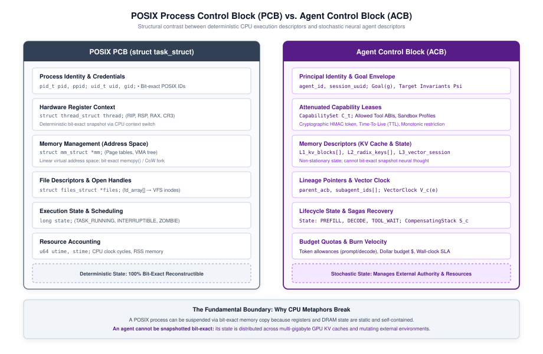
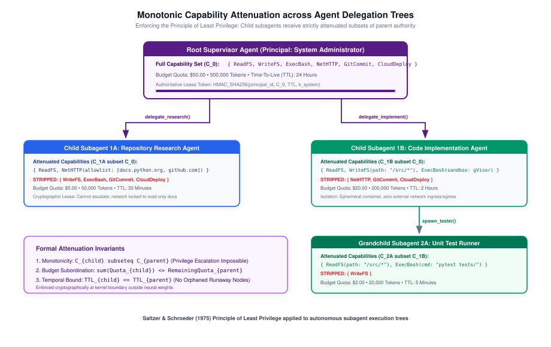
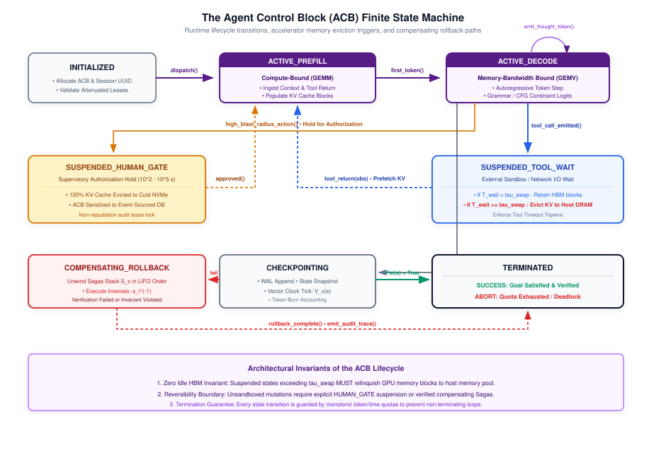
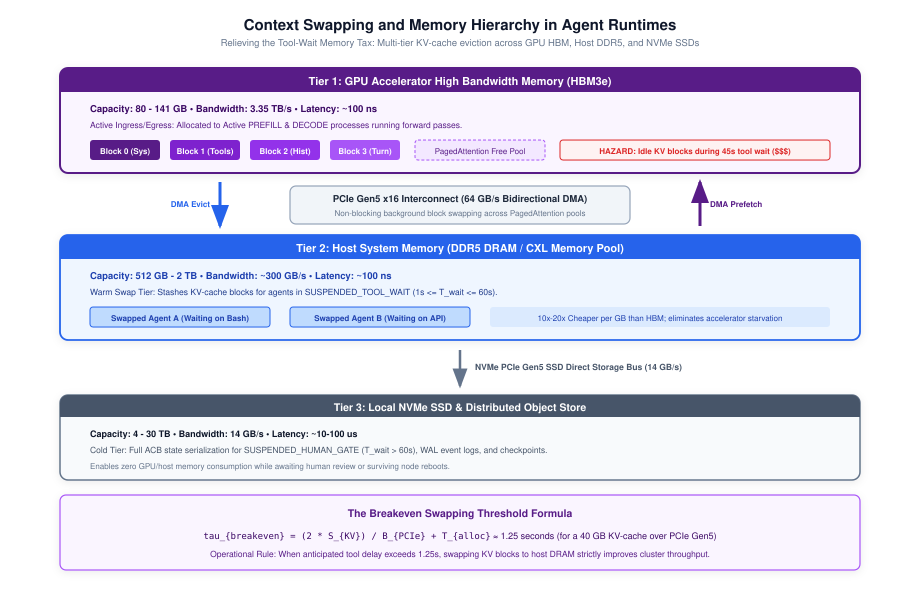

# Execution Descriptors {#sec-vol3-execution-descriptors}

::: {layout-narrow}
::: {.column-margin}

\chapterminitoc

:::
:::

## Purpose {.unnumbered .unlisted}

_How does an agentic runtime track, bound, and isolate stateful, non-deterministic agent processes across open-ended execution horizons?_

An operating system kernel cannot schedule, isolate, or recover a process without a descriptor. In classical operating systems, the Process Control Block (PCB) tracks CPU registers, page tables, and file descriptors. In agentic runtimes, an equivalent kernel abstraction is mandatory: the **Agent Control Block (ACB)**. However, the classical analogy breaks at a fundamental boundary: a CPU register state can be snapshotted deterministically via bit-exact memory copies, whereas an agent's cognitive state is non-stationary, distributed across gigabytes of GPU Key-Value (KV) cache activations and dynamic external environments.

The ACB therefore does not attempt to snapshot internal neural thought; it manages authority, capability leases, token allowances, memory handles, and recovery vectors. This chapter formalizes the execution descriptor of agentic systems, establishing how runtimes track principal identity, enforce monotonic capability attenuation across child subagents, manage the complete lifecycle state machine, and preserve recovery handles across suspensions.

::: {.content-visible when-format="pdf"}

\newpage

:::

\begin{marginfigure}
\mlagentstack{15}{95}{30}{25}{20}{15}
\end{marginfigure}

::: {.callout-learning-objectives}

- Formalize the Agent Control Block (ACB) as the foundational kernel descriptor for autonomous execution.
- Deconstruct the limits of the POSIX process analogy across non-deterministic token sampling, volatile KV caches, and external side effects.
- Distinguish authoritative external state from ephemeral neural belief states within a Partially Observable Markov Decision Process (POMDP) framework.
- Implement Write-Ahead Logging (WAL) and compensating Sagas transactions to isolate speculative reasoning from committed environmental mutations.
- Formulate the Monotonic Capability Attenuation Principle ($\mathcal{K}_{\text{child}} \subseteq \mathcal{K}_{\text{parent}}$) using cryptographically verifiable, time-bounded leases.
- Design the complete ACB lifecycle finite state machine coordinating active prefill, decode, tool suspension, human gates, and error recovery.
- Implement multi-dimensional token burn accounting and velocity metrics ($d\text{Tokens}/dt$) to prevent runaway execution loops.
- Apply Lamport timestamps and causality vectors to establish strict event provenance across asynchronous tool executions.
- Derive the physical memory breakeven threshold ($T_{\text{breakeven}}$) governing KV-cache swapping between GPU High Bandwidth Memory (HBM) and host DRAM over PCIe Gen5.

:::

## The OS Process Analogy and Its Limits {#sec-vol3-descriptors-the-operating-system-process}

At the heart of any operating runtime lies the execution descriptor—the authoritative data structure that enables the kernel to identify, schedule, isolate, and recover in-flight computation. For over half a century, the **process** has served as the central abstraction of computer systems engineering [@ritchie1974; @silberschatz2018]. In the classical formulation established by @dennis1966 and refined in UNIX, a process represents an independent program in execution, encapsulated within an isolated virtual address space and allocated a discrete share of hardware execution time. The operating system kernel manages this abstraction through a foundational kernel data structure: the **Process Control Block (PCB)**.

The PCB encapsulates the entire execution state of a thread or process:

- **Identifier and Credentials:** Process ID (PID), user ID (UID), group ID (GID), and security context.
- **Architectural Register State:** Instruction pointer (PC), stack pointer (SP), general-purpose registers, floating-point units, and processor status flags.
- **Memory Management Handles:** Page table base registers (such as CR3 in x86-64), segment descriptors, and virtual memory area (VMA) linked lists.
- **I/O and Resource Descriptors:** File descriptor tables pointing to open vnodes, network sockets, and inter-process communication (IPC) pipes.
- **Scheduling and Accounting State:** Process priority, CPU execution time, wait channels, and pending POSIX signal masks.

When a classical operating system performs a context switch, it executes an invariant contract:
- The kernel saves the current register values into the PCB
- Updates scheduling accounting
- Switches the virtual memory address space by modifying the page table root register
- Restores the register values of the incoming process

Because hardware execution is deterministic at the instruction level, this state snapshot is complete and bit-exact. The suspended process resumes execution unaware that its thread was interrupted.

When systems engineers construct autonomous, multi-turn agent runtimes, the urge to map agents directly onto POSIX processes is immediate and compelling [@anthropic2024effective; @openai2024swarm]. In this conceptual mapping, the foundation model acts as a virtual Central Processing Unit (a "neural CPU"), prompts serve as input instructions, tools represent system calls (syscalls), and context windows resemble physical RAM.

While this metaphor provides useful architectural intuition, it breaks down violently across three fundamental systems boundaries:

### 1. Determinism vs. Stochasticity
A hardware CPU is a deterministic state transition machine. Given an identical register state and instruction stream, a processor executes the exact same operations every time. A foundation model is an autoregressive probability distribution over tokens:
$$P(x_t \mid x_{<t}; \theta)$$
Even when temperature is set to zero ($T=0$), hardware floating-point non-associativity across distributed matrix multiplication kernels (tensor parallelism, warp scheduling, and dynamic batching) introduces token non-determinism across runs. A runtime cannot guarantee bit-exact trajectory reproduction merely by restoring an execution snapshot.

### 2. Physical Memory vs. Neural Activation Footprints
In a classical OS, context switching a thread incurs a latency on the order of microseconds ($1\text{--}10\,\mu\text{s}$) because only the small architectural register file (hundreds of bytes) must be saved, while the physical page tables remain mapped in host DRAM.

In an agentic system, the in-flight cognitive state of an agent is encoded in its **Key-Value (KV) cache**—a multi-gigabyte activation footprint resident in scarce, high-cost GPU High Bandwidth Memory (HBM). For an agent operating over a $128\text{K}$-token horizon with a 70-billion parameter model, the active KV cache occupies dozens of gigabytes of VRAM. A runtime cannot instantly "switch" agents without either retaining that memory footprint idle on the GPU or paying massive PCIe transfer latencies ($10\text{--}100\,\text{ms}$) to swap activations to host DRAM.

### 3. Isolated Address Spaces vs. Mutating Environmental Side Effects
The classical process isolation contract relies on hardware-enforced virtual memory boundaries (MMUs, page fault traps, and ring protection domains) [@saltzer1975]. A process can write freely to its private virtual address space without corrupting neighboring processes. If a process faults, the kernel reclaims its memory and terminates the descriptor cleanly.

An autonomous agent, by contrast, executes actions by invoking external tools:
- Modifying remote filesystems
- Provisioning cloud virtual machines
- Querying SQL databases
- Sending API webhooks

These actions mutate an open, shared, external environment. If an agent executes an erroneous or malicious action at step $t=14$, the runtime cannot undo the network packets or disk writes by simply resetting an internal memory pointer. The side effects have escaped the isolation boundary.

To resolve these contradictions, an agentic runtime requires a purpose-built execution descriptor that abandons bit-exact register replication and instead formalizes authority, capability delegation, transactional logging, and resource accounting.

## The Agent Control Block (ACB) {#sec-vol3-descriptors-the-agent-control-block}

The **Agent Control Block (ACB)** is the authoritative, kernel-level descriptor that encapsulates the identity, authority, memory references, and operational state of an autonomous agent process throughout its lifecycle.

::: {#dfn-acb .callout-definition title="Agent Control Block (ACB)"}
An **Agent Control Block** is a strongly typed, persistent data structure maintained by the agentic runtime kernel:
$$\text{ACB} = \langle \text{AID}, \mathcal{P}_{\text{id}}, \mathcal{G}, \mathcal{K}_{\text{leases}}, \mathcal{Q}_{\text{budget}}, \mathcal{M}_{\text{handles}}, \mathcal{S}_{\text{fsm}}, \mathcal{L}_{\text{lineage}}, \mathcal{V}_{\text{clock}} \rangle$$
uniquely identifying an active agent instance $\text{AID}$, binding it to an authenticated principal $\mathcal{P}_{\text{id}}$, bounding its objective within goal envelope $\mathcal{G}$, governing its tool access through capability leases $\mathcal{K}_{\text{leases}}$, enforcing resource consumption against quota $\mathcal{Q}_{\text{budget}}$, tracking physical and episodic memory allocations $\mathcal{M}_{\text{handles}}$, recording execution state $\mathcal{S}_{\text{fsm}}$, maintaining hierarchical parent-child ancestry $\mathcal{L}_{\text{lineage}}$, and establishing logical event ordering via causality vector $\mathcal{V}_{\text{clock}}$.
:::

@Fig-pcb-vs-acb contrasts the anatomy of the classical POSIX Process Control Block against the Agent Control Block.

::: {#fig-pcb-vs-acb fig-env="figure" fig-pos="htb" fig-cap="**POSIX Process Control Block (PCB) vs. Agent Control Block (ACB)**: Structural comparison showing how classical kernel execution state (registers, MMU page tables, file descriptors) maps to agentic execution state (principal identity, KV-cache handles, capability leases, token quotas, and causality vectors)." fig-alt="Side-by-side architectural diagram comparing the internal data structures of a POSIX Process Control Block (PID, CPU registers, CR3 page table, file descriptor table, signal masks) with an Agent Control Block (Agent ID, Principal ID, Goal Specification, KV-Cache Handles, Capability Leases, Token and Cost Budgets, Causality Vectors, and Lifecycle State)."}

{width="100%"}

:::

The nine structural fields of the ACB serve dedicated systems responsibilities:

1. **Agent Identifier ($\text{AID}$):** A globally unique, cryptographically random 128-bit identifier (UUIDv7 or ULID) encoding creation timestamp and node locality.

2. **Principal Identity ($\mathcal{P}_{\text{id}}$):** The authenticated human or service account on whose behalf the agent executes. Contains cryptographic public keys, OAuth subject tokens, and tenant organizational boundaries used to authorize all downstream actions.

3. **Goal Envelope ($\mathcal{G}$):** The immutable operational specification of the task, containing the natural language prompt, formal completion predicates (e.g., unit test suites that must pass), invariant constraints (e.g., "do not modify files outside `/src`"), and execution bounds.

4. **Capability Leases ($\mathcal{K}_{\text{leases}}$):** A set of cryptographically signed, time-limited tokens granting access to specific external tools and sandboxed APIs, parameterized with parameter white-lists and monotonic access restrictions.

5. **Resource Quotas and Budgets ($\mathcal{Q}_{\text{budget}}$):** Multi-dimensional resource constraints tracking accumulated and remaining allowances:
   $$\mathcal{Q} = \langle T_{\text{in}}, T_{\text{out}}, C_{\text{dollar}}, \Delta t_{\text{wall}}, K_{\text{tools}}, D_{\text{depth}} \rangle$$
   representing input tokens, output tokens, financial expenditure in dollars, maximum wall-clock duration, maximum tool invocations, and maximum subagent delegation recursion depth.

6. **Memory Handles ($\mathcal{M}_{\text{handles}}$):** Pointers to physical and virtual memory resources:
   - *Physical KV-Cache Table Pointer:* Identifies the virtual block IDs allocated in PagedAttention tables across inference servers.
   - *Episodic Audit Log URI:* Append-only transactional log recording every prompt, reasoning thought, tool call, and observation.
   - *Working Scratchpad Store:* In-memory key-value state for volatile scratchpad variables.

7. **Lifecycle State ($\mathcal{S}_{\text{fsm}}$):** The active state of the agent within the kernel finite state machine (e.g., `ACTIVE_PREFILL`, `SUSPENDED_TOOL_WAIT`, `TERMINATED`).

8. **Lineage and Ancestry ($\mathcal{L}_{\text{lineage}}$):** Parent agent identifier ($\text{PID}$), child subagent list ($\{\text{CID}_1, \text{CID}_2, \dots\}$), and delegation depth counter, establishing the process tree.

9. **Causality Vector ($\mathcal{V}_{\text{clock}}$):** A vector clock tracking logical time across concurrent tool dispatches and multi-agent interactions, guaranteeing causal event ordering.

| Architectural Dimension | Classical POSIX PCB | Agent Control Block (ACB) |
|:---|:---|:---|
| **Primary Identifier** | Process ID (`pid_t`, integer) | Agent ID (`AID`, 128-bit UUID/ULID) |
| **Execution State** | Hardware registers (`RIP`, `RSP`, general registers) | Context working set (see @sec-vol3-context-working-sets), KV-cache block IDs, lifecycle FSM |
| **Memory Isolation** | MMU page tables (CR3 register, virtual 4 KB pages) | Attention prefix boundaries, PagedAttention block tables |
| **System Interface** | POSIX system call table (`sys_enter`, int 0x80) | Tool Execution Interface / Model Context Protocol (MCP) |
| **Authority Model** | POSIX permissions (`rwx`, UID/GID, capabilities) | Monotonic capability leases, parameter schema filters |
| **Resource Accounting** | CPU user/kernel ticks, Resident Set Size (RSS) | Token burn velocity, GPU HBM bytes, tool API cost |
| **Context Switch Overhead** | Microseconds ($1\text{--}10\,\mu\text{s}$) | Milliseconds to seconds ($10\text{--}5000\,\text{ms}$) |
| **Failure Recovery** | Core dump, signal handler (`SIGSEGV`), process restart | Compensating Sagas transactions, reflection loops |

: **Architectural Comparison between POSIX PCB and ACB**: Systems dimensions, kernel execution structures, and operational failure modes. {#tbl-pcb-acb-comparison}

## State Descriptors vs. Neural Belief States {#sec-vol3-descriptors-state-descriptors-vs-neural}

A fatal error in naive agent architectures is assuming that the large language model's in-context attention window constitutes the entire execution state of the system. In this anti-pattern—termed the **Context-as-State Anti-Pattern**—the application designer dumps raw conversation logs, environment variables, tool outputs, and operational state directly into the prompt buffer, relying on the model to infer current state via self-attention.

This approach creates severe systems vulnerabilities:

- **Context Poisoning:** If an intermediate tool output emits erroneous, contradictory, or malicious text, the neural policy absorbs this text into its attention matrix, biasing all future autoregressive predictions.
- **Context Eviction Drift:** When context compaction algorithms (such as sliding window truncation or recursive summarization) evict older tokens, critical operational state (e.g., database credentials, file paths, or task invariants) is lost, causing the agent to repeat failed actions.
- **State Hallucination:** A generative model can hallucinate that a file was deleted or a server was rebooted simply because the autoregressive text continuation says it occurred, even when the underlying environment returned an error code.

To guarantee execution integrity, the agentic runtime must enforce a strict architectural boundary between the **Authoritative State Descriptor** and the **Neural Belief State**.

This boundary maps directly to the theory of Partially Observable Markov Decision Processes (POMDPs) [@kaelbling1998]. In a POMDP, the agent never has direct access to the complete environment state $s \in \mathcal{S}$. Instead, it maintains an internal belief state $b \in \mathcal{B}$, representing a probability distribution over possible states conditioned on past observations:
$$b_t(s) = P(s_t = s \mid o_1, a_1, \dots, o_t, a_t)$$

In an agentic MLSys:

- The **Authoritative State** is the external reality: the ground-truth filesystem, running processes, active network sockets, database tables, and the ACB's accounting registers.
- The **Neural Belief State** is the foundation model's internal representation: the activation patterns across transformer layers and the text history in the context window.

The runtime kernel must treat the neural belief state as strictly speculative. When an agent decides to execute an action based on its belief state, the runtime interceptor validates the action against the authoritative state in the ACB before dispatching it to the physical environment. If the model believes a file exists, but the authoritative filesystem descriptor shows it was deleted, the runtime intercepts the command and returns an authoritative error observation, forcing the model to update its belief state via reflection [@shinn2023reflexion].

## Authoritative State vs. Ephemeral Working Memory {#sec-vol3-descriptors-authoritative-state-vs-ephemeral}

Within the agent process itself, memory must be stratified based on durability, mutability, and transactional commitment. An agent runtime distinguishes two tiers of internal memory:

### 1. Ephemeral Working Memory (Volatile Scratchpad)
During multi-step reasoning, foundation models generate chain-of-thought tokens, intermediate hypotheses, decomposition trees, and draft tool parameters. This working memory resides in:

- The active GPU Key-Value cache activations.
- Temporary scratchpad text buffers.
- Thread-local in-memory variables.

Ephemeral memory is volatile and speculative. If an agent explores a reasoning branch that proves invalid (e.g., generating code that fails compilation), this working memory should be pruned or rolled back without polluting the persistent execution history.

### 2. Authoritative State and Write-Ahead Logging (WAL)
When an agent takes an action that crosses the boundary into the physical environment—such as executing an external API call, modifying a persistent file, or spawning a child subagent—the transaction must be recorded authoritatively.

Following classical database recovery theory [@gray1992; @mohan1992aries], an agentic runtime implements a **Write-Ahead Logging (WAL)** protocol for agent actions:

1. **Log-Before-Act:** No external tool execution is permitted until the complete action tuple $\langle \text{AID}, t, a_t, \text{hash}(h_t) \rangle$ has been committed to a durable, append-only disk log.
2. **Crash Recovery:** If the host node crashes or loses power while an external tool is executing, the recovery daemon scans the WAL upon restart. It identifies uncommitted actions, queries the external environment to inspect side effects, and either resumes the trajectory or triggers compensating rollback logic.
3. **Compensating Actions (Sagas):** Unlike database systems where locked rows can be aborted via undo logs, real-world agent actions often cannot be rolled back atomically. If an agent deploys a virtual machine or sends a message, an abort cannot "un-send" the network packets. Instead, the runtime implements the Sagas pattern: for every forward tool action $a_t$, the tool contract must define a compensating action $a_t^{-1}$ (e.g., `provision_server()` has compensating action `terminate_server()`). The ACB maintains this stack of compensating handles to restore environmental equilibrium upon task failure.

## Capability Leases and Security Attenuation {#sec-vol3-descriptors-capability-leases-and-security}

In a system executing autonomous, non-deterministic reasoning, security cannot rely on static user permissions or perimeter network defenses. If an agent running with administrative credentials is fed adversarial input via indirect prompt injection (e.g., from an untrusted web page or incoming email), the agent will use its full ambient authority to compromise the host infrastructure [@greshake2023not].

To enforce the Principle of Least Privilege [@saltzer1975], an agentic runtime implements **Capability-Based Access Control** [@dennis1966; @miller2003]. In a capability system, having a reference to an object conveys the right to perform authorized operations on that object; ambient authority is abolished. In the ACB, capabilities are packaged as cryptographically signed, time-bounded **Capability Leases**.

::: {#dfn-capability-lease .callout-definition title="Capability Lease"}
A **Capability Lease** $\mathcal{K}$ is a cryptographically signed, tamper-proof token:
$$\mathcal{K} = \langle \text{CID}, \text{AID}, \text{URI}_{\text{target}}, \mathcal{O}_{\text{ops}}, \mathcal{C}_{\text{params}}, \tau_{\text{expire}}, \text{Sig}_{K_{\text{kernel}}} \rangle$$
authorizing the agent $\text{AID}$ to invoke the set of operations $\mathcal{O}_{\text{ops}}$ on target resource $\text{URI}_{\text{target}}$, subject to parameter schema constraints $\mathcal{C}_{\text{params}}$, expiring at wall-clock timestamp $\tau_{\text{expire}}$, and verified by kernel signature $\text{Sig}_{K_{\text{kernel}}}$.
:::

### The Monotonic Capability Attenuation Principle
When a primary agent decomposes a complex objective into smaller sub-tasks, it spawns child subagents. A foundational security invariant of execution descriptors is the **Monotonic Capability Attenuation Principle**:

$$\mathcal{K}_{\text{child}} \subseteq \mathcal{K}_{\text{parent}}$$

A parent agent cannot grant a child subagent any capability, scope, or budget that the parent does not itself possess. Privileges can only be narrowed (attenuated) as execution traverses down the delegation hierarchy:

- A parent with read-write filesystem access can grant a child subagent read-only access to a specific subfolder:
  $$\text{ops}_{\text{child}} = \{\text{READ}\} \subset \{\text{READ}, \text{WRITE}\}_{\text{parent}}$$

- A parent with a budget of 100,000 tokens can allocate at most a subset (e.g., 20,000 tokens) to its child:
  $$Q_{\text{child}}^{\text{tokens}} \le Q_{\text{parent}}^{\text{tokens}} - Q_{\text{consumed}}^{\text{tokens}}$$

- A parent with a 30-minute lease can only issue child leases with expirations prior to its own:
  $$\tau_{\text{expire}}^{\text{child}} \le \tau_{\text{expire}}^{\text{parent}}$$

@Fig-capability-attenuation illustrates this monotonic attenuation across a delegation tree.

::: {#fig-capability-attenuation fig-env="figure" fig-pos="htb" fig-cap="**Monotonic Capability Attenuation and Delegation Tree**: The Root Coordinator spawns child subagents with strictly narrowed capability leases ($\mathcal{K}_{\text{child}} \subseteq \mathcal{K}_{\text{parent}}$), attenuated token quotas, and wall-clock timeouts." fig-alt="Tree diagram showing monotonic capability attenuation. The Root Coordinator possesses full tools and 1,000,000 tokens. It delegates to a Research Subagent with Read-Only tools and 100,000 tokens, and an Implementation Subagent with Write-Src tools and 500,000 tokens. The Implementation Subagent further delegates to a Test Runner with Read-Test and Run-Docker tools and 50,000 tokens."}

{width="100%"}

:::

If an attacker achieves prompt injection inside a leaf subagent (such as a documentation parser), the blast radius is strictly confined to the attenuated capabilities of that specific leaf lease. The child cannot escalate privileges, invoke tools outside its lease, or access the parent's un-attenuated credentials.

## Hierarchical Subagent Delegation Trees {#sec-vol3-descriptors-hierarchical-subagent-delegation-trees}

Complex software engineering, data science, and operational tasks overwhelm single monolithic agent loops. Long execution horizons saturate context windows, degrade model reasoning accuracy, and increase latency. Production runtimes resolve this by organizing execution into dynamic **Hierarchical Delegation Trees** (see @sec-vol3-control-topologies) [@wu2023autogen; @openai2024swarm].

When an agent invokes a `delegate_task()` or `spawn_subagent()` primitive, the runtime kernel performs an operation analogous to the POSIX `fork()`/`exec()` system calls:

1. **ACB Allocation:** The kernel allocates a new child Agent Control Block ($\text{ACB}_{\text{child}}$) with a unique $\text{AID}_{\text{child}}$.
2. **Lineage Binding:** $\text{ACB}_{\text{child}}.\mathcal{L}_{\text{lineage}}$ registers the parent's $\text{AID}$, while the parent's ACB records the child in its active dependents table.
3. **Capability and Quota Slicing:** The kernel enforces monotonic attenuation, deducting the child's allocated token and monetary budget from the parent's reserve.
4. **Context Isolation:** Unlike POSIX `fork()`, which copies the parent's entire address space via Copy-On-Write (COW), the child agent begins with a clean, task-specific context window. Only the distilled sub-task prompt, relevant schemas, and explicit input attachments are transferred. This isolates the child from the parent's accumulated conversational baggage.

Managing hierarchical agent trees introduces critical systems failure modes that the runtime kernel must resolve:

### 1. The Orphaned Agent Problem and Cascading Cancellation
If a parent agent terminates prematurely—due to budget exhaustion, fatal exception, or user cancellation—unsupervised child subagents can continue executing in the background, consuming thousands of dollars in GPU inference and API calls.

To eliminate orphaned processes, the runtime implements **Cascading Cancellation**. Every child ACB maintains an active heartbeat connection to its parent. If the parent transitions to `TERMINATED` or `FAILED`, the kernel automatically broadcasts a `SIGTERM`-equivalent cancellation signal down the lineage tree, aborting all descendant ACBs, terminating in-flight model inference requests, and revoking outstanding tool capability leases.

### 2. Subagent Deadlocks and Circular Delegation
If subagents are permitted to delegate tasks laterally, circular dependencies can emerge (e.g., Agent A delegates a query to Agent B, which delegates a verification to Agent C, which queries Agent A). This results in distributed deadlock and rapid token budget exhaustion.

The runtime kernel prevents circular delegation by enforcing a **Strictly Acyclic Directed Lineage Rule**:

- The delegation graph must form a Directed Acyclic Graph (DAG).
- An ACB's delegation depth $D$ cannot exceed a configured maximum limit:
  $$D_{\text{current}} < D_{\text{max}} \quad (\text{typically } D_{\text{max}} \le 4)$$

- A subagent can only return results upward to its explicit parent; it cannot delegate tasks upward or to siblings without traversing the parent coordinator.

## Inter-Agent Communication (IPC) and Synchronization {#sec-vol3-descriptors-ipc-and-synchronization}

When multi-agent systems coordinate, they require mechanisms analogous to POSIX Inter-Process Communication (IPC). Classical operating systems implement IPC via either **Message Passing** (pipes, sockets) or **Shared Memory** (`shmget`, `mmap`). In an agentic runtime, these paradigms map directly to physical hardware memory management and multi-node network topologies.

### Message Passing (Actor Model)
When agents are highly decoupled—such as a Planner Agent written in Python communicating with a Coder Agent on a separate physical node—IPC is implemented via asynchronous message passing (e.g., passing serialized JSON or natural language over an event bus). Because the agents maintain separate ACBs and do not share physical GPU memory, they communicate by appending observations to each other's episodic working memory . This mirrors the Actor Model [@hewitt1973actor] and provides strong fault isolation, but incurs high latency and token-ingestion costs, as every received message must be re-processed through the model's compute-bound prefill phase.

### Shared Memory (KV-Cache Prefix Sharing)
When a parent agent spawns multiple parallel child subagents (e.g., to concurrently evaluate three different candidate solutions), copying the identical system instructions, task context, and tool schemas into each child's independent context window wastes massive GPU HBM and compute.

To resolve this, modern agent runtimes implement **Shared Memory IPC** through **KV-Cache Prefix Sharing** (such as RadixAttention [@zheng2024sglang] or native prompt caching, see @sec-vol3-prefix-caching-paging). Analogous to operating system virtual memory paging with Copy-On-Write (COW) semantics:

1. The kernel computes the Key-Value tensors for the shared preamble once.
2. It maps the same physical PagedAttention block IDs into the $\mathcal{M}_{\text{handles}}$ of all child ACBs.
3. As each child agent diverges and autoregressively generates its own unique reasoning tokens, the kernel allocates new, private physical KV blocks for the divergent sequences.

This systems-level memory sharing dramatically increases serving throughput for tree-search and parallel multi-agent topologies (see @sec-vol3-control-topologies) by eliminating redundant prefill computation and compressing the physical memory footprint.

### Agent Synchronization and Mutexes
When concurrent agents act upon a shared external environment, they face classic concurrency hazards (e.g., race conditions, lost updates). If Agent A and Agent B simultaneously attempt to edit the same source code file via a file-editing tool, their interleaved operations can corrupt the file.

The runtime must provide **Agent Mutexes** or distributed locks, exposed as tool capabilities. Before mutating a shared external resource, the agent must acquire a time-bounded lease on the resource. If the lock is held by another ACB, the requesting agent receives a `ResourceLocked` observation, allowing it to either wait, yield its execution slice, or pivot to another task.

## The ACB Lifecycle State Machine {#sec-vol3-descriptors-the-acb-lifecycle-state}

An agent is not a continuous script; it is a stateful systems entity that transitions across distinct operational phases. The runtime kernel manages this lifecycle through a formal **Finite State Machine (FSM)** [@harel1987; @opentelemetry2024genai].

@Fig-acb-lifecycle specifies the complete ACB lifecycle FSM, detailing valid states, trigger events, and invariant checkpoints.

::: {#fig-acb-lifecycle fig-env="figure" fig-pos="htb" fig-cap="**The Complete ACB Lifecycle Finite State Machine**: State transitions between initialized, active inference phases (Prefill and Decode), suspended states (Tool-Wait and Human-Gate), memory swapping, Sagas rollback, and terminal states, governed by invariant evaluation." fig-alt="State machine diagram showing the ACB lifecycle. States include Initialized, Active Prefill, Active Decode, Suspended (Tool-Wait), Suspended (Human-Gate), Memory Swapping, Sagas Rollback, Terminated (Success), and Terminated (Failed), connected by transition arrows with guard conditions."}

{width="100%"}

:::

The lifecycle FSM consists of nine distinct operational states:

1. **`INITIALIZED`:** The ACB data structure is instantiated, principal credentials are authenticated, initial token quotas are reserved, and root capability leases are generated. The agent is enqueued in the scheduler run queue.
2. **`ACTIVE_PREFILL`:** The agent is scheduled onto an accelerator. The inference engine ingests the system instructions, tools schema, and accumulated history. This phase is compute-bound, saturating tensor cores to compute Time-To-First-Token (TTFT).
3. **`ACTIVE_DECODE`:** The foundation model autoregressively generates output tokens. This phase is memory-bandwidth bound, generating tokens sequentially until an end-of-sequence token or structured tool call token is emitted.
4. **`SUSPENDED_TOOL_WAIT`:** The model has emitted a structured tool call. The runtime intercepts the call, validates arguments against the capability lease schema, and dispatches the execution to an isolated sandbox (see @sec-vol3-sandboxing-isolation). Because external tools can take hundreds of milliseconds to minutes, the ACB transitions to suspended wait, relinquishing its active decode slot.
5. **`SUSPENDED_HUMAN_GATE`:** An action requires human-in-the-loop authorization (e.g., deploying production infrastructure or executing financial transactions). The ACB serializes its execution state and enters an asynchronous sleep state awaiting an authenticated webhook.
6. **`MEMORY_SWAPPING`:** When an agent remains suspended beyond a breakeven threshold, the memory manager swaps its volatile KV-cache blocks from high-cost GPU HBM to host DDR5 DRAM or NVMe storage to free accelerator resources.
7. **`ROLLBACK_COMPENSATING`:** A task failure or verification rejection has occurred. The runtime traverses the ACB's undo log, executing compensating Sagas actions to restore the external environment to a safe state.
8. **`TERMINATED_SUCCESS`:** The goal completion predicate evaluates to true (e.g., all regression tests pass). The final result is returned to the calling client, remaining token reserves are credited, and memory handles are freed.
9. **`TERMINATED_FAILED`:** The agent exhausted its token quota, exceeded wall-clock limits, encountered an unrecoverable sandbox fault, or was canceled by the supervisor. Diagnostic logs and causality vectors are frozen for post-mortem analysis.

Every state transition emits an OpenTelemetry-compliant trace event [@opentelemetry2024genai], recording timestamps, state transition reasons, and resource deltas.

## Resource Quotas and Token Burn Accounting {#sec-vol3-descriptors-resource-quotas-and-token}

In classical computing, resource exhaustion manifests as out-of-memory errors or CPU throttling. In agentic systems, uncontrolled execution manifests as **Token Burn**—the rapid, exponential consumption of inference tokens, GPU compute hours, and API capital. A malfunctioning agent caught in a semantic retry loop can consume millions of tokens within minutes without making forward progress toward its objective.

The ACB enforces multi-dimensional quota accounting across five orthogonal resource vectors:
$$\mathbf{q}_t = \big[ T_{\text{in}}(t), \, T_{\text{out}}(t), \, C_{\text{cost}}(t), \, t_{\text{wall}}, \, N_{\text{calls}}(t) \big]^T$$

Every autoregressive forward pass and tool execution updates these counters atomically. If any component exceeds its allocated envelope $\mathbf{q}_{\text{max}}$, the runtime kernel fires an immediate hardware trap, interrupting the model dispatch and forcing the ACB into `TERMINATED_FAILED` (or triggering an emergency checkpoint).

### Token Burn Velocity and Degeneracy Detection
Static budget caps are insufficient to protect large-scale production fleets. If an agent with a $50 budget enters an infinite loop, it will burn the entire $50 before halting. To detect pathological loops early, the ACB tracks the **Token Burn Velocity** ($v_{\text{burn}}$) and **Action Entropy**:

$$v_{\text{burn}}(t) = \frac{\Delta T_{\text{in}} + \Delta T_{\text{out}}}{\Delta t} \quad \left[ \frac{\text{tokens}}{\text{second}} \right]$$

When an agent enters a degenerative loop (e.g., repeatedly calling `grep` with invalid syntax and receiving identical error messages), its burn velocity surges while its semantic output diversity collapses.

The runtime computes the **Action Repetition Jaccard Distance** over a sliding window of the last $k$ actions:
$$J(a_t, a_{t-1}) = \frac{|T(a_t) \cap T(a_{t-1})|}{|T(a_t) \cup T(a_{t-1})|}$$
where $T(a)$ is the token set of the serialized tool call. If $J(a_t, a_{t-1}) > 0.95$ for three consecutive steps ($N_{\text{repeat}} \ge 3$), the runtime halts execution for **Livelock Degeneracy**, regardless of remaining token budget.

### Proportional Share Scheduling
When hundreds of agent trajectories contend for limited GPU inference capacity, naive First-Come-First-Served (FCFS) scheduling causes head-of-line blocking. Long-running, high-token trajectories starve short interactive agents.

Following lottery and stride scheduling principles [@waldspurger1994], the agent scheduler (see @sec-vol3-trajectory-scheduling) uses the ACB's remaining quota and assigned priority weight $W_i$ to schedule chunked prefill batches [@agrawal2024sarathi], ensuring that active agents receive proportional shares of memory bandwidth and tensor core cycles.

## Causality Vectors and Trace Provenance {#sec-vol3-descriptors-causality-vectors-and-trace}

In an autonomous runtime supporting parallel tool execution (e.g., dispatching five HTTP requests or running three code analysis linters concurrently), wall-clock timestamps are insufficient to determine the causal ordering of events. Network latency variations, multi-core scheduling jitter, and clock skew across distributed inference nodes mean that tool responses can arrive out of order.

If an agent emits an action conditioned on a tool output that logically succeeded a previous action, but whose response packet arrived earlier, the agent can suffer from **Causal Inversion**—incorporating future state into past reasoning scratchpads.

To guarantee rigorous event provenance, the ACB incorporates **Lamport Timestamps** and **Vector Clocks** [@lamport1978time; @mattern1989].

::: {#dfn-causality-vector .callout-definition title="ACB Causality Vector"}
For a system of $M$ concurrent entities (agent coordinators, subagents, and tool sandbox workers), each ACB maintains a vector of logical integers:
$$\mathbf{V} = [v_1, v_2, \dots, v_M]$$
governed by the following transition invariants:

1. **Local Action Increment:** Before dispatching an action or generating an internal thought, agent $i$ increments its local clock:
   $$\mathbf{V}_i[i] \leftarrow \mathbf{V}_i[i] + 1$$

2. **Message / Tool Dispatch:** Every tool request message sent by agent $i$ carries a snapshot of its current vector $\mathbf{V}_i$.

3. **Observation Receipt and Merge:** When agent $i$ receives an observation $o$ carrying vector $\mathbf{V}_{\text{msg}}$, it updates its internal clock via component-wise maximum before processing the observation:
   $$\mathbf{V}_i[k] \leftarrow \max(\mathbf{V}_i[k], \, \mathbf{V}_{\text{msg}}[k]) \quad \forall k \in \{1, \dots, M\}$$
   $$\mathbf{V}_i[i] \leftarrow \mathbf{V}_i[i] + 1$$
:::

By recording $\mathbf{V}$ inside the episodic execution log for every turn, the runtime reconstructs an immutable, mathematically rigorous Directed Acyclic Graph (DAG) of the execution trajectory. During telemetry replay and offline evaluation (see @sec-vol3-telemetry-evaluation), engineers can execute deterministic time-travel debugging, isolating the exact sequence of observations that triggered a specific reasoning divergence.

## Context Swapping and Process Suspension Mechanics {#sec-vol3-descriptors-context-swapping-and-process}

In an agentic system, tool invocations and human-in-the-loop approvals are orders of magnitude slower than neural inference:

- Model forward pass step (decode): $20\text{--}50\,\text{ms}$
- Local compiler build / unit test execution: $1\text{--}30\,\text{s}$
- Remote web scraping / API rate-limit wait: $2\text{--}60\,\text{s}$
- Human approval gate: $5\text{ minutes -- }24\text{ hours}$

If the runtime kernel allows an agent to hold its active Key-Value cache in GPU High Bandwidth Memory (HBM) while blocked in `SUSPENDED_TOOL_WAIT` or `SUSPENDED_HUMAN_GATE`, expensive accelerator memory sits completely idle. Because HBM capacity is the primary physical bottleneck limiting serving concurrency, holding allocated KV blocks for idle agents starves active workloads.

The runtime memory manager resolves this through **Asynchronous Multi-Tier Context Swapping** [@kwon2023; @qin2024mooncake], migrating agent memory across three physical storage tiers:

- **Tier 1: Accelerator High Bandwidth Memory (HBM3e):** Ultra-high bandwidth ($3.35\,\text{TB/s}$), low capacity ($80\text{--}144\,\text{GB}$ per GPU). Stores active prefill and decode KV caches.
- **Tier 2: Host System Memory (DDR5 DRAM):** Moderate bandwidth ($300\,\text{GB/s}$), high capacity ($512\text{--}2048\,\text{GB}$ per node). Stores warm suspended KV caches.
- **Tier 3: Local NVMe Storage Fabric (PCIe Gen5 SSD):** Streaming bandwidth ($14\,\text{GB/s}$), massive capacity ($4\text{--}30\,\text{TB}$). Stores cold, checkpointed agent state.

@Fig-acb-memory-swapping illustrates the physical hardware data paths and DMA transfers governing context swapping.

::: {#fig-acb-memory-swapping fig-env="figure" fig-pos="htb" fig-cap="**Multi-Tier Context and KV-Cache Swapping Architecture**: Asynchronous migration of agent execution state and Key-Value cache blocks across Accelerator HBM, Host DDR5 DRAM, and NVMe SSD over PCIe Gen5 x16 DMA, governed by the breakeven suspension threshold $T_{\text{breakeven}}$." fig-alt="Architecture diagram illustrating multi-tier context swapping across GPU HBM3e (3.35 TB/s), Host DDR5 DRAM (300 GB/s), and NVMe SSD (14 GB/s) connected via PCIe Gen5 x16 DMA bus (64 GB/s), showing asynchronous prefetching and eviction flows."}

{width="100%"}

:::

### Mathematical Derivation of the Breakeven Suspension Duration
Swapping a multi-gigabyte KV cache over the PCIe bus consumes memory bus bandwidth and introduces prefetch latency when the agent resumes. Therefore, swapping should only occur if the expected suspension duration exceeds a mathematical breakeven threshold $T_{\text{breakeven}}$.

Let:

- $S_{\text{KV}}$ be the total size of the agent's active KV cache in bytes:
  $$S_{\text{KV}} = 2 \times n_{\text{layers}} \times n_{\text{heads}} \times d_{\text{head}} \times L_{\text{ctx}} \times b_{\text{precision}}$$

- $B_{\text{PCIe}}$ be the effective unidirectional DMA transfer bandwidth across the PCIe Gen5 x16 bus (typically $\approx 64\,\text{GB/s}$).
- $\mathcal{C}_{\text{HBM}}$ be the amortization cost per second of holding one gigabyte of GPU HBM.
- $\mathcal{C}_{\text{DRAM}}$ be the amortization cost per second of holding one gigabyte of host DDR5 DRAM ($\mathcal{C}_{\text{HBM}} \gg \mathcal{C}_{\text{DRAM}}$, typically a $10\times\text{--}20\times$ ratio).

The round-trip latency to swap out to host DRAM and swap back to GPU HBM upon wake-up is:
$$t_{\text{transfer}} = \frac{2 \times S_{\text{KV}}}{B_{\text{PCIe}}}$$

The financial cost of holding the KV cache in HBM for suspension duration $t_{\text{wait}}$ is:
$$\text{Cost}_{\text{hold}} = S_{\text{KV}} \times \mathcal{C}_{\text{HBM}} \times t_{\text{wait}}$$

The financial cost of offloading to host DRAM (including transfer bus energy and host memory rent) is:
$$\text{Cost}_{\text{swap}} = S_{\text{KV}} \times \mathcal{C}_{\text{DRAM}} \times t_{\text{wait}} + \text{Cost}_{\text{PCIe\_IO}}$$

Equating $\text{Cost}_{\text{hold}} = \text{Cost}_{\text{swap}}$, the **Breakeven Suspension Duration** is:

$$T_{\text{breakeven}} = \frac{2 \times S_{\text{KV}}}{B_{\text{PCIe}}} \times \left( \frac{\mathcal{C}_{\text{HBM}}}{\mathcal{C}_{\text{HBM}} - \mathcal{C}_{\text{DRAM}}} \right) \approx \frac{2 \times S_{\text{KV}}}{B_{\text{PCIe}}}$$

For a $64\text{K}$-token context on a 70B parameter model ($S_{\text{KV}} \approx 16\,\text{GB}$ in FP16), the one-way transfer over PCIe Gen5 x16 takes:
$$t_{\text{swap\_out}} = \frac{16\,\text{GB}}{64\,\text{GB/s}} = 0.25\,\text{seconds} \quad (250\,\text{ms})$$

If a tool invocation is predicted to block for more than $T_{\text{breakeven}} \approx 500\,\text{ms}$ (as is the case for virtually all network APIs, compiler invocations, and test suites), the memory manager immediately initiates asynchronous DMA transfer to host DRAM. When the tool completion webhook arrives, the scheduler prefetches the blocks back to GPU HBM before the agent's turn arrives in the run queue, completely hiding transfer latency.

## Fallacies and Pitfalls {#sec-vol3-descriptors-fallacies}

Architecting execution descriptors and state managers for agentic runtimes exposes systems engineers to subtle conceptual traps and hardware bottlenecks. We highlight two prevalent fallacies and three critical implementation pitfalls:

::: {.fallacy-pitfall}

**Fallacy**: *The Large Language Model is the operating system kernel.*

A prevalent marketing metaphor claims that the foundation model serves as the kernel of the modern AI operating system. This is a severe conceptual category error. An operating system kernel is an authoritative, deterministic resource arbiter responsible for memory isolation, hardware interrupts, process scheduling, and security boundary enforcement. A foundation model is an untrusted, stochastic sequence predictor. It cannot enforce its own memory bounds, prevent its own adversarial jailbreaks, or schedule hardware. The agentic runtime software—the C++/Rust/Go control plane executing the ACB—is the true operating system kernel; the model is merely a coprocessor executing stochastic matrix operations.

:::

::: {.fallacy-pitfall}

**Fallacy**: *Natural language system prompts can enforce immutable security boundaries.*

Prompting an LLM with `"You are a safe assistant. You must never delete user files or reveal credentials"` is often treated as security policy. Under adversarial scrutiny, this belief collapses instantly. Prompt instructions share the exact same attention channel as untrusted data retrieved from external tools, rendering natural language instructions vulnerable to indirect prompt injection [@greshake2023not]. Security boundaries must be enforced outside the token space, within the ACB's cryptographic capability leases and sandbox isolation layers.

:::

::: {.fallacy-pitfall}

**Pitfall**: *Holding GPU High Bandwidth Memory during blocking tool I/O.*

Failing to implement context swapping causes idle agents awaiting HTTP responses to lock up physical GPU VRAM. In a 100-agent cluster, if each agent blocks for an average of 5 seconds on web tools, serving concurrency collapses by over $80\%$, driving GPU utilization to near zero while memory allocation remains at $100\%$.

:::

::: {.fallacy-pitfall}

**Pitfall**: *Neglecting cascading cancellation down subagent trees.*

When a user closes an agent session or a parent coordinator reaches an error state, failing to propagate cancellation signals leaves child subagents running in background threads. These orphaned subagents continue querying model APIs, generating massive surprise cloud bills.

:::

::: {.fallacy-pitfall}

**Pitfall**: *Treating uncommitted reasoning scratchpads as persistent state.*

Allowing an agent to commit scratchpad thoughts directly to permanent database records before tool verification is complete causes state corruption. If the downstream action fails, the database retains the invalid speculative data. All environmental mutations must follow strict Write-Ahead Logging and two-phase commitment.

:::

## Chapter Summary {#sec-vol3-descriptors-summary}

- **The Execution Descriptor Imperative:** Autonomous, multi-turn agentic systems require an authoritative kernel data structure—the **Agent Control Block (ACB)**—to schedule, isolate, and recover stateful trajectories across open-ended horizons.
- **Limits of the POSIX Process:** Classical POSIX process abstractions break down because foundation models are stochastic sequence generators with multi-gigabyte neural activation footprints (KV caches) and un-sandboxed environmental side effects.
- **Authoritative State vs. Belief State:** The runtime kernel must strictly isolate the authoritative external state (ground-truth filesystem, token quotas, capability leases) from the model's internal neural belief state (in-context working memory) to prevent context poisoning and state hallucinations.
- **Write-Ahead Logging and Sagas:** To survive node crashes and handle irreversible external tool side effects, the ACB implements Write-Ahead Logging (WAL) and maintains compensating Sagas transactions ($a_t^{-1}$) for rollback recovery.
- **Monotonic Capability Attenuation:** Security is guaranteed by issuing time-bounded, cryptographically signed capability leases. In delegation hierarchies, child subagents must adhere to strict monotonic attenuation: $\mathcal{K}_{\text{child}} \subseteq \mathcal{K}_{\text{parent}}$.
- **Formal Lifecycle Management:** The ACB executes within a rigorous finite state machine spanning active inference (`ACTIVE_PREFILL`, `ACTIVE_DECODE`), asynchronous wait (`SUSPENDED_TOOL_WAIT`, `SUSPENDED_HUMAN_GATE`), memory swapping, and termination.
- **Resource Quotas and Velocity Tracking:** Multi-dimensional quota vectors ($\mathbf{q}_t$) prevent runaway token burn, while Token Burn Velocity metrics ($v_{\text{burn}}$) and repetition Jaccard distances detect livelocks early.
- **Causality and Trace Provenance:** Lamport timestamps and vector clocks maintain causal event order across concurrent tools and subagents, enabling deterministic replay debugging.
- **Asynchronous Multi-Tier Memory Swapping:** When tool suspensions exceed the physical breakeven threshold $T_{\text{breakeven}} \approx \frac{2 \times S_{\text{KV}}}{B_{\text{PCIe}}}$, the runtime asynchronously offloads KV-cache blocks from GPU HBM to host DRAM over PCIe Gen5, preserving accelerator concurrency.
