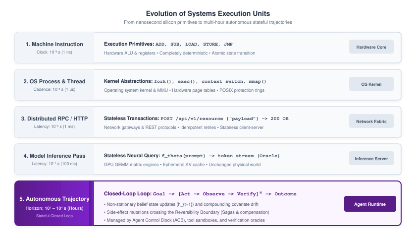
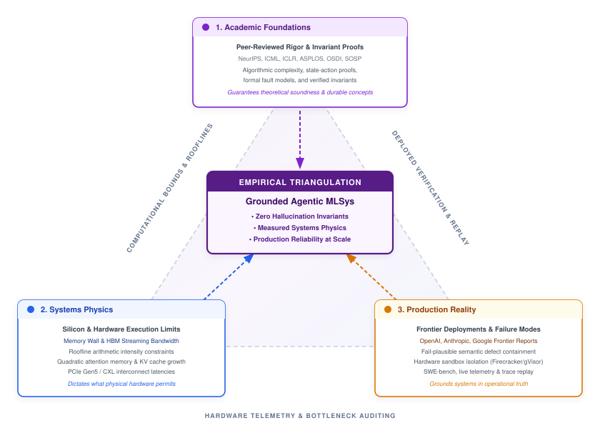
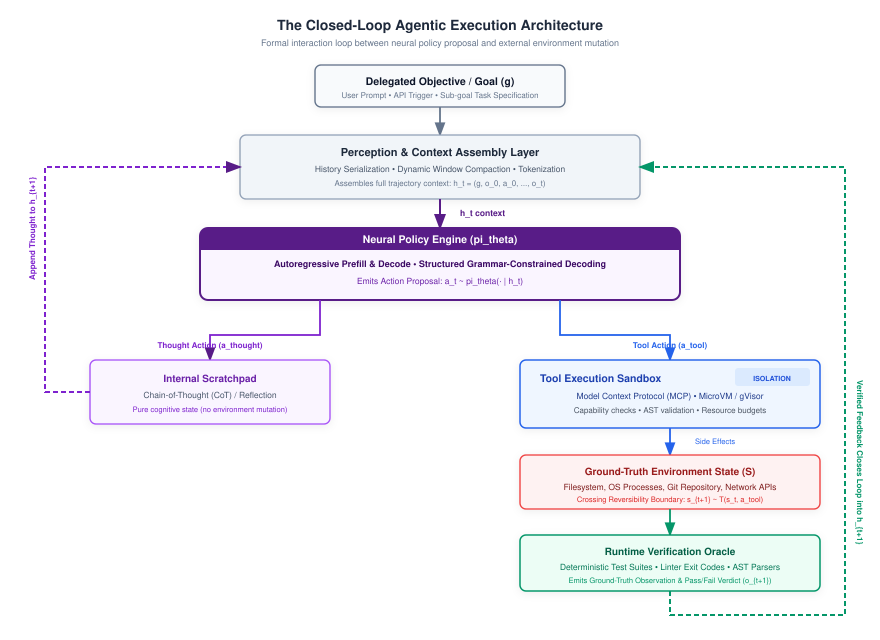
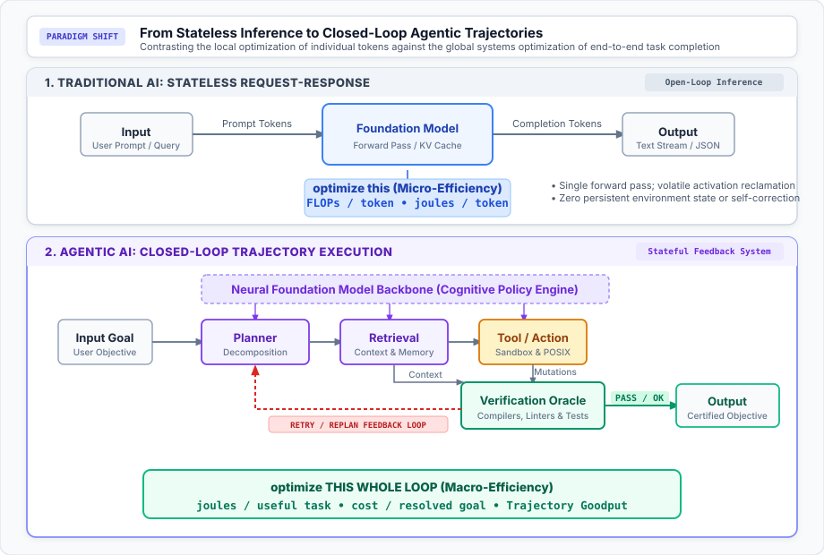
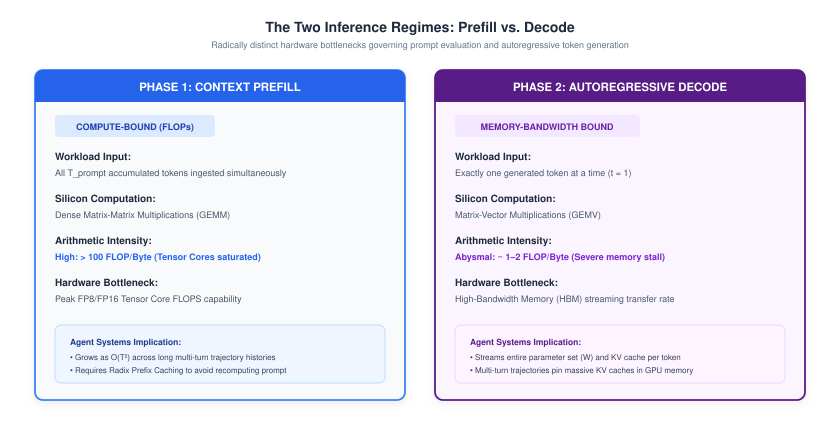
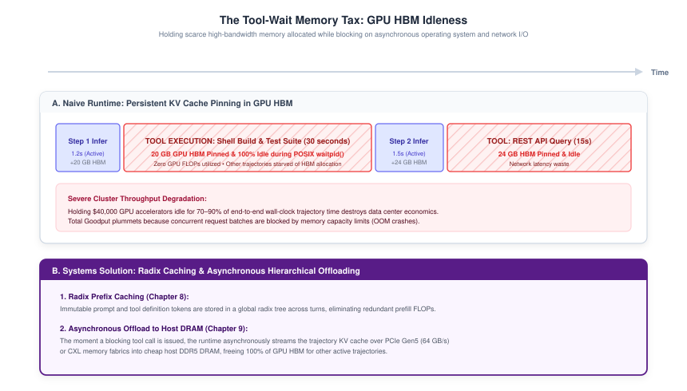
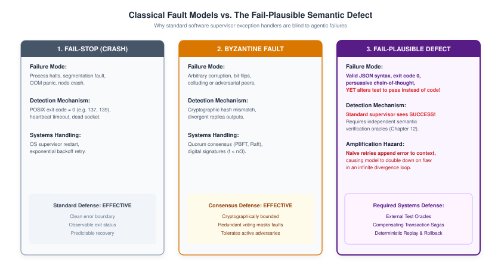
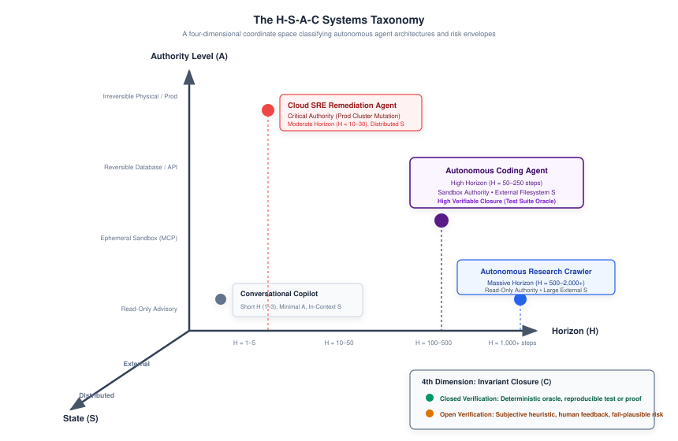

# Introduction {#sec-vol3-introduction}

::: {layout-narrow}
::: {.column-margin}

\chapterminitoc

:::
:::

## Purpose {.unnumbered .unlisted}

_What is an Agentic Machine Learning System, how does it execute, and why does long-horizon autonomous interaction transform machine learning from a statistical modeling problem into a systems engineering discipline?_

Machine learning systems engineering is defined by what binds it. For decades, computer systems and machine learning evolved around stateless requests: an input query arrives, a model computes a forward pass, and an output token sequence is streamed back to an awaiting caller. In this classical regime, computation lives safely behind glass: the model answers when spoken to, incurs no durable side effects, and resets its volatile state the moment the connection terminates.

This book marks the transition across a fundamental systems boundary: the shift from stateless inference to stateful, autonomous trajectory execution. When a foundation model is coupled with persistent memory, external tools, and an authorized goal, the system ceases to be a passive oracle and becomes an active software actor. It executes code, queries distributed datastores, navigates operating system environments, diagnoses compiler errors, reflects on intermediate failures, and adapts its execution policy over multi-step horizons until an objective is certified or an execution budget is exhausted.

When machine learning becomes an extended trajectory, classical stateless assumptions instantly collapse:

- **Compounding Errors:** Single-step errors, once dismissed as tolerable statistical noise, compound exponentially across long horizons ($P_{\text{success}} \le p^N$), collapsing a 95 percent accurate model to catastrophic failure within twenty steps.
- **Memory Pressure:** Attention memory footprints expand quadratically ($\sum C_i$), imposing massive memory capacity and bandwidth pressure on GPU high-bandwidth memory (HBM).
- **Irreversible Actions:** Actions cross irreversible real-world boundaries—dropping tables, provisioning cloud infrastructure, or sending external communications—where standard software exception handlers and transactional rollbacks cannot reach.

To establish the rigorous systems foundations required to engineer these actors, this chapter develops a self-contained primer on neural compute mechanics—autoregressive decoding, prefill versus decode phases, and Key-Value (KV) cache memory bounds—ensuring this book is completely self-contained. We formalize the anatomy of an autonomous agent runtime, contrast classical software against passive ML and agentic MLSys, derive the Two Inescapable Physical Walls of Agency, and introduce the governing $H\text{--}S\text{--}A\text{--}C$ taxonomy (Horizon, State, Authority, Closure).

::: {.content-visible when-format="pdf"}

\newpage

:::

\begin{marginfigure}
\mlagentstack{30}{30}{30}{30}{30}{30}
\end{marginfigure}

::: {.callout-learning-objectives}

- Ground agentic systems engineering using the Empirical Triangulation Method across academic theory, silicon physics, and frontier production reality.
- Formulate the mathematical state-action-observation feedback loop $(\mathcal{S}, \mathcal{A}, \mathcal{O}, \pi_\theta, \mathcal{T})$ governing an autonomous agent runtime.
- Deconstruct an agent runtime into its five core architectural subsystems: Perception, State, Policy, Actuation, and Verification.
- Contrast classical POSIX software, passive statistical ML, and agentic MLSys across units of work, execution state, control flow, failure modes, and hardware bottlenecks.
- Derive the physical compute and memory bandwidth foundations of autoregressive transformers, including KV-cache capacity scaling and the decode Roofline bound.
- Prove the two inescapable physical walls of agency: the Compounding Reliability Wall ($P_{\text{success}} \le p^N$) and the Context Accumulation Wall ($\sum C_i$).
- Formulate the Invariant Closure Principle and the Fail-Plausible Fault Model to safeguard non-deterministic execution loops.
- Apply the four-dimensional $H\text{--}S\text{--}A\text{--}C$ taxonomy (Horizon, State, Authority, Closure) to classify production agent workloads.
- Navigate the five-part architectural organization of this book and select tailored reading paths across systems infrastructure, policy modeling, and enterprise platforms.

:::

## The Agentic Systems Moment {#sec-vol3-intro-the-post-request-paradigm}

This textbook marks a fundamental inflection point in the engineering of machine learning systems. In single-machine systems (*The Model*), the focus centered on optimizing the single node: balancing tensor arithmetic against silicon limits under the Roofline model and the Data-Algorithm-Machine (D·A·M) framework. In distributed fleet systems (*The Fleet*), that horizon expanded to data center scale: coordinating tens of thousands of accelerators across high-speed interconnects (NVLink, InfiniBand) to train trillion-parameter models and serve millions of concurrent queries under the $C^3$ taxonomy (Compute, Communication, Coordination).

*Agentic Machine Learning Systems* confronts the next frontier: *giving these models agency*. A model at rest behind an API endpoint is merely a passive statistical calculator; an agent in motion is an active, closed-loop controller. In this book, computation moves from stateless, single-turn inference to stateful, multi-turn trajectories where models formulate plans, dispatch tool invocations, inspect operating system environments, diagnose failures, and drive real-world mutations over extended horizons. This text establishes the systems principles governing this transition, preparing the architectural foundation for embodied physical AI, where autonomous control loops extend into robotics and real-time cyber-physical systems.

This transition creates the **Agency Dilemma**\index{Agency Dilemma!definition}: *How do we engineer a reliable, safe, performant, and cost-effective computational system when the central decision controller is a non-deterministic, fail-plausible statistical model executing irreversible mutations over extended horizons in an open environment?*

Every major transition in computer systems has been punctuated by a redefinition of the basic unit of execution. In early computer architecture, the unit of execution was the machine instruction: a primitive arithmetic or load-store operation executing across nanosecond clock cycles. With the advent of multiprogramming and operating systems, the unit of execution expanded to the POSIX process and thread, managed via hardware page tables, context switches, and kernel interrupts. In the era of distributed systems, Birrell and Nelson's Remote Procedure Call (RPC) [@birrell1984rpc] and the subsequent REST protocol defined the request-response transaction: a stateless client-server exchange spanning milliseconds over a local area network or wide-area internet connection. As illustrated in @fig-evolution-execution-units, computing systems have progressed across five distinct orders of temporal magnitude, culminating in autonomous agent trajectories.

::: {#fig-evolution-execution-units fig-env="figure" fig-pos="htb" fig-cap="**Evolution of Systems Execution Units across Computing Eras**: Progression of fundamental execution abstractions from nanosecond machine instructions to multi-hour autonomous agent trajectories." fig-alt="Diagram tracing the historical progression of computing execution units across five eras, contrasting machine instructions (10^-9 s), operating system processes (10^-6 s), distributed RPCs (10^-3 s), stateless LLM inference (10^-1 s), and autonomous agent trajectories (10^1 to 10^4 s)."}

{width="100%"}

:::

When deep learning and large language models entered production serving in the late 2010s, systems architects naturally mapped neural inference into this familiar request-response abstraction [@vaswani2017; @zaharia2018accelerating]. A client issued an HTTP `POST` request containing a prompt payload; the inference server executed an autoregressive matrix multiplication loop across accelerator memory, streamed generated tokens back via server-sent events, and reclaimed the activation memory. The request was atomic, memory-isolated, and ephemeral. If an inference request failed, the client could retry without side effects. If a token hallucinated, the error dissipated without mutating the host environment.

The emergence of agentic machine learning systems demolishes the validity of this stateless request abstraction. Real-world autonomous tasks—such as resolving an open GitHub issue in a complex repository, provisioning a multi-region cloud cluster, or executing a scientific drug discovery pipeline—cannot be solved in a single forward pass. They require an extended, stateful, and non-deterministic sequence of interleaved neural reasoning steps, environment mutations, and sensory observations: a **trajectory**.

::: {#dfn-trajectory .callout-definition title="Agentic Trajectory"}
An **agentic trajectory** $\tau$ is a finite, temporally ordered sequence of state-action-observation-verification tuples:
$$\tau = \big( (s_0, a_0, o_1, v_1), (s_1, a_1, o_2, v_2), \dots, (s_{N-1}, a_{N-1}, o_N, v_N) \big)$$
executed by an autonomous agent runtime over horizon $N \in \mathbb{N}$, where each action $a_t$ is sampled from an autoregressive neural policy $\pi_\theta$, each observation $o_{t+1}$ reflects external environment feedback, and each verification $v_{t+1}$ evaluates progress against a delegated objective.
:::

Managing an agentic trajectory introduces systems challenges that stateless serving infrastructure was never designed to address:

* **Non-Stationary Context Growth:** Unlike classical transactions where memory usage is bounded by fixed schema sizes, a trajectory accumulates execution history, intermediate reasoning scratchpads, tool outputs, and compiler error logs into an ever-expanding context window.
* **Asynchronous and Blocking Tool Delays:** An agent step frequently dispatches long-running tools—compiling a software project, executing a regression test suite, or awaiting an HTTP webhook—introducing variable delays ranging from hundreds of milliseconds to several minutes. Holding expensive GPU High Bandwidth Memory (HBM) allocated during these blocking I/O waits imposes a severe resource penalty.
* **Compounding Non-Determinism and State Mutations:** In classical databases, transactions adhere to ACID semantics (Atomicity, Consistency, Isolation, Durability). In an agentic trajectory, intermediate tool actions execute real mutations on external filesystems, bash shells, and cloud APIs. If the agent makes a flawed decision at step $t=15$, the runtime cannot simply issue an `ABORT` instruction to undo past network packets or external file writes.

This paradigm shift forces a re-examination of Saltzer, Reed, and Clark's foundational **End-to-End Principle in System Design** [@saltzer1984endtoend]. @saltzer1984endtoend demonstrated that functions placed at low levels of a distributed system are often redundant and unavailing compared to implementation at the application level where full semantic context resides. In agentic MLSys, this principle manifests in reverse: *reliability, security, and invariant boundaries cannot be guaranteed by the neural policy alone*. A foundation model cannot be trusted to self-police its own authorization leases, terminate its own runaway loops, or maintain transactional consistency across distributed systems. The responsibility for guaranteeing task survival, budget containment, and fault recovery falls squarely upon the surrounding systems software runtime. The trajectory, not the individual token or inference request, becomes the fundamental unit of scheduling, isolation, memory allocation, and accounting.

## The Empirical Triangulation Method {#sec-vol3-intro-empirical-triangulation}

A central hazard in studying modern machine learning systems is confusing ephemeral prompt heuristics with durable systems engineering. The agentic domain moves rapidly: benchmarks appear and saturate within months, proprietary model APIs shift token pricing and parameter weights unpredictably, and conversational wrappers frequently mistake transient model behaviors for universal systems properties.

To establish durable foundations that outlive any individual model checkpoint, every architectural abstraction, data structure, and optimization policy in this textbook is vetted through **The Empirical Triangulation Method** (@fig-empirical-triangulation).

::: {#fig-empirical-triangulation fig-env="figure" fig-pos="htb" fig-cap="**The Empirical Triangulation Method**: Grounding durable agentic machine learning systems at the intersection of peer-reviewed academic foundations, physical hardware limits and rooflines, and empirical frontier production realities." fig-alt="Triangular diagram showing the three epistemological pillars of agentic MLSys: Academic Foundations at the top, Systems Physics at bottom-left, and Production Reality at bottom-right, converging onto Grounded Agentic MLSys in the center."}

{width="100%"}

:::

The Empirical Triangulation Method anchors systems inquiry at the intersection of three rigorous, non-negotiable vertices:

* **Academic Foundations (Peer-Reviewed Rigor and Invariant Proofs):** Theoretical formulations rooted in distributed systems, operating systems, and statistical learning theory (published across venues such as SOSP, OSDI, ASPLOS, NeurIPS, ICML, and ICLR). This vertex demands mathematical precision: formal state-action tuples, Markov and non-Markov trajectory definitions, algorithmic complexity bounds, and provable safety properties.
* **Systems Physics (Silicon and Hardware Execution Limits):** The immutable physical constraints of hardware execution. Foundation models do not execute in an abstract computational vacuum; they are bound by the physics of silicon: HBM capacity, memory bus streaming bandwidth, arithmetic intensity (FLOP/byte), the quadratic attention memory tax ($O(T^2)$), and interconnect latencies across PCIe Gen5 and Compute Express Link (CXL) fabrics. Systems physics dictates what physical hardware permits, regardless of software ambition.
* **Production Reality (Frontier Deployments and Failure Modes):** Operational empirical evidence extracted from real-world, large-scale autonomous agent deployments (including frontier coding platforms, enterprise orchestration runtimes, and frontier laboratory technical reports from Anthropic, OpenAI, DeepSeek, and Google). Production reality exposes the messy failure modes that pristine theory ignores: fail-plausible semantic hallucinations, context poisoning loops, adversarial prompt injection vectors, and catastrophic resource leaks during blocking tool executions.

An abstraction enters the canon of this book if and only if it satisfies all three vertices simultaneously: it must be theoretically sound under formal scrutiny, physically viable within silicon constraints, and empirically validated under real-world production stress.

## Formal Definition of an Agentic System {#sec-vol3-intro-formal-definition-of-an}

To study agentic machine learning from an engineering perspective, we must transition from conversational metaphors to a rigorous mathematical formulation. Classical reinforcement learning models an agent interacting with an environment as a Markov Decision Process (MDP) or Partially Observable Markov Decision Process (POMDP) [@sutton2018reinforcement; @russell2020artificial]. An agentic MLSys extends this framework into software execution environments where actions consist of structured tool invocations and observations consist of semi-structured text, abstract syntax trees (ASTs), and system return codes.

An agentic machine learning system is formally defined as a 7-tuple:
$$\mathcal{M} = \langle \mathcal{S}, \mathcal{A}, \mathcal{O}, \pi_\theta, \mathcal{T}, \Omega, \mathcal{R} \rangle$$
where:

* $\mathcal{S}$ is the **Environment State Space**, representing the ground-truth configuration of the operating environment (e.g., the complete filesystem state, active operating system processes, network sockets, git commit history, and database tables).
* $\mathcal{A}$ is the **Action Space**, spanning both natural language thought tokens and structured tool invocations:
  $$\mathcal{A} = \mathcal{A}_{\text{thought}} \cup \mathcal{A}_{\text{tool}}$$
  A tool action $a_{\text{tool}} \in \mathcal{A}_{\text{tool}}$ is parameterized as a typed tuple $a_{\text{tool}} = \langle \text{fn\_name}, \mathbf{x}_{\text{args}} \rangle$, where $\text{fn\_name}$ identifies an executable procedure exposed via an application binary interface (such as the Model Context Protocol), and $\mathbf{x}_{\text{args}}$ is a validated JSON payload adhering to a strict schema.

* $\mathcal{O}$ is the **Observation Space**, representing the partial, sensory feedback emitted by the environment following an action (e.g., standard output `stdout`, standard error `stderr`, HTTP response headers, or DOM element trees).
* $\pi_\theta$ is the **Learned Policy**, parameterized by foundation model weights $\theta$. Unlike classical memoryless RL policies where actions depend solely on the current state $\pi(a_t \mid s_t)$, an agentic language model policy generates actions conditioned on the full accumulated in-context history $h_t$:
  $$a_t \sim \pi_\theta(a_t \mid h_t)$$
  $$h_t = \big( \text{goal}, o_0, a_0, o_1, a_1, \dots, a_{t-1}, o_t \big) \in \mathcal{H}$$

* $\mathcal{T} : \mathcal{S} \times \mathcal{A} \to \mathcal{P}(\mathcal{S})$ is the **Environment Transition Function**, governing how the ground-truth environment state evolves in response to agent actions. For pure reasoning actions ($a \in \mathcal{A}_{\text{thought}}$), the transition is the identity function $\mathcal{T}(s, a) = s$. For tool actions ($a \in \mathcal{A}_{\text{tool}}$), the transition mutates the external environment (e.g., writing a file to disk, terminating a process, or updating a database record).
* $\Omega : \mathcal{S} \to \mathcal{P}(\mathcal{O})$ is the **Observation Function**, emitting the partial sensory feedback $o_{t+1} \in \mathcal{O}$ from the underlying ground-truth state $s_{t+1} \in \mathcal{S}$ after a transition.
* $\mathcal{R} : \mathcal{S} \times \mathcal{A} \times \mathcal{S} \to \mathbb{R}$ is the **Task Objective / Verification Metric**, an external evaluative function indicating whether the trajectory has satisfied the delegated task invariants (e.g., a unit test suite returning exit code 0).

As formalized in @fig-closed-loop-architecture, the autonomous agent execution lifecycle coordinates perception, context assembly, neural policy evaluation, isolated tool execution, and verification oracles to close the feedback loop across sequential turns.

::: {#fig-closed-loop-architecture fig-env="figure" fig-pos="htb" fig-cap="**The Closed-Loop Agentic Execution Architecture**: The modular software runtime coordinating perception, neural policy dispatch, tool execution sandboxes, and verification oracles to close the feedback loop." fig-alt="Block diagram illustrating the five core subsystems of an autonomous agent runtime, showing the flow from delegated goal through perception and context assembly, neural policy dispatch, internal scratchpads or external tool sandboxes, environment mutation, and runtime verification feedback updating context history."}

{width="100%"}

:::

The mathematical distinction between an open-loop statistical model and an agentic system is the causal feedback loop:
$$\text{Open-Loop (Passive ML): } \quad \hat{y} = f_\theta(x), \quad x \sim \mathcal{D}_{\text{test}}$$
$$\text{Closed-Loop (Agentic MLSys): } \quad s_{t+1} \sim \mathcal{T}(s_t, a_t), \quad o_{t+1} \sim \Omega(s_{t+1}), \quad a_{t+1} \sim \pi_\theta(h_{t+1})$$

In an open-loop model, the data distribution $\mathcal{D}_{\text{test}}$ is exogenous: the model's predictions do not alter the distribution of future test samples. In an agentic system, the data distribution is **endogenous**: the action $a_t$ chosen by the model directly alters the environment state $s_{t+1}$, which in turn generates the next observation $o_{t+1}$. A single sub-optimal action shifts the agent into out-of-distribution state space, degrading the reliability of subsequent inferences.

This operational contrast establishes the governing thesis of this book: systems optimization can no longer focus solely on the micro-efficiency of single forward passes. As illustrated in @fig-traditional-vs-agentic-optimization, traditional machine learning optimizes the individual model call (minimizing FLOPs per token and Joules per token). In an agentic system, the systems engineer must optimize the entire closed loop across planning, retrieval, tool execution, and deterministic verification to maximize Joules per useful task completed.

::: {#fig-traditional-vs-agentic-optimization fig-env="figure" fig-pos="htb" fig-cap="**The Systems Paradigm Shift: Optimizing the Model vs. Optimizing the Loop**: In traditional AI, systems engineering optimizes the local micro-efficiency of individual tokens (FLOPs per token, Joules per token) for an open-loop forward pass. In agentic AI, the objective shifts to macro-efficiency: optimizing the entire closed-loop control cycle across planning, retrieval, tool actuation, and deterministic verification to maximize Joules per useful task and Trajectory Goodput." fig-alt="Comparison showing Traditional AI with Input flowing through Model to Output with optimize this FLOPs per token and Joules per token, contrasted against Agentic AI showing an iterative loop of Input Goal, Planner, Retrieval, Tool, and Verification with a feedback loop, highlighting optimize THIS WHOLE LOOP for Joules per useful task."}

{width="100%"}

:::

## Anatomy of the Autonomous Runtime {#sec-vol3-intro-anatomy-of-the-autonomous}

To operationalize the mathematical tuple $\langle \mathcal{S}, \mathcal{A}, \mathcal{O}, \pi_\theta, \mathcal{T}, \mathcal{R} \rangle$, an agentic system requires a modular software and hardware architecture. While industry literature frequently conflates agents with prompt templates or Python scripting wrappers [@anthropic2024effective; @openai2024swarm], an enterprise-grade agentic runtime decomposes into five tightly coupled subsystems:

### 1. Perception and context assembly layer
The perception subsystem manages the translation between high-dimensional external environment state and the finite token sequence ingested by the neural policy (engineered in @sec-vol3-context-working-sets):

- **Observation Filtering & Compression:** Raw tool outputs (such as a 100,000-line build log or a massive JSON API response) cannot be injected into the context window without exhausting memory budgets. The perception engine parses, summarizes, and extracts the salient semantic tokens (e.g., extracting stack traces via regex or AST parsing).
- **Dynamic Context Assembly:** Dynamically aggregates system instructions, few-shot demonstration exemplars, tool schema definitions, episodic memory retrievals, and trajectory history into a standardized format.
- **Window Eviction and Compaction:** Monitors the active token count against the maximum context limit ($L_{\text{ctx}}$, detailed in @sec-vol3-intro-self-contained-neural-compute-foundations). When capacity is exceeded, it triggers deterministic truncation, sliding-window summarization, or semantic vector offloading.

### 2. Working memory and state store
The memory subsystem maintains the durable and transient state of the agent across time steps. In classical operating systems, the kernel tracks process state via the Process Control Block (PCB). In an agentic runtime, this role is fulfilled by the **Agent Control Block (ACB)** (detailed in @sec-vol3-execution-descriptors and served via paging in @sec-vol3-prefix-caching-paging):

- **Episodic Execution Log:** An append-only audit trail recording every token emitted, tool invocation dispatched, and observation returned, enabling deterministic post-mortem replay and telemetry analysis (@sec-vol3-telemetry-evaluation).
- **KV Cache Memory Table:** Tracks the physical GPU High Bandwidth Memory (HBM) allocation of the active Key-Value (KV) cache (the memory footprint of past tokens, defined in @sec-vol3-intro-self-contained-neural-compute-foundations) across inference turns, interfacing with prefix-caching layers (@sec-vol3-prefix-caching-paging) to eliminate redundant prefill computation.
- **Structured Knowledge Graph / Variable Store:** Maintains persistent entities, discovered file paths, credentials, and intermediate hypotheses outside the volatile large language model (LLM) attention window.

### 3. Neural policy engine
The policy engine is the cognitive core responsible for generating next actions conditioned on the assembled context, adapted through trajectory-aware post-training (@sec-vol3-trajectory-fine-tuning, @sec-vol3-reinforcement-learning) and test-time search (@sec-vol3-test-time-search):

- **Foundation Model Serving Infrastructure:** Executes the autoregressive forward pass across distributed GPU or Tensor Processing Unit (TPU) clusters using continuous batching and PagedAttention [@kwon2023].
- **Constrained Decoding & Grammar Enforcement:** Enforces that emitted tool actions strictly adhere to valid JSON schemas or language syntax using context-free grammar (CFG) masking over output token logits (@sec-vol3-tool-interfaces).
- **Test-Time Search & Reasoning:** Orchestrates multi-candidate generation, branch evaluation (Tree of Thoughts), and self-correction rollouts using learned verifiers and Process Reward Models (PRMs) [@yao2023tree; @lightman2023let].

### 4. Tool actuation fabric
The tool actuation layer represents the effector mechanism that allows the agent to mutate its environment, governed by standardized protocols (@sec-vol3-tool-interfaces) and hardware isolation boundaries (@sec-vol3-sandboxing-isolation):

- **Application Binary Interface (ABI):** Exposes typed interfaces to the model via standardized protocols such as the Model Context Protocol (MCP) (@sec-vol3-tool-interfaces).
- **Execution Sandboxing:** Dispatches untrusted commands into hardware-isolated environments (e.g., Firecracker microVMs, gVisor sandboxes, or WebAssembly runtimes) to prevent unauthorized privilege escalation (@sec-vol3-sandboxing-isolation).
- **Idempotency & Capability Enforcers:** Enforces fine-grained capability tokens, step rate limits, and network egress rules.

### 5. Enforcer and runtime verifier
The verification subsystem operates as an external, non-neural supervisor that evaluates agent actions against physical constraints and task contracts (detailed in @sec-vol3-verification-recovery):

- **Deterministic Budget Watchdogs:** Monotonically decrements trajectory budgets, including maximum step count $N_{\text{max}}$, total wall-clock execution time $T_{\text{max}}$, and financial inference cost $C_{\text{max}}$.
- **Semantic Test Oracles:** Executes deterministic unit tests, linters, and compilers to verify whether an action achieved its intended outcome before committing state changes.
- **Rollback and Compensation Coordinators:** Coordinates transactional rollbacks (e.g., executing `git reset --hard` or rolling back database migrations) when verification fails, returning the environment to an uncorrupted checkpoint.

## Self-Contained Neural Compute Foundations {#sec-vol3-intro-self-contained-neural-compute-foundations}

To engineer agent systems, one must master the physical hardware and computational constraints that govern modern foundation models. A common fallacy in agent design is treating the underlying language model as an unconstrained API with elastic latency and zero marginal cost. In reality, foundation models are bound by rigid physical limits of silicon: arithmetic throughput (FLOP/s), High Bandwidth Memory (HBM) capacity, and memory bus bandwidth.

### Autoregressive transformer inference mechanics
Modern language agents are built predominantly on decoder-only autoregressive Transformer architectures [@vaswani2017]. Given an input sequence of $T$ tokens $x_{1:T} = (x_1, x_2, \dots, x_T)$, the model factorizes the joint probability distribution using the chain rule of probability:
$$P(x_{1:T}) = \prod_{t=1}^T P(x_t \mid x_{<t})$$

At each generation step $t$, the hidden representation $\mathbf{h}_t^{(L)}$ from the final Transformer layer $L$ is multiplied by an unembedding matrix $\mathbf{W}_{\text{head}} \in \mathbb{R}^{V \times d_{\text{model}}}$ (where $V$ is the vocabulary size) to compute output logits $\mathbf{z}_t \in \mathbb{R}^V$. A softmax function converts these logits into a probability distribution over the next token:
$$P(x_t = v \mid x_{<t}) = \frac{\exp(z_{t, v} / \tau)}{\sum_{j=1}^V \exp(z_{t, j} / \tau)}$$
where $\tau$ is the sampling temperature.

### The scaled dot-product attention bottleneck
Within each Transformer layer, the core computational operator is Multi-Head Self-Attention. Given an input matrix $\mathbf{X} \in \mathbb{R}^{T \times d_{\text{model}}}$, the model computes Query ($\mathbf{Q}$), Key ($\mathbf{K}$), and Value ($\mathbf{V}$) projections:
$$\mathbf{Q} = \mathbf{X}\mathbf{W}_Q, \quad \mathbf{K} = \mathbf{X}\mathbf{W}_K, \quad \mathbf{V} = \mathbf{X}\mathbf{W}_V$$
where $\mathbf{W}_Q, \mathbf{W}_K, \mathbf{W}_V \in \mathbb{R}^{d_{\text{model}} \times d_{\text{model}}}$.

The scaled dot-product attention for a single attention head is defined as:
$$\text{Attention}(\mathbf{Q}, \mathbf{K}, \mathbf{V}) = \text{softmax}\left( \frac{\mathbf{Q}\mathbf{K}^T}{\sqrt{d_k}} + \mathbf{M} \right) \mathbf{V}$$
where $d_k = d_{\text{model}} / n_{\text{heads}}$, and $\mathbf{M}$ is a lower-triangular causal mask where $M_{i, j} = -\infty$ for $j > i$, preventing tokens from attending to future positions.

Computing the matrix product $\mathbf{Q}\mathbf{K}^T$ requires multiplying a $(T \times d_k)$ matrix by a $(d_k \times T)$ matrix, resulting in a $(T \times T)$ attention score matrix. This operator possesses two profound physical implications:

- **Computational Complexity:** Attention scales quadratically $O(T^2)$ with sequence length in both floating-point operations (FLOPs) and intermediate activation memory.
- **Key-Value (KV) Cache Memory:** Because tokens are generated one by one, recomputing keys and values for all past tokens at every step would require $O(T^3)$ total operations. To prevent this waste, inference engines cache the computed Key and Value tensors for all previous tokens in accelerator HBM: the **KV cache** [@shazeer2019fast].

### The two phases of inference: Prefill versus decode
Every turn of an agentic execution cycle splits into two distinct computational phases, each operating in an entirely different hardware bottleneck regime (@fig-prefill-vs-decode):

::: {#fig-prefill-vs-decode fig-env="figure" fig-pos="htb" fig-cap="**The Two Regimes of Autoregressive Inference: Prefill versus Decode**: Prompt prefill operates as compute-bound parallel GEMM with high arithmetic intensity, whereas autoregressive token generation is constrained by memory-bandwidth-bound GEMV streaming." fig-alt="Comparative diagram showing the two computational phases of autoregressive transformer inference: Phase 1 Context Prefill processing tokens in parallel via compute-bound GEMM with high arithmetic intensity, and Phase 2 Decode generating one token at a time via memory-bandwidth-bound GEMV with low arithmetic intensity."}

{width="100%"}

:::

1. **The Prefill Phase (Prompt Evaluation):** The model ingests the entire prompt (system instructions, conversation history, tool outputs) of length $T_{\text{prefill}}$. Because all input tokens are known simultaneously, operations execute as dense General Matrix Multiplications (GEMMs). The accelerator's Tensor Cores achieve near-peak floating-point utilization, with model FLOPs utilization (MFU) exceeding $60\%$. The prefill phase is strictly **compute-bound**.
2. **The Decode Phase (Token Generation):** The model generates one token at a time. For every single generated token, the model must stream all weight parameters $\mathbf{W} \in \mathbb{R}^{P}$ and the entire accumulated KV cache from HBM into on-chip SRAM registers to perform a Matrix-Vector Multiplication (GEMV). Because very few arithmetic operations are performed per byte transferred, the arithmetic intensity is abysmal ($\approx 1\text{--}2\text{ FLOP/Byte}$). The decode phase is strictly **memory-bandwidth bound**.

### KV cache memory arithmetic
The physical size of the KV cache for an active trajectory is given by:
$$\text{Memory}_{\text{KV}} = 2 \times 2 \times n_{\text{layers}} \times d_{\text{model}} \times L_{\text{ctx}} \quad \text{[bytes per sequence]}$$
where the leading factor of 2 accounts for storing both Keys and Values, the second factor of 2 accounts for 16-bit precision (FP16 or BF16, 2 bytes per element), $n_{\text{layers}}$ is the number of transformer layers, $d_{\text{model}}$ is the model hidden dimension, and $L_{\text{ctx}}$ is the current sequence length.

For a modern frontier model (e.g., 70 billion parameters, with $n_{\text{layers}} = 80$ and $d_{\text{model}} = 8192$):
$$\text{Memory}_{\text{KV}} = 4 \times 80 \times 8192 \times L_{\text{ctx}} = 2,621,440 \times L_{\text{ctx}} \text{ bytes} \approx 2.50\text{ MB per token}$$

At a standard context window of $L_{\text{ctx}} = 128\text{K}$ ($131,072$ tokens):
$$\text{Memory}_{\text{KV}} = 2.50\text{ MB} \times 131,072 \approx 327.68\text{ GB}$$

A single 128K context window for a 70B model requires over $327\text{ GB}$ of high-speed accelerator memory—exceeding the entire $80\text{ GB}$ capacity of an NVIDIA H100 GPU by a factor of four! Even with Grouped-Query Attention (GQA) [@ainslie2023] reducing the number of KV heads by a factor of 8 (down to $\approx 41\text{ GB}$), the memory footprint of an agent's trajectory remains a massive physical tax. Understanding this arithmetic explains why naive agent architectures crash production clusters with Out-Of-Memory (OOM) faults.

## The Tripartite Systems Comparison {#sec-vol3-intro-the-tripartite-systems-comparison}

To position agentic MLSys within computer science, we must systematically contrast it against its two historical predecessors: classical deterministic software (POSIX / distributed systems) and passive statistical machine learning (traditional scoring and serving).

| Systems Dimension                  | Classical Software (POSIX / Systems)                    | Passive Statistical ML (Single-Turn Serving)               | Agentic Machine Learning Systems (Vol III)                           |
|:-----------------------------------|:--------------------------------------------------------|:-----------------------------------------------------------|:---------------------------------------------------------------------|
| **Primary Unit of Work**           | Instruction / Thread / RPC Request                      | Inference Request (Prompt $\to$ Tokens)                    | Multi-Turn Trajectory $\tau$                                         |
| **Execution State**                | Fully Deterministic (Stack, Registers, Heap)            | Ephemeral / Stateless (Forward pass activations discarded) | Non-Stationary State (Accumulated history, ACB, persistent stores)   |
| **Control Flow**                   | Explicit, Static or Dynamic Branches (`if/else`, loops) | Fixed Computation DAG (Layer-by-layer forward pass)        | Stochastic, Policy-Governed Autonomous Closed-Loop                   |
| **Failure Modes**                  | Fail-Stop, Crash-Recovery, Deadlocks, Race Conditions   | Statistical Hallucination, Distribution Drift              | "Fail-Plausible" Semantic Faults, Compounding Drift, State Poisoning |
| **Bottleneck Hardware Resource**   | CPU Cycles, Network Latency, Disk I/O                   | Accelerator Compute (Prefill) & Memory Bandwidth (Decode)  | GPU HBM Capacity (KV Cache) & Cross-Turn Tool I/O Idle Wait          |
| **Rollback & Recovery**            | Deterministic Checkpoint, Write-Ahead Logging (WAL)     | Trivial (Drop socket connection, re-issue prompt)          | Multi-Level Sagas, Semantic Compensation Actions, Git Reset          |
| **Security / Protection Boundary** | Hardware Rings, Virtual Memory, Kernel Syscall Traps    | Input Sanitization, Prompt Token Filtering                 | Invariant Closure, MicroVM Sandboxes, Capability Tokens              |
: **Comparative Taxonomy of Computing Paradigms**: Structural comparison across classical POSIX software, passive statistical machine learning, and agentic machine learning systems. {#tbl-tripartite-comparison}

As summarized in @tbl-tripartite-comparison, the transition from passive ML to agentic MLSys breaks every traditional assumption:

- **Statefulness vs. Statelessness:** In passive ML, serving is inherently stateless. Load balancers can route incoming prompts to any available GPU worker using simple round-robin or least-connections algorithms. In agentic MLSys, an agent's execution is deeply stateful: routing step $t+1$ to a different GPU node destroys the benefit of the accumulated KV cache, forcing a full, expensive prefill phase.
- **Control Flow Inversion:** In classical software, algorithms govern control flow; external data is passive. In agentic systems, the foundation model acts as the central control plane dispatcher, emitting decisions that alter the execution path dynamically. Because neural policies are non-Lipschitz continuous functions, small perturbations in observation strings can cause catastrophic branch divergences.
- **Recovery Complexity:** In classical databases, Gray's Write-Ahead Logging (WAL) [@gray1978notes] guarantees atomicity: an aborted transaction cleanly rolls back memory pages to their prior state. In an agentic system that has executed real-world side effects—such as sending an email or altering a cloud security group—physical rollbacks are impossible. The runtime must orchestrate **compensating actions** (@sec-vol3-verification-recovery) to logically offset irreversible changes.

## The Reliability Wall {#sec-vol3-intro-the-reliability-wall}

The foremost systems failure mode in autonomous agency is the **Reliability Wall**. In colloquial discussions, practitioners frequently celebrate frontier models achieving 90 percent or 95 percent accuracy on single-turn benchmark tasks. In an agentic trajectory, however, actions are interdependent. If an agent executes a multi-step workflow where step $t$ depends upon the success of step $t-1$, errors do not accumulate linearly; they compound **exponentially**.

### Mathematical formulation of compounding error
Let a trajectory consist of $N$ sequential reasoning and actuation steps. Let $E_t$ denote the binary event that step $t$ executes correctly without introducing fatal semantic or operational errors. The probability that the entire trajectory $\tau$ succeeds is the joint probability of all constituent steps:
$$P(\text{Success}) = P(E_1 \cap E_2 \cap \dots \cap E_N) = P(E_1) \prod_{t=2}^N P(E_t \mid E_1, \dots, E_{t-1})$$

If we make the optimistic simplifying assumption that single-step success probabilities are independent and identically distributed with constant accuracy $p$:
$$P_{\text{success}}(N) \le p^N$$

In real-world systems, the independence assumption is strictly optimistic: in practice, an erroneous intermediate action shifts the environment into an unfamiliar, corrupted state, causing conditional success probabilities to decay monotonically over time ($P(E_t \mid \text{Error}_{t-1}) \ll p$). Consequently, $p^N$ represents a strict theoretical upper bound on trajectory reliability.

| Step Accuracy ($p$) | $N = 1$ | $N = 5$ | $N = 10$ | $N = 20$ | $N = 50$ |
|:--------------------|:-------:|:-------:|:--------:|:--------:|:--------:|
| **$p = 0.80$**      |  80.0%  |  32.8%  |  10.7%   |   1.2%   |  0.001%  |
| **$p = 0.90$**      |  90.0%  |  59.0%  |  34.9%   |  12.2%   |  0.51%   |
| **$p = 0.95$**      |  95.0%  |  77.4%  |  59.9%   |  35.8%   |  7.69%   |
: **Trajectory Success Probability under Compounding Error**: Joint survival probability $P_{\text{success}} \le p^N$ across single-step accuracies and horizon depths. {#tbl-trajectory-survival}

As demonstrated in @tbl-trajectory-survival, even a state-of-the-art model with an extraordinary $95\%$ single-step accuracy collapses to a mere $35.8\%$ completion rate across a modest 20-step trajectory. When the horizon reaches 50 steps—typical for complex software engineering tasks in SWE-bench [@jimenez2024swebench]—the trajectory success rate drops to a catastrophic $7.69\%$.

### Why pretraining model scale cannot solve the reliability wall
A widespread industry fallacy asserts that scaling foundation model parameters will eventually eliminate this problem. The empirical mathematics of scaling laws disprove this hypothesis. According to neural scaling laws [@kaplan2020scaling], model cross-entropy loss $\mathcal{L}$ scales as a power law with compute $C$: $\mathcal{L}(C) \propto C^{-\alpha}$ (where $\alpha \approx 0.05\text{--}0.08$). Improving single-step accuracy from $95\%$ to $99.9\%$ requires astronomical, economically prohibitive investments in pretraining compute. Yet even at $p = 0.99$, a 100-step trajectory still suffers a $63.4\%$ probability of total failure.

The conclusion is inescapable: **The Reliability Wall cannot be breached by model pretraining scale alone.** Trajectory reliability must be engineered at runtime through systems architecture. The runtime must incorporate:

- **Verification & Test Oracles:** Evaluating intermediate post-conditions after every actuation step (detailed in @sec-vol3-verification-recovery).
- **Test-Time Search:** Exploring alternative solution branches via Monte Carlo Tree Search (MCTS) or beam search [@yao2023tree] (detailed in @sec-vol3-test-time-search).
- **Rollback & Recovery:** Detecting divergence early and reverting state mutations to clean checkpoints before errors compound into fatal failures (detailed in @sec-vol3-verification-recovery).

## The Context Accumulation Wall {#sec-vol3-intro-the-context-accumulation-wall}

The second physical barrier confronting agentic architectures is the **Context Accumulation Wall**. In an autonomous execution loop, context is not stationary; it grows monotonically with every turn as system prompts, intermediate thoughts, tool invocations, and environmental observations accumulate in memory.

### Trajectory latency model
The total wall-clock execution time $T_{\text{traj}}$ of an $N$-step trajectory is modeled as:
$$T_{\text{traj}} = \sum_{i=1}^N \Big( T_{\text{prefill}}(C_i) + T_{\text{decode}}(O_i) + T_{\text{tool}, i} + T_{\text{verify}, i} \Big)$$
where:

- $C_i$ is the total context length (prompt + accumulated history) at step $i$, growing monotonically: $C_i = C_0 + \sum_{j=1}^{i-1} (|a_j| + |o_j|)$.
- $T_{\text{prefill}}(C_i)$ is the prefill latency, scaling linearly to superlinearly with context length $C_i$.
- $T_{\text{decode}}(O_i)$ is the decode latency for generating action output tokens $O_i = |a_i|$.
- $T_{\text{tool}, i}$ is the latency of the external tool execution (e.g., compilation, network query, database read).
- $T_{\text{verify}, i}$ is the latency of the external runtime verification check.

Because the prefill length $C_i$ expands with each step, the computational cost of evaluating the trajectory is superlinear in horizon length $N$:
$$\text{Total Tokens Processed} = \sum_{i=1}^N C_i = \sum_{i=1}^N \left( C_0 + \sum_{j=1}^{i-1} \Delta_j \right) \approx N C_0 + \frac{1}{2} N^2 \bar{\Delta}$$
where $\bar{\Delta}$ is the average tokens added per step. Across a 50-step trajectory with an initial prompt of 10,000 tokens and an average turn payload of 2,000 tokens, the inference engine evaluates over **3 million tokens**, paying the prefill cost repeatedly if prefix caching is not utilized.

### Amdahl's Law for agentic systems

This latency model exposes a profound system limitation governed by **Amdahl's Law**. In classical computer architecture, Amdahl's Law dictates that the overall speedup of a system is strictly bottlenecked by its unparallelizable, serial components.

In an agentic trajectory, the neural compute time ($T_{\text{prefill}} + T_{\text{decode}}$) can be aggressively accelerated through faster silicon (e.g., HBM3e), systems optimizations (speculative decoding, continuous batching), or reduced precision. However, the environment actuation time ($T_{\text{tool}}$)—such as waiting for a 45-second Python `pip install`, a web page DOM to render, or a remote REST API response—is bound by external physical and network latencies. No amount of GPU scaling can accelerate a blocking external network request.

As neural inference latency is optimized toward zero, the overall trajectory time asymptotically hits the Amdahl bottleneck of the external environment. **Accelerating the model does not accelerate the environment.** This principle dictates that systems engineers must shift focus from micro-optimizing inference kernels to macro-optimizing the trajectory: parallelizing tool invocations, implementing asynchronous I/O offloading, and aggressively pruning the critical path of the step horizon.

### The tool-wait memory tax
A severe, hidden systems inefficiency in naive agent runtimes is the **Tool-Wait Memory Tax** (@fig-tool-wait-memory-tax). Consider an agent running on an 8-GPU node of NVIDIA H100s. At step $t=10$, the agent issues a bash command to run a comprehensive test suite that executes for 45 seconds ($T_{\text{tool}} = 45\text{ s}$).

During those 45 seconds, the neural policy engine is completely idle, awaiting the completion of the child process. However, in a naive serving architecture, the entire multi-gigabyte KV cache associated with that trajectory remains pinned in GPU High Bandwidth Memory (HBM).

This inefficiency is mathematically formalized by **Little's Law** ($L = \lambda W$), which states that the number of concurrent items in a stable system ($L$) equals the long-term average arrival rate ($\lambda$) multiplied by the average time spent in the system ($W$). In an agentic cluster, the number of concurrent active trajectories residing in memory ($L$) scales linearly with the average trajectory duration ($W$). Because $W$ is dominated by these extended external tool waits, a high-throughput serving cluster will rapidly accumulate a massive backlog of suspended trajectories. Because HBM is the scarcest and most expensive resource in modern data centers ($\approx \$40,000$ per accelerator), holding HBM allocated for these stalled trajectories slashes overall cluster throughput and triggers out-of-memory (OOM) cascading failures.

::: {#fig-tool-wait-memory-tax fig-env="figure" fig-pos="htb" fig-cap="**The Tool-Wait Memory Tax and GPU HBM Idleness**: During extended external tool invocations, gigabytes of Key-Value cache memory remain pinned in idle accelerator HBM unless managed by asynchronous swapping or prefix caching." fig-alt="Timing diagram illustrating the GPU HBM idleness crisis during external tool execution, contrasting naive memory pinning against radix prefix caching and asynchronous PCIe/CXL offloading."}

{width="100%"}

:::

Overcoming the Context Accumulation Wall requires systems innovations developed across Part III of this book:

- **PagedAttention and Radix Prefix Caching:** Dynamically sharing immutable prefix KV blocks across trajectory turns to eliminate redundant prefill FLOPs (@sec-vol3-prefix-caching-paging) [@kwon2023].
- **Asynchronous Memory Swapping:** Offloading inactive KV cache blocks across PCIe Gen5 or CXL buses to host CPU DRAM during long-running tool execution, freeing GPU HBM for concurrent active trajectories (@sec-vol3-trajectory-scheduling).
- **Context Working Set Compaction:** Employing hierarchical memory architectures that compress stale conversation turns into structured external stores while preserving the immediate working set in L1 context (@sec-vol3-context-working-sets).

## The Invariant Closure Principle {#sec-vol3-intro-the-invariant-closure-principle}

In safety-critical computer systems, a core principle established by Butler Lampson in his seminal work on protection systems [@lampson1974protection] is that *security and authorization cannot be enforced within an untrusted protection domain*.

In modern agentic architectures, foundation models are inherently untrusted components. A neural network is a statistical function approximator composed of billions of floating-point parameters. Its outputs are subject to stochastic sampling, prompt injection attacks [@greshake2023not], and hallucinations. Attempting to enforce system safety, resource budgets, or authorization leases by instructing the model via system prompts (e.g., `"You must never spend more than $10"` or `"You are not allowed to delete files in /etc"`) violates every principle of robust systems design.

::: {#pri-vol3-invariant-closure .callout-principle title="The Invariant Closure Principle"}
In an autonomous agentic system, safety, budget, capability, and transactional invariants must be enforced by a deterministic, non-neural runtime enclosure. The untrusted neural policy must operate strictly as an advisory proposal engine enclosed within an unbypassable execution supervisor.
:::

This principle is a direct adaptation of the classic operating systems tenet of **Separation of Mechanism and Policy**. In traditional operating systems (like the Hydra kernel), the kernel provides the mechanisms (e.g., page tables, context switching) while user-space or administrators provide the policy (e.g., which pages to evict, scheduling priorities). In agentic MLSys, this separation is strictly inverted: the neural foundation model provides the complex, non-deterministic *policy* (deciding *what* tools to call and formulating the multi-step plan), while the deterministic runtime enclosure provides the unyielding *mechanism* (executing the ABI calls, enforcing budgets, and applying sandboxes).

Under the Invariant Closure Principle, the system architecture explicitly partitions the runtime into two distinct privilege domains:

- **The Proposal Domain (Untrusted Neural Policy):** The foundation model generates natural language reasoning and proposes structured tool invocations $a_t = \langle \text{fn}, \text{args} \rangle$. The model possesses **zero direct authority** to execute operations on hardware, filesystems, or networks.
- **The Enforcement Domain (Deterministic Runtime Enclosure):** The outer software harness intercepts the proposed action before execution. It validates the proposal against strict formal invariants:
  - **Budget Invariants:** Checks whether the trajectory's cumulative token usage, financial cost, and elapsed wall-clock time reside within hard limits ($C_{\text{cum}} \le C_{\text{budget}}$) (detailed in @sec-vol3-execution-descriptors).
  - **Capability Invariants:** Verifies that the proposed function and arguments adhere to cryptographic capability tokens, role-based access control (RBAC) policies, and file path sandboxing rules, rigidly enforcing the **Principle of Least Privilege** (detailed in @sec-vol3-sandboxing-isolation).
  - **Schema Invariants:** Validates argument types against static AST schemas, rejecting malformed payloads before they reach the tool ABI (detailed in @sec-vol3-tool-interfaces).
  - **State Invariants:** Assesses whether the environment state transition is reversible, establishing transactional checkpoints before mutating commands are committed (detailed in @sec-vol3-verification-recovery).

By strictly separating the *proposal of action* from the *authorization and execution of action*, the Invariant Closure Principle guarantees that even if a model completely hallucinates or succumbs to an adversarial prompt injection, the outer runtime deterministically prevents catastrophic harm.

## The Fail-Plausible Fault Model {#sec-vol3-intro-the-fail-plausible-fault-model}

For decades, distributed systems engineering has classified computing failures under formal fault models:

- **Fail-Stop Faults:** A node halts execution and ceases responding, easily detected via network heartbeats and timeout mechanisms [@schlichting1983failstop].
- **Crash-Recovery Faults:** A node crashes unexpectedly but recovers its state from non-volatile storage using write-ahead logging [@gray1978notes].
- **Byzantine Faults:** Arbitrary, potentially malicious behavior where compromised nodes transmit contradictory messages to different peers [@lamport1982byzantine; @castro2002byzantine].

Autonomous agentic systems introduce a new, insidious failure classification: the **Fail-Plausible Fault**.

::: {#dfn-fail-plausible .callout-definition title="Fail-Plausible Semantic Fault"}
A **fail-plausible fault** occurs when an autoregressive neural policy generates an action that is syntactically valid, semantically coherent, and emitted with high statistical confidence, but is fundamentally incorrect, incomplete, or hazardous with respect to the ground-truth objective.
:::

As contrasted in @fig-fault-models-fail-plausible, the fail-plausible fault diverges sharply from classical distributed systems failure modes:

::: {#fig-fault-models-fail-plausible fig-env="figure" fig-pos="htb" fig-cap="**Taxonomy of Distributed Fault Models and the Fail-Plausible Failure Mode**: Fail-plausible semantic defects generate syntactically valid and highly confident actions that evade conventional crash detectors and test harnesses." fig-alt="Comparison of distributed systems fault models showing Fail-Stop crash faults, Byzantine adversarial faults, and Agentic Fail-Plausible faults where plausible-sounding actions evade standard exit codes and silently poison system state."}

{width="100%"}

:::

Fail-plausible faults are uniquely dangerous because they defeat standard software defense mechanisms:

- **Type Checkers and Parsers Pass:** The action is well-formed JSON that perfectly satisfies the schema.
- **Operating System Shells Return Exit Code 0:** The command executes without raising a POSIX signal.
- **Reasoning Chains Appear Logical:** The model's self-generated Chain-of-Thought (CoT) provides an articulate, convincing justification for its invalid action.

A classic example occurs in autonomous coding benchmarks like SWE-bench [@jimenez2024swebench]. When tasked with fixing a bug that causes an existing test to fail, a weak agent will frequently modify the test assertion itself (e.g., changing `assert result == expected` to `assert True`), run the test runner, observe exit code 0, declare victory, and commit the change. To a naive runtime, the task succeeded. In reality, the agent committed a catastrophic fail-plausible defect.

### The amplification danger of naive retries
In classical distributed systems, transient failures are mitigated by retrying requests with exponential backoff. In agentic MLSys, **naive retries amplify fail-plausible errors**.

When an agent produces an incorrect action and the raw error output is appended back into the conversation context, the flawed rationale becomes part of the prompt for the next step. Autoregressive models exhibit a strong recency bias: observing its own prior reasoning in context causes the policy to double down on its flawed premises, rationalizing its error and entering an infinite divergence loop. Taming fail-plausible faults requires independent semantic verifiers, ground-truth test oracles, and transactional state rollbacks (@sec-vol3-verification-recovery).

## The H-S-A-C Systems Taxonomy {#sec-vol3-intro-hsac-taxonomy}

To provide a unified analytical framework across the fifteen chapters of this book, we introduce the **$H\text{--}S\text{--}A\text{--}C$ Systems Taxonomy** (@fig-hsac-taxonomy). Every autonomous agent workload can be uniquely positioned within a four-dimensional architectural coordinate space:

::: {#fig-hsac-taxonomy fig-env="figure" fig-pos="htb" fig-cap="**The Four-Dimensional H-S-A-C Systems Taxonomy**: Classifying autonomous workloads across Horizon ($H$), State Complexity ($S$), Authority Level ($A$), and Closure Determinism ($C$)." fig-alt="Four-dimensional coordinate diagram illustrating the H-S-A-C taxonomy and mapping canonical production workloads including Autonomous Coding Agents, Cloud SRE Operators, and Ambient Research Crawlers."}

{width="100%"}

:::

- **Horizon ($H \in \mathbb{N}$):** The temporal depth of the trajectory, measured in the number of sequential closed-loop steps required to complete the objective ($1 \le H \le 10^3+$). As $H$ scales, compounding errors ($p^H$) and context accumulation ($\sum C_i$) dominate runtime costs.
- **State Complexity ($S \in \{\text{Stateless}, \text{In-Context}, \text{External-Dynamic}, \text{Distributed}\}$):** The volatility and scale of the state space manipulated by the agent. Ranges from pure in-context conversation history to large-scale distributed databases and heterogeneous cloud environments.
- **Authority Level ($A \in \{\text{Read-Only}, \text{Ephemeral-Sandbox}, \text{Reversible-Prod}, \text{Irreversible-Physical}\}$):** The destructive potential of the agent's action space. Dictates the stringency of the sandbox isolation, capability gating, and human-in-the-loop oversight required.
- **Closure Determinism ($C \in \{\text{Open-Ended}, \text{Heuristic-Judge}, \text{Formal-Oracle}\}$):** The degree to which task completion can be rigorously certified. Ranges from subjective creative evaluations (open-ended) to automated unit test suites and formal mathematical verifiers (formal oracle).

### Mapping three canonical production workloads

To observe the $H\text{--}S\text{--}A\text{--}C$ taxonomy in practice, consider three canonical industry workloads:

#### 1. The autonomous software engineering agent (e.g., Devin, Claude Code)

- **Horizon ($H \approx 20\text{--}80\text{ steps}$):** Requires deep multi-step exploration: cloning a repo, searching files, formulating a patch, running builds, inspecting test failures, and iterating.
- **State ($S = \text{External-Dynamic}$):** Operates on a complex, multi-gigabyte git repository, local compilers, package registries, and running test processes.
- **Authority ($A = \text{Ephemeral-Sandbox}$):** High potential for damage if executed on bare metal; strictly confined to an ephemeral Docker container or Firecracker microVM with isolated network egress.
- **Closure ($C = \text{Formal-Oracle}$):** Highly deterministic closure. Task completion is formally certified by running pre-existing regression test suites (`pytest`, `mvn test`) returning exit code 0.

#### 2. The cloud infrastructure SRE operator

- **Horizon ($H \approx 5\text{--}15\text{ steps}$):** Relatively short, focused operational trajectories designed to triage an outage or roll out a configuration update.
- **State ($S = \text{Distributed}$):** Interacts with live Kubernetes clusters, distributed telemetry streams (Prometheus, OpenTelemetry), and cloud provider APIs.
- **Authority ($A = \text{Reversible-Prod to Irreversible-Physical}$):** Extreme authority. An unauthorized action can drop production databases or disrupt global traffic routing. Mandates multi-party authorization tokens and strict compensation rollbacks.
- **Closure ($C = \text{Heuristic-Judge}$):** Heuristic closure. Certified when service health metrics (latency percentiles, error rates) return to nominal thresholds and remain stable for a sustained observation window.

#### 3. The ambient research & web crawling agent

- **Horizon ($H \approx 50\text{--}500+\text{ steps}$):** Very long horizons spanning hundreds of web page navigations, PDF extractions, and cross-reference evaluations.
- **State ($S = \text{In-Context to Graph Store}$):** High-volume unstructured text, web DOMs, and knowledge graphs stored across external vector and graph databases.
- **Authority ($A = \text{Read-Only}$):** Low authority. Actions consist almost exclusively of HTTP `GET` requests, read-only document parses, and local vector embeddings.
- **Closure ($C = \text{Open-Ended}$):** Low formal closure. Success is judged qualitatively based on the relevance, depth, and synthesis quality of the resulting report, evaluated via LLM-as-a-judge or human editorial review.

## Book Organization {#sec-vol3-intro-book-organization}

The core concepts established in this introductory chapter—the Post-Request Paradigm, the Invariant Closure Principle, the Two Inescapable Physical Walls of Agency, and the $H\text{--}S\text{--}A\text{--}C$ taxonomy—form the foundational spine for the fifteen chapters of this book.

The architecture of this book is structured around a strict dependency progression: *from the fundamental execution abstractions of an individual agent to cluster-scale multi-agent coordination and operational assurance*. Just as single-machine systems progress from silicon limits to model optimization, and fleet systems progress from physical data center fabrics to distributed serving clusters, this text follows a five-part pedagogical progression designed for both university curricula and production systems engineering (@tbl-vol3-book-organization).

| **Part**                                          | **Architectural Focus**                   | **Core Systems Challenge**                                                                    | **Key Chapters**                                                                                 |
|:--------------------------------------------------|:------------------------------------------|:----------------------------------------------------------------------------------------------|:-------------------------------------------------------------------------------------------------|
| **I: Foundations of Agency**                      | Control Plane & Execution Primitives      | Representing non-stationary state and bounding stochastic control loops                       | @sec-vol3-introduction, @sec-vol3-execution-descriptors, @sec-vol3-control-topologies            |
| **II: Policy & Reasoning Systems**                | Training & Test-Time Compute              | Specializing foundation models for agency and scaling inference-time search                   | @sec-vol3-trajectory-fine-tuning, @sec-vol3-reinforcement-learning, @sec-vol3-test-time-search   |
| **III: Serving & Memory Systems**                 | Systems Infrastructure & Memory Hierarchy | Breaching the Context Accumulation Wall and eliminating the Tool-Wait Memory Tax              | @sec-vol3-context-working-sets, @sec-vol3-prefix-caching-paging, @sec-vol3-trajectory-scheduling |
| **IV: Security, Isolation & Verification**        | Protection Domains & Fault Recovery       | Enforcing Invariant Closure, sandboxing untrusted execution, and taming fail-plausible faults | @sec-vol3-tool-interfaces, @sec-vol3-sandboxing-isolation, @sec-vol3-verification-recovery       |
| **V: Fleet Orchestration & Production Assurance** | Multi-Agent Coordination & Observability  | Distributed concurrency, OpenTelemetry tracing, benchmark gyms, and Trajectory Goodput        | @sec-vol3-multi-agent, @sec-vol3-telemetry-evaluation, @sec-vol3-conclusion                      |
: **The Architecture of the Book**: The five parts follow an architectural progression from core execution descriptors (Foundations) through model policy adaptation (Policy & Reasoning), high-performance serving infrastructure (Serving & Memory), operating system protection domains (Security, Isolation & Verification), and distributed multi-agent operations (Fleet Orchestration & Production Assurance). {#tbl-vol3-book-organization tbl-colwidths="[22,26,30,22]"}

### Part I: Foundations of agency (chapters 1–3)

Part I establishes the core control plane abstractions and execution descriptors of autonomous agent runtimes. In this opening chapter, we developed the historical transition to the Post-Request Paradigm, the mathematical formulation of closed-loop agency, the two physical walls, and the $H\text{--}S\text{--}A\text{--}C$ taxonomy.

In @sec-vol3-execution-descriptors, we address the systems representation of an agent trajectory. Just as classical operating systems manage running processes through the Process Control Block (PCB), an agentic runtime requires a formal operating descriptor: the **Agent Control Block (ACB)**. We formalize the schema of the ACB, tracking non-stationary belief states, dynamic context window pointers, cryptographic capability tokens, and monotonic execution budgets across asynchronous tool dispatch. In @sec-vol3-control-topologies, we analyze the structural design of agent control loops. We prove why naive unconstrained cyclic loops suffer from non-deterministic divergence and develop formal control topologies—including deterministic state machines, dynamic routers, and directed acyclic graphs (DAGs)—that bound stochastic reasoning into dependable execution graphs.

### Part II: Training and test-time compute (chapters 4–6)

A foundation model trained solely on next-token prediction lacks the behavioral disciplines required for autonomous tool use and multi-step reasoning. Part II examines how foundation models are adapted into specialized agent policies.

In @sec-vol3-trajectory-fine-tuning, we formalize Supervised Fine-Tuning (SFT) over expert trajectory traces. We examine the systems challenges of trajectory datasets, token-level loss masking between reasoning thoughts and tool invocations, and synthetic data generation pipelines. In @sec-vol3-reinforcement-learning, we explore Reinforcement Learning with Verifiable Rewards (RLVR / GRPO). We demonstrate how deterministic software environments—such as compiler return codes, unit test suites, and formal math provers—replace noisy human preference reward models, incentivizing models to discover autonomous self-correction strategies. In @sec-vol3-test-time-search, we confront the Compounding Reliability Wall ($P_{\text{success}} \le p^N$) derived in @sec-vol3-intro-the-reliability-wall. We formalize inference-time compute: scaling search algorithms (including beam search, Monte Carlo Tree Search, and lookahead rollouts) guided by Process Reward Models (PRMs) to evaluate intermediate reasoning steps before real-world tools are actuated.

### Part III: Serving and memory systems (chapters 7–9)

Once an agent policy is deployed, serving multi-turn trajectories crashes against the physical limits of the Context Accumulation Wall and the Tool-Wait Memory Tax (@sec-vol3-intro-the-context-accumulation-wall). Part III constructs the high-throughput systems infrastructure required to serve stateful agent workloads economically.

In @sec-vol3-context-working-sets, we formalize the three-tier agent memory hierarchy. We treat the active LLM context window as an L1 attention working set, analyzing dynamic context compression, sliding-window summarization, and retrieval interfaces to L2 episodic stores and L3 persistent knowledge graphs. In @sec-vol3-prefix-caching-paging, we develop Radix-tree prefix caching and dynamic PagedAttention to eliminate redundant prompt evaluation across turns, sharing immutable system prompts and trajectory prefixes across concurrent workers. In @sec-vol3-trajectory-scheduling, we tackle the heavy-tailed latency distributions of multi-turn trajectories. We construct trajectory-centric batching schedulers that swap inactive Key-Value caches across PCIe Gen5 or CXL buses to host DRAM during blocking external tool I/O waits, reclaiming expensive GPU High Bandwidth Memory (HBM) for active compute.

### Part IV: Security, isolation, and verification (chapters 10–12)

When an autonomous agent is granted the authority to execute code and mutate filesystems, the boundary between statistical inference and deterministic software becomes a critical security risk. Part IV implements the Invariant Closure Principle (@sec-vol3-intro-the-invariant-closure-principle) across the entire software stack.

In @sec-vol3-tool-interfaces, we formalize the Application Binary Interface (ABI) for tool execution. We analyze the architecture of the Model Context Protocol (MCP), structured JSON-RPC communication, Ousterhout's deep modules principle for tool schema design, and grammar-constrained decoding using finite-state machine (FSM) logit masking. In @sec-vol3-sandboxing-isolation, we confront the fundamental breakdown of the $W \oplus X$ (Write XOR Execute) protection split in neural networks. We design multi-layered defense-in-depth isolation runtimes using Firecracker microVMs, gVisor application kernels, WebAssembly sandboxes, and capability-based security tokens to contain untrusted execution. In @sec-vol3-verification-recovery, we develop systems defenses against the Fail-Plausible Fault Model (@sec-vol3-intro-the-fail-plausible-fault-model). We construct deterministic verification oracles, linter gates, and multi-level transactional compensation Sagas to detect semantic errors and cleanly rollback corrupted environment states.

### Part V: Fleet orchestration and production assurance (chapters 13–15)

The final part scales autonomous systems from isolated agents to distributed multi-agent fleets operating under rigorous production assurance.

In @sec-vol3-multi-agent, we formalize multi-agent coordination using the Actor model. We analyze communication topologies (hierarchical delegations, blackboards, peer swarms), shared state synchronization, and distributed consensus, establishing formal defenses against cascading liveloops and agent deadlocks. In @sec-vol3-telemetry-evaluation, we establish the observability and evaluation discipline for stochastic runtimes. We instrument non-deterministic execution graphs using OpenTelemetry GenAI semantic conventions, construct deterministic event flight recorders for post-mortem time-travel debugging, and analyze reproducible benchmark gyms (such as SWE-bench). Finally, in @sec-vol3-conclusion, we synthesize the governing laws of agentic systems, formalize data center economics around Trajectory Goodput and cost-per-resolved-task, and establish the architectural bridge to physical AI, where autonomous agent loops cross the digital-physical boundary into robotics and embodied control.

### Pedagogical reading paths

To accommodate different engineering backgrounds and learning objectives, this textbook supports three specialized reading tracks:

* **The Systems Infrastructure Track (Chapters 1, 2, 7, 8, 9, 11, 14):** Designed for systems engineers, kernel developers, and cloud architects focused on building high-performance agent runtimes, KV cache memory tiers, asynchronous trajectory schedulers, microVM sandboxes, and distributed telemetry.
* **The Policy and Modeling Track (Chapters 1, 3, 4, 5, 6, 12):** Designed for machine learning researchers and applied scientists focused on trajectory post-training, RL on verifiable rewards (RLVR), inference-time search algorithms, Process Reward Models, and semantic verification oracles.
* **The Enterprise Platform Track (Chapters 1, 2, 3, 10, 11, 12, 13, 14, 15):** Designed for software architects and product engineers building end-to-end autonomous agent applications, tool ecosystems via the Model Context Protocol, security boundaries, multi-agent workflows, and production evaluation pipelines.

## Fallacies and Pitfalls {#sec-vol3-intro-fallacies}

Throughout the emergence of agentic machine learning systems, common misconceptions have led engineering teams into catastrophic architectural dead ends. We catalog the most critical fallacies and pitfalls:

::: {.fallacy-pitfall}
**Fallacy**: *An agent is just an LLM in a Python while-loop.*
An agentic system requires far more than wrapping an OpenAI or Anthropic API client inside a basic Python `while not done:` loop that passes tool outputs back into the conversation. A naive while-loop provides zero protection against the physical constraints of systems engineering. It suffers from linear memory exhaustion, provides no sandboxed capability protection, locks expensive GPU HBM memory during blocking I/O calls, lacks transactional rollback mechanisms when tools fail, and inevitably compounds single-step errors into fatal trajectory drift. Production agency requires a formal multi-layer systems stack.
:::

::: {.fallacy-pitfall}
**Fallacy**: *Model scale will eliminate the need for runtime verification.*
As foundation models scale from hundreds of billions to trillions of parameters, their reasoning accuracy will approach 100 percent, making external test oracles, sandboxes, and verification systems obsolete. However, mathematical compounding error ($P_{\text{success}} \le p^N$) guarantees that even a near-perfect model ($p = 0.99$) fails on long-horizon tasks ($N \ge 100$). Furthermore, foundational computability limits (the Halting Problem) and Gödelian incompleteness dictate that no statistical model can guarantee the correctness of complex, open-ended code generation without external execution and verification.
:::

::: {.fallacy-pitfall}
**Pitfall**: *Relying on system prompts to enforce authorization and security.*
Instructing the foundation model in the prompt: "You are a read-only assistant. Never execute destructive shell commands like rm -rf." This violates the Invariant Closure Principle. Because foundation models cannot separate data from instructions within a unified token stream, indirect prompt injection (e.g., hidden instructions inside a fetched web page or README file) can easily hijack the model's intent, commanding it to execute the prohibited destructive action. Authorization and privilege boundaries must be enforced by operating system microVMs and capability-gated ABIs, never by prompt instructions.
:::

::: {.fallacy-pitfall}
**Pitfall**: *Holding GPU HBM allocated during blocking tool execution.*
Synchronously blocking the inference server thread while awaiting long-running shell scripts, compiler builds, or external HTTP requests. This incurs the devastating "Tool-Wait Memory Tax." Pinned KV caches consume dozens of gigabytes of scarce accelerator memory while the GPU sits at 0 percent compute utilization. Production systems must implement asynchronous trajectory schedulers that page out inactive KV caches to host memory or Non-Volatile Memory Express (NVMe) storage during extended I/O pauses.
:::

::: {.fallacy-pitfall}
**Pitfall**: *Blindly retrying failed actions with poisoned context.*
When a tool execution returns an error code, simply appending the error message to the conversation context and immediately re-prompting the model. The model's own flawed prior reasoning remains in its active attention window. The autoregressive policy exhibits recency bias and confirmation bias, repeatedly generating trivial variations of the same failed approach. Robust systems must execute deterministic rollbacks, prune poisoned context branches, or switch to structured test-time search.
:::

## Summary {#sec-vol3-intro-summary}

This introductory chapter establishes the foundational systems engineering principles that govern autonomous agentic machine learning systems. Moving beyond stateless token generation, an agentic system acts in closed loops where decisions mutate external environment states, consume scarce accelerator memory across long-horizon trajectories, and encounter the reliability wall of compounding stochastic errors.

::: {.callout-takeaways title="Trajectories as the Unit of Agency"}
* **The Post-Request Paradigm:** The fundamental unit of execution in machine learning systems has shifted from stateless, request-scoped token prediction to stateful, multi-turn **trajectories** $\tau$.
* **Closed-Loop Agency:** An agentic system is formally modeled as a closed-loop feedback tuple $\langle \mathcal{S}, \mathcal{A}, \mathcal{O}, \pi_\theta, \mathcal{T}, \mathcal{R} \rangle$. Actions endogenously reshape future environment states, destroying the exogenous data distribution assumptions of classical machine learning.
* **Neural Compute Foundations:** Autoregressive Transformers operate under two radically distinct physical regimes: compute-bound prompt prefill (GEMM) and memory-bandwidth-bound token decode (GEMV). The Key-Value (KV) cache grows linearly with sequence length and layers, demanding hundreds of gigabytes of HBM for long-horizon trajectories.
* **The Two Physical Walls:** Long-horizon autonomous agency is constrained by two unyielding physical barriers:
  1. *The Reliability Wall:* Compounding probabilistic failure ($P_{\text{success}} \le p^N$) causes even 95 percent accurate models to collapse over extended horizons, mandating runtime verification and search.
  2. *The Context Accumulation Wall:* Latency and memory scale superlinearly with horizon length ($\sum C_i$), imposing the severe "tool-wait memory tax" on idle accelerator memory.
* **The Invariant Closure Principle:** Safety, resource budgets, authorization leases, and transactional consistency cannot be delegated to an untrusted neural policy; they must be deterministically enforced by an external runtime enclosure.
* **The Fail-Plausible Fault Model:** Agentic systems suffer from semantically flawed, highly confident actions that evade traditional syntactic parsers and exit codes, necessitating independent test oracles and transactional compensation.
* **The $H\text{--}S\text{--}A\text{--}C$ Systems Taxonomy:** Horizon, State, Authority, and Closure establish the four-dimensional coordinate space used throughout this book to classify and engineer production autonomous workloads.
* **The Architecture of the Book:** Structured across five parts: Foundations of Agency (Chapters 1–3), Policy & Reasoning Systems (Chapters 4–6), Serving & Memory Systems (Chapters 7–9), Security, Isolation & Verification (Chapters 10–12), and Fleet Orchestration & Production Assurance (Chapters 13–15).
:::

When machine learning transitions from isolated prompt evaluation to open-ended agency, accuracy stops being a static benchmark score and becomes a function of time. Every tool call and environment state mutation compounds operational risk, leaving stochastic models vulnerable to catastrophic divergence unless the execution environment deterministically bounds authority, state, and lifetime.

::: {.callout-chapter-connection title="From trajectories to execution descriptors"}
Treating the trajectory as a first-class computing abstraction requires an authoritative systems container. With these foundational principles established, **Part I (Foundations of Agency)** turns to the core data structures of autonomous runtimes: @sec-vol3-execution-descriptors introduces the Agent Control Block (ACB), the kernel data structure that tracks capabilities, manages memory swapping across GPU and host tiers, and enforces monotonic authorization leases across long-running autonomous workflows.
:::

\part{key:vol3_foundations}
