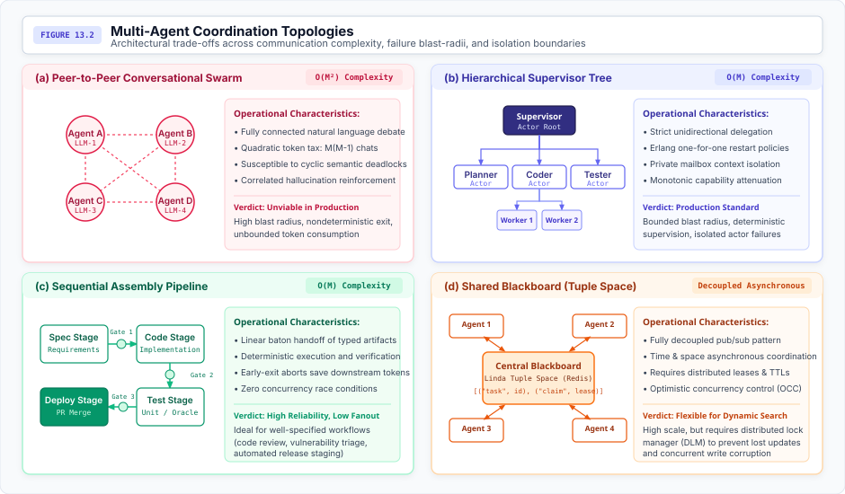
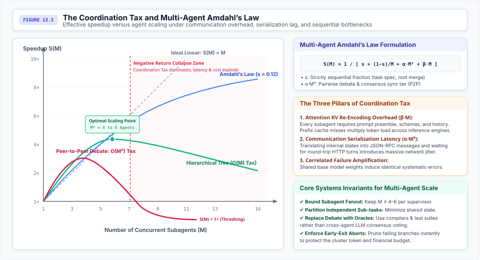
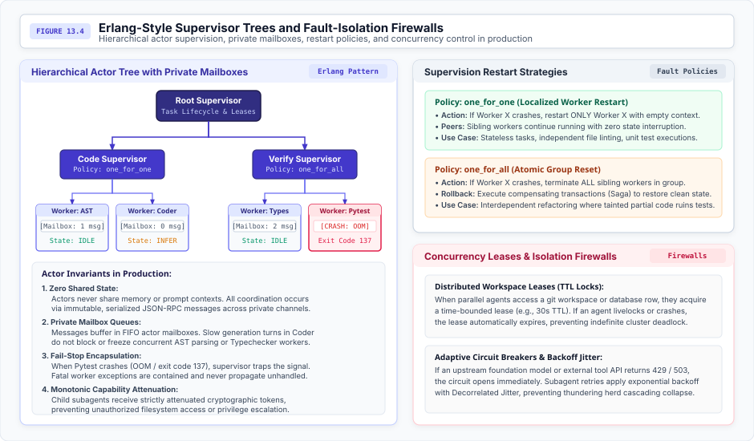

# Multi-Agent Systems and Coordination Topologies {#sec-vol3-multi-agent}

::: {layout-narrow}
::: {.column-margin}

\chapterminitoc

:::
:::

## Purpose {.unnumbered .unlisted}

_Under what systems conditions does decomposing a task across multiple stochastic agents improve performance, and when does coordination overhead destroy efficiency?_

Multi-agent collaboration must be engineered as distributed computing over non-deterministic, untrusted nodes. In popular lore, multi-agent systems are frequently romanticized as anthropomorphic committees engaging in open-ended natural language deliberation. In production systems engineering, this conversational framing is an operational disaster. Unconstrained peer-to-peer debate between stochastic large language models (LLMs) incurs a catastrophic quadratic communication tax ($O(M^2)$), generates runaway token expenditures, and precipitates cyclic semantic deadlocks. Furthermore, because subagents frequently share identical foundation model pretraining checkpoints, their failure modes are strongly correlated: unguided peer debate reinforces shared cognitive biases and hallucinated premises rather than eliminating them.

To achieve robust cluster-scale execution, multi-agent architectures must abandon conversational metaphors and adopt classical distributed systems foundations: Hewitt and Agha's Actor model, Erlang-style supervisor trees, monotonic capability attenuation, and strict lease-based concurrency control over shared physical workspaces. Adding agents to an operational pipeline yields diminishing or negative returns unless the coordination graph is bounded, state is strictly isolated in private mailboxes, and intermediate transitions are validated by deterministic test oracles.

::: {.content-visible when-format="pdf"}

\newpage

:::

\begin{marginfigure}
\mlagentstack{95}{35}{25}{25}{20}{15}
\caption{The Agentic Machine Learning Systems Stack. Multi-Agent Systems operate at Layer 6 (Fleet \& Assurance).}
\end{marginfigure}

::: {.callout-learning-objectives}

- Formulate Amdahl's Law for multi-agent workloads and calculate the optimal agent scaling boundary $M^*$ against the Coordination Tax
- Contrast the Actor model of isolated state and private message queues against unconstrained conversational swarms
- Map the four primary coordination topologies—Peer-to-Peer, Hierarchical Supervisor Tree, Sequential Pipeline, and Blackboard—evaluating their communication complexity and blast radii
- Prove why correlated Byzantine failures in foundation models defeat voting-based consensus and mandate external deterministic oracles
- Implement Erlang-style supervisor trees with one-for-one and one-for-all restart policies and circuit breakers
- Design lease-based concurrency control and distributed cycle detection algorithms to eliminate semantic deadlocks in shared workspaces

:::

## Beyond the Conversational Metaphor {#sec-vol3-multi-agent-intro}

As autonomous machine learning systems tackle large-scale industrial workloads—such as migrating a multi-million-line codebase, managing distributed cloud operations, or executing continuous vulnerability assessments—a single monolithic agent encounters fundamental physical limits. A single agent's context window rapidly saturates, its single-threaded execution becomes a severe wall-clock latency bottleneck, and its failure domain encompasses the entire end-to-end task. Decomposing complex objectives across an ensemble of specialized, collaborating agents represents an architectural necessity.

However, popular software frameworks frequently treat multi-agent coordination as an unconstrained conversational chat room: instantiating anthropomorphic "personas" (e.g., "Coder," "Reviewer," "Manager") that deliberate in free-form natural language over a shared prompt buffer. In production systems engineering, this conversational approach is an operational disaster:

1. **Quadratic Communication Tax ($O(M^2)$):** In unconstrained chat swarms, token consumption and network traffic scale quadratically with fleet size $M$, rapidly exhausting context windows and GPU serving budgets on redundant chit-chat.
2. **Correlated Byzantine Hallucinations:** Because subagents typically run on identical foundation model checkpoints, peer debate reinforces shared cognitive biases and hallucinated premises rather than detecting them.
3. **Semantic Deadlocks and Livelocks:** Without deterministic coordination protocols, agents fall into cyclic conversational arguments, repeating edits and burning thousands of dollars of compute without making forward progress.

To achieve robust, high-throughput execution at cluster scale, multi-agent systems must abandon conversational metaphors and adopt classical distributed computing foundations. Systems engineers must treat agents as **Stochastic Compute Nodes** communicating via explicit, typed message passing. Decoupling agent execution requires four core systems primitives:

- **The Actor Model and Zero Shared Context:** Isolating execution state within private mailboxes so that attention pollution in one agent cannot contaminate the context of another [@hewitt1973actor; @agha1986actors].
- **Bounded Coordination Topologies:** Restricting communication to structured graphs—such as unidirectional supervisor-worker trees and sequential pipelines—to bound the failure blast radius.
- **Monotonic Capability Attenuation ($C_{\text{child}} \subseteq C_{\text{parent}}$):** Enforcing cryptographic lease-based security where delegated subagents cannot exceed the authority of their parent dispatcher.
- **Multi-Agent Amdahl's Law:** Quantifying the diminishing returns of fleet scaling to determine the optimal agent concurrency limit $M^*$ against communication and verification taxes.

This chapter establishes the distributed systems foundations of multi-agent architectures. In @sec-vol3-multi-agent-stochastic-nodes-and-distributed, we formalize stochastic compute nodes and the Hewitt-Agha actor computing model. In @sec-vol3-multi-agent-message-passing-mailboxes-and, we evaluate private message passing and mailbox isolation. We classify coordination topologies in @sec-vol3-multi-agent-topology-taxonomy-hierarchical-peer-to-peer, derive the Coordination Tax and Multi-Agent Amdahl's Law in @sec-vol3-multi-agent-the-coordination-tax-and, and investigate concurrency control, deadlocks, Byzantine consensus, and capability delegation across the subsequent sections.

## Stochastic Actor Computing {#sec-vol3-multi-agent-stochastic-nodes-and-distributed}

In classical distributed systems, compute nodes are modeled as deterministic state machines executing deterministic instruction sets. Even under Byzantine fault models, non-faulty nodes transition predictably according to well-defined state transition functions.

Agentic systems introduce a fundamentally new computing primitive: the **Stochastic Compute Node**. An agent is an autonomous software entity driven by an autoregressive neural network whose outputs are probabilistic draws conditioned on contextual memory. As formalized in @principle-stochastic-actors, coordinating multiple stochastic nodes demands that systems discard conversational assumptions in favor of formal actor semantics, bounded communication graphs, and deterministic verification.

### Mathematical Formulation of an Agent Actor

Drawing upon the foundational Actor model of computation originally introduced by @hewitt1973actor and formalized by @agha1986actors, an agent runtime is structured not as a collection of shared-memory threads, but as an ensemble of completely decoupled, concurrent **Actors**.

Formally, an Agent Actor $\mathcal{A}_i$ is defined as a tuple:

$$\mathcal{A}_i = \langle \mathcal{S}_i, \mathcal{M}_i, \pi_i, \mathcal{T}_i, \mathcal{C}_i \rangle$$

where:

* $\mathcal{S}_i$ is the private internal state of the actor (including its active prompt working set, system instructions, and local reasoning scratchpad).
* $\mathcal{M}_i$ is a dedicated, first-in, first-out (FIFO) private message queue (the actor's **Mailbox**).
* $\pi_i(a_t \mid s_t, m)$ is the underlying stochastic policy (the foundation model) mapping the current state and incoming messages to actions.
* $\mathcal{T}_i$ is the restricted set of external tools and system calls the actor is authorized to dispatch.
* $\mathcal{C}_i$ is the capability descriptor defining the actor's cryptographic permissions and budget constraints.

### The Hewitt-Agha Actor Invariants

Under the classical Hewitt-Agha formalism, an actor executing in response to an incoming message can perform only three primitive operations:

* **Send a finite number of messages** to known addresses of other actors.
* **Create a finite number of new actors** with initialized states and attenuated capabilities.
* **Designate the replacement behavior** (the mutated internal state $\mathcal{S}_{i}'$) that will govern its response to the next message retrieved from its mailbox.

In an agentic architecture, these invariants enforce **Zero Shared Context**:

$$\mathcal{S}_i \cap \mathcal{S}_j = \emptyset, \quad \forall i \ne j$$

Two agents never read from or write to a common context window. There is no shared global prompt memory. All coordination occurs exclusively through explicit, immutable, and serialized messages passed between mailboxes. If Agent A needs Agent B to inspect a code diff, Agent A cannot assume Agent B can see its active working set; it must serialize the diff into an explicit message payload. This invariant guarantees absolute context isolation, preventing attention pollution and token bloat from leaking across execution boundaries.


## Message Passing and Mailboxes {#sec-vol3-multi-agent-message-passing-mailboxes-and}

Why is shared global context fatal to multi-agent scaling? Consider a naive multi-agent architecture where $M$ agents contribute turns to a single shared conversation buffer.

### The Shared Context Anti-Pattern

Let $T_k$ represent the token length of the message emitted by agent $k$ at turn $t$. In a shared context window, every agent must process the entire accumulated history of all other agents:

$$H_t = H_0 \circ T_1 \circ T_2 \circ \dots \circ T_t$$

The total tokens ingested across the cluster at turn $t$ scales as:

$$\text{Tokens}(t) = M \cdot |H_t| = M \left( |H_0| + \sum_{k=1}^{t} |T_k| \right)$$

Over a horizon of $N$ turns, the aggregate inference cost scales quadratically with both horizon length and agent count ($O(M \cdot N^2)$).

Beyond financial cost, shared context causes severe **cognitive degradation**:

* **Context Distraction:** Irrelevant conversational banter between Agent C and Agent D enters the context window of Agent A, consuming scarce attention budget and diluting instruction adherence.
* **Attention KV Cache Eviction:** Shared context thrashing destroys GPU prefix caching. Because each agent appends non-deterministic turns in interleaved order, the common prefix is perpetually invalidated across the inference cluster.
* **Prompt Injection Cascades:** If Agent B ingests untrusted data from an external web tool containing an indirect prompt injection, that malicious payload is immediately reflected into the shared context of every supervisor and worker in the system.

### Private Mailbox Architecture

In a production actor runtime, each agent owns an isolated FIFO mailbox. Messages are delivered asynchronously over typed local IPC channels (Unix domain sockets) or network transport (gRPC / Model Context Protocol).

When Agent A sends a message to Agent B, the payload is structured as an immutable JSON-RPC object:

```json
{
  "jsonrpc": "2.0",
  "id": "msg_01J8F9X",
  "sender": "actor://cluster/subsystem_code/worker_ast_1",
  "recipient": "actor://cluster/subsystem_code/supervisor",
  "causal_timestamp": 1725621400120,
  "capability_token": "cap_read_only_ast",
  "method": "verification_result",
  "params": {
    "status": "PASSED",
    "ast_delta": {"functions_added": ["validate_token"], "lines_changed": 14},
    "tokens_consumed": 245
  }
}
```

When Agent B retrieves this message from its mailbox, its runtime wrapper formats the incoming payload into an isolated user turn. The internal scratchpad, chain-of-thought activations, and tool calls generated by Agent A remain completely invisible to Agent B. Only the typed contract result crosses the boundary.


## Multi-Agent Topology Taxonomy {#sec-vol3-multi-agent-topology-taxonomy-hierarchical-peer-to-peer}

The communication graph connecting multi-agent nodes governs the runtime's scalability, failure blast radius, and verification guarantees. As illustrated in @fig-multi-agent-topologies, production systems categorize coordination topologies into four archetypes.

::: {#fig-multi-agent-topologies fig-env="figure" fig-pos="htb" fig-cap="**Multi-Agent Coordination Topologies**: Architectural trade-offs across communication complexity, failure blast-radii, and isolation boundaries." fig-alt="Diagram comparing four multi-agent topologies: Peer-to-Peer Swarm with O(M^2) quadratic complexity, Hierarchical Supervisor Tree with O(M) bounded complexity, Sequential Assembly Pipeline with linear phase gates, and Shared Blackboard with decoupled asynchronous tuple space."}

:::

### Comparative Topological Trade-offs

The operational properties of these four coordination topologies are formalized in @tbl-topology-comparison.

| Coordination Topology | Message Complexity | Failure Blast Radius | Concurrency Control | Production Suitability |
|:---|:---|:---|:---|:---|
| **Peer-to-Peer Swarm** | $O(M^2)$ pairwise mesh | Systemic (cluster-wide contagion) | None (uncontrolled race conditions) | Anti-pattern; unviable for mission-critical tasks |
| **Hierarchical Supervisor** | $O(M)$ bounded fanout | Contained to sub-tree branch | Capability tokens & actor isolation | Industry standard; Erlang-style fault recovery |
| **Sequential Pipeline** | $O(M)$ linear chain | Isolated to current stage gate | Phase-gate handoff (zero concurrency) | Optimal for linear verification & triage |
| **Shared Blackboard** | $O(M)$ pub/sub | Localized to leasing worker | Distributed leases (TTL locks & OCC) | High-scale dynamic exploration & parallel search |
: **Comparative Systems Analysis of Multi-Agent Coordination Topologies**: Operational trade-offs across communication complexity, fault propagation, and state synchronization. {#tbl-topology-comparison}

### 1. Peer-to-Peer Conversational Swarms (The $O(M^2)$ Anti-Pattern)

In peer-to-peer swarms, all $M$ agents have equal authority and communicate freely across an unconstrained mesh [@wu2023autogen]. While popular in academic demonstrations of collaborative brainstorming or debate, peer-to-peer swarms suffer from catastrophic scaling failure in industrial deployments:

* **Quadratic Message Explosion:** With $M$ agents, pairwise communication requires $M(M-1)/2$ communication channels. As $M$ increases from 3 to 10, the message volume explodes by more than an order of magnitude.
* **Consensus Collapse:** Without an authoritative supervisor, agents enter polite, non-terminating loops.
* **Correlated Drift:** Unanchored peer debate drifts away from original system requirements into hallucinated tangents.

### 2. Hierarchical Supervisor Trees

In a hierarchical topology, execution follows a strict directed tree. A root supervisor decomposes the high-level objective, dispatches sub-tasks to specialized sub-supervisors (e.g., Code Supervisor, Test Supervisor), which in turn manage leaf worker actors.

* **Bounded Communication:** Communication occurs strictly vertically (parent to child) and never horizontally between peer workers. Total message volume scales strictly linearly: $O(M)$.
* **Supervised Fault Containment:** If a leaf worker crashes or produces invalid output, only its immediate parent supervisor is notified. The supervisor enforces deterministic restart or compensating rollback without disturbing sibling branches.

### 3. Sequential Assembly Pipelines

In a pipeline topology, agents are arranged in a strict linear sequence (Stage $1 \to$ Stage $2 \to \dots \to$ Stage $K$). Each stage represents a specialized functional domain (e.g., Specification $\to$ Implementation $\to$ Typechecking $\to$ Unit Testing $\to$ Deployment).

* **Deterministic Progression:** Artifacts pass through explicit validation gates between stages. If Stage 2 produces code that fails the Stage 3 test oracle, execution immediately aborts or rewinds to Stage 2, preventing downstream waste.
* **Minimal Coordination Overhead:** Because only one stage executes at any given instant, concurrency races are physically impossible.

### 4. Shared Blackboards (Linda Tuple Spaces)

Originating in parallel computing with the Linda coordinate language [@carriero1989linda], the Blackboard architecture decouples agents in both time and space. Agents do not communicate directly. Instead, they interact with a centralized, reactive tuple space (typically backed by Redis or an in-memory transactional database):

* **Tuple Operations:** Agents execute atomic operations: `out(tuple)` (publish task or artifact), `in(pattern)` (consume task atomically), and `read(pattern)` (non-destructively inspect state).
* **Decoupled Asynchrony:** Worker agents dynamically claim unassigned tasks by acquiring time-bounded leases, execute work in isolated containers, and write validated results back to the blackboard.


## Multi-Agent Amdahl’s Law {#sec-vol3-multi-agent-the-coordination-tax-and}

A foundational fallacy in artificial intelligence engineering is the naive assumption that adding more agents to a complex task will yield a proportional decrease in latency or increase in problem-solving capability.

In physical computer systems, parallel speedup is governed by **Amdahl's Law** [@amdahl1967]. When applied to autonomous agent swarms, Amdahl's formulation must be augmented to account for the superlinear costs of context serialization, network round-trips, and inter-agent synchronization: the **Coordination Tax** [@reddi2026agentic].

### Derivation of Multi-Agent Amdahl’s Law

Consider a complex software engineering task requiring total execution work normalized to $W = 1$.

Let $s \in (0, 1]$ represent the **strictly sequential fraction** of the task that cannot be parallelized (e.g., initial task specification, root architecture design, final PR merge, and end-to-end integration validation). The parallelizable fraction is $1 - s$.

If the parallelizable fraction is distributed across $M$ concurrent subagents, classical Amdahl's Law predicts speedup:

$$S_{\text{classical}}(M) = \frac{1}{s + \frac{1-s}{M}}$$

As $M \to \infty$, the speedup is strictly bounded by $1/s$. If $s = 0.15$ (15 percent of the task is inherently sequential), the maximum theoretical speedup is $6.67\times$, regardless of whether 10 or 10,000 agents are deployed.

However, in multi-agent systems, agents are not frictionless CPU ALUs. Coordinating $M$ stochastic agents introduces severe systemic overhead:

* **Context Re-Encoding and Prompt Overhead ($\beta M$):** Each subagent requires system prompt preambles, schema definitions, and contextual task histories. Multiplying agents increases total tokens ingested by the fleet, increasing queueing delays and KV cache thrashing.
* **Pairwise Communication and Consensus Synchronization ($\alpha M^2$):** If agents communicate horizontally or participate in consensus rounds, the serialization and network latency scales quadratically with agent count.

Incorporating these overheads yields **Multi-Agent Amdahl's Law**:

$$S(M) = \frac{1}{s + \frac{1-s}{M} + \alpha M^2 + \beta M}$$

where $\alpha > 0$ is the pairwise synchronization coefficient and $\beta > 0$ is the subagent provisioning coefficient.

::: {#fig-coordination-tax-scaling fig-env="figure" fig-pos="htb" fig-cap="**The Coordination Tax and Multi-Agent Amdahl’s Law**: Analytical speedup curves showing the optimal scaling point ($M^*$) and the subsequent collapse into the Negative Return Collapse Zone caused by quadratic communication overhead." fig-alt="Graph illustrating Multi-Agent Amdahl's Law. Speedup rises to an optimal peak between 4 and 6 agents, after which quadratic coordination tax causes speedup to drop below 1x, demonstrating thrashing and negative returns."}

:::

### The Negative Return Collapse Zone

As visualized in @fig-coordination-tax-scaling, the behavior of $S(M)$ reveals three distinct operational regimes:

* **Sub-linear Scaling Regime ($1 \le M < M^*$):** Adding agents successfully parallelizes independent sub-tasks (e.g., searching separate documentation repos or editing independent microservices). Speedup increases, though sub-linearly.

* **Optimal Scaling Point ($M^*$):** Speedup reaches its mathematical global maximum:
  $$\frac{d}{dM} \left[ s + \frac{1-s}{M} + \alpha M^2 + \beta M \right] = 0 \implies -\frac{1-s}{M^2} + 2\alpha M + \beta = 0$$
  For realistic production parameters ($s = 0.12, \alpha = 0.003, \beta = 0.02$), the optimal fleet size is strictly bounded:
  $$M^* \approx 4\text{--}6 \text{ agents}$$

* **Negative Return Collapse Zone ($M > M^*$):** Beyond $M^*$, the $O(M^2)$ Coordination Tax dominates the parallel savings $(1-s)/M$. Communication latency, token serialization delays, and lock contention compound. For $M > 8$, the effective speedup plummets below $1.0\times$—meaning the multi-agent ensemble takes **longer** to complete the task than a single focused agent working alone, while consuming orders of magnitude more financial compute budget.


## Concurrency Control and State Races {#sec-vol3-multi-agent-concurrency-control-and-shared}

When multiple subagents execute concurrently in a software engineering or cloud operations environment, they inevitably compete for shared physical resources: filesystems, git branch references, database records, and cloud infrastructure APIs.

Without rigorous concurrency control, stochastic agents fall victim to classical database race conditions [@gray1992]:

* **Lost Updates:** Agent 1 reads `auth.py`, plans a refactor, and writes back its changes. Concurrently, Agent 2 reads the original `auth.py`, modifies error handling, and writes back its file, completely overwriting and discarding Agent 1's commit.
* **Dirty Reads:** Agent 1 edits `database.ts`, introducing a syntax error mid-generation. Agent 2 immediately imports `database.ts`, crashes during typechecking, and hallucinates that the entire database layer is missing.
* **Inconsistent Clones:** Multiple agents attempt concurrent `git commit` or `git checkout` commands inside a single shared working directory, corrupting the `.git/index.lock` binary state.

### Distributed Workspace Leases (TTL Locks)

Pessimistic locking (holding locks indefinitely until an agent finishes its thought) is catastrophic in agentic systems: if an agent enters an infinite reasoning loop or hits a 60-second inference timeout, the shared resource remains locked indefinitely, freezing the entire cluster.

Production runtimes enforce **Time-Bounded Leases** [@gray1989leases]. A lease is an exclusive lock granted to an agent for a strictly bounded duration (e.g., 30 seconds):

$$\text{Lease} = \langle \text{ResourceID}, \text{AgentID}, \text{Epoch}, \text{TTL} \rangle$$

* **Heartbeat Refresh:** While an agent is actively executing valid tool calls on the resource, it emits periodic heartbeat signals to renew the lease.
* **Automatic Expiration:** If the agent crashes, experiences network partitioning, or exceeds token budgets, the lease expires automatically. The distributed lock manager (DLM) revokes access and grants the lease to waiting agents.

### Optimistic Concurrency Control (OCC) for Code Mutations

For file modifications, production systems implement **optimistic concurrency control (OCC)** [@kung1981optimistic] operating across three phases:

* **Read Phase:** The subagent reads the target file and records its cryptographic digest: $H_{\text{read}} = \text{SHA256}(\text{content})$. All edits occur in the subagent's isolated copy-on-write scratchpad.

* **Validation Phase:** When the subagent attempts to commit its patch, the runtime compares $H_{\text{read}}$ against the current live file digest $H_{\text{live}}$:
  $$\text{Validate}(H_{\text{read}}, H_{\text{live}}) = \begin{cases} \text{OK} & \text{if } H_{\text{read}} == H_{\text{live}} \\ \text{CONFLICT} & \text{if } H_{\text{read}} \ne H_{\text{live}} \end{cases}$$

* **Write Phase:** If validation succeeds, the patch is applied atomically. If validation fails, the patch is rejected. The runtime injects a structured conflict diff back into the subagent's mailbox, triggering a localized rebase rather than corrupting repository state.

### Git Worktree Isolation

The physical isolation barrier for multi-agent software engineering is the **Git Worktree**. Rather than allowing agents to switch branches in the root repository checkout, the orchestrator provisions a completely isolated sibling worktree for each subagent:

```bash
# Provision isolated worktree backed by shared underlying repository objects
git worktree add -b task/fix-auth ../Repo-worker-auth local/dev
```

Each worktree possesses its own private filesystem mount, its own `.git` index, and its own ephemeral build artifacts (`node_modules`, `.venv`). Two subagents can compile, test, and mutate code in parallel with mathematical isolation at the filesystem layer.


## Semantic Deadlocks and Cycle Detection {#sec-vol3-multi-agent-semantic-deadlocks-livelocks-and}

Distributed deadlocks in classical computing occur when processes hold locks on physical resources while waiting for locks held by others [@coffman1971].

In multi-agent systems, deadlocks manifest at the **semantic layer**:

* **Semantic Deadlock:** Agent 1 generates a partial API schema and prompts Agent 2: *"Please write the unit tests for this schema before I implement the database layer."* Agent 2 receives the prompt and responds: *"I cannot write tests without inspecting the database column definitions; please implement the schema first."* Both agents enter a blocking wait state, consuming queue slots while producing zero forward progress.
* **Semantic Livelock (Conversational Flapping):** Agent 1 changes a variable from `snake_case` to `camelCase` to satisfy its stylistic prior. Agent 2 reviews the pull request (PR), rejects `camelCase` as violating local conventions, and reverts the code to `snake_case`. Agent 1 receives the revert, re-asserts its original logic, and changes it back. The system is hyperactive (consuming thousands of tokens per second) but trapped in an infinite limit cycle.

### Algorithmic Cycle Detection on Causal Message DAGs

To detect and terminate semantic deadlocks, agent orchestrators maintain a directed acyclic graph (DAG) of causal message dependencies:

$$\mathcal{G} = (\mathcal{V}, \mathcal{E})$$

where vertices $\mathcal{V}$ represent active Agent Control Blocks and directed edges $(A_i, A_j) \in \mathcal{E}$ represent an open wait condition (Agent $i$ blocked awaiting a tool output or response from Agent $j$).

Drawing upon the distributed deadlock detection algorithm of @chandy1983deadlock, the coordinator periodically injects probe messages into the causal graph. If a probe message initiated by $A_i$ returns to $A_i$ via a cycle of wait dependencies:

$$\text{Path: } A_1 \to A_2 \to \dots \to A_k \to A_1$$

the runtime traps the circular dependency and takes automated corrective action:

* **Deadlock Breaking via Preemption:** The supervisor forcibly aborts the lowest-priority subagent in the cycle.
* **Context Quarantine:** The cyclic conversation history is purged from the active KV cache.
* **Authoritative Tie-Breaking:** The supervisor injects a deterministic instruction: *"Conflict detected. Subagent A's schema is designated as canonical. Subagent B must implement tests matching this exact specification."*

### The $\epsilon$-Progress Tripwire

To catch conversational livelocks where the graph is technically changing but semantic progress is zero, runtimes enforce an **$\epsilon$-Progress Tripwire**:

$$\Delta_{\text{progress}}(t) = \| \text{State}(t) - \text{State}(t - \tau) \|$$

Progress is measured not by tokens emitted, but by deterministic state deltas: lines of test suite passing, compiler error count reduction, or unique git commit hashes generated. If $\Delta_{\text{progress}} < \epsilon$ across $\tau = 3$ consecutive supervisor turns, the circuit breaker opens, halting the livelocked ensemble before token budgets are exhausted.


## Correlated Byzantine Consensus {#sec-vol3-multi-agent-consensus-under-correlated-byzantine}

When designing multi-agent verification, system architects frequently propose **Voting and Consensus Protocols**: deploying an odd number of agents (e.g., $2f + 1 = 5$ agents) and accepting an action if a simple majority agrees.

This proposal appeals to classical **Byzantine fault tolerance (BFT)** theory [@lamport1982byzantine], which proves that a distributed system can reach consensus despite $f$ arbitrary or malicious failures if $3f + 1$ total nodes participate.

In agentic machine learning systems, **classical BFT assumptions completely collapse**.

### The Correlated Failure Catastrophe

Classical BFT proofs rest upon a foundational axiom: **node failures are statistically independent**. If Node 1 experiences a hardware cosmic ray bit-flip, the probability of Node 2 experiencing an identical bit-flip at the same nanosecond is essentially zero.

In multi-agent systems, agents are instantiated from large language models that share:

* The identical pretraining corpus (Common Crawl, GitHub, Wikipedia).
* The identical post-training alignment preferences (reinforcement learning from human feedback, RLHF).
* The identical transformer architectural priors and tokenizers.

Consequently, agent failure modes are **heavily correlated**:

$$P(\text{Agent } B \text{ hallucinates} \mid \text{Agent } A \text{ hallucinated}) \gg P(\text{Agent } B \text{ hallucinates})$$

If a complex programming library recently changed its API syntax, or if a tricky mathematical logic puzzle contains a seductive intuitive fallacy, every agent instantiated from that model family will emit the **identical plausible hallucination**.

When 5 identical agents vote on a subtly flawed output, they reach a confident $5-0$ unanimous consensus in favor of the broken code!

As demonstrated by @du2023improving, multi-agent debate only improves factuality when models are prompted with distinct diverse perspectives or initialized with complementary capabilities. When agents share weights and unanchored debate protocols, debate merely amplifies sycophancy: agents defer to whoever produces the longest, most authoritative-sounding chain-of-thought argument.

### The Systemic Invariant: Deterministic Oracles over Neural Voting

To survive correlated Byzantine hallucinations, multi-agent runtimes enforce a non-negotiable architectural invariant:

$$\text{Deterministic Software Oracles strictly dominate Neural LLM Consensus.}$$

A compiler, an abstract syntax tree (AST) parser, a linter, or a unit test suite is not an LLM. It does not possess cognitive biases, it does not suffer from sycophancy, and its error rate is zero within its test scope. Ten LLMs debating whether a function compiles is an operational anti-pattern; running `cargo check` takes 15 milliseconds and provides an unforgeable mathematical truth boundary.


## Capability Delegation and Attenuation {#sec-vol3-multi-agent-capability-delegation-and-attenuation}

When a root supervisor spawns subagents to perform specialized tasks (e.g., downloading documentation, running tests, refactoring modules), how does the system ensure a rogue or compromised subagent does not delete the host filesystem or exfiltrate private credentials?

Multi-agent security is governed by the classical **Principle of Least Privilege** [@saltzer1975] enforced through **Monotonic Capability Attenuation** [@miller2006robust].

### The Object-Capability (ocap) Model

In an object-capability system, holding an unforgeable reference (a capability token) confers both the authority to access a resource and the mechanism to invoke it. Access control lists (ACLs) based on ambient identity are replaced with explicit token passing.

When a root supervisor initializes a child subagent $\mathcal{A}_{\text{child}}$, it constructs an attenuated capability descriptor $\mathcal{C}_{\text{child}}$:

$$\mathcal{C}_{\text{child}} \subset \mathcal{C}_{\text{parent}}$$

### Rules of Monotonic Attenuation

Capability delegation obeys four mathematical axioms:

* **Monotonic Shrinkage:** A subagent cannot grant itself or its children capabilities that exceed its own grant:
  $$\forall \text{ subagent } k, \quad \text{Scope}(\mathcal{C}_k) \subseteq \text{Scope}(\mathcal{C}_{\text{parent}})$$

* **Path Confinement:** If the supervisor has read/write access to `repo/src/`, a child worker tasked with editing documentation receives a token attenuated to `repo/docs/`. Attempts to touch `repo/src/` fail at the OS sandbox layer.
* **Temporal Attenuation (TTL Leases):** Subagent capabilities carry hard cryptographic expirations (e.g., valid for 120 seconds or 10 tool invocations).
* **Financial Budget Quotas:** Each capability token encapsulates a hard token spending limit (e.g., maximum \$0.25 compute budget). Once exhausted, the runtime forcibly terminates the subagent's inference context.


## Structured Wire Protocols {#sec-vol3-multi-agent-structured-wire-protocols-vs}

How should autonomous agents communicate across network boundaries? Early multi-agent frameworks relied entirely on conversational natural language: Agent A emitted unstructured English prose, and Agent B used few-shot prompting to parse the response.

In production systems, conversational natural language channels represent a severe operational defect.

### The Failure of Natural Language Channels

* **Parsing Non-Determinism:** Natural language outputs frequently contain unparsable markdown delimiters, conversational pleasantries, or unescaped quotes that break downstream parsers.
* **Token Tax:** Conversational formatting inflates payload size by $5\times\text{--}10\times$, consuming significant token bandwidth on redundant boilerplate.
* **Ambiguity and Semantic Leaks:** An agent instructed to return a boolean status may emit *"I believe the tests succeeded, though one minor warning was logged"*, leaving the receiver unable to determine whether to advance the pipeline.
* **Prompt Injection Susceptibility:** When structured parameters are communicated via raw prose, hostile payloads in tool outputs easily break out of data delimiters and hijack the downstream agent's instruction parser.

### Strongly Typed RPC Wire Protocols

Industrial agent platforms standardize on strongly typed, schema-validated wire protocols (JSON-RPC 2.0 and the Model Context Protocol [@fielding2000]):

```
+-------------------+                    +-------------------+
|  Supervisor Agent |                    |   Worker Agent    |
+---------+---------+                    +---------+---------+
          |                                        |
          |  1. JSON-RPC Request (Typed Schema)     |
          |  method: "execute_unit_test"           |
          |--------------------------------------->|
          |                                        |  2. Execute sandbox
          |                                        |     (Isolated MicroVM)
          |  3. JSON-RPC Response (Typed Schema)    |
          |  result: {exit_code: 0, passed: 42}    |
          |<---------------------------------------|
          |                                        |
```

Every parameter and return value is validated against strict schema contracts before entering the receiving agent's context. Schema violations are trapped in under 2 milliseconds at the network boundary, preventing corrupt data from ever reaching foundation model inference.


## Distributed Credit Attribution {#sec-vol3-multi-agent-distributed-blame-and-credit}

When an enterprise task involving 6 agents and 45 sequential tool turns fails, identifying **which agent caused the failure** is a non-trivial distributed systems challenge: the **Distributed Blame Assignment Problem**.

Consider a real-world scenario:

* Turn 3: Planner Agent incorrectly specifies that authentication uses OAuth 1.0 rather than OAuth 2.0.
* Turn 8: Coder Agent writes code strictly matching the Planner's specification.
* Turn 15: Database Agent configures tables matching the Coder's schemas.
* Turn 35: Deployer Agent attempts production authentication and receives HTTP 401 Unauthorized.

A naive monitoring system flags the Deployer Agent at Turn 35 as the failing node. In reality, the root cause was committed 32 turns earlier by the Planner Agent!

### Counterfactual Trace Surgery

To resolve causal fault attribution, production runtimes apply structural causal models [@halpern2005causes] and counterfactual trace surgery:

$$\text{Blame}(A_i) = \mathbb{E}_{\tau \sim \mathcal{D}} [\mathcal{R}(\tau) - \mathcal{R}(\tau \setminus A_i)]$$

The system checkpoints every agent's input/output state in an immutable Write-Ahead Log. During post-incident analysis, the runtime performs counterfactual replay: substituting Agent $i$'s decision with a corrected reference input while holding all other downstream agent decisions constant. If the downstream pipeline transitions from failure to success, causal blame is mathematically assigned to Agent $i$.

### Shapley Value Credit Allocation

For collaborative tasks where agents contribute unequally to successful outcomes, runtimes utilize **Shapley Value Estimation** from cooperative game theory [@shapley1953value]. The marginal contribution $\phi_i$ of agent $i$ across all possible subagent coalitions $\mathcal{C} \subseteq \mathcal{M} \setminus \{i\}$ is defined as:

$$\phi_i = \sum_{\mathcal{C} \subseteq \mathcal{M} \setminus \{i\}} \frac{|\mathcal{C}|! (|\mathcal{M}| - |\mathcal{C}| - 1)!}{|\mathcal{M}|!} \left[ v(\mathcal{C} \cup \{i\}) - v(\mathcal{C}) \right]$$

where $v(\mathcal{C})$ is the verification oracle score achieved by coalition $\mathcal{C}$. This metric governs post-training data curation: only traces where individual subagent contributions exhibit high positive Shapley values are admitted into fine-tuning datasets, preventing toxic credit contamination.


## Swarm Runtimes and Synchronization {#sec-vol3-multi-agent-swarm-runtimes-and-state}

How are multi-agent execution graphs implemented in software? Production platforms manage agent lifecycles via **State Synchronization Runtimes**.

### The Actor Lifecycle State Machine

Each agent actor transitions through a rigorous lifecycle state machine:

```
    +-------------------------------------------------------------+
    |                                                             |
    v                                                             |
+-------+      Msg Rcvd       +-----------+      Prompt Ready     +------------+
| IDLE  | ------------------> | RECEIVING | --------------------> | INFERRING  |
+-------+                     +-----------+                       +-----+------+
    ^                                                                   |
    |                                                                   | Tool Emitted
    |                         +-----------+       Tool Complete         v
    +------------------------ | REPLYING  | <-------------------- +------------+
         Message Dispatched   +-----------+                       | TOOL_EXEC  |
                                                                  +------------+
```

* **`IDLE`:** The actor's mailbox is empty. The agent consumes zero GPU memory and its execution thread is parked.
* **`RECEIVING`:** A message arrives. The runtime authenticates capability tokens, validates JSON schemas, and pre-fetches relevant vector memory.
* **`INFERRING`:** The active context is submitted to the foundation model inference server.
* **`TOOL_EXEC`:** The model emits a tool call. The execution thread enters an asynchronous wait state inside a containerized sandbox.
* **`REPLYING`:** Tool output is formatted, state checkpoints are committed to disk, and response messages are dispatched to destination mailboxes.

### Durable Stategraph Checkpointing

To survive host crashes and network partitioning [@zaharia2012resilient], multi-agent runtimes serialize the global stategraph to persistent storage at every turn boundary. State checkpoints record:

* Active actor process IDs and parent-child causal links.
* Current unconsumed mailbox message queues.
* Ephemeral git commit hashes and filesystem diff snapshots.
* Total cumulative financial token expenditures.

If a worker node suffers a hardware kernel panic, a replacement node reads the latest snapshot from disk and restores the multi-agent graph in under 50 milliseconds with zero lost progress.


## Cascading Failures and Firewalls {#sec-vol3-multi-agent-cascading-failures-and-isolation}

The greatest operational risk in a scaled multi-agent deployment is the **Cascading Failure**: a localized error in a single leaf worker triggering a domino effect that consumes all available cluster token quotas and brings down enterprise infrastructure.

As illustrated in @fig-supervisor-tree-isolation, production runtimes deploy Erlang-style supervisor trees and isolation firewalls to eliminate cascading collapse.

::: {#fig-supervisor-tree-isolation fig-env="figure" fig-pos="htb" fig-cap="**Erlang-Style Supervisor Trees and Fault-Isolation Firewalls**: Runtime architecture detailing hierarchical actor supervision, private FIFO mailboxes, restart policies (one-for-one vs. one-for-all), and circuit breakers." fig-alt="Diagram of an Erlang-style multi-agent supervisor tree. Root supervisor manages Code and Verify supervisors. Workers have private mailboxes. Pytest worker crashes with OOM, contained by supervisor. Right side shows one-for-one and one-for-all policies, distributed workspace leases, and circuit breakers."}

:::

### Erlang Supervision Restart Policies

Drawing from Joe Armstrong's foundational architecture for fault-tolerant computing [@armstrong2007erlang], multi-agent supervisors enforce two explicit restart policies:

* **`one_for_one` Policy:**
  * When Worker $X$ crashes (e.g., Pytest OOM or unexpected API exit code 137), the supervisor terminates and restarts **only Worker $X$**.
  * Sibling workers continue processing their mailboxes with zero interruption.
  * *Optimal Use Case:* Independent, decoupled sub-tasks such as parallel documentation scraping or static linting.

* **`one_for_all` Policy:**
  * When Worker $X$ crashes due to corrupting shared state (e.g., invalid migration script applied to local test database), the supervisor terminates **Worker $X$ and all sibling workers in that group**.
  * The supervisor rolls back shared workspaces to the prior checkpoint (executing compensating transactions) and restarts all group actors from a clean baseline.
  * *Optimal Use Case:* Tightly coupled collaborative code refactoring where partial edits poison subsequent compilation.

### Isolation Firewalls: Circuit Breakers and Backoff Jitter

When upstream foundation model APIs or third-party web services degrade, naive subagents retry aggressively, triggering a self-inflicted Distributed Denial of Service (DDoS) on the model provider.

Runtimes insert **Isolation Firewalls** equipped with the **Circuit Breaker Pattern** [@nygard2007releaseit]:

* **Closed State (Normal):** Requests pass freely to external APIs.
* **Open State (Tripped):** If the failure or 429 rate-limit rate exceeds 20 percent over a rolling 10-second window, the circuit trips open immediately. All subsequent subagent requests fail fast locally with an instantaneous synthetic exception, preserving token quotas.
* **Half-Open State:** After a cooldown duration (e.g., 15 seconds), the circuit permits a single canary request. If successful, the circuit resets to Closed; if it fails, the cooldown doubles.

All retry routines apply **Decorrelated Jitter** [@nygard2007releaseit] to sleep intervals:

$$T_{\text{sleep}} = \min(T_{\max}, \text{Uniform}(T_{\text{base}}, T_{\text{sleep}} \cdot 3))$$

Randomizing retry sleep times prevents parallel subagents from synchronizing into catastrophic thundering-herd waves against backend inference endpoints.


## Fallacies and Pitfalls {#sec-vol3-multi-agent-fallacies}

::: {.fallacy-pitfall}

**Fallacy**: *Unconstrained peer-to-peer debate reliably discovers ground truth.*

If a single language model struggles to solve a complex systems task, spawning five agents to debate the problem in an open-ended conversational room will not allow collective intelligence to eliminate errors. When agents share the same underlying foundation model weights, their failure modes are strongly correlated. Unconstrained peer debate reinforces common cognitive blindspots. In production experiments, peer-to-peer debate exhibits a quadratic token explosion ($O(M^2)$), introduces conversational sycophancy, and frequently reaches unanimous consensus on completely hallucinated premises. High-reliability systems replace unstructured debate with hierarchical supervisor trees anchored by deterministic software test oracles.

:::

::: {.fallacy-pitfall}

**Fallacy**: *Adding more agents linearly speeds up complex software engineering.*

Deploying a swarm of 20 parallel agents will not refactor an enterprise repository 20 times faster than a single autonomous agent. Multi-agent performance is governed by Multi-Agent Amdahl's Law ($S(M) = 1 / [s + (1-s)/M + \alpha M^2 + \beta M]$). Every task has an irreducible sequential fraction $s$. Furthermore, inter-agent message serialization, context re-encoding latency, and concurrency locks impose a severe Coordination Tax. As the agent count exceeds the optimal scaling boundary ($M^* \approx 4\text{--}6$), the system enters the Negative Return Collapse Zone, taking significantly longer to complete the task than a single agent while burning massive financial token budgets.

:::

::: {.fallacy-pitfall}

**Pitfall**: *Unsynchronized concurrent writes to shared workspaces.*

Allowing multiple concurrent subagents to execute write tools directly inside the same physical git repository checkout or database table without explicit concurrency control causes subagents to overwrite each other's intermediate edits, encounter fatal `.git/index.lock` collisions, and generate unmergeable merge conflicts. Runtimes must physically isolate each subagent into an independent `git worktree` backed by time-bounded distributed leases (TTL locks) and enforce optimistic concurrency control (OCC) validation before merging changes into the primary integration branch.

:::

::: {.fallacy-pitfall}

**Pitfall**: *Unbounded subagent retries without circuit breakers.*

Configuring failing subagents to automatically retry tool calls or inference requests in tight while-loops without global rate limiters or circuit breakers causes catastrophic cluster failure. When an external tool or upstream model endpoint returns HTTP 429 (Rate Limit Exceeded) or HTTP 503 (Overloaded), dozens of concurrent subagents simultaneously hammer the endpoint with immediate retries. This creates a thundering-herd cascade that exhausts the enterprise token budget within minutes and causes cluster-wide starvation. Production runtimes mandate adaptive circuit breakers with exponential backoff and Decorrelated Jitter.

:::


## Chapter Summary {#sec-vol3-multi-agent-summary}

- **Stochastic Node Foundations:** Multi-agent collaboration is distributed computing over non-deterministic, fail-plausible nodes. Systems must abandon conversational anthropomorphic metaphors in favor of the formal Actor model: private state, FIFO mailboxes, and explicit message serialization.
- **Zero Shared Context:** Shared conversation buffers trigger $O(M \cdot N^2)$ token explosion, context poisoning, and cache invalidation. Private mailboxes enforce mathematical context isolation, ensuring agents interact exclusively through typed, validated contracts.
- **Topological Invariants:** Peer-to-peer swarms suffer from $O(M^2)$ quadratic message overhead and cyclic deadlocks. Production systems rely on Hierarchical Supervisor Trees ($O(M)$ bounded fanout) and Sequential Assembly Pipelines with explicit verification gates.
- **Multi-Agent Amdahl’s Law:** Parallel agent scaling is constrained by sequential bottlenecks and the Coordination Tax ($C_{\text{tax}} = \alpha M^2 + \beta M$). In production software tasks, effective speedup peaks at $M^* \approx 4\text{--}6$ agents before collapsing into negative returns.
- **Concurrency Control:** Concurrent mutations to filesystems or databases mandate Git worktree isolation, distributed time-bounded leases (TTL locks), and optimistic concurrency control (OCC) validation.
- **Cycle Detection:** Semantic deadlocks and conversational livelocks are mitigated by maintaining causal message DAGs, executing distributed probe algorithms, and enforcing $\epsilon$-progress tripwires based on concrete test oracle deltas.
- **Correlated Byzantine Failures:** Because foundation models share pretraining weights, voting-based LLM consensus fails. Deterministic software oracles (AST parsers, compilers, test suites) strictly dominate neural critics as verification boundaries.
- **Fault-Isolation Firewalls:** Robust runtime architectures implement Erlang supervisor restart policies (`one_for_one` vs. `one_for_all`), monotonic capability attenuation, and adaptive circuit breakers with Decorrelated Jitter to prevent cascading cluster failure.
