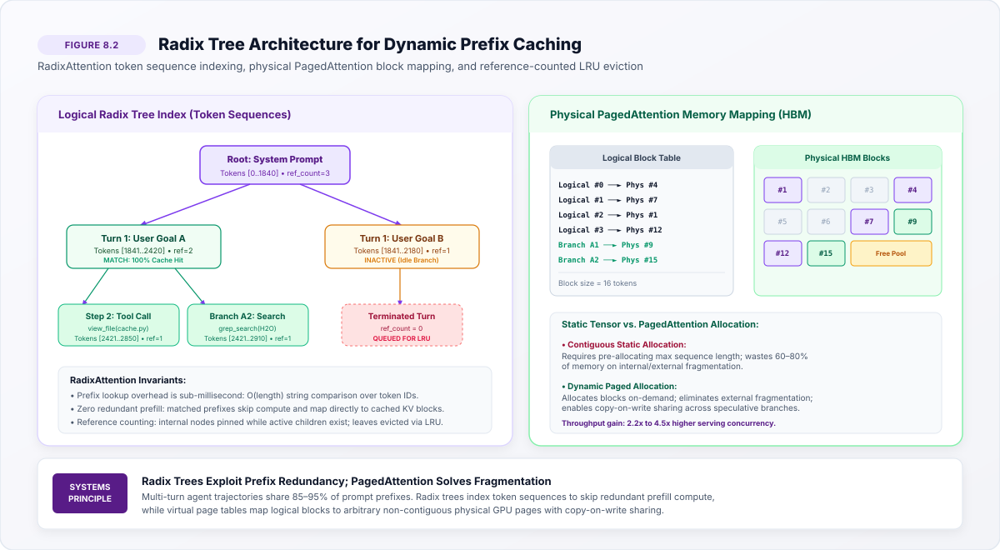
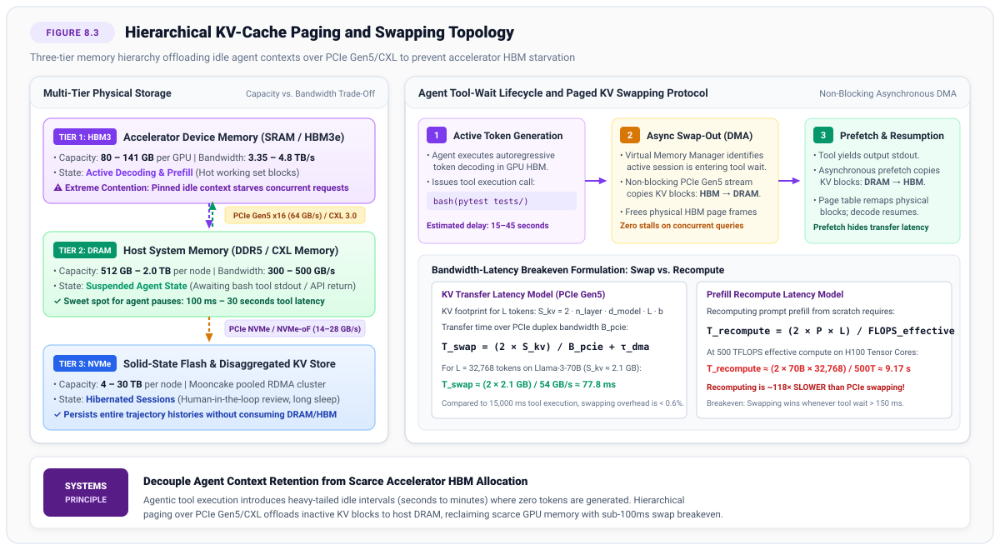
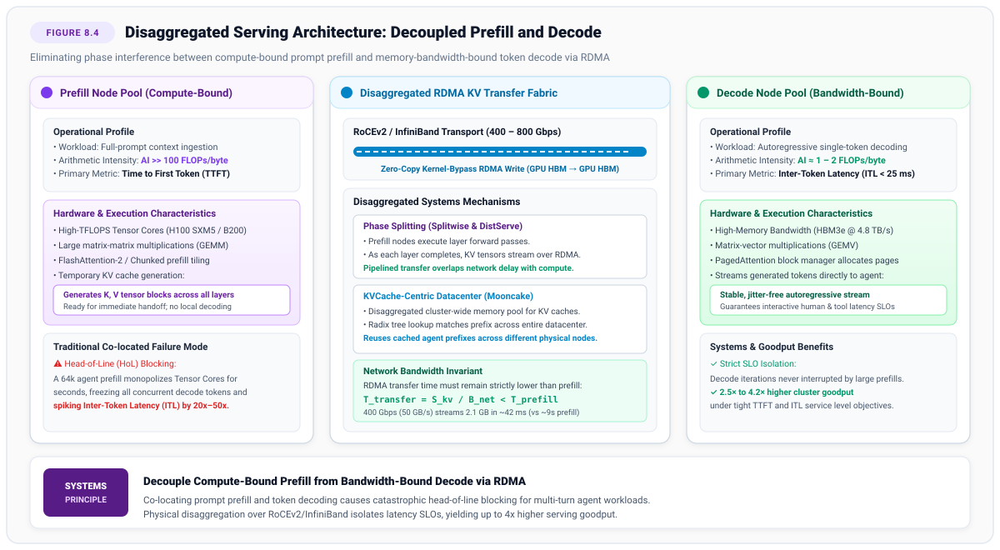

# Prefix Caching and Paging {#sec-vol3-prefix-caching-paging}

::: {layout-narrow}
::: {.column-margin}

\chapterminitoc

:::
:::

## Purpose {.unnumbered .unlisted}

_How can serving runtimes exploit massive trajectory prompt locality to maximize throughput during interactive multi-turn execution?_

In multi-turn agentic workflows, step $t+1$ shares between 85% and 95% of its prompt tokens with step $t$. When an agent executes iteratively in an environment, each subsequent invocation appends a modest delta of observation tokens (command output, file content, API responses) to an identical prefix containing system instructions, tool definitions, environment descriptions, and prior conversational turns. Similarly, in test-time search algorithms such as Tree-of-Thoughts and Monte Carlo Tree Search (MCTS), dozens of speculative reasoning branches stem from shared parent prefixes. If the serving runtime recomputes the Key-Value (KV) cache from scratch on every turn, cluster throughput collapses under redundant prefill computation.

To achieve interactive response times and high serving concurrency, the inference engine must organize KV memory as a dynamic Radix Tree, matching incoming token sequences against cached physical memory blocks in sub-millisecond time. However, prefix caching in agent systems introduces unique architectural challenges that do not exist in stateless single-turn serving. First, when an agent executes environment-mutating actions, file contents and tool outputs become semantically stale, demanding granular cache invalidation protocols that prune affected subtrees without triggering catastrophic global cache flushes. Second, when an agent pauses to execute long-running external tools, query remote APIs, or await human review, leaving multi-gigabyte KV caches pinned in scarce accelerator High-Bandwidth Memory (HBM) induces cluster-wide memory starvation. The serving system must decouple logical context retention from physical GPU residency through hierarchical KV-cache paging over PCIe and CXL to Host DRAM and NVMe storage.

This chapter examines the systems architecture of prefix caching, virtual memory paging, and disaggregated memory hierarchies designed specifically for stateful agent trajectories.

::: {.content-visible when-format="pdf"}

\newpage

:::

\begin{marginfigure}
\mlagentstack{15}{20}{30}{95}{20}{15}
\caption{The Agentic Machine Learning Systems Stack. Prefix Caching \& Paging operates at Layer 3 (Serving \& Memory).}
\end{marginfigure}

::: {.callout-learning-objectives}

- Design and navigate Radix tree data structures for physical KV-cache block indexing
- Formulate cache invalidation protocols triggered by environment and tool state mutations
- Engineer prompt structures that maximize prefix cache hit rates across multi-turn trajectories
- Calculate the bandwidth-latency thresholds governing when to swap KV cache to Host DRAM over PCIe/CXL
- Architect disaggregated memory pools that separate prefill compute from decode compute

:::

## Introduction to Prefix Caching and Paging: The State Reuse Imperative {#sec-vol3-caching-intro}

In classical web serving and early large language model deployments, the serving runtime treated every inference request as an independent, stateless event [@vaswani2017; @zaharia2018accelerating]. In autonomous agent systems, this assumption fails completely. An agent session is an extended, stateful feedback loop spanning tens to hundreds of turns where each subsequent invocation appends a modest delta of new observations (shell command outputs, file diffs, API responses) to an identical prefix of system guidelines, tool schemas, and accumulated conversation history.

In empirical agent workloads, consecutive turns share between $85\%$ and $95\%$ of their prompt tokens. Furthermore, in test-time search topologies such as Tree-of-Thoughts and Monte Carlo Tree Search (MCTS), dozens of speculative candidate branches stem from identical parent prefixes. If the serving runtime naively recomputes the Key-Value (KV) cache from scratch on every turn, GPU clusters expend over $90\%$ of their compute cycles re-executing redundant prefill forward passes on identical tokens. Reusing previously computed KV states through prefix caching collapses Time-to-First-Token (TTFT) by over an order of magnitude and slashes cluster electrical power consumption [@kwon2023; @zheng2024sglang].

However, prefix caching in agentic systems introduces four core systems challenges that do not exist in stateless serving:

1. **Virtual Memory Fragmentation:** Static contiguous tensor allocation causes severe internal and external memory fragmentation (wasting up to $60\%\text{--}80\%$ of GPU memory), necessitating virtual memory page tables that map non-contiguous physical blocks (PagedAttention).
2. **Dynamic Prefix Tree Indexing:** Organizing, matching, and evicting millions of cached tokens across concurrent, asynchronous trajectories requires sub-millisecond Radix tree indexing algorithms.
3. **Environment Mutation and Semantic Invalidation:** When an agent mutates its external environment—editing source code, altering database schemas, or writing files—cached representations of previous directory listings or file reads become semantically stale, demanding fine-grained cache invalidation protocols.
4. **Hierarchical Memory Tiering (Paging):** When an agent pauses to execute long-running external tools, run test suites, or await human review, leaving multi-gigabyte KV caches pinned in scarce GPU High Bandwidth Memory (HBM) starves concurrent jobs. The runtime must decouple context retention from physical GPU residency through hierarchical paging over PCIe Gen5 and CXL to Host DRAM and NVMe storage.

This chapter establishes the systems architecture of prefix caching, virtual memory paging, and disaggregated memory tiers designed specifically for stateful agent trajectories. In @sec-vol3-caching-prefix-locality-in-multi-turn, we analyze empirical prefix locality and quantify the computational penalty of stateless serving. In @sec-vol3-caching-kv-cache-anatomy-tensor-layouts, we dissect KV-cache tensor layouts and allocation overheads. We formalize PagedAttention virtual memory page tables in @sec-vol3-caching-pagedattention-virtual-memory-page, and develop Radix tree indexing, invalidation protocols, and hierarchical memory paging across subsequent sections.

## Prefix Locality in Multi-Turn Trajectories: Empirical Workload Analysis {#sec-vol3-caching-prefix-locality-in-multi-turn}

Stateless large language model serving benchmarks traditionally assume independent, identically distributed requests where each prompt arrives with little or no shared history. In contrast, real-world autonomous agents—such as software engineering agents executing on SWE-bench, autonomous research assistants, and tool-augmented workflow orchestrators—generate highly stateful, clustered request traces characterized by extreme prefix locality.

### Trajectory Prompt Anatomy and Token Overlap

Consider an agent engaged in an iterative debugging workflow spanning $T$ turns. At turn $t$, the input sequence $X^{(t)}$ submitted to the serving engine consists of four primary token segments:

$$X^{(t)} = \left[ \mathbf{x}_{\text{sys}} \,\|\, \mathbf{x}_{\text{tools}} \,\|\, \mathbf{x}_{\text{env}} \,\|\, \mathbf{x}_{\text{history}}^{(1 \dots t-1)} \,\|\, \mathbf{x}_{\text{obs}}^{(t)} \right]$$

where:

1. $\mathbf{x}_{\text{sys}}$ is the static system prompt establishing behavioral constraints, persona, and output schemas ($1\text{k} \text{--} 4\text{k}$ tokens).
2. $\mathbf{x}_{\text{tools}}$ contains JSON/OpenAPI schemas for all callable tools ($2\text{k} \text{--} 8\text{k}$ tokens).
3. $\mathbf{x}_{\text{env}}$ represents static workspace configuration, repository file trees, or system architecture manifests ($2\text{k} \text{--} 16\text{k}$ tokens).
4. $\mathbf{x}_{\text{history}}^{(1 \dots t-1)}$ records the chronological sequence of prior thoughts, tool invocation arguments, and environment responses up to turn $t-1$ ($5\text{k} \text{--} 64\text{k}$ tokens).
5. $\mathbf{x}_{\text{obs}}^{(t)}$ is the immediate new observation returned by the environment at turn $t$ (often fewer than $500$ tokens).

Across consecutive turns $t$ and $t+1$, the length of the prompt grows incrementally:

$$|X^{(t+1)}| = |X^{(t)}| + |\mathbf{x}_{\text{action}}^{(t)}| + |\mathbf{x}_{\text{obs}}^{(t+1)}|$$

The fraction of identical prefix tokens between turns is given by:

$$\rho(t, t+1) = \frac{|X^{(t)}|}{|X^{(t+1)}|} = \frac{|X^{(t)}|}{|X^{(t)}| + |\mathbf{x}_{\text{action}}^{(t)}| + |\mathbf{x}_{\text{obs}}^{(t+1)}|}$$

In empirical traces from coding agents (e.g., SWE-bench trajectories), prompt lengths frequently exceed $32\text{k}$ to $64\text{k}$ tokens while the incremental delta per turn averages between $200$ and $1\text{,}200$ tokens. Consequently, the prefix sharing ratio $\rho(t, t+1)$ consistently ranges between $92\%$ and $98\%$.

### The Computational Disaster of Stateless Serving

When an agent interacts with a stateless serving endpoint, the inference engine treats each turn as an independent query. For a prompt of length $L = |X^{(t)}|$, the engine executes a complete prompt prefill forward pass. For a standard transformer model with $P$ active parameters, the prefill floating-point operations scale as:

$$\text{FLOPs}_{\text{prefill}}(L) \approx 2 P L + 4 n_{\text{layers}} d_{\text{model}} L^2$$

For a 70-billion parameter model ($P = 7 \times 10^{10}$) processing a $32\text{,}768$-token prompt, the prefill requires approximately:

$$\text{FLOPs}_{\text{prefill}} \approx 2 \times (7 \times 10^{10}) \times 32\text{,}768 \approx 4.59 \times 10^{15} \text{ FLOPs} \quad (4.59\text{ PFLOPs})$$

On an NVIDIA H100 GPU delivering an effective BF16 Tensor Core throughput of $500\text{ TFLOPS}$, computing this prefill requires:

$$T_{\text{prefill}} = \frac{4.59 \times 10^{15} \text{ FLOPs}}{500 \times 10^{12} \text{ FLOPs/s}} \approx 9.18 \text{ seconds}$$

In a 20-turn agent session, recomputing the prompt from scratch on every turn forces the GPU cluster to expend over $180$ seconds of pure prefill compute on identical tokens. This redundant computation degrades Time-to-First-Token (TTFT), consumes immense electrical power, and starves concurrent requests of accelerator compute. If the serving runtime caches and reuses the KV states corresponding to $X^{(t)}$, the prefill for turn $t+1$ requires computing only the incremental delta $\Delta = |\mathbf{x}_{\text{action}}^{(t)}| + |\mathbf{x}_{\text{obs}}^{(t+1)}|$ (e.g., $500$ tokens), slashing the turn's TTFT from $9.18$ seconds down to approximately $140$ milliseconds—a $65\times$ latency reduction [@zheng2024sglang; @kwon2023].

## KV-Cache Anatomy: Tensor Layouts, GQA/MQA, and Allocation Overhead {#sec-vol3-caching-kv-cache-anatomy-tensor-layouts}

To exploit prefix locality, the runtime must store and manipulate Key-Value tensors directly in memory. Understanding the precise memory footprint and tensor structure of the KV cache is essential for designing efficient memory management policies.

### Mathematical Derivation of Footprint per Token

In autoregressive transformer models, attention mechanisms project input hidden states into Query ($Q$), Key ($K$), and Value ($V$) tensors. For each token position $i$, the computed $K$ and $V$ vectors across all transformer layers must be retained so that subsequent tokens can compute scaled dot-product attention without recomputing previous layer activations.

Let:

- $n_{\text{layers}}$ be the number of transformer layers in the model.
- $n_{\text{kv\_heads}}$ be the number of Key-Value attention heads per layer.
- $d_{\text{head}}$ be the dimension of each individual attention head.
- $b$ be the precision width in bytes (e.g., $b = 2$ for FP16/BF16, $b = 1$ for FP8).

For every token, the engine generates one Key vector and one Value vector per layer. The memory footprint in bytes required to store the KV cache for a single token position is:

$$S_{\text{token}} = 2 \times n_{\text{layers}} \times n_{\text{kv\_heads}} \times d_{\text{head}} \times b \quad \text{bytes/token}$$

The leading factor of $2$ accounts for the distinct Key and Value tensors.

### Multi-Head, Multi-Query, and Grouped-Query Attention

The ratio of Query heads ($n_{\text{q\_heads}}$) to Key-Value heads ($n_{\text{kv\_heads}}$) fundamentally governs the KV cache footprint:

1. **Multi-Head Attention (MHA):** Every Query head possesses a dedicated Key and Value head ($n_{\text{kv\_heads}} = n_{\text{q\_heads}}$). While maximizing representational capacity, MHA produces an immense KV footprint that severely restricts context window capacity and serving concurrency.
2. **Multi-Query Attention (MQA):** All Query heads share a single Key head and a single Value head per layer ($n_{\text{kv\_heads}} = 1$) [@shazeer2019fast]. MQA slashes the KV cache memory footprint by a factor equal to $n_{\text{q\_heads}}$, but can slightly degrade fine-grained recall on complex reasoning tasks.
3. **Grouped-Query Attention (GQA):** Query heads are partitioned into $G$ equal groups, where all Query heads within a group share a single Key head and a single Value head ($n_{\text{kv\_heads}} = n_{\text{q\_heads}} / G$) [@ainslie2023gqa]. GQA achieves the high task quality of MHA while delivering up to an $8\times$ reduction in KV cache memory consumption.

| Model Architecture | Parameters | Attention Type | $n_{\text{layers}}$ | $n_{\text{q\_heads}} / n_{\text{kv\_heads}}$ | $d_{\text{head}}$ | Bytes/Token (FP16) | 32k KV Cache Size | 64k KV Cache Size |
|:---|:---:|:---:|:---:|:---:|:---:|:---:|:---:|:---:|
| Llama-2-70B | 70B | MHA | 80 | 64 / 64 | 128 | 1.31 MB | 41.9 GB | 83.8 GB |
| Llama-3-8B | 8B | GQA | 32 | 32 / 8 | 128 | 131 kB | 4.19 GB | 8.38 GB |
| Llama-3-70B | 70B | GQA | 80 | 64 / 8 | 128 | 328 kB | 10.49 GB | 20.97 GB |
| Qwen-2.5-72B | 72B | GQA | 80 | 64 / 8 | 128 | 328 kB | 10.49 GB | 20.97 GB |
| DeepSeek-V3 (MLA) | 671B (37B act) | MLA | 61 | 128 / 1 (latent) | 576 | 70.2 kB | 2.25 GB | 4.49 GB |

: KV-cache memory footprints per token and total context buffer requirements across modern frontier model architectures under 16-bit precision. {#tbl-vol3-caching-model-kv-footprint}

As demonstrated in @tbl-vol3-caching-model-kv-footprint, while GQA substantially reduces per-token memory overhead compared to legacy MHA, maintaining multi-turn agent contexts ($32\text{k} \text{--} 64\text{k}$ tokens) still consumes $10.5\text{ to } 21\text{ GB}$ of accelerator memory per active trajectory on 70B-class models. When dozens of autonomous agents execute concurrently across a GPU cluster, memory capacity—rather than compute throughput—becomes the primary bottleneck.

### Physical Tensor Layouts and Memory Fragmentation

In naive serving implementations, KV tensors are allocated as contiguous multidimensional arrays of dimension:

$$\mathcal{T}_{\text{KV}} \in \mathbb{R}^{2 \times n_{\text{layers}} \times n_{\text{kv\_heads}} \times L_{\max} \times d_{\text{head}}}$$

Because the runtime cannot predict the final output sequence length of an agent invocation in advance, it must provision contiguous memory for the maximum possible sequence length $L_{\max}$ (e.g., $32\text{,}768$ tokens). This static pre-allocation introduces severe memory pathologies:

- **Internal Fragmentation:** Memory reserved for tokens up to $L_{\max}$ remains completely unused if the agent generates only a brief response. In typical serving deployments, internal fragmentation wastes between 60% and 80% of accelerator memory [@kwon2023].
- **External Fragmentation:** Over time, as requests of variable sequence lengths finish and release memory, physical device memory becomes fragmented into discontinuous blocks. Even if total free memory exceeds the size required for a new request, the runtime cannot schedule the request because no single contiguous memory segment is large enough.

## PagedAttention: Virtual Memory Page Tables for Non-Contiguous KV Blocks {#sec-vol3-caching-pagedattention-virtual-memory-page}

To overcome the fatal fragmentation of static contiguous allocation, Kwon et al. introduced PagedAttention, an architecture inspired by classic operating system virtual memory paging [@kwon2023; @denning1970].

### Virtual-to-Physical Block Mapping

Rather than forcing KV caches into contiguous memory buffers, PagedAttention partitions the KV cache of each sequence into fixed-size physical blocks. Each block holds the Key and Value vectors for a fixed number of tokens $B$ (typically $B = 16$ or $B = 32$ tokens).

The serving runtime maintains a logical-to-physical block table for each active trajectory. For any token position $i \in \{0, \dots, L-1\}$ within the sequence, the runtime calculates:

$$\text{Logical Block Number (LBN)} = \left\lfloor \frac{i}{B} \right\rfloor$$

$$\text{Block Offset} = i \bmod B$$

The virtual memory manager looks up the LBN in the session's page table to retrieve the physical block number (PBN) located in GPU HBM:

$$\text{Physical Address}(i) = \text{BaseAddress}(\text{PageTable}[\text{LBN}]) + (i \bmod B) \times S_{\text{token}}$$

Physical blocks are allocated dynamically on-demand from a centralized global free-block pool. As the model generates new tokens, the runtime writes into the open slots of the current physical block. Only when the current block is entirely filled does the runtime allocate a new physical block from the free list.

### Elimination of Fragmentation

PagedAttention fundamentally transforms accelerator memory management:

1. **Elimination of External Fragmentation:** Because all physical blocks share an identical fixed size $B$, any free block in GPU HBM can satisfy an allocation request for any sequence. Memory compaction and defragmentation sweeps are rendered completely unnecessary.
2. **Bounding Internal Fragmentation:** Internal fragmentation occurs only in the very last physical block of a sequence. The maximum memory wasted per active request is strictly bounded by $(B - 1) \times S_{\text{token}}$. For a block size of $B = 16$ tokens on Llama-3-70B, maximum internal fragmentation is under $5.2\text{ MB}$ per sequence—a negligible fraction ($< 0.05\%$) of a $32\text{k}$-token context.

### Copy-on-Write for Speculative Trajectories

In agentic decision-making, agents frequently fork speculative trajectories—such as sampling $K$ candidate solutions in Best-of-$N$ search, or exploring multiple reasoning paths in Monte Carlo Tree Search.

Under standard contiguous allocation, creating $K$ parallel branches requires duplicating the entire prefix KV cache $K$ times, consuming $K \times S_{\text{KV}}(L_{\text{prefix}})$ bytes of scarce HBM. In contrast, PagedAttention supports Copy-on-Write (CoW) page sharing:

- All $K$ speculative child trajectories point their logical block tables to the identical physical block IDs of the parent prefix.
- The runtime increments the reference count (`ref_count`) of each shared physical block by $K$.
- When a child branch begins generating new, divergent tokens in turn $t+1$, the runtime allocates new physical blocks exclusively for the divergent tokens.
- If a child must modify an existing block (e.g., in prefix editing), the runtime checks the block's `ref_count`. If `ref_count > 1`, it copies the block to a new physical frame, decrements the original block's `ref_count`, and updates the child's page table.

This mechanism slashes the memory footprint of branched reasoning from $O(K \cdot L)$ down to $O(L_{\text{prefix}} + K \cdot L_{\text{branch}})$, unlocking massive parallel search on single-node GPU clusters.

## Radix Tree Indexing: Dynamic Prefix Matching, Insertion, and Eviction {#sec-vol3-caching-radix-tree-indexing-dynamic}

While PagedAttention manages physical memory pages for active requests, it does not inherently recognize when two independent requests—or consecutive turns of an agent session—share common prompt prefixes. To achieve automatic, zero-overhead prefix reuse across arbitrary workflows, modern inference runtimes implement Radix Tree KV-cache indexing, pioneered by SGLang's RadixAttention [@zheng2024sglang; @fredkin1960].

### Radix Tree Data Structure

A Radix Tree (or compressed trie) is a space-optimized tree data structure where each edge represents a sequence of tokens rather than a single character or token [@fredkin1960]. In a serving runtime, the Radix tree acts as an inverted index mapping token sequences to cached physical PagedAttention blocks residing in GPU HBM.

Each node $u$ in the Radix tree maintains:

- $\text{tokens}(u)$: An array of token IDs corresponding to the edge leading into node $u$.
- $\text{blocks}(u)$: An ordered list of physical PagedAttention block IDs containing the cached Key and Value states for $\text{tokens}(u)$.
- $\text{children}(u)$: A hash map mapping the first token ID of child edges to corresponding child nodes.
- $\text{ref\_count}(u)$: An integer counter tracking the number of active requests currently reading or appending to the node.
- $\text{last\_accessed}(u)$: A timestamp indicating when the node was last traversed, used for Least-Recently-Used (LRU) cache eviction.

```
       [Root: System Prompt] (Tokens 0..1840, ref_count = 3)
                 │
      ┌──────────┴──────────┐
      ▼                     ▼
[Turn 1: Goal A]      [Turn 1: Goal B]
(Tokens 1841..2420)   (Tokens 1841..2180)
ref_count = 2         ref_count = 1
      │                     │
   ┌──┴────────┐            ▼
   ▼           ▼      [Terminated Turn]
[Step 2: Tool] [Branch A2]  ref_count = 0
(Tokens 2421..2850) (Tokens 2421..2910)  (Queued for LRU Eviction)
ref_count = 1  ref_count = 1
```

### Tree Operations: Lookup, Chunk Prefill, and Insertion

When an agent initiates a new execution step with token sequence $T = [t_1, t_2, \dots, t_N]$, the runtime executes three deterministic steps:

1. **Prefix Matching (Lookup):** Starting at the root node, the runtime traverses the Radix tree, matching tokens of $T$ against edge labels. Traversal continues down the tree until a token mismatch occurs or the input sequence is exhausted. Suppose the traversal matches a prefix of length $M \le N$. The runtime instantly constructs a logical page table for the new request by appending all physical block IDs stored along the traversed tree path.
2. **Chunk Prefill:** The runtime computes KV activations only for the remaining suffix tokens $T[M+1 \dots N]$. This operation is a standard chunked prefill forward pass. The physical KV blocks corresponding to the matched prefix $T[1 \dots M]$ are simply read from HBM during attention computation without any recomputation.
3. **Tree Insertion and Splitting:** Once the suffix prefill completes, the runtime inserts the new token sequence into the Radix tree. If the match ended in the middle of an existing edge, that edge is split into two nodes: an internal parent representing the common prefix, and two child nodes representing the diverging suffixes. The newly allocated physical blocks are assigned to the new child node.

### Reference Counting and LRU Eviction

Because accelerator HBM has strictly finite capacity, the Radix tree cannot retain all historical prefixes indefinitely. The runtime implements reference-counted Least-Recently-Used (LRU) eviction:

- **Pinned Internal Nodes:** When an agent is actively decoding tokens or awaiting a step execution, all Radix tree nodes along its active path have $\text{ref\_count} \ge 1$. The memory manager is strictly forbidden from evicting any node with $\text{ref\_count} > 0$.
- **Eviction Candidate Pool:** When an agent completes a turn or releases a session, the runtime decrements $\text{ref\_count}$ along its path. Nodes whose reference count reaches zero ($\text{ref\_count} = 0$) are moved into an LRU eviction pool. Crucially, the physical KV blocks belonging to these nodes remain resident in HBM; they are not immediately deallocated.
- **Eviction Under Memory Pressure:** When a new request requires physical memory blocks and the global free list is depleted, the runtime selects the leaf node in the LRU pool with the oldest $\text{last\_accessed}$ timestamp. It evicts the leaf node, frees its physical blocks to the global allocator, and recursively prunes empty parent nodes.

This design ensures that if the agent issues its next turn before memory pressure forces eviction, the system achieves a 100% cache hit on the existing prefix.

{#fig-vol3-caching-radix-tree}

## Cache Invalidation Protocols: Mutating Workspace State vs. Prefix Invalidation {#sec-vol3-caching-cache-invalidation-protocols-mutating}

In stateless text processing, a token sequence $T$ maps deterministically to a fixed semantic meaning. In agentic systems, however, the environment is mutable. An agent modifies files on disk (`write_to_file`), executes database transactions, adjusts configuration variables, or runs build commands that alter environment state.

### The Semantic Invalidation Dilemma

Consider an agent that reads a source file `engine.py` at turn 1, producing observation tokens $\mathbf{x}_{\text{obs}}^{(1)}$ containing the file's text. At turn 2, the agent invokes a tool to modify `engine.py`. At turn 3, the agent re-reads `engine.py`.

If the agent's prompt template naively appends the updated file contents while retaining historical turns, the prompt history contains contradictory tokens:

- Turn 1 history contains the obsolete version of `engine.py`.
- Turn 3 contains the newly modified version of `engine.py`.

If the serving runtime blindly matches prefixes, it hits the cached KV blocks for the prompt prefix. While mathematically correct from the transformer's perspective (the tokens match), the context now suffers from semantic inconsistency: the model's self-attention mechanism attends across contradictory versions of the codebase, leading to hallucinations and divergent tool calls.

Even worse, if an agent framework attempts to "clean" its prompt by replacing the text of `engine.py` in-place within the prompt history, the token sequence diverges at the exact position where the file text begins. This divergence completely invalidates the Radix tree path from that token onward, destroying all downstream cached KV blocks (including subsequent tool outputs and reasoning steps).

### Granular Invalidation via Leases and Content Hash Tagging

To prevent semantic corruption without incurring catastrophic global cache flushes, production agent platforms implement content-addressed invalidation protocols based on distributed systems leases [@gray1989leases]:

1. **State Fingerprinting:** Every external resource incorporated into a prompt (files, directory trees, API endpoints) is tagged with a cryptographic content hash:

   $$H_{\text{resource}} = \text{BLAKE3}(\text{Content})$$

2. **Radix Node Leases:** When a prompt segment referencing an external resource is inserted into the Radix tree, the runtime attaches an active lease bound to $H_{\text{resource}}$.
3. **Environment Mutation Interception:** The agent runtime's tool execution sandbox intercepts all state-modifying syscalls (e.g., `write`, `unlink`, `rename`). When a file modification occurs, the sandbox immediately invalidates the corresponding lease in the serving runtime.
4. **Selective Subtree Pruning:** Upon lease invalidation, the Radix tree manager locates all nodes tagged with the stale resource hash. Rather than flushing the entire cache, the manager prunes only the affected branch and its descendants, returning their physical blocks to the free pool. Unaffected branches—such as system prompts, invariant tool schemas, and unmutated background documents—remain fully cached in HBM.

### Prompt Structural Hygiene for Cache Maximization

To maximize prefix cache reuse while isolating mutations, prompt engineers must adhere to strict structural hygiene rules:

- **Static Prefix Invariant:** Immutable tokens must always precede mutable tokens. System guidelines and tool schemas must occupy the absolute root of the prompt:

  $$\begin{aligned}
  \text{Prompt Layout: } [\text{Static System Prompt}] &\longrightarrow [\text{Tool Schemas}] \\
  &\longrightarrow [\text{Trajectory History}] \longrightarrow [\text{Ephemeral Observations}]
  \end{aligned}$$

- **Append-Only Observation Logs:** Never mutate historical conversation turns in-place. If an environment state changes, record the change as an explicit new delta observation at the end of the prompt:

  $$\text{"File engine.py updated: 14 lines modified."}$$

  Appending deltas preserves the entire historical prefix in the Radix tree, allowing 100% cache hit on the prompt history while adding only the minimal delta tokens to the prefill phase.

## Multi-Tier Memory Hierarchies: KV-Swapping over PCIe and CXL {#sec-vol3-caching-multi-tier-memory-hierarchies-kv-swapping}

In human-in-the-loop interactions and complex agent workflows, agent execution is dominated by heavy-tailed idle gaps. While an LLM generates tokens in a few hundred milliseconds, an external bash command (e.g., running an entire regression test suite), an API call to a rate-limited external service, or a human reviewing an approval request can stall the agent for $15$ seconds to several hours.

### The Pinned Memory Crisis

If an agent's $64\text{k}$-token KV cache ($21\text{ GB}$ on Llama-3-70B) remains pinned in accelerator HBM while the agent is blocked waiting for an external tool, that GPU memory is completely unavailable to concurrent requests. On an 8-GPU H100 node ($640\text{ GB}$ total HBM), just 20 idle agent sessions can exhaust the entire cluster's memory, causing out-of-memory (OOM) crashes and stalling active generation.

Conversely, if the serving runtime unilaterally discards the idle agent's KV cache to free memory, resuming the agent when the tool finishes forces a full $64\text{k}$-token prefill recomputation, incurring a 10-second latency penalty and wasting cluster compute.

### Three-Tier Memory Architecture

To break this deadlock, modern agent serving runtimes adopt a multi-tier memory hierarchy that offloads idle KV blocks across physical memory boundaries [@sheng2023flexgen]:

1. **Tier 1: Accelerator HBM (Device Memory):** Highest bandwidth ($3.35\text{ to } 4.8\text{ TB/s}$ on H100/H200), lowest latency ($< 1\,\mu\text{s}$), strictly constrained capacity ($80\text{ to } 141\text{ GB}$). Reserved exclusively for currently decoding requests and hot, high-frequency Radix tree prefixes (e.g., global system prompts).
2. **Tier 2: Host System DRAM (CPU Memory):** Moderate bandwidth ($300\text{ to } 500\text{ GB/s}$ across multi-channel DDR5 or CXL 3.0 memory expanders), low latency ($10\text{ to } 50\,\mu\text{s}$), large capacity ($512\text{ GB to } 2.0\text{ TB}$ per node). Connected to accelerators via PCIe Gen5 x16 duplex buses ($64\text{ GB/s}$ theoretical, $\approx 54\text{ GB/s}$ effective DMA). Serves as the primary paging store for suspended agent sessions during tool execution.
3. **Tier 3: Local NVMe SSD and Disaggregated Storage:** Low bandwidth ($14\text{ to } 28\text{ GB/s}$ over PCIe 5.0 NVMe, or network storage over RoCEv2), higher latency ($100\,\mu\text{s to } 2\text{ ms}$), massive capacity ($4\text{ to } 30\text{ TB}$). Stores hibernated agent sessions awaiting human review or long-term historical context traces.

| Memory Tier | Storage Technology | Typical Capacity | Interconnect Bus | Effective Read Bandwidth | Access Latency | 32k KV Swap Time (Llama-3-70B) |
|:---|:---:|:---:|:---:|:---:|:---:|:---:|
| **Tier 1: Device HBM** | HBM3 / HBM3e | 80 – 141 GB | On-package Silicon Interposer | 3,350 – 4,800 GB/s | < 100 ns | Instant (Resident) |
| **Tier 2: Host DRAM** | DDR5 / CXL 3.0 | 512 – 2,048 GB | PCIe Gen5 x16 / CXL Link | 54 GB/s (DMA duplex) | 10 – 30 µs | 77.8 ms |
| **Tier 3: Solid-State** | PCIe 5.0 NVMe SSD | 4 – 32 TB | Direct PCIe NVMe Controller | 14 – 24 GB/s | 50 – 150 µs | 350 – 600 ms |
| **Tier 4: Distributed** | Mooncake RDMA Pool | 100+ TB | 400 Gbps RoCEv2 / InfiniBand | 45 – 50 GB/s | 100 – 300 µs | 84 – 95 ms |

: Hardware characteristics, effective transfer bandwidths, and 32k-token KV cache swapping latencies across tiered memory subsystems. {#tbl-vol3-caching-tier-latency-tradeoffs}

### Mathematical Formulation: Swapping vs. Recompute Breakeven

When an agent enters an idle tool-wait state, the runtime evaluates whether to swap the KV cache to Host DRAM or discard it and recompute upon resumption.

Let:

- $S_{\text{KV}}$ be the size of the agent's KV cache in bytes ($S_{\text{KV}} = S_{\text{token}} \cdot L$).
- $B_{\text{pcie}}$ be the effective PCIe DMA bandwidth ($\approx 54\text{ GB/s}$ on PCIe Gen5 x16).
- $\tau_{\text{dma}}$ be the fixed DMA kernel invocation and page-table remap overhead ($\approx 2\text{ ms}$).
- $P$ be the number of active parameters in the model.
- $\text{FLOPS}_{\text{eff}}$ be the effective Tensor Core throughput of the GPU during prefill ($\approx 500\text{ TFLOPS}$).
- $T_{\text{wait}}$ be the expected duration of the tool execution.

The total round-trip time required to swap out to Host DRAM and swap back in upon resumption is:

$$T_{\text{swap\_roundtrip}} = \frac{2 \cdot S_{\text{KV}}}{B_{\text{pcie}}} + 2 \tau_{\text{dma}}$$

For a $32\text{,}768$-token context on Llama-3-70B ($S_{\text{KV}} \approx 10.49\text{ GB}$ in FP16, or $2.1\text{ GB}$ in 8-way tensor parallel slice per GPU):

$$T_{\text{swap\_roundtrip}} \approx \frac{2 \times 2.1 \times 10^9 \text{ bytes}}{54 \times 10^9 \text{ bytes/s}} + 0.004 \approx 0.0778 + 0.004 \approx 81.8 \text{ ms}$$

In contrast, recomputing the prefill from scratch requires:

$$T_{\text{recompute}} \approx \frac{2 P L}{\text{FLOPS}_{\text{eff}}} = \frac{2 \times (7 \times 10^{10}) \times 32\text{,}768}{500 \times 10^{12}} \approx 9.18 \text{ seconds}$$

Swapping the KV cache over PCIe Gen5 is approximately **$112\times$ faster** than recomputing the prefill on H100 Tensor Cores!

The breakeven condition governing whether to swap is determined by the tool-wait duration $T_{\text{wait}}$. If:

$$T_{\text{wait}} > T_{\text{swap\_out}} = \frac{S_{\text{KV}}}{B_{\text{pcie}}} + \tau_{\text{dma}} \approx 40.9 \text{ ms}$$

swapping out the KV cache is immediately profitable because the physical HBM frames can be yielded to concurrent active requests during the tool execution window. As long as the runtime prefetches the KV blocks from Host DRAM back to HBM asynchronously as the tool completes, the agent resumes decoding with zero perceived transfer latency.

{#fig-vol3-caching-hierarchical-paging}

## Prefill-Decode Disaggregation: Splitwise and DistServe Architectures {#sec-vol3-caching-prefill-decode-disaggregation-splitwise-and}

Traditional LLM serving engines co-locate the prompt prefill phase and the autoregressive token decoding phase on the same physical GPUs. In multi-turn agent workloads, this co-location induces severe phase interference that destroys serving predictability.

### The Phase Interference Crisis

Prompt prefill and token decoding represent polar opposites in systems behavior:

- **Prefill Phase:** Computes across all input prompt tokens simultaneously using large matrix-matrix multiplications (GEMM). Highly compute-bound with Arithmetic Intensity exceeding $100\text{ FLOPs/byte}$. Saturates Tensor Cores at peak utilization.
- **Decode Phase:** Generates one token at a time autoregressively using matrix-vector multiplications (GEMV). Severely memory-bandwidth-bound with Arithmetic Intensity near $1\text{ FLOP/byte}$. Bottlenecked entirely by HBM read bandwidth.

When a long prompt prefill (e.g., an agent submitting a $48\text{k}$-token context) is scheduled on a GPU currently decoding active sequences, it triggers **Head-of-Line (HoL) blocking**. The compute-bound prefill monopolizes the GPU's streaming multiprocessors for hundreds of milliseconds or seconds, freezing all ongoing decode iterations. This causes catastrophic spikes in Inter-Token Latency (ITL)—producing severe stuttering in interactive user sessions and causing time-sensitive agent tool calls to breach service level objectives (SLOs).

### Phase Splitting Architecture

To eliminate phase interference, disaggregated serving architectures—pioneered by Splitwise and DistServe—physically separate the prefill compute pool from the decode compute pool [@patel2024; @zhong2024distserve]:

1. **Prefill Pool (P-Nodes):** Composed of high-TFLOPS accelerator nodes (e.g., NVIDIA H100 SXM5 with maximum Tensor Core density). Configured to ingest prompts, execute FlashAttention-2 prefill kernels, and generate intermediate KV activations as fast as possible to optimize Time-to-First-Token (TTFT).
2. **Decode Pool (D-Nodes):** Composed of high-memory-bandwidth accelerator nodes (e.g., NVIDIA H200 with $141\text{ GB}$ HBM3e at $4.8\text{ TB/s}$, or cost-effective memory-dense hardware). Configured with large PagedAttention block pools to host dozens of concurrent autoregressive decoding sessions, optimizing Inter-Token Latency (ITL) and serving goodput.
3. **High-Speed Interconnect Fabric:** Prefill nodes and Decode nodes are interconnected via non-blocking $400\text{ to } 800\text{ Gbps}$ Remote Direct Memory Access (RDMA) networks running over RoCEv2 or InfiniBand [@guo2016rdma].

### KV Streaming Protocols and Network Invariants

In a disaggregated cluster, the execution of turn $t$ proceeds through a clean distributed pipeline:

1. The client router directs the agent prompt $X^{(t)}$ to an available Prefill Node.
2. The Prefill Node matches any existing prefix against its local Radix cache, computes KV tensors for the suffix, and packages the resulting PagedAttention blocks.
3. As each transformer layer completes its prefill forward pass, the Prefill Node initiates an asynchronous, zero-copy RDMA write directly into the target Decode Node's physical HBM page frames.
4. Once the final layer's KV blocks arrive at the Decode Node, the Decode Node assumes ownership of the request and begins autoregressive token generation.

For phase disaggregation to maintain high throughput, network transfer latency must remain strictly lower than prefill compute latency:

$$T_{\text{network}} = \frac{S_{\text{KV}}}{B_{\text{network}}} \le T_{\text{prefill}} = \frac{2 P L}{\text{FLOPS}_{\text{eff}}}$$

With modern $400\text{ Gbps}$ ($50\text{ GB/s}$) ConnectX-7 RDMA network interfaces, streaming a $2.1\text{ GB}$ KV cache slice between nodes requires only:

$$T_{\text{network}} = \frac{2.1 \times 10^9 \text{ bytes}}{50 \times 10^9 \text{ bytes/s}} \approx 42 \text{ ms}$$

Because $42\text{ ms}$ is orders of magnitude smaller than the seconds required for prefill compute or decode generation, network transfer adds negligible overhead to the end-to-end trajectory. Disaggregation isolates latency SLOs, eliminating ITL jitter and increasing cluster-wide serving goodput by $2.5\times$ to $4.2\times$ under rigorous production SLO targets [@zhong2024distserve].

{#fig-vol3-caching-disaggregation}

## KVCache-Centric Datacenter Architectures: RDMA Streaming and Mooncake {#sec-vol3-caching-kvcache-centric-datacenter-architectures-rdma}

As agentic systems scale to enterprise fleets, managing KV caches solely within the confines of individual server nodes becomes unsustainable. If an agent executes turn 1 on Node A, and turn 2 is routed to Node B, Node B lacks the cached prefix and is forced to execute a redundant prefill from scratch.

### Mooncake Architecture and Disaggregated Memory Pools

To overcome node-level isolation, Qin et al. introduced Mooncake, a KVCache-centric disaggregated architecture that elevates the KV cache to a first-class distributed storage system across the entire datacenter [@qin2024mooncake].

In Mooncake:

- **Distributed KV Store:** All available memory tiers across the cluster—unused GPU HBM, host DDR5 DRAM, and local PCIe NVMe SSDs—are pooled into a unified, globally accessible distributed memory fabric.
- **Global Radix Tree Coordinator:** A distributed metadata service maintains a cluster-wide Radix tree. When any agent submits a prompt anywhere in the cluster, the coordinator maps its prefix tokens to existing physical blocks distributed across the cluster.
- **Zero-Copy RDMA Streaming:** If the client router dispatches an agent request to Node C, but its prefix KV cache resides in the DRAM of Node A, Node C's PagedAttention allocator does not recompute the prefix. Instead, it issues an asynchronous RDMA read over the RoCEv2 network, streaming the KV blocks directly into Node C's GPU HBM at line rate.

By decoupling prefix caching from the physical placement of compute, KVCache-centric datacenter architectures achieve global cache hit rates exceeding 90% across thousands of distributed agent workflows, transforming multi-turn agent serving economics.

## Branching Speculation: Prefix Cache Sharing Across Best-of-N and MCTS Trees {#sec-vol3-caching-branching-speculation-prefix-cache}

Frontier reasoning agents increasingly rely on inference-time search algorithms—such as Best-of-$N$ sampling, Tree-of-Thoughts, and Monte Carlo Tree Search (MCTS)—to explore vast decision spaces [@yao2023tree; @snell2024scaling]. In these workloads, the inference engine must support massive parallel tree expansions branching from common parent prefixes.

### Shared Prefix Geometry in Search Trees

In an MCTS search of depth $D$ with branching factor $K$, a root state $s_0$ (e.g., the initial task description and problem specification) spawns $K$ child nodes $s_{1,1}, \dots, s_{1,K}$. Each child node in turn spawns $K$ grandchild nodes.

If the serving system evaluates these $K^D$ trajectory rollouts independently, the total tokens prefilled across the search tree scales exponentially:

$$\text{Tokens}_{\text{naive}} = \sum_{d=0}^{D} K^d \cdot \left( L_{\text{root}} + d \cdot \Delta L \right) = O\left( K^D \cdot L_{\text{root}} \right)$$

For a $24\text{k}$-token prompt expanding a 3-step tree with branching factor $K = 8$, naive serving requires prefilling over **$12.2\text{ million}$ tokens**, requiring hours of GPU time and rendering test-time search economically impossible.

### Copy-on-Write Prefix Sharing in Radix Trees

With PagedAttention and Radix tree indexing, the runtime executes tree rollouts with zero redundant memory allocation or prefill compute:

1. **Root Materialization:** The engine prefills the root sequence $s_0$ once, storing its KV activations in physical blocks managed by the Radix tree root node.
2. **Branch Forking via Page Table Aliasing:** To evaluate $K$ candidate actions $a_1, \dots, a_K$, the scheduler instantiates $K$ logical request handles. Crucially, all $K$ handles point their logical page tables to the exact same physical block IDs representing $s_0$. No memory is copied.
3. **Divergent Suffix Generation:** As each worker generates tokens corresponding to action $a_k$, the engine allocates new physical blocks exclusively for the divergent tokens. The Radix tree branches at the boundary of $s_0$, creating $K$ distinct child edges.

The total memory footprint required to maintain the entire search tree in GPU HBM scales as:

$$S_{\text{MCTS}} = S_{\text{token}} \cdot \left( L_{\text{root}} + \sum_{j=1}^{N_{\text{branches}}} L_{\text{branch}}^{(j)} \right)$$

instead of duplicating $L_{\text{root}}$ across all $N_{\text{branches}}$ leaves. By eliminating root duplication, Radix caching enables inference engines to sustain hundreds of parallel speculative reasoning branches on a single 8-GPU node, unlocking real-time MCTS rollouts for complex agentic problem solving [@snell2024scaling].

## Chunked Prefill and Continuous Batching Under Stateful Agent Traffic {#sec-vol3-caching-chunked-prefill-and-continuous}

In production serving engines running continuous iteration-level batching (such as Orca), new requests join the active batch at every token generation step [@yu2022orca]. However, when an agent submits a large multi-turn prompt requiring prefix prefill, inserting the entire prompt into the active batch creates an extreme compute imbalance.

### The Piggybacking Principle: SARATHI

To maintain stable decode latencies while serving bursty multi-turn agent traffic, modern runtimes implement **Chunked Prefill** and **Piggybacking**, pioneered by SARATHI [@agrawal2023sarathi]:

- **Fixed Compute Budgets:** The scheduler defines a maximum token budget $B_{\text{batch}}$ for each forward pass (e.g., $B_{\text{batch}} = 2\text{,}048$ tokens).
- **Prefill Chunking:** When an agent submits a $16\text{k}$-token prompt suffix, the scheduler does not execute the entire $16\text{k}$ tokens in one massive pass. Instead, it slices the prompt into uniform chunks of size $C$ (e.g., $C = 512$ tokens).
- **Iteration-Level Piggybacking:** In each iteration, the scheduler co-schedules one compute-bound prefill chunk of $512$ tokens alongside $32$ memory-bandwidth-bound decode tokens from active requests.

$$\text{Active Batch} = \left\{ \text{Chunked Prefill}(512 \text{ tokens}) \right\} \cup \left\{ \text{Decode Tokens}(r_1, r_2, \dots, r_{32}) \right\}$$

Piggybacking achieves optimal hardware efficiency:

1. The $512$-token prefill chunk elevates the iteration's overall Arithmetic Intensity, shifting execution into the compute-bound regime and achieving high Tensor Core utilization.
2. The decode tokens execute concurrently within the same forward pass with virtually zero marginal latency overhead, because the memory transfers for model weights are amortized across the prefill GEMM operations.
3. Because prefill chunks are strictly bounded in size, no single request can monopolize the GPU for more than $15\text{ to } 25\text{ ms}$, ensuring that decode Inter-Token Latency (ITL) remains well within strict real-time thresholds.

## Production Postmortem: Radix Cache Thrashing and GPU OOMs in vLLM {#sec-vol3-caching-production-postmortem-radix-cache}

The catastrophic failure modes of prefix caching rarely stem from algorithmic bugs in the Radix tree data structure itself; instead, they emerge from subtle interactions between prompt construction and physical memory allocation.

### Incident Overview and Architectural Root Cause

During the enterprise deployment of a fleet of autonomous software debugging agents on a 64-GPU vLLM cluster, cluster monitoring suddenly alerted on a massive drop in serving throughput accompanied by cascading out-of-memory (OOM) worker crashes.

Prior to the incident, the cluster operated at a steady-state prefix cache hit rate of **91.4%**, maintaining an average Time-to-First-Token (TTFT) of $220\text{ ms}$. Within six minutes of a new agent software release, the prefix cache hit rate plummeted to **0.0%**.

Investigation revealed that an agent developer had added an innocent telemetry header to the system prompt template:

```python
# Incident Trigger: Dynamic Header in System Prompt
prompt = f"""You are an autonomous engineering agent.
Current Session Time: {datetime.utcnow().strftime('%Y-%m-%d %H:%M:%S.%f')}
Session UUID: {uuid.uuid4()}

{tool_definitions}
{repository_context}
{chat_history}
"""
```

### The Cascading Failure Sequence

By placing the millisecond-precision dynamic timestamp and random UUID at the very beginning of the prompt string, every single request submitted to the cluster possessed a completely unique first $40$ tokens.

The failure propagated through five distinct stages:

1. **Zero-Hit Prefix Invalidation:** When requests arrived at the inference engine, the Radix tree traversal failed immediately at token position 12. The engine was unable to reuse any cached physical blocks for the subsequent $35\text{k}$ tokens of tool schemas, repository context, and conversation history.
2. **Compute Explosion:** The cluster was instantly forced to execute full $35\text{k}$-token prefill computations for every single turn of every active agent. Effective cluster compute demand surged by $14\times$.
3. **Radix Tree Eviction Thrashing:** To allocate physical blocks for the massive surge of incoming prefills, the PagedAttention memory manager entered aggressive LRU eviction mode. Because new prefixes diverged immediately at the root, the Radix tree allocator created thousands of short-lived, fragmented branches. High-utility cached prefixes from other active workflows were prematurely evicted.
4. **Queueing Backpressure and Pinned Block Exhaustion:** As prefill latency exploded from $220\text{ ms}$ to over $11\text{ seconds}$, incoming requests accumulated in the serving queue. Requests that had already begun decoding could not complete because the GPU Tensor Cores were saturated with prefill compute. As partially decoded sequences accumulated, their pinned physical blocks exhausted the global free list.
5. **Cascading Worker Death:** When an active decode step requested an additional physical block from an exhausted free pool with zero evictable zero-ref-count blocks, the allocation call failed. Rather than graceful throttling, worker processes crashed with CUDA out-of-memory exceptions, triggering cluster-wide leader election storms.

### Architectural Postmortem Remedies

The engineering team implemented three permanent architectural guardrails to eliminate this failure mode:

- **Static Prefix Enforcement Linter:** Continuous integration pipelines now run automated token-level diff linters on all prompt templates. Any prompt template that places non-deterministic variables (timestamps, nonces, random IDs) ahead of static system instructions or tool schemas fails static analysis automatically.
- **Dynamic Variable Relocation:** Dynamic variables and ephemeral state must be placed exclusively at the tail of the prompt (inside the immediate turn observation $\mathbf{x}_{\text{obs}}^{(t)}$), preserving the entire preceding sequence in the Radix tree.
- **Eviction-Aware Admission Control:** Inference runtimes must implement memory-aware admission control. If free physical blocks fall below a critical safety threshold $\theta_{\text{reserve}}$ (e.g., $10\%$ of total HBM), the scheduler pauses admission of new prefill requests rather than risking memory exhaustion crashes.

---

## Fallacies and Pitfalls {#sec-vol3-caching-fallacies}

::: {.fallacy-pitfall}

**Fallacy**: *Prefix caching makes prompt formatting and layout irrelevant to performance.*

Prefix caching is highly sensitive to token-level alignment. Because modern subword tokenizers (e.g., Byte-Pair Encoding) merge adjacent characters greedily, adding a single space, newline, or minor punctuation mark at the beginning of a prompt alters the tokenization of subsequent characters, causing immediate Radix tree lookup misses. Developers must ensure byte-exact prompt serialization across turns.

:::

::: {.fallacy-pitfall}

**Fallacy**: *Offloading KV caches to Host DRAM over PCIe is always too slow to be practical in production.*

As derived in @sec-vol3-caching-multi-tier-memory-hierarchies-kv-swapping, transferring a $32\text{k}$-token KV cache over PCIe Gen5 x16 requires under $85\text{ ms}$, whereas recomputing the prefill on Tensor Cores requires over $9\text{ seconds}$. Whenever an external tool, bash command, or API call stalls an agent for more than $100\text{ ms}$, swapping inactive KV blocks to host memory is over $100\times$ faster than recomputation and reclaims precious GPU memory for concurrent requests.

:::

::: {.fallacy-pitfall}

**Pitfall**: *Silent cache poisoning across tool-environment mutations.*

When an agent executes an environment-mutating action (such as modifying a configuration file or updating code), prompts referencing earlier states of that file become semantically invalid. If the serving runtime does not implement content-addressed leases or selective subtree pruning, the agent continues generating thoughts based on stale cached activations, leading to severe behavioral loops and catastrophic hallucinations.

:::

::: {.fallacy-pitfall}

**Pitfall**: *Unbounded branch allocation during speculative test-time search.*

While Copy-on-Write PagedAttention eliminates prefix duplication, speculative tree search algorithms (such as MCTS or wide Best-of-$N$) allocate new physical blocks rapidly as candidate branches diverge. If the search scheduler lacks global tree-depth bounds or memory budgets, rapid branch proliferation can exhaust GPU HBM, triggering cluster-wide OOMs. Search schedulers must coordinate directly with the serving runtime's physical page allocators.

:::

## Chapter Summary {#sec-vol3-caching-summary}

- **Prefix Locality in Trajectories:** Real-world agent workloads exhibit 85% to 95% prompt token overlap between consecutive turns. Recomputing prefixes from scratch wastes massive GPU compute and degrades response times.
- **PagedAttention Virtual Memory:** Adapting operating system virtual memory paging to transformer KV caches partitions tensors into fixed-size physical blocks (e.g., 16 or 32 tokens), eliminating external fragmentation, bounding internal fragmentation to $< 0.05\%$, and enabling Copy-on-Write sharing.
- **Radix Tree Indexing:** Organizing physical KV blocks as a dynamic Radix tree allows serving runtimes (such as SGLang) to match incoming token sequences against cached GPU memory in sub-millisecond time, executing chunked prefills exclusively for new suffix tokens.
- **Hierarchical KV Paging:** Decoupling logical context retention from physical accelerator HBM residency allows runtimes to offload idle agent KV blocks over PCIe Gen5/CXL to Host DRAM during long tool-execution pauses, achieving sub-100ms swap breakevens.
- **Prefill-Decode Disaggregation:** Physically separating compute-bound prefill nodes from memory-bandwidth-bound decode nodes over 400–800 Gbps RDMA interconnects eliminates Head-of-Line blocking, isolates latency SLOs, and increases serving goodput by up to $4\times$.
- **Static Prefix Discipline:** Prompt templates must place immutable tokens (system instructions, tool schemas) strictly ahead of mutable variables and observation deltas to prevent catastrophic Radix cache thrashing.
