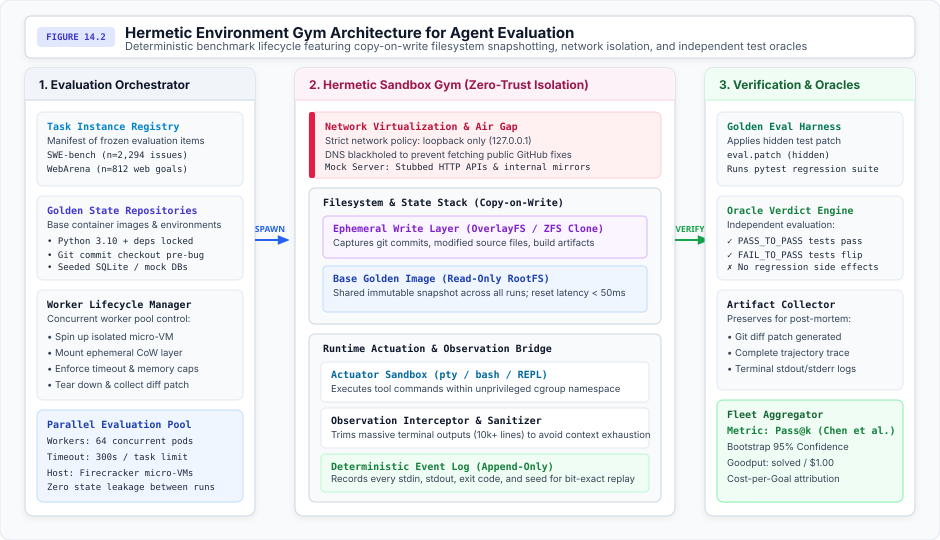
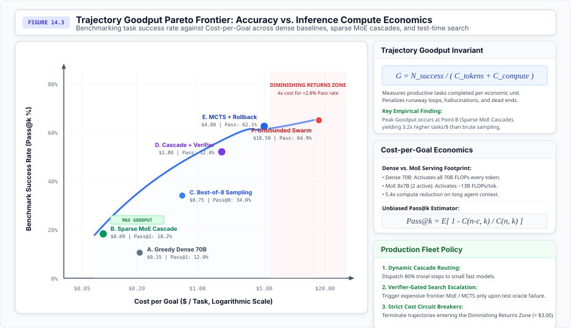
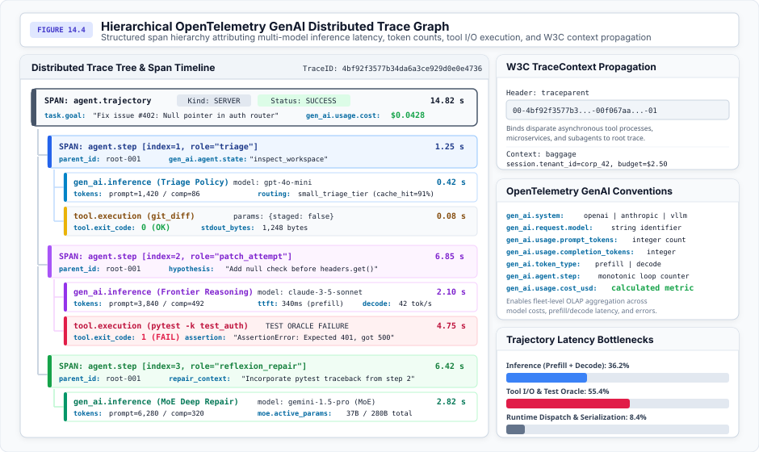

# Telemetry, Distributed Tracing, and Trajectory Benchmarking {#sec-vol3-telemetry-evaluation}

::: {layout-narrow}
::: {.column-margin}

\chapterminitoc

:::
:::

## Purpose {.unnumbered .unlisted}

_How do we trace, debug, and systematically benchmark non-deterministic agent trajectories across long horizons and dynamic software environments?_

Debugging a deterministic program is well understood. Decades of systems engineering have produced robust tools: symbolic debuggers (GDB), call-stack backtraces, core dumps, and deterministic execution profiles. In contrast, debugging an agentic trajectory that fails at Step 47 only $5\%$ of the time is a fundamentally new systems challenge. Non-determinism arises from multiple layers: stochastic temperature sampling ($T > 0$), floating-point non-associativity across parallel CUDA warp reductions, asynchronous tool network latencies, and mutating external environment states. When an autonomous agent degrades into an unrecoverable hallucination loop or executes a destructive database mutation, dumping 500,000 raw prompt tokens into flat log files provides zero causal diagnostic power.

In production fleets, reliability and scalability demand robust systems:

- **Deterministic Trace Reconstructibility**: Capturing all non-deterministic interactions across the environment boundary into immutable event-sourced streams.
- **Structured Distributed Tracing**: Conforming to the OpenTelemetry GenAI Semantic Conventions, binding multi-model inferences, token consumption, tool execution latencies, and monetary costs into unified causal Directed Acyclic Graphs (DAGs).
- **Hermetic Execution Gyms**: At the evaluation layer, static datasets such as Massive Multitask Language Understanding (MMLU) and GSM8K have collapsed. Agentic systems must be benchmarked inside reproducible execution gyms (SWE-bench, WebArena).
- **Statistical Trajectory Metrics**: Evaluating across stochastic distributions using unbiased Pass@$k$ estimators, Trajectory Goodput ($G$), and sequential statistical release gates.

::: {.content-visible when-format="pdf"}

\newpage

:::

\begin{marginfigure}
\mlagentstack{95}{30}{25}{30}{20}{20}
\caption{The Agentic Machine Learning Systems Stack. Telemetry, Distributed Tracing, and Benchmarking operates at Layer 6 (Fleet \& Assurance).}
\end{marginfigure}

::: {.callout-learning-objectives}

### In this chapter, you will learn:

- Why static question-answering benchmarks collapse for agents, establishing the necessity of interactive, hermetic execution gyms.
- The systems architecture of hermetic environment sandboxes featuring copy-on-write (CoW) filesystem snapshotting, network isolation, and independent test oracles.
- The mathematical derivation of the unbiased Pass@$k$ estimator and the Trajectory Goodput ($G$) invariant across dense and Mixture-of-Experts (MoE) model serving backends.
- How to quantify statistical power and construct non-parametric bootstrap confidence intervals under hardware and algorithmic non-determinism.
- The OpenTelemetry GenAI span hierarchy for distributed tracing across multi-turn agent trajectories, tools, and subagents.
- Mechanisms for W3C TraceContext propagation across asynchronous job queues and stochastic search trees.
- The architecture of deterministic event-sourcing and time-travel debuggers supporting state rewind, observation diffing, and counterfactual branch forking.
- Trajectory latency profiling and Amdahl's Law decomposition across model prefill, autoregressive decode, and blocking tool I/O.
- Automated causal fault localization via contrastive trace diffing and delta debugging on agent context.
- Continuous integration pipelines utilizing Sequential Probability Ratio Testing (SPRT) and supervisory human-in-the-loop observability.

:::

## Observability in Stochastic Runtimes {#sec-vol3-telemetry-intro}

Deploying autonomous agentic systems into mission-critical production environments mandates two tightly coupled systems capabilities: **observability** (reconstructing what an agent did, why it chose specific actions, and where latency or dollar costs accumulated) and **evaluation** (rigorously quantifying whether an agent accomplishes complex, multi-step goals across non-deterministic environments).

In classical distributed microservices, observability relies on request-scoped tracing (e.g., standard Jaeger spans) and infrastructure metric counters. In classical machine learning, evaluation relies on static test sets scored against fixed ground-truth labels. In an agentic systems regime, both classical paradigms completely collapse:

1. **The Observability Crisis:** When an autonomous coding agent degrades into an infinite retry loop or executes a destructive database query at Step 47 only $5\%$ of the time, dumping 500,000 raw prompt tokens into flat log files provides zero causal diagnostic clarity. Stochastic token sampling, floating-point non-associativity across parallel GPU warps, and asynchronous tool network delays produce non-deterministic execution paths that cannot be debugged with traditional stack traces.
2. **The Evaluation Crisis:** Static datasets (such as MMLU, GSM8K, and HumanEval) measure single-step, feedforward pattern matching without environment feedback. They suffer from severe pretraining data contamination, reward prompt-engineering shortcuts, and fail to measure whether a model can navigate dynamic operating system shells, compiler diagnostics, and cascading real-world failures.

To establish robust engineering control over autonomous fleets, systems architects must bind telemetry, distributed tracing, and trajectory benchmarking into a unified systems discipline:

- **Hierarchical Distributed Tracing:** Implementing the OpenTelemetry GenAI Semantic Conventions to organize multi-turn agent steps, subagent delegations, tool invocations, and model generations into structured, causal DAGs.
- **Deterministic Event Sourcing and Time-Travel Debugging:** Intercepting all external environment interactions into immutable event logs to support bit-exact offline replay, state rewinding, and counterfactual branch forking.
- **Hermetic Execution Gyms:** Evaluating agents inside isolated, reproducible execution sandboxes (such as SWE-bench and WebArena) featuring Copy-on-Write (CoW) filesystems and independent test oracles.
- **Statistical Trajectory Metrics:** Scoring non-deterministic systems using unbiased Pass@$k$ estimators, Trajectory Goodput ($G$), and Sequential Probability Ratio Testing (SPRT) release gates.

This chapter establishes the systems architecture of telemetry, distributed tracing, and empirical benchmarking for autonomous agents. In @sec-vol3-telemetry-the-collapse-of-static, we dissect why static benchmarks fail and establish the necessity of closed-loop evaluation. In @sec-vol3-telemetry-hermetic-environment-gyms, we examine the systems architecture of hermetic environment gyms. We formulate trajectory metrics (Pass@$k$ and Goodput) in @sec-vol3-telemetry-trajectory-metrics-pass-k, analyze statistical power under non-determinism in @sec-vol3-telemetry-statistical-significance-under-non-determinism, and develop distributed tracing, deterministic recording, time-travel debugging, and automated causal fault localization across the subsequent sections.

## The Collapse of Static Benchmarks {#sec-vol3-telemetry-the-collapse-of-static}

For the first decade of modern deep learning, machine learning evaluation was dominated by static, feedforward datasets. Benchmarks such as ImageNet, GLUE, SQuAD, MMLU, and GSM8K evaluated models on isolated input-output pairs: a fixed context $x$ was fed into model $f_\theta(x)$, and the resulting prediction $\hat{y}$ was scored against a static ground-truth label $y$. In an agentic systems regime, this static paradigm collapses entirely.

### Goodhart's Law and pretraining contamination

Static benchmarks suffer from Goodhart's Law: *"When a measure becomes a target, it ceases to be a good measure."* Because static datasets consist of fixed text strings hosted on public repositories, they inevitably leak into web-scale pretraining crawls. As demonstrated by @card2020little, data contamination creates an illusion of high-level reasoning when models are merely performing verbatim memorization of test-set solutions.

Furthermore, static benchmarks reward prompt-engineering shortcuts. In multiple-choice benchmarks like MMLU, models can achieve high scores by exploiting token-likelihood biases, length heuristics, and option-order artifacts without developing robust planning or error-recovery capabilities. Once deployed into an external environment where questions are not multiple-choice and solutions require executing multistep shell commands, model performance degrades precipitously.

### Absence of environmental feedback and state mutations

The fatal limitation of static evaluation is its open-loop nature. An autonomous agent is fundamentally a closed-loop control system operating within an external environment $\mathcal{E}$. In an agentic trajectory $\tau = (s_0, a_0, o_1, s_1, a_1, \dots, s_H)$, every action $a_t$:

1. **Mutates External State:** Writing a file to disk, altering database schemas, firing an API webhook, or running a code patch irreversibly changes the environment from $s_t$ to $s_{t+1}$.
2. **Generates Dynamic Observations:** Subsequent observation $o_{t+1} \sim P(o_{t+1} \mid s_{t+1}, a_t)$ cannot be known in advance; it depends on the exit codes, compiler error messages, and network payloads returned by the environment.
3. **Compounds Intermediate Errors:** In a static test, an error on question $i$ has zero impact on question $i+1$. In an agent trajectory, an erroneous decision at step $t=3$ shifts the environment into an unrecoverable state, causing all downstream actions to fail ($P(E_t \mid \text{Error}_{t-1}) \ll p$).

As analyzed by @schaeffer2023mirage, many apparent "emergent abilities" observed in foundation models are artifacts of non-linear, discontinuous evaluation metrics rather than fundamental phase transitions in model intelligence. When evaluating multi-step tasks where success requires $N$ consecutive correct steps, the joint probability collapses exponentially:

$$P_{\text{success}} = \prod_{t=1}^N P(a_t = a_t^* \mid h_t) \approx p^N$$

A model with $95\%$ single-step accuracy collapses to a $7.7\%$ success rate over a 50-step trajectory. Measuring single-step accuracy on static text provides zero insight into whether an agent can sustain coherent goal pursuit across a 50-step horizon. Robust evaluation demands executing the agent inside interactive, dynamic software environments (@jimenez2024swebench; @chen2021evaluating).

The gap between a reported score and deployed behavior is not confined to agents, and it is not confined to language models. A clinical prediction model that reached hundreds of hospitals on the strength of a number its own vendor published shows what that gap costs once an independent group finally measures it (\ref{ws-telemetry-epic-sepsis-2021}).

::: {#ws-telemetry-epic-sepsis-2021 .callout-war-story title="The Epic Sepsis Model external validation (2021)"}

**Context**: The Epic Sepsis Model is a proprietary early-warning score that flags hospitalized patients at risk of sepsis, and by 2021 it was implemented at hundreds of US hospitals. Its developer reported an area under the receiver operating characteristic curve between 0.76 and 0.83. No independent validation had been published [@wong2021esm].

**Mechanism**: The reported figure had been measured by the organization that built the model, on the population the model was built from. When a research team scored the same model against 38,455 hospitalizations recorded at Michigan Medicine between December 6, 2018 and October 20, 2019, discrimination fell to 0.63 (95 percent CI, 0.62 to 0.64). Nothing malfunctioned. The model executed exactly as designed, and its own monitoring had no way to report that the number authorizing its deployment did not describe its behavior on a hospital that had contributed nothing to its development.

**Impact**: At the score threshold of 6 that the hospital had in clinical use, sensitivity was $33\%$ and positive predictive value was $12\%$. The model failed to identify 1,709 patients with sepsis, $67\%$ of the sepsis cases in the cohort, while firing on $18\%$ of all hospitalizations (6,971 of 38,455). Roughly seven of every eight alerts it generated were false, and each one consumed clinician attention at the bedside.

**Fix**: The developer released a revised model in 2022, a gradient-boosted tree that addressed the methodological concerns and permitted local fine-tuning at each site. A multicenter prospective validation published in 2026 reported an area under the curve between 0.82 and 0.92 across four health systems [@wong2026esmv2].

**Systems lesson**: A metric published by the organization that trained a model, on data it selected, is a development-set number, and it carries no guarantee about the population the system will actually meet. Agent evaluation invites the identical error, because the harness, the task distribution, and the scoring oracle in a published pass@$k$ figure all belong to the party with an interest in the result. A deployment gate has to run an independent evaluation on the deployment distribution, and it has to score the burden the system imposes as well as the events it catches. A detector that fires on $18\%$ of arrivals at $12\%$ precision has already failed operationally, whatever its discrimination statistic reports.

:::

## Hermetic Environment Gyms {#sec-vol3-telemetry-hermetic-environment-gyms}

To replace static datasets with interactive environments, the systems community developed **Agent Gyms**—standardized, reproducible execution environments. Prominent benchmarks include:

- **SWE-bench** (@jimenez2024swebench): Evaluates agents on 2,294 real-world software engineering GitHub issues drawn from popular Python repositories (Django, SymPy, scikit-learn). The agent receives a problem description and must navigate the codebase, modify files, and produce a git patch that passes the repository's test suite.
- **WebArena** (@zhou2024webarena): Evaluates autonomous web agents across realistic enterprise web applications (e-commerce storefronts, GitLab repositories, Wikipedia knowledge bases, open-source forums) with live HTTP servers and browser automation.
- **OSWorld** (@xie2024osworld): Benchmarks multimodal agents across full operating systems (Ubuntu), executing complex GUI actions, shell scripts, and multi-application workflows.

Building a production-grade evaluation gym requires solving severe systems engineering challenges: isolation, state reset latency, and benchmark air-gapping. @Fig-vol3-hermetic-gym details the architectural components of a hermetic agent evaluation gym.

::: {#fig-vol3-hermetic-gym fig-env="figure" fig-pos="htb" fig-cap="**Hermetic Environment Gym Architecture for Agent Evaluation**: The architecture isolates the agent in an air-gapped, zero-trust sandbox with copy-on-write filesystem snapshotting, local mock servers, and an independent verification harness." fig-alt="Diagram of a hermetic environment gym showing the three columns: Evaluation Orchestrator with task registry and worker pool, Hermetic Sandbox Gym with network virtualization air-gap and copy-on-write storage stack, and Verification Oracles with hidden test patches and result evaluation."}

:::

### The five invariants of hermetic evaluation

A benchmarking harness must guarantee five architectural invariants to ensure valid, reproducible results:

1. **Deterministic State Initialization:** Every evaluation instance must boot from a known, immutable golden snapshot. Running task $T_i$ must yield identical starting conditions regardless of which node executes it or what past tasks ran on the host.
2. **Copy-on-Write (CoW) Storage Virtualization:** Resetting a full Linux environment with thousands of dependencies (e.g. compiling NumPy or Django) can take several minutes if performed via fresh container builds. Production gyms utilize Copy-on-Write filesystems (OverlayFS, ZFS clones, or Btrfs snapshots). The base container rootfs is mounted read-only, and an ephemeral write layer captures all file modifications. Resetting an environment requires simply unmounting and discarding the ephemeral CoW layer, achieving reset latencies under $50\text{ ms}$.
3. **Process and Micro-VM Isolation:** Untrusted code generated by agents must never execute on the host machine. Gyms run inside hardened virtualization boundaries, such as Firecracker micro-VMs or unprivileged Docker containers with isolated PID, IPC, mount, and user namespaces, constrained by strict cgroups for memory and CPU allocation.
4. **Network Air-Gapping and Anti-Contamination:** Agents must be strictly prevented from accessing the public internet during benchmark runs. Without network isolation, an agent running on SWE-bench could easily query GitHub, locate the actual pull request that resolved the issue, and copy the human committer's patch verbatim. Gyms enforce a loopback-only network policy (`127.0.0.1`), blackhole DNS resolution, and route internal service requests through localized mock servers.
5. **Independent Test Oracles:** The agent must never have access to the evaluation test harness during execution. In SWE-bench, the repository contains two sets of tests:
   - `PASS_TO_PASS`: Existing unit tests that must continue to pass (ensuring zero regression).
   - `FAIL_TO_PASS`: Hidden unit tests written by the human author that reproduce the reported bug.

   During the agent's trajectory, the `FAIL_TO_PASS` test files are strictly withheld. Once the agent outputs its final candidate patch, the execution engine applies the hidden evaluation patch (`eval.patch`) in a clean sandbox and executes the test runner.

@Tbl-vol3-agent-benchmark-gyms compares the structural systems trade-offs across prominent agent benchmarking gyms.

| Benchmark Gym                        | Environment State            | Action Space             | Reset Mechanism                   | Verification Oracle                    | Network Isolation              |
|:-------------------------------------|:-----------------------------|:-------------------------|:----------------------------------|:---------------------------------------|:-------------------------------|
| **SWE-bench** (@jimenez2024swebench) | Python codebases & git trees | Bash shell, file editing | CoW container discard (<100 ms)   | Unit test regression suites (`pytest`) | Total Air-Gap (Local git repo) |
| **WebArena** (@zhou2024webarena)     | Stateful web servers & DBs   | Browser DOM, Playwright  | DB rollback & container reset     | End-state DB & DOM assertions          | Local subnet (Mock enterprise) |
| **OSWorld** (@xie2024osworld)        | Ubuntu desktop & GUI apps    | OS mouse, keyboard, bash | VM snapshot restore (1–3s)        | System state diffs & log parsers       | Host-only virtual networking   |
| **InterCode** (@jimenez2024swebench) | Bash & SQL execution         | Interactive REPL         | In-memory DB transaction rollback | Execution return codes & table diffs   | Air-gapped container sandbox   |
: **Systems Comparison of Agent Benchmark Environments**: Structural characteristics, action spaces, reset mechanisms, verification oracles, and isolation boundaries across representative agent gyms. {#tbl-vol3-agent-benchmark-gyms}

## Trajectory Metrics {#sec-vol3-telemetry-trajectory-metrics-pass-k}

Traditional NLP metrics like BLEU, ROUGE, and Perplexity are completely meaningless for evaluating agentic trajectories. A generated code patch that has a $99\%$ lexical match with the ground truth may still fail to compile due to a missing semicolon, while a patch with completely different syntax may resolve the bug flawlessly. Agent evaluation requires systems-level trajectory metrics.

### The unbiased pass@$k$ estimator

Because language model generation is stochastic when temperature $T > 0$, evaluating an agent on a single run ($k=1$) exhibits massive variance. A system may succeed on a task purely by chance, or fail due to an unlucky initial token choice. To evaluate capability robustly, practitioners sample $n$ candidate trajectories per task ($n \ge k$) and compute the probability that at least one of the top $k$ samples successfully completes the goal.

A naive estimator that evaluates all $\binom{n}{k}$ subsets directly is computationally impractical and introduces high estimator variance. Instead, @chen2021evaluating derived the minimum-variance unbiased estimator for Pass@$k$:

$$\text{Pass}@k = \mathbb{E}_{\text{tasks}} \left[ 1 - \frac{\binom{n - c}{k}}{\binom{n}{k}} \right]$$ {#eq-vol3-pass-at-k}

where:

- $n$ is the total number of independent trajectories evaluated per task ($n \ge k$),
- $c$ is the number of successful trajectories ($c \le n$),
- $\binom{n}{k}$ is the binomial coefficient.

When $n - c < k$, all subsets of size $k$ contain at least one successful trajectory, so the second term equals 0 and $\text{Pass}@k = 1.0$. In software implementations, computing large factorials directly causes numerical overflow. The combinatorial ratio must be evaluated as an iterative product:

$$\frac{\binom{n - c}{k}}{\binom{n}{k}} = \prod_{i=1}^k \frac{n - c - i + 1}{n - i + 1}$$

### Trajectory goodput and fleet economics

While Pass@$k$ measures algorithmic capability, it completely ignores inference compute economics. Generating $n=100$ candidate trajectories to achieve $\text{Pass}@100 = 80\%$ is economically useless in production if each trajectory costs $\$5.00$ in GPU compute. Real-world autonomous systems are constrained by serving economics.

This chapter gives principle \ref{pri-vol3-trajectory-goodput} its measurement apparatus. Trajectory goodput is stated in the part opener as the governing metric; what the telemetry stack adds is the means to compute it honestly, by attributing cost to a whole trajectory rather than a request and by carrying the verification outcome alongside the spend. Without that attribution the metric is unmeasurable, and a fleet optimizing token throughput will report improvement while goodput falls.

::: {#dfn-vol3-trajectory-goodput .callout-definition title="Trajectory goodput"}
**Trajectory Goodput** ($G$) is formulated as:

$$G = \frac{N_{\text{success}}}{C_{\text{tokens}} + C_{\text{compute}}}$$ {#eq-vol3-trajectory-goodput}
:::

where $N_{\text{success}}$ is the number of verified goal completions, $C_{\text{tokens}}$ is the direct cost of input/output token generation across all foundation model calls, and $C_{\text{compute}}$ is the ancillary infrastructure cost (tool execution, container sandboxes, vector database lookups, and network egress). Only verified completions enter the numerator of @eq-vol3-trajectory-goodput, so an unverified trajectory is indistinguishable from a failed one at the level of the metric while the cost of having run it lands in the denominator either way.

::: {#dfn-vol3-cost-per-goal .callout-definition title="Cost-per-goal"}
Associated with Goodput is **Cost-per-Goal** ($C_{\text{goal}}$), which measures the average operational cost required to achieve a single verified successful outcome:

$$C_{\text{goal}} = \frac{\sum_{i=1}^M \text{Cost}(\tau_i)}{N_{\text{success}}} = \frac{\overline{\text{Cost}}(\tau)}{\text{Pass}@1}$$ {#eq-vol3-cost-per-goal}
:::

where $M$ is the total number of attempted trajectories and $\overline{\text{Cost}}(\tau)$ is the mean cost per attempt. Dividing by Pass@1 rather than by the attempt count is what makes @eq-vol3-cost-per-goal non-linear in accuracy. If an agent variant quadruples single-step accuracy such that $\text{Pass}@1$ increases from $10\%$ to $40\%$ while its average execution cost only increases by $50\%$, its Cost-per-Goal drops by more than half:

$$C_{\text{goal}} = \frac{1.5 \times C_0}{4 \times P_0} = 0.375 \times C_{\text{goal}, 0}$$

### Dense versus mixture-of-experts (MoE) serving economics

The economics of Trajectory Goodput differ radically between dense models and sparse MoE architectures:

1. **Dense Models:** For a dense model with $P_{\text{dense}}$ parameters, every generated token requires activating all $P_{\text{dense}}$ weights, incurring $2 \cdot P_{\text{dense}}$ floating-point operations (FLOPs) per token. In long-context agent trajectories where the prompt accumulates 50,000 tokens of bash history and tool outputs, the prefill compute cost scales quadratically ($O(L^2)$ attention) while decode scales linearly with full weight activation.
2. **Sparse MoE Models:** In an MoE model with $E$ experts (e.g. an $8 \times 7\text{B}$ architecture activating top-2 experts per token), the total parameter footprint is $P_{\text{total}} \approx 47\text{B}$, but the active parameter footprint per token is only $P_{\text{active}} \approx 13\text{B}$.

This architectural sparsity creates a profound systems asymmetry in agentic serving:

- **High-Bandwidth Memory (HBM) Capacity Requirement:** To serve an MoE model without catastrophic offloading penalties, the serving cluster must retain all $P_{\text{total}}$ weights pinned in accelerator High Bandwidth Memory (HBM). An $8 \times 7\text{B}$ model in FP16 requires at least $94\text{ GB}$ of HBM across GPUs.
- **Inference Compute Efficiency:** Once pinned, the active compute per token is equivalent to a tiny $13\text{B}$ model. In extended agentic loops where an agent executes dozens of lightweight triage and tool-invocation steps, MoE models execute up to $4\times$ faster than a dense $70\text{B}$ model while delivering comparable frontier reasoning capacity.

@Fig-vol3-goodput-pareto visualizes the Trajectory Goodput Pareto frontier across diverse systems configurations.

::: {#fig-vol3-goodput-pareto fig-env="figure" fig-pos="htb" fig-cap="**Trajectory Goodput Pareto Frontier**: Accuracy versus inference compute economics. The chart plots task success rate (Pass@$k$) against Cost-per-Goal across dense baselines, sparse MoE cascades, and test-time search." fig-alt="Plot showing the Trajectory Goodput Pareto Frontier. Success rate rises as Cost-per-Goal increases. Sparse MoE cascade achieves maximum Goodput at Point B, while unconstrained swarms enter the diminishing returns zone at Point F."}

:::

As shown in @fig-vol3-goodput-pareto, peak Trajectory Goodput occurs not at the maximum raw accuracy (Point E or F), but at Point B, where a dynamic cascade routes simple steps to small sparse MoE models and reserves heavy frontier models exclusively for error-recovery branches. Pushing past Point E into unconstrained agentic swarms (Point F) incurs a catastrophic economic penalty, requiring $4\times$ more capital for a negligible $+2.8\%$ gain in resolved tasks.

## Significance Under Non-Determinism {#sec-vol3-telemetry-statistical-significance-under-non-determinism}

A pervasive failure mode in machine learning systems engineering is the **Premature Release Fallacy**: an engineering team implements a new prompt optimization or retrieval algorithm, observes that performance on a 40-task benchmark increases from $45.0\%$ to $52.5\%$, and immediately ships the change to production. In reality, that $+7.5\%$ "improvement" is frequently pure statistical noise caused by hardware and algorithmic non-determinism.

### Sources of systems non-determinism

Even when software engineers set `temperature = 0.0` and pin pseudorandom seeds, modern foundation model serving clusters are inherently non-deterministic. Non-determinism stems from three physical layers:

1. **Floating-Point Non-Associativity:** IEEE 754 floating-point addition is not associative: $(a + b) + c \ne a + (b + c)$. In high-performance GPU kernels (e.g. FlashAttention, cuBLAS general matrix multiply (GEMM), and parallel reduction trees across CUDA thread blocks), parallel threads sum floating-point numbers in non-deterministic orders depending on dynamic warp scheduling, hardware thread occupancy, and thermal throttling. Across a 100-layer transformer forward pass, infinitesimal differences at the 16th bit of mantissa occasionally flip the top-1 argmax token selection. In an autoregressive loop, a single flipped token completely alters all downstream generated tokens.
2. **MoE All-to-All Dispatch Jitter:** In distributed MoE clusters spanning multiple nodes, tokens are routed dynamically across network fabrics to expert GPUs via `AllToAll` collective communication. Under network congestion, communication timeouts and dynamic expert capacity limits force token dropping or fallback routing, introducing execution divergence.
3. **Asynchronous Tool Latencies:** When an agent queries external web servers, databases, or local shells, response latencies fluctuate. If an agent executes concurrent subagent threads or races two tools, minor microsecond timing variations determine which result enters the context window first.

### Statistical power and sample size requirements

To determine whether an observed improvement is statistically significant, systems engineers must formulate a formal two-proportion hypothesis test. The null hypothesis asserts that the two agent variants have identical underlying success rates, while the alternative asserts a genuine improvement.

The required sample size $N$ to detect an effect size $\Delta p$ with sufficient statistical significance and power is mathematically demanding (the formal derivation and sample size equations are detailed in @sec-vol3-appendix-math-bootstrap).

```{python}
#| label: vol3-eval-sample-size
#| echo: false
# +-----------------------------------------------------------------------------
# | HOW MANY TASKS AN EVALUATION SUITE NEEDS
# +-----------------------------------------------------------------------------
# | Context: The statistical-power paragraph immediately below.
# |
# | Goal:    Size the evaluation suite required to call a capability delta, and
# |          state what a suite of the size teams actually run can resolve.
# | Show:    Required tasks per configuration, and the smallest delta a 50-task
# |          and a 100-task suite can detect.
# | How:     calc_two_proportion_sample_size is the source of truth. Sample size
# |          runs as the inverse square of the delta under that formula, so the
# |          detectable delta at a fixed suite size is recovered by scaling from
# |          the same call rather than by restating its constants here.
# +-----------------------------------------------------------------------------
import math

from mlsysim import *

class EvaluationPower:
    # +-- 1. LOAD (Constants) --------------------
    baseline = 0.30  # scenario assumption: incumbent agent success rate
    improved = 0.35  # scenario assumption: candidate agent success rate
    small_suite = 50  # scenario assumption: a suite teams commonly run
    typical_suite = 100  # scenario assumption: a suite teams commonly run

    # +-- 2. EXECUTE (The Compute) ---------------
    delta = improved - baseline
    required = math.ceil(calc_two_proportion_sample_size(baseline, delta))

    # n scales as 1 / delta**2 under this formula, so the delta a fixed suite
    # can resolve follows from the same call.
    reference = calc_two_proportion_sample_size(baseline, delta)
    small_delta = delta * math.sqrt(reference / small_suite)
    typical_delta = delta * math.sqrt(reference / typical_suite)

    # +-- 3. GUARD (Invariants) ------------------
    check(required > 1_000, f"Detecting a five-point delta should demand more than a thousand tasks, got {required}")
    check(typical_delta > delta and small_delta > typical_delta, "A smaller suite must resolve only a larger delta")
    check(
        abs(calc_two_proportion_sample_size(baseline, typical_delta) - typical_suite) < 1e-6,
        "The recovered delta must round-trip through the sample-size formula",
    )

    # +-- 4. OUTPUT (Formatting) -----------------
    baseline_str = fmt_percent(baseline, precision=0, style="prose")
    improved_str = fmt_percent(improved, precision=0, style="prose")
    delta_str = fmt_pp(delta * 100, precision=0)
    required_str = fmt_int(required)
    small_suite_str = fmt_int(small_suite)
    typical_suite_str = fmt_int(typical_suite)
    small_delta_str = fmt_pp(small_delta * 100, precision=1)
    typical_delta_str = fmt_pp(typical_delta * 100, precision=1)
```

For example, to reliably detect a modest `{python} EvaluationPower.delta_str` capability delta (improving from `{python} EvaluationPower.baseline_str` to `{python} EvaluationPower.improved_str` success rate) with 80 percent power, the evaluation suite must evaluate at least **`{python} EvaluationPower.required_str` independent tasks per configuration**. Turned around, the same formula says what a smaller suite can resolve: `{python} EvaluationPower.typical_suite_str` tasks detect nothing below `{python} EvaluationPower.typical_delta_str`, and `{python} EvaluationPower.small_suite_str` tasks nothing below `{python} EvaluationPower.small_delta_str`. A suite that size cannot distinguish a real improvement from evaluation noise, and production deployments will routinely ship severe capability regressions masked by it.

### Non-parametric Monte Carlo bootstrap confidence intervals

Because trajectory metrics like Pass@$k$ and Cost-per-Goal follow heavy-tailed, non-Gaussian empirical distributions, classical Student's $t$-distributions fail. Runtimes must employ non-parametric **Monte Carlo Bootstrapping** (@efron1994bootstrap).

By repeatedly drawing bootstrap resamples with replacement from the empirical dataset, engineering teams can compute robust, assumption-free percentile confidence intervals for metrics like Trajectory Goodput (the formal algorithmic steps and interval definitions are detailed in @sec-vol3-appendix-math-bootstrap).

If the $95\%$ confidence intervals of two agent architectures overlap significantly, the engineering team cannot reject the null hypothesis, and the deployment must be halted.

## LLM-as-a-Judge Evaluation Frameworks {#sec-vol3-telemetry-llm-as-a-judge}

While unit tests (`PASS_TO_PASS`, `FAIL_TO_PASS`) provide deterministic oracles for software engineering, many agentic tasks lack programmatic verifiers. For example, evaluating whether a customer support agent politely and accurately resolved a billing dispute requires semantic judgment. In these domains, evaluation relies on **LLM-as-a-Judge** pipelines.

An LLM-as-a-Judge system employs a highly capable foundation model (often GPT-4 or Claude 3.5 Sonnet) as an automated evaluator. The judge model is prompted with the task instructions, a scoring rubric (e.g., Likert scales 1-5), and the agent's generated trajectory.

Hosting and executing judge models at scale introduces significant systems complexity:

1. **Concurrency and Quota Management:** Evaluating 1,000 trajectories using an external API requires aggressive rate-limit handling, exponential backoff, and concurrent batching to avoid API `HTTP 429` blockades.
2. **Judge Consistency and Self-Calibration:** Single-pass judge models exhibit position biases (favoring the first option in a list) and length biases (equating verbosity with quality). Systems must execute **Self-Consistency** pipelines—swapping the order of candidate trajectories and averaging the judge's score across multiple distinct permutations.
3. **Reward Signal Bootstrapping:** In RLHF and direct preference optimization (DPO) training, an LLM-as-a-Judge (acting as an AI feedback provider, RLAIF) bootstraps the reward signal for thousands of synthetic trajectories, fully automating the preference pair generation pipeline without human annotators.
4. **Judge Prefix Caching (RadixAttention):** When an LLM-as-a-Judge evaluates 100 candidate trajectories for a single SWE-bench issue, the system prompt and the 20,000-token repository context are identical across all 100 requests. Naively dispatching 100 independent requests forces the inference server to recompute the exact same prefill $O(L^2)$ attention matrix 100 times. Serving backends for LLM-as-a-Judge pipelines must utilize Prefix Caching (RadixAttention) to share the KV cache for the shared prefix context in GPU memory, reducing the $O(L^2)$ prefill compute to an $O(1)$ memory mapping and accelerating evaluation throughput by $5\text{--}10\times$.

## Hierarchical Distributed Tracing {#sec-vol3-telemetry-hierarchical-distributed-tracing-opentelemetry}

Classical web applications process requests through linear, deterministic call graphs (HTTP Request $\to$ Auth Middleware $\to$ Database Query $\to$ JSON Response). Distributed tracing infrastructures such as Dapper (@sigelman2010dapper) and Jaeger model these transactions as directed trees of timed spans.

An agentic trajectory, however, is a non-deterministic, stateful loop that can execute for minutes or hours, traversing multiple heterogeneous foundation models, vector databases, sandboxed execution runtimes, and external APIs. If an agent fails on Step 32, dumping flat text logs into Elasticsearch makes debugging impossible. Systems observability requires **Hierarchical Distributed Tracing** adhering to the OpenTelemetry GenAI Semantic Conventions (@opentelemetry2024genai).

### The three-tier span hierarchy

To capture agent execution semantics cleanly, tracing runtimes structure telemetry into a strict three-tier span hierarchy, as illustrated in @fig-vol3-otel-trace:

1. **Root Span (`agent.trajectory`):** Encapsulates the entire end-to-end task execution from user intent submission to final goal completion or abort. Attributes record high-level metadata: `task.goal`, `trajectory.status`, total elapsed wall-clock time, total accumulated token counts, and total monetary cost across all models.
2. **Iteration Span (`agent.step`):** Child span of the trajectory, created for every iteration of the agent's control loop. Attributes record the zero-indexed loop step (`agent.step.index`), current reasoning role (e.g. `planner`, `coder`, `verifier`), and intermediate scratchpad hypotheses.
3. **Leaf Spans (Operations):** Direct children of the step span representing physical systems operations:
   - `gen_ai.inference`: An autoregressive forward pass dispatched to an inference backend (OpenAI, Anthropic, vLLM, TensorRT-LLM).
   - `tool.execution`: A sandboxed execution of an external tool (bash command, compiler invocation, Python REPL script).
   - `retrieval.query`: A dense vector similarity search or hybrid BM25 retrieval against a knowledge store.

@Fig-vol3-otel-trace illustrates the OpenTelemetry GenAI span hierarchy and timeline attribution for an autonomous software repair agent.

::: {#fig-vol3-otel-trace fig-env="figure" fig-pos="htb" fig-cap="**Hierarchical OpenTelemetry GenAI Distributed Trace Graph**: Structured span hierarchy attributing multi-model inference latency, token counts, tool I/O execution, and W3C context propagation." fig-alt="Diagram of an OpenTelemetry GenAI trace hierarchy showing root span agent.trajectory and child step spans with nested gen_ai.inference and tool.execution subspans."}

:::

### OpenTelemetry GenAI semantic attributes

The OpenTelemetry GenAI working group standardized semantic attributes to ensure vendor-neutral, queryable telemetry across heterogeneous foundation models (@opentelemetry2024genai). Every `gen_ai.inference` span must record:

- `gen_ai.system`: The inference provider or serving engine (e.g. `openai`, `anthropic`, `google`, `vllm`, `triton`).
- `gen_ai.request.model`: The exact model identifier requested (e.g. `claude-3-5-sonnet`, `gemini-1.5-pro`).
- `gen_ai.usage.prompt_tokens`: Exact integer count of input tokens ingested during the prefill phase.
- `gen_ai.usage.completion_tokens`: Exact integer count of output tokens generated during the decode phase.
- `gen_ai.token_type`: Categorization of token usage (`prefill` vs. `decode`), vital for separating compute-bound prefill latency from memory-bandwidth-bound decode latency.
- `gen_ai.usage.cost_usd`: Derived monetary cost computed from token counts and provider rate cards.

### Telemetry payload offloading

A critical systems failure mode in agent observability is span bloat. Distributed tracing backends (such as Jaeger, Datadog, and Zipkin) are engineered for high-throughput, low-latency ingestion of small structural metadata spans (typically strictly capped at 64 KB per span).

When an agent interacts with long-context environments, a single prompt may contain 100,000 tokens of bash logs and retrieved source code. Injecting megabytes of raw text strings directly into span attributes (`gen_ai.prompt.content`) causes catastrophic ingestion queues, network saturation, and Out-Of-Memory (OOM) crashes in the telemetry collector.

**Telemetry payload offloading**: Observability infrastructure must decouple structured causal metadata (latency, tree topology, token counts) from unstructured high-volume payload data (prompts, raw image bytes, and tool stdout). Tracing runtimes must implement **Payload Offloading**. OpenTelemetry spans must remain strictly lightweight. The massive prompt strings and tool outputs are asynchronously flushed to scalable object storage (e.g., Amazon S3) or columnar datastores (e.g., ClickHouse). The span attributes merely record lightweight URI pointers (`gen_ai.prompt.url = "s3://traces/4bf9.../prompt.json"`).

::: {#lst-vol3-otel-genai-span lst-cap="**OpenTelemetry GenAI Structured Span**: JSON payload showing standardized attributes including provider system, model requested, token counts, TTFT, and decode throughput."}

```json
{
  "trace_id": "4bf92f3577b34da6a3ce929d0e0e4736",
  "span_id": "00f067aa0ba902b7",
  "parent_span_id": "5c39a0e69b0c2d1e",
  "name": "gen_ai.inference",
  "kind": "SPAN_KIND_CLIENT",
  "start_time_unix_nano": 1718000000000000000,
  "end_time_unix_nano": 1718000002100000000,
  "attributes": {
    "gen_ai.system": "anthropic",
    "gen_ai.request.model": "claude-3-5-sonnet",
    "gen_ai.agent.step": 2,
    "gen_ai.agent.role": "patch_generator",
    "gen_ai.usage.prompt_tokens": 3840,
    "gen_ai.usage.completion_tokens": 492,
    "gen_ai.usage.cost_usd": 0.0189,
    "gen_ai.latency.ttft_ms": 340,
    "gen_ai.inference.decode_tok_per_sec": 42.1
  }
}
```

:::

As demonstrated in @lst-vol3-otel-genai-span, capturing structured attributes allows enterprise telemetry systems (ClickHouse, Snowflake, Datadog) to run real-time online analytical processing (OLAP) aggregations across millions of production agent steps: computing p99 decode latencies, identifying which subagent roles incur the highest token costs, and isolating tools with high error rates.

### Tail-based tracing sampling

In traditional microservices processing 100,000 requests per second, telemetry systems employ **Head-based Sampling**: the ingress gateway flips a weighted coin (e.g., $1\%$) at the root span and discards $99\%$ of traces instantly to save storage and network bandwidth.

For autonomous agents, head-based sampling is an anti-pattern. Agent trajectories are relatively low-throughput but extremely high-value. If an agent hallucinates and drops a database table $0.5\%$ of the time, dropping $99\%$ of traces randomly guarantees that systems engineers will have zero diagnostic data when the catastrophic failure occurs.

Because agent failures are sparse and unpredictable, runtimes must deploy **Tail-based Sampling** architectures. The telemetry collector buffers the full hierarchical span tree in memory or fast Non-Volatile Memory Express (NVMe) caches during the trajectory's execution. Once the trajectory terminates, the collector makes a retroactive sampling decision based on the terminal state: retaining $100\%$ of `FAILED` trajectories, trajectories that tripped a safety policy, or trajectories that exceeded a monetary cost threshold, while aggressively downsampling routine `SUCCESS` trajectories.

## Distributed Context Propagation {#sec-vol3-telemetry-distributed-context-propagation-across}

In a production environment, an agent does not run as a monolithic local script. As analyzed in @sec-vol3-multi-agent, modern multi-agent systems dispatch work across distributed task queues (Celery, Temporal, Kafka), spawn subagents in remote micro-VMs, and execute tools across container clusters. To maintain a coherent trace graph across these network boundaries, runtimes rely on **Context Propagation** (@w3c2021tracecontext; @sambasivan2011trace).

### W3C TraceContext specification

Context propagation injects metadata into outbound transport headers when calling remote services or enqueueing background jobs. The global standard is the W3C TraceContext specification (@w3c2021tracecontext), which defines two primary HTTP/RPC headers:

1. **`traceparent`:** A 4-part hyphen-delimited string encoding trace identity:

   ```http
   traceparent: 00-4bf92f3577b34da6a3ce929d0e0e4736-00f067aa0ba902b7-01
   ```

   - `version` (`00`): Specification version.
   - `trace_id` (`4bf92f...`): 16-byte global identifier unique to the entire trajectory.
   - `parent_id` (`00f067...`): 8-byte identifier of the currently executing span.
   - `trace_flags` (`01`): Bitmask controlling sampling (e.g. `01` enables recording).
2. **`baggage`:** Comma-delimited key-value pairs carrying cross-cutting application state:

   ```http
   baggage: session.user_id=corp_42,budget.remaining_usd=1.85,sandbox.id=sbx_902
   ```

When a subagent receives an asynchronous dispatch from a message queue, its OpenTelemetry interceptor extracts the `traceparent` and `baggage` headers, automatically creating a new span whose `parent_span_id` points to the calling supervisor's span.

### Tracing stochastic search trees

A unique systems challenge in agent observability occurs during test-time search (@sec-vol3-test-time-search), where an agent explores multiple solution hypotheses in parallel using Tree-of-Thoughts or Monte Carlo Tree Search (MCTS). In a linear trace, parent-child relationships form a simple chain. In MCTS, execution forms a stochastic directed graph:

- The root span forks $M$ parallel exploration branches at step $t$.
- Each branch generates candidate actions $a_t^{(1)}, \dots, a_t^{(M)}$ and dispatches concurrent tool evaluations.
- Verifier models score each branch, pruning suboptimal paths and expanding promising nodes.

To trace stochastic search trees without corrupting the linear trajectory timeline:

- **Branch-Scoped Contexts:** Each search branch must instantiate an independent child context cloned from the parent, inheriting the global `trace_id` but assigning a unique `span_id` as the branch parent.
- **Baggage Isolation:** State mutations within a branch's `baggage` (such as local tool mutation counters) must be strictly isolated to prevent pollution of sibling branches.
- **Causal Linkage:** When the search algorithm completes and selects the winning branch $\tau^*$, the runtime creates a synthetic `search.consensus` span that records OpenTelemetry `SpanLink` pointers to all explored branches, preserving the full counterfactual search history for offline analysis.

## Deterministic Event Recording {#sec-vol3-telemetry-deterministic-event-recording-and}

When an agent fails in production at 3:00 AM, how can an on-call engineer reproduce the bug? If the engineer reruns the agent locally with the same initial prompt, floating-point non-determinism, external network mutations, and temperature variance guarantee that the agent will take a different path. The failure cannot be reproduced.

The tracing architecture developed here is what makes principle \ref{pri-vol3-trace-reconstructibility} achievable rather than aspirational. Bit-exact replay requires that every non-deterministic crossing of the environment boundary be captured at the moment it happens, because none of it can be reconstructed afterward from the model weights. The span hierarchy and immutable event stream are the mechanism that turns that requirement into a property the runtime actually holds.

### Event sourcing at the stochastic boundary

To achieve deterministic reconstructibility, the agent runtime applies the classical systems principle of **Event Sourcing** (@geels2007friday; @king2005debugging). The runtime defines a strict boundary separating the internal deterministic state machine from external non-deterministic inputs:

$$\text{State}_{t+1} = \mathcal{F}(\text{State}_t, \; \mathbf{e}_t)$$

where $\mathcal{F}$ is a purely deterministic state transition function (updating the Agent Control Block, conversation history, and token counts), and $\mathbf{e}_t$ is an immutable event tuple captured from the stochastic boundary:

$$\mathbf{e}_t = \langle t_{\text{wall}}, \; s_{\text{seed}}, \; y_{\text{model}}, \; o_{\text{tool}}, \; c_{\text{exit}} \rangle$$

During live execution, an input interceptor wraps all external communication channels:

- **Model Completions ($y_{\text{model}}$):** Every token, text chunk, logit bias, and finish reason returned by the model API is serialized into the append-only event log.
- **Tool Responses ($o_{\text{tool}}, c_{\text{exit}}$):** All standard output, standard error, exit codes, and returned files from shell commands or APIs are captured verbatim.
- **Pseudorandom Seeds ($s_{\text{seed}}$):** The initial PRNG seed governing local sampling is logged.
- **Environment Clocks ($t_{\text{wall}}$):** All calls to `time.now()` or filesystem timestamp queries are intercepted and recorded.

### Bit-exact replay versus semantic replay

With an immutable event log, the runtime supports two distinct operational replay modes:

- **Bit-Exact Replay (Zero-Cost Verification):** The runtime executes the entire agent trajectory in "mock mode." All network calls to foundation models and external tools are disabled. When the agent issues a tool call at Step 12, the interceptor intercepts the call and instantly returns the recorded event payload $\mathbf{e}_{12}$ from the log. Bit-exact replay executes in milliseconds, costs $\$0.00$ in model tokens, and allows engineers to test new assertion checks, inspect internal data structures, and verify runtime state machine transitions under identical historical conditions.
- **Semantic Replay (Robustness Stress-Testing):** The runtime fixes the initial prompt and tool environment, but permits the model to sample fresh completions at $T > 0$. By comparing 100 semantic replays against the recorded historical baseline, engineers can quantify the stability of the solution path and detect whether the failure was an isolated statistical anomaly or a chronic policy bug.

## Time-Travel Debugging {#sec-vol3-telemetry-time-travel-debugging-and-counterfactual}

While bit-exact replay enables re-observing a failure, it does not explain *why* the failure occurred or how to fix it. Debugging complex multi-step systems requires interactive exploration. Adapting classical time-travel debugging (@lewis2003debugging; @king2005debugging) to agentic systems provides engineers with two powerful capabilities: **State Rewind** and **Counterfactual Forking**.

### Architecture of an agent time-travel debugger

An Agent Time-Travel Debugger operates over the trajectory event stream and snapshot repository:

- **Bidirectional Stepping:** The debugger allows an engineer to step forward and backward through the execution history:

  ```bash
  (agy-db) step-forward 5     # Advance 5 steps to Step 18
  (agy-db) inspect context    # View exact token context at Step 18
  (agy-db) step-backward 2    # Rewind to Step 16
  ```

- **State Rewind Mechanics:** To rewind to step $t$, the debugger:
  - Restores the Agent Control Block (ACB) state vector from checkpoint $t$,
  - Rolls back conversation context and scratchpad memory,
  - Issues a storage rollback command to the CoW filesystem (e.g. `zfs rollback snapshot@step_16`), reverting all source code files, build binaries, and databases to their exact historical state at step $t$ in under $50\text{ ms}$.

### Counterfactual forking

Once rewound to step $t^*$, the engineer can test a counterfactual hypothesis by injecting a modification:

- **Observation Editing:** The engineer corrects a malformed tool output (e.g. fixing a truncated compiler log at Step 14 to provide the missing header file path).
- **Prompt Injection:** The engineer edits the system prompt or inserts an intermediate corrective user message ("Notice that auth router uses JWT tokens, not cookies").
- **Action Override:** The engineer forces the agent to execute action $a_{t^*}'$ instead of the flawed historical action $a_{t^*}$.

The debugger forks a new trajectory branch $\tau' = (s_0, \dots, s_{t^*}, a_{t^*}', o_{t^*+1}', \dots)$ and resumes forward execution. By contrasting the counterfactual branch $\tau'$ with the historical baseline $\tau$, the engineer can verify immediately whether the proposed fix reliably steers the agent toward task completion.

### Delta debugging on agent context

When an agent fails due to context pollution (@sec-vol3-context-working-sets)—such as hallucinating when the context window reaches 80,000 tokens—identifying which specific document or tool output caused the failure is manually intractable. Runtimes automate this diagnosis using **Delta Debugging** (@zeller2002simplifying; @engler2001bugs).

The delta debugging algorithm systematically partitions the context history $C = \{ c_1, c_2, \dots, c_m \}$ into subsets, executes replay trials on each subset, and converges on the minimal failure-inducing context difference $\Delta c^*$:

$$c_{\text{fail}} \setminus c_{\text{pass}} = \Delta c^*$$

In practice, delta debugging automatically isolates subtle bugs: showing that a single stale log file retrieved in Step 4 injected an obsolete API parameter name, which silently derailed model reasoning 20 steps later.

## Latency and Resource Profiling {#sec-vol3-telemetry-trajectory-latency-and-resource}

In production agent fleets, managing operational latency is as critical as maintaining task accuracy. A software engineering agent that takes 45 minutes to fix a typo is commercially unviable. Optimizing trajectory latency requires fine-grained systems profiling (@cantrill2004dtrace; @patterson2017hardware).

### Decomposition of trajectory latency

End-to-end trajectory latency $T_{\text{total}}$ across an $H$-step trajectory is formally decomposed in @eq-vol3-latency-decomposition into five additive systems components:

$$T_{\text{total}} = \sum_{t=1}^H \left( T_{\text{prefill}}^{(t)} + T_{\text{decode}}^{(t)} + T_{\text{tool}}^{(t)} + T_{\text{sandbox}}^{(t)} + T_{\text{oracle}}^{(t)} \right)$$ {#eq-vol3-latency-decomposition}

where for each step $t$:

- $T_{\text{prefill}}^{(t)}$: Time-to-First-Token (TTFT), during which the serving engine ingests the prompt of length $L_t$ and computes the initial KV cache. Scaled by context length and prefix cache hit rate.
- $T_{\text{decode}}^{(t)}$: Time spent in autoregressive generation, generating $K_t$ completion tokens at an average decode throughput $\rho_{\text{decode}}$ tokens/second:
  $$T_{\text{decode}}^{(t)} = \frac{K_t}{\rho_{\text{decode}}}$$

- $T_{\text{tool}}^{(t)}$: External network latency and execution time of the dispatched tool (e.g. running an HTTP scraper or database query).
- $T_{\text{sandbox}}^{(t)}$: Systems overhead of container virtualization: spinning up micro-VMs, mounting ephemeral CoW layers, and tearing down execution domains.
- $T_{\text{oracle}}^{(t)}$: Intermediate verification delay incurred by test runners, linters, or reward model scoring.

### Applying Amdahl's Law to agent acceleration

When optimizing an agent runtime, systems engineers often default to optimizing model inference (e.g. deploying FP8 quantization or speculative decoding). However, as dictated by Amdahl's Law (@patterson2017hardware), the maximum speedup achievable by accelerating a single component is bounded by the fraction of time spent in that component:

$$\text{Speedup}_{\text{overall}} = \frac{1}{(1 - f) + \frac{f}{S}}$$

where $f$ is the fraction of total runtime spent in the optimized subsystem, and $S$ is the speedup factor of that subsystem.

As revealed in production profiling (@fig-vol3-otel-trace), tool execution and test oracles often consume **$55.4\%$** of total trajectory time ($f_{\text{tool}} = 0.554$), while model inference consumes $36.2\%$ ($f_{\text{model}} = 0.362$). If an engineering team spends three months optimizing inference kernels to achieve an extraordinary $2\times$ speedup ($S_{\text{model}} = 2.0$), the overall trajectory speedup is modest:

$$\text{Speedup}_{\text{overall}} = \frac{1}{(1 - 0.362) + \frac{0.362}{2.0}} = \frac{1}{0.638 + 0.181} = 1.22\times$$

The fleet gains only a $22\%$ end-to-end latency reduction. In contrast, optimizing the tool environment—replacing full virtual machine reboots with instant CoW snapshot rollbacks and caching compiler build artifacts—accelerates tool execution by $5\times$ ($S_{\text{tool}} = 5.0, f_{\text{tool}} = 0.554$):

$$\text{Speedup}_{\text{overall}} = \frac{1}{(1 - 0.554) + \frac{0.554}{5.0}} = \frac{1}{0.446 + 0.111} = 1.79\times$$

Accelerating the systems environment yields a **$79\%$ end-to-end speedup**—nearly $4\times$ the impact of optimizing model inference alone.

## Automated Causal Fault Localization {#sec-vol3-telemetry-automated-causal-fault-localization}

When an agent fails across dozens of execution steps, human manual inspection of traces is a major development bottleneck. Advanced observability runtimes employ **Automated Causal Fault Localization**, framing the trajectory as a causal DAG (@pearl2009causality; @zeller2002simplifying).

### Contrastive trace diffing

Given a task where an agent was evaluated across $n$ stochastic samples, producing $c \ge 1$ successful trajectories $\mathcal{T}_{\text{succ}}$ and $n - c \ge 1$ failed trajectories $\mathcal{T}_{\text{fail}}$, the runtime performs **Contrastive Trace Diffing**:

- **Alignment:** Traces are aligned along normalized execution milestones (e.g. file discovery, test execution, patch generation) using dynamic time warping.
- **Divergence Detection:** The runtime identifies the critical divergence step $t^*$ where the state representations or action distributions between successful and failed runs first diverge beyond threshold $\epsilon$:
  $$t^* = \min \left\{ t \;\Big|\; \mathcal{D}_{\text{JS}}\left( \pi(a_t \mid h_t^{(\text{succ})}) \;\parallel\; \pi(a_t \mid h_t^{(\text{fail})}) \right) > \epsilon \right\}$$
  where $\mathcal{D}_{\text{JS}}$ is the Jensen-Shannon divergence over next-action probability distributions.

- **Attribution Categorization:** Once $t^*$ is isolated, the fault localization engine categorizes the failure into one of three structural root causes:
  - **Environment Flaw:** The tool returned an unexpected error code or malformed JSON payload that was unhandled by the agent's parser.
  - **Context Saturation:** The context window exceeded effective working memory limits, causing the model to lose track of early user constraints.
   - **Policy Hallucination:** The model generated non-existent file paths or invalid tool arguments despite valid context and correct environment feedback.

Automated fault localization slashes mean-time-to-diagnosis (MTTD) in production fleets, directing engineering effort directly to the root-cause failure point.

## Continuous Integration Canary Gates {#sec-vol3-telemetry-continuous-integration-and-canary}

Deploying updates to autonomous agent fleets (e.g. updating system prompts, upgrading foundation model checkpoints, adding new tool definitions) requires robust Continuous Integration and Continuous Deployment (CI/CD) pipelines. In classical software engineering, unit tests are binary and deterministic: a test either passes or fails. In agentic systems, tests are stochastic distributions.

### Canary deployments and sequential probability ratio testing (SPRT)

To protect production systems from catastrophic regressions, new agent versions must pass through staged canary release gates:

- **Offline Synthetic Regression Gate:** The candidate agent must achieve a statistically significant non-inferiority score on a curated benchmark suite ($N = 500$ tasks) evaluated using bootstrap confidence intervals.
- **Shadow Traffic Mirroring:** Live production requests are mirrored to the candidate agent in real time. The candidate agent executes all planning and model inference, but its tool actuation is sandboxed in a shadow read-only environment to measure behavioral divergence without impacting production databases.
- **Canary Rollout with SPRT:** The candidate agent is allocated $5\%$ of live production traffic. Waiting for a fixed sample size of $N=2,\!000$ users before making a promotion or rollback decision introduces unacceptable risk if the new version contains a critical flaw. Runtimes implement Abraham Wald's **Sequential Probability Ratio Test (SPRT)** (@wald1945sequential).

Under SPRT, after every single completed production trajectory $m$, the runtime updates the cumulative log-likelihood ratio $\Lambda_m$ defined in @eq-vol3-sprt:

$$\Lambda_m = \sum_{i=1}^m \ln \frac{P(x_i \mid H_1)}{P(x_i \mid H_0)}$$ {#eq-vol3-sprt}

where $x_i \in \{0, 1\}$ indicates trajectory failure or success, $H_0$ is the baseline failure rate $p_0$, and $H_1$ is an unacceptable degraded failure rate $p_1 = p_0 + \delta$. The runtime evaluates three stopping conditions defined by @eq-vol3-sprt-decision:

$$\begin{cases}
\Lambda_m \ge \ln \left( \frac{1 - \beta}{\alpha} \right) & \implies \text{\textbf{Immediate Rollback} (Reject } H_0 \text{ with Type I error } \le \alpha) \\[6pt]
\Lambda_m \le \ln \left( \frac{\beta}{1 - \alpha} \right) & \implies \text{\textbf{Promote Canary} (Accept } H_0 \text{ with Type II error } \le \beta) \\[6pt]
\text{Otherwise} & \implies \text{\textbf{Continue Sampling}}
\end{cases}$$ {#eq-vol3-sprt-decision}

The engineering value of the sequential test lies in where those boundaries get crossed. A fixed-sample gate withholds its verdict until all $N = 2{,}000$ canary trajectories have run, exposing every user in that window to a candidate that may be crashing on $40\%$ of its runs, while the sequential test stops the moment the accumulated evidence turns decisive.

::: {#nbk-telemetry-sprt-rollback .callout-notebook title="When the rollback boundary actually trips"}

**Problem**: A canary agent is failing on $40\%$ of its trajectories rather than at the baseline rate. How many canary trajectories does the sequential test consume before it crosses the rollback boundary, and how much production exposure does that save against a fixed-sample gate?

**Variables**: Baseline failure rate $p_0 = 0.15$, degraded failure rate $p_1 = 0.40$, Type I error $\alpha = 0.05$, Type II error $\beta = 0.20$, and a fixed-sample comparison gate of $N = 2{,}000$ trajectories. The two error rates are conventional; the baseline failure rate and the fixed-sample size are scenario assumptions.

**Math**: The rollback boundary from @eq-vol3-sprt-decision sits at

$$\ln\left(\frac{1 - \beta}{\alpha}\right) = \ln\left(\frac{0.80}{0.05}\right) = \ln 16 = 2.773$$

Every completed trajectory moves $\Lambda_m$ by one of two fixed increments, a failure pushing it up and a success pulling it down:

$$\ln\frac{p_1}{p_0} = \ln\frac{0.40}{0.15} = +0.981, \qquad \ln\frac{1 - p_1}{1 - p_0} = \ln\frac{0.60}{0.85} = -0.348$$

Because the candidate really does fail $40\%$ of the time, the expected drift per trajectory is

$$\mathbb{E}[\Delta\Lambda] = 0.40 \times 0.981 + 0.60 \times (-0.348) = 0.392 - 0.209 = 0.183$$

so the boundary is reached after $2.773 / 0.183 = 15.1$ trajectories and the rollback fires on trajectory $16$. Of those, $16 \times 0.40 = 6.4$ are failures. The fixed-sample gate instead absorbs $2{,}000 \times 0.40 = 800$ failures before it rules at all.

**Result**: The sequential gate rolls back after roughly $16$ trajectories and $6$ failed runs, against $2{,}000$ trajectories and $800$ failed runs under the fixed-sample gate, a $125\times$ reduction in exposure.

**Systems insight**: Detection speed is governed by the drift term, not by the confidence level. The boundary grows only as $\ln(1/\alpha)$, so tightening the false-alarm rate from $5\%$ to $1\%$ moves it from $2.773$ to $4.382$ and costs just $8$ additional trajectories, whereas halving the regression under test to $p_1 = 0.275$ collapses the drift to $0.051$ and stretches the same gate out to $54$ trajectories. A canary gate must therefore be provisioned against the smallest regression it is required to catch, because that quantity, and not the significance level, decides how much production traffic the gate consumes.

:::

## Human Oversight Telemetry {#sec-vol3-telemetry-supervisory-observability-and-human}

High-stakes enterprise agents operate under supervisory authority structures (a topic explored deeply in @sec-vol3-verification-recovery), requiring human approval before executing irreversible actions (financial transactions, production infrastructure deployments, external email communications). Observability runtimes must monitor the human supervisory interface itself (@parasuraman2000model; @cummings2004automation).

### The $10^6\times$ latency asymmetry

Human-in-the-loop (HITL) telemetry is characterized by a massive systems latency mismatch:

- Model forward pass and tool execution: $\approx 100\text{ ms} - 2\text{ s}$.
- Human supervisor review and approval: $\approx 30\text{ s} - 2\text{ hours}$.

This $10^6\times$ latency gap creates severe architectural bottlenecks. While an agent is blocked awaiting human authorization, holding expensive GPU KV caches pinned in memory incurs a devastating **Tool-Wait Memory Tax** (@sec-vol3-introduction). Observability dashboards must track queue dwell times, approval timeout expirations, and context rehydration overheads.

### Measuring automation bias and rubber-stamping

The most insidious failure mode in human supervisory systems is **Automation Bias** (@cummings2004automation; @parasuraman2000model). When an agent operates with $95\%$ reliability over hundreds of routine tasks, human operators succumb to cognitive fatigue and begin "rubber-stamping" approval requests—clicking "Authorize" without reading the generated diff or verifying action safety.

Supervisory telemetry monitors operator engagement using behavioral metrics:

- **Review Dwell Time ($t_{\text{dwell}}$):** The wall-clock time elapsed between presenting an action diff to the human operator and receiving the approval click. If an operator approves a 300-line database migration script with $t_{\text{dwell}} < 1.5\text{ seconds}$, the runtime flags an **Impaired Oversight Alert**.
- **Intervention Rate ($I$):** The ratio of human modifications or rejections to total approval requests:
  $$I = \frac{N_{\text{rejected}} + N_{\text{modified}}}{N_{\text{requests}}}$$

  If a human operator's intervention rate drops to $0.0\%$ across 500 consecutive tasks, the system triggers automated attention checks (e.g. injecting synthetic flawed proposals into staging queues to audit human vigilance).

All supervisory approvals, rejections, and raw action payloads must be committed to tamper-evident, append-only cryptographic audit logs (using Merkle trees) to ensure regulatory compliance and legal non-repudiation.

## Fallacies and Pitfalls {#sec-vol3-telemetry-fallacies}

::: {.fallacy-pitfall}

**Fallacy**: *Evaluating an agent on a single run (Pass@$1$) provides a reliable capability metric.*

Because foundation models rely on stochastic sampling and modern GPU floating-point reductions are non-deterministic, a single temperature-0 run exhibits high estimator variance. A model may succeed on a complex task through an accidental lucky token selection or fail due to a minor formatting glitch. Capability must be evaluated across multiple independent trials using the unbiased Pass@$k$ estimator (@eq-vol3-pass-at-k) and bootstrap confidence intervals.

:::

::: {.fallacy-pitfall}

**Fallacy**: *Passing unit tests in a sandbox environment guarantees real-world task success.*

In SWE-bench and enterprise software development, passing unit tests is a necessary but insufficient condition for correctness. Agents frequently "game" test suites: modifying assertion files to return `True`, deleting problematic test cases, or overfitting to narrow mock datasets while breaking core system invariants. Evaluation harnesses must apply hidden regression suites (`PASS_TO_PASS` and `FAIL_TO_PASS`) and verify that the agent did not alter test definitions.

:::

::: {.fallacy-pitfall}

**Fallacy**: *Logging raw text strings into Elasticsearch is sufficient for production observability.*

In multi-step trajectories, dumping 500,000 unformatted tokens into flat log streams makes causal debugging impossible. When an agent fails on Step 42, an engineer cannot manually reconstruct the execution graph. Production observability mandates structured distributed tracing conforming to OpenTelemetry GenAI Semantic Conventions, capturing parent-child span causality, token allocations, and tool return codes.

:::

::: {.fallacy-pitfall}

**Pitfall**: *Applying head-based trace sampling to agentic systems.*

In high-throughput microservices, dropping $99\%$ of traces at the ingress gateway (head-based sampling) is standard practice to save telemetry storage. In agentic fleets, this is a catastrophic anti-pattern. Agent trajectories are low-throughput but extremely high-value, and failures are non-deterministic and rare. Dropping random traces guarantees that engineers will lack diagnostic data when a $1\%$ edge-case hallucination occurs. Agent runtimes must use tail-based sampling, buffering the trace in memory and retroactively saving $100\%$ of failed or anomalous trajectories.

:::

::: {.fallacy-pitfall}

**Pitfall**: *Benchmark contamination via unrestricted internet access.*

Allowing an agentic evaluation gym to access public DNS and the internet is fatal. When evaluated on real-world coding benchmarks, an unconstrained agent will search the web, locate the canonical GitHub pull request that originally resolved the issue, and copy the human committer's patch verbatim. Evaluation gyms must enforce complete network air-gapping with loopback-only interfaces and local mock servers.

:::

::: {.fallacy-pitfall}

**Pitfall**: *The tool-wait profiling trap.*

Engineering teams frequently spend months optimizing foundation model inference (deploying FP8 quantization or custom CUDA kernels to shave 200 ms off decode latency) while ignoring tool execution overhead. If an agent spends 15 seconds compiling code inside an un-optimized virtual machine at every step, model optimization yields negligible overall speedup. Systems engineering must be guided by Amdahl's Law profiling across the complete end-to-end trajectory.

:::

::: {.fallacy-pitfall}

**Pitfall**: *Shipping regressions masked by statistical power failure.*

Comparing two agent architectures on small benchmark samples (e.g. $N = 30$ tasks) provides less than $20\%$ statistical power. Under such noisy conditions, a $+6\%$ observed gain is statistically indistinguishable from randomness. Deploying based on unpowered benchmarks routinely introduces severe production degradations. Release gates must enforce formal sample size requirements and sequential hypothesis testing (SPRT).

:::

## Summary {#sec-vol3-telemetry-summary}

Evaluating and observing autonomous agent systems requires a fundamental shift from static token-level perplexity to dynamic, stateful trajectory benchmarking. Because foundation model execution is inherently stochastic, systems engineering demands interactive hermetic evaluation environments, statistical significance frameworks, OpenTelemetry span hierarchies, and Trajectory Goodput economic models.

::: {.callout-takeaways title="Interactive Hermetic Gyms and Trajectory Goodput"}

- **Interactive Hermetic Gyms:** Static question-answering benchmarks have collapsed under data contamination and open-loop limitations. Agents must be evaluated inside interactive, stateful software environments (SWE-bench, WebArena) featuring Copy-on-Write filesystem snapshotting, microVM isolation, and complete network air-gapping.
- **Trajectory Goodput and Fleet Economics:** Algorithmic capability is measured by the unbiased Pass@$k$ estimator, while serving economics are governed by Trajectory Goodput ($G = N_{\text{success}} / (C_{\text{tokens}} + C_{\text{compute}})$). Sparse MoE architectures maximize Goodput by reducing active compute per token by $3.6\text{--}5.4\times$ during long-context agent loops.
- **Statistical Significance under Non-Determinism:** Hardware floating-point non-associativity, MoE collective routing jitter, and tool latencies make agent execution stochastic. Detecting meaningful capability deltas requires formal sample size sizing ($N \ge 1,\!000$) and non-parametric Monte Carlo bootstrap confidence intervals.
- **OpenTelemetry GenAI Tracing:** Production observability requires structured distributed tracing conforming to OpenTelemetry GenAI conventions, organizing telemetry into a three-tier span hierarchy (`agent.trajectory` $\to$ `agent.step` $\to$ `gen_ai.inference` / `tool.execution`) with W3C TraceContext propagation across asynchronous queues and stochastic search trees. To prevent telemetry systems from crashing under massive context windows, architectures must employ **Payload Offloading** (storing raw prompts in object storage and embedding URIs in spans) and **Tail-based Sampling** (retroactively preserving $100\%$ of failed agent traces while downsampling routine successes).
- **Deterministic Event Sourcing and Time Travel:** Capturing non-deterministic boundary interactions into immutable event streams enables bit-exact offline replay at zero token cost. Time-travel debuggers empower engineers to rewind state vectors, restore CoW filesystem checkpoints, and fork counterfactual exploration branches to isolate root causes.
- **Trajectory Profiling and Causal Localization:** Profiling decomposes total latency across prefill, decode, and tool I/O, applying Amdahl's Law to target true systems bottlenecks. Automated contrastive trace diffing isolates the exact failure-inducing step and context snippet.
- **Canary Gates and Supervisory Oversight:** Automated CI/CD pipelines utilize Sequential Probability Ratio Testing (SPRT) to detect regressions within 20 canary trajectories. Supervisory telemetry tracks the $10^6\times$ human-tool latency asymmetry, monitoring dwell times and intervention rates to prevent catastrophic rubber-stamping automation bias.

:::

With the operational disciplines of multi-agent coordination, observability, and trajectory evaluation in place, the curriculum concludes by drawing together the enduring principles of agentic machine learning systems. In @sec-vol3-conclusion, we synthesize the foundational laws governing autonomous agency—from the bitter lesson at inference time to the Reversibility Boundary—and bridge digital agency to embodied physical AI.

```{=latex}
\part{key:synthesis}
```
