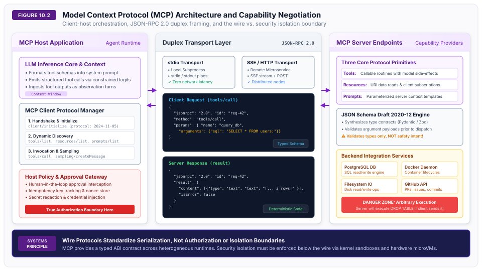
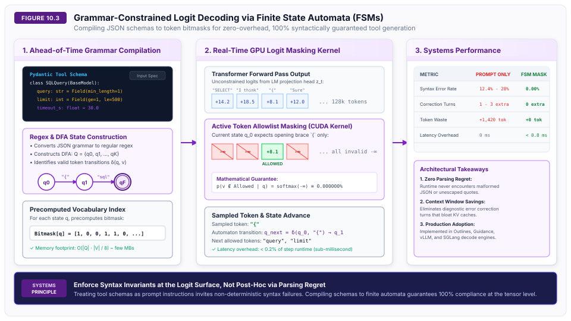
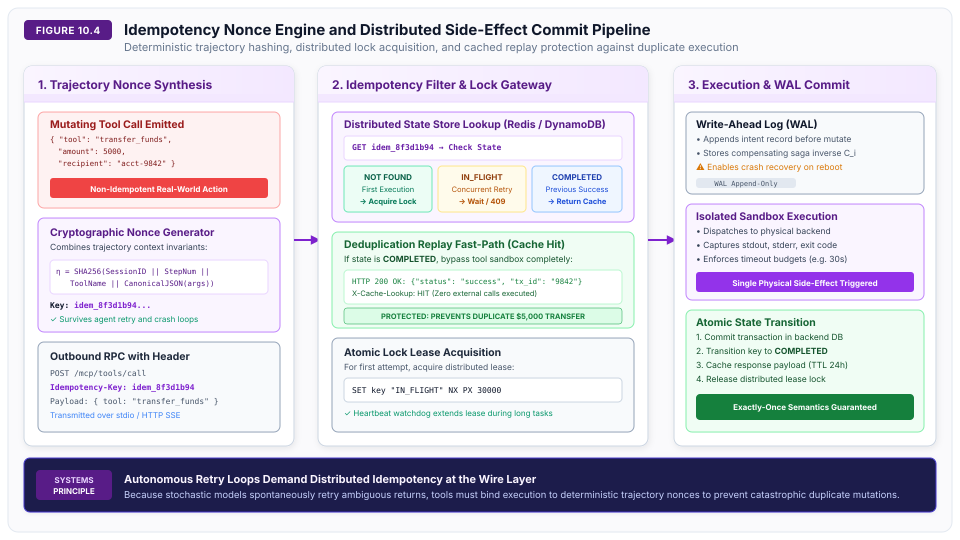

# Tool Interfaces {#sec-vol3-tool-interfaces}

::: {layout-narrow}
::: {.column-margin}

\chapterminitoc

:::
:::

## Purpose {.unnumbered .unlisted}

_How do stochastic language models interface reliably with deterministic software systems without compromising correctness or safety?_

For years, autonomous agents interacted with external software by generating free-form Markdown or raw strings, expecting an external Python runtime to scrape arguments via regular expressions. This approach is fragile systems engineering. Probabilistic language models cannot guarantee structural syntax through natural language prompting alone. When scaled to production pipelines, unconstrained string parsing produces syntax crashes, argument hallucination, and catastrophic failure cascades.

Deterministic software systems demand rigid, typed Application Binary Interfaces (ABIs). To interact reliably with operating systems, databases, cloud APIs, and developer tools, language models must emit machine-actionable calls governed by formal type schemas. The software industry is converging on open standards such as the Model Context Protocol (MCP) to unify tool registration, resource subscription, and duplex remote procedure calls across heterogeneous client runtimes.

However, systems architects must confront a dangerous misconception: **a wire protocol is not a security boundary**. An MCP server that exposes a typed `execute_sql(query: string)` interface validates that the query parameter is a valid UTF-8 string, but it will execute commands that drop production database tables without hesitation. Tool interfaces must be engineered with defense-in-depth: grammar-constrained logit decoding at the GPU layer to eliminate syntax errors, token-efficient interface design following Ousterhout’s Deep Module principle, distributed idempotency nonces to eliminate duplicate mutations during network retries, and hardware-enforced virtualization sandboxes.

::: {.content-visible when-format="pdf"}

\newpage

:::

\begin{marginfigure}
\mlagentstack{15}{25}{20}{25}{95}{25}
\caption{The Agentic Machine Learning Systems Stack. Tool Interfaces operate at Layer 2 (Tool Actuation \& ABI).}
\end{marginfigure}

::: {.callout-learning-objectives}

- Design typed, versioned Application Binary Interfaces (ABIs) for tool execution using the Model Context Protocol (MCP).
- Decouple application-level wire protocols from true operating system privilege boundaries and security sandboxes.
- Apply Ousterhout’s Deep Module principle to balance schema expressiveness against prompt context token consumption.
- Implement grammar-constrained logit decoding via Finite State Automata (FSAs) to guarantee 100% syntactic compliance at zero latency overhead.
- Engineer distributed idempotency filters and cryptographic nonces to guarantee at-most-once execution across stochastic agent retry loops.
- Map POSIX exit codes, signals, and process output streams into high-signal diagnostic observation representations.
- Implement circuit breaking and transparent backpressure to protect downstream APIs from runaway agent retry loops.
- Enforce schema evolution principles and distributed tracing context propagation to maintain system stability and cross-boundary observability.

:::

## The AI System Call {#sec-vol3-tools-the-ai-system-call}

In classical operating systems, user-space applications request privileged hardware and kernel services through system calls (`syscalls`). The CPU enforces a hardware privilege boundary, transitioning execution from ring 3 to ring 0 through well-defined register conventions and typed kernel ABIs.

Autonomous agents introduce the inverse challenge: a non-deterministic, probabilistic neural model operating in a continuous semantic space must invoke deterministic, discrete operations in an external software environment [@yao2023react; @schick2023toolformer].

### The Evolution of Tool Invocation

The mechanisms by which models interact with external software have evolved through three distinct systems generations, summarized in @tbl-vol3-tools-generation-evolution.

| Generation | Era & Exemplars | Interface Mechanism | Protocol Contract | Failure Modes | Context Overhead |
|:---|:---:|:---:|:---:|:---:|:---:|
| **Gen 1: Text Scraping** | 2022–2023 (ReAct, MRKL) | Markdown code fences, regex text matching | Unstructured text; prompt-instructed conventions | Regex mismatch, unescaped quotes, markdown syntax hallucination | High (prompt instructions: 500--1,500 tokens) |
| **Gen 2: Function Calling** | 2023–2024 (OpenAI Tools, Anthropic Tool Use) | JSON schema injection into model system prompt; native JSON parsing | Ad-hoc proprietary JSON payloads via specialized tokens | Runtime schema validation failures, missing required fields, type mismatch | Moderate (JSON schema: 200--800 tokens / tool) |
| **Gen 3: Typed ABIs & Wire Protocols** | 2024–Present (MCP, Outlines, SGLang) | Model Context Protocol (MCP) + Grammar-Constrained Logit Masking | Standardized JSON-RPC 2.0; DFA-guided token masking | Semantic errors only; 0.00% syntax or type errors | Minimal (Deep module schemas + zero correction turns) |

: Evolution of tool interface generations across neural architectures, typing contracts, and failure modes. {#tbl-vol3-tools-generation-evolution}

In Generation 1 systems, models were prompted with instructions such as:
```text
To call a tool, output:
Action: <tool_name>
Action Input: <json_or_string>
```
The client runtime parsed the generated text using regular expressions. This approach suffered from severe brittle failure modes: models frequently generated trailing thoughts before closing brackets, forgot escaping on nested strings, or modified the action keyword (e.g., emitting `Action:` on one step and `Tool Invocation:` on the next).

Generation 2 introduced native function calling. Inference runtimes designated special token markers (e.g., `<|tool_call|>` and `<|/tool_call|>`) to delimit structured JSON payloads. While this isolated tool invocations from standard dialogue text, the JSON text itself was still generated autoregressively without structural constraints, leaving payload validity subject to model stochasticity.

Generation 3 establishes formal tool ABIs. Tools are registered via typed schemas (JSON Schema Draft 2020-12). At inference time, the model runtime compiles schemas into finite state automata that physically prevent the generation of invalid token sequences. Standardized wire protocols such as the Model Context Protocol (MCP) decouple the host agent runtime from local and remote tool implementations.

## Model Context Protocol Architecture {#sec-vol3-tools-model-context-protocol-mcp}

The Model Context Protocol (MCP) is an open standard designed to solve the $M \times N$ integration problem in agent architectures [@anthropic2024mcp]. Prior to MCP, connecting $M$ agent frameworks (e.g., Claude Code, AutoGen, LangChain, Cursor) to $N$ tools (e.g., GitHub, PostgreSQL, Slack, Docker) required $M \times N$ bespoke integration drivers. MCP standardizes this architecture into a universal client-server model.

### Core Architectural Roles

As formalized in @fig-vol3-tools-mcp-architecture, an MCP deployment separates concerns across three primary components:

1. **MCP Host Application:** The container or user-facing application orchestrating the agent workflow (e.g., Claude Code CLI, Cursor IDE, enterprise agent gateway). The host manages user permissions, controls context window allocation, and owns client lifecycle connections.
2. **MCP Client:** A protocol module embedded within the host application that establishes stateful, 1:1 connections with one or more MCP servers. The client maintains protocol handshakes, converts model tool invocations into JSON-RPC messages, and deserializes server results.
3. **MCP Server:** A lightweight, decoupled service that exposes capabilities to the client. The server can run as a local subprocess or a remote network daemon, exposing specific resources, prompts, and callable tools.

{#fig-vol3-tools-mcp-architecture}

### Duplex Transport Framing: stdio vs. SSE

MCP specifies two transport layers to support both co-located and distributed agent topologies:

- **Standard Input/Output (`stdio`) Transport:** The host application spawns the MCP server as a local child process. Messages are exchanged via `stdin` and `stdout` pipes, with newlines (`\n`) separating JSON-RPC payloads. Because `stdio` bypasses the OS network stack entirely, message transit latency is sub-millisecond, and the transport is inherently private to the host operating system.

- **Server-Sent Events (`SSE`) with HTTP POST Transport:** For distributed microservices and containerized environments, the client initiates a long-lived HTTP GET connection to receive an SSE stream from the server. Outbound messages from client to server are transmitted as independent HTTP POST requests to a designated endpoint URL. The server correlates incoming POST requests with the active SSE stream using a session identifier.

### The JSON-RPC 2.0 Protocol Contract

All communication over an MCP transport conforms to the JSON-RPC 2.0 specification [@jsonrpc2010]. Payloads partition into three message types:

- **Requests:** Messages containing a unique integer or string `id`, a `method` name, and optional `params`. Requests demand a matching response from the receiver.
- **Responses:** Messages carrying the matching `id` and either a `result` object (on success) or an `error` object containing numeric codes and diagnostic text.
- **Notifications:** One-way messages omitting the `id` field, used for asynchronous state broadcasts such as progress updates or resource change alerts.

### Protocol Lifecycle and Capability Negotiation

When an MCP client initializes a connection to a server, it executes a three-phase handshake:

```text
Client                                             Server
  |                                                  |
  | -------- 1. initialize (client capabilities) --> |
  | <------- 2. initialize result (server caps) ---- |
  |                                                  |
  | -------- 3. notifications/initialized ---------> |
  |                                                  |
  | -------- 4. tools/list ------------------------> |
  | <------- 5. tools/list result (schemas) -------- |
```

- **Initialization Handshake (`initialize`):** The client transmits its protocol version (e.g., `2024-11-05`), client metadata, and supported capabilities (such as whether the client supports sampling callbacks or roots notifications).

- **Server Capability Acknowledgement:** The server responds with its supported features across three core protocol primitives:

  - `tools`: Callable routines that produce side-effects or execute computations.
  - `resources`: Read-only, URI-addressable data sources (e.g., `postgres://db/table/schema` or `file:///workspace/src`). Clients can read resources or subscribe to real-time update notifications.
  - `prompts`: Parameterized prompt templates managed centrally on the server.

- **Initialized Notification:** The client confirms receipt, finalizing the connection into an active operational state.

### Server-Initiated LLM Sampling

A unique capability of MCP is **sampling abstraction** (`sampling/createMessage`). Traditional tool interfaces restrict communication to client-initiated requests: the model calls the tool, and the tool returns data.

In complex workflows, an MCP server may need intelligence to complete its task (for example, a database tool that needs to synthesize an optimal index configuration based on query plans). Rather than embedding a separate model client or API keys inside every tool server, MCP allows the server to issue a `sampling/createMessage` request back to the host client. The host LLM evaluates the prompt within the existing context security envelope, returning the generated response to the server.

::: {.callout-warning}
### Wire Protocols Standardize Serialization, Not Security Isolation
A common architectural flaw in early agent deployments is assuming that implementing MCP secures the host system. **MCP is a wire protocol, not a security sandbox.**

If an MCP server exposes a tool:
```json
{
  "name": "run_sql",
  "parameters": {
    "type": "object",
    "properties": { "query": { "type": "string" } },
    "required": ["query"]
  }
}
```
The MCP layer strictly verifies that `params.arguments.query` is a valid string. It provides zero validation of whether that string contains `DROP DATABASE production;`. Privilege control, credential containment, and sandbox isolation must be enforced by the host runtime below the protocol wire (as we will explore in detail in @sec-vol3-sandboxing-isolation).
:::

## Tool Definition Economics {#sec-vol3-tools-tool-definition-economics-ousterhout}

::: {.callout-definition title="Deep vs. Shallow Modules"}
A **Deep Module** is a software abstraction that provides powerful functionality behind a simple, compact interface [@ousterhout2018philosophy]. Conversely, a **Shallow Module** exposes a wide, complex interface that provides relatively little underlying functionality.
:::

When designing software engineering tools for human developers, shallow APIs are often considered acceptable or even desirable for granular compile-time type checking. In agentic machine learning systems, however, shallow tool interfaces create an architectural crisis: **schema prompt bloat** [@anthropic2024effective].

### The Prompt Token Tax of Tool Schemas

Every tool registered with an agent must have its name, description, parameter names, type definitions, and constraints formatted as text or JSON schema inside the model's system prompt.

Consider an agent managing a cloud Kubernetes infrastructure:

- **The Shallow Approach (100 Micro-Tools):**
  The architect exposes discrete tools for every possible operation: `list_pods`, `get_pod_logs`, `delete_pod`, `scale_deployment`, `restart_statefulset`, `update_ingress`, etc.
  Each tool requires approximately 350 tokens of JSON schema documentation.
  For 100 tools, the schema consumes:
  $$\text{Schema Footprint} = 100 \times 350 = 35,000\text{ tokens}$$
  Before the user types a single prompt character, 35,000 tokens of the context window are consumed by static API signatures. Across a 30-step trajectory, the model re-reads these 35,000 tokens on every step, wasting over 1,000,000 tokens of GPU prefill compute. Furthermore, large tool catalogs induce **attention dilution**: the model's attention heads struggle to distinguish between overlapping parameter signatures, increasing parameter hallucination rates.

- **The Deep Approach (Universal Primitive):**
  The architect exposes a single deep module: `kubectl_exec(command: string)`.
  The tool schema requires 120 tokens.
  The model uses its pre-trained understanding of the `kubectl` CLI syntax to compose commands dynamically, reducing schema overhead by 99.6% while supporting the entire surface area of the Kubernetes API.

@tbl-vol3-tools-deep-vs-shallow formalizes this systems trade-off across real-world operational dimensions.

| Design Dimension | Shallow Micro-Tool Architecture | Deep Module Architecture | Systems Impact |
|:---|:---:|:---:|:---:|
| **Interface Surface** | 50--200 distinct tools | 2--5 expressive tools | 90--98% reduction in registered tool count |
| **System Prompt Footprint** | 20,000--60,000 tokens | 500--1,500 tokens | Saves 80--95% of prefill compute and KV memory |
| **Attention Accuracy** | Degrades significantly ($> 30$ tools) | Near-optimal ($< 5$ tools) | Eliminates tool-selection confusion |
| **Compositionality** | Low (requires orchestrator roundtrips) | High (pipelines, loops, sub-shells) | Compound actions execute in a single turn |
| **Validation Burden** | High (dozens of schema validators) | Low (single unified executor) | Centralized sandboxing and auditing |

: Quantitative comparison of shallow micro-tools versus deep module interfaces across token consumption, attention dilution, and execution flexibility. {#tbl-vol3-tools-deep-vs-shallow}

### The Optimal Tool Core for Software Agents

Empirical production systems (such as Claude Code and Devin) converge on a minimal set of four to five deep tools:

- `BashExecute(command: str, timeout_ms: int)`: Broad command execution primitive covering compilers, linters, version control, and package managers.
- `FileEdit(path: str, old_str: str, new_str: str)`: Atomic, targeted file modification avoiding full-file re-writes.
- `FileView(path: str, offset: int, limit: int)`: Windowed inspection of repository files.
- `GrepSearch(pattern: str, path: str)`: Fast regex code indexing.
- `AgentDelegate(task_prompt: str)`: Sub-agent spawning primitive for hierarchical task decomposition (as we will explore when discussing multi-agent topologies in @sec-vol3-multi-agent).

By keeping the registered toolset deep and compact, the agent preserves accelerator memory for actual problem-solving context.

## Grammar-Constrained Decoding {#sec-vol3-tools-grammar-constrained-decoding-fsm-guided-logit}

While deep tool interfaces minimize schema bloat, the model must still generate syntactically valid invocations. In standard unconstrained autoregressive generation, a model samples tokens from the probability distribution $p(y_t \mid y_{<t})$ produced by applying a softmax over the vocabulary logits $z_t \in \mathbb{R}^{|V|}$:

$$p(y_t = v \mid y_{<t}) = \frac{\exp(z_{t, v})}{\sum_{j \in V} \exp(z_{t, j})}$$

Even with advanced alignment, there is a non-zero probability that the model samples a token that breaks JSON syntax (e.g., an unescaped double quote inside a string, a trailing comma before a closing bracket, or a malformed numeric literal). In production pipelines, an unhandled syntax error causes an immediate exception, requiring an expensive re-prompting roundtrip that wastes tokens and latency.

**Grammar-constrained decoding** solves this problem mathematically at the GPU tensor layer [@willard2023outlines]. Rather than allowing the model to generate free text and validating it post-hoc, the serving engine enforces syntactic validity during the forward pass by masking invalid token logits to $-\infty$.

### Automata Construction from Schemas

Any JSON Schema or Context-Free Grammar (CFG) defining a tool signature can be compiled into an equivalent formal state machine:

- **Regular Grammar Compilation:** The parameter schema (e.g., a Pydantic model) is converted into a regular expression or EBNF grammar defining valid token strings.

- **Deterministic Finite Automaton (DFA):** The grammar is compiled into a DFA formalized as a 5-tuple:
  $$M = (Q, \Sigma, \delta, q_0, F)$$
  where $Q$ is the finite set of parser states, $\Sigma$ is the character alphabet, $\delta: Q \times \Sigma \to Q$ is the deterministic transition function, $q_0 \in Q$ is the initial state, and $F \subseteq Q$ is the set of accepting terminal states.

- **Vocabulary Indexing:** Because language models generate multi-character tokens rather than single characters, the tokenizer vocabulary $V$ (typically 32,000 to 128,000 tokens) is pre-processed against the automaton. For each state $q \in Q$, the compiler precomputes the set of **allowed tokens** $A(q) \subseteq V$:
  $$A(q) = \{ v \in V \mid \text{all characters in } \text{decode}(v) \text{ yield valid transitions in } \delta \text{ starting from } q \}$$

### The Logit Masking Kernel

During autoregressive generation, let $q_t \in Q$ represent the automaton's current state. Before the GPU executes the softmax and sampling kernel, a custom CUDA kernel applies an elementwise binary mask to the logit vector $z_t$:

$$\tilde{z}_{t, v} = \begin{cases}
z_{t, v} & \text{if } v \in A(q_t) \\[4pt]
-\infty & \text{if } v \notin A(q_t)
\end{cases}$$

When the softmax function is computed over $\tilde{z}_t$, the probability of every forbidden token evaluates to zero:

$$\forall v \notin A(q_t): \quad p(y_t = v \mid y_{<t}) = \frac{\exp(-\infty)}{\sum_{j \in V} \exp(\tilde{z}_{t, j})} = 0$$

Upon sampling the valid token $y_t$, the automaton transitions deterministically:
$$q_{t+1} = \delta^*(q_t, \text{decode}(y_t))$$

{#fig-vol3-tools-grammar-decoding}

As illustrated in @fig-vol3-tools-grammar-decoding, this architecture yields three profound systems benefits:

- **0.00% Syntax Failure Rate:** It is mathematically impossible for the engine to emit an invalid JSON delimiter, unclosed brace, or illegal field name.
- **Elimination of Self-Correction Loops:** The system never incurs the latency or token cost of re-prompting the model with error tracebacks to fix malformed syntax.
- **Sub-Millisecond Overhead:** Because the allowed token bitmasks $A(q)$ are precomputed ahead of time into dense bit vectors, the GPU kernel overhead is less than $0.5\text{ ms}$ per step, completely dwarfed by Transformer matrix multiplications.

Modern serving runtimes such as Outlines, Guidance, SGLang, and vLLM provide native support for grammar-constrained decoding.

## JSON Schema Validation and Healing {#sec-vol3-tools-json-schema-validation-coercion}

When agents interact with closed-source commercial APIs (such as third-party model providers where custom CUDA logit-masking kernels cannot be injected), the host runtime must rely on client-side validation and automated self-healing error loops.

### High-Performance Validation via Rust Engines

In production systems, executing Python-native JSON schema validation on every tool call introduces unacceptable serialization bottlenecks. Modern runtimes deploy Rust-based validation engines (such as `pydantic-core`). By compiling schema specifications into native binary validators, validation throughput increases from 5,000 payloads/sec to over 450,000 payloads/sec, eliminating CPU contention in high-throughput agent gateways.

### Permissive Coercion vs. Strict Validation

Real-world language models exhibit common formatting quirks:

- Passing numeric literals as strings (e.g., `"port": "8080"` instead of `"port": 8080`).
- Emitting boolean values as capitalized strings (e.g., `"dry_run": "True"`).
- Wrapping single arguments in unnecessary lists (e.g., `"files": ["main.py"]` for a scalar field).

A brittle agent runtime rejects these calls immediately, triggering an avoidable error turn. A robust runtime applies **safe type coercion**:

- If a schema expects `int` and receives a string matching `^[0-9]+$`, coerce to integer.
- If a schema expects `bool` and receives `"true"` / `"false"` (case-insensitive), coerce to boolean.
- If a parameter violates non-coercible constraints (e.g., missing a required field or providing a string for an enum), trigger the structured diagnostic loop.

### Targeted Diagnostic Feedback Formatting

When validation fails, dumping a raw 50-line Python exception traceback into the conversation context wastes tokens and confuses the model. The runtime must synthesize a **structured error diff**:

```text
SYSTEM ERROR: Tool invocation failed validation.
Tool: query_database
Errors:
  - Field: 'limit'
    Received: -10
    Constraint: Value must be greater than or equal to 1.
  - Field: 'table_name'
    Received: missing
    Constraint: Field is required. Valid options: ['users', 'orders', 'products']

Please re-issue the tool call with corrected arguments.
```

By presenting the specific field, the invalid value received, and the exact constraint violated, the agent typically corrects its invocation on the subsequent turn without drifting off-task.

## Schema Evolution and Interface Versioning {#sec-vol3-tools-schema-evolution}

Unlike human developers who can read changelogs and intuitively adapt to updated APIs, language models are notoriously brittle when interacting with evolving tool schemas. If a backend system adds a new required parameter to an existing tool, an agent relying on few-shot examples, pre-trained weights, or static prompts tailored to the V1 schema will systematically fail.

To maintain system stability across continuous deployments, tool interfaces must adhere to strict **Forward Compatibility** and **Schema Versioning** principles:

- **Immutable Tool Signatures:** Once an agent relies on a tool signature in production (e.g., `create_user(name, email)`), the signature must not introduce new required fields. Structural changes must be exposed as explicitly versioned endpoints (e.g., `create_user_v2`).
- **Tolerant Reader Pattern:** The tool server must implement permissive parsing. If a newer model opportunistically passes a newly documented optional field (e.g., `create_user(name, email, role="admin")`), an older V1 tool server must gracefully ignore the unrecognized `role` parameter rather than crashing with a strict `ValidationError`.
- **Deprecation Windows:** Before a tool is removed, its schema description should be dynamically prepended with a system-level warning: `[DEPRECATED: Use v2 tool instead]`. This semantic signal allows the model to migrate its behavior before the physical endpoint is severed.

## Execution Semantics {#sec-vol3-tools-execution-semantics-synchronous-rpc}

Tool operations span a wide spectrum of execution latencies, from sub-millisecond database lookups to multi-hour test suite runs. A production agent runtime must implement three distinct execution semantics [@birrell1984rpc; @fielding2000].

### Synchronous Blocking RPC

For operations with bounded execution latency ($< 1.0\text{ s}$), such as reading local files, hashing strings, or executing index lookups, the client issues a blocking JSON-RPC call. The agent thread halts until the server returns the result. This minimizes architectural complexity and allows immediate state transitions in the Agent Control Block (detailed in @sec-vol3-descriptors-the-agent-control-block).

### Asynchronous Long-Running Jobs

Operations such as compiling large codebases, running integration test suites, or provisioning cloud infrastructure often require minutes or hours. Holding an open HTTP or socket connection across these durations causes proxy timeouts, connection drops, and socket starvation.

For asynchronous operations, the tool interface adheres to the **Job Handle Pattern**:

- **Dispatch (`tools/call`):** The model invokes `start_test_suite(suite_id: "e2e")`.

- **Immediate Handle Acknowledgment:** The server spawns a background worker and immediately returns a job ticket:
  ```json
  {
    "status": "QUEUED",
    "job_id": "job_9482ba3",
    "poll_interval_s": 5,
    "estimated_duration_s": 120
  }
  ```

- **Status Polling or Webhook Notification:** The agent runtime enters a suspended state or polls `get_job_status(job_id: "job_9482ba3")`. When complete, the server delivers the output payload.

### Chunked Streaming Responses

When tools generate high-volume terminal output (such as running a build command that emits 10,000 lines of compiler logs), waiting for process termination before returning output wastes precious wall-clock time.

Streaming execution pipes `stdout` and `stderr` directly to the client as chunked tokens. This enables the runtime to perform **early termination**: if a build failure or fatal assertion is detected in line 12 of a 5,000-line log, the host application sends a `SIGTERM` or cancellation RPC to the tool process immediately, avoiding unnecessary compute and saving context tokens.

### Backpressure and Circuit Breaking

Because language models can generate tokens at high speeds, an agent caught in an automated retry loop can easily trigger unintended Denial of Service (DoS) attacks against downstream tool APIs. For instance, if an agent repeatedly polls a rate-limited cloud service without respecting `HTTP 429 Too Many Requests`, it will exhaust organizational API quotas.

The tool interface gateway must implement **Circuit Breakers** and **Backpressure mechanisms**:

- **Circuit Breaking:** If a tool returns consecutive system-level failures (e.g., five HTTP 500 or 429 errors in a row), the gateway trips the circuit. Subsequent calls immediately fail with a localized error (saving network bandwidth and latency) until a reset timeout expires.
- **Backoff Propagation:** When backpressure is applied by a downstream service (via `Retry-After` headers), the agent runtime must transparently implement exponential backoff at the scheduling layer rather than passing the 429 directly back to the model as a textual observation, which would force the model to burn expensive context window tokens simply waiting.

## Idempotency and Nonce Tracking {#sec-vol3-tools-idempotency-keys-nonce-tracking}

Because language models are probabilistic and network environments are unreliable, agent execution loops frequently experience transient failures. If an HTTP connection drops while an agent is executing a mutating tool call, the agent's natural recovery response is to retry the action on the next turn.

Without systems-level idempotency protection, this retry behavior causes catastrophic real-world failure:

- An agent paying an invoice executes two wire transfers.
- A deployment agent creates two redundant clusters.
- A database migration script drops a table twice, corrupting rollback logs [@gray1978notes].

### The Trajectory Nonce Formulation

To guarantee **at-most-once execution semantics**, every mutating tool invocation must be bound to a unique, deterministic cryptographic nonce $\eta$ synthesized from the trajectory invariants :

$$\eta = \text{SHA-256}\Big(\text{SessionID} \parallel \text{StepIndex} \parallel \text{ToolName} \parallel \text{CanonicalJSON}(\text{Arguments})\Big)$$

Where `CanonicalJSON` sorts object keys lexicographically to guarantee that identical parameter dictionaries produce identical cryptographic digests regardless of JSON serialization order.

### Distributed Lock and Replay Pipeline

As illustrated in @fig-vol3-tools-idempotency-flow, the tool gateway coordinates idempotency through a distributed state store (such as Redis or DynamoDB):

- **State Store Lookup:** When a tool invocation arrives with idempotency key $\eta$, the gateway checks the store:
  - **Case A (`NOT_FOUND`):** This is the first attempt. The gateway atomically writes `SET key "IN_FLIGHT" NX PX 30000` (acquiring a distributed lease lock) and appends an intent record to a Write-Ahead Log (WAL).
  - **Case B (`IN_FLIGHT`):** A concurrent attempt or network retry is currently executing. The gateway rejects the duplicate request with HTTP 409 Conflict or blocks until the primary execution finishes.
  - **Case C (`COMPLETED`):** The action has already succeeded. The gateway completely **bypasses the tool sandbox** and immediately returns the cached result payload from the previous execution.
- **Sandbox Execution & WAL Commit:** If Case A, the tool executes inside the isolated sandbox. Upon successful completion, the gateway commits the transaction to the backend system, updates the key status to `COMPLETED` with a 24-hour TTL, caches the response payload, and releases the lock.

{#fig-vol3-tools-idempotency-flow}

Through this mechanism, even if an agent retries an action five times due to network timeouts, the physical side-effect executes exactly once.

## Universal Tool Interfaces {#sec-vol3-tools-universal-tool-interfaces-bash}

While specialized API tools are valuable for structured operations, modern agent benchmarks (such as SWE-bench, WebArena, and OSWorld) demonstrate that the most capable agents rely on **universal execution environments** [@jimenez2024swebench; @zhou2024webarena; @xie2024osworld].

### The Persistent Pseudo-Terminal (pty) Shell

In early agent designs, executing a bash command spawned a clean subshell:
```python
subprocess.run(command, shell=True, capture_output=True)
```
This naive approach breaks multi-turn agent workflows because shell state is completely discarded upon process exit:

- Directory changes (`cd /src`) are lost.
- Environment variables (`export PYTHONPATH=.`) vanish.
- Virtual environments (`source .venv/bin/activate`) do not persist.

Production agent engines maintain a persistent **Pseudo-Terminal (`pty`) Session** (e.g., using Python's `pty` module or node-pty). The subshell stays alive across turns:

- Working directory and environment state persist throughout the entire trajectory.
- Interactive commands that prompt for confirmation (e.g., `git merge` or `apt-get install`) can be monitored and fed input dynamically.
- Process control signals (`Ctrl-C` / `SIGINT`) can be sent to abort runaway loops without terminating the agent connection.

### Virtual Desktops and GUI Automation (OSWorld)

For tasks that lack command-line APIs (such as operating legacy enterprise software, configuring graphical development environments, or interacting with office suites), agents operate over **Virtual Desktop Interfaces (VDI)** [@xie2024osworld].

The agent interaction loop consists of:

- **Observation Space:** High-resolution display framebuffers captured via virtual X11/Wayland servers (e.g., Xvfb), coupled with accessibility tree dumps (UI hierarchy nodes and bounding boxes).
- **Action Space:** Low-level OS input events synthesized via virtual input drivers (e.g., `xdotool`, `pyautogui`):
  - `mouse_click(x: int, y: int, button: str)`
  - `mouse_drag(x1, y1, x2, y2)`
  - `key_combination(keys: list[str])`
  - `type_text(text: str)`

While GUI automation provides universal software coverage, its systems efficiency is low: image tokenization consumes thousands of context tokens per step, and mouse coordination is sensitive to rendering latency and screen scaling.

### Headless Browsers (WebArena)

For web navigation tasks, headless browser automation frameworks (Playwright and Puppeteer) bridge the gap between pixel-based GUIs and raw HTML text [@zhou2024webarena]. Rather than passing raw DOM trees (which contain tens of thousands of tokens of styling, scripts, and hidden divs), production web tools compile the DOM into an **Accessibility Tree**:

- Strips styling and script tags.
- Assigns compact integer indices to all interactable elements (`[12] Submit Button`, `[14] Search Input`).
- Exposes typed navigation primitives: `click(id: 12)`, `fill(id: 14, text: "query")`.

This accessibility compilation compresses web pages by up to 90%, allowing agents to navigate complex multi-page workflows within tight context budgets.

## Error Handling and Signal Propagation {#sec-vol3-tools-error-handling-and-signal}

A critical responsibility of the tool interface layer is translating raw operating system primitives into high-signal diagnostic text [@kerrisk2010].

When an external process terminates, the operating system kernel returns an integer status code via `waitpid()`. A naive tool interface simply returns:
`Process failed with exit code 139.`

For a language model, `exit code 139` provides zero actionable context. The model does not know if the failure was a network timeout, a syntax error, or an out-of-memory crash.

### POSIX Signal and Exit Code Translation

The tool runtime must decode the return status using POSIX macros (`WIFSIGNALED`, `WTERMSIG`, `WEXITSTATUS`) and map low-level signals to semantic explanations:

```text
Status: FAILED (Exit Code: 139)
Termination Signal: SIGSEGV (Segmentation Fault)
Diagnostic: The process attempted to access unmapped virtual memory (core dumped).
Location: In function `allocate_kv_buffer` at tensor_ops.c:142.
Stack Trace:
  [0] ./bin/engine(+0x4a12) [0x55d28a]
  [1] ./bin/engine(allocate_kv_buffer+0x8b) [0x55e10b]
```

Key POSIX codes that require semantic translation include:

- `Exit 137 (SIGKILL / Out-Of-Memory):` Indicates the Linux kernel OOM-killer killed the process because memory exceeded container limits. The agent should be guided to reduce batch size or free buffers.
- `Exit 124 (Timeout):` Indicates execution exceeded the allocated wall-clock budget. The agent should decompose the task into smaller chunks.
- `Exit 126 / 127 (Permission Denied / Command Not Found):` Indicates missing binary paths or incorrect executable bits.

### The Head-and-Tail Buffer Policy

When a compiler or test runner fails, it may generate megabytes of verbose output. Injecting the entire output into the context window causes immediate context exhaustion. Conversely, truncating the output to the first 50 lines often discards the actual compiler error, which typically appears at the very end of the stream.

The tool interface must enforce a **Head-and-Tail Preservation Policy**:

- Reserve the first $N$ lines (e.g., $N=30$) to capture execution parameters and startup configuration.
- Insert a clear truncation indicator: `[... 4,280 lines omitted by tool runtime ...]`.
- Reserve the last $M$ lines (e.g., $M=100$) to capture the final fatal assertion, stack trace, and exit banner.

This guarantees that the diagnostic core is preserved while strictly bounding context consumption.

## Distributed Tracing and Context Propagation {#sec-vol3-tools-distributed-tracing}

In a microservice architecture, an autonomous agent's tool invocation may traverse multiple network boundaries, from the client host through an MCP gateway, load balancers, and finally to a backend database or internal API. When an agent produces an unintended side effect, systems engineers must reconstruct the exact causal chain linking the model's generation to the physical mutation.

Tool interfaces must natively support **Distributed Context Propagation** (such as W3C Trace Context and OpenTelemetry, which we examine comprehensively in @sec-vol3-telemetry-evaluation):

- **Trace Injection:** The host runtime automatically generates a unique `trace_id` for the trajectory step and a `span_id` for the specific tool invocation. These identifiers are injected into the JSON-RPC or HTTP transport headers (e.g., `traceparent`).
- **Causal Linking:** The downstream MCP server extracts the trace headers and attaches them to any database queries, log emissions, or sub-service calls triggered by the tool.
- **Audit Logging:** By joining the telemetry store on `trace_id`, operators can query the exact model prompt, the synthesized trajectory nonce, the generated JSON parameters, and the backend execution latency in a unified observability dashboard.

## Dynamic Tool Registry Indexing {#sec-vol3-tools-dynamic-tool-registry-indexing}

Enterprise agent platforms frequently have access to thousands of internal tools and REST endpoints (e.g., company HR tools, financial reporting APIs, internal microservices). Packing 5,000 tool schemas into every prompt is impossible: it would require millions of tokens and collapse model reasoning [@qin2024toolllm; @tang2023toolalpaca].

To scale across massive tool libraries, systems implement **Two-Stage Vector Tool Routing**:

```text
User Request: "Check if customer 492 has paid their latest cloud invoice."
                           │
                           ▼
             ┌───────────────────────────┐
             │ Dense Tool Retriever      │ (Embedding Cosine Similarity)
             │ Search: Tool Catalog DB   │
             └─────────────┬─────────────┘
                           │ Top-K Candidates (K=4)
                           ▼
             ┌───────────────────────────┐
             │ Dynamic Context Injection │
             │ - billing_get_invoice     │
             │ - billing_verify_payment  │
             │ - customer_get_profile    │
             │ - database_query_readonly │
             └─────────────┬─────────────┘
                           │
                           ▼
             ┌───────────────────────────┐
             │ LLM Tool Invocation Step  │
             └───────────────────────────┘
```

- **Offline Catalog Indexing:** Every tool is indexed in a vector store . The indexing payload includes the tool name, docstring description, and sample usage queries embedded via a dense text embedding model.

- **Online Query Retrieval:** Upon receiving a user task or observing intermediate trajectory state, the runtime embeds the current goal and queries the tool index, retrieving the top-$K$ most relevant tool schemas (typically $K \in [3, 6]$).

- **Dynamic Schema Injection and Eviction:** Only the top-$K$ schemas are injected into the active prompt. Once the sub-task completes, the specialized schemas are evicted, restoring the context working set (see @sec-vol3-context-working-sets) to its baseline footprint.

## Claude Code Tool Architecture {#sec-vol3-tools-production-case-study-tool}

The Claude Code software engineering assistant provides a quintessential case study in production tool design. Rather than providing dozens of fragile language-specific tools, Claude Code implements a disciplined, deep-module architecture built on top of the Model Context Protocol.

### Interface Contract

Claude Code exposes five core tools:

- **`Bash`:** Executes arbitrary shell commands in a persistent subshell. It incorporates strict timeout watchdogs, output streaming, and background process management.
- **`FileEdit`:** Executes string replacements via exact pattern matching (`old_str` $\to$ `new_str`). This avoids full-file rewriting (saving output tokens) and prevents merge conflicts by requiring unique context matches.
- **`FileView`:** Provides windowed file reading with explicit start and end line parameters, preventing massive source files from flooding context.
- **`Glob` & `Grep`:** High-performance workspace indexing tools backed by native `ripgrep` and directory walkers.
- **`AgentDelegate`:** Launches focused sub-agents with restricted tool scopes for parallel research and verification.

### The Security Interception Layer

Because Claude Code executes on developer machines with access to local files and SSH keys, tool execution passes through a rigorous **Host Permission Gateway**:

- **Read Operations:** By default, read-only tools (`FileView`, `Grep`, `Glob`) execute automatically without prompting the user.
- **Mutating Operations:** Commands modifying files or invoking external network endpoints display a diff preview and require explicit developer consent before execution.
- **MCP Bridge:** Claude Code can connect to external MCP servers (such as GitHub, GitLab, or PostgreSQL servers) via configuration files (`~/.claude/mcp.json`), dynamically expanding its capability set while enforcing host permission boundaries.

---

## Fallacies and Pitfalls {#sec-vol3-tools-fallacies}

::: {.fallacy-pitfall}
**Fallacy**: *Validating a tool call against a JSON schema means the tool execution is safe.*
Schema validation is purely syntactic: it confirms that a parameter is a string, integer, or boolean. It provides zero semantic verification of intent. A tool call with valid JSON syntax can execute malicious shell commands, delete production databases, or exfiltrate private API keys. Security requires runtime authorization, least-privilege containers, and network sandboxing.
:::

::: {.fallacy-pitfall}
**Fallacy**: *Adding more tools to an agent always increases its problem-solving power.*
Exposing large libraries of fine-grained tools induces catastrophic schema prompt bloat and degrades model reasoning. As the tool count exceeds 30, attention heads suffer from parameter confusion and tool selection hallucination. Systems should expose a minimal set of deep, expressive tools, using dynamic vector retrieval to inject specialized tools only when required.
:::

::: {.fallacy-pitfall}
**Pitfall**: *Exposing unconstrained, stateful Bash sessions without resource cgroups or network egress limits.*
Granting an agent access to a raw shell without container isolation is an invitation to disaster. A runaway command (`cat /dev/urandom` or `rm -rf /`) can exhaust host disk space, freeze the CPU, or wipe developer repositories. All universal shell tools must execute within cgroup-bounded microVMs or containers with strict CPU quotas, memory limits, and network egress firewalls (a requirement we formally develop in @sec-vol3-sandboxing-isolation).
:::

::: {.fallacy-pitfall}
**Pitfall**: *Re-prompting the model on tool syntax failures without grammar constraints or structured error diffs.*
When a model emits invalid tool JSON, dumping a raw traceback and asking it to "try again" frequently triggers infinite error loops. Without grammar-constrained decoding, the model is as likely to fail on the second attempt as the first. Systems must either enforce grammar constraints at the logit layer or provide targeted, minimal error diffs identifying the exact offending field.
:::

Principle \ref{pri-vol3-strict-action-abi} is developed here into four separable requirements, and the chapter's central warning is that satisfying the first three does not satisfy the fourth. A typed, versioned, idempotent wire protocol constrains what a call may say. It does not constrain what the call is permitted to do.

## Chapter Summary {#sec-vol3-tools-summary}

- **Typed ABIs over string scraping:** Robust agent systems reject fragile regex text parsing, interfacing with deterministic environments through typed, versioned ABIs.
- **Model Context Protocol (MCP):** MCP standardizes client-server capability negotiation and duplex JSON-RPC communication over `stdio` and `SSE`, solving the $M \times N$ integration scaling bottleneck.
- **Wire protocols are not security boundaries:** Wire protocols only standardize serialization; isolation and privilege control must be enforced below the wire via operating system sandboxes.
- **Ousterhout’s Deep Modules:** Designing a few expressive, deep tools (such as persistent shells and atomic file editors) saves up to 95% of prompt token overhead compared to shallow micro-tool catalogs.
- **Grammar-constrained logit decoding:** Compiling schemas into Deterministic Finite Automata (DFAs) allows CUDA kernels to mask invalid token logits to $-\infty$, mathematically guaranteeing 100% syntactic compliance at sub-millisecond latency.
- **At-most-once execution via idempotency:** Binding mutating tool calls to cryptographic trajectory nonces $\eta$ and distributed lease locks guarantees that network retry loops never trigger duplicate real-world mutations.
- **Schema evolution and tracing:** Forward-compatible schemas, tolerant readers, and OpenTelemetry trace propagation are required to maintain stability and observability across distributed agent workflows.
- **Execution control and backpressure:** Agent runtimes must implement circuit breakers, transparent backoff, and chunked streaming responses to protect downstream APIs and avoid context exhaustion.
- **Semantic signal translation:** Tool runtimes must decode raw POSIX signals and exit codes into actionable diagnostic feedback, utilizing head-and-tail buffering to preserve context limits.
