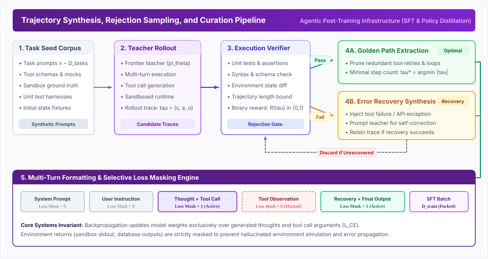

# Trajectory Fine-Tuning {#sec-vol3-trajectory-fine-tuning}

::: {layout-narrow}
::: {.column-margin}

\chapterminitoc

:::
:::

## Purpose {.unnumbered .unlisted}

_How do we curate, synthesize, and fine-tune models on trajectory execution data to embed tool-use and multi-step reasoning directly into policy weights?_

Base foundation models are trained to predict next tokens on unstructured internet text; they do not possess innate capabilities for reliable tool invocation, multi-step environment interaction, or structured error recovery. In-context few-shot prompting can coax basic agentic behaviors from frontier models, but stuffing tool schemas, system guidelines, and exemplar traces into prompt prefixes rapidly consumes finite attention budgets, introduces latency, and degrades token recall across long interaction horizons. Supervised Fine-Tuning (SFT) on agent trajectories represents the first essential phase of the agentic post-training lifecycle.

However, trajectory fine-tuning introduces fundamental systems challenges absent from standard static instruction tuning: autoregressive covariate shift (where a single step error drives the model into context states never encountered during training) and the extreme cost of collecting expert multi-turn traces. This chapter formalizes trajectory data curation, self-supervised tool bootstrapping (Toolformer), synthetic trajectory generation with execution-based rejection sampling, trajectory distillation from frontier models into compact local policies, multi-turn loss masking, and parameter-efficient adaptation (LoRA/QLoRA) with dynamic multi-tenant adapter swapping.

::: {.content-visible when-format="pdf"}

\newpage

:::

\begin{marginfigure}
\mlagentstack{15}{25}{95}{25}{20}{15}
\caption{The Agentic Machine Learning Systems Stack. Trajectory Fine-Tuning operates at Layer 4 (Policy \& Reasoning).}
\end{marginfigure}

::: {.callout-learning-objectives}

- Identify why standard instruction-following models fail at multi-turn state maintenance without trajectory SFT
- Formulate fine-tuning as an optimization that compiles recurring runtime context into static model parameters
- Implement self-supervised tool-calling token bootstrapping using the Toolformer loss criterion
- Design synthetic trajectory generation pipelines with execution-based rejection sampling and sandboxed verification
- Analyze the covariate shift problem in multi-turn rollouts and train models on error-recovery trajectories
- Derive the exact multi-turn masked cross-entropy loss function over agent action tokens
- Architect secure sandboxing infrastructure for high-throughput synthetic trajectory execution
- Implement sequence parallelism and ring attention to overcome activation memory bottlenecks during long-context fine-tuning
- Apply parameter-efficient fine-tuning (LoRA/QLoRA) and batched adapter swapping for multi-tenant agent serving
- Establish decontamination filters to prevent benchmark leakage from SWE-bench and GAIA into training splits

:::

## The Limits of In-Context Learning {#sec-vol3-fine-tuning-the-limits-of-in-context}

Before exploring trajectory fine-tuning algorithms, we must examine why in-context learning (ICL) fails to provide a scalable foundation for production agent runtimes.

In early agent prototypes, engineers relied entirely on prompting: the system prompt contained twenty OpenAPI tool schemas, detailed instructions on output formatting, and several few-shot exemplar trajectories. While this approach enables rapid prototyping without GPU training infrastructure, it imposes severe systems penalties across three dimensions:

1. **Computational Complexity and Key-Value Cache Saturation:**
   The computational cost of standard scaled dot-product attention scales quadratically with sequence length $T$ during prefill, and the memory consumption of the Key-Value (KV) cache scales linearly:

   $$\text{Memory}_{\text{KV}} = 2 \times n_{\text{layers}} \times d_{\text{model}} \times T \times b_{\text{bytes}}$$

   In an agent executing a 30-turn interaction where each turn appends tool definitions, execution logs, and intermediate reasoning, $T$ readily surpasses 32,000 tokens. In a 70-billion-parameter model using 16-bit precision, serving a single agent session requires over 8 GB of high-bandwidth memory (HBM) exclusively for KV tensors. When thousands of concurrent agents run in parallel, memory bandwidth and capacity become the primary throughput bottleneck [@kaplan2020scaling].

2. **Attention Degradation and the "Lost in the Middle" Phenomenon:**
   Transformer attention distributions do not remain uniformly sharp over extensive sequence contexts. As established by Liu et al. [@liu2024lost], language models exhibit pronounced U-shaped performance curves: retrieval accuracy is highest for tokens placed at the extreme beginning or end of the prompt context, while information located in the middle suffers severe degradation. When an agent relies on in-context exemplars embedded amidst lengthy API documentation, tool parameter recall plummets, resulting in hallucinated arguments and invalid schema structures.

3. **Inference Latency and Cost Inefficiencies:**
   Re-processing thousands of prompt tokens on every interaction step imposes substantial prefill latency. Even with prefix caching (detailed in @sec-vol3-prefix-caching-paging), dynamic changes in session history invalidate cache entries, forcing recurring recomputations. Economically, sending 10,000 prefix tokens across a 40-step trajectory consumes 400,000 input tokens per task resolution, driving API operating expenses to unsustainable levels.

::: {#pri-vol3-weight-compilation .callout-principle title="The Context Compilation Principle"}
Supervised fine-tuning on agent trajectories is mathematically equivalent to compiling dynamic runtime context into static parameter weights. By absorbing API schemas, structural syntax rules, and common decision paths directly into neural network weights, SFT compresses prompt lengths by over 80 percent, reduces per-step prefill latency, and eliminates attention dispersion across repetitive system instructions.
:::

## The Trajectory Data Flywheel {#sec-vol3-fine-tuning-the-trajectory-data-flywheel}

Transitioning an agent from prompt-based operation to weight-level competence requires an automated, self-reinforcing trajectory data flywheel.

::: {.callout-definition title="Trajectory"}
A **trajectory** $\tau$ is an ordered sequence of multi-turn interactions executed by an agent in pursuit of an objective $x$:

$$\tau = \left( s_0, a_0, o_0, s_1, a_1, o_1, \dots, s_H, a_H, o_H \right)$$

where $s_t$ represents the agent's internal state (including conversation history and reasoning scratchpad), $a_t$ represents the emitted action (such as an API invocation or shell command), and $o_t$ represents the observation returned by the external environment.
:::

In frontier engineering practice [@dubey2024llama; @openai2023gpt4], the trajectory flywheel operates across four continuous stages:

1. **Telemetry Logging and Session Capture:**
   Every live agent interaction is captured as a structured execution graph. The telemetry pipeline records:
   - User intents
   - Raw model completions
   - External tool payloads
   - Network response codes
   - Execution latencies
   - Human feedback signals (such as accepted pull requests or user interventions)

2. **Sanitization and Redaction:**
   Production traces contain sensitive enterprise information, including:
   - Private database records
   - Proprietary source code
   - Security credentials (API keys, OAuth tokens)

   Dedicated sanitization layers parse abstract syntax trees (ASTs) and apply named-entity recognition (NER) regular expressions to scrub credentials and mask personal identifiers prior to data storage.

3. **Multi-Faceted Quality Filtering:**
   Raw execution logs are inherently noisy. Unfiltered training on production traces causes policy collapse, as models internalize user errors, API outages, and meandering sub-optimal exploration paths. The curation engine applies three rigorous quality filters:

   - *Goal Completion Verification:* The session must terminate with an objectively verified success condition (e.g., all unit tests pass, compilation succeeds, database transaction commits).
   - *Trajectory Economy:* If two trajectories $\tau_1$ and $\tau_2$ resolve the same user request $x$, the filter selects the trajectory that minimizes redundant steps:

     $$\tau^* = \arg\min_{\tau \in \mathcal{T}(x)} |\tau| \quad \text{subject to} \quad R(\tau) = 1$$

   - *Syntactic and Schema Validity:* Every intermediate tool call must strictly adhere to the declared OpenAPI or JSON Schema specification without syntax errors or runtime exceptions.

4. **Continuous Retraining and Policy Rollout:**
   Curated trajectories are formatted into multi-turn SFT datasets. The fine-tuned policy is deployed to production, where its enhanced capabilities solve more complex user problems, generating richer execution traces that feed subsequent training cycles.

## Toolformer and Self-Supervised Tool Calling {#sec-vol3-fine-tuning-toolformer-and-self-supervised-tool}

Early attempts at tool integration relied on manual human demonstrations, where human annotators explicitly wrote API calls into text datasets. This approach is unscalable and fails to teach models *when* tool assistance is genuinely beneficial.

The seminal Toolformer architecture introduced by Schick et al. [@schick2023toolformer] demonstrated that language models can autonomously teach themselves to invoke external tools via self-supervised bootstrapping without human annotation.

The core intuition of Toolformer is straightforward: an API call is valuable if and only if knowing the API's execution output reduces the model's perplexity when predicting future tokens in the text.

### The Self-Supervised Optimization Criterion

Let $x = (x_1, \dots, x_N)$ be a sequence of natural language text. The Toolformer bootstrapping algorithm proceeds in three phases:

1. **Candidate API Call Sampling:**
   For each position $i \in \{1, \dots, N\}$, the model samples candidate API calls $c_i = \langle \text{API}, a_i \rangle$ by conditioning on the prefix $x_{<i}$ augmented with a prompt encouraging API exploration:

   $$P(c_i \mid x_{<i}) = \prod_{k=1}^{|c_i|} P_\theta(c_{i,k} \mid x_{<i}, c_{i,<k})$$

2. **Execution in Sandbox:**
   The candidate API calls are dispatched to external tools (calculators, search engines, translation systems, Python interpreters). The execution returns an observation string $r_i$.

3. **Causal Filtering Criterion:**
   The candidate call $c_i$ with execution result $r_i$ is retained in the training dataset if and only if the cross-entropy loss over the subsequent tokens $x_{i:N}$ given the API output is significantly lower than the loss without the API call, or with an empty API call:

   $$\mathcal{L}_i(r_i) = - \sum_{j=i}^N \log P_\theta(x_j \mid x_{<i}, c_i, r_i, x_{i:j-1})$$

   $$\mathcal{L}_i(\epsilon) = - \sum_{j=i}^N \log P_\theta(x_j \mid x_{<i}, x_{i:j-1})$$

   $$\mathcal{L}_i(\emptyset) = - \sum_{j=i}^N \log P_\theta(x_j \mid x_{<i}, c_i, \epsilon, x_{i:j-1})$$

A candidate API sequence is accepted into the fine-tuning corpus if:

$$\min\left( \mathcal{L}_i(\epsilon), \mathcal{L}_i(\emptyset) \right) - \mathcal{L}_i(r_i) \ge \tau_{\text{threshold}}$$

where $\tau_{\text{threshold}} > 0$ represents a strict information gain threshold.

If an API call produces irrelevant data or fails to resolve factual uncertainty, the loss does not decrease, and the trace is discarded. Conversely, if an API returns an exact arithmetic calculation or retrieved fact, future token prediction becomes deterministic, yielding a substantial loss reduction.

While Toolformer demonstrated tool integration using discrete special tokens (`<API>`, `</API>`), modern foundation models generalize this concept into native tool-calling tokens integrated into the model's base vocabulary [@patil2023gorilla] (as explored in @sec-vol3-tool-interfaces).

## Synthetic Trajectory Generation {#sec-vol3-fine-tuning-synthetic-trajectory-generation}

While the production flywheel captures real-world user interactions, production data suffers from domain sparsity: users rarely request tasks that existing models fail to solve, and safety boundaries limit wild exploration in live clusters. To develop frontier capabilities on complex tasks, engineering teams rely on **Synthetic Trajectory Generation** coupled with **Execution-Based Rejection Sampling** [@zelikman2022star; @gunasekar2023textbooks].

::: {#fig-vol3-trajectory-pipeline fig-env="figure" fig-pos="htb" fig-cap="**Trajectory Synthesis, Rejection Sampling, and Curation Pipeline**: A frontier teacher policy rolls out multi-turn candidate traces against a sandboxed environment. Execution-based verifiers validate environment state diffs and unit test suites, splitting traces into golden execution paths and error-recovery trajectories for supervised fine-tuning." fig-alt="System architecture diagram illustrating the end-to-end trajectory synthesis, execution verification, rejection sampling, and loss-masking pipeline."}
{width=100%}
:::

As illustrated in @fig-vol3-trajectory-pipeline, the synthetic trajectory pipeline operates through four coordinated stages:

1. **Task Seed Corpus Generation:**
   High-diversity task prompts $x \sim \mathcal{D}_{\text{tasks}}$ are generated using hierarchical task taxonomies. Seed generators create formal environment fixtures, mock APIs, database tables, and comprehensive unit test suites against which candidate completions will be evaluated.

2. **Frontier Teacher Rollouts:**
   A high-capacity teacher policy $\pi^*_{\theta}$ (such as an ensemble of frontier models or a model augmented with test-time Monte Carlo Tree Search) executes multi-turn rollouts within isolated sandboxes. The teacher samples stochastic actions across multiple temperature settings to explore alternative reasoning branches.

3. **Execution-Based Rejection Sampling:**
   Candidate trajectories are verified strictly by execution. Rather than using an LLM-as-a-judge (which is vulnerable to style bias and circular hallucinations), verification relies on:
   - Deterministic unit test harnesses
   - Compiler return codes
   - Schema linters
   - Environment state assertions

   $$R(\tau) = \begin{cases} 1 & \text{if all test assertions pass and state invariant holds} \\ 0 & \text{otherwise} \end{cases}$$

4. **Bifurcated Trajectory Curation:**
   - *Passing Traces ($R(\tau) = 1$):* Filtered to extract the minimal golden execution path, stripping away dead-end exploratory retries.
   - *Failing Traces ($R(\tau) = 0$):* Routed to an error-recovery synthesis engine, where deliberate self-correction is incentivized.

### Sandboxing and Verification Infrastructure

Executing millions of untrusted, model-generated actions during synthetic trajectory generation requires a highly scalable and secure sandboxing infrastructure (detailed in @sec-vol3-sandboxing-isolation). Launching heavyweight virtual machines for each trajectory rollout introduces prohibitive latency. Modern synthetic generation pipelines leverage lightweight containerized runtimes or WebAssembly (Wasm) micro-environments.

These execution sandboxes must provide:
- **State Isolation:** Each trajectory must run in an isolated environment with clean database schemas and mock file systems to prevent cross-contamination between parallel rollouts.
- **Deterministic Reset:** Environments must reset to their exact initial state in milliseconds after a rollout completes, enabling high-throughput worker pools.
- **Resource Quotas:** Strict bounds on CPU, memory, and network I/O must be enforced (e.g., via Linux cgroups) to prevent hallucinated code from executing infinite loops or consuming excessive memory.

@tbl-vol3-synthesis-strategies compares the primary methodologies employed in modern trajectory generation pipelines.

| Strategy | Exploration Method | Verification Mechanism | Systems Complexity | Data Yield Efficiency |
| :--- | :--- | :--- | :--- | :--- |
| **Teacher Rollout** | Temperature sampling ($T \in [0.6, 0.9]$) | Static regex + unit tests | Low (batch inference) | Moderate (20% to 40%) |
| **MCTS Search Trees** | Tree expansion + value rollouts | Stepwise environment reward | High (stateful backtracking) | Low (<10% optimal traces) |
| **STaR Bootstrapping** | Self-generation + hint injection | Final answer correctness | Moderate (iterative epochs) | Moderate (30% to 50%) |
| **Execution Rejection** | Multi-path parallel execution | Sandboxed pytest / test harness | High (Docker/Wasm sandbox) | High (95%+ verified purity) |

: Comparison of Trajectory Synthesis and Verification Methodologies. {#tbl-vol3-synthesis-strategies}

## Trajectory Distillation {#sec-vol3-fine-tuning-trajectory-distillation}

Deploying frontier teacher models (or models running test-time search, detailed in @sec-vol3-test-time-search, with hundreds of exploratory branches) into production customer paths is economically prohibitive. A single user query resolved via 50-step tree search can cost over five dollars and take ninety seconds.

**Trajectory Distillation** resolves this operational constraint by compressing the search capabilities of large teacher models into compact, single-pass student policies [@hinton2015distilling; @zeng2023agenttuning].

### Search Tree Collapsing

Consider an agent task requiring complex debugging across a code repository. During synthetic data generation, a frontier teacher uses Monte Carlo Tree Search (MCTS), exploring 120 candidate actions across 15 tree levels, generating 80,000 total tokens before discovering the correct four-step patch.

Trajectory distillation extracts the winning path $\tau^* = (a_1^*, o_1, a_2^*, o_2, a_3^*, o_3, a_4^*)$ from the search graph, discarding the 116 failed exploratory branches. The student model $\pi_\phi$ (e.g., an 8-billion parameter dense model) is fine-tuned exclusively on the successful trajectory prefix:

$$\mathcal{L}_{\text{distill}}(\phi) = - \sum_{t=1}^{|\tau^*|} \log P_\phi(a_t^* \mid s_t)$$

Through distillation, the student model learns the implicit heuristics discovered during the teacher's test-time search without needing to reproduce the search tree at runtime. In production benchmarks [@zeng2023agenttuning], distilled 8B student models achieve over 85 percent of the task resolution accuracy of their 70B teacher models while delivering an 8-fold reduction in per-step latency and a 15-fold reduction in compute serving costs.

## Error Injection and Recovery Fine-Tuning {#sec-vol3-fine-tuning-error-injection-and-recovery}

One of the most catastrophic failures in agentic systems engineering is **Golden Path Brittleness**.

When an agent model is fine-tuned exclusively on flawless, expert trajectories where every tool invocation succeeds on the first attempt, the model internalizes a strong prior that external environments are completely deterministic and error-free. During production rollouts, when a shell command returns an exit code 1, a remote API times out, or a JSON payload is malformed, the model encounters a context state outside its training distribution.

This triggers **Autoregressive Covariate Shift**: the model emits a nonsensical repeat command, hallucinations cascade, and the agent enters an unrecoverable infinite failure loop [@ross2011reduction].

### The DAgger Formulation for Agents

In classical imitation learning, Ross et al. [@ross2011reduction] established that training a policy on expert demonstrations leads to quadratic error compounding in trajectory length: $\mathcal{O}(\epsilon H^2)$, where $\epsilon$ is the single-step error rate and $H$ is the trajectory horizon.

To achieve linear error bounds $\mathcal{O}(\epsilon H)$, the training distribution must match the policy's own rollout distribution through Dataset Aggregation (DAgger).

Applied to agentic systems [@chen2023fireact], error-recovery training proceeds by deliberately injecting synthetic faults during trajectory generation:

1. **Tool Exception Injection:**
   The execution sandbox artificially injects common real-world faults: HTTP 429 (rate limit exceeded), HTTP 504 (gateway timeout), file lock errors, shell permissions denied, and unexpected schema fields.

2. **Teacher Recovery Rollout:**
   When the error observation $o_{\text{err}}$ is injected into the context, the teacher model is prompted to diagnose the error, adjust its parameters, and execute an alternative strategy (such as exponential backoff, falling back to a secondary tool, or repairing a syntax error).

3. **Supervised Recovery Training:**
   The complete trace—including the mistake, the error observation, the corrective reflection, and the successful resolution—is added to the training set.

By training on diverse error-recovery pairs, the model learns that environment errors are expected control signals rather than fatal exceptions.

## Multi-Turn Loss Formulations {#sec-vol3-fine-tuning-multi-turn-loss-formulations}

The standard cross-entropy loss function used in language modeling must be modified when fine-tuning on multi-turn agent trajectories.

In standard pretraining, cross-entropy loss is computed over all tokens in the sequence. In an agent trajectory, however, the token sequence represents a mixture of distinct cognitive roles: system instructions, user queries, internal model thoughts, emitted tool calls, and external tool execution observations.

::: {#fig-vol3-trajectory-loss fig-env="figure" fig-pos="htb" fig-cap="**Multi-Turn Autoregressive Trajectory Loss Masking**: The token sequence alternates between agent control states and external environment observations. The loss mask vector $M_t$ is strictly 1 for agent thoughts, tool call arguments, and final outputs, and 0 for system prompts, user queries, and external tool returns." fig-alt="Technical diagram detailing the token sequence layout, causal attention structure, binary loss mask vector, and mathematical loss formulation for multi-turn agent trajectories."}
{width=100%}
:::

As demonstrated in @fig-vol3-trajectory-loss, computing loss over environment tokens violates fundamental causality boundaries:

1. **The Environmental Causality Boundary:**
   External environments (operating systems, SQL databases, remote web servers) are non-differentiable stochastic processes outside the parameter manifold of the neural network. If backpropagation updates model weights to predict the exact output of `ls -la` or the body of a third-party REST API response, the model attempts to memorize external environment dynamics.

2. **Hallucinated Execution Collapse:**
   Models trained without observation masking frequently hallucinate tool outputs at runtime: instead of emitting a tool call and waiting for the environment return, the model generates both the tool call and a fictitious tool observation in a single forward pass, bypassing the real environment entirely.

3. **Gradient Swamping:**
   A single verbose compiler stack trace or JSON payload can contain 8,000 tokens. If loss is computed over observation tokens, the massive volume of external data swamps the gradient updates of the 40-token tool call, diluting the learning signal for decision-making logic.

### Mathematical Formulation of Masked Trajectory Loss

Let $\tau = (x_1, x_2, \dots, x_T)$ be a tokenized multi-turn trajectory sequence of length $T$. We define a binary loss mask vector $M \in \{0, 1\}^T$:

$$M_t = \begin{cases} 1 & \text{if } x_t \in \mathcal{V}_{\text{thought}} \cup \mathcal{V}_{\text{action}} \cup \mathcal{V}_{\text{final\_answer}} \\ 0 & \text{if } x_t \in \mathcal{V}_{\text{system}} \cup \mathcal{V}_{\text{user}} \cup \mathcal{V}_{\text{observation}} \end{cases}$$

The trajectory-level Supervised Fine-Tuning loss is formulated as:

$$\mathcal{L}_{\text{trajectory}}(\theta) = - \frac{1}{\sum_{t=1}^T M_t} \sum_{t=1}^T M_t \log P_\theta(x_t \mid x_{<t})$$

Notice that the normalization factor is $\sum_{t=1}^T M_t$ (the total count of active policy tokens) rather than the full sequence length $T$. Normalizing by $T$ would artificially penalize trajectories that received verbose tool observations, dampening gradient steps on long-context execution traces [@deepseek2024v3; @zheng2023judging].

::: {#pri-vol3-loss-masking .callout-principle title="The Environmental Causality Masking Principle"}
During multi-turn agent fine-tuning, backpropagation must propagate gradients exclusively through tokens generated by the model's internal policy. All tokens injected by external environments—including stdout logs, API response payloads, and database query results—must be assigned a loss mask of zero.
:::

## Long-Context Training Infrastructure {#sec-vol3-fine-tuning-long-context-infrastructure}

Agent trajectories inherently span tens of thousands of tokens due to multi-turn interactions, verbose tool outputs, and expansive reasoning scratchpads. Standard Supervised Fine-Tuning infrastructure, which typically limits sequence lengths to 4,096 or 8,192 tokens, is insufficient for end-to-end trajectory training.

Training on trajectories of 32K, 64K, or 128K tokens introduces severe memory constraints. While Data Parallelism (DP) and Tensor Parallelism (TP) partition model weights across accelerators, the activation memory required for the forward and backward passes scales quadratically with sequence length in standard attention. A single 128K-token trajectory batch can easily consume hundreds of gigabytes of GPU High-Bandwidth Memory (HBM), resulting in immediate Out-Of-Memory (OOM) errors even on 80GB H100 clusters.

To support full-trajectory fine-tuning, training platforms must implement **Sequence Parallelism (SP)** [@korthikanti2023activation] or **Ring Attention** [@liu2023ringAttention].

1. **Sequence Parallelism:** In Megatron-LM style sequence parallelism, the sequence dimension of activation tensors is partitioned across multiple GPUs operating within the same tensor parallel group. Instead of each GPU retaining the full sequence of activations, each GPU computes attention for its designated sequence chunk, performing all-gather and reduce-scatter operations over the sequence dimension during the forward and backward passes.
2. **Ring Attention:** For extreme sequence lengths (e.g., 1M+ tokens), Ring Attention physically distributes the KV cache across a ring topology of GPUs. During attention computation, GPUs compute local block attention while asynchronously passing KV blocks to the next device in the ring, perfectly overlapping communication with computation and ensuring memory usage scales linearly with sequence length rather than quadratically.

::: {#pri-vol3-sequence-parallelism .callout-principle title="The Sequence Partitioning Principle"}
When fine-tuning models on extended agent trajectories, activation memory becomes the primary bottleneck, not model weights. System architectures must partition the context window across distributed memory pools using Sequence Parallelism or Ring Attention to avoid truncated context windows that artificially break multi-turn causality.
:::

## Alignment vs. Execution: DPO and RLHF {#sec-vol3-fine-tuning-alignment-vs-execution}

Supervised Fine-Tuning (SFT) is fundamentally a behavioral cloning technique: it teaches the agent *how to do* a task by mimicking positive trajectories. However, standard cross-entropy loss cannot effectively teach an agent *what not to do*. SFT cannot assign negative probability mass to catastrophic actions or penalize inefficient search behavior.

To bridge this gap, agent post-training pairs SFT with preference optimization algorithms such as **Direct Preference Optimization (DPO)** or **Reinforcement Learning from Human Feedback (RLHF)** (explored formally in @sec-vol3-reinforcement-learning). These algorithms introduce an essential duality in agent training:
1. **Execution (SFT):** Bootstrapping the mechanical ability to invoke tools, format JSON, and generate syntax-valid code.
2. **Alignment (DPO/RLHF):** Shaping the agent's decision-making policy over the search space, heavily penalizing trajectory paths that violate user constraints, trigger destructive commands (e.g., `rm -rf`), or waste test-time compute on cyclic reasoning.

In a DPO pipeline for agents, a dataset consists of preference pairs: a prompt $x$, a preferred (efficient, safe) trajectory $y_w$, and a rejected (unsafe, hallucinated) trajectory $y_l$. The implicit reward model mathematically pushes the policy to assign higher likelihood to $y_w$ and exponentially lower likelihood to $y_l$, enforcing strict behavioral boundaries that pure SFT cannot guarantee.

## Parameter-Efficient Adaptation (LoRA/QLoRA) for Agents {#sec-vol3-fine-tuning-parameter-efficient-adaptation-lora-qlora}

Full-parameter fine-tuning (modifying all 70 billion parameters of a frontier model) provides maximum capacity but introduces severe operational bottlenecks in multi-tenant agent serving. Storing and serving 50 distinct fine-tuned models for 50 specialized tools requires 50 separate GPU clusters, demanding massive hardware expenditures.

**Parameter-Efficient Fine-Tuning (PEFT)** techniques, specifically Low-Rank Adaptation (LoRA) [@hu2021lora] and Quantized LoRA (QLoRA) [@dettmers2023qlora], resolve this challenge by freezing base model weights and training compact, task-specific low-rank projection matrices.

::: {#fig-vol3-lora-adapters fig-env="figure" fig-pos="htb" fig-cap="**Parameter-Efficient Fine-Tuning (PEFT) & Multi-Tenant Adapter Swapping**: The base model weights $W_0$ remain frozen in 4-bit NormalFloat precision. Low-rank adapter matrices $A$ and $B$ parameterize specialized agent capabilities (Bash, SQL, Browser). In multi-tenant runtimes, adapters are dynamically swapped into shared GPU memory with zero base-model reloading latency." fig-alt="Architectural diagram showing LoRA parameter decomposition on the left and multi-tenant dynamic adapter swapping in GPU VRAM on the right."}
{width=100%}
:::

### Low-Rank Parameter Decomposition

As detailed in @fig-vol3-lora-adapters, rather than updating the massive base weight matrices during training, LoRA approximates the necessary weight updates using a pair of much smaller, low-rank matrices. (The formal algebraic derivation of this matrix decomposition, initialization distributions, and forward-pass scaling is detailed in @sec-vol3-appendix-math-lora).

Because these low-rank matrices represent only a tiny fraction of the original parameter count, they can be trained quickly and stored efficiently. In QLoRA [@dettmers2023qlora], the base weights are further quantized to 4-bit NormalFloat (NF4) with double dequantization, reducing the memory footprint of a 70B parameter model from 140 GB to approximately 35 GB, allowing fine-tuning to execute on commodity server hardware.

### Dynamic Multi-Tenant Adapter Swapping

For agent serving systems, the true power of LoRA lies in runtime multi-tenancy. Modern serving runtimes (such as S-LoRA and Punica) exploit the property that a LoRA adapter for rank $r=16$ occupies less than 50 megabytes of memory.

Instead of deploying separate model replicas:

1. A single shared instance of the 70B quantized base model is loaded into GPU HBM alongside a shared PagedAttention KV-cache pool (see @sec-vol3-caching-pagedattention-virtual-memory-page).

2. Multiple specialized agent adapters are cached in host memory (CPU RAM) and streamed to GPU HBM on demand:
   - $\mathcal{A}_{\text{bash}}$: Fine-tuned on terminal execution, AST refactoring, and shell error recovery.
   - $\mathcal{A}_{\text{SQL}}$: Fine-tuned on relational database schemas, join planning, and syntax validation.
   - $\mathcal{A}_{\text{browser}}$: Fine-tuned on DOM tree accessibility structures and browser interaction primitives.

3. When an Agent Control Block (ACB, detailed in @sec-vol3-descriptors-the-agent-control-block) dispatches an execution step, the runtime applies batched matrix-vector multiplication (batched GEMM) using the corresponding adapter without reloading base model weights, achieving sub-millisecond adapter switching latency.

## Schema Generalization vs. Memorization {#sec-vol3-fine-tuning-schema-generalization-vs-memorization}

A recurring dilemma in agent training is balancing schema memorization against schema generalization.

If an agent is fine-tuned repeatedly on five specific corporate APIs (e.g., Jira, Slack, GitHub, Datadog, AWS S3), its attention layers overfit to the exact property names and parameter orderings of those APIs [@patil2023gorilla]. When subsequently presented with an unseen OpenAPI tool specification at runtime, the model's zero-shot execution collapses: it hallucinates argument names matching its memorized training schemas rather than reading the new schema provided in context.

### Regularization via Schema Perturbation

To prevent catastrophic schema memorization, trajectory synthesis pipelines employ **Schema Regularization** [@tang2023toolalpaca]:

1. **Parameter Name Permutation:**
   During dataset generation, argument keys are systematically aliased (e.g., swapping `repo_name` with `repository`, `target_repo`, or `project_slug`).

2. **Schema Property Shuffling:**
   JSON schema definitions are serialized with randomized key ordering across training examples to prevent positional memorization.

3. **Synthetic Tool Morphing:**
   The training corpus includes thousands of synthetically generated, fictional APIs (e.g., `galaxy_teleport_service(destination_id, warp_factor)`).

Because the model cannot possess pre-existing knowledge of fictional APIs, it is mathematically forced to attend to the tool definition provided in the prompt, reinforcing generalizable schema-following circuits rather than static memorization.

## Data Contamination and Benchmark Leakage {#sec-vol3-fine-tuning-data-contamination-and-benchmark}

The integrity of empirical agent evaluations depends entirely on preventing training set contamination.

Prominent agent benchmarks—such as SWE-bench [@jimenez2024swebench] (resolving real GitHub issues), GAIA (general assistant multimodal tasks), and HumanEval—are public. When training models on vast web-crawled code repositories or scraping recent GitHub interaction traces, benchmark instances inadvertently leak into training splits [@openai2023gpt4].

A contaminated model does not learn generalizable problem-solving policies; it merely reproduces memorized patches, resulting in spectacular benchmark scores that collapse completely when deployed on private enterprise repositories.

### Robust Decontamination Pipelines

Production agent training pipelines implement three layers of decontamination:

1. **Exact and Fuzzy $n$-gram Filtering:**
   Every candidate trajectory is scanned against evaluation datasets using 13-gram overlap filters. Any training trace sharing consecutive token spans with benchmark problem descriptions or test suites is purged.

2. **Embedding Cosine Similarity Gating:**
   Task descriptions are mapped into semantic embedding spaces using dense retrievers. Traces exceeding a cosine similarity threshold of $\kappa > 0.82$ against benchmark tasks undergo automated AST inspection.

3. **Git Commit and Issue ID Blacklisting:**
   In software engineering agents, training scrapers explicitly filter out all GitHub pull requests and commit hashes that correspond to the evaluation splits of SWE-bench and related benchmarks.

## Fallacies and Pitfalls {#sec-vol3-fine-tuning-fallacies}

Designing trajectory fine-tuning pipelines exposes engineers to subtle failure modes that do not arise in static text modeling:

::: {.fallacy-pitfall}

**Fallacy**: *Single-turn instruction tuning generalizes naturally to 50-step agent trajectories.*

Many practitioners assume that a model fine-tuned on instruction datasets (e.g., Alpaca, ShareGPT) will effortlessly handle agentic workflows. In reality, single-turn instruction tuning trains models to produce definitive answers in a single step. When placed in a multi-turn ReAct loop (see @sec-vol3-topologies-react-interleaving-reasoning-and), such models fail to emit structured intermediate actions, refuse to wait for tool observations, and cannot maintain coherent state over 30 interaction turns without explicit trajectory-level post-training.

:::

::: {.fallacy-pitfall}

**Fallacy**: *Training on golden paths alone yields robust production agents.*

Curating only optimal, error-free trajectories creates brittle policies. As established by imitation learning theory, a policy trained without error states possesses zero recovery data. The moment a production tool throws an unexpected exception, the model's confidence collapses into degenerative repetition loops. Robust policies require that at least 20 percent of training trajectories contain environmental errors followed by successful self-corrections.

:::

::: {.fallacy-pitfall}

**Pitfall**: *Unmasked environment stdout leaking into backpropagation.*

Failing to set $M_t = 0$ on external environment tokens causes models to memorize specific compiler error messages, file lists, and API return values. Over hundreds of training steps, the model begins hallucinating simulated environment responses rather than pausing execution to trigger real tool calls.

:::

::: {.fallacy-pitfall}

**Pitfall**: *Overfitting LoRA adapters to rigid tool argument schemas.*

Fine-tuning small adapters ($r \le 8$) exclusively on a narrow set of static tool schemas causes the adapter to act as a hardcoded macro generator. The model loses its capacity to understand schema variations, breaking down when an API endpoint updates its optional argument list.

:::

## Chapter Summary {#sec-vol3-fine-tuning-summary}

- **Context Compilation:** Supervised Fine-Tuning on trajectories compiles dynamic prompt context into static parameter weights, eliminating the memory and latency overhead of few-shot prompt stuffing.
- **The Data Flywheel:** Sustainable agent capabilities require a continuous flywheel that captures production traces, sanitizes credentials, filters for minimal successful trajectories, and retrains policies.
- **Self-Supervised Tool Discovery:** The Toolformer loss criterion demonstrates that models can autonomously bootstrap tool use by retaining API calls that reduce perplexity on subsequent text tokens.
- **Execution Rejection Sampling:** Synthetic trajectory generation must be validated by execution-based verifiers (unit tests, compiler returns, state assertions) rather than subjective LLM evaluators, requiring secure, high-throughput containerized sandboxes for state isolation.
- **DAgger and Error Recovery:** Training exclusively on golden paths produces brittle agents; robust policies require explicit error injection to teach self-healing and backtracking behaviors.
- **Environmental Loss Masking:** To preserve valid causal credit assignment and prevent hallucinated execution loops, cross-entropy loss must be computed exclusively over model-generated tokens, masking external observations.
- **Long-Context Training Systems:** Training on multi-turn trajectories spanning 100K+ tokens requires Sequence Parallelism and Ring Attention to distribute activation memory across GPU clusters, preventing quadratic memory exhaustion.
- **Dynamic Adapter Swapping:** Parameter-Efficient Fine-Tuning (LoRA/QLoRA) enables multi-tenant agent serving, allowing specialized policies (Bash, SQL, Browser) to be swapped dynamically into shared GPU memory with negligible overhead.
