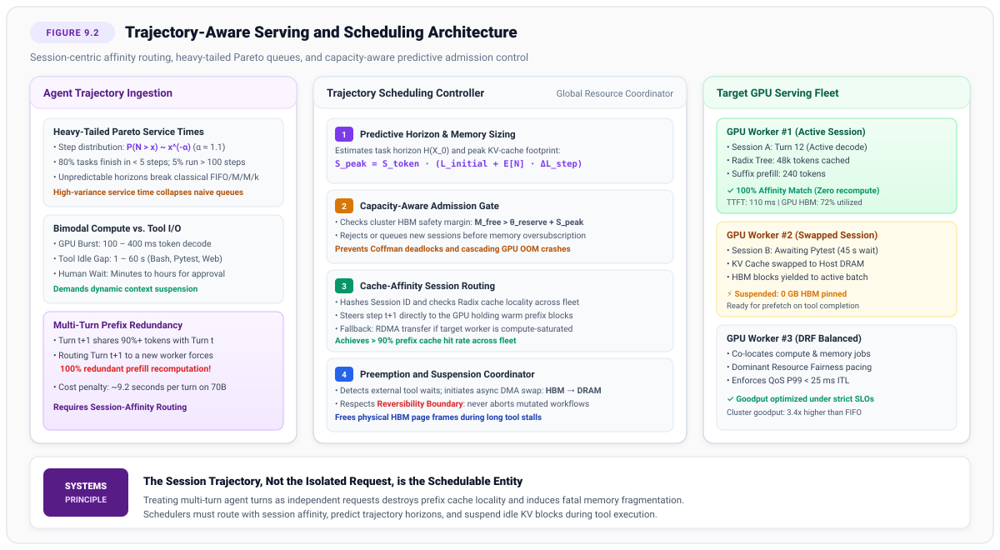
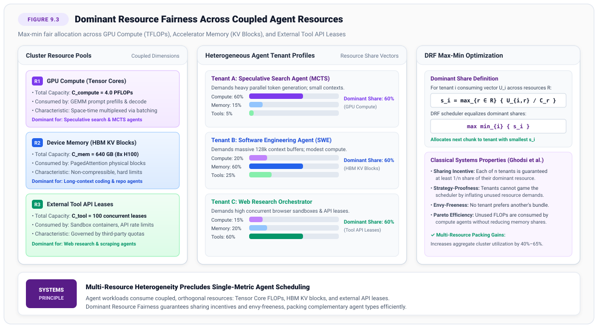
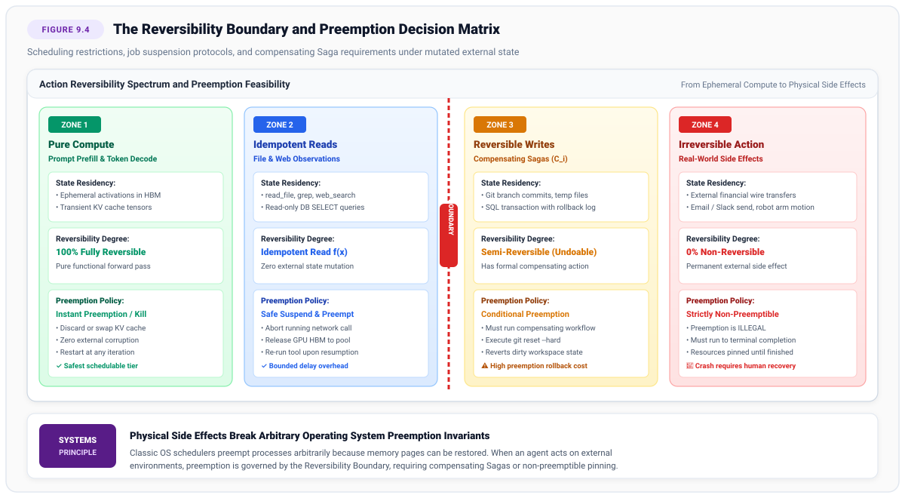

# Trajectory Scheduling {#sec-vol3-trajectory-scheduling}

::: {layout-narrow}
::: {.column-margin}

\chapterminitoc

:::
:::

## Purpose {.unnumbered .unlisted}

_How do we schedule heterogeneous, heavy-tailed, and unpredictable agent trajectories across shared accelerator clusters without memory collapse or starvation?_

Classical large language model (LLM) serving runtimes (such as vLLM and TensorRT-LLM) are engineered around request-level abstractions: each request arrives independently, consumes a relatively predictable number of prefill tokens, decodes autoregressively, and exits. Autonomous agent workloads break every fundamental assumption of this classical queueing paradigm. An agent session is not an isolated query; it is an extended, stateful control loop spanning tens to hundreds of discrete turns.

Trajectory workloads exhibit three pathological systems characteristics: service times follow heavy-tailed Pareto distributions where a tiny fraction of runaway tasks consume the majority of cluster resources; execution is bimodal, interleaving sub-second GPU decode bursts with multi-second external tool pauses; and consecutive turns exhibit massive prefix cache locality. If the cluster scheduler treats each turn as an independent request, cluster goodput collapses: consecutive turns are routed randomly across GPU workers, destroying prefix cache hit rates and triggering redundant prefill recomputations. Furthermore, because an agent admitted at Step 1 with a 2k-token prompt can expand to a 128k-token context by Step 50, oblivious admission control causes catastrophic accelerator memory exhaustion.

This chapter develops the systems architecture of:

- Trajectory-aware scheduling
- Cache-affinity routing
- Multi-resource fair allocation under Dominant Resource Fairness (DRF)
- Preemption policies rigorously bounded by external reversibility constraints

::: {.content-visible when-format="pdf"}

\newpage

:::

\begin{marginfigure}
\mlagentstack{20}{30}{25}{95}{25}{15}
\caption{The Agentic Machine Learning Systems Stack. Trajectory Scheduling operates at Layer 3 (Serving \& Memory).}
\end{marginfigure}

::: {.callout-learning-objectives}

- Characterize the heavy-tailed Pareto service-time distributions of autonomous agent trajectories
- Explain why request-level schedulers cause severe head-of-line blocking and prefix cache thrashing
- Implement session-centric and cache-affinity routing algorithms to maximize Radix prefix reuse (@sec-vol3-prefix-caching-paging)
- Design predictive admission control algorithms that prevent cluster Out-Of-Memory (OOM) thrashing
- Analyze the constraints imposed by external reversibility boundaries on job preemption and migration

:::

## The Post-Request Serving Dilemma {#sec-vol3-scheduling-intro}

Classical accelerator serving runtimes—such as vLLM, TensorRT-LLM, and Triton Inference Server—are engineered around request-level queueing abstractions [@kwon2023; @sheng2023flexgen]. An incoming client query is placed in an admission queue, batched with concurrent requests via continuous iteration-level scheduling, autoregressively decoded to completion, and evicted. Once the final token is emitted, all temporary activation and Key-Value (KV) memory is immediately reclaimed.

Autonomous agent workloads dismantle every foundational assumption of this classical queueing paradigm. An agent session is not an isolated request; it is an extended, stateful, and non-deterministic trajectory spanning tens or hundreds of discrete interaction turns. Operating clusters under this post-request regime exposes four acute systems challenges:

1. **Heavy-Tailed Pareto Service Times:** Unlike stateless queries with well-behaved, narrow latency distributions, agent trajectories exhibit extreme service-time variance ($1.0 < \alpha < 1.4$). A tiny fraction ($3\%\text{--}5\%$) of complex debugging tasks expand into massive multi-step journeys that consume the majority of cluster compute resources.
2. **Bimodal Execution and Blocking Tool Delays:** Agent execution alternates between sub-second GPU decode bursts and lengthy external tool delays (compiling codebases, executing integration test suites, or awaiting human approval). Holding multi-gigabyte KV caches pinned in high-cost GPU high-bandwidth memory (HBM) during these blocking delays induces severe memory starvation.
3. **Expanding Memory Footprints and Admission Deadlocks:** An agent admitted at Step 1 with a compact $2\text{k}$-token context may expand to $64\text{k}$ or $128\text{k}$ tokens by Step 30. Oblivious schedulers that admit sessions based only on current context size suffer catastrophic out-of-memory (OOM) thrashing and deadlock.
4. **Irreversible Actions under Preemption:** In classical batch clusters, an interrupted job can be killed and restarted from scratch. In an agent trajectory, intermediate actions perform real mutations on external filesystems, databases, and network APIs. Schedulers cannot simply abort an in-flight trajectory without executing compensating actions or preserving checkpointed event streams.

To achieve high cluster efficiency, an agentic scheduler must optimize for **Trajectory Goodput** ($G$)—the rate of successfully certified task completions per unit cost. This requires co-designing:

- **Cache-affinity routing**: Directing consecutive turns to the same GPU to maximize Radix prefix reuse (@sec-vol3-prefix-caching-paging).
- **Predictive admission control**: Forecasting trajectory horizon lengths.
- **Stateful suspension mechanisms**: Managing bimodal execution dynamically.

This chapter formalizes the systems principles of trajectory scheduling. In @sec-vol3-scheduling-workload-characterization-heavy-tails, we characterize empirical heavy-tailed Pareto distributions and prove why classical queueing models fail. In @sec-vol3-scheduling-the-memory-constrained-serving-problem, we dissect memory pressure and admission deadlocks. We formulate predictive horizon sizing in @sec-vol3-scheduling-predictive-horizon-sizing-and, examine scheduling approximations under unknown service times, and analyze safe preemption policies across the remainder of the chapter.

## Workload Characterization {#sec-vol3-scheduling-workload-characterization-heavy-tails}

In traditional web search and stateless inference serving, request service times follow narrow, unimodal distributions (such as Gaussian or light-tailed Poisson distributions) with well-behaved means and finite variance [@kleinrock1975queueing]. Schedulers relying on classical $M/M/k$ or $M/G/k$ queueing models exploit this predictable variance to establish tight tail latency Service Level Agreements (SLAs) [@harchol-balter2013].

In stark contrast, empirical traces collected from autonomous agents—such as software engineering agents solving real-world GitHub issues on SWE-bench [@jimenez2024swebench] or web navigation agents—display extreme, heavy-tailed Pareto service-time distributions.

### Empirical step distributions and Pareto characteristics

Unlike stateless LLM requests which follow predictable Gaussian or Poisson arrival distributions, multi-step agent trajectories exhibit severe heavy-tailed behavior. The probability that an agent task requires $N$ steps is formally modeled by a Pareto distribution (detailed mathematically in @sec-vol3-appendix-math-pareto).

In real-world agent clusters, empirical measurements reveal tail indices that dictate that the theoretical variance of the service time distribution is infinite:

- **Short Trajectories (The Bulk):** Approximately 70 to 80 percent of tasks resolve quickly in fewer than 5 steps (e.g., simple file queries, targeted linting fixes, straightforward factual answers).
- **Heavy-Tailed Long Trajectories (The Heavy Tail):** A critical 3 to 5 percent of tasks expand into massive multi-step reasoning journeys exceeding 80 to 500 steps (e.g., complex architectural refactoring, subtle race condition debugging, multi-repository migrations).

This infinite variance fundamentally invalidates traditional scheduling mechanisms.

When variance is unbounded, classical queueing models completely collapse. In standard queueing theory, the mean waiting time is directly proportional to the variance of the service time (a relationship formally governed by the Pollaczek-Khinchine formula, detailed in @sec-vol3-appendix-math-queueing).

Under heavy-tailed Pareto workloads, this variance approaches infinity. In practical clusters, this mathematical reality manifests as catastrophic Head-of-Line (HoL) blocking: when a standard First-In-First-Out (FIFO) queue schedules a 200-step agent, it monopolizes accelerator resources for tens of minutes, causing queue backpressure that delays hundreds of quick 2-step tasks.

| Workload Domain          |   Benchmark / Trace    | Mean Steps $\mathbb{E}[N]$ | P99 Steps | Sample Step Variance $s^2$ | Mean Tool Wait Fraction | Mean Context Growth / Step | Peak KV Memory (70B GQA) |
|:-------------------------|:----------------------:|:--------------------------:|:---------:|:--------------------------:|:-----------------------:|:--------------------------:|:------------------------:|
| **Stateless Serving**    |  LMSYS Chatbot Arena   |            1.0             |    1.0    |            0.0             |           0.0%          |          0 tokens          |          0.8 GB          |
| **Multi-Turn Chat**      |        MT-Bench        |            2.0             |    2.0    |            0.0             |           0.0%          |         450 tokens         |          1.4 GB          |
| **Web Navigation**       |  WebArena / VisualWeb  |            7.4             |    35.0   |            48.2            |          72.4%          |        1,850 tokens        |         14.2 GB          |
| **Software Engineering** |   SWE-bench Verified   |            24.8            |   142.0   |           812.6            |          84.1%          |         820 tokens         |         22.4 GB          |
| **Deep Research**        | GAIA / Research Fleets |            38.2            |   260.0   |          1,440.0           |          88.6%          |        1,400 tokens        |         34.8 GB          |

: **Empirical Workload Characteristics across Serving Regimes**: Mean and tail step counts, step variance, tool wait fraction, context growth, and peak KV memory across stateless text generation, multi-turn chat, and autonomous agent trajectories. {#tbl-vol3-scheduling-workload-comparison}

The variance column is a sample statistic, and every trace produces a finite one: a measured set of trajectories has a largest element, so its variance is bounded by construction. That is the trap. Each row's sample standard deviation sits within about 15 percent of its own mean, which is the signature of a light-tailed distribution and not of the power law the traces are drawn from. The sample moment understates the population moment precisely because the trace is truncated, and it will jump on the next trace that happens to catch one more long trajectory. A scheduler sized from this column is sized from an artifact of the measurement window rather than from the workload.

### Bimodal temporal execution dynamics

Beyond step-count variance, the temporal profile of each individual step is intensely bimodal:

1. **Active Compute Phase ($100\text{ ms -- } 500\text{ ms}$):** The agent submits its context to the GPU. The serving engine executes prompt prefill and decodes thought tokens and tool-call arguments.
2. **Tool I/O Wait Phase ($1\text{ s -- } 60\text{ s}$):** The agent halts token generation while an external sandbox executes bash commands, runs test suites, queries databases, or scrapes web pages.
3. **Human Approval Wait Phase ($1\text{ minute -- } 24\text{ hours}$):** If the agent requires supervisory consent for a privileged action, execution pauses indefinitely in an external mailbox queue.

As demonstrated in @tbl-vol3-scheduling-workload-comparison, autonomous agents spend between 70 and 90 percent of their end-to-end trajectory duration completely idle with respect to GPU compute. If a scheduler naively holds GPU resources during these extended tool-wait gaps, cluster utilization falls to between 11 and 28 percent across these workloads, with the deep-research fleet the worst of them.

### Human-in-the-loop (HITL) suspend and resume

The most extreme form of tool-wait bimodal execution occurs during **Human-in-the-Loop (HITL)** escalations. When an agent encounters a critical ambiguity, detects a destructive boundary condition (e.g., modifying production databases), or reaches a predefined permission barrier, it must pause execution to request human intervention.

Because human response times range from minutes to days, the scheduler cannot simply block. Instead, it must execute a **Suspend-to-Disk** operation. The agent's complete KV cache is flushed from HBM, and its trajectory event stream (the immutable sequence of past actions and observations) is persisted to cold storage (e.g., S3 or a relational ledger). The agent process terminates.

When the human operator provides feedback or approval, the scheduler executes a **Resume** operation. The orchestrator re-hydrates the agent by fetching the event stream, spinning up a new sandboxed execution context (@sec-vol3-sandboxing-isolation), and passing the trajectory back into the inference engine. Because the entire history is treated as an immutable ledger (@sec-vol3-telemetry-deterministic-event-recording-and), the agent resumes execution seamlessly, incorporating the human's asynchronous input as just another observation in its linear event stream.

## Memory-Constrained Serving {#sec-vol3-scheduling-the-memory-constrained-serving-problem}

In stateless serving, memory sizing is straightforward: each request consumes a bounded quantity of memory that is completely released once the final token is generated. In agentic serving, however, memory allocation is dynamic, cumulative, and persistent.

### The expanding context footprint trap

When an agent is admitted to the cluster at Step 1, its initial prompt footprint is modest (e.g., $L_1 = 3\text{,}500$ tokens of system instructions and task description). By Step 35, the accumulation of file read outputs, bash execution logs, and conversation history expands the context to $L_{35} = 48\text{,}000$ tokens.

On a 70B-parameter model running Grouped-Query Attention (GQA) in FP16 precision ($S_{\text{token}} \approx 328\text{ kB/token}$ across 80 layers), memory consumption scales dramatically:

$$S_{\text{KV}}(L_1) \approx 3\text{,}500 \times 328 \times 10^3 \approx 1.15 \text{ GB}$$

$$S_{\text{KV}}(L_{35}) \approx 48\text{,}000 \times 328 \times 10^3 \approx 15.74 \text{ GB}$$

If a cluster scheduler performs capacity checks based solely on an agent's initial memory footprint ($1.15\text{ GB}$), it will admit far more concurrent sessions than the physical accelerator memory can sustain. As these admitted sessions progress concurrently, their aggregate KV-cache demand expands by $10\times$ to $20\times$.

### Coffman deadlocks in shared KV pools

When total aggregate KV-cache demand exceeds physical accelerator capacity, the cluster enters an unrecoverable resource deadlock. This pathology represents a classic systems deadlock governed by the four Coffman conditions [@coffman1971]:

1. **Mutual Exclusion:** Physical PagedAttention blocks (@sec-vol3-prefix-caching-paging) in GPU HBM cannot be simultaneously written by multiple distinct agent sessions.
2. **Hold and Wait:** In-flight agent sessions retain ownership of physical blocks allocated during earlier turns while demanding additional physical blocks to generate new response tokens.
3. **No Preemption:** Under standard serving runtimes, allocated physical KV blocks cannot be forcibly reclaimed from an active sequence without aborting the entire request.
4. **Circular Wait:** Agent Session 1 holds blocks in GPU A while requesting free frames to decode; concurrent sessions hold all remaining frames. No session can complete, creating a closed dependency loop.

In production clusters without predictive admission control, Coffman deadlocks manifest as sudden, cluster-wide CUDA Out-of-Memory (OOM) fatal crashes [@sheng2024fairness]. Because standard GPU allocators lack kernel-level page swapping when HBM is completely exhausted, the runtime crashes worker processes, destroying hundreds of active workflows simultaneously.

The expanding footprint is not unique to accelerator memory, and neither is the way a cluster loses the ability to save itself once that footprint outgrows the capacity that was provisioned for it. A managed database control plane crossed the same boundary in 2015, and the published postmortem is unusually explicit about what stopped working (\ref{ws-scheduling-dynamodb-2015}).

::: {#ws-scheduling-dynamodb-2015 .callout-war-story title="The DynamoDB metadata service overload (2015)"}

**Context**: Each DynamoDB storage server holds an assigned group of table partitions, called a membership, and periodically retrieves that assignment from a shared metadata service. Over the months preceding September 2015, customers rapidly adopted Global Secondary Indexes, and because a global secondary index carries its own partitions on storage servers, every membership message grew [@aws2015dynamodb].

**Mechanism**: A storage server that cannot retrieve its membership within a fixed time budget retries the request and temporarily disqualifies itself from accepting traffic. On September 20, 2015 at 2:19am PDT, a brief network disruption caused a portion of the US-East storage fleet to request membership at once. The messages were now large enough that a share of the responses exceeded the retrieval and transmission time the storage servers allowed. Those servers timed out, removed themselves from service, and retried, and the retries held the metadata service at saturation. AWS reported that it lacked detailed monitoring of membership size and had not allocated enough metadata service capacity for the heavier requests.

**Impact**: By 2:37am PDT the DynamoDB error rate had stabilized at approximately $55\%$, a level beyond anything the service had seen in the previous three years. Operators could not add capacity, because the administrative requests that would have added it had to pass through the same saturated service. Service was restored only after they paused requests to the metadata service at 5:06am PDT, which cut retry load enough for capacity to be added; error rates returned to normal at 7:10am PDT. EC2 Auto Scaling, which depends on DynamoDB, remained delayed until 10:52am PDT.

**Fix**: AWS increased metadata service capacity, instrumented monitoring on membership size, reduced the rate at which storage nodes request membership data, lengthened the time allowed to process those queries, and segmented the service so each metadata instance serves only a portion of the storage fleet.

**Systems lesson**: Capacity had been sized against a per-client footprint that then grew with an unrelated product feature, and nothing measured the growth. Once aggregate demand crossed capacity, the timeout-and-retry path converted a shortfall into a multiplier, and the system retained no way to refuse work, including the work of its own repair. This is the shape a trajectory scheduler inherits when it admits sessions on their current context length: the footprint that decides whether the cluster survives is the one at step 35, not the one at step 1, and a runtime with no gate on that quantity loses its capacity to recover along with its capacity to serve. Admission control is what preserves the ability to act.

:::

## Predictive Admission Control {#sec-vol3-scheduling-predictive-horizon-sizing-and}

To eliminate OOM crashes and admission deadlocks, the cluster scheduler must decouple admission from instantaneous memory availability. It must implement **Capacity-Aware Predictive Admission Control**, reserving memory based on predicted trajectory horizons [@agrawal2024sarathi; @ferguson2012jockey].

### Horizon prediction formulation

Upon receiving a new task prompt $X_0$, the scheduler passes the task representation through a lightweight predictive horizon model $f_\theta(X_0)$:

$$\left( \widehat{N}, \widehat{\Delta L} \right) = f_\theta(X_0)$$

where $\widehat{N}$ is the predicted total step count, and $\widehat{\Delta L}$ is the expected average token expansion rate per turn.

The predicted peak KV-cache memory requirement for session $j$ is calculated as:

$$S_{\text{peak}}^{(j)} = S_{\text{token}} \cdot \left( L_{\text{initial}}^{(j)} + \widehat{N}^{(j)} \cdot \widehat{\Delta L}^{(j)} \right)$$

To account for heavy-tailed variance, the scheduler applies a conservative quantile factor $\beta$ (e.g., targeting the 90th percentile of predicted demand):

$$S_{\text{reserved}}^{(j)} = S_{\text{peak}}^{(j)} + \beta \cdot \sigma_S^{(j)}$$

### Capacity-aware admission invariant

Let $M_{\text{HBM}}^{\text{total}}$ be the total physical HBM capacity across the cluster worker fleet, and let $\theta_{\text{reserve}}$ denote a hard safety reserve (typically $10\%$ to $15\%$ of total HBM) maintained to absorb short-term speculative token generation bursts.

At any scheduling cycle, let $\mathcal{A}_{\text{active}}$ be the set of currently active, admitted trajectories. A newly arriving trajectory $k$ with initial prompt $X_0^{(k)}$ is admitted to the cluster if and only if:

$$\sum_{j \in \mathcal{A}_{\text{active}}} S_{\text{reserved}}^{(j)} + S_{\text{reserved}}^{(k)} \le M_{\text{HBM}}^{\text{total}} - \theta_{\text{reserve}}$$

If this condition is violated, the scheduler refuses to admit trajectory $k$ to the active GPU pool. Instead, the task is enqueued in a priority admission queue in host memory. By enforcing this strict capacity invariant, the cluster mathematically guarantees that admitted workflows can expand to their predicted horizons without ever triggering memory-exhaustion deadlocks or OOM worker crashes.

The ordering of these stages is itself a design decision. Horizon prediction has to run ahead of the admission gate because the gate needs a predicted size to test, and the cache-affinity router that @fig-vol3-scheduling-architecture places after the gate has to run last, because routing a trajectory that will later be evicted for memory wastes the warm prefix it was sent to.

::: {#fig-vol3-scheduling-architecture fig-env="figure" fig-pos="htb" fig-cap="**Trajectory-Aware Serving and Scheduling Architecture**: Incoming heavy-tailed agent tasks undergo horizon prediction and capacity-aware admission control before being dispatched via cache-affinity routing to GPU workers maintaining warm Radix tree prefixes." fig-alt="Diagram of a trajectory-aware serving and scheduling architecture in three stacked bands. The top band lists three agent workload properties: heavy-tailed Pareto service times, bimodal compute versus tool I/O, and multi-turn prefix redundancy. The middle band shows the trajectory scheduling controller with four numbered stages: predictive horizon and memory sizing, capacity-aware admission gate, cache-affinity session routing, and preemption and suspension coordination. The bottom band shows three GPU workers, one running an active session against a warm radix tree cache, one with its key-value cache swapped to host memory while it waits on a tool, and one balanced by dominant resource fairness."}

:::

## Scheduling Under Unknown Service Times {#sec-vol3-scheduling-scheduling-under-unknown-service}

Because horizon predictors cannot achieve 100 percent precision on open-ended creative tasks, the scheduler must also implement queueing disciplines that behave robustly under unknown, stochastic service times.

### Shortest remaining processing time (SRPT)

In classical scheduling theory, shortest remaining processing time (SRPT) is mathematically proven to minimize mean response time and queue waiting time across arbitrary workloads [@harchol2001srpt; @harchol-balter2013]. Under SRPT, the job with the smallest remaining work is always scheduled first.

However, true SRPT requires exact knowledge of remaining service time, which is unavailable in autonomous agent execution. If a scheduler relies naively on an imperfect predictor $\widehat{N}_{\text{rem}}$, tasks that exceed their predicted horizon risk starvation.

### Least attained service (LAS) scheduling

When service times follow heavy-tailed distributions with unknown durations, the optimal non-clairvoyant scheduling discipline is **Least Attained Service (LAS)**, also known as Feedback or Foreground-Background (FB) scheduling [@kleinrock1975queueing; @harchol-balter2013].

Under LAS:

1. The scheduler tracks the total cumulative service (measured in executed steps $n_i$ or total tokens generated $T_i$) attained by each active session.
2. At every scheduling quantum, the scheduler prioritizes the session that has attained the least total service:

   $$i^* = \arg\min_{j \in \mathcal{A}_{\text{active}}} \left\{ n_j \right\}$$

3. If multiple sessions share the identical minimum attained service, they share compute resources equally via processor sharing.

### Why LAS dominates heavy-tailed agent workloads

The mathematical superiority of LAS on Pareto distributions stems from the property of **decreasing hazard rates** (or "the longer you run, the longer you will continue to run"):

$$\mathbb{P}(N > x + \delta \mid N > x) \text{ increases with } x$$

In an exponential distribution, a job that has run for 10 minutes is no more likely to finish in the next minute than a brand new job (memorylessness). In contrast, in a heavy-tailed Pareto distribution with $\alpha \approx 1.1$, elapsed service carries information about the work that remains, and the tail index together with the trajectory statistics in @tbl-vol3-scheduling-workload-comparison is enough to size that remainder.

::: {#nbk-scheduling-attained-service-residual .callout-notebook title="Remaining work after 50 attained steps"}

**Problem**: Under the Pareto service-time model, how many further steps should a scheduler expect from an agent that has already executed 50 steps, and how does that expectation compare with the one for a task drawn fresh from the same queue?

**Variables**: The SWE-bench Verified row of @tbl-vol3-scheduling-workload-comparison supplies two measured quantities, a mean of $\mathbb{E}[N] = 24.8$ steps and a 99th percentile of $142$ steps. The tail index $\alpha = 1.1$ is this section's working value from the empirical range $1.0 < \alpha < 1.4$, and it is the one input not read off the table. Step counts are treated as continuous, and the survival function is the Pareto form of @sec-vol3-appendix-math-pareto, $\mathbb{P}(N > x) = (x_{\min}/x)^{\alpha}$. The memoryless baseline is an exponential distribution fitted to the same mean.

**Math**: The Pareto mean $\mathbb{E}[N] = \alpha x_{\min} / (\alpha - 1)$ pins the scale parameter to the measured mean:

$$x_{\min} = \frac{24.8 \times 0.1}{1.1} = 2.25\text{ steps}$$

The fit is checkable, because those same two parameters must also reproduce the measured tail:

$$\mathbb{P}(N > 142) = \left( \frac{2.25}{142} \right)^{1.1} = (0.01585)^{1.1} = 0.010$$

The fitted distribution places 1.0 percent of tasks beyond 142 steps, which is exactly what a P99 of $142$ asserts, so the tail index and the table agree. Conditioning on 50 attained steps is then a ratio of survival probabilities, and the scale parameter cancels:

$$\mathbb{P}(N > 100 \mid N > 50) = \frac{(x_{\min}/100)^{1.1}}{(x_{\min}/50)^{1.1}} = \left( \frac{50}{100} \right)^{1.1} = 0.467$$

The exponential baseline answers the same question with $e^{-50/24.8} = 0.133$. Integrating the conditional survival curve gives the mean residual life, $\mathbb{E}[N - x \mid N > x] = x/(\alpha - 1)$, which for an agent 50 steps in is:

$$\frac{50}{1.1 - 1} = \frac{50}{0.1} = 500\text{ steps}$$

**Result**: The 50-step trajectory is expected to run 500 more steps, against 24.8 for a task pulled fresh from the same queue, a factor of $500 / 24.8 = 20.2$. It is also $0.467 / 0.133 = 3.5$ times likelier to survive another 50 steps than the memoryless model predicts.

**Systems insight**: Attained service is the strongest remaining-work estimator available to a non-clairvoyant scheduler, and under a decreasing hazard rate it points the opposite way from operator intuition, since the session closest to finishing is the one that has barely started. Demoting the aged session is therefore not a fairness compromise imposed on top of LAS but the closest feasible approximation of SRPT when the horizon is unknown.

:::

By prioritizing jobs with low attained service, LAS delivers profound systems advantages:

- **Instantaneous Fast-Path for Simple Queries:** The 80 percent of agent tasks that require fewer than 5 steps achieve near-zero waiting time, completing almost instantaneously.
- **Natural Looping Protection:** If an agent enters a pathological reasoning loop (e.g., repeatedly editing a file, triggering a syntax error, and failing to diagnose the cause), its attained service rapidly accumulates. LAS automatically penalizes the runaway job, downgrading its priority and preventing it from monopolizing the GPU cluster.

## Preemption and Suspension {#sec-vol3-scheduling-preemption-and-suspension-suspending}

Because agents spend up to 90 percent of wall-clock time waiting for external environments, holding physical HBM frames during I/O stalls destroys serving throughput. Schedulers must actively preempt and suspend trajectories across I/O boundaries [@ousterhout1980medusa].

### The three-phase suspension lifecycle

When an agent issues a tool execution call (e.g., `bash(pytest tests/)`), the scheduling controller transitions the session through a three-phase lifecycle:

1. **Phase 1: Yield and Mark Inactive:** The model decodes the tool call token sequence and emits an end-of-turn delimiter. The scheduler detects the tool invocation, removes the session from the active GPU dispatch ring, and flags its status as `SUSPENDED_IO`.
2. **Phase 2: Asynchronous Memory Evacuation:**
   - If cluster HBM pressure is low ($M_{\text{free}} > 30\%$), the runtime leaves the session's physical KV blocks in HBM, simply decrementing their reference counts in the Radix tree (@sec-vol3-prefix-caching-paging) to allow lazy LRU eviction if needed.
   - If cluster HBM pressure is high ($M_{\text{free}} \le 30\%$), the scheduler issues an asynchronous direct memory access (DMA) swap command over PCIe Gen5 x16, offloading the session's physical KV blocks to Host DRAM. The freed HBM page frames are returned to the global allocator for immediate use by active requests.
3. **Phase 3: Event-Driven Prefetch and Resumption:** The tool execution completes in its isolated sandbox container. The sandbox runtime posts an event containing stdout and exit code to the scheduler's completion queue. The scheduler signals the memory manager to prefetch the cached KV blocks from Host DRAM back to GPU HBM, restores the session's logical page table, and places the session in the ready queue for its next token generation step.

By overlapping DMA transfers with tool execution termination, the scheduler completely masks transfer latency, ensuring zero perceived pause when the agent resumes execution.

## Dominant Resource Fairness {#sec-vol3-scheduling-dominant-resource-fairness-drf}

Modern agent platforms serve heterogeneous tenants with widely varying operational requirements. Traditional scheduling mechanisms that optimize for a single metric (such as GPU compute hours or total token count) fail completely when resources are multi-dimensional and coupled.

### Multi-resource coupling in agent workloads

An autonomous agent cluster is governed by three primary orthogonal resource pools:

1. **GPU Compute Capacity ($C_{\text{compute}}$):** Total Tensor Core floating-point throughput (measured in PFLOPs or GPU cores) available for matrix multiplication.
2. **Device Memory Capacity ($C_{\text{mem}}$):** Total physical HBM capacity (measured in gigabytes or PagedAttention blocks) dedicated to storing KV-cache activations.
3. **Tool Execution Leases ($C_{\text{tool}}$):** Finite external execution slots (measured in concurrent sandbox containers, rate-limited API token quotas, or licensed compiler instances).

Different agent architectures exhibit radically divergent resource consumption profiles:

- **MCTS Speculative Reasoning Agents** (@sec-vol3-search-monte-carlo-tree-search): Dominated by GPU compute ($60\%$ of compute quota) to explore wide search trees; minimal memory footprint due to aggressive Copy-on-Write sharing (@sec-vol3-search-tree-structured-kv-cache-allocation); zero tool calls during pure thinking phases.
- **Repository-Scale Coding Agents:** Dominated by device memory ($75\%$ of HBM quota) to retain $128\text{k}$-token context files; moderate compute requirements; modest tool usage.
- **Web Scraping and Research Orchestrators:** Dominated by tool concurrency ($80\%$ of sandbox leases) to run dozens of headless browser instances; low GPU compute and modest context footprints.

### Dominant resource fairness formulation

To allocate these coupled resources fairly without allowing any single tenant to monopolize the cluster, schedulers extend **Dominant Resource Fairness (DRF)** to agent trajectories [@ghodsi2011; @grandl2014].

Let $\mathcal{R} = \{\text{compute}, \text{mem}, \text{tool}\}$ represent the set of resource types, with total cluster capacities $\mathbf{C} = (C_{\text{compute}}, C_{\text{mem}}, C_{\text{tool}})$.

Suppose tenant $i$ requires a resource demand vector $\mathbf{r}_i = (r_{i,\text{compute}}, r_{i,\text{mem}}, r_{i,\text{tool}})$ per concurrent agent instance. The normalized share of resource $r$ consumed by tenant $i$'s allocation vector $\mathbf{U}_i$ is:

$$u_{i,r} = \frac{U_{i,r}}{C_r}$$

::: {.callout-definition title="Dominant resource"}
The **dominant resource** of tenant $i$ is the resource type for which tenant $i$ has the largest normalized share:

$$s_i = \max_{r \in \mathcal{R}} \{ u_{i,r} \} = \max \left\{ \frac{U_{i,\text{compute}}}{C_{\text{compute}}}, \, \frac{U_{i,\text{mem}}}{C_{\text{mem}}}, \, \frac{U_{i,\text{tool}}}{C_{\text{tool}}} \right\}$$

The scalar $s_i$ is tenant $i$'s **dominant share**.
:::

The DRF scheduling algorithm operates iteratively: in each allocation round, the scheduler identifies the tenant with the lowest dominant share:

$$i^* = \arg\min_{i} \{ s_i \}$$

and allocates the next agent task or execution quantum to tenant $i^*$, updating its consumption vector $\mathbf{U}_{i^*}$ and recalculating its dominant share.

### Four classical systems guarantees

As proven by @ghodsi2011, DRF satisfies four vital properties essential for multi-tenant agent infrastructures:

1. **Sharing Incentive:** Each of $n$ active tenants is guaranteed to receive at least a $1/n$ share of its dominant resource. No tenant is ever worse off sharing the multi-resource cluster than having a dedicated partition of $1/n$ of all resources.
2. **Strategy-Proofness:** A tenant cannot manipulate the scheduler to acquire more resources by falsely inflating its demand for resources it does not actually use.
3. **Envy-Freeness:** No tenant prefers the resource allocation bundle given to any other tenant.
4. **Pareto Efficiency:** It is impossible to allocate more resources to any tenant without reducing the allocation of another tenant.

By packing complementary agent workloads together—co-locating compute-heavy MCTS agents with memory-heavy coding agents and tool-heavy research agents—DRF increases aggregate cluster utilization by **40 to 65 percent** compared to static partitioning [@grandl2014]. That gain comes from the equalization itself. Because each of the three tenant personas in @fig-vol3-scheduling-drf is dominated by a different resource, holding their dominant shares equal leaves each tenant's non-dominant resources free for the others to consume, which is exactly the slack that static partitioning strands.

::: {#fig-vol3-scheduling-drf fig-env="figure" fig-pos="htb" fig-cap="**Dominant Resource Fairness Across Coupled Agent Resources**: Max-min fair allocation balancing GPU Compute FLOPs, HBM KV blocks, and external tool API leases across heterogeneous agent personas to maximize cluster packing efficiency." fig-alt="Diagram of dominant resource fairness across three cluster resource pools: GPU compute, device memory holding key-value blocks, and external tool API leases. Three agent tenant profiles are shown with their resource share vectors, a speculative search agent dominated by compute, a software engineering agent dominated by memory, and a web research orchestrator dominated by tool leases, each reaching the same dominant share. A final panel lists the sharing incentive, strategy-proofness, envy-freeness, and Pareto efficiency properties."}

:::

## Human-in-the-Loop Approval Latency {#sec-vol3-scheduling-the-asymmetric-latency-disparity}

In critical enterprise deployments (financial transfers, infrastructure provisioning, production database migrations), agents must obtain explicit authorization from human supervisors before executing privileged actions.

### The $10^6\times$ latency mismatch

Human-in-the-loop interaction introduces an unprecedented latency disparity into computer systems scheduling:

- **Token Generation Step Latency:** $10^{-2}\text{ to } 10^{-1}\text{ seconds}$ ($10\text{ to } 100\text{ ms}$).
- **Automated Sandbox Execution:** $10^{0}\text{ to } 10^{1}\text{ seconds}$ ($1\text{ to } 30\text{ s}$).
- **Human Review and Approval:** $10^{2}\text{ to } 10^{5}\text{ seconds}$ ($5\text{ minutes to } 24\text{ hours}$).

The latency disparity between neural token generation and human operator review exceeds **six orders of magnitude ($10^6\times$)**.

### Systems architecture for human suspension

Holding server threads, connection sockets, or accelerator memory across human review intervals is an architectural catastrophe [@saltzer2009]. Runtimes must implement completely asynchronous, decoupled escalation mailboxes:

1. **State Snapshotting and Token Serialization:** When the agent generates an action requiring human approval, the runtime checkpoints the complete Agent Control Block (ACB) (@sec-vol3-descriptors-the-agent-control-block)—including conversation history, scratchpad tokens, tool call parameters, and workspace filesystem diffs.
2. **Cold-Tier Offloading:** The session's physical KV cache is serialized and flushed over the network to persistent object storage (e.g., AWS S3 or cluster Ceph storage). All device HBM frames and host DRAM allocations are completely released.
3. **Durable Mailbox Registration:** The request is assigned a unique cryptographic transaction ID and pushed to a persistent distributed message queue (e.g., Kafka or Temporal). The agent worker process terminates or returns to the global pool.
4. **Resumption via Ephemeral Warm-Up:** When the human operator approves or rejects the action via dashboard or Slack webhook, the event is consumed by the scheduling controller. The controller provisions a new worker, retrieves the serialized ACB from cold storage, executes a fast chunked prefill to reconstruct the KV state, and resumes execution seamlessly.

## Gang Scheduling and Co-Allocation {#sec-vol3-scheduling-gang-scheduling-and-co-allocation}

When an agent is deployed as part of a cooperating swarm (@sec-vol3-multi-agent-swarm-runtimes-and-state)—where multiple parallel agent instances communicate to solve a joint task (e.g., an architect orchestrating three parallel coding workers via a shared message broker)—scheduling individual agents independently causes synchronization deadlocks.

### The co-allocation deadlock

Suppose Agent A (the architect) generates code specifications and streams them over a pipe to Agent B (the implementer). If the scheduler allocates a GPU slot to Agent A while Agent B is queued waiting for memory, Agent A's output buffer fills, causing it to block. If the scheduler then deschedules Agent A to schedule Agent C, Agent B remains starved. The swarm enters a thrashing state where agents consume GPU compute solely to block on inter-agent synchronization channels.

### Gang scheduling protocols

To solve synchronized progress failures, cluster schedulers adapt classic distributed operating systems **Gang Scheduling** [@feitelson1992gang; @hindman2011]:

- **Unit of Scheduling (The Gang):** The scheduler treats the entire cooperating swarm $\mathcal{G} = \{a_1, a_2, \dots, a_K\}$ as an atomic scheduling unit.
- **All-or-Nothing Co-Allocation:** Compute slots and memory quotas across the worker fleet are allocated to the gang simultaneously. If the cluster has sufficient resources to run only $K - 1$ agents, none of the agents in gang $\mathcal{G}$ are scheduled; all remain queued.
- **Synchronized Time Slicing:** During active execution, all members of the gang are guaranteed concurrent execution across physical GPUs, enabling zero-latency shared-memory message passing and preventing synchronization starvation.

## Quality-of-Service Guarantees {#sec-vol3-scheduling-quality-of-service-qos-and-tail}

Enterprise clusters must frequently serve high-priority, user-facing interactive agents (where humans actively await token streams) alongside low-priority background autonomous batch jobs (e.g., overnight codebase indexing or extensive benchmark evaluations) [@dean2013; @zhang2024fgd].

### Multi-class priority queuing

The scheduling runtime stratifies traffic into discrete Quality-of-Service (QoS) tiers:

- **Tier 1: Interactive Real-Time (Latency-Critical):** Demands strict tail latency bounds (Time-to-First-Token $\text{TTFT} \le 300\text{ ms}$, Inter-Token Latency $\text{ITL} \le 25\text{ ms}$ at P99).
- **Tier 2: Interactive Asynchronous:** User-initiated workflows that tolerate moderate initial queuing ($\text{TTFT} \le 3\text{ s}$, $\text{ITL} \le 50\text{ ms}$).
- **Tier 3: Autonomous Batch (Throughput-Oriented):** Unattended background jobs with zero real-time service-level objectives (SLOs) (evaluated strictly on completed tasks per dollar per hour).

### Fine-grained priority preemption

When an interactive Tier 1 request arrives at a fully saturated GPU worker:

1. The scheduler immediately interrupts a running Tier 3 batch decode iteration.
2. Under fine-grained dynamic scheduling (such as FGD), the batch request's active generation is paused at the immediate token boundary [@zhang2024fgd].
3. The interactive request executes its chunked prefill and begins decoding.
4. The batch request's physical KV blocks remain resident in HBM if memory permits; otherwise, they are swapped to Host DRAM over PCIe Gen5.
5. Once the interactive burst completes, the batch request resumes execution without having violated the interactive user's P99 latency SLA.

## The Irreversibility Constraint {#sec-vol3-scheduling-the-irreversibility-constraint-scheduling}

In classical operating systems, process preemption is universally assumed to be safe. Because a CPU process operates entirely within an isolated virtual address space, the OS kernel can pause, suspend, page out, or kill a process at any machine instruction without corrupting hardware state: virtual memory pages can simply be restored from swap disk [@saltzer2009].

In agentic systems, this fundamental systems invariant is completely destroyed. Agents interact directly with external physical and digital environments. Once an agent performs a mutating action in an external system, that action cannot be undone by simply rewinding GPU memory (formally defined as the Reversibility Boundary in @sec-vol3-recovery-the-reversibility-boundary-reversible).

### External side effects and preemption

As formalized in @fig-vol3-scheduling-preemption-matrix, agent operations partition into four distinct execution zones based on their side effects:

1. **Zone 1: Pure LLM Compute (Fully Reversible):** In-GPU prompt prefill, token decoding, and internal scratchpad reasoning. State exists solely as ephemeral activations and KV tensors in GPU memory. Preemption policy: **Instantaneous Preemption / Kill**. The scheduler may evict or discard the job at any moment with zero external side effects.
2. **Zone 2: Idempotent Tool Reads (Safe Preemption):** Read-only operations (`read_file`, `grep_search`, `web_search`, database `SELECT`). By definition of idempotency ($f(x) = f(f(x))$), executing the action multiple times produces identical results without altering environment state. Preemption policy: **Safe Preemption**. The scheduler can abort an in-flight network call; restarting simply re-executes the query.
3. **Zone 3: Reversible Writes with Compensating Actions (Semi-Reversible):** Operations that alter environment state but possess a formally defined compensating inverse operation $C_i$ (e.g., committing changes to a temporary Git branch, writing temporary scratch files, executing an SQL transaction within a database rollback log). Preemption policy: **Conditional Preemption**. The scheduler cannot simply kill the agent; it must trigger the compensating workflow $C_i$ (e.g., executing `git reset --hard` or `ROLLBACK`, see @sec-vol3-recovery-distributed-sagas-for-agent) before reclaiming cluster resources.
4. **Zone 4: Irreversible Real-World Actions (Strictly Non-Preemptible):** Operations that produce permanent, non-undoable real-world state changes (e.g., transferring funds via banking API, sending an external email or Slack message, deploying code to production servers, actuating a physical robotic arm). Preemption policy: **Strictly Non-Preemptible (Pinned Execution)**. Preemption is legally and architecturally forbidden. The scheduler is strictly barred from aborting or migrating the job until the transaction confirms terminal status.

| Execution Zone |       Action Type        |         Typical Operations        |      State Residency      |     Reversibility Guarantee      |   Preemption Feasibility   |    Scheduler Action on Memory Shortage    |
|:---------------|:------------------------:|:---------------------------------:|:-------------------------:|:--------------------------------:|:--------------------------:|:-----------------------------------------:|
| **Zone 1**     |       Pure Compute       |   Prefill, autoregressive decode  |       GPU HBM / SRAM      |         100% Functional          |       Instantaneous        |        Evict / Discard / Recompute        |
| **Zone 2**     |     Idempotent Read      | `read_file`, `grep`, `web_search` |   Sandbox socket / cache  | Read Idempotent $f(f(x)) = f(x)$ |        Safe Suspend        |    Abort network call; re-issue on wake   |
| **Zone 3**     |     Reversible Write     |    Git commit, SQL transaction    | Workspace filesystem / DB | Semi-Reversible ($C_i$ inverse)  | Conditional (Compensating) | Execute compensating action $C_i$; revert |
| **Zone 4**     | Irreversible Side Effect | Wire transfer, email, live deploy |  External physical world  |        0% Non-Reversible         |     Strictly Forbidden     |   Pin execution; allocate emergency HBM   |

: **Preemption Policy across the Four Execution Zones**: Action types, state residency, reversibility guarantees, and scheduler behavior under memory shortage, governed by the reversibility of external side effects. {#tbl-vol3-scheduling-policy-matrix}

### Scheduling invariant under irreversible actions

If an agent trajectory enters Zone 4, the scheduling controller must elevate the job's priority to **Pinned Real-Time Status**. The scheduler is prohibited from evicting its memory blocks to host DRAM if the swap transfer introduces timeout risks on the external transaction.

If cluster-wide memory pressure reaches emergency thresholds while a Zone 4 action is in flight, the scheduler must shed load exclusively from Zone 1 and Zone 2 tasks, whose entries in the shortage column of @tbl-vol3-scheduling-policy-matrix permit outright eviction or a re-issued call, preserving the integrity of irreversible physical world operations.

::: {#fig-vol3-scheduling-preemption-matrix fig-env="figure" fig-pos="htb" fig-cap="**The Preemption Decision Matrix**: Categorization of agent execution into four zones governing whether an in-flight trajectory can be safely preempted, conditionally compensated, or must remain strictly pinned to completion." fig-alt="Diagram of four execution zones arranged along a reversibility spectrum, running from pure compute through idempotent reads, then across a marked boundary to reversible writes and irreversible actions. Each zone panel gives its state residency, its degree of reversibility, and its preemption policy, which moves from instant preemption to safe suspend, then to conditional preemption with a compensating action, and finally to strictly non-preemptible pinned execution."}

:::

## Production Scheduler Architecture {#sec-vol3-scheduling-production-architecture-building-a}

Implementing trajectory-aware scheduling in enterprise production requires orchestrating containerized sandboxes, GPU inference engines, and persistent state managers across distributed clusters.

### System topology on Kubernetes and Ray

A production-grade agent scheduling architecture integrates three primary open-source distributed frameworks [@moritz2018ray]:

1. **Kubernetes Custom Resource Definitions (CRDs):**
   - `AgentSession`: Represents an end-to-end multi-turn trajectory, capturing tenant identity, SLA tier, and cumulative token budgets.
   - `AgentExecutionSlot`: Represents an active GPU allocation binding a session to a specific physical inference worker.
2. **Ray Distributed Actor Plane:**
   - Inference workers run as stateful Ray actors pinned to individual GPU instances (running vLLM or SGLang engines).
   - A centralized `TrajectoryScheduler` actor maintains the global cluster page-table directory, tracks attained service metrics, and executes the DRF max-min allocation loop.
3. **Session-Affinity Routing Proxy:**
   - An ingress reverse proxy (built on Envoy or custom Rust proxies) intercepts all client turn submissions.
   - The proxy extracts the `session_id`, consults the `TrajectoryScheduler` for the session's current worker placement, and routes the HTTP request directly to the worker holding warm Radix tree prefix blocks.
4. **Hierarchical State Store:**
   - A Redis cluster maintains real-time metadata, lease locks, and active Agent Control Blocks.
   - S3-compatible object storage persists cold-tier serialized KV caches and historical trajectory execution traces for post-hoc debugging.

### Fault tolerance and write-ahead logging

In long-running agentic workflows (spanning hours or days), the probability of underlying hardware failure (e.g., uncorrectable ECC memory errors, network partitions, or spot instance preemption) is non-trivial. Classical stateless serving runtimes simply drop the request on worker failure, relying on client-side retries. In agentic systems, silently discarding a 200-step trajectory that has already mutated external state is unacceptable.

To provide robust systems reliability, schedulers implement **Event Sourcing** backed by a **Write-Ahead Log (WAL)** (detailed in @sec-vol3-recovery-trajectory-checkpointing-persistent-stategraphs). Agent state is composed of discrete conversational turns, tool invocations, and environment observations. By treating the agent's context window as an append-only ledger:

1. **Durability Before Side Effects:** Before any tool execution or external API call is initiated, the scheduler durably appends the agent's planned action to the WAL (e.g., Apache Kafka or a transactional database).
2. **Deterministic Recovery:** If a GPU worker crashes, the scheduler detects the heartbeat timeout and provisions a replacement worker. The replacement worker reads the WAL to retrieve the complete, exact sequence of historical events.
3. **KV Cache Rehydration:** Rather than re-executing the entire sequence step-by-step (which would dangerously re-trigger side effects), the replacement worker concatenates the logged events into a single contiguous text prompt. It executes one massive chunked prefill pass, rapidly regenerating the exact KV cache state in HBM, and seamlessly resumes execution.

---

## Fallacies and Pitfalls {#sec-vol3-scheduling-fallacies}

::: {.fallacy-pitfall}

**Fallacy**: *Standard HTTP load balancers (Round-Robin, Least-Connections) are adequate for multi-turn agent clusters.*

Standard load balancers possess zero awareness of accelerator memory state. In a multi-turn agent session, routing Turn $t+1$ to a different GPU than Turn $t$ destroys prefix cache locality, forcing a 100 percent redundant prefill recomputation that wastes gigabytes of memory and seconds of Tensor Core compute. Multi-turn schedulers must enforce strict session-affinity routing.

:::

::: {.fallacy-pitfall}

**Fallacy**: *Schedulers can safely treat agent tasks like traditional OS processes that can be killed and restarted at will.*

Unlike operating system threads whose state is confined to virtual memory, agents mutate external databases, issue API calls, and modify remote files. Arbitrarily terminating an agent that has performed irreversible external actions leaves corrupted, half-committed external state that cannot be fixed by restarting the neural network.

:::

::: {.fallacy-pitfall}

**Pitfall**: *Scheduling without predictive context horizon sizing.*

Admitting agent sessions based solely on their initial token footprint inevitably leads to catastrophic cluster OOM deadlocks as multi-step sessions expand concurrently. Schedulers must implement predictive capacity bounds and reserve memory tokens prior to admission.

:::

::: {.fallacy-pitfall}

**Pitfall**: *Holding GPU allocations during long external tool execution stalls.*

Allowing multi-gigabyte KV caches to sit pinned in accelerator HBM while an agent spends 45 seconds running automated test suites in a container starves concurrent requests of memory. Schedulers must automatically evacuate inactive KV blocks to host DRAM over PCIe Gen5 during extended tool stalls.

:::

::: {.fallacy-pitfall}

**Pitfall**: *Relying on client-side retries for agent fault tolerance.*

In stateless web serving, if a request fails, the client simply retries. If an agent worker crashes at step 45 of a 50-step database migration, a naive retry restarts the migration from step 1, potentially corrupting the database or duplicating non-idempotent operations. Agent fault tolerance must be handled server-side via Write-Ahead Logging and deterministic KV cache rehydration.

:::

Principle \ref{pri-vol3-heavy-tailed-scheduling} is the reason the classical scheduling results in this chapter arrive with caveats attached. Heavy-tailed service times invalidate the assumption most request-level policies rest on, that a job's age tells you little about its remaining work, and under a decreasing hazard rate that assumption inverts entirely.

## Chapter Summary {#sec-vol3-scheduling-summary}

- **Heavy-Tailed Pareto Service Times:** Agent workloads exhibit power-law service times with infinite variance ($\alpha \le 2$), rendering classical FIFO and Poisson queueing models obsolete due to severe Head-of-Line blocking.
- **Predictive Admission Control:** Multi-turn agent contexts expand by $10\times$ to $20\times$ over their lifetimes. Capacity-aware admission control predicts trajectory horizons and peak memory demand, mathematically preventing Coffman deadlocks and cluster OOM crashes.
- **Least Attained Service (LAS) Scheduling:** By prioritizing sessions with the least cumulative service, LAS provides an instantaneous fast-path for short tasks while automatically throttling runaway reasoning loops.
- **Preemption Across Bimodal I/O Gaps:** Decoupling active compute from tool waits allows schedulers to asynchronously swap idle KV caches to Host DRAM over PCIe Gen5, freeing scarce HBM page frames during multi-second tool stalls.
- **Dominant Resource Fairness (DRF):** Equalizing dominant shares across coupled, orthogonal resources (GPU FLOPs, HBM KV blocks, and external API leases) guarantees sharing incentives and envy-freeness while boosting cluster utilization by up to 65 percent.
- **Irreversible Side Effects:** Agent preemption is strictly constrained by external real-world side effects. While pure compute and idempotent reads can be preempted freely, mutating actions require compensating workflows, and irreversible actions must remain pinned to completion.
- **Fault Tolerance via WAL:** Schedulers treat agent contexts as append-only event ledgers. Using Write-Ahead Logging ensures that if a worker crashes, the trajectory can be deterministically rehydrated via a single chunked prefill without re-executing non-idempotent side effects.
