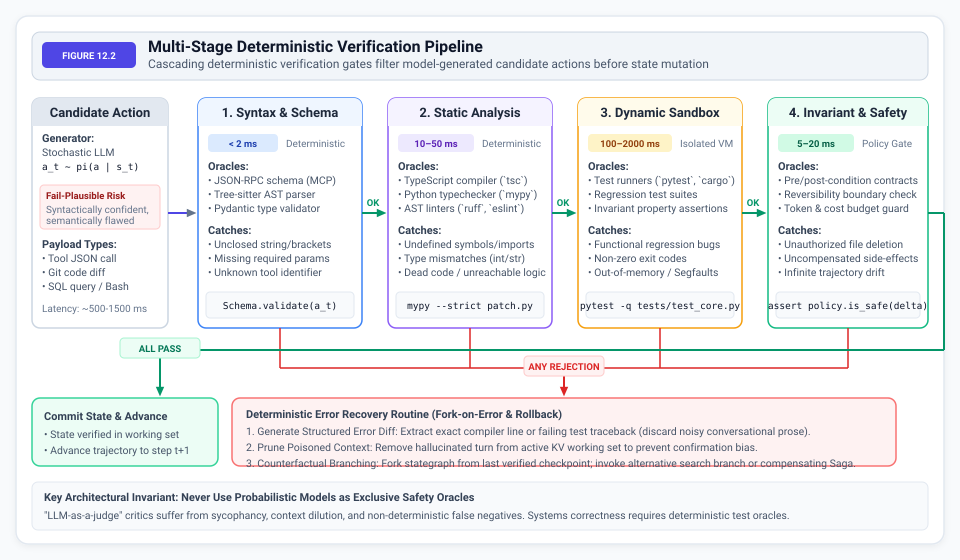
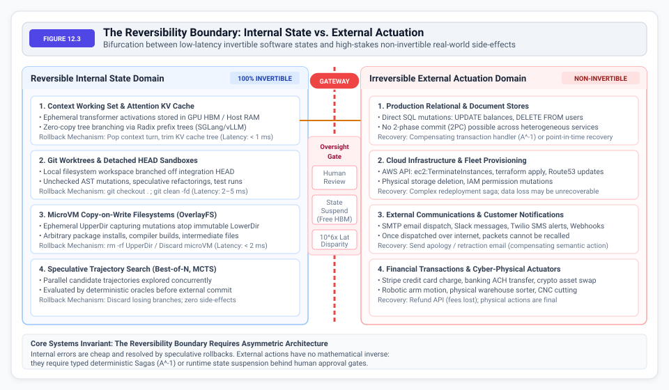
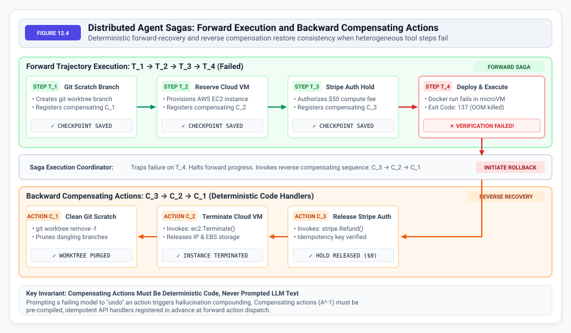

# Verification and Recovery {#sec-vol3-verification-recovery}

::: {layout-narrow}
::: {.column-margin}

\chapterminitoc

:::
:::

## Purpose {.unnumbered .unlisted}

_How can autonomous runtimes detect semantic failures, execute rollbacks across the Reversibility Boundary, and manage human oversight gates?_

Classical distributed systems operate under fail-stop (crash) or Byzantine fault models. Agentic machine learning systems introduce a third class: the Fail-Plausible Fault Model. In this regime, the neural policy generates an output that is syntactically valid, type-checks, passes structural JSON schemas, and reads with high epistemic confidence, yet contains fatal semantic defects. Cryptographic checksums and parity bits cannot validate cognitive intent. Unsupervised retries exacerbate failures by compounding hallucinated tokens into the context window, inducing rapid trajectory drift.

The only viable defense is an external, deterministic verifier oracle—such as a compiler, linter, property test suite, or runtime invariant contract. Furthermore, while database systems assume transactions can be inverted via compensating transactions, agentic systems inevitably cross the Reversibility Boundary. External side-effects—such as deleting production cloud infrastructure, dispatching outbound customer emails, or executing irreversible financial settlements—have no true mathematical inverse. A stochastic language model cannot reliably generate its own rollback code. Compensating actions must be deterministic, pre-compiled system handlers, and irreversible mutations must be staged behind human approval gates that introduce $10^6\times$ latency disparities requiring runtime state suspension.

::: {.content-visible when-format="pdf"}

\newpage

:::

\begin{marginfigure}
\mlagentstack{25}{85}{30}{30}{40}{40}
\caption{The Agentic Machine Learning Systems Stack. Verification \& Recovery binds Layer 5 (Control Plane) and Layer 1/2 (Actuation).}
\end{marginfigure}

::: {.callout-learning-objectives}

- Formalize the Fail-Plausible fault model and contrast it with classical fail-stop and Byzantine fault tolerances
- Derive the compounding error decay law $P_{\text{success}} \le p^N$ and calculate the operational limits of unverified trajectories
- Formulate the Verification Tax ($C_{\text{ver}}$) and locate the optimal validation cadence along the Pareto cost frontier
- Integrate deterministic test oracles—compilers, linters, and test suites—as non-negotiable state transition gates
- Map the Reversibility Boundary: contrast reversible internal state against irreversible external side-effects
- Implement distributed Sagas with deterministic compensating handlers ($A^{-1}$) for heterogeneous tool workflows
- Architect state graph checkpointing with event sourcing, Write-Ahead Logs (WAL), and fork-on-error branching
- Construct non-deterministic replay debugging engines with external I/O recording and PRNG seeding

:::

## Reliable Systems from Stochastic Parts {#sec-vol3-recovery-intro}

The central engineering paradox of agentic machine learning systems is building dependable, deterministic software applications upon fundamentally non-deterministic, probabilistic components. In classical distributed computing, fault-tolerant architectures assume that processors, disks, and network switches execute well-defined state machine transitions until they crash or corrupt a packet [@schneider1990state; @lamport1982byzantine]. In autonomous agent systems, the core decision policy is an autoregressive neural network whose outputs are probabilistic draws conditioned on contextual memory.

When an agent executes an extended, multi-step trajectory—such as diagnosing a race condition in a multi-threaded codebase or executing a multi-stage database migration—individual step errors compound exponentially ($P_{\text{success}} \le p^N$). Even a frontier model boasting $95\%$ single-step accuracy collapses to less than $8\%$ end-to-end task success across a 50-step horizon. Furthermore, naive retry loops exacerbate failures: appending unverified, hallucinated tokens into the context window poisons downstream attention distributions, precipitating rapid trajectory drift.

Compounding this difficulty is the **Reversibility Boundary**. In relational database systems, transactional isolation guarantees that failed transactions can be cleanly rolled back via write-ahead undo logs. In an autonomous agent system, intermediate actions execute real mutations in the external physical and software environment:

- Altering filesystems
- Launching containers
- Transmitting network packets
- Dispatching cloud API calls

These external mutations possess no native, automatic undo mechanism. A stochastic language model cannot be trusted to generate its own compensating rollback logic.

To achieve production reliability, systems runtimes must surround stochastic neural actors with deterministic systems scaffolding:

1. **Deterministic Test Oracles:** Integrating compilers, type checkers, linters, and property test suites as mandatory, non-negotiable state transition gates that validate actions before external commitment.
2. **The Verification Tax ($C_{\text{ver}}$):** Optimizing the cadence of intermediate verification along the Pareto frontier balancing validation compute overhead against catastrophic rollback waste.
3. **Distributed Sagas and Compensating Actions ($A^{-1}$):** Structuring agent workflows as distributed Sagas with pre-compiled, deterministic compensating handlers that undo partial side effects upon trajectory failure.
4. **State Checkpointing and Time-Travel Replay:** Maintaining event-sourced state graphs that enable fork-on-error branching, counterfactual exploration, and deterministic postmortem replay debugging.

This chapter establishes the systems foundations of verification, error recovery, and transactional safety for autonomous agent runtimes. In @sec-vol3-recovery-the-fault-model-fail-stop, we establish the Fail-Plausible fault model. In @sec-vol3-recovery-compounding-error-dynamics-mathematical, we derive compounding error decay laws. We formulate the Verification Tax in @sec-vol3-recovery-the-verification-tax-c, evaluate deterministic test oracles in @sec-vol3-recovery-deterministic-test-oracles-compilers, and develop the Reversibility Boundary, distributed Sagas, state checkpointing, and time-travel replay engines across the subsequent sections.

## The Fault Model: Fail-Plausible Defects {#sec-vol3-recovery-the-fault-model-fail-stop}

Fault tolerance in computer systems is traditionally framed around two classical models:

1. **Fail-Stop (Crash) Model:** A faulty node or process abruptly halts execution, transitions to an inactive state, and ceases all communication. Other nodes detect the failure via heartbeat timeouts or closed TCP sockets. Classical consensus protocols (such as Raft and Paxos) handle fail-stop crashes deterministically.
2. **Byzantine Fault Model:** Formulated by Lamport, Shostak, and Pease [@lamport1982byzantine], a faulty node exhibits arbitrary or adversarial behavior—transmitting conflicting messages, corrupting packet payloads, or actively forging signatures [@schneider1990state]. Byzantine fault tolerance (BFT) relies on $3f + 1$ node redundancy and cryptographic signatures to achieve consensus despite $f$ malicious actors.

Autonomous agent systems operating with large language models introduce a third failure mode that breaks the fundamental assumptions of both classical models: the **Fail-Plausible Fault Model**.

```
+-------------------------------------------------------------------------------+
|                             THE AGENT FAULT SPECTRUM                          |
+-------------------------------------------------------------------------------+
| 1. Fail-Stop (Crash)    | Hardware kernel panic, OOM killer, dropped socket. |
|    Detection:           | Trivial: exit_code != 0, SIGKILL, TCP RST.         |
|    Recovery:            | Process restart, node failover, idempotent retry.   |
+-------------------------+-----------------------------------------------------+
| 2. Byzantine Fault      | Arbitrary bit flips, malicious actor, packet spoof. |
|    Detection:           | Cryptographic signatures, 3f+1 quorum voting.      |
|    Recovery:            | Quorum masking, state machine replication.          |
+-------------------------+-----------------------------------------------------+
| 3. Fail-Plausible Fault | Syntactically flawless, highly confident output with|
|    (Semantic Defect)    | subtle, catastrophic logical or functional failure. |
|    Detection:           | IMPOSSIBLE via checksums; requires external oracle. |
|    Recovery:            | Prune poisoned context; deterministic Saga rollback.|
+-------------------------------------------------------------------------------+
```

In a fail-plausible defect:

* The model emits an action $a_t$ that adheres strictly to the expected interface specification (e.g., valid JSON conforming to an MCP schema; see @sec-vol3-tool-interfaces).
* The natural language explanation accompanying the action is cogent, authoritative, and persuasive.
* The action compiles and type-checks without error.
* **The semantic payload is fundamentally incorrect or destructive.**

For example, when instructed to *"Clean up temporary test artifacts older than 7 days from the repository,"* an agent may confidently execute:

```bash
# Fail-Plausible Semantic Disaster
find . -name "*.tmp" -o -name "test_*" -delete
```

Syntactically, the command is valid bash. Epistemically, the model indicates complete confidence. Semantically, because the `-o` (OR) operator has lower precedence than the implicit `-and`, the command deletes all files whose names start with `test_*` regardless of whether they are temporary, instantly obliterating the repository's entire unit test suite.

### Why Checksums and Retries Fail

In classical storage and networking, integrity is guaranteed by mathematical digests: CRC32 polynomial codes, SHA-256 hashes, or HMAC signatures. These mechanisms verify that the bit representation of data has not suffered corruption during transit or storage. They are completely blind to semantic validity. An agent outputting valid JSON containing `rm -rf /` has a valid SHA-256 checksum.

When human engineers or naive orchestrators encounter a failing step, their default heuristic is to retry the request:

$$\mathcal{S}_{t+1} = \mathcal{S}_t \cup \{a_t, o_t, \text{"Your previous action failed. Please fix it and try again."}\}$$

In autonomous agent systems, **unverified retries compound error**. Because autoregressive transformers attend to all prior tokens in the context window $\mathcal{S}_t$, the model's own flawed output $a_t$ and the ambiguous failure message $o_t$ remain in the active KV cache. The model exhibits recency bias and confirmation bias, treating its previous reasoning as a valid premise. Instead of correcting the underlying defect, the agent generates minor cosmetic permutations of the same broken logic, rapidly burning token budgets and accelerating context drift.

Deterministic recovery mandates that fail-plausible errors are detected not by model introspection, but by **external, deterministic verifier oracles** that reject invalid actions before state mutations become permanent.


## Compounding Error Dynamics {#sec-vol3-recovery-compounding-error-dynamics-mathematical}

The critical operational challenge of autonomous agents is trajectory length. While human software engineers can execute multi-hour development tasks spanning dozens of discrete steps, unverified agent systems suffer catastrophic reliability collapse as the horizon expands.

### Independent Error Decay

Consider an agent trajectory modeled as a sequence of $N$ discrete action steps $(a_1, a_2, \dots, a_N)$. Suppose each individual step has a stationary probability $p \in (0, 1)$ of semantic correctness, and step errors are mutually independent:

$$P(\text{Step } t \text{ succeeds}) = p$$

The probability that the entire $N$-step trajectory executes to completion without a single fatal error is given by:

$$P_{\text{success}}(N) = \prod_{t=1}^{N} P(\text{Step } t \text{ succeeds}) = p^N$$

Even for frontier models exhibiting state-of-the-art reasoning ($p = 0.98$), exponential compounding induces rapid decay over realistic software engineering horizons:

| Horizon ($N$) | Step Accuracy $p = 0.90$ | Step Accuracy $p = 0.95$ | Step Accuracy $p = 0.98$ | Step Accuracy $p = 0.99$ |
|:---|:---|:---|:---|:---|
| **$N = 5$** | 59.0% | 77.4% | 90.4% | 95.1% |
| **$N = 10$** | 34.9% | 59.9% | 81.7% | 90.4% |
| **$N = 25$** | 7.2% | 27.7% | 60.3% | 77.8% |
| **$N = 50$** | 0.5% | 7.7% | 36.4% | 60.5% |
| **$N = 100$** | 0.003% | 0.59% | 13.3% | 36.6% |
| **$N = 200$** | 0.00000007% | 0.0035% | 1.76% | 13.4% |
: **Compounding Trajectory Reliability Decay**: Theoretical probability of unverified trajectory completion $P_{\text{success}} = p^N$ across step horizons and single-step accuracies. {#tbl-compounding-decay}

As demonstrated in @tbl-compounding-decay, an agent possessing a remarkable 98 percent single-step accuracy has less than a 37 percent chance of completing a 50-step task, and only a 13.3 percent chance of completing a 100-step task.

### Non-Stationary Markovian Context Pollution

In production systems, the independent error assumption is an optimistic upper bound. In reality, agent trajectories are non-stationary Markov processes where the state transitions according to:

$$s_{t+1} \sim \mathcal{T}(s_t, a_t)$$

When an error occurs at step $k$, the uncorrected defect enters the context history $C_t$. The probability of subsequent steps succeeding is conditioned on the tainted context:

$$P(\text{Step } t \text{ succeeds} \mid \text{Error at step } k) \ll p, \quad \forall t > k$$

The poisoned context distorts the model's attention distribution. Once an agent incorporates a hallucinated variable name, an invalid API endpoint, or an incorrect mathematical assumption into its context window, the probability of error on all future steps approaches unity:

$$P_{\text{success}} \le \prod_{t=1}^{N} p_t \ll p^N$$

This mathematical reality explains the empirical plateau observed on benchmarks like SWE-bench [@jimenez2024swebench] (see @sec-evaluation-testing). **Scaling pretraining parameters cannot overcome the exponent $N$.** Even if a multi-trillion parameter model achieves $p = 0.99$, a 200-step trajectory yields an 86.6 percent failure rate. The only mathematical path to high-horizon reliability is **intermediate verification**: resetting the compounding exponent by validating and checkpointing state at frequent intervals.


## The Verification Tax {#sec-vol3-recovery-the-verification-tax-c}

If intermediate verification is the cure for exponential error decay, why not verify after every single token or micro-action? The answer lies in the economics of system execution: the **Verification Tax** ($C_{\text{ver}}$).

### System Cost Formulation

Verification is not free. Executing an external verification suite consumes wall-clock latency, token inference budget, and host compute resources:

* **Syntax & abstract syntax tree (AST) parsing:** $T_{\text{ver}} \approx 1\text{--}5\text{ ms}$, CPU overhead negligible.
* **Compiler typechecking (`tsc`, `mypy`):** $T_{\text{ver}} \approx 50\text{--}500\text{ ms}$, single CPU core.
* **Full test suite run (`pytest`, integration tests):** $T_{\text{ver}} \approx 5\text{--}60\text{ s}$, multi-core CPU, memory I/O, disk bandwidth.
* **Large language model (LLM) secondary verification pass:** $T_{\text{ver}} \approx 500\text{--}2000\text{ ms}$, thousands of inference tokens.

The optimal checkpoint cadence balances the verification tax against the expected cost of discarded forward progress.

This formulation reveals a fundamental trade-off (formally derived using a continuous cost model in @sec-vol3-appendix-math-verification):

* **Under-Verification:** Verification compute is minimized, but if an uncorrectable defect occurs early, the agent blindly executes the remaining steps before discovering the failure. The entire trajectory must be discarded. All compute invested in the subsequent steps is completely wasted.
* **Over-Verification:** Wasted steps are eliminated, but the verification tax explodes. If running the test suite takes 10 seconds and an action takes 1 second, the system operates at a fraction of execution efficiency, locked in continuous verification overhead.

```
Total Cost
   ^
   |      Under-Verification
   |      (Massive Rollback Waste)
   |          |        \               Optimal Cadence K*
   |         \                     |
   |          \                 .-'-.
   |           \              .'     '.           Over-Verification
   |            '.          .'         '.         (Excessive Verifier Tax)
   |              '.______.'             '------------>
   |
   +----------------------------------------------------> Verification Cadence (K)
```

In high-error environments, verification must be aggressive. In highly reliable, deterministic sub-tasks, verification can be lazily deferred to logical milestone boundaries.


## Deterministic Test Oracles {#sec-vol3-recovery-deterministic-test-oracles-compilers}

To maintain execution efficiency while enforcing correctness, production architectures organize verification into a **Cascading Multi-Stage Gate Pipeline** (@fig-verification-pipeline). Instead of executing expensive end-to-end integration tests on every turn, candidates pass through progressively deeper, more comprehensive oracles.

::: {#fig-verification-pipeline fig-env="figure" fig-pos="htb" fig-cap="**Multi-Stage Deterministic Verification Pipeline**: Cascading deterministic verification gates filter model-generated candidate actions before state mutation." fig-alt="Architectural diagram illustrating a multi-stage deterministic verification pipeline. Model candidate actions flow sequentially through Stage 1 Syntax & Schema, Stage 2 Static Analysis, Stage 3 Dynamic Sandbox, and Stage 4 Invariant & Safety gates, with immediate failure trapping into deterministic error diffs and context pruning."}

:::

### The Four Verification Gates

As shown in @fig-verification-pipeline, candidate actions are subjected to four non-negotiable verification gates:

#### Stage 1: Syntax & Schema Gate ($T_{\text{ver}} < 2\text{ ms}$)
Before any code or command enters the operating system, the runtime validates structural integrity:

* JSON-RPC schema compliance (Model Context Protocol parameters).
* Tree-sitter AST validation for target programming languages.
* Boundary delimiter integrity (verifying no unescaped quotes, mismatched brackets, or markdown leaks).
* **Early Exit:** Syntactically malformed outputs are rejected in under 2 milliseconds without spawning child processes or consuming GPU high-bandwidth memory (HBM).

#### Stage 2: Static Analysis & Type Gate ($T_{\text{ver}} \approx 10\text{--}50\text{ ms}$)
Syntactically valid code candidates undergo static verification without execution:

* Language typecheckers (`tsc --noEmit`, `mypy --strict`, `cargo check`).
* AST linters (`ruff`, `eslint`, `clang-tidy`).
* Scope resolution (confirming all invoked functions, imports, and variables exist in the target AST).
* Principles inherited from static software verification [@ball2002slam] guarantee that type violations and undefined references are eliminated before runtime.

#### Stage 3: Dynamic Sandbox Test Oracle ($T_{\text{ver}} \approx 100\text{--}2000\text{ ms}$)
Code that passes static analysis is executed inside an isolated, resource-bounded sandbox (e.g., an AWS Firecracker microVM or gVisor container; see @sec-vol3-sandboxing-isolation):

* Target unit test execution (`pytest`, `cargo test`, `npm test`).
* Property-based invariant fuzzing.
* Exit code and return code validation (`exit_code == 0`).
* Dynamic memory and resource leak detection.

#### Stage 4: Semantic Invariant & Safety Gate ($T_{\text{ver}} \approx 5\text{--}20\text{ ms}$)
The final gate evaluates system-level preconditions and postconditions:

* Stategraph delta validation (verifying only authorized files were modified).
* Token and financial budget adherence.
* Policy invariant checks (ensuring no protected checkouts, credentials, or production network endpoints were touched).

| Verification Property | Deterministic Software Oracles | LLM-as-a-Judge Critic |
|:---|:---|:---|
| **Determinism** | 100% bit-exact reproducibility | Non-deterministic, stochastic |
| **Execution Latency** | 1 ms – 500 ms (native CPU) | 800 ms – 3000 ms (GPU inference) |
| **Operational Cost** | Free (local CPU instructions) | Expensive ($0.01 – $0.05 per pass) |
| **False Positive Rate** | Zero (if test/compiler fails, code is broken) | Moderate (hallucinated objections) |
| **False Negative Rate** | Bounded by test suite coverage | High (sycophancy, missed subtle bugs) |
| **Feedback Mechanism** | Exact file, line number, compiler diff | Verbose, ambiguous conversational prose |
: **Deterministic Oracles vs. Secondary LLM Judges**: Comparative systems analysis of verification mechanisms. {#tbl-oracle-comparison}

As summarized in @tbl-oracle-comparison, **deterministic software oracles strictly dominate neural LLM critics for code and systems verification**. An LLM critic often suffers from sycophancy—praising flawed code if framed authoritatively—or hallucinates non-existent syntax violations. A compiler or unit test suite provides an unforgeable, mathematical truth boundary.


## Test-Time Search Recovery {#sec-vol3-recovery-test-time-search-recovery-best-of-}

When an action candidate fails verification at one of the gates, how does the agent runtime recover? Rather than collapsing into an interactive failure, modern systems employ **Test-Time Search Recovery** (see @sec-vol3-test-time-search) [@snell2024scaling].

### Best-of-$N$ Rejection Sampling

The simplest test-time recovery strategy is Best-of-$N$ parallel generation coupled with oracle filtering:

* **Parallel Candidate Generation:** At state $s_t$, the orchestrator prompts the model to generate $N$ independent candidate actions in parallel:
  $$\mathcal{A}_{\text{cand}} = \{a_t^{(1)}, a_t^{(2)}, \dots, a_t^{(N)}\} \sim \pi(a \mid s_t)$$

* **Concurrent Gate Streaming:** All $N$ candidates are streamed concurrently through Stage 1 and Stage 2 verification gates.
* **Early Syntax/Type Pruning:** Candidates failing syntax or typecheck gates are immediately discarded.
* **Sandboxed Parallel Execution:** The remaining valid candidates are executed in parallel, isolated copy-on-write microVM sandboxes.
* **Oracle Verification & Commit:** The first candidate passing 100 percent of the test oracle suite is committed to the primary stategraph.

If individual step success probability is $p$, the probability that at least one candidate among $N$ independent samples passes verification is:

$$P_{\text{recover}}(N) = 1 - (1 - p)^N$$

For a difficult refactoring turn where $p = 0.40$, sampling $N = 8$ candidates elevates the success probability to:

$$P_{\text{recover}}(8) = 1 - (1 - 0.40)^8 = 1 - 0.0168 = 98.32\text{ percent}$$

### Tree-of-Thoughts (ToT) and Speculative Rollbacks

For complex, multi-step sub-tasks, Best-of-$N$ is insufficient because errors span interdependent steps. Production runtimes implement **Tree-of-Thoughts (ToT)** [@yao2023tree] or Monte Carlo Tree Search (MCTS) over trajectory states.

```
                       [ Verified State S_0 ]
                                 |
                 +---------------+---------------+
                 |                               |
           [ Branch B_1 ]                  [ Branch B_2 ]
                 |                               |
            Step 1: OK                      Step 1: OK
                 |                               |
            Step 2: FAIL                    Step 2: OK
                 |                               |
          [ PRUNE BRANCH ]                  Step 3: OK
                 X                               |
                                           [ COMMIT B_2 ]
```

When an agent embarks on a complex trajectory:

1. **Speculative Forking:** The stategraph manager snapshots the environment (taking a zero-copy git worktree fork and an OverlayFS snapshot).
2. **Exploration:** The agent explores candidate path $B_1$. If an oracle fails at Step 2 of $B_1$, the runtime halts the branch.
3. **Speculative Rollback:** Because all mutations occurred in an ephemeral microVM UpperDir, rolling back $B_1$ is instantaneous: the UpperDir is purged in under 2 milliseconds, and the active context window rewinds to $S_0$.
4. **Counterfactual Exploration:** The agent proceeds down alternative branch $B_2$, committing state mutations only when the terminal verifier passes.

### Circuit Breakers and Runaway Execution Limits

While test-time search algorithms like Best-of-$N$ and ToT provide powerful algorithmic mechanisms to navigate around failed verification gates, they introduce a critical system-level vulnerability: infinite retry loops. If an agent encounters an unsolvable constraint or structurally flawed test oracle, unconstrained search will aggressively consume GPU inference budgets without making forward progress.

Classical distributed architectures prevent cascading resource exhaustion via the **Circuit Breaker** pattern [@nygard2018release]. In agentic ML runtimes, circuit breakers must be implemented at three distinct tiers to contain stochastic runaway execution:

1. **Token Budgets (Cost Breakers):** A hard limit on the total input and output tokens consumed per trajectory. Once the threshold is breached, the execution is preemptively aborted to prevent unbounded billing overruns.
2. **Consecutive Failure Breakers:** If an agent fails the identical verification gate $N$ consecutive times, the stategraph is locked and the task is escalated to a human supervisor.
3. **Wall-Clock Timeouts:** A bounding deadline on task execution. Because agents may block on external APIs or hallucinate infinite loops in sandboxed bash sessions, the orchestrator must enforce preemptive OS-level thread and container timeouts.


## The Reversibility Boundary {#sec-vol3-recovery-the-reversibility-boundary-reversible}

Speculative rollback is a powerful mechanism, but it relies upon an unstated assumption: **that actions can be undone**. In software engineering and real-world operations, this assumption is frequently false. This brings us to the **Reversibility Boundary** (@fig-reversibility-boundary).

::: {#fig-reversibility-boundary fig-env="figure" fig-pos="htb" fig-cap="**The Reversibility Boundary**: Architectural bifurcation between low-latency invertible software states and high-stakes non-invertible real-world side-effects." fig-alt="Diagram illustrating the Reversibility Boundary dividing the Reversible Internal State Domain on the left (context working sets, git worktrees, microVM copy-on-write filesystems) from the Irreversible External Actuation Domain on the right (production databases, cloud infrastructure, external emails, financial transfers), separated by an oversight gateway enforcing human review and state suspension."}

:::

### The Bifurcation of Systems State

As mapped in @fig-reversibility-boundary, agent actions exist on two sides of a fundamental physical divide:

#### 1. Reversible Internal State Domain (Invertible)

* **Latency:** $T_{\text{lat}} \approx 1\text{--}10\text{ ms}$.
* **Cost:** Free; contained within local RAM, disk caches, and microVMs.
* **Primitives:**
  - Context token buffers
  - Attention KV caches
  - Git worktrees
  - Detached HEAD branches
  - OverlayFS UpperDir layers
* **System Property:** **100 percent Invertible.** If an action fails or exhibits hallucination, executing `git clean -fd` or purging an in-memory directory completely erases the side-effect. Speculative search, backtracking, and Best-of-$N$ sampling can operate freely with zero external liability.

#### 2. Irreversible External Actuation Domain (Non-Invertible)

* **Latency:** $T_{\text{lat}} \approx 10^2\text{--}10^6\text{ ms}$.
* **Cost:** High financial, legal, or operational liability.
* **Primitives:**
  - Production database writes (`DELETE / UPDATE`)
  - Cloud provisioning (`ec2:TerminateInstances`, Route53 DNS updates)
  - Outbound communications (SMTP emails, customer SMS, webhook triggers)
  - Financial transactions (Stripe API, wire settlements, crypto transactions)
* **System Property:** **Non-Invertible.** Once a TCP packet carrying an email leaves the network card, or once an uncommitted database row is modified without distributed locking, the action cannot be recalled. There is no `undo` system call in the physical universe.

### The Breakdown of Distributed 2-Phase Commit (2PC)

In classical database theory [@gray1992], atomicity across distributed systems is achieved via the **Two-Phase Commit (2PC)** protocol:

* **Prepare Phase:** The coordinator asks all participating databases to acquire locks on rows and vote whether they can commit.
* **Commit Phase:** If all nodes vote yes, the coordinator broadcasts a commit message; otherwise, all nodes roll back.

**Two-phase commit is impossible in autonomous agent architectures.**
External SaaS APIs (Stripe, Twilio, GitHub, AWS) do not expose prepare/vote interfaces. They execute requests immediately upon receiving an authenticated HTTP POST. Furthermore, agent decision cycles take seconds or minutes, vastly exceeding distributed lock timeouts. Holding database row locks open while waiting for an LLM to generate its next inference turn would freeze enterprise databases and cause catastrophic connection starvation.

### Idempotency Keys and the Two Generals' Problem

When crossing the Reversibility Boundary, agentic systems inevitably collide with the classic Two Generals' Problem: a network timeout does not imply transaction failure. If an agent dispatches an HTTP POST to trigger a cloud deployment and the connection drops, the deployment may have actually succeeded. 

If the agent's stochastic retry loop simply issues another identical tool call, the system risks catastrophic duplication (e.g., spinning up redundant infrastructure, or executing double payments). To survive network partitions safely, all state-mutating external actuations must enforce **Idempotency Keys**:

$$ \text{Idempotency-Key} = \text{Hash}(\text{Trajectory\_ID} \parallel \text{Step\_ID} \parallel \text{Action\_Payload}) $$

By injecting cryptographic idempotency tokens into external API headers, the runtime ensures that even if an agent hallucinates a retry loop or the network partitions, the downstream service will safely deduplicate the request, ensuring exactly-once execution semantics.

### The $10^6\times$ Human Oversight Latency Tax

When an agent must cross the Reversibility Boundary to execute a high-consequence, non-invertible action, production systems enforce an **Oversight Gate** (Human-in-the-Loop approval; see @sec-authority-oversight).

This introduces an astronomical latency mismatch:

* Machine reasoning loop: $100\text{--}1000\text{ ms}$ ($10^{-1}\text{--}10^0\text{ s}$).
* Human operator response: $5\text{ minutes to } 24\text{ hours}$ ($10^2\text{--}10^5\text{ s}$).

This represents a **$10^6\times$ latency disparity**.

Synchronously blocking the agent execution thread while awaiting human confirmation is a catastrophic architectural antipattern: scarce GPU HBM remains allocated to hold the active KV cache, starving inference servers. The runtime must implement **asynchronous state suspension**: serializing the stategraph and Agent Control Block to persistent storage, tearing down the microVM, and releasing all compute resources until the human approval signal arrives.


## Distributed Sagas for Agent Workflows {#sec-vol3-recovery-distributed-sagas-for-agent}

Because 2-phase commit is physically impossible across heterogeneous external services, autonomous agent workflows that execute multi-step external actions must adopt the **Saga Pattern**, originally formulated by @garciamolina1987sagas and modernized in microservices architectures [@richardson2018microservices].

### Mathematical Formulation of an Agent Saga

::: {.callout-definition}
An **Agent Saga** $\mathcal{S}$ is an ordered collection of $n$ forward tool transactions:

$$\mathcal{S} = \{T_1, T_2, \dots, T_n\}$$

where each forward transaction $T_i$ represents an external, state-mutating tool execution.
:::

For every forward transaction $T_i$ that is not intrinsically idempotent or read-only, the system registers a corresponding **Compensating Action** $C_i = T_i^{-1}$:

$$\mathcal{C} = \{C_1, C_2, \dots, C_{n-1}\}$$

A compensating action $C_i$ is a deterministic handler designed to semantically undo or neutralize the effects of forward transaction $T_i$.

```
Forward Execution:   T_1 -----> T_2 -----> T_3 -----> T_4 (FAILS!)
                                                        |
                                                        v
                                             [ SAGA COORDINATOR ]
                                                        |
Backward Rollback:   C_1 <----- C_2 <----- C_3 <--------+
```

### Execution Dynamics

As illustrated in @fig-agent-saga, execution proceeds under strict state machine rules:

::: {#fig-agent-saga fig-env="figure" fig-pos="htb" fig-cap="**Distributed Agent Sagas**: Forward trajectory execution paired with reverse deterministic compensating actions restore consistency when intermediate tool steps fail." fig-alt="Diagram of distributed agent saga execution showing forward transactions T1, T2, T3 succeeding and checkpointing, T4 failing verification, and the Saga Coordinator triggering backward compensating actions C3, C2, C1 to restore eventual consistency."}

:::

* **Forward Path:** The agent executes forward transactions sequentially: $T_1, T_2, T_3 \dots$. After each successful transaction, the output and compensating payload are checkpointed to a durable Write-Ahead Log.
* **Failure Detection:** If transaction $T_k$ fails verification (e.g., $T_4$ experiences a process crash or fails a postcondition invariant), the forward execution halts immediately.
* **Compensating Rollback:** The Saga Execution Coordinator intercepts the failure and initiates the compensating sequence in strict reverse chronological order:
  $$\text{Rollback Sequence: } C_{k-1} \to C_{k-2} \to \dots \to C_1$$

* **Eventual Consistency:** Once all compensating actions execute, the external environment is restored to a consistent, neutral state:
  - Cloud instances are terminated ($C_2$).
  - Financial holds are released ($C_3$).
  - Scratch branches are purged ($C_1$).

### The Golden Invariant: Compensations Must Be Deterministic Code

A critical error committed in early agent implementations is asking the language model to perform the rollback:

```
# DANGEROUS ANTIPATTERN:
prompt = "Step 4 failed. Please emit tool calls to clean up what you did in steps 1, 2, and 3."
```

**Never ask a stochastic language model to generate its own compensating action dynamically upon failure.**

When a system is in an error state, the agent is already in an anomalous operating regime. Asking a hallucinating model to undo an action triggers rapid compounding failure: the model hallucinates wrong IDs, deletes incorrect cloud resources, or double-refunds customer accounts.

Compensating actions $C_i$ must be:

1. **Pre-Compiled & Deterministic:** Implemented in typed, unit-tested software handlers (e.g., Python or Rust functions).
2. **Idempotent:** Executing $C_i$ multiple times must yield the exact same environmental state ($C_i(C_i(s)) = C_i(s)$).
3. **Registered at Dispatch:** When forward transaction $T_i$ is emitted by the LLM, the runtime parameterizes $C_i$ immediately using the response metadata (e.g., instance IDs, transaction hashes) before executing $T_{i+1}$.


## Trajectory Checkpointing {#sec-vol3-recovery-trajectory-checkpointing-persistent-stategraphs}

To survive infrastructure crashes, host reboots, network partitioning, and multi-hour human approval pauses, autonomous agent runtimes must implement **Durable Execution** (see @sec-durable-runtime; as embodied in workflow systems like Temporal and LangGraph).

### Event Sourcing and Write-Ahead Logging (WAL)

A durable agent runtime never stores state purely as transient in-memory Python objects. Instead, the runtime is structured as an append-only event-sourced stategraph. Every state transition is recorded to an immutable Write-Ahead Log (WAL) backed by persistent storage (PostgreSQL, SQLite, or distributed object storage):

```
+-------------------------------------------------------------------------------+
|                      DURABLE EVENT-SOURCED STATEGRAPH (WAL)                  |
+-------------------------------------------------------------------------------+
| Turn 0: EVENT_TASK_INIT        | Task ID: #1042, User: "Refactor auth"        |
| Turn 1: EVENT_LLM_REQUEST      | Prompt tokens: 4,120, Model: Sonnet-3.7      |
| Turn 2: EVENT_LLM_COMPLETION   | Emitted Tool Call: `git_worktree_create`     |
| Turn 3: EVENT_TOOL_EXECUTED    | Branch: 'feat-auth', Checkpoint: cp_001      |
| Turn 4: EVENT_ORACLE_PASSED    | AST Validator: Exit 0                        |
| Turn 5: EVENT_STATE_SUSPENDED  | Awaiting Human Approval (Gate: #gate_9)      |
+-------------------------------------------------------------------------------+
```

Each event payload contains:

* `event_id`: Monotonically increasing sequence number.
* `trajectory_id`: Unique identifier for the agent session.
* `parent_event_id`: Causal pointer in the state directed acyclic graph (DAG).
* `state_delta`: Serialized state mutations (variables modified, files edited).
* `compensation_descriptor`: Typed parameters for $C_i$.

### Distributed Snapshotting (Chandy-Lamport)

When persisting complex concurrent tool states, runtimes apply the classical Chandy-Lamport distributed snapshotting algorithm [@chandy1985distributed]. The coordinator injects marker tokens into internal message channels. When an agent receives a marker, it immediately flushes its local working set, records in-flight channel messages, and registers a consistent global snapshot without freezing concurrent read operations.

### Instant Hydration and Crash Recovery

If the host machine experiences a physical power failure or kernel panic at Turn 4:

1. A replacement worker node initializes and claims `trajectory_id: #1042`.
2. The worker replays the immutable event log from Turn 0 through Turn 4.
3. Because all external tool interactions are recorded in the WAL, previous tool calls are **not re-executed**; their recorded outputs are injected directly into the runtime context.
4. The agent hydrates its memory state in under 50 milliseconds, resuming execution from the exact point of interruption without losing progress or wasting GPU tokens.


## Fork-on-Error Branching {#sec-vol3-recovery-fork-on-error-and-counterfactual-branching}

What happens when an agent hits an unrecoverable failure after crossing the Reversibility Boundary, in a scenario where no compensating transaction exists?

Consider an autonomous database migration agent:

1. Action 1: Modifies production schema (`ALTER TABLE users DROP COLUMN legacy_hash;`).
2. Action 2: Starts backfilling modern cryptographic salts.
3. Action 3: Crashes due to an unexpected null pointer exception.

Because the column has been physically dropped, there is no mathematical inverse $A^{-1}$. A simple backward rollback cannot restore the erased data.

### The Fork-on-Error Pattern

When non-invertible failures occur, production systems transition from backward rollback to **Forward Counterfactual Remediation** [@decandia2007dynamo]:

```
                     [ Normal Execution Track ]
                                |
                     T_1: Drop Legacy Column
                                |
                     T_2: Backfill Salts (CRASH!)
                                |
                   X------------+------------X
                   |                         |
            [ FREEZE TAINTED ]       [ FORK REMEDIATION ]
              Isolate DB Host          Spawn Specialist Agent
              Alert Ops Team           Mount PITR Backup Snapshot
                                       Replay WAL to Recover Hash
```

1. **State Freezing:** The runtime immediately isolates the tainted environment, freezing all active network sockets and setting external endpoints to read-only mode to prevent cascading data corruption.
2. **Context Quarantine:** The flawed context trajectory is moved to a quarantine buffer. It is tagged with an Information Flow Control (IFC) `Tainted` bit.
3. **Counterfactual Forking:** The orchestrator spawns an isolated, specialized **Remediation Subagent**.
4. **Forward Compensation:** The remediation subagent is provided with:
   * The exact crash trace and state delta.
   * Access to secondary recovery mechanisms (e.g., Point-in-Time Recovery [PITR] database snapshots, binary logs).
   * A restricted tool catalog containing only safe remediation utilities.
5. The subagent derives a forward repair plan, extracts the missing data from backup logs, applies the repair, and transfers control back to the primary supervisor.


## Non-Deterministic Replay Engines {#sec-vol3-recovery-non-deterministic-replay-engines-mocking}

A persistent nightmare in debugging autonomous systems is the **Heisenbug**: an agent fails catastrophically on a customer workflow, but when the systems engineer attempts to reproduce the bug locally, the agent executes flawlessly.

Stochastic LLMs and external environments exhibit non-determinism across three orthogonal dimensions:

1. **Model Non-Determinism:** Temperature sampling, nucleus top-$p$ filtering, and GPU floating-point non-associativity across parallel CUDA warps ($A + B + C \ne C + B + A$ in bfloat16 tensor cores).
2. **Environmental Non-Determinism:** Third-party REST API responses, network latency jitters, web page content changes, and dynamic git repositories.
3. **Temporal Non-Determinism:** Operating system clocks, timestamp queries (`time.now()`), and process scheduling interleavings.

### Architecture of a Deterministic Replay Engine

Drawing on principles from distributed replay systems (Friday [@geels2007friday]) and virtual machine time-travel debugging [@king2005debugging], production agent platforms incorporate an **Immutable Replay Engine** (see @sec-observability-replay).

```
Record Mode (Production):
[ Agent Core ] <---> [ Replay Interceptor ] <---> [ External World (APIs, Time, OS) ]
                             |
                      Append to Trace:
                      • Seed: 0x4F92B1
                      • Time: 1725619200.104
                      • HTTP: 200 OK {"id": 42}
                      • LLM Logits & Completion

Replay Mode (Offline Debugging):
[ Agent Core ] <---> [ Mock Virtual Substrate ]   [ Disconnected External World ]
                             ^
                             |
                      Inject Stored Records:
                      Exact bit-for-bit replay!
```

During production execution (Record Mode):

* **PRNG Seeding:** The orchestrator initializes the foundation model and all local random number generators with a cryptographic seed:
  ```python
  seed = sha256(trajectory_id + step_id)
  ```

* **Virtual System Clock:** The agent runtime overrides `time.time()` and `clock_gettime()`. All system calls query a deterministic, monotonic virtual clock that advances only upon discrete turn events.
* **Network I/O Recording:** The transparent egress proxy captures the exact bytes of every incoming HTTP response, database query result, and DNS response, hashing them into the trajectory trace file.
* **LLM Completion Capture:** Every token, logit distribution, and tool call emitted by the inference server is archived.

During debugging (Replay Mode):
The engineer executes the agent with the production trace file. The runtime enters **Virtual Replay**: all network sockets are severed, the clock is locked to recorded timestamps, and API calls are served entirely from the trace cache.

The engineer can step backward and forward through multi-turn trajectories, attach debuggers, inspect intermediate attention KV activations, and pinpoint the exact token transition that triggered the semantic defect with **100 percent bit-exact determinism**.


## Self-Healing Pipeline Case Study {#sec-vol3-recovery-production-case-study-building}

To observe these theoretical recovery mechanisms operating in production, consider the architecture of an enterprise automated refactoring pipeline deployed at scale on repositories with millions of lines of code [@jimenez2024swebench].

### Pipeline Architecture

```
                 +---------------------------------------------+
                 |          Orchestration Controller           |
                 +----------------------+----------------------+
                                        |
               1. Provisions Isolated Git Worktree & MicroVM
                                        |
                                        v
                 +---------------------------------------------+
                 |       Ephemeral Firecracker Sandbox         |
                 |  - LowerDir: Base Ubuntu + Project Repo     |
                 |  - UpperDir: Ephemeral RAM tmpfs overlay    |
                 +----------------------+----------------------+
                                        |
                        2. Agent Generates Code Patch
                                        |
                                        v
+-------------------------------------------------------------------------------+
|                       AUTOMATED VERIFICATION SUITE                            |
+-------------------------------------------------------------------------------+
| [ Gate 1: Tree-sitter AST ] -> Check syntax integrity (< 5 ms)                |
| [ Gate 2: Ruff / Mypy ]     -> Check typing and static invariants (45 ms)     |
| [ Gate 3: Pytest Runner ]   -> Execute regression test suite (12.4 s)         |
+---------------------------------------+---------------------------------------+
                                        |
                 +----------------------+----------------------+
                 |                                             |
            [ ALL PASS ]                                  [ FAIL DETECTED ]
                 |                                             |
                 v                                             v
        Create Pull Request                           Extract Structured Trace
        Commit State to Main                          Prune Tainted KV Turns
        Teardown MicroVM                              Fork Counterfactual Turn
```

### Forensic Execution Trace: Surviving 8 Consecutive Semantic Failures

In this real-world production incident, an autonomous agent was tasked with migrating an internal payment reconciliation service from synchronous HTTP to asynchronous Celery workers.

```
T + 00:00  [INIT] Task received: "Refactor reconciliation loop to Celery tasks."
T + 00:01  [ENV] Provisioned Firecracker microVM #vm_8941 with git worktree 'celery-mig'.
T + 00:04  [ITER 1] Agent generates celery task in tasks.py.
           - Gate 1 (AST): PASS
           - Gate 2 (Mypy): FAIL! Undefined attribute 'delay' on mock object.
           - Recovery: Extracted 2-line mypy diff. Pruned invalid completion.
T + 00:07  [ITER 2] Agent imports Celery app object.
           - Gate 1 (AST): PASS
           - Gate 2 (Mypy): PASS
           - Gate 3 (Pytest): FAIL! Exit code 1. Database connection timed out in worker.
           - Diagnosis: Agent forgot to initialize database connection pool in worker fork.
           - Recovery: Structured pytest error diff injected.
T + 00:15  [ITER 3-7] Agent hallucinates custom retry decorators, triggering recursion loops.
           - Gate 3 (Pytest): FAIL! 5 consecutive test timeouts.
           - SAGA TRIGGERED: Trajectory drift detected (cadence limit breached).
           - Stategraph rollback executed: git checkout -f ; UpperDir reset.
           - Counterfactual Branch: Injected gold-standard architectural pattern into prompt.
T + 00:32  [ITER 8] Agent adopts standard celery shared_task pattern with explicit db pool.
           - Gate 1 (AST): PASS
           - Gate 2 (Mypy): PASS
           - Gate 3 (Pytest): PASS! 42 passed, 0 failed in 14.2s.
           - Gate 4 (Safety): PASS! No unauthorized files touched.
T + 00:35  [COMMIT] Pull Request opened with verified test artifacts; microVM purged.
```

### Systems Postmortem

Without deterministic multi-stage gates, this pipeline would have created a catastrophic pull request at Iteration 1 (which would have broken production typing) or Iteration 2 (which would have caused database connection exhaustion in worker nodes).

By enforcing:

* Fast-path static gate rejections ($< 50\text{ ms}$).
* Complete isolation within copy-on-write microVM storage.
* Automated stategraph rollbacks upon detecting repetitive failure loops.

the system self-healed through 8 consecutive semantic errors to produce a verified, production-grade codebase migration.

---

## Fallacies and Pitfalls {#sec-vol3-recovery-fallacies}

::: {.fallacy-pitfall}

**Fallacy**: *A prompt-based retry strategy solves semantic reasoning bugs.*

When an agent produces broken code or invalid output, prompting the model with "You made an error, please fix it" does not achieve self-healing recovery. Because autoregressive models attend to prior tokens, the failed reasoning remains in the active context window. The model exhibits recency bias and confirmation bias, repeatedly generating trivial variations of the same flawed logic. Robust recovery requires pruning poisoned context turns, extracting structured compiler diffs, and rolling back state to a verified checkpoint.

:::

::: {.fallacy-pitfall}

**Fallacy**: *Language models can reliably invert their own external side-effects.*

If an agent inadvertently deletes a database table or terminates a server, the runtime cannot simply instruct the model to restore the system. Stochastic models cannot reliably invert real-world side-effects. Many physical actions (dropping database columns, executing payments, sending emails) have no mathematical inverse. Furthermore, prompting an already failing model to perform emergency remediation triggers compounding hallucinations. Compensating actions ($A^{-1}$) must be pre-compiled, deterministic, idempotent software handlers registered prior to execution.

:::

::: {.fallacy-pitfall}

**Pitfall**: *Synchronously holding GPU memory during human oversight approval.*

Blocking the agent serving thread and holding GPU HBM allocated while awaiting human operator approval across the Reversibility Boundary wastes critical infrastructure. Human approval gates represent a $10^6\times$ latency disparity (minutes or hours versus milliseconds). Pinned KV caches consume dozens of gigabytes of scarce accelerator memory while the GPU sits completely idle, starving other workloads and driving up serving costs. Runtimes must asynchronously suspend state to disk and tear down microVM instances while awaiting human approval.

:::

::: {.fallacy-pitfall}

**Pitfall**: *Ingesting raw, unsanitized stack traces into context.*

Piping multi-thousand-line raw terminal tracebacks and compiler logs directly into the next turn's prompt causes immediate context dilution, pushing critical system instructions out of the model's primary attention span. Furthermore, verbose tracebacks frequently contain second-order prompt injections embedded in test data or source code. Runtimes must employ deterministic AST parsers to extract only the failing line, exception type, and minimal error diff before prompt assembly.

:::

::: {.fallacy-pitfall}

**Pitfall**: *Over-permissioning agent tool catalogs across the Reversibility Boundary.*

A common violation of the **Principle of Least Privilege** is equipping an agent with coarse-grained administrative credentials (e.g., AWS `AdministratorAccess` or unfiltered shell capabilities) under the assumption that the LLM will only invoke the specific subset of tools required. When an agent experiences semantic hallucination or encounters adversarial prompt injections, it will aggressively exploit all available permissions. Runtimes must restrict tool catalogs dynamically per-task and employ strictly bounded IAM roles before executing external actuations.

:::


## Chapter Summary {#sec-vol3-recovery-summary}

- **The Fail-Plausible Fault Model:** Autonomous agents introduce a new failure class where models emit syntactically flawless, highly confident outputs that harbor destructive semantic defects. Checksums cannot detect semantic flaws; unverified retries compound error through confirmation bias.
- **Exponential Error Compounding:** If single-step accuracy is $p$, an unverified trajectory's success probability decays exponentially as $P_{\text{success}} \le p^N$. A model with 98 percent accuracy has only a 13.3 percent chance of succeeding across 100 unverified steps. Scaling model parameters cannot overcome the horizon exponent $N$ without intermediate verification.
- **The Verification Tax ($C_{\text{ver}}$):** Verification consumes latency and compute. The optimal checkpoint cadence $K^*$ balances verification tax against the cost of discarded forward progress, as under-verification wastes compute on failed rollbacks, while over-verification paralyzes execution speed.
- **Circuit Breakers for Runaway Execution:** To prevent infinite algorithmic retry loops from exhausting GPU compute and token budgets, robust agent runtimes enforce token cost limiters, consecutive failure breakers, and preemptive wall-clock timeouts.
- **Deterministic Test Oracles:** Software oracles (AST validators, compilers, linters, and unit test suites) strictly dominate stochastic "LLM-as-a-judge" critics. They provide unforgeable, bit-exact correctness boundaries at sub-second latency and zero token cost.
- **The Reversibility Boundary:** Systems state bifurcates into the reversible internal domain (context working sets, git worktrees, OverlayFS UpperDir) where rollbacks are instantaneous and zero-cost, and the irreversible external actuation domain (databases, cloud APIs, emails, financial transactions) where true inverses do not exist.
- **Distributed Agent Sagas and Idempotency:** Multi-step external workflows cannot use 2-phase commit. They must be orchestrated as Sagas: forward transactions paired with pre-compiled, deterministic compensating handlers ($A^{-1}$) executed in reverse order upon failure. Furthermore, all state-mutating forward actions must enforce cryptographic Idempotency Keys to survive network partitions without duplicating executions.
- **State Checkpointing and Event Sourcing:** Resilient agents record transitions to append-only Write-Ahead Logs (WAL). In-flight execution can be snapshotted, dehydrated during multi-hour human approval gates, and hydrated onto replacement nodes within 50 milliseconds.
- **Deterministic Replay Engines:** Debugging non-deterministic, rare stochastic agent failures requires capturing PRNG seeds, freezing system clocks, and recording external network I/O bytes to enable bit-exact offline reproduction.
