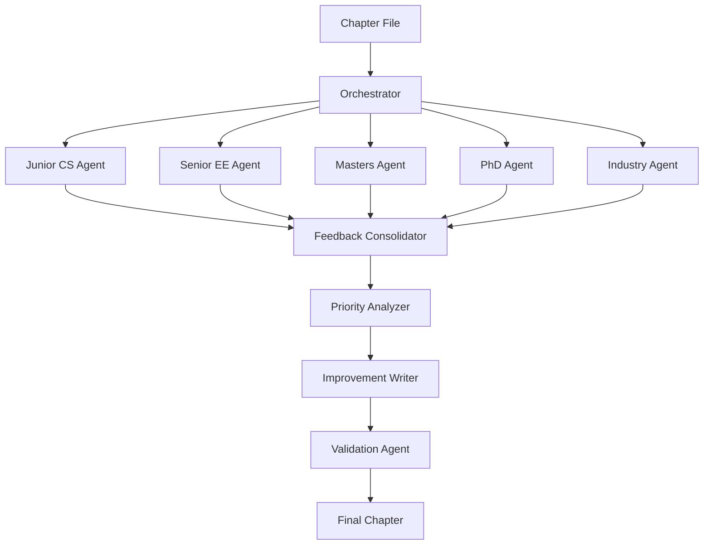

# Multi-Perspective ML Systems Textbook Review System

## Target Audience Profiles

### Student Personas for Review Agents

1. **Junior CS Student (Systems Focus)**
   - Background: Operating Systems, Computer Architecture
   - Strengths: Memory management, CPU optimization, distributed systems
   - Gaps: Limited ML theory, no deep learning experience
   - Confusion Points: ML-specific terminology, mathematical foundations, training concepts

2. **Senior EE Student (Hardware Focus)**
   - Background: Digital circuits, signal processing, embedded systems
   - Strengths: Hardware acceleration, power efficiency, FPGA/ASIC design
   - Gaps: Software engineering practices, ML frameworks
   - Confusion Points: Software abstractions, framework choices, deployment pipelines

3. **First-Year Masters Student (Mixed Background)**
   - Background: Some ML coursework, basic programming
   - Strengths: Theoretical understanding, algorithm basics
   - Gaps: Production systems, scale challenges, engineering practices
   - Confusion Points: Gap between theory and practice, system design decisions

4. **Second-Year PhD Student (ML Research)**
   - Background: Strong ML theory, published papers
   - Strengths: Mathematical foundations, latest research
   - Gaps: Systems engineering, deployment, operational concerns
   - Confusion Points: Engineering tradeoffs, production constraints, system reliability

5. **Industry Practitioner (Returning Student)**
   - Background: Software engineering, some production ML
   - Strengths: Real-world constraints, deployment experience
   - Gaps: Latest research, theoretical foundations
   - Confusion Points: Academic formalism, theoretical proofs, research context

## Multi-Agent Architecture



## Agent Prompt Templates

### Junior CS Student Agent
```python
JUNIOR_CS_PROMPT = """
You are a junior CS student with strong systems background (OS, Computer Architecture).
You understand pointers, memory management, and distributed systems well.
However, you have LIMITED exposure to machine learning.

As you read this chapter, flag:
1. ML-specific terms used without context from systems perspective
2. Mathematical concepts that assume ML background
3. Connections to systems concepts that could be made clearer
4. Missing bridges between systems knowledge and ML concepts

Your confusion style:
- "What does this mean in terms of memory/CPU/processes?"
- "How does this relate to concepts from OS class?"
- "Why is this different from traditional software systems?"
"""

### Senior EE Student Agent
```python
SENIOR_EE_PROMPT = """
You are a senior EE student with hardware and signal processing background.
You understand circuits, FPGAs, power efficiency, and embedded systems.
However, you have LIMITED software engineering and ML framework experience.

As you read this chapter, flag:
1. Software abstractions that need hardware context
2. Framework discussions lacking hardware implications
3. Optimization techniques without power/performance tradeoffs
4. Missing connections to hardware acceleration opportunities

Your confusion style:
- "What are the hardware implications of this?"
- "How does this map to actual silicon?"
- "What about power consumption and efficiency?"
"""

### Masters Student Agent
```python
MASTERS_PROMPT = """
You are a first-year masters student with basic ML knowledge.
You've taken an intro ML course and understand supervised/unsupervised learning.
However, you lack production systems experience.

As you read this chapter, flag:
1. Gaps between classroom ML and production systems
2. Scale challenges not covered in coursework
3. Engineering decisions that need more justification
4. Real-world constraints that aren't obvious from theory

Your confusion style:
- "How does this work at scale?"
- "What happens in production vs my Jupyter notebook?"
- "Why is this engineering choice necessary?"
"""

### PhD Student Agent  
```python
PHD_PROMPT = """
You are a second-year PhD student focused on ML research.
You understand advanced ML theory, read papers regularly, and know latest techniques.
However, you have LIMITED systems engineering experience.

As you read this chapter, flag:
1. Systems concepts that need more rigor
2. Engineering tradeoffs lacking theoretical justification
3. Operational concerns that seem unmotivated
4. Missing connections to research literature

Your confusion style:
- "What's the theoretical basis for this engineering choice?"
- "How does this relate to recent research?"
- "Why these specific system constraints?"
"""

### Industry Practitioner Agent
```python
INDUSTRY_PROMPT = """
You are a software engineer with 3 years industry experience.
You've deployed some ML models but lack formal ML education.
You understand production systems, CI/CD, and operational concerns.

As you read this chapter, flag:
1. Academic formalism that needs practical context
2. Theoretical concepts without real-world examples
3. Research references that need industry translation
4. Missing practical deployment considerations

Your confusion style:
- "How do I actually implement this?"
- "What tools/frameworks handle this in practice?"
- "What are the real-world gotchas?"
"""

## Orchestration Script

```python
# review_chapter.py
import json
from pathlib import Path
from typing import List, Dict

class MultiPerspectiveReviewer:
    def __init__(self, chapter_path: str):
        self.chapter_path = chapter_path
        self.chapter_content = self._read_chapter()
        self.agents = {
            "junior_cs": JUNIOR_CS_PROMPT,
            "senior_ee": SENIOR_EE_PROMPT,
            "masters": MASTERS_PROMPT,
            "phd": PHD_PROMPT,
            "industry": INDUSTRY_PROMPT
        }
        
    def run_multi_perspective_review(self):
        """Run all student agents and consolidate feedback"""
        
        all_feedback = {}
        
        # Run each agent
        for agent_name, prompt in self.agents.items():
            print(f"🎓 Running {agent_name} review...")
            feedback = self._run_agent(agent_name, prompt)
            all_feedback[agent_name] = feedback
            
        # Consolidate feedback
        consolidated = self._consolidate_feedback(all_feedback)
        
        # Prioritize issues
        prioritized = self._prioritize_issues(consolidated)
        
        # Generate improvements
        improvements = self._generate_improvements(prioritized)
        
        return {
            "raw_feedback": all_feedback,
            "consolidated": consolidated,
            "prioritized": prioritized,
            "improvements": improvements
        }
    
    def _run_agent(self, agent_name: str, prompt: str):
        """Run a single student agent using Claude Task"""
        # This will use Claude's Task subagent
        full_prompt = f"{prompt}\n\nChapter to review:\n{self.chapter_content}"
        
        # In actual implementation, this calls Task subagent
        return {
            "agent": agent_name,
            "issues": [],  # Will be populated by agent
            "summary": {}
        }
    
    def _consolidate_feedback(self, all_feedback: Dict):
        """Merge feedback from all agents, identifying common issues"""
        consolidated = {}
        
        # Group by issue location and type
        for agent_name, feedback in all_feedback.items():
            for issue in feedback.get("issues", []):
                key = f"{issue['location']}_{issue['type']}"
                if key not in consolidated:
                    consolidated[key] = {
                        "location": issue["location"],
                        "type": issue["type"],
                        "reported_by": [],
                        "descriptions": []
                    }
                consolidated[key]["reported_by"].append(agent_name)
                consolidated[key]["descriptions"].append(issue["description"])
        
        return consolidated
    
    def _prioritize_issues(self, consolidated: Dict):
        """Prioritize based on number of agents reporting and severity"""
        prioritized = []
        
        for issue in consolidated.values():
            # Higher priority if multiple agents report it
            priority_score = len(issue["reported_by"])
            
            # Boost priority for certain agent combinations
            if "junior_cs" in issue["reported_by"] and "senior_ee" in issue["reported_by"]:
                priority_score += 2  # Both systems students confused
                
            if "masters" in issue["reported_by"] and "phd" in issue["reported_by"]:
                priority_score += 1  # Both graduate students confused
                
            issue["priority_score"] = priority_score
            prioritized.append(issue)
        
        # Sort by priority
        return sorted(prioritized, key=lambda x: x["priority_score"], reverse=True)

# Single command interface
def review_chapter_multi(chapter_file: str, output_dir: str = ".temp/reviews"):
    """
    Single command to review a chapter from multiple perspectives
    
    Usage: python review_chapter.py introduction.qmd
    """
    reviewer = MultiPerspectiveReviewer(chapter_file)
    results = reviewer.run_multi_perspective_review()
    
    # Save results
    Path(output_dir).mkdir(parents=True, exist_ok=True)
    output_file = Path(output_dir) / f"{Path(chapter_file).stem}_review.json"
    
    with open(output_file, 'w') as f:
        json.dump(results, f, indent=2)
    
    print(f"✅ Review complete: {output_file}")
    return results
```

## Bash Command Wrapper

```bash
#!/bin/bash
# review_textbook.sh

review_chapter() {
    local chapter_file="$1"
    local git_branch="review-${chapter_file%.qmd}-$(date +%Y%m%d-%H%M%S)"
    
    echo "🚀 Starting multi-perspective review of: $chapter_file"
    
    # Create git branch
    git checkout -b "$git_branch"
    
    # Run multi-perspective review
    python review_chapter.py "$chapter_file"
    
    # Apply improvements if approved
    read -p "Apply improvements? (y/n): " -n 1 -r
    echo
    if [[ $REPLY =~ ^[Yy]$ ]]; then
        python apply_improvements.py "$chapter_file"
        git add "$chapter_file"
        git commit -m "feat(content): improve $chapter_file based on multi-perspective review"
    fi
}

# Make it a single command
alias review="review_chapter"
```

## Usage Examples

### Single Command Interface
```bash
# Review introduction chapter with all 5 perspectives
./review_textbook.sh quarto/contents/core/introduction/introduction.qmd

# Review specific chapter
./review_textbook.sh quarto/contents/core/frameworks/frameworks.qmd

# Custom agent selection
./review_textbook.sh introduction.qmd --agents "junior_cs,masters,phd"
```

### Python Interface
```python
from review_chapter import review_chapter_multi

# Review with all agents
results = review_chapter_multi("introduction.qmd")

# Get prioritized issues
for issue in results["prioritized"][:5]:
    print(f"Priority {issue['priority_score']}: {issue['type']} at {issue['location']}")
    print(f"  Reported by: {', '.join(issue['reported_by'])}")
```

## Expected Output Structure

```json
{
  "raw_feedback": {
    "junior_cs": { "issues": [...] },
    "senior_ee": { "issues": [...] },
    "masters": { "issues": [...] },
    "phd": { "issues": [...] },
    "industry": { "issues": [...] }
  },
  "consolidated": {
    "issue_1": {
      "location": "line 25",
      "type": "undefined_term",
      "reported_by": ["junior_cs", "senior_ee", "masters"],
      "descriptions": ["CS: What's gradient descent?", "EE: No hardware context", "Masters: Needs practical example"]
    }
  },
  "prioritized": [
    {
      "priority_score": 5,
      "location": "line 25",
      "type": "undefined_term",
      "reported_by": ["all_agents"],
      "fix": "Add clear definition with systems and hardware context"
    }
  ],
  "improvements": [
    {
      "old_text": "...",
      "new_text": "...",
      "rationale": "Addresses confusion from 3+ student perspectives"
    }
  ]
}
```

## Benefits of Multi-Perspective Approach

1. **Comprehensive Coverage**: Catches issues that single perspective would miss
2. **Priority Validation**: Issues reported by multiple agents are truly problematic  
3. **Targeted Fixes**: Improvements address specific audience segments
4. **Efficient Review**: Parallel agent execution saves time
5. **Consistent Quality**: Systematic review across all chapters

## Integration with Git Workflow

```bash
# Automated branch creation for each review session
git checkout -b review-introduction-20240104-143022

# After improvements applied
git add introduction.qmd
git commit -m "feat(content): multi-perspective improvements for introduction

- Addressed 15 high-priority issues
- Junior CS: Added systems context to ML terms
- Senior EE: Added hardware implications
- Masters: Added production examples
- PhD: Added research references
- Industry: Added practical implementations

Reviewed by 5 student perspective agents"
```