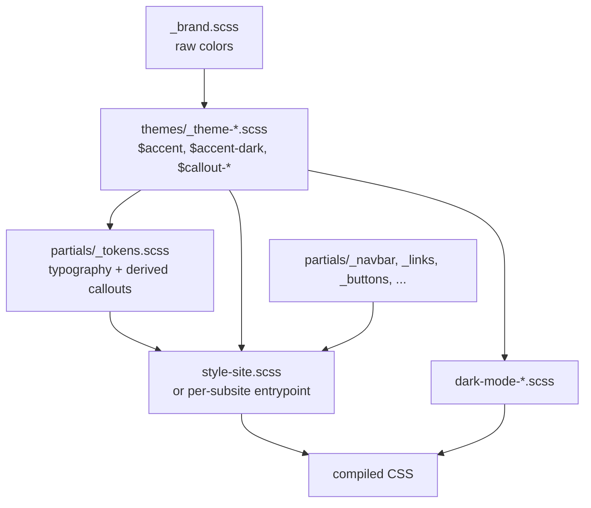

# Shared SCSS architecture

This directory holds the cross-site SCSS layer for the MLSysBook ecosystem.
Subsites import from here so the look & feel stays coherent across the
landing page, the textbook, labs, kits, slides, instructors, MLSys·im, and
TinyTorch.

## File map

```
shared/styles/
├── _brand.scss               # raw brand colours (single source of truth)
├── _ecosystem-base.scss      # light-mode ecosystem defaults
├── _ecosystem-base-dark.scss # dark-mode ecosystem defaults
├── _site-dark.scss           # dark-mode rules used by the site (landing/about/etc.)
├── _book-only.scss           # textbook-only rules
├── _book-only-dark.scss      # textbook-only dark-mode rules
├── style-site.scss           # entrypoint for site pages (landing/about/community/newsletter)
├── dark-mode-site.scss       # dark-mode entrypoint for site pages
├── BRAND.md                  # palette + non-SCSS hardcoded reference list
├── partials/
│   ├── _tokens.scss          # typography + callout palette (depends on theme $accent)
│   ├── _navbar.scss
│   ├── _sidebar.scss
│   ├── _buttons.scss
│   ├── _links.scss
│   ├── _headers.scss
│   ├── _toc.scss
│   ├── _tables.scss
│   ├── _blockquotes.scss
│   ├── _figures.scss
│   ├── _callouts.scss
│   └── _mobile.scss
└── themes/
    ├── _theme-harvard.scss   # Vol I + site (Harvard Crimson)
    ├── _theme-eth.scss       # Vol II (ETH Blue)
    ├── _theme-labs.scss
    ├── _theme-kits.scss
    ├── _theme-instructors.scss
    └── _theme-tinytorch.scss
```

## Layering contract



Concretely:

1. `_brand.scss` defines raw hex values once.
2. A theme file (`_theme-harvard.scss`, `_theme-eth.scss`, ...) imports
   `_brand.scss` and exposes semantic variables `$accent`, `$accent-dark`,
   `$callout-info`, `$callout-success`, `$callout-caution`, `$callout-secondary`.
3. `partials/_tokens.scss` and the rest of the partials assume those
   semantic variables already exist.
4. A site entrypoint (e.g. `style-site.scss` or
   [`book/quarto/assets/styles/style-vol1.scss`](../../book/quarto/assets/styles/style-vol1.scss))
   imports the theme first, then `_tokens`, then any partials it needs.
5. Dark-mode entrypoints (`dark-mode-*.scss`) re-import the theme so
   `$accent-dark` is in scope, then layer dark-only rules.

The `/*-- scss:defaults --*/` and `/*-- scss:rules --*/` markers are Quarto's
way of separating Sass variable defaults from CSS rules; keep them aligned
with this layering.

## Per-subsite entrypoints

| Subsite          | Light entry | Dark entry |
|------------------|-------------|------------|
| Site (landing/about/community/newsletter) | [`shared/styles/style-site.scss`](style-site.scss) | [`shared/styles/dark-mode-site.scss`](dark-mode-site.scss) |
| Book Vol I       | [`book/quarto/assets/styles/style-vol1.scss`](../../book/quarto/assets/styles/style-vol1.scss) | [`book/quarto/assets/styles/dark-mode-vol1.scss`](../../book/quarto/assets/styles/dark-mode-vol1.scss) |
| Book Vol II      | [`book/quarto/assets/styles/style-vol2.scss`](../../book/quarto/assets/styles/style-vol2.scss) | [`book/quarto/assets/styles/dark-mode-vol2.scss`](../../book/quarto/assets/styles/dark-mode-vol2.scss) |
| Labs             | [`labs/assets/styles/style.scss`](../../labs/assets/styles/style.scss) | [`labs/assets/styles/dark-mode.scss`](../../labs/assets/styles/dark-mode.scss) |
| Kits             | [`kits/assets/styles/style.scss`](../../kits/assets/styles/style.scss) | [`kits/assets/styles/dark-mode.scss`](../../kits/assets/styles/dark-mode.scss) |
| Slides           | [`slides/assets/styles/style.scss`](../../slides/assets/styles/style.scss) | [`slides/assets/styles/dark-mode.scss`](../../slides/assets/styles/dark-mode.scss) |
| Instructors      | [`instructors/assets/styles/style.scss`](../../instructors/assets/styles/style.scss) | [`instructors/assets/styles/dark-mode.scss`](../../instructors/assets/styles/dark-mode.scss) |
| MLSys·im docs    | [`mlsysim/docs/styles/style.scss`](../../mlsysim/docs/styles/style.scss) | [`mlsysim/docs/styles/dark-mode.scss`](../../mlsysim/docs/styles/dark-mode.scss) |
| TinyTorch (Quarto)| [`tinytorch/site-quarto/assets/styles/style.scss`](../../tinytorch/site-quarto/assets/styles/style.scss) | [`tinytorch/site-quarto/assets/styles/dark-mode.scss`](../../tinytorch/site-quarto/assets/styles/dark-mode.scss) |

The book Vol I / Vol II theme files in [`book/quarto/assets/styles/themes/`](../../book/quarto/assets/styles/themes/)
are **symlinks** to the canonical files in [`shared/styles/themes/`](themes/).

## Brand palette

See [`BRAND.md`](BRAND.md) for the canonical palette and the list of
non-SCSS surfaces (HTML configs, plain CSS, SVG, JS, Python) that still
hardcode colour values.

## Conventions

- Edit raw colours **only** in [`_brand.scss`](_brand.scss).
- New shared component → add to `partials/` and import explicitly from each
  entrypoint that needs it (do not auto-import everything; some subsites
  intentionally skip e.g. callouts).
- New ecosystem subsite → create a `themes/_theme-<subsite>.scss` that
  imports `_brand.scss` and defines `$accent` / `$accent-dark`, then point
  the subsite's `style.scss` at it.
- Light/dark are still separate files for now; merging them via
  `prefers-color-scheme` media queries is a future cleanup.
