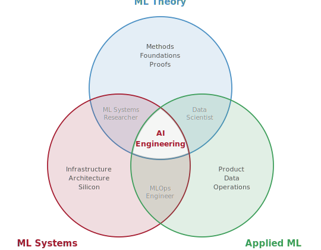

::: {.content-visible when-format="html"}

```{=html}
<div class="about-hero">
  <p class="about-eyebrow">ABOUT</p>
  <h1 class="about-title">From a classroom<br/>to six continents.</h1>
  <p class="about-tagline">An open-source curriculum that grew into a global movement for AI engineering education.</p>
</div>
```

## Mission {#mission}

```{=html}
<div class="about-section">

<div style="background: var(--ab-card-bg); border: 1px solid var(--ab-border); border-radius: 12px; padding: 2rem; margin-bottom: 2rem; text-align: center;">
  <p style="font-family: 'Inter', sans-serif; font-size: 1.1rem; font-weight: 700; color: var(--ab-text); line-height: 1.5; margin: 0; max-width: 650px; margin-left: auto; margin-right: auto;">To establish AI engineering as a foundational discipline, alongside software engineering and computer engineering, by teaching how to design, build, and evaluate end-to-end intelligent systems.</p>
</div>
```

**AI engineering is the discipline of building efficient, reliable, safe, and robust intelligent systems that operate in the real world, not just models in isolation.**

Software engineering brought that rigor to code. Computer engineering brought it to hardware. AI engineering brings it to intelligent systems, sitting at the intersection of ML theory (understanding *why* models work), ML systems (understanding *how* to make them run), and applied ML (understanding *what* to build and for whom).

```{=html}
<div style="text-align: center; margin: 1.5rem 0;">
  
</div>
```

The world is rushing to build AI. It is not engineering it.

Students today learn algorithms divorced from the silicon that executes them, the memory hierarchies that constrain them, and the networks that distribute them. They can call `model.fit()` but cannot reason about *why* their model is slow, *where* the bottleneck lives, or *how* to fix it without guessing. The education pipeline has not kept pace with the industry it feeds.

**Machine Learning Systems**, the textbook and its educational ecosystem, exists to close that gap. Our thesis is simple: *constraints drive architecture.* You do not choose a Transformer because it is trendy; you choose it because of how it parallelizes on real silicon. We teach AI as infrastructure, governed by physical laws, shaped by engineering constraints, and measurable through quantitative reasoning.

This approach draws on a tradition that goes back decades. Hennessy and Patterson showed that computer architecture could be taught through quantitative reasoning. Andrew Ng showed that ML education could reach millions. We draw on both traditions to build something new.

But a textbook and all its associated materials only matter if they reach the people who need them. Right now, millions of engineers are building AI systems without understanding the infrastructure beneath them. We cannot fix that one classroom at a time.

So we made everything free. We open-sourced every chapter, every lab, every slide deck. We built a global network of 40+ universities who teach from the curriculum at their own institutions. We ship hardware kits to classrooms that could not otherwise afford them. And we set a goal:

```{=html}
<div style="text-align: center; margin: 2rem 0; background: var(--ab-card-bg); border: 1px solid var(--ab-border); border-radius: 12px; padding: 2rem 1.5rem;">
  <div style="font-family: 'Inter', sans-serif; font-size: 2.5rem; font-weight: 800; color: var(--ab-accent); line-height: 1;">1,000,000</div>
  <div style="font-family: 'Inter', sans-serif; font-size: 0.85rem; font-weight: 500; color: var(--ab-text-muted); margin-top: 0.35rem;">One million learners by 2030</div>
</div>
```

It started with one course at one university in 2020. Within two years, ten universities had adopted it. Today it is forty, across six continents — and the growth has been entirely organic. No marketing, no ad spend, just word of mouth from people who found it useful:

```{=html}
<div style="text-align: center; margin: 1.5rem 0 2rem; background: var(--ab-card-bg); border: 1px solid var(--ab-border); border-radius: 12px; padding: 1.5rem;">
  <a href="https://www.star-history.com/?repos=harvard-edge%2Fcs249r_book&type=date&legend=top-left" target="_blank" rel="noopener">
    <picture>
      <source media="(prefers-color-scheme: dark)" srcset="https://api.star-history.com/image?repos=harvard-edge/cs249r_book&type=date&theme=dark&legend=top-left" />
      <source media="(prefers-color-scheme: light)" srcset="https://api.star-history.com/image?repos=harvard-edge/cs249r_book&type=date&legend=top-left" />
      
    </picture>
  </a>
  <p style="color: var(--ab-text-muted); font-size: 0.85rem; margin: 1rem 0 0;">Everything here is free — our only ask is a <a href="https://github.com/harvard-edge/cs249r_book" target="_blank" rel="noopener" style="color: var(--ab-accent); font-weight: 600;">⭐ star on GitHub</a>. It tells universities, publishers, and funders that AI engineering education matters.</p>
</div>
</div>
```

```{=html}
<hr class="about-divider" />
```

## How We Teach {#approach}

```{=html}
<div class="about-section">
```

These principles guide every chapter, lab, and lecture deck in the curriculum:

```{=html}
<div class="pillar-grid">
  <div class="pillar-card">
    <div class="pillar-icon">⚙️</div>
    <h3>Principles Over APIs</h3>
    <p>We teach the physics beneath the framework. Memory hierarchies, not <code>torch.cuda()</code>. Arithmetic intensity, not library calls. Knowledge that endures beyond any single tool.</p>
  </div>
  <div class="pillar-card">
    <div class="pillar-icon">📐</div>
    <h3>Quantitative Reasoning</h3>
    <p>Every claim is backed by a number. Students learn to estimate, measure, and verify — the same skills that separate a systems engineer from a script runner.</p>
  </div>
  <div class="pillar-card">
    <div class="pillar-icon">🌍</div>
    <h3>Open and Global</h3>
    <p>Free HTML, PDF, and EPUB. Used at universities across six continents. Licensed under CC-BY-NC-SA 4.0 so anyone can teach from it, adapt it, and build on it.</p>
  </div>
  <div class="pillar-card">
    <div class="pillar-icon">🔬</div>
    <h3>Full-Stack Curriculum</h3>
    <p>Not just a textbook. TinyTorch, hardware kits, interactive labs, lecture slides, and instructor resources — everything needed to teach a two-semester course.</p>
  </div>
</div>

<div class="stats-strip">
  <div class="stat-item">
    <span class="stat-number" id="stat-stars">22,800+</span>
    <span class="stat-label">GitHub Stars</span>
  </div>
  <div class="stat-item">
    <span class="stat-number">32</span>
    <span class="stat-label">Chapters</span>
  </div>
  <div class="stat-item">
    <span class="stat-number">35+</span>
    <span class="stat-label">Lecture Decks</span>
  </div>
  <div class="stat-item">
    <span class="stat-number">20</span>
    <span class="stat-label">TinyTorch Modules</span>
  </div>
  <div class="stat-item">
    <span class="stat-number">95+</span>
    <span class="stat-label">Contributors</span>
  </div>
  <div class="stat-item">
    <span class="stat-number">40+</span>
    <span class="stat-label">Universities</span>
  </div>
  <div class="stat-item">
    <span class="stat-number">6</span>
    <span class="stat-label">Continents</span>
  </div>
</div>

<script>
(async () => {
  try {
    const r = await fetch('https://api.github.com/repos/harvard-edge/cs249r_book');
    if (!r.ok) return;
    const d = await r.json();
    const fmt = n => n >= 1000 ? (n/1000).toFixed(1).replace(/\.0$/,'') + 'k+' : n + '+';
    document.getElementById('stat-stars').textContent = fmt(d.stargazers_count);
  } catch(e) {}
})();
</script>
</div>
```

```{=html}
<hr class="about-divider" />
```

## Our Story {#story}

```{=html}
<div class="about-section">
```

```{=html}
<div class="timeline">
  <div class="timeline-item">
    <div class="timeline-year">2020</div>
    <div class="timeline-content">
      <h3>A course becomes a textbook</h3>
      <p><a href="https://sites.google.com/g.harvard.edu/tinyml-fall2020/home" target="_blank" rel="noopener">CS 249r</a> launches at Harvard, a graduate seminar on TinyML with no textbook. Course notes become the seed of one. In parallel, the <a href="https://www.edx.org/professional-certificate/harvardx-tiny-machine-learning" target="_blank" rel="noopener">edX TinyML Professional Certificate</a> goes live with Google and the tinyML Foundation, reaching thousands of learners worldwide.</p>
    </div>
  </div>
  <div class="timeline-item">
    <div class="timeline-year">2021</div>
    <div class="timeline-content">
      <h3>The global network forms</h3>
      <p>A partnership with <a href="https://www.ictp.it" target="_blank" rel="noopener">ICTP</a> in Trieste creates the TinyML4D Academic Network. Twenty universities across Latin America, Africa, and Asia join the first cohort, each receiving curriculum, mentorship, and hardware kits. The annual <a href="https://tinyml.seas.harvard.edu/SciTinyML" target="_blank" rel="noopener">SciTinyML</a> workshop series begins.</p>
    </div>
  </div>
  <div class="timeline-item">
    <div class="timeline-year">2022</div>
    <div class="timeline-content">
      <h3>Open-source on GitHub</h3>
      <p>The textbook is published as an <a href="https://github.com/harvard-edge/cs249r_book" target="_blank" rel="noopener">open repository</a>. Educators and students from around the world begin contributing: fixing examples, proposing chapters, translating content. A second cohort doubles the TinyML4D network to 40+ universities.</p>
    </div>
  </div>
  <div class="timeline-item">
    <div class="timeline-year">2023</div>
    <div class="timeline-content">
      <h3>Community takes root</h3>
      <p>The repository passes 10,000 GitHub stars. Regional workshops expand to Morocco, Colombia, and Malawi. The monthly <a href="https://tinyml.seas.harvard.edu/showAndTell" target="_blank" rel="noopener">Show &amp; Tell</a> series, where students from 20+ countries demo projects on Zoom, becomes a fixture of the community calendar.</p>
    </div>
  </div>
  <div class="timeline-item">
    <div class="timeline-year">2024</div>
    <div class="timeline-content">
      <h3>Beyond TinyML</h3>
      <p>The textbook outgrows its TinyML origins. Students are asking about training at scale, distributed systems, and fleet orchestration — the full systems stack. Two volumes take shape: <em>Foundations</em> and <em>At Scale</em>. The site moves to <a href="https://mlsysbook.ai">mlsysbook.ai</a>. IEEE formally cites the work.</p>
    </div>
  </div>
  <div class="timeline-item">
    <div class="timeline-year">2025</div>
    <div class="timeline-content">
      <h3>A full curriculum</h3>
      <p>The project grows far beyond a textbook: <a href="https://mlsysbook.ai/tinytorch/" target="_blank" rel="noopener">TinyTorch</a> (a build-from-scratch ML framework), interactive Marimo labs, hardware deployment kits for Arduino and Seeed, lecture slides, an instructor hub, and an interview prep guide. <a href="https://mitpress.mit.edu" target="_blank" rel="noopener">MIT Press</a> signs on for a hardcover edition.</p>
    </div>
  </div>
  <div class="timeline-item timeline-current">
    <div class="timeline-year">2026</div>
    <div class="timeline-content">
      <h3>MIT Press publication</h3>
      <p>Two-volume hardcover edition forthcoming. Thousands of GitHub stars, 95+ contributors, and 40+ universities across six continents. The open-source edition remains free — always.</p>
    </div>
  </div>
</div>
```

```{=html}
</div>

<div class="about-section">
<div class="cta-banner">
  <h3>Start here</h3>
  <p>Whether you are a student, educator, researcher, or engineer — dive in.</p>
  <div class="cta-buttons">
    <a href="https://mlsysbook.ai/vol1/" class="cta-btn-primary">Start Reading →</a>
    <a href="people.html" class="cta-btn-secondary">Meet the People</a>
    <a href="https://mlsysbook.ai/community/" class="cta-btn-secondary">Join the Community</a>
  </div>
</div>
</div>
```

:::
