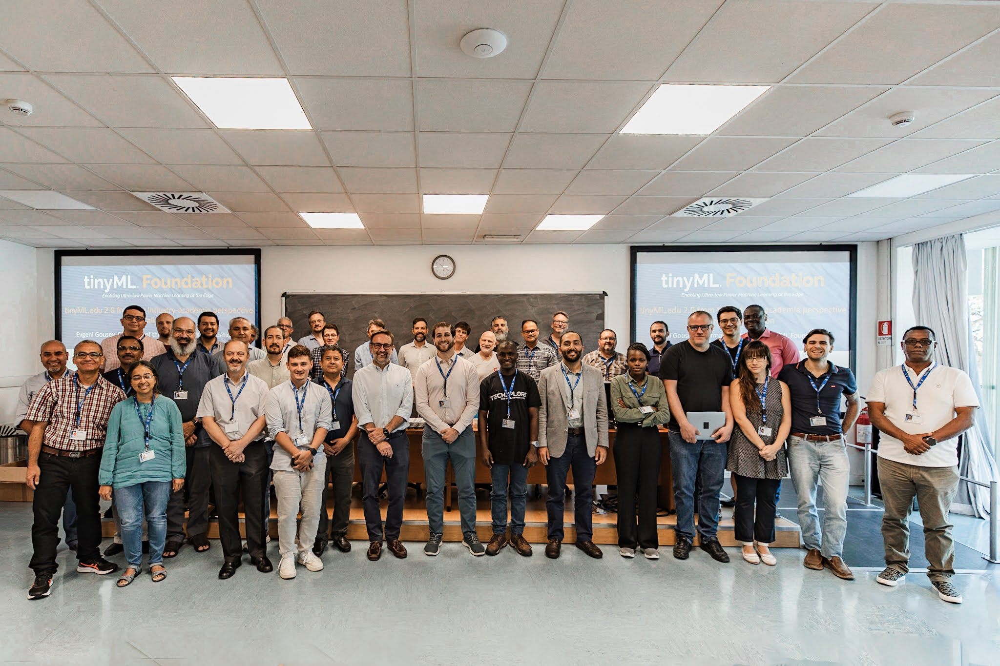
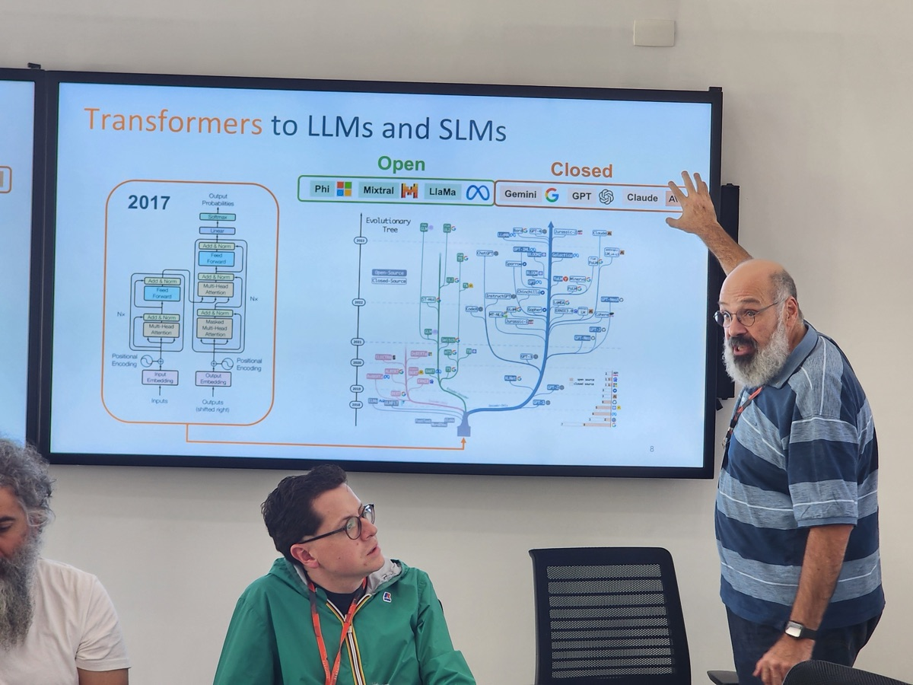
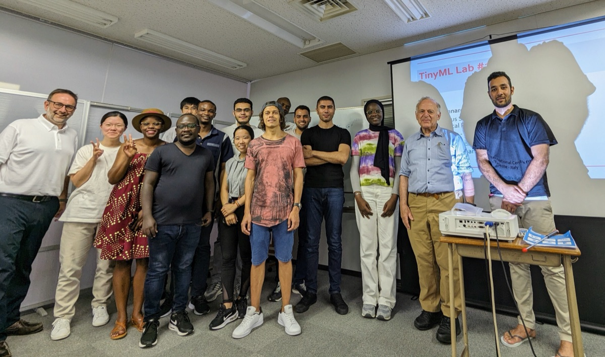
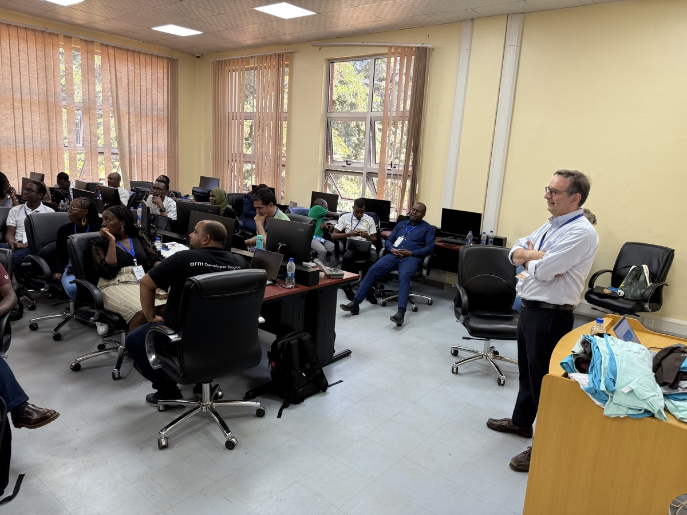
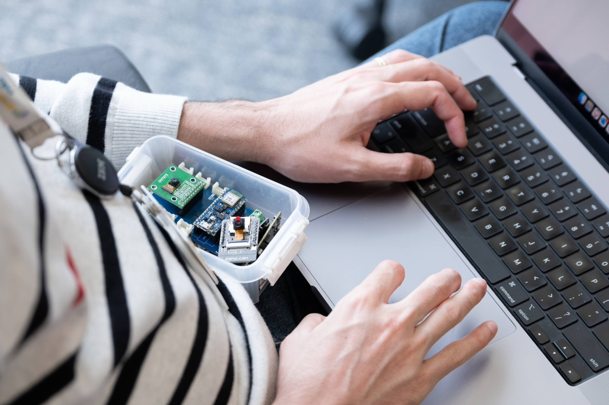
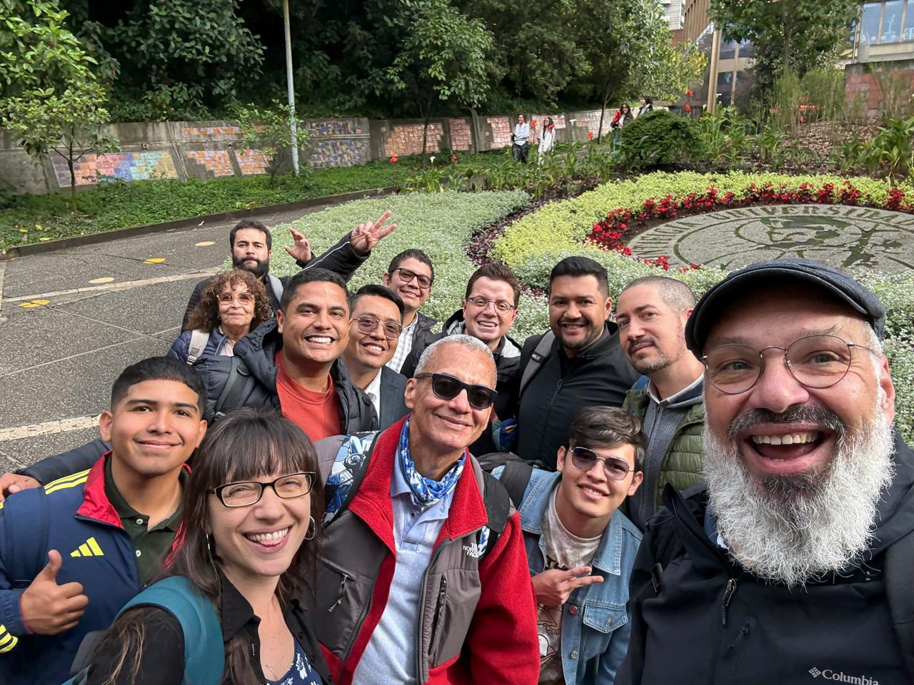
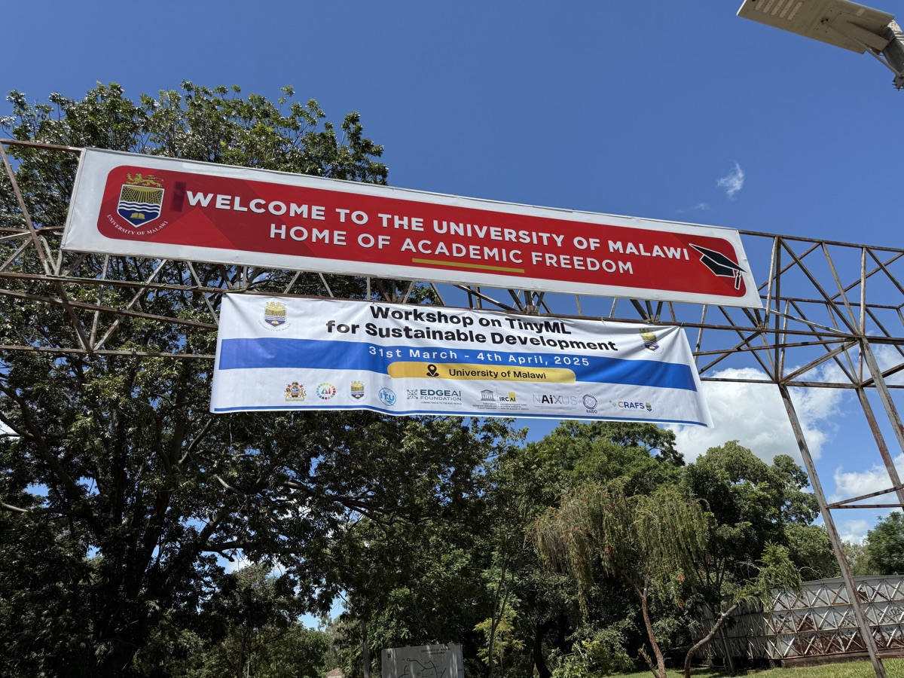

::: {.content-visible when-format="html"}

```{=html}
<div class="community-opening" style="padding-bottom: 1.5rem;">
  <p class="opening-eyebrow">WORKSHOPS & EVENTS</p>
  <h1 class="opening-title">Learn together.<br/>Build together.</h1>
  <p class="opening-body">From annual TinyML and EdgeAI research workshops at ICTP in Trieste to monthly student showcases on Zoom — the AI engineering education community gathers regularly to teach, learn, and share.</p>
</div>

<!-- ── Photo Carousel ──────────────────────────────────────────────────── -->
<div class="carousel-wrap" id="events-carousel">
  <div class="carousel-track" id="carousel-track">
    <div class="carousel-slide">
      
      <div class="carousel-caption">SciTinyML Workshop — ICTP Trieste, Italy · 2023</div>
    </div>
    <div class="carousel-slide">
      
      <div class="carousel-caption">Transformers to LLMs &amp; SLMs — IBM Brazil · 2024</div>
    </div>
    <div class="carousel-slide">
      
      <div class="carousel-caption">TinyML Lab — KIS Kobe, Japan · 2023</div>
    </div>
    <div class="carousel-slide">
      
      <div class="carousel-caption">TinyML for Sustainable Development — University of Malawi · 2025</div>
    </div>
    <div class="carousel-slide">
      
      <div class="carousel-caption">Hands-on with hardware kits — Brazil · 2024</div>
    </div>
    <div class="carousel-slide">
      
      <div class="carousel-caption">Workshop at Universidad Javeriana — Bogotá, Colombia · 2025</div>
    </div>
    <div class="carousel-slide">
      
      <div class="carousel-caption">University of Malawi — Workshop on TinyML for Sustainable Development · 2025</div>
    </div>
  </div>
  <button class="carousel-btn carousel-btn-prev" aria-label="Previous slide">‹</button>
  <button class="carousel-btn carousel-btn-next" aria-label="Next slide">›</button>
  <div class="carousel-dots" id="carousel-dots"></div>
</div>

<script>
(function() {
  const track = document.getElementById('carousel-track');
  const dotsWrap = document.getElementById('carousel-dots');
  const slides = track.querySelectorAll('.carousel-slide');
  const total = slides.length;
  let current = 0;
  let interval;

  // Build dots
  for (let i = 0; i < total; i++) {
    const dot = document.createElement('button');
    dot.className = 'carousel-dot' + (i === 0 ? ' active' : '');
    dot.setAttribute('aria-label', 'Go to slide ' + (i + 1));
    dot.addEventListener('click', function() { goTo(i); resetTimer(); });
    dotsWrap.appendChild(dot);
  }

  function goTo(n) {
    current = ((n % total) + total) % total;
    track.style.transform = 'translateX(-' + (current * 100) + '%)';
    dotsWrap.querySelectorAll('.carousel-dot').forEach((d, i) =>
      d.classList.toggle('active', i === current)
    );
  }

  function next() { goTo(current + 1); }
  function prev() { goTo(current - 1); }

  document.querySelector('.carousel-btn-next').addEventListener('click', () => { next(); resetTimer(); });
  document.querySelector('.carousel-btn-prev').addEventListener('click', () => { prev(); resetTimer(); });

  var DELAY = 6000;

  function resetTimer() {
    clearInterval(interval);
    interval = setInterval(next, DELAY);
  }

  // Auto-advance every 6 seconds
  interval = setInterval(next, DELAY);

  // Pause on hover, single-timer guard
  var wrap = document.getElementById('events-carousel');
  wrap.addEventListener('mouseenter', function() { clearInterval(interval); interval = null; });
  wrap.addEventListener('mouseleave', function() { if (!interval) { interval = setInterval(next, DELAY); } });
})();
</script>
```

## What We Do

The curriculum comes alive through hands-on workshops, community showcases, and free online courses — held on the ground and virtually, reaching learners across five continents.

Since 2021, we have run workshops in Trieste, Bogotá, Nairobi, Johannesburg, Macau, Malawi, Morocco, and dozens of virtual sessions. Whether it is a week-long research workshop at the International Centre for Theoretical Physics or a 30-minute student demo on Zoom, the goal is the same: bring people together to learn ML systems by building real things on real hardware.

```{=html}
<div class="outreach-grid" style="margin-top: 1.5rem;">

  <div class="outreach-card">
    <div class="outreach-icon"><i class="fas fa-flask"></i></div>
    <h3>SciTinyML Workshops</h3>
    <p>Our annual flagship workshop series, hosted with ICTP in Trieste. Researchers and students spend a week applying machine learning to scientific challenges on low-power devices — from environmental monitoring to health diagnostics. Regional editions have been held across Latin America and Africa.</p>
    <p style="margin-top: 0.75rem;">
      <a href="https://tinyml.seas.harvard.edu/SciTinyML" target="_blank" rel="noopener" class="event-link">SciTinyML website <i class="fas fa-arrow-right"></i></a>
    </p>
  </div>

  <div class="outreach-card">
    <div class="outreach-icon"><i class="fas fa-chalkboard-teacher"></i></div>
    <h3>Show & Tell</h3>
    <p>A monthly virtual session where students from 20+ countries present TinyML and EdgeAI projects — agriculture, healthcare, environmental monitoring, assistive technology. Classroom work, research, and lessons from failures are all welcome. Hundreds of past talks are archived on YouTube.</p>
    <p style="margin-top: 0.75rem;">
      <a href="https://tinyml.seas.harvard.edu/showAndTell" target="_blank" rel="noopener" class="event-link">Submit a talk <i class="fas fa-arrow-right"></i></a>
    </p>
  </div>

  <div class="outreach-card">
    <div class="outreach-icon"><i class="fas fa-graduation-cap"></i></div>
    <h3>Full Courses</h3>
    <p>Full-length courses on TinyML and EdgeAI — semester-scale offerings that go well beyond the workshop format. Built on the open curriculum and delivered through TinyMLedu, these are the anchor deployments adopted by universities worldwide.</p>
    <p style="margin-top: 0.75rem;">
      <a href="https://tinyml.seas.harvard.edu/courses/#full-courses" target="_blank" rel="noopener" class="event-link">Browse courses <i class="fas fa-arrow-right"></i></a>
    </p>
  </div>

</div>
```

```{=html}
<!-- ── Who Makes This Happen ──────────────────────────────────────────── -->
<h2 style="margin-top: 2.5rem;">Who Makes This Happen</h2>
<p style="font-family: 'Inter', sans-serif; font-size: 0.92rem; color: var(--cm-text-muted); margin-bottom: 1.25rem;">
  These workshops and programs are built by a global team of educators and organizers who volunteer their time, expertise, and institutional support.
</p>

<div class="organizer-grid">
  <a href="/about/people.html" class="organizer-card">
    
    <div class="organizer-info">
      <strong>Vijay Janapa Reddi</strong>
      <span>Lead Author · Harvard University</span>
    </div>
  </a>
  <a href="/about/people.html" class="organizer-card">
    
    <div class="organizer-info">
      <strong>Marco Zennaro</strong>
      <span>TinyML4D Chair · ICTP, Italy</span>
    </div>
  </a>
  <a href="/about/people.html" class="organizer-card">
    
    <div class="organizer-info">
      <strong>Brian Plancher</strong>
      <span>TinyMLedu Co-Chair · Dartmouth College</span>
    </div>
  </a>
  <a href="/about/people.html" class="organizer-card">
    
    <div class="organizer-info">
      <strong>Marcelo Rovai</strong>
      <span>Hardware Kits Lead · UNIFEI, Brazil</span>
    </div>
  </a>
  <a href="/about/people.html" class="organizer-card">
    
    <div class="organizer-info">
      <strong>Diego Méndez Chaves</strong>
      <span>Regional Lead · Latin America · Universidad Javeriana</span>
    </div>
  </a>
  <a href="/about/people.html" class="organizer-card">
    
    <div class="organizer-info">
      <strong>Jeremy Ellis</strong>
      <span>Show &amp; Tell Chair · BC, Canada</span>
    </div>
  </a>
</div>

<p style="text-align: center; font-family: 'Inter', sans-serif; font-size: 0.88rem; color: var(--cm-text-muted); margin-top: 1.75rem;">
  Workshops and programs are hosted and supported by a network of academic and nonprofit partners —
  see <a href="/community/partners.html" style="color: var(--cm-accent); font-weight: 600;">Partners &amp; Sponsors</a>.
</p>

<p style="font-family: 'Inter', sans-serif; font-size: 0.82rem; color: var(--cm-text-muted); margin-top: 0.75rem; text-align: center;">
  Plus <a href="/about/people.html" style="color: var(--cm-accent); font-weight: 600;">50+ global educators</a> who run regional workshops and champion ML systems education at their home institutions.
</p>

<div class="sponsor-cta-banner" style="margin-top: 2.5rem;">
  <div class="sponsor-cta-icon"><i class="fas fa-calendar-alt"></i></div>
  <h3>Get Involved</h3>
  <p>Want to present at Show & Tell, host a workshop at your institution, or just see what's coming up? Get in touch.</p>
  <div class="sponsor-cta-actions">
    <a href="https://tinyml.seas.harvard.edu/" target="_blank" rel="noopener" class="cta-btn-primary">
      <i class="fas fa-external-link-alt"></i> TinyMLedu Events Hub
    </a>
    <a href="/about/people.html" class="cta-btn-secondary">
      <i class="fas fa-users"></i> Meet the Team
    </a>
    <a href="mailto:edu@tinyML.org" class="cta-btn-secondary">
      <i class="fas fa-envelope"></i> Contact Us
    </a>
    <a href="https://www.youtube.com/playlist?list=PLL5nb-tgetJhpCtybAI7Epkiy_fUiIhwm" target="_blank" rel="noopener" class="cta-btn-secondary">
      <i class="fab fa-youtube"></i> Watch Recordings
    </a>
  </div>
</div>
```

:::
