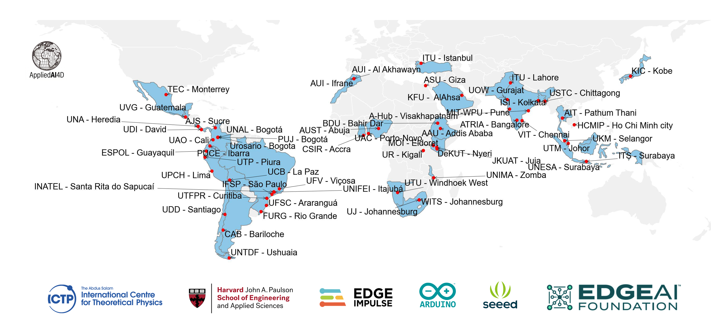

::: {.content-visible when-format="html"}

```{=html}
<div class="community-opening" style="padding-bottom: 1.5rem;">
  <p class="opening-eyebrow">GLOBAL NETWORK</p>
  <h1 class="opening-title">AI engineering education<br/>belongs to everyone.</h1>
  <p class="opening-body">Machine Learning Systems is taught at 40+ universities across six continents — from Bogotá to Johannesburg, from Kobe to Nairobi. Every chapter and lab is open and free — and we ship hardware kits to partner universities that need them.</p>
</div>
```

```{=html}
<!-- ── The Global Network ────────────────────────────────────────────── -->
<div class="network-map-wrap">
  
  <p class="map-caption">The TinyML4D Academic Network — 40+ partner universities teaching ML systems.</p>
</div>

<div class="stats-row">
  <div class="stat"><span class="stat-num" id="cm-stars">22,800+</span><span class="stat-lbl">GitHub Stars</span></div>
  <div class="stat"><span class="stat-num">95+</span><span class="stat-lbl">Contributors</span></div>
  <div class="stat"><span class="stat-num">40+</span><span class="stat-lbl">Universities</span></div>
  <div class="stat"><span class="stat-num">6</span><span class="stat-lbl">Continents</span></div>
</div>

<script>
(async () => {
  try {
    const r = await fetch('https://api.github.com/repos/harvard-edge/cs249r_book');
    if (!r.ok) return;
    const d = await r.json();
    const fmt = n => n >= 1000 ? (n/1000).toFixed(1).replace(/\.0$/,'') + 'k+' : n + '+';
    document.getElementById('cm-stars').textContent = fmt(d.stargazers_count);
  } catch(e) {}
})();
</script>
```

```{=html}
<!-- ── Global Readership ─────────────────────────────────────────────── -->
<div class="readership-section">
  <h2 class="readership-heading">Global Readership</h2>
  <p class="readership-intro">243,000+ readers across 180+ countries — thank you for making this community what it is.</p>
  <div class="looker-wrap">
    <iframe
      src="https://lookerstudio.google.com/embed/reporting/e7192975-a8a0-453d-b6fe-1580ac054dbf/page/0pNbE"
      title="Global readership map — 243,000+ readers across 180+ countries"
      allowfullscreen="allowfullscreen"
      loading="lazy"
      sandbox="allow-storage-access-by-user-activation allow-scripts allow-same-origin allow-popups allow-popups-to-escape-sandbox">
    </iframe>
  </div>
</div>
```

```{=html}
<!-- ── Voices from the Community ─────────────────────────────────────── -->
<div class="spotlight-grid">
  <div class="spotlight">
    <blockquote class="spotlight-quote">
      "This was the first time our students could run a neural network on real hardware they could hold in their hands. That changes how they think about ML — it's not abstract anymore."
    </blockquote>
    <div class="spotlight-attribution">
      <strong>Student voice</strong><br/>TinyML4D partner university
    </div>
  </div>
  <div class="spotlight">
    <blockquote class="spotlight-quote">
      "Before this curriculum, our students had no way to learn ML systems with real hardware. The kits and course materials changed what we could teach."
    </blockquote>
    <div class="spotlight-attribution">
      <strong>Marcelo Rovai</strong><br/>Professor, UNIFEI, Brazil
    </div>
  </div>
</div>
```

## How We Reach Learners {#outreach}

Every chapter is free to read — but access means more than a URL. It means hardware, training, and showing up in person.

```{=html}
<div class="outreach-grid">
  <div class="outreach-card">
    <div class="outreach-icon"><i class="fas fa-microchip"></i></div>
    <h3>Hardware Where It's Needed</h3>
    <p>We ship real hardware — Arduino and Seeed edge devices — to partner universities that couldn't otherwise afford them. Students learn on real silicon, not just simulations.</p>
  </div>
  <div class="outreach-card">
    <div class="outreach-icon"><i class="fas fa-flask"></i></div>
    <h3>Workshops on the Ground</h3>
    <p>The annual SciTinyML workshop series at ICTP in Trieste brings researchers and students together to apply ML to scientific challenges — from environmental monitoring to health diagnostics. Regional editions run across Latin America and Africa.</p>
  </div>
  <div class="outreach-card">
    <div class="outreach-icon"><i class="fas fa-chalkboard-teacher"></i></div>
    <h3>Instructor Support</h3>
    <p>Partner universities receive curriculum materials, lecture slides, and mentorship. The TinyML4D network connects educators across institutions so no one is teaching alone.</p>
  </div>
  <div class="outreach-card">
    <div class="outreach-icon"><i class="fas fa-book-open"></i></div>
    <h3>Free and Open — Always</h3>
    <p>The full two-volume textbook is available as free HTML, PDF, and EPUB. The edX Professional Certificate reaches hundreds of thousands of learners. Everything is CC-BY-NC-SA licensed.</p>
  </div>
</div>
```

## Get Involved {#get-involved}

```{=html}
<div class="sponsor-cta-banner">
  <div class="sponsor-cta-icon"><i class="fas fa-hands-helping"></i></div>
  <h3>Join the Network</h3>
  <p>Whether you are a student, educator, researcher, or engineer — there is a place for you in the AI engineering education community.</p>
  <div class="sponsor-cta-actions">
    <a href="mailto:edu@tinyML.org" class="cta-btn-primary">
      <i class="fas fa-envelope"></i> Become a Member
    </a>
    <a href="https://github.com/harvard-edge/cs249r_book/discussions" target="_blank" rel="noopener" class="cta-btn-secondary">
      <i class="fab fa-github"></i> Discussions
    </a>
    <a href="https://discuss.tinymlx.org" target="_blank" rel="noopener" class="cta-btn-secondary">
      <i class="fas fa-comments"></i> Forum
    </a>
  </div>
</div>
```

:::
